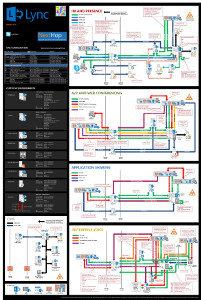

# Diagrammi tecnici per Lync Server 2013

 

_**Argomento Ultima modifica:** 2014-03-14_

**Riepilogo:** questi diagrammi contengono rappresentazioni visive delle soluzioni consigliate per Lync 2013.

Queste risorse sono disponibili in formato Visio (con estensione VSD) (Visio 2010 o Visio 2013) e in formato PDF. Per informazioni su come stampare i documenti, vedere Suggerimenti per la stampa di manifesti.

Potrebbe essere necessario un software aggiuntivo per visualizzare questi file. Per altre informazioni, vedere la tabella seguente.

<table>
<colgroup>
<col style="width: 50%" />
<col style="width: 50%" />
</colgroup>
<thead>
<tr class="header">
<th>Tipo di file</th>
<th>Software</th>
</tr>
</thead>
<tbody>
<tr class="odd">
<td>
. vsd
</td>
<td>
Visio 2010, Visio 2013 o il <a href="http://go.microsoft.com/fwlink/?linkid=393676">Visualizzatore di Visio gratuito</a>

Se si usa il Visualizzatore di Visio, fare clic con il pulsante destro del mouse sul collegamento VSD, scegliere <strong>Salva destinazione con nome</strong>, salvare il file nel computer e quindi aprire il file dal computer.
</td>
</tr>
<tr class="even">
<td>
. pdf
</td>
<td>
Qualsiasi visualizzatore PDF, ad esempio <a href="http://go.microsoft.com/fwlink/?linkid=393675">Adobe Reader</a>
</td>
</tr>
<tr class="odd">
<td>
. zip
</td>
<td>
Qualsiasi utilità di compressione dei file. Windows 7 e 8 aprono questi file in modo nativo.
</td>
</tr>
</tbody>
</table>

## Manifesti

Questi poster illustrano in dettaglio uno specifico ambito tecnico e sono destinati a essere usati con gli articoli corrispondenti su TechNet o il contenuto disponibile nell'area download.

<table>
<colgroup>
<col style="width: 50%" />
<col style="width: 50%" />
</colgroup>
<thead>
<tr class="header">
<th>Titolo</th>
<th>Descrizione</th>
</tr>
</thead>
<tbody>
<tr class="odd">
<td>
<strong>Architetture locali di Lync Server 2013</strong>

<a href="http://go.microsoft.com/fwlink/?linkid=392974">Eseguire lo zoom avanti nel poster in dettaglio con zoom.it da Microsoft</a>(ideale per i computer desktop o portatili)

<a href="http://go.microsoft.com/fwlink/?linkid=392578">Versione PDF</a> (ideale per i dispositivi mobili o i Tablet PC)

<a href="http://go.microsoft.com/fwlink/?linkid=392579">Versione di Visio</a> (ideale per gli utenti con Visio)
</td>
<td>
Poster fornisce indicazioni architettoniche per la pianificazione e la distribuzione. Il poster contiene informazioni sui componenti comuni di Lync Server, la terminologia usata per la pianificazione di una distribuzione, nuove funzionalità, ruoli del server e una panoramica dell'installazione. Inoltre, il poster contiene architetture di esempio per aumentare la disponibilità elevata e il ripristino di emergenza, nonché le topologie di esempio di piccole, medie e grandi dimensioni.

Dimensioni: 34-by-44 Inch

Questo poster è stato creato con Visio 2013. Per un ambiente specifico non devono essere necessarie modifiche.
</td>
</tr>
<tr class="even">
<td>
<strong>Metodologia di qualità delle chiamate di Lync</strong>

<a href="http://go.microsoft.com/fwlink/?linkid=392972">Eseguire lo zoom avanti nel poster in dettaglio con zoom.it da Microsoft</a>(ideale per i computer desktop o portatili)

<a href="http://go.microsoft.com/fwlink/?linkid=391841">Versioni di Visio e PDF insieme in un file con estensione zip</a>
</td>
<td>
Poster che descrive la risoluzione dei problemi di sistema di Lync, soprattutto per i problemi che interessano la qualità VoIP aziendale. Usare questo poster con:

<ul>
<li>
<a href="http://go.microsoft.com/fwlink/p/?linkid=390677">Guida alla rete di Lync Server</a>
</li>
<li>
<a href="lync-server-2013-poster-lync-call-quality-methodology.md">Metodologia di qualità delle chiamate di Lync in Lync Server 2013</a> (articolo sull'accessibilità)
</li>
<li>
<a href="lync-server-2013-poster-key-health-indicators.md">Indicatori di integrità chiave in Lync Server 2013</a> (articolo sull'accessibilità)
</li>
</ul>

Dimensioni: 34-by-44 Inch

Questo poster è stato creato con Visio 2010. Per un ambiente specifico non devono essere necessarie modifiche.
</td>
</tr>
<tr class="odd">
<td>
<strong>Indicatori di integrità chiave</strong>

<a href="http://go.microsoft.com/fwlink/?linkid=392971">Eseguire lo zoom avanti nel poster in dettaglio con zoom.it da Microsoft</a>(ideale per i computer desktop o portatili)

<a href="http://go.microsoft.com/fwlink/?linkid=391838">Versioni di Visio e PDF insieme in un file con estensione zip</a>
</td>
<td>
Poster che descrive le metriche per la risoluzione dei problemi del server sia per l'integrità del server di base che per il ruolo di un server specifico nell'implementazione Lync. Usare questo poster con:

<ul>
<li>
<a href="http://go.microsoft.com/fwlink/p/?linkid=390677">Guida alla rete di Lync Server</a>
</li>
<li>
<a href="lync-server-2013-poster-lync-call-quality-methodology.md">Metodologia di qualità delle chiamate di Lync in Lync Server 2013</a> (articolo sull'accessibilità)
</li>
<li>
<a href="lync-server-2013-poster-key-health-indicators.md">Indicatori di integrità chiave in Lync Server 2013</a> (articolo sull'accessibilità)
</li>
</ul>

Dimensioni: 17-per-22 pollici

Questo poster è stato creato con Visio 2010. Per un ambiente specifico non devono essere necessarie modifiche.
</td>
</tr>
<tr class="even">
<td>
<strong>Opzioni della piattaforma Lync 2013</strong>

<a href="http://go.microsoft.com/fwlink/p/?linkid=391840">Eseguire lo zoom avanti nel poster in dettaglio con Zoom.it da Microsoft</a>

<a href="http://go.microsoft.com/fwlink/p/?linkid=391837">Versione PDF</a> (ideale per i dispositivi mobili o i Tablet PC)

<a href="http://go.microsoft.com/fwlink/p/?linkid=391839">Versione di Visio</a> (ideale per gli utenti con Visio)
</td>
<td>
Questo poster descrive le opzioni della piattaforma disponibili per Lync 2013 per i clienti di BDMs e Architects può scegliere da Lync Online con Office 365, Lync ibrido, Lync Server locale e ospita Lync. Il poster include i dettagli di ogni opzione architetturale, inclusi gli scenari più ideali per ognuno, i requisiti di licenza e le responsabilità per i professionisti IT.

Dimensioni: 34-by-44 Inch

Questo poster è stato creato con Visio 2013. Per un ambiente specifico non devono essere necessarie modifiche.
</td>
</tr>
<tr class="odd">
<td>
<strong>Carichi di lavoro del protocollo Microsoft Lync Server 2013</strong>

<a href="http://go.microsoft.com/fwlink/?linkid=392970">Eseguire lo zoom avanti nel poster in dettaglio con Zoom.it da Microsoft</a>

<a href="http://go.microsoft.com/fwlink/?linkid=392512">Versione PDF</a> (ideale per i dispositivi mobili o i Tablet PC)

<a href="http://go.microsoft.com/fwlink/?linkid=392513">Versione di Visio</a> (ideale per gli utenti con Visio)
</td>
<td>
Scaricare questo poster per informazioni sulle funzionalità e i requisiti di Lync 2013, Lync Phone, Lync Web App, Lync per Mac e Lync mobile w. Vedere come i carichi di lavoro di Lync Server facilitano la comunicazione in un'organizzazione.

Dimensioni: 24 per 36 pollici

Questo poster è stato creato con Visio 2013. Per un ambiente specifico non devono essere necessarie modifiche.
</td>
</tr>
</tbody>
</table>

## Suggerimenti per la stampa di manifesti

Se si ha un plotter, è possibile stampare questi manifesti nella loro dimensione completa. Se non si dispone di plotter, eseguire la procedura seguente per stampare su un foglio più piccolo.

**Stampare poster su un foglio più piccolo**

1.  Aprire il poster in Visio.

2.  Nel menu **file** fare clic su **Imposta pagina**.

3.  Nella sezione **carta della stampante** della scheda **Imposta stampa** selezionare le dimensioni della carta su cui si vuole stampare.

4.  Nella sezione **Zoom stampa** della scheda **Imposta stampa** fare clic su **adatta a**e quindi immettere **1 foglio in avanti di 1 foglio**.

5.  Nella scheda **dimensioni pagina** fare clic su **dimensioni per adattare il contenuto del disegno**e quindi fare clic su **OK**.

6.  Nel menu **file** fare clic su **stampa**.

 

