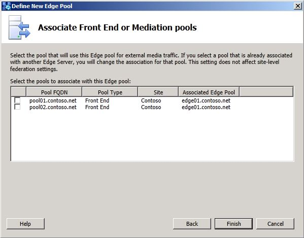

# Distribuire Edge Server pilota

In questo argomento vengono evidenziate le impostazioni di configurazione da tenere presenti prima di distribuire il server perimetrale Skype for Business Server 2019. I processi di distribuzione e configurazione Skype for Business Server 2019 sono molto simili Skype for Business Server 2015. In questa sezione vengono evidenziati solo i punti chiave di cui è consigliabile tenere conto nell'ambito della distribuzione del pool pilota. <!-- For detailed steps, see 
 [Deploying external user access in Skype for Business Server 2019](../deployment/deploying-external-user-access/deploying-external-user-access.md) in the Deployment documentation, which describes the deployment process and also gives configuration information for external user access.  -->
  
Man mano che si va avanti nella procedura guidata **Definisci pool di server perimetrali**, esaminare le impostazioni di configurazione chiave illustrate nei passaggi seguenti. Si noti che sono visualizzate solo alcune pagine della procedura guidata **Definisci pool di server perimetrali**. 
  
### Per definire un pool di server perimetrali

1. Accedere al computer in cui è installato Generatore di topologie come membro del gruppo Domain Admins e del gruppo RTCUniversalServerAdmins.
    
2. Passare al nodo Skype for Business Server 2019. Fare clic con il pulsante destro del mouse su **Pool di server perimetrali** e scegliere **Nuovo pool di server perimetrali**.
    
     
  
3. Un pool di server perimetrali può essere un **Pool di più computer** o un **Pool computer singolo**.
    
     
  
4. Nella pagina **Selezionare funzionalità** non abilitare la federazione o la federazione XMPP. La federazione e la federazione XMPP sono entrambe attualmente instradati attraverso il server perimetrale legacy. Queste funzionalità verranno configurate in una fase successiva della migrazione. 

  
5. Continuare a completare le pagine della procedura guidata seguenti: **FQDN** esterni, Definire l'indirizzo **IP interno** e **Definire l'indirizzo IP esterno.**
    
6. Nella pagina **Definire il server dell'hop** successivo selezionare il Server Director per l'hop successivo del pool di server perimetrali legacy. 
    
     
  
7. Nella pagina **Associa pool Front End** o Mediation Server non associare un pool a questo pool di server perimetrali in questo momento. Il traffico multimediale esterno è attualmente instradato attraverso il server perimetrale legacy. Questa impostazione verrà configurata in una fase successiva della migrazione. 
    
     
  
8. Fare **clic su** Fine e **quindi** su Pubblica la topologia. 
    
9. Seguire i passaggi nella documentazione relativa alla distribuzione per installare i file nel nuovo server perimetrale, configurare i certificati e avviare i servizi. 
<!-- [Install Edge Servers for Skype for Business Server 2019](../deployment/deploying-external-user-access/install-edge-servers.md) in -->
    
È molto importante seguire le linee guida negli argomenti della documentazione relativa alla distribuzione. In questa sezione vengono fornite solo indicazioni sulle impostazioni di configurazione durante la fase di installazione di questi ruoli server. 
<!-- [Deploying external user access in Skype for Business Server 2019](../deployment/deploying-external-user-access/deploying-external-user-access.md) -->
  
A questo punto dovrebbe essere distribuito un server perimetrale legacy in parallelo con una Skype for Business Server server perimetrale 2019. Prima di passare alla fase successiva, verificare che entrambe le distribuzioni funzionino correttamente, che i servizi siano stati avviati e che sia possibile amministrare ogni distribuzione. 
  

