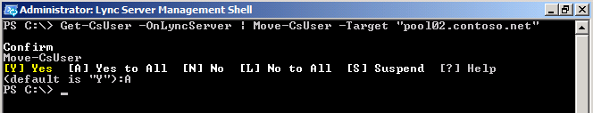
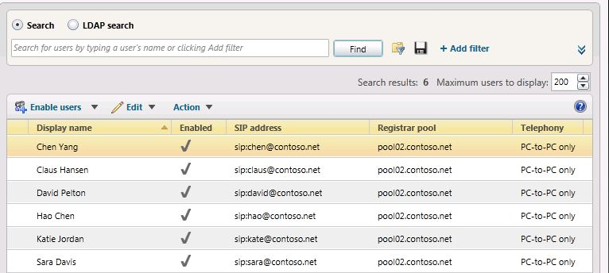

# <a name="move-multiple-users-to-the-pilot-pool"></a>Trasferire più utenti nel pool pilota

È possibile trasferire più utenti dal pool legacy al pool pilota di Skype for Business Server 2019 usando il pannello di controllo di Skype for Business Server 2019 o Skype for Business Server 2019 Management Shell.

 **In questo articolo**
  
[Per trasferire più utenti tramite il pannello di controllo di Skype for Business Server 2019](#sectionSection0)
  
[Per trasferire più utenti usando Skype for Business Server 2019 Management Shell](#sectionSection1)
  
[Per trasferire tutti gli utenti contemporaneamente usando Skype for Business Server 2019 Management Shell](#sectionSection2)
  
  
## <a name="to-move-multiple-users-by-using-the-skype-for-business-server-2019-control-panel"></a>Per trasferire più utenti tramite il pannello di controllo di Skype for Business Server 2019
<a name="sectionSection0"> </a>

1. Aprire il pannello di controllo di Skype for Business Server.
    
2. Fare clic su **utenti**, fare clic su **Cerca**e quindi su **trova**.
    
3. Selezionare due utenti che si desidera trasferire nel pool di Skype for Business Server 2019. In questo esempio verranno spostati gli utenti Chen Yang e Claus Hansen.
    
     
  
4. Nel menu **azione** selezionare Trasferisci **utenti selezionati in pool**.
    
5. Nell'elenco a discesa selezionare il pool di Skype for Business Server 2019.
    
6. Fare clic su **azione**e quindi su **Trasferisci utenti selezionati in pool**. Fare clic su **OK**.
    
     
  
7. Verificare che la colonna del **pool** di registrar per gli utenti contenga ora il pool di Skype for Business Server 2019, che indica che gli utenti sono stati spostati correttamente. 
    
## <a name="to-move-multiple-users-by-using-the-skype-for-business-server-2019-management-shell"></a>Per trasferire più utenti usando Skype for Business Server 2019 Management Shell
<a name="sectionSection1"> </a>

1. Aprire Skype for Business Server 2019 Management Shell. 
    
2. Nella riga di comando digitare le opzioni seguenti e sostituire **User1** e **User2** con nomi utente specifici da trasferire e sostituire **pool_FQDN** con il nome del pool di destinazione. In questo esempio verranno spostati gli utenti Hao Chen e Katie Jordan. 
    
   ```
   Get-CsUser -Filter {DisplayName -eq "User1" -or DisplayName - eq "User2"} | Move-CsUser -Target "pool_FQDN"
   ```

    
  
3. Nella riga di comando digitare quanto segue: 
    
   ```
   Get-CsUser -Identity "User1"
   ```

4. L'identità del **pool di registrazione** deve ora puntare al pool specificato come **pool_FQDN** nel passaggio precedente. La presenza di questa identità conferma che l'utente è stato spostato correttamente. Ripetere il passaggio per verificare che **User2** sia stato spostato. 
    
     
  
## <a name="to-move-all-users-at-the-same-time-by-using-the-skype-for-business-server-2019-management-shell"></a>Per trasferire tutti gli utenti contemporaneamente usando Skype for Business Server 2019 Management Shell
<a name="sectionSection2"> </a>

In questo esempio tutti gli utenti sono stati restituiti al pool legacy (pool01.contoso.net). Usando Skype for Business Server 2019 Management Shell, sposteremo tutti gli utenti contemporaneamente al pool Skype for Business Server 2019 (pool02.contoso.net).
  
1. Aprire Skype for Business Server 2019 Management Shell.
    
2. Nella riga di comando digitare quanto segue: 
    
   ```
   Get-CsUser -OnLyncServer | Move-CsUser -Target "pool_FQDN"
   ```

     
  
3. Eseguire **Get-CsUser** per uno degli utenti pilota. 
    
   ```
   Get-CsUser -Identity "Hao Chen"
   ```

4. L'identità del **pool** di registrar per ogni utente ora punta al pool specificato come **pool_FQDN** nel passaggio precedente. La presenza di questa identità conferma che l'utente è stato spostato correttamente. 
    
5. Inoltre, è possibile visualizzare l'elenco degli utenti nel pannello di controllo di Skype for Business Server 2019 e verificare che il valore del pool di registrazione punti ora al pool di Skype for Business Server 2019.
    
     
  

