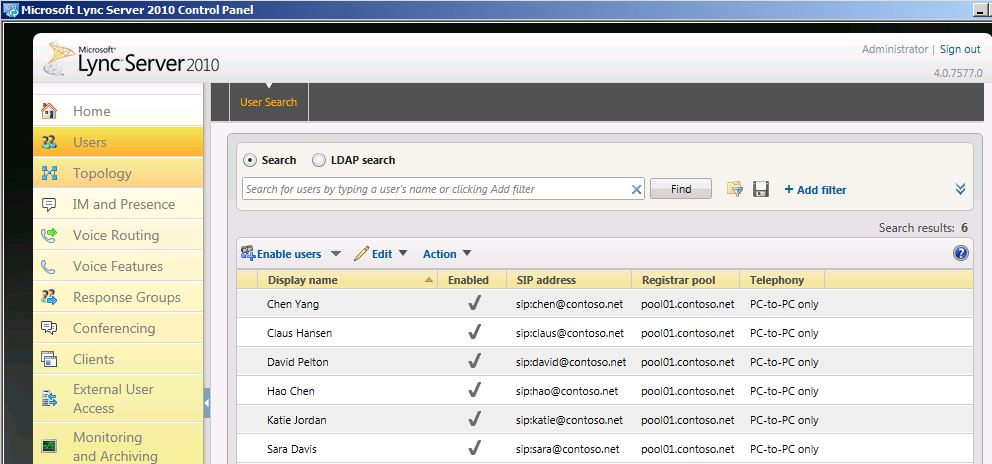

# Verificare l'ambiente legacy

Prima di distribuire Skype for Business Server 2019 in uno stato di coesistenza, è necessario verificare che i servizi legacy siano stati configurati e avviati. È importante identificare i servizi e le funzionalità chiave presenti nell'ambiente legacy prima di distribuire un pool pilota Skype for Business Server 2019. Prima di distribuire Microsoft Skype for Business Server 2019 XMPP in uno stato di coesistenza con una distribuzione XMPP legacy, è necessario verificare che i servizi XMPP legacy siano stati configurati e avviati e identificare il partner federato che supporta la configurazione XMPP legacy. La verifica della distribuzione legacy comporta quanto segue:
  
- Verifica dell'avvio dei servizi legacy
    
- Revisione della topologia e degli utenti
    
- Verifica delle impostazioni di federazione e server perimetrale
    
- Verifica dei servizi XMPP e dei partner federati
    
## Verificare che i servizi legacy siano avviati

1. Dal Front End Server legacy passare all'applet Strumenti di amministrazione\Servizi.
    
2. Verificare che i servizi seguenti siano in esecuzione nel Front End Server:
    
     
  
## Esaminare la topologia legacy nel Skype for Business Server Pannello di controllo

1. Eseguire l'accesso al Front End Server con un account membro del gruppo RTCUniversalServerAdmins oppure membro del ruolo amministrativo CsAdministrator o CsUserAdministrator.
    
2. Apri il Skype for Business Server pannello di controllo.
    
3. Selezionare **Topologia**. Verificare che i vari server della distribuzione legacy siano elencati.
    
     
  
## Esaminare gli utenti legacy nel Skype for Business Server Pannello di controllo

1. Apri il Skype for Business Server pannello di controllo.
    
2. Selezionare **Utenti** e quindi fare clic su **Trova.**
    
3. Verificare che la **colonna Pool di** registrazione punti al pool legacy per ogni utente elencato. 
    
     
  
## Verificare le impostazioni di federazione e server perimetrale legacy

1. Avviare Generatore di topologie.
    
2. Selezionare **Scarica topologia dalla distribuzione esistente**.
    
3. Scegliere un nome di file e salvare la topologia con il tipo di file tbxml predefinito.
    
4. Espandere il nodo installazioni legacy per visualizzare i vari ruoli del server nella distribuzione.
    
5. Selezionare il nodo del sito e verificare che sia impostato un valore per l'assegnazione della route di **federazione** del sito. 
    
     
  
6. Selezionare il edizione Standard Server o edizione Enterprise pool front-end. Determinare se un pool di server perimetrali è stato configurato per i supporti sotto **Associazioni**. 
    
     
  
7. Selezionare il pool di server perimetrali e identificare se un pool di hop successivo è configurato sotto **Selezione hop successivo.**
    
     
  
## Verificare la configurazione del partner federato XMPP legacy

1. Dal server XMPP legacy passare all'applet Strumenti di amministrazione\Servizi.
    
2. Verificare che il servizio Office Communications Server XMPP Gateway sia stato avviato. 
    
     
  

