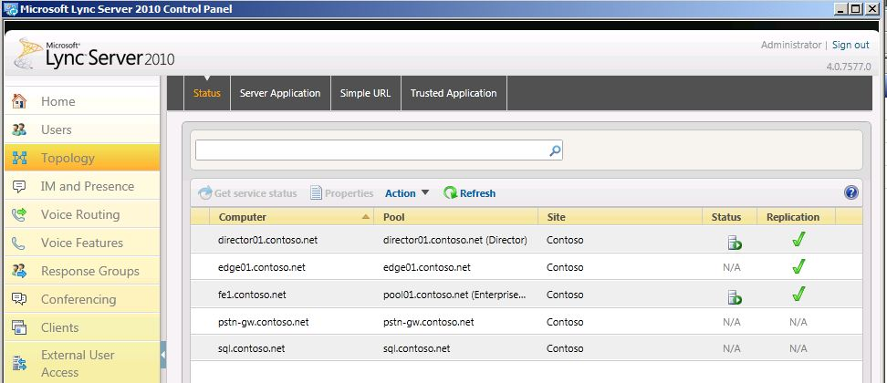

# Verificare l'ambiente legacyVerify the legacy environment

Prima di distribuire Skype for Business Server 2019 in uno stato di coesistenza, è necessario verificare che i servizi legacy siano stati configurati e avviati.Before deploying Skype for Business Server 2019 in a coexistence state, you need to verify that legacy services have been configured and started. È importante identificare i servizi e le caratteristiche principali presenti nell'ambiente legacy prima della distribuzione di un pool pilota di Skype for Business Server 2019.It is important to identify key services and features that exist in your legacy environment prior to deploying a Skype for Business Server 2019 pilot pool. Prima di distribuire Microsoft Skype for Business Server 2019 XMPP in uno stato di coesistenza con una distribuzione XMPP legacy, è necessario verificare che i servizi XMPP legacy siano stati configurati e avviati e identificare il partner federativo legacy XMPP la configurazione sta supportando.Before deploying Microsoft Skype for Business Server 2019 XMPP in a coexistence state with a legacy XMPP deployment, you need to verify that the legacy XMPP services have been configured and started, and identify which federated partner the legacy XMPP configuration is supporting. La verifica della distribuzione legacy comporta le operazioni seguenti:Verifying your legacy deployment entails the following:
  
- Verificare che i servizi legacy vengano avviatiVerifying that the legacy services are started
    
- Revisione della topologia e degli utentiReviewing the topology and users
    
- Verifica delle impostazioni della Federazione e del server perimetraleVerifying the federation and Edge server settings
    
- Verificare i servizi XMPP e i partner federatiVerifying XMPP services and federated partners
    
## Verificare che i servizi legacy siano avviatiVerify that legacy services are started

1. Dal server front-end legacy passare all'applet Tools\Services amministrativa.From the legacy Front End Server, navigate to the Administrative Tools\Services applet.
    
2. Verificare che i servizi seguenti siano in uso nel server front-end:Verify that the following services are running on the Front End Server:
    
     
  
## Esaminare la topologia legacy nel pannello di controllo di Skype for Business ServerReview the legacy topology in Skype for Business Server Control Panel

1. Accedere al server front-end con un account che sia un membro del gruppo RTCUniversalServerAdmins o un membro del ruolo di amministratore di CsAdministrator o CsUserAdministrator.Log on to the Front End Server with an account that is a member of the RTCUniversalServerAdmins group or a member of the CsAdministrator or CsUserAdministrator administrative role.
    
2. Aprire il pannello di controllo di Skype for Business Server.Open the Skype for Business Server Control Panel.
    
3. Selezionare **topologia**.Select **Topology**. Verificare che i vari server della distribuzione legacy siano elencati.Verify that the various servers in your legacy deployment are listed.
    
     
  
## Rivedere gli utenti legacy nel pannello di controllo di Skype for Business ServerReview legacy users in Skype for Business Server Control Panel

1. Aprire il pannello di controllo di Skype for Business Server.Open the Skype for Business Server Control Panel.
    
2. Selezionare **utenti**e quindi fare clic su **trova**.Select **Users**, and then click **Find**.
    
3. Verificare che la colonna del **pool di registrazione** punti al pool legacy per ogni utente elencato.Verify that the **Registrar Pool** column points to the legacy pool for each user listed. 
    
     
  
## Verificare le impostazioni di Edge e federazioni legacyVerify legacy Edge and federation settings

1. Avviare Generatore di topologie.Start Topology Builder.
    
2. Selezionare **Scarica topologia dalla distribuzione esistente**.Select **Download Topology from existing deployment**.
    
3. Scegliere un nome file e salvare la topologia con il tipo di file default. tbxml.Choose a file name, and save the topology with the default .tbxml file type.
    
4. Espandere il nodo installazioni legacy per rivelare i vari ruoli del server nella distribuzione.Expand the legacy installs node to reveal the various server roles in the deployment.
    
5. Selezionare il nodo del sito e verificare che sia impostato un valore di **assegnazione della route federativo del sito** .Select the site node and verify that a **Site federation route assignment** value is set. 
    
     
  
6. Selezionare il pool di front end del server Standard Edition o Enterprise Edition.Select the Standard Edition Server or Enterprise Edition front end pool. Determinare se un pool di bordi è stato configurato per elementi multimediali al di sotto delle **associazioni**.Determine whether an Edge pool has been configured for media below **Associations**. 
    
     
  
7. Selezionare il pool di bordi e identificare se un pool di hop successivo è configurato sotto la **selezione dell'hop successivo**.Select the Edge pool and identify whether a Next hop pool is configured below **Next hop selection**.
    
     
  
## Verificare la configurazione legacy del partner federato XMPPVerify legacy XMPP federated partner Configuration

1. Dal server XMPP legacy passare all'applet Tools\Services amministrativa.From the legacy XMPP server, navigate to the Administrative Tools\Services applet.
    
2. Verificare che il servizio gateway XMPP di Office Communications Server sia stato avviato.Verify that the Office Communications Server XMPP Gateway service is started. 
    
     
  

