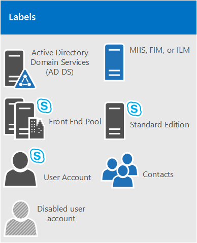

# <a name="system-requirements-for-skype-for-business-server-2019"></a>Requisiti di sistema per Skype for Business Server 2019
 
**Riepilogo:** Preparare l'installazione di Skype for Business Server 2019 con questo argomento. L'hardware, il sistema operativo, il software, i database, i certificati, il dominio attivo, il DNS e le condivisioni di file sono coperti qui. Tutti i requisiti di sistema e le raccomandazioni sono disponibili per garantire un'installazione e una distribuzione di successo della server farm.
  
Come ci si potrebbe aspettare, i preparativi da eseguire prima di iniziare a distribuire Skype for Business Server 2019. Questo articolo illustra la pianificazione per le operazioni seguenti:
  
- [Hardware](system-requirements.md#Hardware)
  
- [Sistemi operativi](system-requirements.md#OS)
  
- [Software](system-requirements.md#Software)

- [Database SQL di back-end](system-requirements.md#DBs)
  
- [Active Directory](system-requirements.md#AD)
  
- [Domain Name System (DNS)](system-requirements.md#DNS)
  
- [Certificati](system-requirements.md#Certs)
  
- [Condivisione file](system-requirements.md#Fileshare)

  
## <a name="hardware-for-skype-for-business-server-2019"></a>Hardware per Skype for Business Server 2019
<a name="Hardware"> </a>

Dopo aver premuto la topologia (e, se non è così, è possibile estrarre le [nozioni di base relative alla topologia per Skype for Business Server 2019](../../SfbServer/plan-your-deployment/topology-basics/topology-basics.md) ), è il momento di pensare ai server. I server di Skype for Business Server 2019 richiedono hardware a 64 bit. Le nostre raccomandazioni per l'hardware sono inferiori. Non si tratta di requisiti, ma riflettono i requisiti necessari per ottenere prestazioni ottimali. Abbiamo la documentazione relativa alla pianificazione della capacità che ti aiuterà a determinare se hai bisogno di più di questo, a seconda delle circostanze.
  
Hardware consigliato per i server Standard Edition:

|**Componente hardware**|**Consigliato**|
|:-----|:-----|
|CPU  <br/> |Processore Intel Xeon E5-2673 V3 Dual Processor, 6-core, 2,4 gigahertz (GHz) o versioni successive.  <br/> I processori Intel Itanium non sono supportati per i ruoli di Skype for Business Server 2019.  <br/> |
|Memoria  <br/> |32 gigabyte (GB).  <br/> |
|Disco  <br/> |SIA  <br/> • 8 o più unità disco rigido da 10000 RPM con almeno 72 GB di spazio libero su disco (due dischi che usano RAID 1 e 6 con RAID 10).  <br/> OPPURE  <br/> • SSD (Solid State Drive) in grado di assicurare lo stesso spazio libero e prestazioni simili alle unità disco meccaniche di 8 10000 RPM.  <br/> |
|Rete  <br/> |1 adattatore di rete a doppia porta, 1 Gbps o superiore (2 schede di rete possono essere usate, ma è necessario collaborare con un singolo indirizzo MAC e un singolo indirizzo IP).  <br/> Le configurazioni dual o multihomed **non** sono supportate per i server front-end, i server back-end e i server Standard Edition. <br/> Purché non siano esposti al sistema operativo e vengano usati per monitorare e gestire l'hardware del server, è possibile avere sistemi di gestione fuori banda, ad esempio DRAC o ILO. Questo scenario non costituisce un server multihomed ed è supportato.  <br/> |


Hardware consigliato per i server front-end e i server back-end:
  
|**Componente hardware**|**Consigliato**|
|:-----|:-----|
|CPU  <br/> |Processore Intel Xeon E5-2673 V3 Dual Processor, 6-core, 2,4 gigahertz (GHz) o versioni successive. <br/> I processori Intel Itanium non sono supportati per i ruoli di Skype for Business Server 2019.  <br/> |
|Memoria  <br/> |64 gigabyte (GB).  <br/> |
|Disco  <br/> |SIA  <br/> • 8 o più unità disco rigido da 10000 RPM con almeno 72 GB di spazio libero su disco (due dischi che usano RAID 1 e 6 con RAID 10).  <br/> OPPURE  <br/> • SSD (Solid State Drive) in grado di assicurare lo stesso spazio libero e prestazioni simili alle unità disco meccaniche di 8 10000 RPM.  <br/> |
|Rete  <br/> |1 adattatore di rete a doppia porta, 1 Gbps o superiore (2 schede di rete possono essere usate, ma è necessario collaborare con un singolo indirizzo MAC e un singolo indirizzo IP).  <br/> Le configurazioni dual o multihomed **non** sono supportate per i server front-end, i server back-end e i server Standard Edition. <br/> Purché non siano esposti al sistema operativo e vengano usati per monitorare e gestire l'hardware del server, è possibile avere sistemi di gestione fuori banda, ad esempio DRAC o ILO. Questo scenario non costituisce un server multihomed ed è supportato.  <br/> |
   
Hardware consigliato per Edge Server, Mediation Server autonomi e direttori:
  
|**Componente hardware**|**Consigliato**|
|:-----|:-----|
|CPU  <br/> |Processore Intel Xeon E5-2673 V3 Dual Processor, 6-core, 2,4 gigahertz (GHz) o versioni successive.  <br/> I processori Intel Itanium non sono supportati per i ruoli di Skype for Business Server 2019.  <br/> |
|Memoria  <br/> |32 gigabyte.  <br/> |
|Disco  <br/> |SIA  <br/> • 4 o più unità disco rigido da 10000 RPM con almeno 72 GB di spazio libero su disco (i dischi devono essere in una configurazione di 2x RAID 1).  <br/> OPPURE  <br/> • SSD (Solid State Drive) in grado di assicurare lo stesso spazio libero e prestazioni simili alle unità disco meccaniche di 4 10000 RPM.  <br/> |
|Rete  <br/> |1 adattatore di rete a doppia porta, 1 Gbps o superiore (2 schede di rete possono essere usate, ma è necessario collaborare con un singolo indirizzo MAC e un singolo indirizzo IP).  <br/> Le configurazioni dual o multihomed **non** sono supportate per i server e gli amministratori di interoperabilità video. <br/> I server perimetrali richiedono due interfacce di rete che sono schede di rete a doppia porta, 1 Gbps o superiore (o due schede di rete abbinate, per un totale di quattro, ogni coppia che viene affiancata da un singolo indirizzo MAC e da un singolo indirizzo IP, per un totale di due coppie).  <br/> Nei server Mediation standalone è supportata l'installazione di schede di interfaccia di rete aggiuntive (NIC) per consentire la configurazione di un indirizzo IP PSTN specifico.  <br/> |


> [!NOTE]
> Indipendentemente dal ruolo del server, ti consigliamo anche le impostazioni hardware seguenti per Skype for Business Server 2019 (può variare a seconda della marca di hardware acquistato, quindi fai riferimento alla documentazione del produttore per specifiche):
> - Configurazione BIOS-deve essere impostato su FLAT da NUMA.
> - Abilitare l'hyperthreading.
> - L'impostazione della coda RSS deve essere impostata su 8 Queue.

   
## <a name="operating-systems-for-skype-for-business-server-2019"></a>Sistemi operativi per Skype for Business Server 2019
<a name="OS"> </a>

Dopo aver installato l'hardware, è necessario installare il sistema operativo (OS) che consentirà l'installazione e l'uso corretto di Skype for Business Server 2019.
  
|||
|:-----|:-----|
|Windows Server 2019 <br/> |
|Windows Server 2016 <br/> ||
||
   
Altro che i sistemi operativi elencati qui non funzionano correttamente; per favore, non provarlo per le installazioni di Skype for Business Server 2019. Ad esempio, l'opzione Server Core non è elencata e quindi non è supportata.

> [!NOTE]
> 
> Se si sta installando l'interfaccia di amministrazione di Windows 2019 nel computer con Windows Server 2019, verrà richiesto di ascoltare la porta. C'è un liklihood è possibile scegliere la porta 443, ma se il computer in cui è installato Skype for Business Server 2019 o se è installato Skype for Business Server 2019, è necessario scegliere un numero di porta diverso.
> 
>Perché è il caso? Se l'interfaccia di amministrazione di Windows 2019 è in uso sulla porta 443, non sarà possibile connettersi al server tramite il pannello di controllo di Skype for business e non sarà possibile connettersi a qualsiasi servizio Web interno in uso nel server (servizio Web Rubrica , Servizio di individuazione automatica, servizio webticket e così via).  In realtà, non sarà possibile connettersi a qualsiasi URL del servizio Web interno. Scegliere una porta diversa, se necessario o si vuole inserire l'interfaccia di amministrazione di Windows 2019 in un server con Skype for Business Server 2019.
> 

  
## <a name="software-that-should-be-installed-before-a-skype-for-business-server-2019-deployment"></a>Software che deve essere installato prima di una distribuzione di Skype for Business Server 2019
<a name="Software"> </a>

Ci sono alcune operazioni che è necessario installare o configurare per qualsiasi server che esegue Skype for Business Server 2019. Questi sono elencati di seguito, seguiti da requisiti aggiuntivi per ruoli server specifici.

> [!IMPORTANT]
> Skype for business 2019 supporta .NET Framework 4,8. 
  
 **Tutti i server:**
  
|**Software/ruolo**|**Dettagli**|
|:-----|:-----|
|Windows PowerShell 3,0  <br/> |Tutti i server Skype for Business Server richiedono l'installazione di Windows PowerShell 3,0.  <br/> • Questo deve essere installato per impostazione predefinita con Windows Server 2016.<br/> |
|Microsoft .NET Framework  <br/> |Servizi WCF è una **funzionalità** installata come funzionalità di Windows, in **Server Manager**, inizialmente non è necessario alcun download. <br/> • È necessario verificare che durante l'installazione di questa funzionalità o se è già installata e che si sta controllando che l'opzione di **attivazione http** sia anche selezionata e installata, in questo modo: <br/>  <br/> Non preoccuparti se viene visualizzata una finestra popup aggiuntiva che indica che è necessario installare altre cose per l'attivazione HTTP. Questo è normale; fare clic su OK e andare avanti. Se non viene visualizzata questa finestra, è possibile assumere che questi elementi siano già installati e procedere.  <br/> Microsoft .NET Framework viene in genere installato quando si installa Windows Server 2016. Skype for Business Server richiede anche Microsoft .NET Framework 4,7 o 4,8, quindi probabilmente è necessario aggiornarlo. Puoi trovare l'aggiornamento [qui](https://support.microsoft.com/en-us/help/3186497/the-net-framework-4-7-offline-installer-for-windows/)<br/> |
|Media Foundation  <br/> |Per Windows Server 2016, Windows Media Format Runtime viene installato con Microsoft Media Foundation.  <br/> Tutti i server front-end e i server Standard Edition usati per le conferenze richiedono che Windows Media Format runtime esegua i file di Windows Media Audio (con estensione WMA) che vengono riprodotti dalle applicazioni Park, annuncio e Response Group per gli annunci e la musica.  <br/> |
|Windows Identity Foundation  <br/> |Per supportare scenari di autenticazione da server a server per Skype for Business Server 2019 è necessario Windows Identity Foundation 3,5.  <br/> • Per Windows Server 2016, non è necessario scaricare nulla. Aprire **Server Manager**e accedere alla **procedura guidata Aggiungi ruoli e funzionalità**. **Windows Identity Foundation 3,5** è elencato nella sezione **caratteristiche** . Se è selezionata, sei bravo. In caso contrario, selezionarlo e fare clic su **Avanti** per raggiungere il pulsante **Installa** . <br/> |
|Strumenti di amministrazione del server remoto  <br/> |Strumenti di amministrazione del ruolo: strumenti AD DS e AD LDS  <br/> |
   
 **I server front-end e il server Standard Edition richiedono anche:**
  
|**Software/ruolo**|**Dettagli**|
|:-----|:-----|
|Internet Information Services (IIS)  <br/> |IIS è necessario in tutti i server front-end e in tutti i server Standard Edition, con i seguenti moduli selezionati:  <br/> • Caratteristiche HTTP comuni: documento predefinito, errori HTTP, contenuto statico  <br/> • Integrità e diagnostica: registrazione HTTP, strumenti di registrazione, traccia  <br/> • Prestazioni: compressione del contenuto statico, compressione del contenuto dinamico  <br/> • Sicurezza: filtro delle richieste, autenticazione del mapping dei certificati client, autenticazione di Windows  <br/> • Sviluppo di applicazioni: estensibilità .NET 3,5, Extensibility .NET 4,5, ASP.NET 3,5, ASP.NET 4,5, estensioni ISAPI, filtri ISAPI  <br/> • Strumenti di gestione: console di gestione IIS, script e strumenti di gestione di IIS  <br/> Tieni presente che è necessario anche l'accesso anonimo, ma quando Esegui l'installazione di IIS non hai un posto in cui selezionarlo nell'elenco.  <br/> |
|Runtime in formato Windows Media  <br/> | Per Windows Server 2016 è necessario installare la funzionalità **Media Foundation** in **Server Manager**. Puoi effettivamente avviare l'installazione di Skype for Business Server 2019 senza questo, ma ti verrà richiesto di installarlo e quindi riavviare il server, prima che l'installazione di Skype for Business Server 2019 continui. È meglio farlo in anticipo. <br/> |
|Silverlight  <br/> |È possibile installare la versione più recente di [Silverlight.](https://www.microsoft.com/silverlight/)  <br/> |
   
Per aiutarti, ecco uno script di PowerShell di esempio che puoi eseguire per automatizzare questa operazione:
  
```
Add-WindowsFeature RSAT-ADDS, Web-Server, Web-Static-Content, Web-Default-Doc, Web-Http-Errors, Web-Asp-Net, Web-Net-Ext, Web-ISAPI-Ext, Web-ISAPI-Filter, Web-Http-Logging, Web-Log-Libraries, Web-Request-Monitor, Web-Http-Tracing, Web-Basic-Auth, Web-Windows-Auth, Web-Client-Auth, Web-Filtering, Web-Stat-Compression, Web-Dyn-Compression, NET-WCF-HTTP-Activation45, Web-Asp-Net45, Web-Mgmt-Tools, Web-Scripting-Tools, Web-Mgmt-Compat, Windows-Identity-Foundation, Server-Media-Foundation, Telnet-Client, BITS, ManagementOData, Web-Mgmt-Console, Web-Metabase, Web-Lgcy-Mgmt-Console, Web-Lgcy-Scripting, Web-WMI, Web-Scripting-Tools, Web-Mgmt-Service
```

 **Gli amministratori hanno anche bisogno di:**
  
IIS, con i moduli seguenti selezionati:
  
- Caratteristiche HTTP comuni
    
  - Documento predefinito
    
  - Errori HTTP
    
  - Contenuto statico
    
- Integrità e diagnostica
    
  - Registrazione HTTP
    
  - Strumenti di registrazione
    
  - Traccia
    
- Prestazioni
    
  - Compressione del contenuto statico
    
- Sicurezza
    
  - Filtro delle richieste
    
  - Autenticazione del mapping dei certificati client
    
  - Autenticazione di Windows
    
- Sviluppo di applicazioni
    
  - Estensibilità .NET 3,5
    
  - Estensibilità .NET 4,5
    
  - ASP.NET 3,5
    
  - ASP.NET 4,5
    
  - Estensione ISAPI
    
  - Filtri ISAPI
    
Se si sta chiedendo, si tratta dello stesso set di moduli dei server front-end e dei server Standard Edition, con gli strumenti di compressione e gestione del contenuto dinamico a sinistra.
  
Ecco anche il codice di PowerShell seguente:
  
```
Add-WindowsFeature RSAT-ADDS, Web-Server, Web-Static-Content, Web-Default-Doc, Web-Http-Errors, Web-Asp-Net, Web-Net-Ext, Web-ISAPI-Ext, Web-ISAPI-Filter, Web-Http-Logging, Web-Log-Libraries, Web-Request-Monitor, Web-Http-Tracing, Web-Basic-Auth, Web-Windows-Auth, Web-Client-Auth, Web-Filtering, Web-Stat-Compression, NET-WCF-HTTP-Activation45, Web-Asp-Net45, Web-Scripting-Tools, Web-Mgmt-Compat, Server-Media-Foundation, Telnet-Client
```

## <a name="back-end-databases-that-will-work-with-skype-for-business-server-2019"></a>Database di back-end che funzioneranno con Skype for Business Server 2019
<a name="DBs"> </a>

Durante l'installazione di Skype for Business Server 2019 Standard Edition, è disponibile SQL Server 2016 Express (64 bit Edition).

Skype for Business Server 2019 Enterprise Edition richiederà SQL Server completo, come indicato di seguito (solo 64 bit Edition; si consiglia di non usare le edizioni a 32 bit):
  
||||
|:-----|:-----|:-----|
|Microsoft SQL Server 2019 (64 bit Edition) ed è necessario eseguire gli aggiornamenti più recenti.  <br/> |Microsoft SQL Server 2017 (64 bit Edition) ed è necessario eseguire gli aggiornamenti più recenti.  <br/> |
Microsoft SQL Server 2016 (64 bit Edition) ed è necessario eseguire gli aggiornamenti più recenti.|
 |

Se non si vede l'edizione di SQL Server che si vuole usare in questo elenco, non è possibile usarla.
  
> [!NOTE]
> È inoltre necessario installare SQL Server Reporting Services per il ruolo del server di monitoraggio. 
  
### <a name="sql-clustering-and-sql-always-on"></a>Clustering SQL e SQL sempre attivati

Il clustering SQL con Skype for Business Server 2019 è supportato. Se si vuole configurare il clustering SQL, questo avviene in SQL Server.
  
Verificare di avere una configurazione attiva/passiva per il clustering SQL, supportata. Non condividere il nodo passivo con altre istanze SQL.
  
Per il clustering di failover è possibile avere i seguenti elementi:
  
Due nodi:
  
- Microsoft SQL Server 2019 standard (64 bit Edition) e si consiglia di eseguire con il Service Pack più recente.
- Microsoft SQL Server 2017 standard (64 bit Edition) e si consiglia di eseguire con il Service Pack più recente.
- Microsoft SQL Server 2016 standard (64 bit Edition) e si consiglia di eseguire con il Service Pack più recente.

Sedici-nodo:
  
- Microsoft SQL Server 2019 Enterprise (64 bit Edition) e si consiglia di eseguire con il Service Pack più recente.
- Microsoft SQL Server 2017 Enterprise (64 bit Edition) e si consiglia di eseguire con il Service Pack più recente.
- Microsoft SQL Server 2016 Enterprise (64 bit Edition) e si consiglia di eseguire con il Service Pack più recente.

SQL always on è supportato e si può leggere altre informazioni su [back end server high availability in Skype for Business server 2019](../../SfbServer/plan-your-deployment/high-availability-and-disaster-recovery/back-end-server.md).
  

###  <a name="additional-server-installation-recommendations"></a>Suggerimenti per l'installazione di server aggiuntivi:
  
Non installare alcun software client del server Microsoft Internet Security and Acceleration (ISA) o qualsiasi altro software LSP (Layered Service Providers) Winsock (eventuali firewall di terze parti o software di controllo della rete anti-virus verrebbero inclusi qui) in qualsiasi server front-end o server di mediazione autonomo. Quando il software è installato, è stata visualizzata una cattiva prestazione del traffico multimediale.
  

## <a name="active-directory"></a>Active Directory
<a name="AD"> </a>

Anche se gran parte dei dati di configurazione per server e servizi è archiviato in Skype for Business Server 2019 Central Management store, alcuni elementi sono ancora archiviati in Active Directory:
  
|**Oggetti Active Directory**|**Tipi di oggetti**|
|:-----|:-----|
|Estensioni dello schema  <br/> |Estensioni degli oggetti utente  <br/> |
||Estensioni per Skype for Business Server 2015 e Lync Server 2013, per mantenere la compatibilità con le versioni precedenti supportate  <br/> |
|Dati  <br/> |URI SIP utente e altre impostazioni utente  <br/> |
||Oggetti contatto per le applicazioni (ad esempio l'applicazione Response Group e l'applicazione Operatore Conferenza)  <br/> |
||Dati pubblicati per la compatibilità con le versioni precedenti  <br/> |
||Un punto di controllo del servizio (SCP) per l'archivio di gestione centrale  <br/> |
||Account di autenticazione Kerberos (un oggetto computer facoltativo)  <br/> |
   
### <a name="os-for-domain-controllers"></a>Sistema operativo per i controller di dominio

È possibile usare i sistemi operativi di Domain controller seguenti:
  
- Windows Server 2019

- Windows Server 2016
    
- Windows Server 2012 R2
    
- Windows Server 2012
    
Il livello di funzionalità del dominio di qualsiasi dominio in cui si distribuisce Skype for Business Server 2019 e il livello di funzionalità della foresta di qualsiasi foresta in cui si distribuisce Skype for Business Server 2019, deve essere uno dei seguenti:
  
- Windows Server 2019

- Windows Server 2016
    
- Windows Server 2012 R2
    
- Windows Server 2012
    
In questi ambienti è possibile avere controller di dominio di sola lettura? Certo, purché siano disponibili anche controller di dominio scrivibili.
  
È importante sapere che Skype for Business Server 2019 non supporta i domini con etichetta singola. Cosa sono? Se si ha un dominio radice con l'etichetta contoso. local, andra ' tutto bene. Se si ha un dominio radice appena denominato local, non funzionerà e non sarà supportato come risultato. Un po' di più su questo articolo è stato scritto [in questa Knowledge base](https://support.microsoft.com/kb/300684/en-us).
  
Anche Skype for Business Server 2019 non supporta la ridenominazione dei domini. Per rinominare il proprio dominio, è necessario disinstallare Skype for Business Server 2019, eseguire la ridenominazione del dominio e quindi reinstallare Skype for Business Server 2019.
  
Infine, potresti avere a che fare con un dominio con un ambiente AD DS bloccato e questo va bene. Sono presenti ulteriori informazioni su come distribuire Skype for Business Server 2019 in un ambiente AD DS bloccato nella documentazione relativa alla distribuzione.
  
### <a name="ad-topologies"></a>Topologie AD

Le topologie supportate in Skype for Business Server 2019 sono:
  
- Singola foresta con un singolo dominio
    
- Singola foresta con un solo albero e più domini
    
- Foresta singola con più alberi e spazi dei nomi disgiunti
    
- Più foreste in una topologia di foresta centrale
    
- Più foreste in una topologia di foresta di risorse
    
- Più foreste in una topologia della foresta di risorse di Skype for business con Exchange Online
    
- Più foreste in una topologia di foresta di risorse con Skype for business online ed Azure Active Directory Connect
    
Sono presenti diagrammi e descrizioni che consentono di determinare la topologia che si ha nell'ambiente o le operazioni che è necessario configurare prima di installare Skype for Business Server 2019. Per semplificare l'attività, è inclusa anche una chiave:
  

  
#### <a name="single-forest-with-single-domain"></a>Singola foresta con un singolo dominio


  
Non è più semplice; si tratta di una singola foresta di domini, una topologia comune.
  
#### <a name="single-forest-with-a-single-tree-and-multiple-domains"></a>Singola foresta con un solo albero e più domini


  
Questo diagramma mostra di nuovo una singola foresta, ma include anche uno o più domini figlio (ne sono presenti tre in questo esempio specifico). In questo modo il dominio in cui vengono creati gli utenti potrebbe essere diverso dal dominio in cui è distribuito Skype for Business Server 2019. Perché preoccuparsi di questo problema? È importante ricordare che quando si distribuisce un pool Front-End di Skype for Business Server, tutti i server del pool devono essere in un unico dominio. Puoi avere l'amministrazione tra domini tramite il supporto di Skype for Business Server per i gruppi di amministratori universali di Windows.
  
Nel diagramma precedente puoi vedere che gli utenti di un dominio sono in grado di accedere ai pool di Skype for Business Server dallo stesso dominio o da domini diversi, anche se questi utenti si trovano in un dominio figlio.
  
#### <a name="single-forest-with-multiple-trees-and-disjoint-namespaces"></a>Foresta singola con più alberi e spazi dei nomi disgiunti


  
Potrebbe essere presente una topologia simile a questo diagramma, in cui è presente una sola foresta, ma all'interno di tale foresta sono presenti più domini, con spazi dei nomi degli annunci distinti. In questo caso, questo diagramma è una buona illustrazione, perché include utenti in tre diversi domini che accedono a Skype for Business Server 2019. Le linee solide indicano che stanno accedendo a un pool di Skype for Business Server nel proprio dominio, mentre una linea tratteggiata indica che andranno a un pool in un albero diverso.
  
Come si può vedere, gli utenti dello stesso dominio, lo stesso albero o anche un albero diverso possono accedere ai pool con successo.
  
#### <a name="multiple-forests-in-a-central-forest-topology"></a>Più foreste in una topologia di foresta centrale


  
Skype for Business Server 2019 supporta più foreste configurate in una topologia di foresta centrale. Se non si è certi che si ha, la foresta centrale della topologia usa oggetti in esso per rappresentare gli utenti nelle altre foreste e ospita gli account utente per tutti gli utenti della foresta.
  
Come funziona? Un prodotto di sincronizzazione della directory, ad esempio Forefront Identity Manager o FIM, gestisce gli account utente dell'organizzazione in tutta la sua esistenza. Quando si crea o si elimina un account da una foresta, la modifica viene sincronizzata con il contatto corrispondente nella foresta centrale.
  
Chiaramente, se l'infrastruttura degli annunci è in atto, il passaggio a questa topologia potrebbe non essere facile, ma se si è già presenti o si sta ancora pianificando l'infrastruttura della foresta, è possibile che sia una buona scelta. Puoi centralizzare la distribuzione di Skype for Business Server 2019 in una singola foresta, mentre gli utenti possono cercare, comunicare e visualizzare la presenza di altri utenti in qualsiasi foresta. Tutti gli aggiornamenti dei contatti utente vengono gestiti automaticamente con il software di sincronizzazione.
  
#### <a name="multiple-forests-in-a-skype-for-business-resource-forest-topology"></a>Più foreste in una topologia della foresta di risorse di Skype for business
<a name="BKMK_multipleforestopology"> </a>


  
È supportata anche una topologia di foresta di risorse. è la posizione in cui è dedicata una foresta all'uso delle applicazioni server, come Microsoft Exchange Server e Skype for Business Server 2019. Questa foresta di risorse ospita anche una rappresentazione sincronizzata di oggetti utente attivi, ma nessun account utente abilitato per l'accesso. La foresta delle risorse è quindi un ambiente di servizi condivisi per altri insiemi di strutture in cui risiedono gli oggetti utente e hanno una relazione di trust a livello di foresta con la foresta di risorse.
  
Si noti che Exchange Server può essere distribuito nella stessa foresta di risorse di Skype for Business Server o in un'altra foresta.
  
Per distribuire Skype for Business Server 2019 in questo tipo di topologia, è necessario creare un oggetto utente disabilitato nella foresta di risorse per ogni account utente nelle foreste degli utenti (se Microsoft Exchange Server è già presente nell'ambiente, questo potrebbe essere fatto per te). È quindi necessario uno strumento di sincronizzazione della directory, ad esempio Forefront Identity Manager o FIM, per gestire gli account utente tramite il loro ciclo di vita.
  
#### <a name="multiple-forests-in-a-skype-for-business-resource-forest-topology-with-exchange-online"></a>Più foreste in una topologia della foresta di risorse di Skype for business con Exchange Online
<a name="BKMK_multipleforestopology"> </a>

Questa topologia è simile alla topologia descritta in [più foreste in una topologia della foresta di risorse di Skype for business](system-requirements.md#BKMK_multipleforestopology).
  
In questa topologia sono presenti una o più foreste degli utenti e Skype for Business Server è distribuito in una foresta di risorse dedicata. Exchange Server può essere distribuito in locale nella stessa foresta di risorse o in un'altra foresta e configurato per l'ibrido con Exchange Online oppure i servizi di posta elettronica possono essere forniti esclusivamente da Exchange Online per gli account locali. Per questa topologia non è disponibile un diagramma.
  
#### <a name="multiple-forests-in-a-resource-forest-topology-with-skype-for-business-online-and-azure-active-directory-connect"></a>Più foreste in una topologia di foresta di risorse con Skype for business online ed Azure Active Directory Connect
<a name="BKMK_multipleforestopology"> </a>


  
Con questo scenario, sono presenti più foreste locali con una topologia di foresta di risorse. Esiste una relazione di trust completa tra le foreste di Active Directory. Lo strumento Azure Active Directory Connect viene usato per sincronizzare gli account tra le foreste degli utenti locali e Office 365.
  
 L'organizzazione ha anche Office 365 e USA [Azure Active Directory Connect](https://docs.microsoft.com/azure/active-directory/connect/active-directory-aadconnect) per sincronizzare gli account locali con Office 365. Gli utenti abilitati per Skype for business sono abilitati tramite Office 365 e Skype for business online. Skype for Business Server non è distribuito in locale.
  
L'autenticazione Single Sign-on viene fornita da una farm di Active Directory Federation Services situata nella foresta degli utenti.
  
In questo scenario, è supportata la distribuzione di Exchange locale, Exchange Online, una soluzione di Exchange ibrida o non è stato possibile distribuire Exchange. Il diagramma mostra solo Exchange locale, ma anche le altre soluzioni di Exchange sono completamente supportate.
  
#### <a name="multiple-forests-in-a-resource-forest-topology-with-hybrid-skype-for-business"></a>Più foreste in una topologia di foresta di risorse con Skype for business ibrido
<a name="BKMK_multipleforestopology"> </a>

In questo scenario sono presenti una o più foreste di utenti locali e Skype for business è distribuito in una foresta di risorse dedicata ed è configurato per la modalità ibrida con Skype for business online. Exchange Server può essere distribuito localmente nella stessa foresta di risorse o in un'altra foresta e può essere configurato per l'ibrido con Exchange Online. In alternativa, i servizi di posta elettronica possono essere forniti esclusivamente da Exchange Online per gli account locali.
  
Per altre informazioni, vedere [configurare un ambiente con più insiemi di strutture per Skype for business ibrido](../../SfbServer/skype-for-business-hybrid-solutions/deploy-hybrid-connectivity/configure-a-multi-forest-environment-for-hybrid.md).
  
## <a name="domain-name-system-dns"></a>Domain Name System (DNS)
<a name="DNS"> </a>

Skype for Business Server 2019 richiede il DNS, per i motivi seguenti:
  
- DNS consente a Skype for Business Server 2019 di individuare i server o i pool interni, consentendo le comunicazioni da server a server.
    
- DNS consente ai computer client di individuare il pool Front-end o il server Standard Edition in uso per le transazioni SIP.
    
- Associa URL semplici per le conferenze con i server che ospitano tali conferenze.
    
- DNS consente agli utenti esterni e ai computer client di connettersi agli Edge Server o al proxy inverso HTTP per la messaggistica istantanea o i servizi di conferenza.
    
- Consente ai dispositivi Unified Communications (UC) che non sono connessi alla scoperta del pool Front-end o del server Standard Edition in cui è in uso il servizio Web Update del dispositivo per ottenere aggiornamenti e inviare log.
    
- L'uso di DNS consente ai client mobili di individuare automaticamente le risorse dei servizi Web senza richiedere agli utenti di immettere manualmente gli URL nelle impostazioni del dispositivo.
    
- Viene usato in bilanciamento del carico DNS.
    
È importante notare che Skype for Business Server 2019 non supporta i nomi di dominio internazionalizzati (IDN).
  
Ed è estremamente importante tenere presente che qualsiasi nome in DNS è identico al nome del computer configurato in qualsiasi server usato da Skype for Business Server 2019. In particolare, non possiamo avere nomi brevi nell'ambiente e dobbiamo avere FQDN per generatore di topologie.
  
Questo aspetto sarebbe logico per qualsiasi computer già associato a un dominio, ma se si dispone di un server perimetrale non collegato al dominio, potrebbe essere impostato su un nome breve, senza suffisso di dominio. Verificare che non sia il caso, in DNS o nell'Edge Server o in qualsiasi server o pool di Skype for Business Server 2019.
  
Sicuramente non usare caratteri Unicode o carattere di sottolineatura. I caratteri standard (che sono A-Z, a-z, 0-9 e segni meno) sono supportati da DNS esterni e autorità di certificazione pubbliche (è necessario assegnare nomi di dominio completi a SN nel certificato, è importante ricordare), in modo da risparmiare un sacco di problemi se si chiama tenendo presente questo avviso dall'inizio.
  
Per ulteriori informazioni sui requisiti DNS per la rete, vedere la sezione [Networking](../../SfbServer/plan-your-deployment/network-requirements/network-requirements.md) della documentazione relativa alla pianificazione.
  
## <a name="certificates"></a>Certificati
<a name="Certs"> </a>

Una delle operazioni più importanti che è possibile eseguire prima della distribuzione è assicurarsi di avere i certificati in ordine. Skype for Business Server 2019 richiede un'infrastruttura a chiave pubblica (PKI) per le connessioni TLS (Transport Layer Security) e MTLS (Mutual Transport Layer Security). In sostanza, per comunicare in modo sicuro in maniera standardizzata, Skype for Business Server usa i certificati emessi da autorità di certificazione (CAs).
  
Queste sono alcune delle operazioni che Skype for Business Server 2019 usa i certificati per:
  
- Connessioni TLS tra client e server
    
- Connessioni MTLS tra server
    
- Federazione che usa l'individuazione automatica del DNS dei partner
    
- Accesso remoto agli utenti per la messaggistica istantanea (IM)
    
- Accesso degli utenti esterni a sessioni audio/video (AV), condivisione applicazioni e conferenze
    
- Comunicare con le applicazioni Web e Outlook Web App (OWA)
    
Quindi la pianificazione del certificato è un must. Esaminiamo ora un elenco di alcune delle operazioni che è necessario tenere presenti quando si richiedono certificati:
  
- Tutti i certificati server devono supportare l'autorizzazione del server (server EKU).
    
- Tutti i certificati server devono contenere un punto di distribuzione CRL (CDP).
    
- Tutti i certificati devono essere firmati usando un algoritmo di firma supportato dal sistema operativo. Skype for Business Server 2019 supporta la famiglia di dimensioni digest SHA-1 e SHA-2 (224, 256, 384 e 512 bit) e soddisfa o supera i requisiti del sistema operativo.
    
- La registrazione automatica è supportata per i server interni con Skype for Business Server 2019.
    
- La registrazione automatica non è supportata per i server Edge di Skype for Business Server 2019.
    
> [!NOTE]
> L'uso dell'algoritmo di firma RSASSA-PSS non è supportato e può comportare errori per i problemi di accesso e inoltro di chiamata, tra gli altri. 
  
- Sono supportate le lunghezze della chiave di crittografia di 1024, 2048 e 4096. Sono consigliate le lunghezze delle chiavi di 2048 e superiori.
    
- L'algoritmo digest predefinito o la firma hash è RSA. Sono supportati anche gli algoritmi ECDH_P256, ECDH_P384 e ECDH_P521.
    
È molto a cui pensare e ci sono vari livelli di comfort con la richiesta di certificati da una CA. Per rendere la pianificazione il più indolore possibile, verranno fornite ulteriori indicazioni.
  
### <a name="certificates-for-your-internal-servers"></a>Certificati per i server interni

Avrai bisogno di certificati per la maggior parte dei server interni e probabilmente li otterrai da una CA interna (ovvero una CA situata nel dominio). Se si vuole, è possibile richiedere questi certificati da una CA esterna (uno disponibile su Internet). Se si sta chiedendo quale autorità pubblica dovrebbe andare, è possibile consultare l'elenco [partner certificati comunicazioni unificate](/SkypeForBusiness/certification/services-ssl) .
  
Ti serviranno anche i certificati quando Skype for Business Server 2019 comunica con altre applicazioni e server, come Microsoft Exchange Server. Questo, ovviamente, dovrà essere un certificato che le altre app e i server possono usare in modo supportato. Skype for Business Server 2019 e altri prodotti Microsoft supportano il protocollo OAuth (Open Authorization) per l'autenticazione e l'autorizzazione da server a server. Se si è interessati a questo problema, è presente un altro articolo sulla pianificazione per OAuth e Skype for Business Server 2019.
  
Skype for Business Server 2019 include anche il supporto per (senza richiedere) i certificati firmati con la funzione hash crittografico SHA-256. Per supportare l'accesso esterno tramite SHA-256, il certificato esterno deve essere emesso da una CA pubblica tramite SHA-256.
  
Per semplificare le cose, abbiamo inserito i requisiti di certificato per i server Standard Edition, i pool Front-end e altri ruoli nelle tabelle seguenti, con il contoso.com fittizio usato per gli esempi (probabilmente userai qualcos'altro per ambiente). Si tratta di tutti i certificati server Web standard, con chiavi private non esportabili. Altre informazioni da tenere presenti:
  
- L'utilizzo di chiave avanzata server (EKU) viene configurato automaticamente quando si usa la procedura guidata certificati per richiedere certificati.
    
- Ogni nome descrittivo del certificato deve essere univoco nell'archivio di computer.
    
- Come per i nomi di esempio seguenti, se è stato configurato sipinternal.contoso.com o sipexternal.contoso.com nel DNS, è necessario aggiungerlo al nome alternativo soggetto del certificato (SAN).
    
Certificati per server Standard Edition:
  
|**Certificato**|**Nome soggetto/nome comune**|**Nome alternativo soggetto**|**Esempio**|**Commenti**|
|:-----|:-----|:-----|:-----|:-----|
|Predefinita  <br/> |Nome di dominio completo del pool  <br/> |Nome di dominio completo del pool e nome di dominio completo del server  <br/> Se si hanno più domini SIP ed è stata abilitata la configurazione automatica del client, la procedura guidata certificati rileva e aggiunge ogni FQDN del dominio SIP supportato.  <br/> Se questo pool è il server di accesso automatico per i client e la corrispondenza Strict Domain Name System (DNS) è necessaria in criteri di gruppo, sono necessarie anche le voci per SIP. SipDomain (per ogni dominio SIP).  <br/> |SN = SE01. contoso. com; SAN = SE01. contoso. com  <br/> Se questo pool è il server di accesso automatico per i client e la corrispondenza DNS rigorosa è necessaria in criteri di gruppo, è necessario anche SAN = SIP. contoso. com; SAN = SIP. fabrikam. com  <br/> |Nei server Standard Edition il nome di dominio completo del server è uguale al nome di dominio completo del pool.  <br/> La procedura guidata rileva tutti i domini SIP specificati durante l'installazione e li aggiunge automaticamente al nome alternativo oggetto.  <br/> Puoi anche usare questo certificato per l'autenticazione da server a server.  <br/> |
|Interno Web  <br/> |Nome di dominio completo del server  <br/> |Ognuna delle opzioni seguenti:  <br/> • FQDN Web interno (che corrisponde al nome di dominio completo del server)  <br/> E  <br/> • Incontra URL semplici  <br/> • URL semplice con accesso esterno  <br/> • URL semplice amministratore  <br/> OPPURE  <br/> • Una voce con caratteri jolly per gli URL semplici  <br/> |SN = SE01. contoso. com; SAN = SE01. contoso. com; SAN = meet. contoso. com; SAN = meet. fabrikam. com; SAN = dialin. contoso. com; SAN = admin. contoso. com  <br/> Uso di un certificato con caratteri jolly:  <br/> SN = SE01. contoso. com; SAN = SE01. contoso. com; SAN =\*. contoso.com  <br/> |Non è possibile eseguire l'override del FQDN Web interno in Generatore di topologie.  <br/> Se si hanno più URL semplici di riunione, è necessario includerli tutti come SANs.  <br/> Le voci con caratteri jolly sono supportate per le voci URL semplici.  <br/> |
|Web esterno  <br/> |Nome di dominio completo del server  <br/> |Ognuna delle opzioni seguenti:  <br/> • FQDN Web esterno  <br/> E  <br/> • URL semplice con accesso esterno  <br/> • Soddisfa gli URL semplici per ogni dominio SIP  <br/> OPPURE  <br/> • Una voce con caratteri jolly per gli URL semplici  <br/> |SN = SE01. contoso. com; SAN = webcon01. contoso. com; SAN = meet. contoso. com; SAN = meet. fabrikam. com; SAN = dialin. contoso. com  <br/> Uso di un certificato con caratteri jolly:  <br/> SN = SE01. contoso. com; SAN = webcon01. contoso. com; SAN =\*. contoso.com  <br/> |Se si hanno più URL semplici di riunione, è necessario includerli tutti come nomi alternativi oggetto.  <br/> Le voci con caratteri jolly sono supportate per le voci URL semplici.  <br/> |
   
Certificati per i server front-end in un pool Front-end:
  
|**Certificato**|**Nome soggetto/nome comune**|**Nome alternativo soggetto**|**Esempio**|**Commenti**|
|:-----|:-----|:-----|:-----|:-----|
|Predefinita  <br/> |Nome di dominio completo del pool  <br/> |Nome di dominio completo del pool e nome di dominio completo del server  <br/> Se si hanno più domini SIP ed è stata abilitata la configurazione automatica del client, la procedura guidata certificati rileva e aggiunge ogni FQDN del dominio SIP supportato.  <br/> Se questo pool è il server di accesso automatico per i client e la corrispondenza Strict Domain Name System (DNS) è necessaria in criteri di gruppo, sono necessarie anche le voci per SIP. SipDomain (per ogni dominio SIP).  <br/> |SN = EEpool. contoso. com; SAN = EEpool. contoso. com; SAN = ee01. contoso. com  <br/> Se questo pool è il server di accesso automatico per i client e la corrispondenza DNS rigorosa è necessaria in criteri di gruppo, è necessario anche SAN = SIP. contoso. com; SAN = SIP. fabrikam. com  <br/> |La procedura guidata rileva tutti i domini SIP specificati durante l'installazione e li aggiunge automaticamente al nome alternativo oggetto.  <br/> Puoi anche usare questo certificato per l'autenticazione da server a server.  <br/> |
|Interno Web  <br/> |Nome di dominio completo del pool  <br/> |Ognuna delle opzioni seguenti:  <br/> • FQDN Web interno (che non corrisponde al nome di dominio completo del server)  <br/> • FQDN server  <br/> • FQDN del pool di Skype for business  <br/> E  <br/> • Incontra URL semplici  <br/> • URL semplice con accesso esterno  <br/> • URL semplice amministratore  <br/> OPPURE  <br/> • Una voce con caratteri jolly per gli URL semplici  <br/> |SN = ee01. contoso. com; SAN = ee01. contoso. com; SAN = meet. contoso. com; SAN = meet. fabrikam. com; SAN = dialin. contoso. com; SAN = admin. contoso. com  <br/> Uso di un certificato con caratteri jolly:  <br/> SN = ee01. contoso. com; SAN = ee01. contoso. com; SAN =\*. contoso.com  <br/> |Se si hanno più URL semplici di riunione, è necessario includerli tutti come nomi alternativi oggetto.  <br/> Le voci con caratteri jolly sono supportate per le voci URL semplici.  <br/> |
|Web esterno  <br/> |Nome di dominio completo del pool  <br/> |Ognuna delle opzioni seguenti:  <br/> • FQDN Web esterno  <br/> E  <br/> • URL semplice con accesso esterno  <br/> • URL semplice amministratore  <br/> OPPURE  <br/> • Una voce con caratteri jolly per gli URL semplici  <br/> |SN = ee01. contoso. com; SAN = webcon01. contoso. com; SAN = meet. contoso. com; SAN = meet. fabrikam. com; SAN = dialin. contoso. com  <br/> Uso di un certificato con caratteri jolly:  <br/> SN = ee01. contoso. com; SAN = webcon01. contoso. com; SAN =\*. contoso.com  <br/> |Se si hanno più URL semplici di riunione, è necessario includerli tutti come nomi alternativi oggetto.  <br/> Le voci con caratteri jolly sono supportate per le voci URL semplici.  <br/> |
   
Certificati per il direttore:
  
|**Certificato**|**Nome soggetto/nome comune**|**Nome alternativo soggetto**|**Esempio**|
|:-----|:-----|:-----|:-----|
|Predefinita  <br/> |Pool di Director  <br/> |Nome di dominio completo del Director, FQDN del pool di Director.  <br/> Se questo pool è il server di accesso automatico per i client e la corrispondenza DNS rigorosa è necessaria in criteri di gruppo, saranno necessarie anche le voci per SIP. SipDomain (per ogni dominio SIP).  <br/> |pool.contoso.com; SAN = dir01. contoso. com  <br/> Se questo pool di Director è il server di accesso automatico per i client e la corrispondenza DNS rigorosa è necessaria in criteri di gruppo, è necessario anche SAN = SIP. contoso. com; SAN = SIP. fabrikam. com  <br/> |
|Interno Web  <br/> |Nome di dominio completo del server  <br/> |Ognuna delle opzioni seguenti:  <br/> • FQDN Web interno (che corrisponde al nome di dominio completo del server)  <br/> • FQDN server  <br/> • FQDN del pool di Skype for business  <br/> E  <br/> • Incontra URL semplici  <br/> • URL semplice con accesso esterno  <br/> • URL semplice amministratore  <br/> OPPURE  <br/> • Una voce con caratteri jolly per gli URL semplici  <br/> |SN = dir01. contoso. com; SAN = dir01. contoso. com; SAN = meet. contoso. com; SAN = meet. fabrikam. com; SAN = dialin. contoso. com; SAN = admin. contoso. com  <br/> Uso di un certificato con caratteri jolly:  <br/> SN = dir01. contoso. com; SAN = dir01. contoso. com SAN =\*. contoso.com  <br/> |
|Web esterno  <br/> |Nome di dominio completo del server  <br/> |Ognuna delle opzioni seguenti:  <br/> • FQDN Web esterno  <br/> E  <br/> • Soddisfa gli URL semplici per ogni dominio SIP  <br/> • URL semplice con accesso esterno  <br/> OPPURE  <br/> • Una voce con caratteri jolly per gli URL semplici  <br/> |Il nome FQDN Web esterno del Director deve essere diverso dal pool Front-end o dal server front-end.  <br/> SN = dir01. contoso. com; SAN = directorwebcon01. contoso. com SAN = meet. contoso. com; SAN = meet. fabrikam. com; SAN = dialin. contoso. com  <br/> Uso di un certificato con caratteri jolly:  <br/> SN = dir01. contoso. com; SAN = directorwebcon01. contoso. com SAN =\*. contoso.com  <br/> |
   
Certificati per Mediation Server autonomo:
  
|**Certificato**|**Nome soggetto/nome comune**|**Nome alternativo soggetto**|**Esempio**|
|:-----|:-----|:-----|:-----|
|Predefinita  <br/> |Nome di dominio completo del pool  <br/> |Nome di dominio completo del pool  <br/> Nome di dominio completo del server dei membri del pool  <br/> |SN = medsvr-pool.contoso.net; SAN = medsvr-pool.contoso.net; SAN = medsvr01. contoso. NET  <br/> |
   
Certificati per Survivable Branch Appliance (in particolare Survivable Branch Appliance 2015 per Skype for Business Server 2019):
  
|**Certificato**|**Nome soggetto/nome comune**|**Nome alternativo soggetto**|**Esempio**|
|:-----|:-----|:-----|:-----|
|Predefinita  <br/> |Nome di dominio completo dell'accessorio  <br/> |SIP. \<SipDomain\> (è necessaria una sola voce per ogni dominio SIP)  <br/> |SN = sba01. contoso. NET; SAN = SIP. contoso. com; SAN = SIP. fabrikam. com  <br/> |
   
### <a name="certificates-for-external-user-access-edge"></a>Certificati per l'accesso degli utenti esterni (Edge)

Skype for Business Server 2019 supporta l'uso di un **unico certificato pubblico** per le interfacce esterne di Access e Web Conferencing Edge, oltre al servizio di autenticazione a/V, che viene fornito tramite gli Edge Server. L'interfaccia interna di Edge utilizzerà in genere un certificato privato emesso dalla CA interna, ma se si preferisce, è possibile usare anche un certificato pubblico, se si tratta di una CA attendibile.
  
Anche il proxy inverso (RP) utilizzerà un certificato pubblico e crittografa la comunicazione dal RP ai client e il RP ai server interni tramite HTTP (o più precisamente, TLS su HTTP).
  
### <a name="certificates-for-mobility"></a>Certificati per la mobilità

Se si sta distribuendo la mobilità e si supporta l'individuazione automatica per i client mobili, sarà necessario includere alcune voci aggiuntive per i nomi alternativi nei certificati per supportare le connessioni sicure dai client mobili.
  
Sono necessari i nomi SAN per l'individuazione automatica nei certificati seguenti:
  
- Pool di Director
    
- Pool Front End
    
- Proxy inverso
    
Le specifiche sono elencate nelle tabelle seguenti.
  
Questo è il luogo in cui una piccola pianificazione preliminare è buona, ma a volte è stata distribuita una versione di Skype for Business Server 2019 senza l'intenzione di distribuire la mobilità e questo si presenta più tardi quando si hanno già certificati nell'ambiente. La riemissione tramite una CA interna è in genere abbastanza semplice, ma con i certificati pubblici di una CA pubblica, che può essere un po' più caro.
  
Se questo è quello che si sta guardando e se si hanno molti domini SIP (che renderebbe più costoso l'aggiunta di SANS), è possibile configurare il proxy inverso per l'uso di HTTP per la richiesta di servizio di individuazione automatica iniziale, invece di usare HTTPS (che è l'impostazione predefinita configurazione). L'articolo su [piano per la mobilità](../../SfbServer/plan-your-deployment/mobility.md) contiene altre informazioni.
  
Requisiti del pool di Director e dei certificati del pool Front end:
  
|**Descrizione**|**Voce SAN**|
|:-----|:-----|
|URL del servizio di individuazione automatica interno  <br/> |SAN = LyncdiscoverInternal. \<SipDomain\>  <br/> |
|URL del servizio di individuazione automatica esterna  <br/> |SAN = lyncdiscover. \<SipDomain\>  <br/> |
   
In alternativa, è possibile usare SAN\*=. \<SipDomain\>
  
Requisiti del certificato di proxy inverso (public CA):
  
|**Descrizione**|**Voce SAN**|
|:-----|:-----|
|URL del servizio di individuazione automatica esterna  <br/> |SAN = lyncdiscover. \<SipDomain\>  <br/> |
   
Questa SAN deve essere assegnata al certificato assegnato al listener SSL nel proxy inverso.
  
> [!NOTE]
> Il listener del proxy inverso avrà SANs per gli URL dei servizi Web esterni. Alcuni esempi sarebbero SAN = skypewebextpool01. contoso. com e dirwebexternal.contoso.com, se è stato distribuito il Director (facoltativo). 
  
## <a name="file-share"></a>Condivisione file
<a name="Fileshare"> </a>

Skype for Business Server 2019 può usare la stessa condivisione file per tutti gli archivi di file. È necessario tener presente quanto segue:
  
- Una condivisione file deve essere inserita nell'archiviazione (DAS) Direct Attached Storage Network (SAN), che include il file System distribuito (DFS), nonché una matrice ridondante di dischi indipendenti (RAID) per gli archivi di file. Per altre informazioni su DFS per Windows Server 2012, vedere [Questa pagina DFS](https://technet.microsoft.com/en-us/library/jj127250.aspx).
    
- È consigliabile un cluster condiviso per la condivisione file. Se si sta già usando uno, è consigliabile eseguire il cluster di Windows Server 2012 o versioni successive

> [!Note]
> **Perché le finestre più recenti?** Le versioni precedenti potrebbero non avere le autorizzazioni appropriate per abilitare tutte le funzionalità. È possibile usare Amministrazione cluster per creare le condivisioni file. Per altre informazioni, vedere questo articolo del supporto per [creare condivisioni di file in un cluster](https://support.microsoft.com/help/224967) .
    
> [!CAUTION]
> Dovresti sapere che l'uso di Network Attached Storage (NAS) come condivisione file non è supportato, quindi usa una delle opzioni elencate sopra. Questa limitazione del supporto è causata dalla progettazione variabile di dispositivi NAS che devono consentire l'adattabilità del file System al computer basato su Windows Server che accede al file system condiviso dei dispositivi.
  


