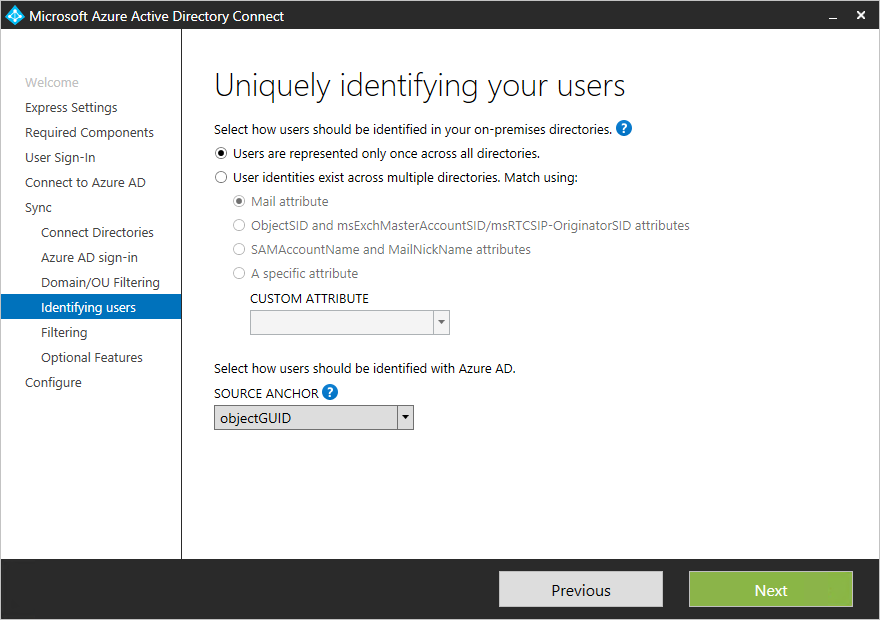

# Aggiornare AAD Connect per includere più di una forestaUpdate AAD Connect to include more than one forest

Azure AD Connect supporta la [sincronizzazione da più foreste.](https://docs.microsoft.com/azure/active-directory/connect/active-directory-aadconnect-topologies)Azure AD Connect supports [syncing from multiple forests](https://docs.microsoft.com/azure/active-directory/connect/active-directory-aadconnect-topologies). Tuttavia, supporta una sola istanza di Azure AD Connect che esegue la sincronizzazione con AAD.However, it supports only one instance of Azure AD Connect syncing to AAD. Pertanto, nei casi in cui Azure AD è già installato in una foresta, l'istanza esistente di AAD Connect deve essere aggiornata per la sincronizzazione dalla foresta aggiuntiva.Therefore, in cases where Azure AD is already installed in one forest, the existing instance of AAD Connect must be updated to sync from the additional forest.

 - Se tutte le identità sono rappresentate una sola volta in entrambe le foreste (ovvero non sono stati effettuati contatti abilitati alla posta elettronica),  è sufficiente eseguire di nuovo la procedura guidata AAD Connect, scegliere "Personalizza opzioni di sincronizzazione" e quindi nella pagina Connetti directory immettere il nome della foresta e delle identità aggiuntive.If all identities are represented only once across both forests (that is, you haven’t made any mail-enabled contacts), then you can simply re-run the AAD Connect wizard, choose “Customize synchronization options,” and then on the **Connect Your Directories** page, enter the name of the additional forest and creds.  
 
 - Tuttavia, se gli utenti possono esistere in più directory e si uniranno i dati (ad esempio, se gli oggetti contatto esistono in una foresta corrispondente agli utenti di un'altra foresta), sarà necessario disinstallare Azure AD Connect e reinstallarlo.However, if users can exist in more than one directory and you’ll be merging the data (for example, if contact objects exist in a forest corresponding to users in another forest), you will need to uninstall Azure AD Connect and re-install it.  Questo perché la condizione delle regole di join tra foreste può essere configurata solo durante la prima installazione.This is because the cross-forest join rules condition can only be configured during the first install. Questa operazione viene eseguita nella pagina seguente:This is done on the following page:  
 

## Vedere ancheSee also

[Consolidamento del cloud per Teams e Skype for BusinessCloud Consolidation for Teams and Skype for Business](cloud-consolidation.md)