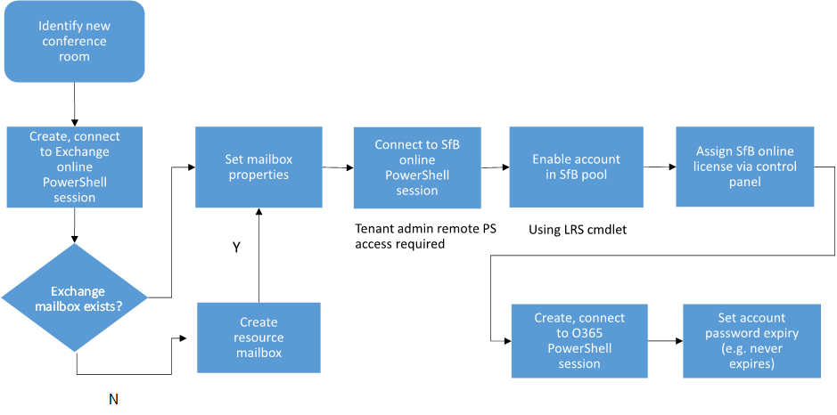

# <a name="provisioning-skype-room-system-accounts-in-microsoft-365-and-office-365"></a>Provisioning Skype account del sistema room in Microsoft 365 e Office 365
 
Leggere questo argomento per informazioni sul provisioning Skype di sistema room in Microsoft 365 o Office 365.
  
Nella sezione seguente viene illustrato Skype provisioning dell'account di sistema room.
  
## <a name="microsoft-365-and-office-365-prerequisites"></a>Microsoft 365 e Office 365 prerequisiti

Il tenant online deve soddisfare i requisiti seguenti:
  
- Il Microsoft 365 o Office 365 deve includere Skype for Business Online Piano 2 o Office 365 E1, E3 o E5. <br/>Per informazioni dettagliate sui Skype for Business online, vedere la descrizione del [Skype for Business Online Service Description](/office365/servicedescriptions/skype-for-business-online-service-description/skype-for-business-online-service-description).
    
- Il tenant deve avere la funzionalità di conferenza di Skype for Business abilitata.
    
- Il tenant deve avere Exchange Online abilitato. 
    
- L'amministratore remoto tenant deve disporre dell'accesso PowerShell seguente:
    
  - Exchange accesso remoto a PowerShell
    
  - Skype for Business accesso remoto a PowerShell online
    
  - Windows Azure Active Directory modulo per Windows PowerShell accedere Microsoft 365 o Office 365 accesso alla directory
    
Per l'account Skype room, sono necessarie le licenze seguenti:
  
- È Skype for Business una licenza di Skype for Business Online Piano 2 o Office 365 E1 o E3 per abilitare le Skype riunioni.
    
- Per autorizzare la sala con la funzionalità VoIP aziendale in modo che possa essere abilitata con un numero di telefono, è necessario un Skype for Business Online Piano 2 con la licenza di Sistema telefonico o Office 365 E5 (1).
    
- Se sono necessarie funzionalità di accesso esterno da una riunione, è necessario disporre di audioconferenza e Sistema telefonico licenza.  Se sono necessarie funzionalità di chiamata in uscita da una riunione, è necessario un piano per chiamate nazionali o nazionali e internazionali. 
    
- Non è Exchange Online necessaria una licenza per l'account Skype Room perché l'account deve essere configurato come account della cassetta postale della risorsa.
    
## <a name="provisioning-overview"></a>Panoramica del provisioning

Nel diagramma seguente viene fornita una panoramica del flusso Skype provisioning degli account di sistema room.
  

  
## <a name="identify-a-new-conference-room"></a>Identificare una nuova sala riunioni

È possibile che si abbia già una cassetta postale sala risorse in Exchange che fornisce la funzionalità di pianificazione oppure che si crei per la prima volta una cassetta postale per le risorse per facilitare la distribuzione di Skype Room System. In ogni caso, è necessario identificare un account sala da utilizzare nel tenant. Le Exchange Online provisioning e Skype for Business provisioning forniscono indicazioni per entrambi i tipi di account. Si supponga, ad esempio, di disporre delle due sale seguenti e che si desideri distribuire Skype Room System per entrambe:
  
- Account cassetta postale risorsa esistente: confrm1@contoso.onmicrosoft.com
    
- Nuovo account cassetta postale risorsa: confrm2@contoso.onmicrosoft.com
    
## <a name="exchange-online-provisioning"></a>Exchange Online provisioning

Prima di tutto, connettersi Exchange Online PowerShell seguendo le istruzioni nell'argomento, Connessione [a Exchange Online PowerShell](/powershell/exchange/connect-to-exchange-online-powershell).
  
Per impostare un account cassetta postale sala risorse esistente per Skype Room System, eseguire i comandi seguenti in Exchange Online PowerShell:
  
```powershell
$rm="confrm1@contoso.onmicrosoft.com"
$newpass='pass@word1'
Set-Mailbox -Identity $rm  -EnableRoomMailboxAccount $true -RoomMailboxPassword (ConvertTo-SecureString $newpass -AsPlainText -Force)
```

Per creare un nuovo account Exchange cassetta postale per Skype Room System, eseguire i comandi seguenti in Exchange Online PowerShell:
  
```powershell
$rm="confrm2@contoso.onmicrosoft.com"
$newpass='pass@word1'
New-Mailbox -Name "Conf Room 2" -MicrosoftOnlineServicesID $rm -Room  -EnableRoomMailboxAccount $true -RoomMailboxPassword (ConvertTo-SecureString $newpass -AsPlainText -Force)
```

I comandi precedenti configurano o creano un nuovo account Exchange cassetta postale della risorsa Skype per l'utilizzo del sistema room abilitando l'account.
  
Dopo aver creato la cassetta postale, è possibile utilizzare il cmdlet Set-CalendarProcessing in Exchange Online PowerShell per configurare la cassetta postale. Per ulteriori dettagli, vedere i passaggi da 3 a 6 in Distribuzioni locali a foresta singola

## <a name="assigning-a-skype-for-business-online-license"></a>Assegnazione di una licenza Skype for Business Online

Ora è possibile assegnare una licenza di Skype for Business Online (Piano 2) o Skype for Business Online (Piano 3) utilizzando il portale di amministrazione di Microsoft 365 come descritto in Assegnare o rimuovere licenze per [Microsoft 365 per](https://support.office.com/article/Assign-or-remove-licenses-for-Office-365-for-business-997596b5-4173-4627-b915-36abac6786dc?ui=en-US&amp;rs=en-US&amp;ad=US) le aziende o in [ Skype for Business licenze dei componenti aggiuntivi](https://support.office.com/article/Skype-for-Business-add-on-licensing-3ed752b1-5983-43f9-bcfd-760619ab40a7). 
  
Dopo aver assegnato una licenza per Skype for Business Online, sarà possibile accedere e verificare che l'account sia attivo utilizzando qualsiasi client Skype for Business.
  
## <a name="skype-for-business-online-provisioning"></a>Skype for Business provisioning online

Dopo aver creato e abilitato un account cassetta postale sala risorse come illustrato in precedenza e dopo aver concesso in licenza l'account per Skype For Business Online, l'account verrà sincronizzato dalla foresta di Exchange Online alla foresta di Skype for Business Online utilizzando il Windows Azure Active Directory foresta. Per eseguire il provisioning dell'account Skype Room System nel pool di Skype for Business Online, sono necessari i passaggi seguenti. Questi passaggi sono gli stessi per un account della cassetta postale delle risorse esistente o un account appena creato (confrm1 o confrm2), perché una volta abilitati in Exchange Online, entrambi questi account verranno sincronizzati con Skype for Business Online nello stesso modo:
  
1. Creare una sessione remota di PowerShell. Tieni presente che dovrai scaricare Teams [PowerShell](/microsoftteams/teams-powershell-install).
    
  ```powershell
  # When using Teams PowerShell Module

   Import-Module MicrosoftTeams
   $credential = Get-Credential
   Connect-MicrosoftTeams -Credential $credential
  ```

2. Per abilitare un account Skype Room System per Skype for Business, eseguire il comando seguente:
    
   ```powershell
   Enable-CsMeetingRoom -Identity $rm -RegistrarPool "sippoolbl20a04.infra.lync.com" -SipAddressType EmailAddress
   ```

    È possibile ottenere l'indirizzo RegistrarPool in cui gli utenti Skype for Business sono ospitati da uno degli account esistenti utilizzando il comando seguente per ottenere questa proprietà:
    
   ```powershell
   Get-CsOnlineUser -Identity 'alice@contoso.onmicrosoft.com'| fl *registrarpool*
   ```

>[!NOTE] 
>Multi-Factor Authentication (MFA) non è supportato per gli Skype di sistema room. 

## <a name="password-expiration"></a>Scadenza password

In Microsoft 365 o Office 365, il criterio di scadenza della password predefinito per tutti gli account utente è di 90 giorni, a meno che non si configurano criteri di scadenza delle password diversi. Per Skype di sistema room, è possibile selezionare l'impostazione Nessuna scadenza password con la procedura seguente.
  
1. Creare una Windows Azure Active Directory utilizzando le credenziali di amministratore globale del tenant.
    
    ```powershell
    $cred=Get-Credential admin@$org
    Connect-MsolService -Credential $cred
    ```

2. Impostare l'impostazione Nessuna scadenza password per l'account Skype room room creato in precedenza utilizzando il comando seguente:
    
   ```powershell
   Set-MsolUser -UserPrincipalName confrm1@skypelrs.onmicrosoft.com -PasswordNeverExpires $true
   ```

Per ulteriori informazioni, vedere [Set up your computer for Windows PowerShell](../../../SfbOnline/set-up-your-computer-for-windows-powershell/set-up-your-computer-for-windows-powershell.md).
  
## <a name="validate"></a>Convalida

Per la convalida, dovresti essere in grado di usare qualsiasi client Skype for Business per accedere all'account creato.