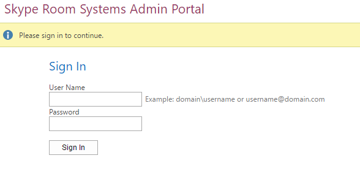

# <a name="deploy-srs-v1-administrative-web-portal-in-skype-for-business-server"></a>Distribuire il portale Web amministrativo di SRS V1 in Skype for Business Server

Skype for Business Server Skype room Systems V1 (SRS V1, precedentemente noto come Lync room System) Administrative Web Portal è un portale Web che le organizzazioni possono usare per gestire le sale riunioni di Skype room Systems. Gli amministratori possono usare il portale Web amministrativo SRS V1 per monitorare l'integrità dei dispositivi, ad esempio monitorando i dispositivi audio/video. Con questo portale, gli amministratori possono raccogliere informazioni di diagnostica in remoto per monitorare l'integrità della sala riunioni.

Per usare questa funzionalità, è necessario distribuire il portale Web amministrativo SRS V1 in tutti i server front-end di Skype for Business Server. Questa guida fornisce istruzioni per gli amministratori che spiegano come installare e configurare il portale Web amministrativo SRS. È destinato agli amministratori che hanno conoscenza dell'amministrazione di Skype for Business Server e che hanno diritti di amministratore per la modifica della topologia di Skype for Business Server.

Dopo che il portale Web amministrativo SRS V1 è stato distribuito sul server, gli amministratori possono controllare lo stato dei dispositivi SRS V1 accedendo al sito dal proprio computer o laptop.

> [!IMPORTANT]
> Scaricare il [portale Web amministrativo di Microsoft Skype room Systems V1 per Skype for Business Server 2015](https://www.microsoft.com/en-us/download/details.aspx?id=46906).

In questo argomento:

- [Configurare l'ambiente per il portale Web amministrativo di SRS V1](room-system-v1-administrative-web-portal.md#Config_Env)

- [Installare il portale Web amministrativo SRS V1](room-system-v1-administrative-web-portal.md#Install_SRS)

- [Utilizzare il portale Web amministrativo SRS](room-system-v1-administrative-web-portal.md#Use_Portal)

## <a name="configure-your-environment-for-the-srs-v1-administrative-web-portal"></a>Configurare l'ambiente per il portale Web amministrativo di SRS V1
<a name="Config_Env"> </a>

Per usare il portale Web amministrativo SRS V1, è necessario installare o configurare i prerequisiti seguenti.

> [!IMPORTANT]
> Se il server è configurato con l'autenticazione Kerberos e NTLM e SRS è in esecuzione in un computer non collegato al dominio, l'autenticazione Kerberos non riesce e l'utente non vedrà lo stato di SRS nel portale amministrativo. Per risolvere il problema, configurare il server con l'autenticazione NTLM o sia con autenticazione NTLM che TLS-DSK (senza Kerberos) oppure aggiungere il computer SRS al dominio.

1. Installare gli aggiornamenti cumulativi di Skype for Business Server nella topologia di Skype for Business Server.

    Per ottenere l'aggiornamento o vedere cosa è incluso, vedere [aggiornamenti per Skype for Business Server 2015](https://support.microsoft.com/en-us/help/3061064/updates-for-skype-for-business-server-2015).

2. Creare un utente di Active Directory abilitato per SIP.

    Il portale Web amministrativo SRS V1 usa queste credenziali per eseguire query su informazioni da Skype for Business Server. Il nome utente negli esempi forniti è LRSApp.

3. Creare un gruppo di sicurezza di Active Directory con il nome LRSSupportAdminGroup.

    Creare il gruppo con ambito gruppo come globale e tipo di gruppo come sicurezza. Gli utenti abilitati per SIP aggiunti a questo gruppo saranno autorizzati a visualizzare l'elenco delle sale ed eseguire determinati comandi, ad esempio la raccolta di registri.

4. Creare un gruppo di sicurezza di Active Directory con il nome LRSFullAccessAdminGroup.

    Creare il gruppo con ambito gruppo come globale e tipo di gruppo come sicurezza. gli utenti abilitati al SIP aggiunti a questo gruppo sono autorizzati a usare tutte le funzionalità del portale di amministrazione in una singola sala Skype. Per includere il supporto per la gestione in blocco delle sale Skype, vedere il passaggio 5.

     

5. Creare un gruppo di sicurezza di Active Directory con il nome LRSPowerUserAdminsGroup.

    Creare il gruppo con ambito gruppo come globale e tipo di gruppo come sicurezza. Gli utenti abilitati per SIP aggiunti a questo gruppo sono autorizzati a usare tutte le funzionalità del portale di amministrazione, inclusa la gestione in blocco delle sale Skype for business.

6. Aggiungi LRSFullAccessAdminGroup come membro di LRSSupportAdminGroup.

     

7. Creare un utente abilitato per SIP Active Directory con il nome LRSSupport. Aggiungere l'utente a LRSSupportAdminGroup.

     

8. Installare [ASP.NET MVC 4 per Visual Studio 2010 SP1 e Visual Web Developer 2010 SP1](https://go.microsoft.com/fwlink/p/?LinkId=323967).

## <a name="install-the-srs-v1-administrative-web-portal"></a>Installare il portale Web amministrativo SRS V1
<a name="Install_SRS"> </a>

Scaricare il [portale Web amministrativo di Microsoft Skype room Systems V1 per Skype for Business Server 2015](https://www.microsoft.com/en-us/download/details.aspx?id=46906).

Per installare il portale Web amministrativo SRS V1, eseguire la procedura seguente.

1. Configurare la porta dell'applicazione attendibile eseguendo il cmdlet seguente in Skype for Business Server Management Shell:

   ```
   Set-CsWebServer -Identity POOLFQDN -MeetingRoomAdminPortalInternalListeningPort 4456 -MeetingRoomAdminPortalExternalListeningPort 4457
   ```

2. Per installare il portale della sala riunioni, scaricare **MeetingRoomPortalInstaller. msi** e quindi eseguirlo come amministratore.

3. Aprire il file Web. config dalla posizione seguente:

    % Programmi Files%\Skype for Business Server 2015 \ Web Components\Meeting room Portal\Int\Handler\

4. Nel file Web. config modificare il PortalUserName con il nome utente creato nel passaggio 2 nella sezione "configurare l'[ambiente per il portale Web amministrativo SRS V1](room-system-v1-administrative-web-portal.md#Config_Env)" (il nome consigliato nel passaggio è LRSApp):

    ```
    <add key="PortalUserName" value="sip:LRSApp@domain.com" />
    ```

5. Poiché il portale di amministrazione SRS V1 è un'applicazione attendibile, non è necessario specificare la password nella configurazione del portale. Se l'utente usa un registrar diverso da quello locale, è necessario specificarne il registrar aggiungendo la riga seguente nel file Web. config:

   ```
   <add key="PortalUserRegistrarFQDN" value="pool-xxxx.domain.com" />
   ```

6. Se la porta utilizzata è diversa da 5061, aggiungere la riga seguente nel file Web. config:

   ```
   <add key="PortalUserRegistrarPort" value="5061" />
   ```

### <a name="verify-installation-of-the-srs-administrative-web-portal"></a>Verificare l'installazione del portale Web amministrativo SRS

Per verificare l'installazione del portale Web amministrativo di SRS V1, eseguire le operazioni seguenti:

1. In un server front-end passare all'URL seguente:

    https://\<Fe-server\>/LRS

    Non è necessario visualizzare gli errori, come illustrato nell'immagine seguente:

     

2. Se non vengono visualizzati errori, provare ad accedere all'URL seguente da qualsiasi altro computer della topologia:

    https://\<Fe-server\>/LRS

    Per accedere alla pagina, è necessario aggiungere i record DNS come descritto in "[record DNS necessari per l'accesso automatico client](https://go.microsoft.com/fwlink/p/?LinkId=318056)".

## <a name="use-the-srs-administrative-web-portal"></a>Utilizzare il portale Web amministrativo SRS
<a name="Use_Portal"> </a>

Dopo la distribuzione di SRS nel server, è possibile controllare lo stato di tutte le sale SRS accedendo al portale Web amministrativo SRS V1 da un browser.

### <a name="sign-in"></a>Accedi

1. Passare all'URL seguente:

    https://\<Fe-server\>/LRS

2. Immettere le credenziali per l'account di LRSSupport o un account aggiunto al gruppo di sicurezza di LRSSupportAdminGroup.


### <a name="srs-administrative-web-portal-summary-page"></a>Pagina di riepilogo di Administrative Web Portal SRS

Nella pagina di riepilogo sono disponibili le informazioni seguenti per tutte le sale SRS distribuite nel server:

- **Tag** Nome personalizzato che l'amministratore assegna alla chat room. Il tag può essere impostato nel portale facendo clic sul nome della chat room.

- **Integrità** Lo stato di integrità della sala, derivato dallo stato di integrità aggregato della sala, visualizzato nella sezione integrità della pagina impostazioni sala.

- **Riunione successiva** Data e ora in cui è programmata la riunione successiva.

- **Versione SRS, produttore, modello** Questi valori sono preimpostati in SRS. A seconda del produttore, questi campi potrebbero essere lasciati vuoti.

- **Ultimo aggiornamento** Visualizza l'ultima volta che è stata aggiornata la pagina Web.


> [!NOTE]
> Il menu gestione bulk verrà visualizzato solo se si fa parte del gruppo di sicurezza LRSPowerUserAdminsGroup.

### <a name="srs-room-information"></a>Informazioni sulle camere SRS

La sezione informazioni sala del portale consente di visualizzare e configurare singole sale SRS. Contiene quattro sezioni: impostazioni, dettagli, registrazione e integrità.

#### <a name="settings"></a>Impostazioni

Nella sezione Impostazioni puoi impostare la password, il tag room e i livelli di volume predefiniti per la chat room. Se si configurano queste impostazioni, le modifiche verranno replicate solo dopo aver riavviato la console SRS. Verranno visualizzate solo le impostazioni di aggiornamenti di sistema per i dispositivi SRS tramite la versione 15,12 e successive.


#### <a name="details"></a>Dettagli

La sezione dettagli fornisce un riepilogo di sola lettura delle impostazioni della sala SRS, tra cui: l'ora dell'ultimo aggiornamento; riunione successiva; ultimi aggiornamenti, manutenzione e calibrazione; impostazioni predefinite altoparlante, microfono e suoneria; versione URI SIP; numero di schermate e dettagli su ogni schermata; stato e attività.


#### <a name="troubleshooting"></a>Risoluzione dei problemi

La sezione risoluzione dei problemi può essere usata per raccogliere i log in remoto e salvarli in una posizione specifica. È anche possibile riavviare la console SRS (interfaccia utente SRS) o riavviare l'intero sistema. Per raccogliere i log, specificare un percorso di cartella nel formato specificato e verificare che la cartella disponga delle autorizzazioni di scrittura assegnate all'account del computer SRS. Se le dimensioni del log sono troppo grandi, possono essere necessarie fino a 5 minuti per completare la raccolta dei log. L'aggiornamento della pagina ti darà lo stato più recente.

#### <a name="health"></a>Integrità

La sezione integrità offre un'indicazione visiva dell'integrità della connessione a Skype for Business Server, dispositivo audio, dispositivo video, stato di resilienza e dispositivo schermo.


### <a name="additional-notes-about-the-administrative-web-portal"></a>Altre note sul portale Web amministrativo

> [!NOTE]
>  L'impostazione delle modifiche viene applicata solo dopo il riavvio del sistema SRS. > se la password dell'account LRSApp scade, non sarà possibile visualizzare lo stato delle chat room. Configurare la password dell'account di LRSAppuser in modo che non scada mai o assicurarsi di aggiornare la password al termine della scadenza. > il portale Web amministrativo SRS è supportato solo per le distribuzioni locali.

### <a name="bulk-management"></a>Gestione in blocco

La gestione in blocco delle sale SRS è una funzionalità progettata per gli amministratori IT avanzati, per semplificare il flusso di lavoro e per consentire loro di gestire in remoto più camere in modo più semplice.

Per visualizzare questa funzionalità, è necessario eseguire il provisioning dell'utente come membro del gruppo di sicurezza speciale **LRSPowerUserAdminsGroup**.

Non esiste alcun limite per il numero di sale SRS che è possibile selezionare per la gestione in blocco. Puoi tuttavia eseguire una sola operazione di gestione in blocco alla volta.

Per eseguire un'operazione di gestione in blocco, selezionare le sale da monitorare e fare clic sul menu gestione in blocco.

### <a name="frequently-asked-questions"></a>Domande frequenti

#### <a name="why-cant-i-sign-in-to-the-administrative-web-portal"></a>Perché non è possibile accedere al portale Web amministrativo?

Quando si apre https://localhost/lrs, sarà possibile visualizzare la pagina di accesso, ma quando si digita le credenziali non è possibile accedere. In questo caso, è necessario aprire https://FQDNofFEserver/SRS per accedere al portale Web amministrativo.

#### <a name="why-cant-i-see-srs-v1-in-the-administrative-web-portal"></a>Perché non è possibile visualizzare SRS V1 nel portale Web amministrativo?

- Verificare di avere gli account SRS nella distribuzione e di essere creati in base alle raccomandazioni di distribuzione del portale Web amministrativo SRS. Verificare che gli account SRS vengano provisionati usando Enable-CsMeetingRoom, not Enable-CsUser, su Skype for Business Server.

- Se sono stati creati gli account SRS e non è possibile visualizzare gli account in Administrative Web Portal, raccogliere i log del server usando lo strumento di registrazione di Skype for Business Server con il componente **MeetingPortal** selezionato e quindi inviarli al contatto di supporto SRS.

- Se sono stati creati account SRS e non è possibile visualizzare gli account in Administrative Web Portal, raccogliere i log client tramite Fiddler e copiare anche il log della console dagli strumenti di sviluppo del browser e quindi inviarli al contatto di supporto SRS. È anche possibile modificare il valore del livello di traccia nel file Web. config per ottenere un log più dettagliato.

  ```
  <system.diagnostics>
    <switches>
      <!--
      This switch controls logging message levels. 0 implies
      logging is turned off. 1 implies only errors are logged,
      2 implies errors &amp; warnings. 4 is the most detailed.
      -->
      <add name="TraceLevelSwitch" value="3" />
    </switches>
  </system.diagnostics>
  ```

#### <a name="why-cant-i-see-the-status-of-srs-in-the-administrative-web-portal"></a>Perché non è possibile visualizzare lo stato di SRS nel portale Web amministrativo?

- Verificare che l'account utente di LRSApp sia abilitato per SIP.

- Se si verificano ancora problemi, raccogliere il file **Trace. log** nel sistema SRS da D:\Tracing\LRSAdminLogs\, e quindi inviarlo al contatto di supporto SRS.

#### <a name="why-cant-i-see-the-bulk-management-menus-for-srs-in-the-administrative-web-portal"></a>Perché non è possibile visualizzare i menu di gestione bulk per SRS nel portale Web amministrativo?

Verificare che l'account utente di LRSApp sia abilitato per SIP e faccia parte del gruppo di sicurezza LRSPowerUserAdminsGroup.

#### <a name="does-the-srs-v1-administrative-web-portal-work-with-microsoft-teams-rooms"></a>Il portale Web amministrativo SRS V1 funziona con le sale di Microsoft Teams?

Non.


