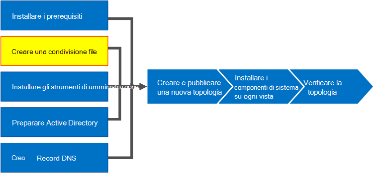

# Creare una condivisione file in Skype for Business ServerCreate a file share in Skype for Business Server
 
**Riepilogo:** Informazioni su come creare una condivisione file di Windows Server come parte dell'installazione di Skype for Business Server.**Summary:** Learn how to create a Windows Server file share as part of the installation of Skype for Business Server. Scaricare una versione di valutazione gratuita di Skype for Business Server dal Microsoft Evaluation Center all'[https://www.microsoft.com/evalcenter/evaluate-skype-for-business-server](https://www.microsoft.com/evalcenter/evaluate-skype-for-business-server)Indirizzo:.Download a free trial of Skype for Business Server from the Microsoft Evaluation center at:[https://www.microsoft.com/evalcenter/evaluate-skype-for-business-server](https://www.microsoft.com/evalcenter/evaluate-skype-for-business-server).
  
Skype for Business Server richiede una condivisione file in modo che i computer di tutta la topologia possano scambiare file.Skype for Business Server requires a file share so that computers throughout the topology can exchange files. La creazione di una condivisione file è il passaggio 2 di 8 nel processo di installazione di Skype for Business Server.Creating a file share is step 2 of 8 in the installation process for Skype for Business Server. È possibile eseguire i passaggi da 1 a 5 in qualsiasi ordine.You can do steps 1 through 5 in any order. Tuttavia, è necessario eseguire i passaggi 6, 7 e 8 in ordine e dopo i passaggi da 1 a 5 come indicato nel diagramma.However, you must do steps 6, 7, and 8 in order, and after steps 1 through 5 as outlined in the diagram. Per informazioni sulla pianificazione della condivisione file, vedere [requisiti ambientali per i requisiti di Skype for Business Server](../../plan-your-deployment/requirements-for-your-environment/environmental-requirements.md) o server [per Skype for Business Server 2019](../../../SfBServer2019/plan/system-requirements.md).For planning details about file share, see [Environmental requirements for Skype for Business Server](../../plan-your-deployment/requirements-for-your-environment/environmental-requirements.md) or [Server requirements for Skype for Business Server 2019](../../../SfBServer2019/plan/system-requirements.md).
  

  
## Creare una condivisione di file di baseCreate a basic file share

Questa sezione illustra la creazione di una condivisione di file di Windows Server di base.This section walks you through creating a basic Windows Server file share. È supportata una condivisione file di base di Windows Server con Skype for Business Server.A basic Windows Server file share is supported with Skype for Business Server. Tuttavia, non garantisce in modo esplicito una disponibilità elevata.However, it does not explicitly provide high availability. Per un ambiente ad alta disponibilità, è consigliabile una condivisione file del file System distribuito (DFS).For a high availability environment, a Distributed File System (DFS) file share is recommended. Per altre informazioni su una condivisione di file ad alta disponibilità e su DFS, vedere [pianificare l'elevata disponibilità e il ripristino di emergenza in Skype for Business Server](../../plan-your-deployment/high-availability-and-disaster-recovery/high-availability-and-disaster-recovery.md).For more information about a high availability file share and DFS, see [Plan for high availability and disaster recovery in Skype for Business Server](../../plan-your-deployment/high-availability-and-disaster-recovery/high-availability-and-disaster-recovery.md).
  
> [!NOTE]
> Windows Server 2012 R2 ha compiuto notevoli salti nella fornitura di soluzioni di condivisione file di tipo SAN (Storage Area Network) con la piattaforma Windows Server.Windows Server 2012 R2 has made major leaps in providing Storage Area Network (SAN)-like file share solutions using the Windows Server platform. Rispetto a un dispositivo tradizionale basato su SAN, una soluzione di archiviazione di Windows Server 2012 R2 può ridurre i costi a metà con un impatto molto minimo sulle prestazioni.When compared to a traditional SAN-based appliance, a Windows Server 2012 R2 storage solution can cut costs in half with very minimal impact to performance. Per altre informazioni sulle opzioni di condivisione file in Windows Server 2012 R2, vedere lo spazio di archiviazione scaricabile white paper [Windows server 2012 R2](https://download.microsoft.com/download/9/4/A/94A15682-02D6-47AD-B209-79D6E2758A24/Windows_Server_2012_R2_Storage_White_Paper.pdf).For more information about file share options in Windows Server 2012 R2, see the downloadable white paper [Windows Server 2012 R2 Storage](https://download.microsoft.com/download/9/4/A/94A15682-02D6-47AD-B209-79D6E2758A24/Windows_Server_2012_R2_Storage_White_Paper.pdf). 
  
Guardare la procedura video per **creare una condivisione file**:Watch the video steps for **create a file share**:
  
> [!video https://www.microsoft.com/en-us/videoplayer/embed/dbef31be-e899-4a32-a1ca-370053284f56?autoplay=false]
  
### Creare una condivisione di file di baseCreate a basic file share

1. Accedere al computer in cui verrà ospitata la condivisione file.Log on to the computer that will host the file share.
    
2. Fare clic con il pulsante destro del mouse sulla cartella che si prevede di condividere e scegliere **Proprietà**.Right-click the folder you plan to share, and select **Properties**.
    
3. Selezionare la scheda **condivisione** e fare clic su **condivisione avanzata**.Select the **Sharing** tab, and click **Advanced Sharing**.
    
4. Fare clic su **Condividi cartella**.Click **Share this folder**.
    
5. Fare clic su **autorizzazioni**.Click **Permissions**.
    
6. Aggiungere il gruppo **Administrators** locale del server che ospita la condivisione file, concedere **Consenti: controllo completo, modifica e** diritti di lettura e quindi fare clic su **OK**.Add the local **Administrators** group of the server hosting the file share, grant **Allow: Full Control, Change, and Read** rights, and then click **OK**.
    
7. Fare di nuovo clic su **OK** e prendere nota del percorso di rete.Click **OK** again and take note of the network path.
    
8. Fare clic su **fine** per chiudere la procedura guidata.Click **Done** to close the wizard.
    
     
  
> [!NOTE]
>Se l'archivio file è ospitato in una condivisione DFS, verrà ricevuto l'avviso seguente:If the file store is hosted on a DFS share, the following warning will be received:

Avviso: non è possibile accedere alle autorizzazioni di\\<domain>\<condivisione per "Condividi>".Warning: Unable to access share permissions for "\\<domain>\<share>".

>Questa operazione è prevista se non si è un amministratore nel file server o se si tratta di una condivisione di file System distribuito (DFS).This is expected if you are not an administrator on the file server, or if this is a Distributed File System (DFS) share. Se le autorizzazioni di condivisione sono già state configurate, questo avviso può essere ignorato.If the share permissions have already been configured, this warning can be ignored. Se si tratta di una nuova condivisione, vedere la documentazione per informazioni dettagliate sulla configurazione manuale delle autorizzazioni di condivisione.If it is a new share, refer to the documentation for details on manually configuring share permissions.

>A causa dell'impossibilità di accedere alle autorizzazioni di condivisione per una condivisione DFS, Skype for Business Server non sarà in grado di impostare esplicitamente i gruppi sulla condivisione file.Due to the inability to access the share permissions on a DFS share, Skype for Business Server will not be able to explicitly set groups on the file share. Per assicurarti che i componenti di Skype for Business Server possano accedere alla condivisione file con le autorizzazioni appropriate, assicurati che i gruppi RTC seguenti vengano aggiunti con le autorizzazioni di condivisione del livello di modifica oltre agli amministratori locali con autorizzazioni di condivisione controllo completo.To ensure Skype for Business Server components can access the file share with the appropriate permissions, ensure the following RTC groups are added with Change level share permissions in addition to the local Administrators with Full Control share permissions.

RTCHSUniversalServices RTCComponentUniversalServices RTCUniversalServerAdminsRTCHSUniversalServices RTCComponentUniversalServices RTCUniversalServerAdmins
