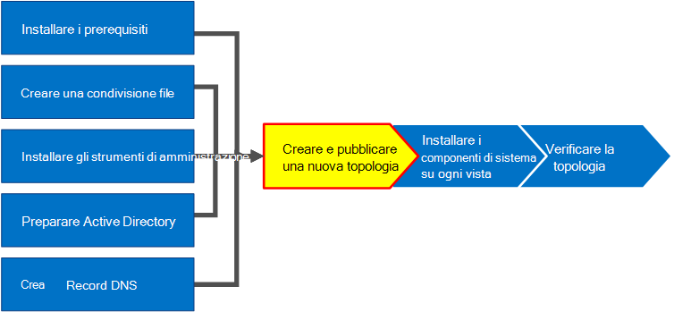
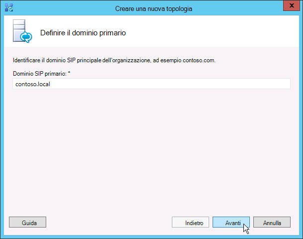
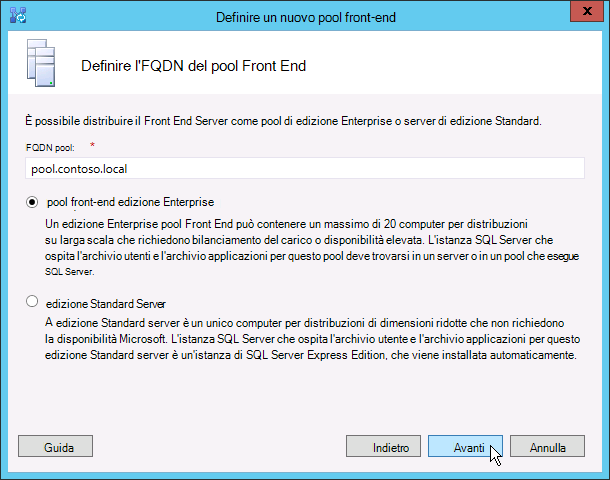
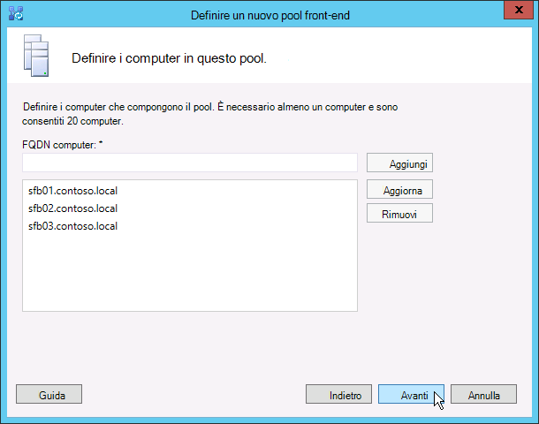
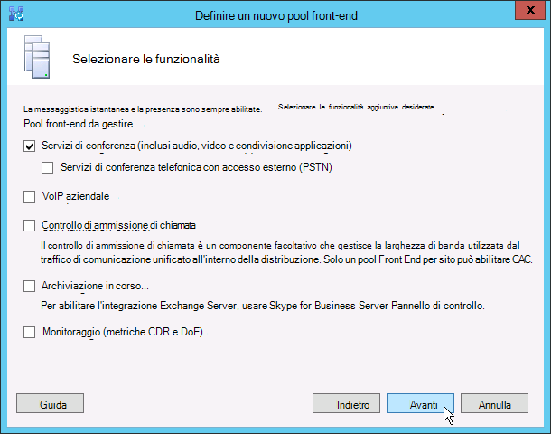
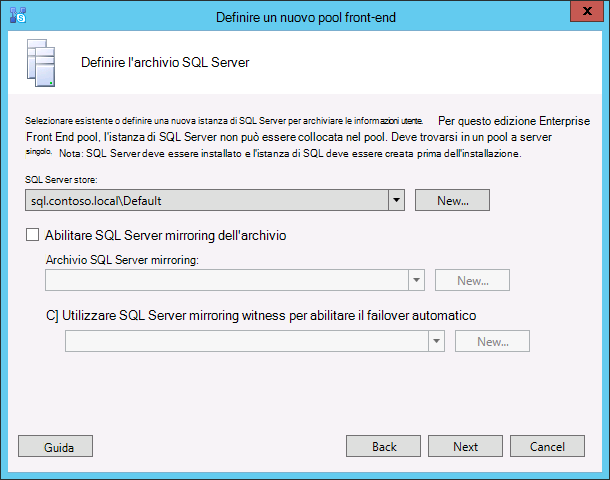
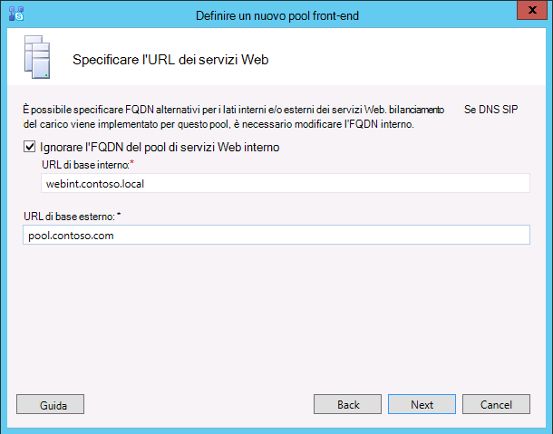
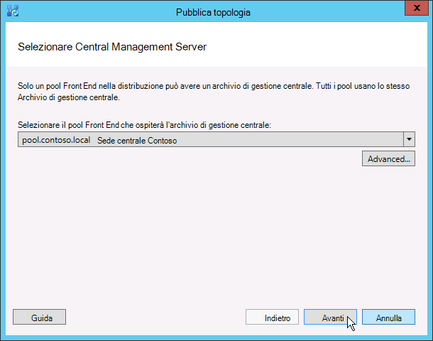
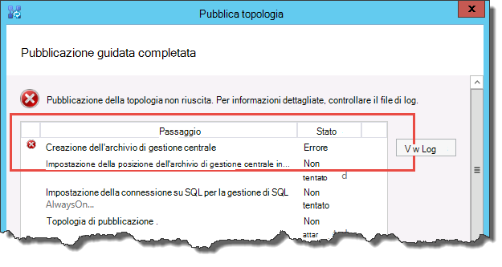

# Creare e pubblicare una nuova topologia in Skype for Business Server
 
**Riepilogo:** Informazioni su come creare, pubblicare e verificare una nuova topologia prima di installare Skype for Business Server. Scaricare una versione di valutazione gratuita di Skype for Business Server dal Centro di valutazione Microsoft all'indirizzo: [https://www.microsoft.com/evalcenter/evaluate-skype-for-business-server](https://www.microsoft.com/evalcenter/evaluate-skype-for-business-server) .
  
Prima di installare il Skype for Business Server in ognuno dei server della topologia, è necessario creare una topologia e pubblicarla. Quando si pubblica una topologia, le informazioni sulla topologia vengono caricate nel database dell'archivio di gestione centrale. Se si tratta di un pool edizione Enterprise, si sta creando il database dell'archivio di gestione centrale la prima volta che si pubblica una nuova topologia. Se si tratta edizione Standard, sarà necessario eseguire il processo Prepare First edizione Standard Server dalla Distribuzione guidata prima di pubblicare una topologia. In questo modo si prepara edizione Standard'installazione di un'istanza di SQL Server Express Edition e creando l'archivio di gestione centrale. È possibile eseguire i passaggi da 1 a 5 in qualsiasi ordine. È tuttavia necessario eseguire i passaggi 6, 7 e 8 nell'ordine e dopo i passaggi da 1 a 5, come illustrato nel diagramma. Come creare e pubblicare una nuova topologia, vedere il passaggio 6 di 8.
  

  
## Creare e pubblicare una nuova topologia

È possibile utilizzare Skype for Business Server generatore di topologie per progettare, definire, configurare e pubblicare topologie. Questo strumento è stato installato durante l'installazione di Strumenti di amministrazione in precedenza nell'articolo. Quando si crea una topologia, è possibile effettuare diverse scelte. In questa procedura verrà creata una topologia di base con conferenze.
  
> [!IMPORTANT]
> Skype for Business Server richiede SQL Server per funzionare. I database principali sono noti come Archivio di gestione centrale. Se si distribuisce edizione Enterprise, questi database vengono creati quando si pubblica la topologia utilizzando la procedura seguente. In questo caso, Generatore di topologie richiederà le informazioni di connessione a un'SQL Server installazione. Se si prevede di distribuire edizione Standard, sarà necessario installare SQL Server Express Edition prima di definire e pubblicare la nuova topologia. Per installare SQL Server Express Edition, è necessario aprire la Distribuzione guidata nel server che fungerà da Front End e quindi eseguire Prepare First edizione Standard Server. Quando si fa clic su Prepare First edizione Standard Server, la Distribuzione guidata installa automaticamente SQL Server Express Edition e crea i database dell'archivio di gestione centrale. 
  
### Creare una nuova topologia

1. Accedere come utente standard con accesso a Generatore di topologie.
    
2. Aprire Skype for Business Server Generatore di topologie.
    
3. Selezionare **Nuova topologia e** fare clic su **OK.**
    
4. Selezionare un percorso e un nome di file per il file di configurazione della topologia.
    
    > [!NOTE]
    > La configurazione della topologia viene salvata come file XML (con estensione tbxml) di Generatore di topologie. Quando si pubblica una topologia, si esegue il push delle informazioni di configurazione dal file al database SQL Server database. Quando si apre Generatore di topologie in futuro, è possibile scaricare la configurazione esistente da SQL Server direttamente in Generatore di topologie e pubblicarla nuovamente in SQL Server o salvarla come file di configurazione di Generatore di topologie. 
  
5. Nella schermata **Definire il dominio primario immettere** il dominio SIP **primario** e fare clic su **Avanti.** In questo esempio viene utilizzato **contoso.local**, come illustrato nella figura.
    
     
  
6. Aggiungere eventuali altri domini SIP supportati e quindi fare clic su **Avanti.**
    
7. Immettere un **nome** e **una descrizione** per il primo sito (posizione), quindi fare clic su **Avanti**, come illustrato nella figura.
    
     
  
8. Immettere **city**, **state/province** e **country/region code** per il sito e quindi fare clic su **Avanti**.
    
9. Fare **clic** su Fine per completare il processo di definizione di una nuova topologia. La Creazione guidata nuovo front-end viene avviata automaticamente.
    
### Definire un pool Front End o un edizione Standard server

1. Esaminare i prerequisiti della procedura guidata e quindi fare clic su **Avanti.**
    
2. Immettere il nome di dominio completo (FQDN) del pool e selezionare **edizione Enterprise Pool Front End** o edizione Standard **Server** e quindi fare clic su Avanti **,** come illustrato nella figura.
    
    > [!TIP]
    > Skype for Business Server edizione Enterprise possono includere più server che collaborano per fornire il ruolo Front End. Quando vengono utilizzati più server per svolgere il ruolo, viene chiamato pool. Di conseguenza, più server che collaborano per fornire il ruolo Front End vengono definiti anche pool Front End. Skype for Business Server edizione Standard può includere un solo server per fornire il ruolo Front End. È comune fare riferimento al pool Front End anche se solo un singolo server fornisce il ruolo. 
  
     
  
3. Immettere i nomi di dominio completi (FQDN) di tutti i computer del pool e quindi fare clic su **Avanti,** come illustrato nella figura.
    
     
  
4. Selezionare le funzionalità che verranno incluse in questa topologia e quindi fare clic su **Avanti,** come illustrato nella figura.
    
    > [!NOTE]
    > Skype for Business Server include molte funzionalità avanzate. Consultare la documentazione relativa alla pianificazione e alla distribuzione per ogni funzionalità specifica che si desidera utilizzare. 
  
     
  
5. Nella pagina **Selezione ruoli server collocati** è possibile scegliere di collocare il Mediation Server nel Front End Server oppure di distribuirlo come server autonomo.
    
    Se si intende collocare il Mediation Server nel pool Edizione Enterprise Front End, verificare che la casella di controllo sia selezionata. I ruoli del server verranno distribuiti nei server del pool. Se si intende distribuire il Mediation Server come server autonomo, deselezionare la casella di controllo appropriata. Il Mediation Server verrà distribuito in un passaggio di distribuzione separato dopo aver distribuito completamente il Front End Server. Per informazioni dettagliate sulla collocazione, vedere [Topology Basics for Skype for Business Server](../../plan-your-deployment/topology-basics/topology-basics.md).
    
6. Utilizzando la pagina Associa ruoli del server a questo **pool Front End,** è possibile definire e associare ruoli del server al pool Front End. È disponibile il seguente ruolo:
    
    **Abilitare un pool di server perimetrali** Definisce e associa un singolo server perimetrale o un pool di server perimetrali. Un server perimetrale facilita la comunicazione e la collaborazione tra gli utenti all'interno dell'organizzazione e gli utenti esterni all'organizzazione, inclusi gli utenti federati.
    
    Esistono due possibili scenari che è possibile utilizzare per distribuire e associare i ruoli del server.
    
    Per il primo scenario, è necessario definire una nuova topologia per una nuova installazione. È possibile eseguire l'installazione in uno dei due modi seguenti:
    
   - Lasciare deselezionata la casella di controllo e definire la topologia. Dopo aver pubblicato, configurato e testato i ruoli Front End e Back End Server, è possibile eseguire di nuovo Generatore di topologie per aggiungere i server dei ruoli alla topologia. Utilizzando questa strategia, è possibile testare il pool Front End e il server che esegue SQL Server senza ulteriori complicazioni da ruoli aggiuntivi. Dopo aver completato il test iniziale, è possibile eseguire di nuovo Generatore di topologie per selezionare i ruoli da distribuire.
    
   - Selezionare i ruoli che è necessario installare e quindi configurare l'hardware per gestire i ruoli selezionati.
    
     Per lo scenario 2, si dispone di una distribuzione esistente e l'infrastruttura è pronta per i nuovi ruoli oppure è necessario associare i ruoli esistenti a un nuovo Front End Server.
    
   - In questo caso, verranno selezionati i ruoli che si intende distribuire o associare al nuovo Front End Server. In entrambi i casi, sarà necessario procedere con la definizione dei ruoli, la configurazione dell'hardware necessario e l'installazione.
    
7. Successivamente, si definirà SQL Server'archivio che verrà utilizzato con la topologia. In questo esempio viene utilizzata l'istanza Default. Per ulteriori informazioni sulle SQL Server, ad esempio disponibilità elevata, vedere [Plan for high availability and disaster recovery in Skype for Business Server](../../plan-your-deployment/high-availability-and-disaster-recovery/high-availability-and-disaster-recovery.md).
    
   - Per utilizzare un archivio di SQL Server esistente già definito nella topologia, selezionare **Archivio SQL**.
    
   - Per definire una nuova istanza SQL Server in cui archiviare le informazioni sul pool, fare clic su **Nuovo** e quindi specificare il **nome di** dominio completo SQL Server nella finestra di dialogo Definisci nuovo **SQL Store.**
    
   - Per specificare il nome di un'istanza di SQL Server, selezionare **Istanza denominata** e quindi specificare il nome dell'istanza.
    
   - Per utilizzare l'istanza predefinita, fare clic su **Istanza predefinita**.
    
   - Per usare SQL mirroring, selezionare Abilita **SQL mirroring** e selezionare un'istanza esistente oppure creare una nuova istanza.

     > [!NOTE]
     > SQL Il mirroring è disponibile Skype for Business Server 2015, ma non è più supportato in Skype for Business Server 2019. I gruppi di disponibilità AlwaysOn, le istanze del cluster di failover AlwaysOn e i metodi di clustering di failover SQL sono preferiti con Skype for Business Server 2019.
    
     Per questo esempio, viene immesso **SQL Server FQDN** e vengono configurate eventuali impostazioni di disponibilità elevata rilevanti e quindi si fa clic su **OK,** come illustrato nella figura.
    
     
  
8. Decidere se si desidera abilitare il mirroring SQL Server o SQL Server mirroring e quindi fare clic su **Avanti.**
    
9. Definire la condivisione file che si desidera utilizzare.
    
   - Per utilizzare una condivisione file già definita nella topologia, selezionare **Utilizza condivisione file definita in precedenza**.
    
   - Per definire una nuova condivisione file, selezionare **Definisci nuova condivisione file**, nella casella **FQDN file server** immettere l'FQDN del file server esistente in cui deve trovarsi la condivisione file e quindi immettere un nome per la condivisione nella casella **Condivisione file**.
    
     Per questo esempio, fare clic su Definisci un **nuovo archivio file,** immettere l'FQDN e la condivisione **file** del **file server** e quindi fare clic su **Avanti.**
    
     > [!NOTE]
     > La condivisione file per Skype for Business Server può essere collocata, ma non è consigliabile per motivi di prestazioni. Si noti che in questo esempio la condivisione file si trova in un singolo server dedicato che fungerà da condivisione file. Tuttavia, sono consigliati altri sistemi di condivisione file più affidabili, ad esempio DFS Windows Server 2012 R2. Per informazioni dettagliate sui sistemi di condivisione file supportati, vedere [Requirements for your Skype for Business environment](../../plan-your-deployment/requirements-for-your-environment/requirements-for-your-environment.md). Per ulteriori informazioni sulla creazione della condivisione file, vedere [Create a file share in Skype for Business Server](create-a-file-share.md). È possibile definire la condivisione file senza che questa sia stata creata. Sarà necessario creare la condivisione file nella posizione definita prima di pubblicare la topologia. 
  
10. Nella pagina Specificare l'URL dei servizi Web è necessario decidere se è necessario sostituire l'URL di base del pool di servizi Web interno. Il motivo di questa sostituzione ha a che fare con il bilanciamento del carico. Il traffico SIP di base può essere bilanciato tramite il bilanciamento del carico DNS semplice. Tuttavia, il traffico di rete dei servizi Web HTTP/S deve utilizzare una soluzione di bilanciamento del carico hardware o software supportata. Per i servizi di bilanciamento del carico supportati, [vedere Infrastructure for Skype for Business](../../../SfbPartnerCertification/certification/infra-gateways.md). In questo esempio è stato utilizzato il bilanciamento del carico DNS per il traffico SIP e una soluzione di bilanciamento del carico software supportata. Poiché il traffico viene diviso in questo modo, è necessario sostituire l'FQDN del pool di servizi Web interno. In alternativa, se si disponesse di un servizio di bilanciamento del carico della linea superiore e si invii tutto il traffico attraverso di esso invece di usare il bilanciamento del carico DNS per il traffico SIP, non sarebbe necessario sostituire l'URL dei servizi Web. 
    
    Nella sezione DNS di questo argomento è stato creato un record A per webint.contoso.local. Questo è l'URL utilizzato per il traffico HTTP/S dei servizi Web e deve passare attraverso il servizio di bilanciamento del carico software supportato configurato. Pertanto, in questo esempio viene eseguito l'override dell'URL per far sapere Skype for Business Server che tutto il traffico HTTP/S deve passare a webint.contoso.local anziché a pool.contoso.local, come illustrato nella figura. Per ulteriori informazioni sul bilanciamento del carico, vedere [Load balancing requirements for Skype for Business](../../plan-your-deployment/network-requirements/load-balancing.md).
    
    > [!IMPORTANT]
    > L'URL di base è l'identità dei servizi Web per l'URL meno https://. Ad esempio, se l'URL completo per i servizi Web del pool è https://webint.contoso.local , l'URL di base è webint.contoso.local. 
  
    - Se si sta configurando il bilanciamento del carico DNS, come in questo esempio, selezionare la casella di controllo Ignora **FQDN** pool di servizi Web interni e immettere l'URL di base interno (che deve essere diverso dall'FQDN del pool) in **URL di base interno**. 
    
    > [!CAUTION]
    > Se si decide di sostituire i servizi Web interni con un fqdn autodefinito, ogni FQDN deve essere univoco da qualsiasi altro pool Front End, Director o pool di server Director. **Utilizzare solo caratteri standard** (inclusi A-Z, a-z, 0-9 e trattini) quando si definiscono URL o nomi di dominio completi. Non utilizzare caratteri Unicode o di sottolineatura. I caratteri non standard in un URL o fqdn spesso non sono supportati da DNS esterni e autorità di certificazione pubbliche (CA), ovvero quando l'URL o il nome di dominio completo deve essere assegnato al nome soggetto o al nome alternativo del soggetto nel certificato.
  
    - Facoltativamente, immettere l'URL di base esterno in **URL di base esterno**. È necessario immettere l'URL di base esterno per differenziarlo dal nome di dominio interno. Ad esempio, il dominio interno è contoso.local, ma il nome di dominio esterno è contoso.com. È necessario definire l'URL contoso.com nome di dominio perché deve essere risolvibile dal DNS pubblico. Questo è un aspetto importante anche nel caso di un proxy inverso. Il nome di dominio dell'URL di base esterno corrisponde al nome di dominio del nome di dominio completo del proxy inverso. L'accesso HTTP al pool Front End è necessario per la messaggistica istantanea e la presenza nei client mobili.
    
      
  
11. Se nella pagina **Seleziona** **funzionalità** è stata selezionata l'opzione Conferenza, verrà richiesto di selezionare un server Office Web Apps. Fare **clic su** Nuovo per avviare la finestra di dialogo.
    
12. Nella finestra **di dialogo Definisci** nuovo server app Web Office digitare il nome di dominio completo del server web apps Office nella casella FQDN server web apps di **Office;** quando si esegue questa operazione, l'URL Office di individuazione del server Web Apps deve essere immesso automaticamente nella casella URL di individuazione Office **server Web Apps.**
    
    Se il server Office Web Apps è installato in locale e nella stessa area di rete di Skype for Business Server, non selezionare l'opzione Office Web Apps Server viene distribuita in una rete esterna, ovvero **perimetrale/Internet.**
    
    Se il server Office Web Apps viene distribuito all'esterno del firewall interno, selezionare l'opzione Office Il server Web Apps è distribuito in una rete **esterna( perimetro/Internet).**
    
13. Fare **clic su** Fine per completare la configurazione. Se sono stati definiti altri server ruolo nella pagina Associa ruoli server a questo **pool Front End,** verranno aperte pagine separate della configurazione guidata dei ruoli in cui è possibile configurare i ruoli del server. In questo esempio abbiamo scelto solo le conferenze.
    
### Configurare GLI URL semplici

1. In Generatore di topologie fare  clic con il Skype for Business Server nodo superiore e quindi scegliere **Modifica** proprietà , come illustrato nella figura.
    
     
  
2. Nel riquadro **URL semplici** selezionare Telefono URL di **accesso:** (Accesso esterno) o URL **riunione:** (Riunione) da modificare e quindi fare clic su **Modifica URL**.
    
3. Aggiornare l'URL in base al valore desiderato e quindi fare clic su **OK** per salvare l'URL modificato. È consigliabile configurare l'URL semplice utilizzando il dominio SIP esterno in modo che gli utenti esterni possano partecipare alle riunioni, ad esempio contoso.com, che è esterno, anziché contoso.local, che è un dominio interno. Di conseguenza, il dominio SIP deve essere in grado di essere risolto da DNS esterno.
    
4. Se necessario, modificare l'URL riunione eseguendo la stessa procedura.
    
### Per definire l'URL semplice facoltativo per l'accesso amministrativo

1. In Generatore di topologie fare clic con il pulsante destro **del mouse sul** Skype for Business Server e quindi scegliere Modifica **proprietà**.
    
2. Nella casella **URL accesso amministrativo** immettere l'URL semplice desiderato per l'accesso amministrativo Skype for Business Server Pannello di controllo e quindi fare clic su **OK.**
    
    > [!TIP]
    > È consigliabile utilizzare l'URL più semplice possibile per l'accesso amministrativo. L'opzione più semplice è https://admin _\<domain\>_ . L'URL di amministratore può essere un dominio interno o esterno, ad esempio contoso.local o contoso.com, purché uno dei due record sia risolvibile nel DNS interno. 
  
    > [!IMPORTANT]
    > Se si modifica un URL semplice dopo la distribuzione iniziale, è necessario considerare quali modifiche influiscono sui record DNS (Domain Name System) e sui certificati per gli URL semplici. Se la modifica influisce sulla base di un URL semplice, è necessario modificare anche i record DNS e i certificati. Ad esempio, se si cambia l'URL di base da sfb.contoso.com a meet.contoso.com, è necessario modificare i record DNS e i certificati per fare riferimento a https://sfb.contoso.com/Meet https://meet.contoso.com meet.contoso.com. Se è stato modificato l'URL semplice da a , l'URL di base di sfb.contoso.com rimane lo stesso, quindi non sono necessarie modifiche al DNS o https://sfb.contoso.com/Meet https://sfb.contoso.com/Meetings al certificato. Ogni volta che si modifica un nome di URL semplice, tuttavia, è necessario eseguire il cmdlet **Enable-CsComputer** in ogni Server Director e Front End Server per registrare la modifica.
  
### Pubblicare e verificare la topologia

1. Controllare che tutti gli URL semplici siano configurati in modo corretto.
    
2. Verificare che il server SQL Server sia online e disponibile per il computer in cui è installato Generatore di topologie, incluse le eventuali regole firewall necessarie.
    
3. Verificare che la condivisione file sia disponibile e che siano definite le autorizzazioni appropriate.
    
4. Verificare che nella topologia siano definiti i ruoli del server corretti conformi ai requisiti della distribuzione.
    
5. Verificare che i server esistano in Servizi di dominio Active Directory. Ciò avviene automaticamente quando si aggiunge i server al dominio.
    
    Dopo aver verificato la topologia e stabilito che non sono presenti errori di convalida, è possibile procedere con la pubblicazione della topologia. Se sono presenti errori di convalida, è necessario correggerli prima di poter pubblicare la topologia.
    
6. Fare clic con il pulsante **destro del Skype for Business Server** e quindi scegliere Pubblica **topologia**.
    
7. Nella pagina **Pubblicare la topologia** fare clic su **Avanti**.
    
8. Nella pagina **Selezione server di gestione** centrale selezionare un pool Front End, come illustrato nella figura.
    
    > [!NOTE]
    > È possibile fare clic **su Avanzate** per configurare i percorsi dei file di database.
  
     
  
9. Nella pagina **Selezione database** selezionare i database che si desidera pubblicare.
    
    > [!NOTE]
    > Se non si dispone dei diritti appropriati per creare i database, è possibile deselezionare le caselle di controllo accanto a tali database e un utente con i diritti appropriati potrà successivamente creare i database. Per informazioni dettagliate sui requisiti, vedere [Server requirements for Skype for Business Server](../../plan-your-deployment/requirements-for-your-environment/server-requirements.md). 
  
10. Facoltativamente, fare clic su **Avanzate**. Utilizzando le opzioni avanzate SQL Server di posizionamento dei file di dati, è possibile scegliere tra le opzioni seguenti: 
    
    - **Determina automaticamente** il percorso dei file di database- Questa opzione determina le migliori prestazioni operative in base alla configurazione del disco nel server basato su SQL Server distribuendo i file di registro e di dati nel percorso migliore.
    
    - **Use SQL Server instance defaults** - Questa opzione consente di collocare i file di registro e di dati nel server basato SQL Server-based utilizzando le impostazioni dell'istanza. Non utilizza la funzionalità operativa del server basato su SQL Server di determinazione dei percorsi ottimali per i registri e i dati. L'amministratore di SQL Server in genere sposta i file di registro e di dati nei percorsi appropriati per le procedure di gestione del server basato su SQL Server e dell'organizzazione.
    
    Fare clic su **OK** e quindi su **Avanti**. 
    
11. Facoltativamente, fare clic su **Avanzate.** Utilizzando le opzioni avanzate SQL Server di posizionamento dei file di dati, è possibile scegliere tra le opzioni seguenti: 
    
    - **Determina automaticamente** il percorso dei file di database- Questa opzione determina le migliori prestazioni operative in base alla configurazione del disco nel server basato su SQL Server distribuendo i file di registro e di dati nel percorso migliore.
    
    - **Use SQL Server instance defaults** - Questa opzione consente di collocare i file di registro e di dati nel server basato SQL Server-based utilizzando le impostazioni dell'istanza. Non utilizza la funzionalità operativa del server basato su SQL Server di determinazione dei percorsi ottimali per i registri e i dati. L'amministratore di SQL Server in genere sposta i file di registro e di dati nei percorsi appropriati per le procedure di gestione del server basato su SQL Server e dell'organizzazione.
    
    Fare clic su **OK**.
    
12. Fare clic su **Avanti** per completare il processo di pubblicazione.
    
    > [!NOTE]
    > Un errore comune per questo passaggio è che non è possibile creare SQL Server database. Quando il processo non può essere completato, viene generato un errore, come illustrato nella figura. La causa più probabile è che l'utente che tenta di creare il database non dispone delle autorizzazioni appropriate o che il sistema SQL Server non può essere contattato a causa di un firewall o di un altro problema di rete. 
  
     
  
13. Al termine del processo di pubblicazione, viene visualizzato un collegamento per aprire un elenco dei passaggi successivi. Fare **clic su Fare clic qui per aprire l'elenco** attività per visualizzare i passaggi successivi e quindi fare clic su **Fine.** 
    
    Il messaggio "Completato con avvisi" per la creazione del database non significa che si sia verificato un errore. Il processo di installazione deve modificare le impostazioni in SQL Server perché Skype for Business Server funzioni correttamente. Quando un'impostazione viene modificata in SQL Server, viene registrata come avviso in modo che gli SQL Server amministratori possano comprendere esattamente cosa è stato completato il processo di installazione. Se viene visualizzato un avviso, è possibile selezionare il record e quindi fare clic su **Visualizza** registri per visualizzare i dettagli dell'avviso.
    
    Una volta pubblicata correttamente la topologia, è possibile iniziare a installare una replica locale dell'archivio di gestione centrale in ogni server che esegue Skype for Business Server nella topologia. È consigliabile iniziare con il primo pool Front End. 
