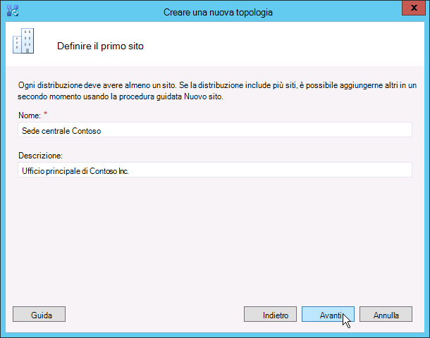

# Creare e pubblicare una nuova topologia in Skype for Business Server
 
**Riepilogo:** Informazioni su come creare, pubblicare e verificare una nuova topologia prima di installare Skype for Business Server.
  
Prima di poter installare il sistema Skype for Business Server in ognuno dei server nella topologia, è necessario creare una topologia e pubblicarla. Quando si pubblica una topologia, si caricano le informazioni sulla topologia nel database dell'archivio di gestione centrale. Se si tratta di un pool di edizione Enterprise, si sta creando il database dell'archivio di gestione centrale la prima volta che si pubblica una nuova topologia. Se si tratta di edizione Standard, sarà necessario eseguire il processo Prepare First edizione Standard Server dalla Distribuzione guidata prima di pubblicare una topologia. Questa operazione si prepara per edizione Standard installando un'istanza di SQL Server Express Edition e creando l'archivio di gestione centrale. È possibile eseguire i passaggi da 1 a 5 in qualsiasi ordine. Tuttavia, è necessario eseguire i passaggi 6, 7 e 8 nell'ordine e dopo i passaggi da 1 a 5, come descritto nel diagramma. Come creare e pubblicare una nuova topologia è descritto nel passaggio 6 di 8.
  

  
## Creare e pubblicare una nuova topologia

È possibile usare Skype for Business Server Generatore di topologie per progettare, definire, configurare e pubblicare topologie. Questo strumento è stato installato durante l'installazione di Strumenti di amministrazione in precedenza nell'articolo. Quando si crea una topologia, è possibile effettuare molte scelte diverse. In questa procedura si creerà una topologia di base con conferenze.
  
> [!IMPORTANT]
> Skype for Business Server richiede SQL Server per funzionare. I database primari sono noti come Archivio di gestione centrale. Se si distribuisce edizione Enterprise, questi database vengono creati quando si pubblica la topologia seguendo la procedura seguente. In questo caso, Generatore di topologie chiederà le informazioni di connessione a un'installazione SQL Server. Se si prevede di distribuire edizione Standard, è necessario installare SQL Server Express Edition prima di definire e pubblicare la nuova topologia. Per installare SQL Server Express Edition, è necessario aprire la Distribuzione guidata nel server che fungerà da Front End e quindi eseguire Prepare First edizione Standard Server. Quando si fa clic su Prepare First edizione Standard Server, la Distribuzione guidata installa automaticamente SQL Server Express Edition e crea i database dell'archivio di gestione centrale. 
  
### Creare una nuova topologia

1. Accedere come utente standard con accesso a Generatore di topologie.
    
2. Aprire Skype for Business Server Generatore di topologie.
    
3. Selezionare **Nuova topologia** e fare clic su **OK**.
    
4. Selezionare un percorso e un nome di file per il file di configurazione della topologia.
    
    > [!NOTE]
    > La configurazione della topologia viene salvata come file XML (con estensione tbxml) di Generatore di topologie. Quando si pubblica una topologia, si esegue il push delle informazioni di configurazione dal file al database SQL Server. Quando si apre Generatore di topologie in futuro, è possibile scaricare la configurazione esistente da SQL Server direttamente in Generatore di topologie e pubblicarla nuovamente in SQL Server o salvarla come file di configurazione di Generatore di topologie. 
  
5. Nella **schermata Definisci dominio primario** immettere il **dominio SIP primario** e fare clic su **Avanti**. In questo esempio viene usato `contoso.local`, come illustrato nella figura .
    
     
  
6. Aggiungere eventuali altri domini SIP supportati e quindi fare clic su **Avanti**.
    
7. Immettere un **nome** e una **descrizione** per il primo sito (posizione) e quindi fare clic su **Avanti**, come illustrato nella figura.
    
     
  
8. Immettere la **città**, **lo stato/provincia** e il **codice paese/area geografica** per il sito e quindi fare clic su **Avanti**.
    
9. Fare clic su **Fine** per completare il processo di definizione di una nuova topologia. La Creazione guidata nuovo front-end viene avviata automaticamente.
    
### Definire un pool Front End o un server edizione Standard

1. Esaminare i prerequisiti della procedura guidata e quindi fare clic su **Avanti**.
    
2. Immettere il nome di dominio completo (FQDN) del pool e selezionare **edizione Enterprise pool Front End** o **edizione Standard Server**, quindi fare clic su **Avanti**, come illustrato nella figura.
    
    > [!TIP]
    > Skype for Business Server edizione Enterprise può includere più server che interagiscono per fornire il ruolo Front End. Quando vengono usati più server per svolgere il ruolo, viene chiamato pool. Pertanto, più server che interagiscono per fornire il ruolo Front End vengono definiti anche pool Front End. Skype for Business Server edizione Standard può includere un solo server per fornire il ruolo Front End. È comune fare riferimento al pool Front End anche se il ruolo viene fornito solo da un singolo server. 
  
     
  
3. Immettere i nomi di dominio completi (FQDN) di tutti i computer nel pool e quindi fare clic su **Avanti** come illustrato nella figura.
    
     
  
4. Selezionare le funzionalità che verranno incluse in questa topologia e quindi fare clic su **Avanti** , come illustrato nella figura.
    
    > [!NOTE]
    > Skype for Business Server include molte funzionalità avanzate. Esaminare la documentazione relativa alla pianificazione e alla distribuzione per ogni funzionalità specifica che si vuole usare. 
  
     
  
5. Nella pagina **Selezione ruoli server collocati** è possibile scegliere di collocare il mediation server nel server Front End oppure è possibile scegliere di distribuirlo come server autonomo.
    
    Se si intende collocare il mediation server nel pool front-end edizione Enterprise, assicurarsi che la casella di controllo sia selezionata. I ruoli del server verranno distribuiti nei server del pool. Se si intende distribuire il mediation server come server autonomo, deselezionare la casella di controllo appropriata. Il mediation server verrà distribuito in un passaggio di distribuzione separato dopo aver distribuito completamente il server Front End. Per informazioni dettagliate sulla pianificazione di una collocazione, vedere [Nozioni di base sulla topologia per Skype for Business Server](../../plan-your-deployment/topology-basics/topology-basics.md).
    
6. Usando la pagina **Associare i ruoli del server a questo pool Front End** , è possibile definire e associare i ruoli del server al pool Front End. È disponibile il seguente ruolo:
    
    **Abilitare un pool di server perimetrali** Definisce e associa un singolo server perimetrale o un pool di server perimetrali. Un server Perimetrale facilita la comunicazione e la collaborazione tra gli utenti all'interno dell'organizzazione e gli utenti esterni all'organizzazione, inclusi gli utenti federati.
    
    Esistono due scenari possibili che è possibile usare per distribuire e associare i ruoli del server.
    
    Per il primo scenario, è necessario definire una nuova topologia per una nuova installazione. È possibile affrontare l'installazione in uno dei due modi seguenti:
    
   - Lasciare deselezionata la casella di controllo e definire la topologia. Dopo aver pubblicato, configurato e testato i ruoli Front End e Back End Server, è possibile eseguire di nuovo Generatore di topologie per aggiungere i server ruolo alla topologia. Usando questa strategia, è possibile testare il pool Front End e il server in esecuzione SQL Server senza complicazioni aggiuntive da parte di ruoli aggiuntivi. Dopo aver completato il test iniziale, è possibile eseguire di nuovo Generatore di topologie per selezionare i ruoli da distribuire.
    
   - Selezionare i ruoli che è necessario installare e quindi configurare l'hardware per gestire i ruoli selezionati.
    
     Per lo scenario 2, si dispone di una distribuzione esistente e l'infrastruttura è pronta per i nuovi ruoli oppure è necessario associare i ruoli esistenti a un nuovo server Front End.
    
   - In questo caso, si selezioneranno i ruoli che si intende distribuire o associare al nuovo server Front End. In entrambi i casi, sarà necessario procedere con la definizione dei ruoli, la configurazione dell'hardware necessario e l'installazione.
    
7. Successivamente, si definirà l'archivio SQL Server che verrà usato con la topologia. In questo esempio viene usata l'istanza Predefinita. Per altre informazioni sulle funzionalità di SQL Server, ad esempio disponibilità elevata, vedere Pianificare la [disponibilità elevata e il ripristino di emergenza in Skype for Business Server](../../plan-your-deployment/high-availability-and-disaster-recovery/high-availability-and-disaster-recovery.md).
    
   - Per utilizzare un archivio di SQL Server esistente già definito nella topologia, selezionare **Archivio SQL**.
    
   - Per definire una nuova istanza di SQL Server per archiviare le informazioni del pool, fare clic su **Nuovo** e quindi specificare il **nome di dominio completo SQL Server** nella finestra di dialogo **Definisci nuovo archivio SQL**.
    
   - Per specificare il nome di un'istanza di SQL Server, selezionare **Istanza denominata** e quindi specificare il nome dell'istanza.
    
   - Per utilizzare l'istanza predefinita, fare clic su **Istanza predefinita**.
    
   - Per usare SQL mirroring, selezionare **Abilita mirroring SQL** e selezionare un'istanza esistente oppure creare una nuova istanza.

     > [!NOTE]
     > SQL Mirroring è disponibile in Skype for Business Server 2015, ma non è più supportato in Skype for Business Server 2019. I gruppi di disponibilità AlwaysOn, le istanze del cluster di failover AlwaysOn e i metodi di clustering di failover SQL sono preferiti con Skype for Business Server 2019.
    
     Per questo esempio viene immesso il **nome di dominio completo SQL Server** e vengono configurate tutte le impostazioni di disponibilità elevata pertinenti e quindi si fa clic su **OK**, come illustrato nella figura.
    
     
  
8. Decidere se si vuole abilitare SQL Server mirroring dell'archivio o SQL Server mirroring di controllo e quindi fare clic su **Avanti**.
    
9. Definire la condivisione file che si vuole usare.
    
   - Per utilizzare una condivisione file già definita nella topologia, selezionare **Utilizza condivisione file definita in precedenza**.
    
   - Per definire una nuova condivisione file, selezionare **Definisci nuova condivisione file**, nella casella **FQDN file server** immettere l'FQDN del file server esistente in cui deve trovarsi la condivisione file e quindi immettere un nome per la condivisione nella casella **Condivisione file**.
    
     Per questo esempio, fare clic su **Definisci un nuovo archivio file**, immettere il **nome di dominio completo** e la **condivisione file** del file server e quindi fare clic su **Avanti**.
    
     > [!NOTE]
     > La condivisione file per Skype for Business Server può essere collocata, ma non è consigliata per motivi di prestazioni. Si noti che in questo esempio la condivisione file si trova in un singolo server dedicato che fungerà da condivisione file. Tuttavia, sono consigliati altri sistemi di condivisione file più affidabili, ad esempio DFS che usa Windows Server 2012 R2. Per informazioni dettagliate sui sistemi di condivisione file supportati, vedere [Requisiti per l'ambiente Skype for Business](../../plan-your-deployment/requirements-for-your-environment/requirements-for-your-environment.md). Per altre informazioni sulla creazione della condivisione file, vedere [Creare una condivisione file in Skype for Business Server](create-a-file-share.md). È possibile definire la condivisione file senza che questa sia stata creata. Sarà necessario creare la condivisione file nella posizione definita prima di pubblicare la topologia. 
  
10. Nella pagina Specificare l'URL dei servizi Web è necessario decidere se è necessario eseguire l'override dell'URL di base del pool di servizi Web interno. Il motivo di questa sostituzione è dovuto al bilanciamento del carico. Il traffico SIP di base può essere bilanciato dal carico tramite un semplice bilanciamento del carico DNS. Tuttavia, il traffico di rete dei servizi Web HTTP/S deve usare una soluzione di bilanciamento del carico hardware o software supportata. Per i servizi di bilanciamento del carico supportati, vedere [Infrastruttura per Skype for Business](../../../SfbPartnerCertification/certification/infra-gateways.md). In questo esempio è stato usato il bilanciamento del carico DNS per il traffico SIP e una soluzione di bilanciamento del carico software supportata. Poiché il traffico viene diviso in questo modo, è necessario eseguire l'override del nome di dominio completo del pool di servizi Web interno. In alternativa, se si avesse un servizio di bilanciamento del carico di prima linea e si inviasse tutto il traffico invece di usare il bilanciamento del carico DNS per il traffico SIP, non sarebbe necessario eseguire l'override dell'URL dei servizi Web. 
    
    Nella sezione DNS di questo argomento è stato creato un record A per `webint.contoso.local`. Questo è l'URL usato per il traffico HTTP/S dei servizi Web e deve passare attraverso il servizio di bilanciamento del carico software supportato configurato. Di conseguenza, in questo esempio viene eseguito l'override dell'URL per consentire a Skype for Business Server di sapere che tutto il traffico HTTP/S deve andare a `webint.contoso.local` anziché `pool.contoso.local`, come illustrato nella figura. Per altre informazioni sul bilanciamento del carico, vedere [Requisiti di bilanciamento del carico per Skype for Business](../../plan-your-deployment/network-requirements/load-balancing.md).
    
    > [!IMPORTANT]
    > L'URL di base è l'identità dei servizi Web per l'URL meno https://. Ad esempio, se l'URL completo per i servizi Web del pool è `https://webint.contoso.local`, l'URL di base è `webint.contoso.local`. 
  
    - Se si sta configurando il bilanciamento del carico DNS, come illustrato in questo esempio, selezionare la casella di controllo **Sostituisci FQDN del pool di servizi Web interni** e immettere l'URL di base interno (che deve essere diverso dall'FQDN del pool) in **URL di base interno**. 
    
    > [!CAUTION]
    > Se si decide di eseguire l'override dei servizi Web interni con un FQDN auto-definito, ogni FQDN deve essere univoco da qualsiasi altro pool Front End, Director o Director. **Usare solo caratteri standard** (inclusi A-Z, a-z, 0-9 e trattini) quando si definiscono URL o nomi di dominio completi. Non utilizzare caratteri Unicode o di sottolineatura. I caratteri non standard in un URL o fqdn spesso non sono supportati da DNS esterno e autorità di certificazione pubbliche (CA), ovvero quando l'URL o l'FQDN devono essere assegnati al nome soggetto o al nome alternativo del soggetto nel certificato.
  
    - Facoltativamente, immettere l'URL di base esterno in **URL di base esterno**. Immettere l'URL di base esterno per distinguerlo dal nome di dominio interno. Ad esempio, il dominio interno è `contoso.local`, ma il nome di dominio esterno è `contoso.com`. È necessario definire l'URL usando il nome di `contoso.com` dominio perché deve essere risolvibile dal DNS pubblico. Questo è un aspetto importante anche nel caso di un proxy inverso. Il nome di dominio dell'URL di base esterno corrisponde al nome di dominio del nome di dominio completo del proxy inverso. L'accesso HTTP al pool Front End è necessario per la messaggistica istantanea e la presenza nei client mobili.
    
      
  
11. Se è stata selezionata La **conferenza** nella pagina **Seleziona funzionalità**, verrà chiesto di selezionare un server Office App Web. Fare clic su **Nuovo** per avviare la finestra di dialogo.
    
12. Nella finestra di dialogo **Definisci nuovo server Office App Web** digitare il nome di dominio completo del server Office App Web nella casella FQDN del server **Office App Web**. Quando si esegue questa operazione, l'URL di individuazione del server di Office App Web deve essere immesso automaticamente nella casella **OFFICE APP WEB Server discovery URL (URL di individuazione server** Office App Web).
    
    Se il server Office App Web è installato in locale e nella stessa zona di rete di Skype for Business Server, non selezionare l'opzione **Office App Web Server viene distribuito in una rete esterna(ovvero perimetrale/Internet).** If the Office App Web server is installed on-premises and in the same network zone as Skype for Business Server, do not select the option Office App Web Server is deployed in an external network (cioè perimeter/Internet).
    
    Se il server Office App Web viene distribuito all'esterno del firewall interno, selezionare l'opzione **Office App Web Server viene distribuito in una rete esterna,ovvero perimetrale/Internet**.
    
13. Fare clic su **Fine** per completare la configurazione. Se sono stati definiti altri server ruolo nella pagina **Associa ruoli server a questo pool Front End** , verranno aperte pagine separate della configurazione guidata dei ruoli in cui è possibile configurare i ruoli del server. In questo esempio è stata scelta solo la conferenza.
    
### Configurare URL semplici

1. In Generatore di topologie fare clic con il pulsante destro del mouse sul nodo **Skype for Business Server** superiore e quindi scegliere **Modifica proprietà**, come illustrato nella figura.
    
     
  
2. Nel riquadro **URL semplici** selezionare **Telefono URL di accesso:** (Accesso remoto) o **URL riunione:** (Riunione) da modificare e quindi fare clic su **Modifica URL**.
    
3. Aggiornare l'URL in base al valore desiderato e quindi fare clic su **OK** per salvare l'URL modificato. È consigliabile configurare l'URL semplice usando il dominio SIP esterno in modo che gli utenti esterni possano partecipare alle riunioni, ad esempio , `contoso.com`che è esterno, anziché `contoso.local`, che è un dominio interno. Pertanto, il dominio SIP deve essere in grado di essere risolto da DNS esterno.
    
4. Se necessario, modificare l'URL riunione eseguendo la stessa procedura.
    
### Per definire l'URL semplice facoltativo per l'accesso amministrativo

1. In Generatore di topologie fare clic con il pulsante destro del mouse sul nodo **Skype for Business Server** e quindi scegliere **Modifica proprietà**.
    
2. Nella casella **URL di accesso amministrativo** immettere l'URL semplice per l'accesso amministrativo a Skype for Business Server Pannello di controllo e quindi fare clic su **OK**.
    
    > [!TIP]
    > È consigliabile utilizzare l'URL più semplice possibile per l'accesso amministrativo. L'opzione più semplice è https://admin. _\<domain\>_ L'URL Amministrazione può essere un dominio interno o esterno, ad esempio `contoso.local` o `contoso.com`, purché entrambi i record siano risolvibili nel DNS interno. 
  
    > [!IMPORTANT]
    > Se si modifica un URL semplice dopo la distribuzione iniziale, è necessario considerare quali modifiche influiscono sui record DNS (Domain Name System) e sui certificati per gli URL semplici. Se la modifica influisce sulla base di un URL semplice, è necessario modificare anche i record DNS e i certificati. Ad esempio, la modifica da `https://sfb.contoso.com/Meet` a `https://meet.contoso.com` modifica dell'URL di base da sfb.`contoso.com` in `meet.contoso.com`, quindi è necessario modificare i record DNS e i certificati per fare riferimento a `meet.contoso.com`. Se l'URL semplice è stato modificato da `https://sfb.contoso.com/Meet` a `https://sfb.contoso.com/Meetings`, l'URL di base di `sfb.contoso.com` rimane invariato, quindi non sono necessarie modifiche al DNS o al certificato. Ogni volta che si modifica un nome URL semplice, tuttavia, è necessario eseguire il cmdlet **Enable-CsComputer** in ogni server Director e Front End per registrare la modifica.
  
### Pubblicare e verificare la topologia

1. Controllare che tutti gli URL semplici siano configurati in modo corretto.
    
2. Verificare che il server basato su SQL Server sia online e disponibile per il computer in cui è installato Generatore di topologie, incluse le regole del firewall necessarie.
    
3. Verificare che la condivisione file sia disponibile e che siano definite le autorizzazioni appropriate.
    
4. Verificare che nella topologia siano definiti i ruoli del server corretti conformi ai requisiti della distribuzione.
    
5. Verificare che i server siano presenti in Active Directory Domain Services (Ad DS). Ciò si verifica automaticamente quando si aggiungono i server al dominio.
    
    Dopo aver verificato la topologia e stabilito che non sono presenti errori di convalida, è possibile procedere con la pubblicazione della topologia. In caso di errori di convalida, è necessario correggerli prima di poter pubblicare la topologia.
    
6. Fare clic con il pulsante destro del mouse sul nodo **Skype for Business Server** e quindi scegliere **Pubblica topologia**.
    
7. Nella pagina **Pubblicare la topologia** fare clic su **Avanti**.
    
8. Nella pagina **Seleziona server di gestione centrale** selezionare un pool Front End, come illustrato nella figura.
    
    > [!NOTE]
    > È possibile fare clic su **Avanzate** per configurare i percorsi dei file di database.
  
     
  
9. Nella pagina **Selezione database** selezionare i database da pubblicare.
    
    > [!NOTE]
    > Se non si dispone dei diritti appropriati per creare i database, è possibile deselezionare le caselle di controllo accanto a tali database e un utente con diritti appropriati può creare i database in un secondo momento. Per informazioni dettagliate sui requisiti, vedere [Requisiti del server per Skype for Business Server](../../plan-your-deployment/requirements-for-your-environment/server-requirements.md). 
  
10. Facoltativamente, fare clic su **Avanzate**. Usando le opzioni avanzate di posizionamento dei file di dati SQL Server, è possibile selezionare tra le opzioni seguenti: 
    
    - **Determinare automaticamente il percorso del file di database**: questa opzione determina le migliori prestazioni operative in base alla configurazione del disco nel server basato su SQL Server distribuendo i file di log e di dati nel percorso migliore.
    
    - **Usare SQL Server impostazioni predefinite dell'istanza**: questa opzione inserisce i file di log e di dati nel server basato su SQL Server usando le impostazioni dell'istanza. Non utilizza la funzionalità operativa del server basato su SQL Server di determinazione dei percorsi ottimali per i registri e i dati. L'amministratore di SQL Server in genere sposta i file di registro e di dati nei percorsi appropriati per le procedure di gestione del server basato su SQL Server e dell'organizzazione.
    
    Fare clic su **OK** e quindi su **Avanti**. 
    
11. Facoltativamente, fare clic su **Avanzate**. Usando le opzioni avanzate di posizionamento dei file di dati SQL Server, è possibile selezionare tra le opzioni seguenti: 
    
    - **Determinare automaticamente il percorso del file di database**: questa opzione determina le migliori prestazioni operative in base alla configurazione del disco nel server basato su SQL Server distribuendo i file di log e di dati nel percorso migliore.
    
    - **Usare SQL Server impostazioni predefinite dell'istanza**: questa opzione inserisce i file di log e di dati nel server basato su SQL Server usando le impostazioni dell'istanza. Non utilizza la funzionalità operativa del server basato su SQL Server di determinazione dei percorsi ottimali per i registri e i dati. L'amministratore di SQL Server in genere sposta i file di registro e di dati nei percorsi appropriati per le procedure di gestione del server basato su SQL Server e dell'organizzazione.
    
    Fare clic su **OK**.
    
12. Fare clic su **Avanti** per completare il processo di pubblicazione.
    
    > [!NOTE]
    > Un errore comune per questo passaggio è che non è possibile creare i database SQL Server. Quando il processo non può essere completato, viene fornito un errore, come illustrato nella figura. La causa più probabile è che l'utente che tenta di creare il database non dispone delle autorizzazioni appropriate oppure il sistema SQL Server non può essere contattato a causa di un firewall o di un altro problema di rete. 
  
     
  
13. Al termine del processo di pubblicazione, viene visualizzato un collegamento per aprire un elenco dei passaggi successivi. Fare clic **su Fare clic qui per aprire l'elenco attività** per visualizzare i passaggi successivi e quindi fare clic su **Fine**. 
    
    Il messaggio "Completato con avvisi" per la creazione del database non significa che si sia verificato un errore. Il processo di installazione deve modificare le impostazioni in SQL Server affinché Skype for Business Server funzionino correttamente. Quando un'impostazione viene modificata in SQL Server, viene registrata come avviso in modo che SQL Server amministratori possano comprendere esattamente il processo di installazione completato. Se viene visualizzato un avviso, è possibile selezionare il record e quindi fare clic su **Visualizza log** per visualizzare i dettagli dell'avviso.
    
    Dopo aver pubblicato correttamente la topologia, è possibile iniziare a installare una replica locale dell'archivio di gestione centrale in ogni server che esegue Skype for Business Server nella topologia. È consigliabile iniziare con il primo pool Front End. 
