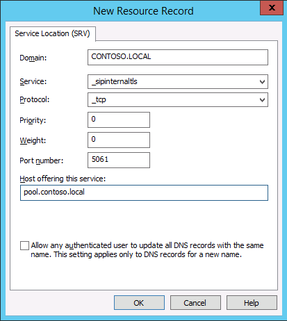
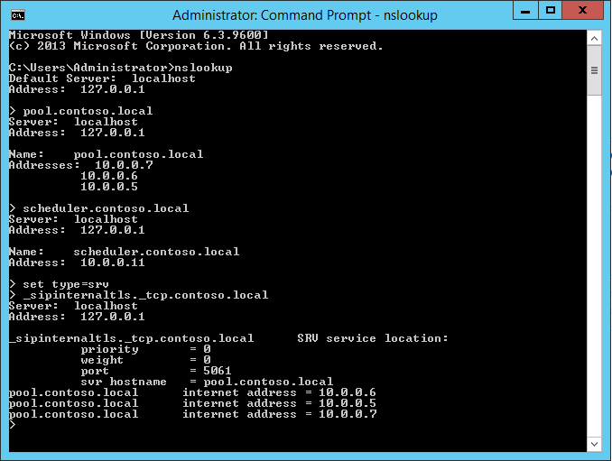

# Creare record DNS per Skype for Business Server
 
**Riepilogo:** Informazioni su come configurare DNS e creare record DNS per un'installazione di Skype for Business Server. Scaricare una versione di valutazione gratuita di Skype for Business Server dal Centro di valutazione Microsoft all'indirizzo: [https://www.microsoft.com/evalcenter/evaluate-skype-for-business-server](https://www.microsoft.com/evalcenter/evaluate-skype-for-business-server) .
  
Per Skype for Business Server correttamente, è necessario che siano presenti diverse impostazioni DNS (Domain Name System). In questo modo i client sanno come accedere ai servizi e che i server conoscono l'uno dell'altro. Queste impostazioni devono essere completate una sola volta per ogni distribuzione perché una volta assegnata una voce DNS, questa è disponibile in tutto il dominio. È possibile eseguire i passaggi da 1 a 5 in qualsiasi ordine. È tuttavia necessario eseguire i passaggi 6, 7 e 8 nell'ordine e dopo i passaggi da 1 a 5, come illustrato nel diagramma. La creazione di record DNS comprende il passaggio 5 di 8. Per ulteriori informazioni sulla pianificazione del DNS, vedere [Environmental requirements for Skype for Business Server](../../plan-your-deployment/requirements-for-your-environment/environmental-requirements.md) or Server requirements for Skype for Business Server [2019](../../../SfBServer2019/plan/system-requirements.md).
  
> [!IMPORTANT]
> È importante notare che questo è solo un esempio di come creare record DNS in un ambiente DNS Windows Server. Esistono molte altre voci DNS necessarie per Skype for Business Server e la procedura per la creazione di record DNS dipende dal sistema utilizzato per gestire DNS nell'organizzazione. Per un elenco completo dei requisiti per DNS, vedere [Dns requirements for Skype for Business Server](../../plan-your-deployment/network-requirements/dns.md). 
  

  
## Configurazione del DNS

I record DNS sono necessari perché Skype for Business Server funzionino correttamente e siano accessibili dagli utenti.
  
In questo esempio viene utilizzato un FQDN con bilanciamento del carico DNS denominato pool.contoso.local. Questo pool è costituito da tre server che eseguono Skype for Business Server edizione Enterprise. Un edizione Standard front-end può contenere un solo server. Utilizzando edizione Standard, è possibile utilizzare solo il nome di dominio completo (FQDN) del singolo server edizione Standard quando si fa riferimento al ruolo front-end anziché creare un pool di server con bilanciamento del carico DNS, come illustrato in questo esempio. In questo semplice esempio che utilizza solo il ruolo front-end sono incluse le voci DNS nella tabella seguente. Per pianificare i requisiti DNS specifici, vedere [Requisiti DNS per Skype for Business Server](../../plan-your-deployment/network-requirements/dns.md). 
  
 
|**Descrizione**|**Tipo di record**|**Nome**|**Viene risolto in**|**Tipo di bilanciamento del carico**|
|:-----|:-----|:-----|:-----|:-----|
|FQDN dei servizi Web interni    |A    |webint.contoso.local    |VIP per i servizi Web interni    |Software e hardware supportati    |
|FQDN pool    |A    |pool.contoso.local    |Indirizzo IP del server SFB01    |DNS    |
|SFB01 FQDN    |A    |SFB01.contoso.local    |Indirizzo IP del server SFB01    |DNS    |
|FQDN pool    |A    |pool.contoso.local    |Indirizzo IP del server SFB02    |DNS    |
|SFB02 FQDN    |A    |SFB02.contoso.local    |Indirizzo IP del server SFB02    |DNS    |
|FQDN pool    |A    |pool.contoso.local    |Indirizzo IP del server SFB03    |DNS    |
|SFB03 FQDN    |A    |SFB03.contoso.local    |Indirizzo IP del server SFB03    |DNS    |
|Skype for Business Individuazione automatica    |A    |lyncdiscoverinternal.contoso.local    |VIP per i servizi Web interni    |Software e hardware supportati    |
|URL semplice riunione    |A    |meet.contoso.local    |VIP per i servizi Web interni    |Software e hardware supportati    |
|URL semplice di accesso esterno    |A    |dialin.contoso.local    |VIP per i servizi Web interni    |Software e hardware supportati    |
|URL semplice utilità di pianificazione Web    |A    |scheduler.contoso.local    |VIP per i servizi Web interni    |Software e hardware supportati    |
|URL semplice di amministrazione    |A    |admin.contoso.local    |VIP per i servizi Web interni    |Software e hardware supportati    |
|Individuazione legacy    |SRV    |_sipinternaltls._tcp.contoso.local    |FQDN pool (porta 5061)    |N/D    |
   
### Creare record DNS

1. Accedere al server DNS e aprire **Server Manager**.
    
2. Fare clic sul menu **a** discesa Strumenti e quindi su **DNS.**
    
3. Nell'albero della console per il dominio SIP espandere **Zone** di ricerca diretta e quindi espandere il dominio SIP in cui Skype for Business Server verrà installato.
    
4. Fare clic con il pulsante destro del mouse sul dominio SIP e scegliere **Nuovo host (A o AAAA),** come illustrato nella figura.
    
     
  
5. Nella casella **Nome** digitare il nome del record host (il nome di dominio verrà aggiunto automaticamente).
    
6. Nella casella **Indirizzo IP** digitare l'indirizzo IP del singolo server front-end e quindi selezionare Crea **record puntatore associato (PTR)** o Consenti a qualsiasi utente autenticato di aggiornare i record **DNS** con lo stesso nome proprietario, se applicabile. Si noti che si presuppone che DNS sia utilizzato per bilanciare il carico di tutto il traffico ad eccezione dei servizi Web. In questo esempio sono presenti tre server front-end, come illustrato nella tabella.
    
   |**Nome server**|**Tipo**|**Dati**|
   |:-----|:-----|:-----|
   |SFB01    |Host (A)    |10.0.0.5    |
   |SFB02    |Host (A)    |10.0.0.6    |
   |SFB03    |Host (A)    |10.0.0.7    |
   
7. Creare quindi le voci di bilanciamento del carico DNS per il pool. Il bilanciamento del carico DNS consente a DNS di inviare richieste ai singoli server del pool utilizzando lo stesso nome del pool DNS. Per ulteriori informazioni su DNS e bilanciamento del carico, vedere [Requisiti DNS per Skype for Business Server](../../plan-your-deployment/network-requirements/dns.md). 
    
    > [!NOTE]
    > Il pool di più server è disponibile solo in edizione Enterprise distribuzione. Se si distribuisce un singolo Enterprise Server o edizione Standard server, è necessario creare solo un record A per il singolo server. 
  
    Ad esempio, se si aveva un pool denominato pool.contoso.local e tre server front-end, è necessario creare le voci DNS seguenti:
    
   |**FQDN**|**Tipo**|**Dati**|
   |:-----|:-----|:-----|
   |pool.contoso.local    |Host (A)    |10.0.0.5    |
   |pool.contoso.local    |Host (A)    |10.0.0.6    |
   |pool.contoso.local    |Host (A)    |10.0.0.7    |
   
8. Continuare a creare record A per tutti i server della distribuzione pianificata. 
    
9. Per creare il record del servizio (SRV) per l'individuazione legacy, fare clic con il pulsante destro del mouse sul dominio SIP e scegliere **Altri nuovi record**.
    
10. In **Selezionare tipo di record di risorsa** fare clic su **Posizione servizio (SRV)** e quindi su **Crea record**.
    
11. Fare clic su **Servizio** e quindi digitare **_sipinternaltls**.
    
12. Fare clic su **Protocollo** e quindi digitare **_tcp**.
    
13. Fare clic su **Numero porta** e quindi digitare **5061**.
    
14. Fare **clic su Host che offre questo** servizio e quindi digitare il nome di dominio completo del pool o edizione Standard server.
    
     
  
15. Fare clic su **OK** e quindi su **Fine**.
    
### Verificare i record DNS

1. Accedere a un computer client nel dominio con un account membro del gruppo Authenticated Users o con autorizzazioni equivalenti.
    
2. Fare **clic sul** pulsante Start e quindi digitare **cmd** e premere INVIO.
    
3. Digitare **nslookup \<FQDN of the Front End pool\>** o e premere **\<FQDN of the Standard Edition server or single Enterprise Edition server\>** INVIO.
    
4. Continuare a verificare il resto dei record A per la distribuzione.
    
5. Se si supportano client legacy e si è creato il record SRV, verificarlo digitando **set type=srv** al prompt **nslookup** e quindi premere INVIO.
    
6. Digitare **_sipinternaltls._tcp. *domain*** (ad esempio, _sipinternaltls._tcp.contoso.local), quindi premere INVIO.
    
7. L'output previsto deve essere simile a quello mostrato nella figura. Si noti che non tutti i record DNS vengono visualizzati nell'output di esempio, ma tutti i record devono essere verificati. 
    
     
  

