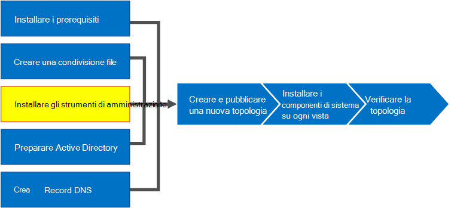
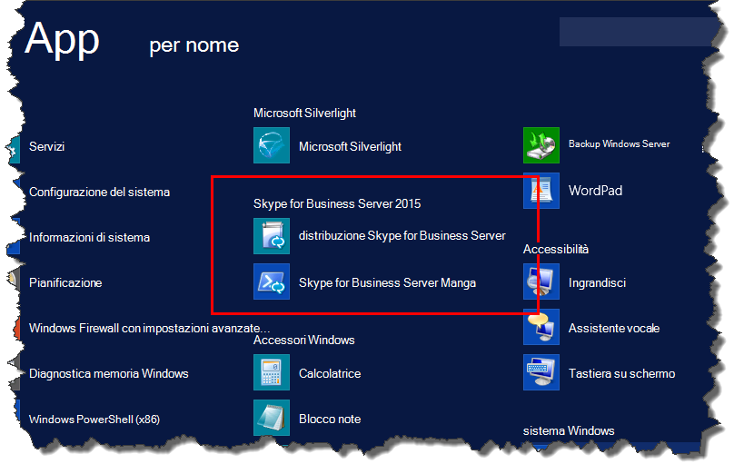
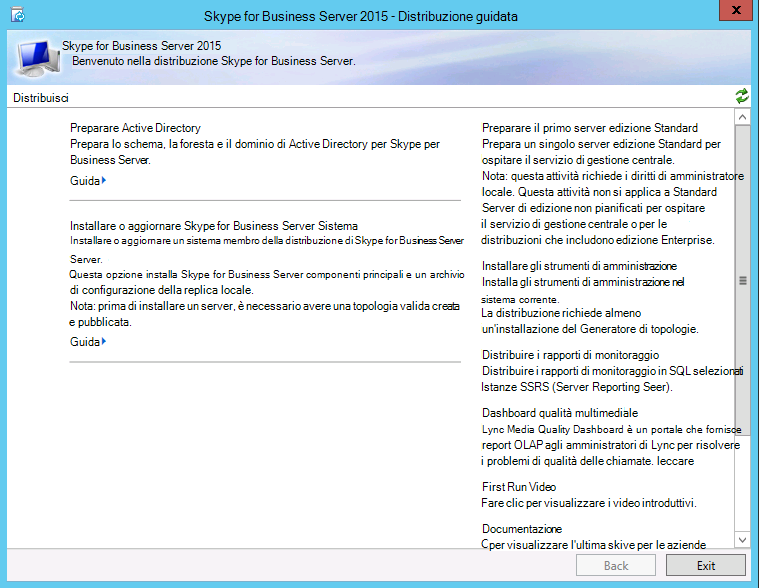

# Installare gli strumenti di amministrazione in Skype for Business ServerInstall administrative tools in Skype for Business Server
 
**Riepilogo:** Informazioni su come installare gli strumenti di amministrazione necessari per un'installazione di Skype for Business Server.**Summary:** Learn how to install the administrative tools required for an installation of Skype for Business Server. Scaricare una versione di valutazione gratuita di Skype for Business Server dal Microsoft Evaluation Center all' [https://www.microsoft.com/evalcenter/evaluate-skype-for-business-server](https://www.microsoft.com/evalcenter/evaluate-skype-for-business-server)Indirizzo:.Download a free trial of Skype for Business Server from the Microsoft Evaluation center at: [https://www.microsoft.com/evalcenter/evaluate-skype-for-business-server](https://www.microsoft.com/evalcenter/evaluate-skype-for-business-server).
  
Gli strumenti di amministrazione includono generatore di topologie e il pannello di controllo.The administrative tools include Topology Builder and the Control Panel. Gli strumenti di amministrazione devono essere installati in almeno un server della topologia o in una workstation di gestione a 64 bit in cui è in esecuzione una versione del sistema operativo Windows supportata per Skype for Business Server.The administrative tools must be installed on at least one server in the topology or a 64-bit management workstation running a Windows OS version that is supported for Skype for Business Server. È possibile eseguire i passaggi da 1 a 5 in qualsiasi ordine.You can do steps 1 through 5 in any order. Tuttavia, è necessario eseguire i passaggi 6, 7 e 8 in ordine e dopo i passaggi da 1 a 5, come illustrato nel diagramma.However, you must do steps 6, 7, and 8 in order, and after steps 1 through 5, as outlined in the diagram. L'installazione degli strumenti di amministrazione è il passaggio 3 di 8.Installing the administrative tools is step 3 of 8.
  

  
## Installare gli strumenti di amministrazione di Skype for Business ServerInstall Skype for Business Server administrative tools

Il supporto di installazione per Skype for Business Server offre un'esperienza flessibile.The installation media for Skype for Business Server provides a flexible experience. La prima volta che si esegue Setup. exe, gli unici strumenti installati sono la distribuzione guidata di Skype for Business Server e Skype for Business Server Management Shell.When you first run Setup.exe, the only tools installed are the Skype for Business Server Deployment Wizard and the Skype for Business Server Management Shell. Usando questi due strumenti, noti come componenti principali, puoi continuare con il processo di installazione, ma non fornisci funzionalità principali per l'ambiente globale di Skype for Business Server.By using these two tools, known as Core Components, you can continue with the installation process, but they do not provide primary functionality for the overall Skype for Business Server environment. La distribuzione guidata viene avviata automaticamente dopo l'installazione dei componenti principali.The Deployment Wizard launches automatically after you install the Core Components. La sezione della distribuzione guidata intitolata **Install Administrative Tools** installa il generatore di topologia di Skype for Business Server e il pannello di controllo di Skype for Business Server.The section of the Deployment Wizard titled **Install Administrative Tools** installs Skype for Business Server Topology Builder and Skype for Business Server Control Panel.
  
> [!IMPORTANT]
> Ogni ambiente di Skype for Business Server deve avere almeno un server con gli strumenti di amministrazione installati.Every Skype for Business Server environment must have at least one server with the administrative tools installed. 
  
Guardare la procedura video per **installare gli strumenti di amministrazione**:Watch the video steps for **Install administrative tools**:
  
> [!video https://www.microsoft.com/en-us/videoplayer/embed/99a5c436-963b-4eed-b423-651568c87cb1?autoplay=false]
  
### Installare gli strumenti di amministrazione di Skype for Business Server dalla distribuzione guidataInstall Skype for Business Server administrative tools from the Deployment Wizard

1. Inserire il supporto di installazione di Skype for Business Server.Insert the Skype for Business Server installation media. Se l'installazione non viene avviata automaticamente, fare doppio clic su **configurazione**.If the setup does not automatically begin, double-click **Setup**.
    
2. Il supporto di installazione richiede l'esecuzione di Microsoft Visual C++.The installation media requires Microsoft Visual C++ to run. Verrà visualizzata una finestra di dialogo che chiede se si vuole installarla.A dialog box will pop up asking if you want to install it. Fare clic su **Sì**.Click **Yes**.
    
3. Usando la configurazione intelligente, una nuova funzionalità di Skype for Business Server è possibile connettersi a Internet per verificare la disponibilità di aggiornamenti durante il processo di installazione.By using Smart Setup, a new feature in Skype for Business Server, you can connect to the Internet to check for updates during the installation process. Questo offre un'esperienza migliore assicurandosi di avere gli aggiornamenti più recenti al prodotto durante l'installazione.This provides a better experience by making sure you have the most recent updates to the product at installation. Fare clic su **Installa** per avviare l'installazione.Click **Install** to begin the installation.
    
4. Esaminare attentamente il contratto di licenza e, se si è d'accordo, selezionare **Accetto i termini del contratto di licenza**e fare clic su **OK**.Carefully review the License Agreement, and if you agree, select **I accept the terms in the license agreement**, and click **OK**.
    
5. I componenti principali di Skype for Business Server verranno installati nel server.The Skype for Business Server Core Components will be installed on the server. 
    
    I componenti principali sono i seguenti, come illustrato nella figura.The Core Components consist of the following, as shown in the figure.
    
    
  
   - **Distribuzione guidata di Skype for Business Server** Un programma di distribuzione che fornisce una piattaforma di avvio per l'installazione dei vari componenti di Skype for Business Server.**Skype for Business Server Deployment Wizard** A deployment program that provides a launch pad for installing the various components of Skype for Business Server.
    
   - **Skype for Business Server Management Shell** Programma di PowerShell preconfigurato che consente l'amministrazione di Skype for Business Server.**Skype for Business Server Management Shell** A preconfigured PowerShell program that allows for administration of Skype for Business Server.
    
     Una volta completata l'installazione dei componenti principali, verrà avviata automaticamente la distribuzione guidata di Skype for Business Server, come illustrato nella figura.Once the installation of the Core Components is complete, the Skype for Business Server Deployment Wizard will automatically launch, as shown in the figure. 
    
     
  
6. Oltre ai componenti principali, dovrai installare anche il generatore di topologia di Skype for Business Server e il pannello di controllo di Skype for Business Server in almeno un server nell'ambiente.In addition to the Core Components, you will also need to install Skype for Business Server Topology Builder and Skype for Business Server Control Panel on at least one server in the environment. Fare clic su **installa strumenti di amministrazione** nella distribuzione guidata.Click **Install Administrative Tools** on the Deployment Wizard.
    
7. Fare clic su **Avanti** per avviare l'installazione.Click **Next** to begin the installation.
    
8. Dopo aver completato l'installazione, fare clic su **fine**.Once the installation has completed, click **Finish**. Gli strumenti di amministrazione vengono ora aggiunti al server, come illustrato nella figura.The administrative tools are now added to the server, as shown in the figure.
    
    
  
   - **Generatore di topologia di Skype for Business Server** Programma usato per compilare, distribuire e gestire le topologie.**Skype for Business Server Topology Builder** A program used to build, deploy, and manage topologies.
    
   - **Pannello di controllo di Skype for Business Server** Programma usato per amministrare l'installazione.**Skype for Business Server Control Panel** A program used to administer the installation.
    

