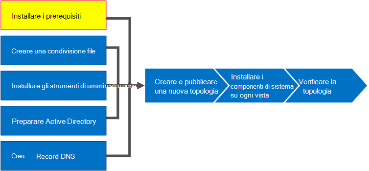

# Installare i prerequisiti per Skype for Business Server
 
**Riepilogo:** Informazioni sui server e sui ruoli del server che è necessario configurare prima di installare Skype for Business Server. Scarica una versione di valutazione gratuita di Skype for Business Server dal [Centro di valutazione Microsoft.](https://www.microsoft.com/evalcenter/evaluate-skype-for-business-server)
  
L'installazione dei prerequisiti consiste nella configurazione di Windows Server installando i ruoli e le funzionalità necessari in ognuno dei server della topologia. I requisiti si basano sul ruolo che il server adempierà nella topologia. È possibile eseguire i passaggi da 1 a 5 in qualsiasi ordine. È tuttavia necessario eseguire i passaggi 6, 7 e 8 nell'ordine e dopo i passaggi da 1 a 5, come illustrato nel diagramma. L'installazione dei prerequisiti è il passaggio 1 di 8.
  

  
## Setup Windows Server

Skype for Business Server il sistema operativo Windows Server e alcuni prerequisiti prima di poterlo installare. Per informazioni dettagliate sulla pianificazione dei prerequisiti, vedere [Server requirements for Skype for Business Server](../../../SfBServer2019/plan/system-requirements.md). 
  
> [!TIP]
> Questa procedura utilizza Windows Server 2012 R2. Se si utilizza una versione diversa di Windows Server, la procedura potrebbe essere leggermente diversa. 
  
> [!IMPORTANT]
> Prima di iniziare, verificare che Windows Server sia aggiornato utilizzando Windows Update. 
  

  
Guarda la procedura video per **installare i prerequisiti:**
  
> [!video https://www.microsoft.com/videoplayer/embed/02447c2a-5b26-432f-aad6-b9b05cc93478?autoplay=false]
  
### Installare i ruoli e le funzionalità necessari per i server front-end

È possibile installare i ruoli e le funzionalità necessari utilizzando Server Manager. 
    
1. Installare le funzionalità software prerequisite elencate in [Server requirements for Skype for Business Server](../../../SfBServer2019/plan/system-requirements.md). Il software necessario deve essere nel server che verrà eseguito Skype for Business Server.
    
    > [!CAUTION]
    > Windows Server 2012 R2 non installa tutti i file di origine per le funzionalità necessarie per impostazione predefinita. Se il server non è connesso a Internet, sarà necessario inserire il  supporto Windows Server 2012 R2 e selezionare Specificare un percorso di origine alternativo per installare le funzionalità necessarie. I file di origine si trovano nella directory sources\sxs. Ad esempio, se il Windows Server 2012 R2 si trova nell'unità D, è necessario impostare il percorso su `d:\sources\sxs` . È importante disporre degli aggiornamenti più recenti di Windows Update. Se non si è connessi a Internet, sarà necessario installare manualmente tutti gli aggiornamenti pertinenti e tutti i prerequisiti per gli aggiornamenti necessari. 
  
1. Quando la finestra di dialogo indica che l'installazione è stata completata, sarà necessario riavviare il server per completare il processo.
    
1. Eseguire **Windows Update** per verificare se sono presenti aggiornamenti per i ruoli e i servizi installati.
    
1. Se si utilizza il Skype for Business Server di controllo su questo server, è necessario installare anche Silverlight. Per installare Silverlight, vedere [Microsoft Silverlight](https://www.microsoft.com/silverlight/).

> [!IMPORTANT]
> I prerequisiti per i server che eseguono ruoli diversi dal server front-end, ad esempio il ruolo di Director, Persistent Chat o Edge, hanno i propri prerequisiti. Per informazioni dettagliate sui prerequisiti esatti richiesti da ogni tipo di server, vedere [Server requirements for Skype for Business Server](../../../SfBServer2019/plan/system-requirements.md). 
  

