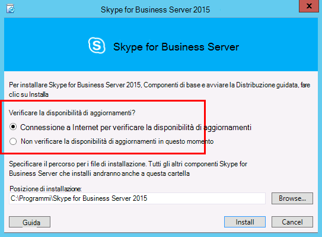
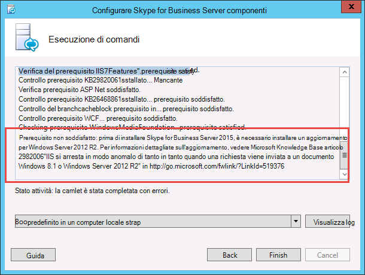
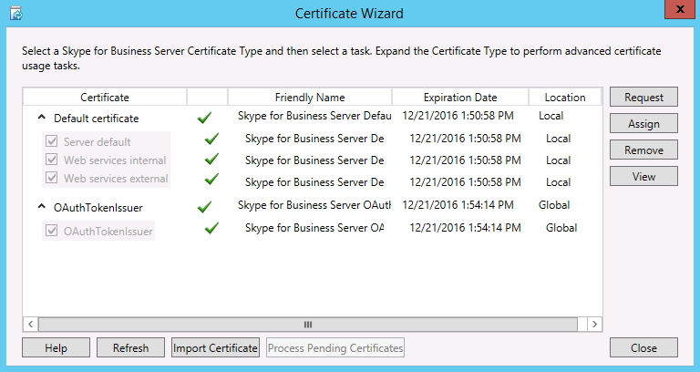

# Installare Skype for Business Server nei server della topologia
 
**Riepilogo:** Informazioni su come installare i componenti di sistema di Skype for Business Server in ogni server della topologia. Scaricare una versione di valutazione gratuita di Skype for Business Server da [Microsoft Evaluation Center](https://www.microsoft.com/evalcenter/evaluate-skype-for-business-server).
  
Dopo aver caricato la topologia nell'archivio di gestione centrale e Active Directory conosce i server che eseguiranno i ruoli, è necessario installare il sistema Skype for Business Server in ognuno dei server della topologia. È possibile eseguire i passaggi da 1 a 5 in qualsiasi ordine. Tuttavia, è necessario eseguire i passaggi 6, 7 e 8 nell'ordine e dopo i passaggi da 1 a 5 come indicato nel diagramma. L'installazione del sistema Skype for Business Server è il passaggio 7 di 8.
  

  
## Installare il sistema Skype for Business Server

Dopo la pubblicazione di una topologia, è possibile installare i componenti di Skype for Business Server in ogni server della topologia. In questa sezione viene illustrata l'installazione di Skype for Business Server e la configurazione dei ruoli del server per il pool Front end e di tutti i ruoli del server collocati con i Front End Server. Per installare e configurare i ruoli del server, è possibile eseguire la distribuzione guidata di Skype for Business Server in ogni computer in cui si sta installando un ruolo del server. È possibile utilizzare la distribuzione guidata per completare tutti e quattro i passaggi di distribuzione, tra cui l'installazione dell'archivio di configurazione locale, l'installazione dei Front End Server, la configurazione di certificati e l'avvio dei servizi.
  
> [!IMPORTANT]
> Per poter installare Skype for Business Server nei server, è necessario utilizzare Generatore di topologie per completare e pubblicare la topologia. 
  
> [!NOTE]
> Questa procedura deve essere completata per tutti i server della topologia. 
  
> [!CAUTION]
> Dopo aver installato Skype for Business Server in un front end server, la prima volta che si avviano i servizi, è necessario verificare che il servizio Windows Firewall sia in esecuzione nel server. 
  
> [!CAUTION]
> Prima di eseguire questa procedura, verificare di aver eseguito l'accesso al server con un account utente di dominio che sia un amministratore locale e un membro del gruppo RTCUniversalServerAdmins. 
  
> [!NOTE]
> Se non è stato eseguito il programma di installazione di Skype for Business Server in questo server, verrà richiesto di eseguire un'unità e un percorso per l'installazione. In questo modo viene fornita la possibilità di eseguire l'installazione in un'unità diversa dall'unità di sistema, se l'organizzazione lo richiede o se si dispone di problemi di spazio. È possibile modificare il percorso di installazione dei file di Skype for Business Server nella finestra di dialogo **imposta** su una nuova unità disponibile. Se si installano i file di installazione in questo percorso, incluso OCSCore.msi, verranno distribuiti anche gli altri file del server Skype for business.
  
> [!IMPORTANT]
> Prima di iniziare l'installazione, verificare che Windows Server sia aggiornato utilizzando Windows Update. 
  

  
### Installare il sistema Skype for Business Server

1. Inserire il supporto di installazione di Skype for Business Server. Se l'installazione non viene avviata automaticamente, fare doppio clic su **Setup**.
    
2. Il supporto di installazione richiede l'esecuzione di Microsoft Visual C++. Verrà visualizzata una finestra di dialogo in cui viene chiesto se si desidera installarlo. Fare clic su **Sì.**
    
3. Esaminare attentamente il contratto di licenza e, se si è d'accordo, selezionare **Accetto i termini del contratto di licenza** e fare clic su **OK**. 
    
4. La configurazione intelligente è una funzionalità di Skype for Business Server in cui è possibile connettersi a Internet per verificare la disponibilità di aggiornamenti da Microsoft Update (MU) durante il processo di installazione, come illustrato nella figura. In questo modo, è possibile ottenere gli aggiornamenti più recenti per il prodotto. Fare clic su **Installa** per avviare l'installazione.
    
    > [!NOTE]
    > Molte organizzazioni dispongono di Windows Server Update Services (WSUS) distribuito nei rispettivi ambienti aziendali. WSUS consente agli amministratori di gestire completamente la distribuzione degli aggiornamenti rilasciati tramite Microsoft Update ai computer della rete. Come parte della versione di aggiornamento cumulativo 1, Skype for Business Server ha introdotto il supporto per la configurazione avanzata per l'utilizzo con WSUS. I clienti con WSUS che distribuiscono Skype for Business Server per la prima volta o che eseguono l'aggiornamento dall'ambiente Lync Server 2013 utilizzando la funzionalità di aggiornamento di In-Place avranno la possibilità di scaricare gli aggiornamenti di Skype for Windows da WSUS anziché recuperare gli aggiornamenti da MU. I clienti che desiderano utilizzare l'installazione avanzata devono eseguire il SmartSetupWithWSUS. PSQ su tutti i computer prima di eseguire Setup.exe. 
  
     
  
5. Nella pagina distribuzione guidata fare clic su **Installa o aggiorna il sistema di Skype for Business Server**.
    
6. Eseguire le procedure illustrate nelle procedure seguenti, al termine dell'operazione, fare clic su **Esci** per chiudere la distribuzione guidata. Ripetere le procedure per ogni Front End Server nel pool.
    
### Passaggio 1: installare l'archivio di configurazione locale

1. Esaminare i prerequisiti e quindi fare clic su **Esegui** accanto a **passaggio 1: installazione dell'archivio di configurazione locale**.
    
    > [!NOTE]
    > L'archivio di configurazione locale è una copia di sola lettura dell'archivio di gestione centrale. In una distribuzione di Standard Edition, l'archivio di gestione centrale viene creato utilizzando una copia locale di SQL Server Express Edition nel front end server. Ciò si verifica quando si esegue la procedura di preparazione del primo server Standard Edition. In una distribuzione di Enterprise Edition, l'archivio di gestione centrale viene creato quando si pubblica la topologia che include un pool Enterprise Edition front end. 
  
2. Nella pagina **installazione dell'archivio di configurazione locale** verificare che l'opzione **Recupera direttamente dall'archivio di gestione centrale** sia selezionata e quindi fare clic su **Avanti**.
    
    SQL Server Express Edition è installato nel server locale. SQL Server Express Edition è necessario per l'archivio di configurazione locale.
    
3. Al termine dell'installazione con configurazione del server locale, fare clic su **Fine**.
    
### Passaggio 2: installare o rimuovere componenti di Skype for Business Server

1. Esaminare i prerequisiti e quindi fare clic su **Esegui** accanto a **passaggio 2: installazione o rimozione componenti di Skype for Business Server**.
    
2. Nella pagina **Configura componenti di Skype for Business Server** fare clic su **Avanti** per configurare i componenti come definito nella topologia pubblicata.
    
3. Nella pagina **esecuzione comandi** in corso viene visualizzato un riepilogo dei comandi e delle informazioni di installazione Man mano che avviene il set up. Al termine, è possibile utilizzare l'elenco per selezionare un registro da visualizzare e quindi fare clic su **Visualizza registro**.
    
4. Quando viene eseguita la configurazione dei componenti di Skype for Business Server e i registri sono stati esaminati in base alle esigenze, fare clic su **fine** per completare questo passaggio nell'installazione.
    
    > [!NOTE]
    > Riavviare il server, se richiesto, che potrebbe verificarsi se è necessario installare Windows Desktop Experience. Dopo aver eseguito il backup e l'esecuzione del computer, è necessario eseguire di nuovo questa procedura (passaggio 2: installazione o rimozione componenti di Skype for Business Server). 
  
    > [!NOTE]
    > Se il programma di installazione rileva eventuali prerequisiti che non sono stati soddisfatti, verrà visualizzato il messaggio "prerequisito non soddisfatto", come mostrato nella figura. Soddisfare il prerequisito necessario e quindi avviare di nuovo questa procedura (passaggio 2: installazione o rimozione componenti di Skype for Business Server). 
  
     
  
5. Verificare che i primi due passaggi siano stati eseguiti come previsto. Verificare che sia presente un segno di spunta verde con la parola **completata**, come mostrato nella figura.
    
     
  
6. Eseguire di nuovo **Windows Update** per controllare se sono presenti aggiornamenti dopo l'installazione dei componenti di Skype for Business Server.
    
### Passaggio 3: richiesta, installazione o assegnazione dei certificati

1. Esaminare i prerequisiti e quindi fare clic su **Esegui** accanto a **passaggio 3: richiesta, installazione o assegnazione dei certificati**.
    
    > [!NOTE]
    > Skype for Business Server include il supporto per la famiglia SHA-2 (SHA-2 utilizza la lunghezza del digest di 224, 256, 384 o 512 bit) dell'hash digest e gli algoritmi di firma per le connessioni dai client che eseguono i sistemi operativi Windows 10, Windows 8, Windows 7, Windows Server 2012 R2, Windows Server 2012 o Windows Server 2008 R2. Per supportare l'accesso esterno tramite la famiglia SHA-2, il certificato esterno viene emesso da un'autorità di certificazione pubblica che può anche emettere un certificato con lo stesso bit di lunghezza del digest. 
  
    > [!IMPORTANT]
    > La selezione dell'algoritmo di firma e del digest hash dipende dai client e dai server che utilizzeranno il certificato e da altri computer e dispositivi che i client e i server comunicheranno con gli utenti che devono anche sapere come utilizzare gli algoritmi utilizzati nel certificato. Per informazioni su quali lunghezze del digest sono supportate nel sistema operativo e in alcune applicazioni client, vedere [Windows PKI Blog-SHA2 e Windows](https://go.microsoft.com/fwlink/p/?LinkId=287002). 
  
    Ogni Standard Edition o front end server richiede fino a quattro certificati: il certificato oAuthTokenIssuer, un certificato predefinito, un certificato interno Web e un certificato esterno Web. Tuttavia, è possibile richiedere e assegnare un singolo certificato predefinito con le voci del nome alternativo soggetto appropriato e il certificato oAuthTokenIssuer. Per informazioni dettagliate sui requisiti dei certificati, vedere Requisiti [ambientali per Skype for Business Server](../../plan-your-deployment/requirements-for-your-environment/environmental-requirements.md) o [requisiti del server per Skype for Business Server 2019](../../../SfBServer2019/plan/system-requirements.md).
    
    > [!IMPORTANT]
    > Nella procedura seguente viene descritto come configurare i certificati da un'autorità di certificazione basata sui servizi certificati di Active Directory interno. 
  
2. Nella pagina **Configurazione guidata certificati** fare clic su **Richiesta**.
    
3. Nella pagina **richiesta di certificato** inserire i dati rilevanti, tra cui la selezione del dominio SIP e fare clic su **Avanti**.
    
4. Nella pagina **Richieste immediate o ritardate** è possibile accettare l'opzione predefinita **Invia immediatamente la richiesta a un'autorità di certificazione online** facendo clic su **Avanti**. Se si seleziona questa opzione, deve essere disponibile la CA interna con registrazione automatica online. Se si sceglie l'opzione di ritardare la richiesta, sarà necessario specificare un nome e un percorso in cui salvare il file di richiesta di certificato. La richiesta di certificato deve essere presentata ed elaborata da una CA all'interno dell'organizzazione o da una CA pubblica. Sarà quindi necessario importare il certificato di risposta e assegnarlo al ruolo appropriato.
    
5. Nella pagina **scegliere un'autorità di certificazione (CA)** selezionare l'opzione **Seleziona una CA dall'elenco rilevato nell'ambiente in uso** e quindi selezionare una CA nota (tramite registrazione in servizi di dominio Active Directory) dall'elenco. In alternativa, selezionare l'opzione **Specifica un'altra autorità di certificazione**, immettere il nome di un'altra CA e quindi fare clic su **Avanti**.
    
6. Nella pagina **Account autorità di certificazione** viene richiesto di immettere le credenziali per richiedere ed elaborare la richiesta di certificato per la CA. Stabilire se è necessario specificare un nome utente e una password per richiedere un certificato in anticipo. L'amministratore della CA avrà le informazioni necessarie e potrebbe richiedere assistenza in questo passaggio. Se è necessario fornire credenziali alternative, selezionare la casella di controllo, specificare il nome utente e la password nelle caselle di testo, quindi fare clic su **Avanti**.
    
7. Nella pagina **Specifica modello di certificato alternativo** fare clic su **Avanti** per utilizzare il modello Server Web predefinito.
    
    > [!NOTE]
    > Se l'organizzazione ha creato un modello da utilizzare come alternativa al modello Server Web predefinito della CA, selezionare la casella di controllo, quindi immettere il nome del modello alternativo. È necessario specificare il nome del modello come definito dall'amministratore della CA. 
  
8. Nella pagina **Impostazioni nome e sicurezza** specificare un **nome descrittivo**. Utilizzando un nome descrittivo, è possibile identificare rapidamente il certificato e lo scopo. Se questo campo viene lasciato vuoto, verrà generato automaticamente un nome. Impostare il valore **Lunghezza in bit** della chiave o accettare il valore predefinito di 2048 bit. Selezionare la **chiave privata del certificato come esportabile** se si determina che il certificato e la chiave privata devono essere spostati o copiati in altri sistemi e quindi fare clic su **Avanti**.
    
    > [!NOTE]
    > Skype for Business Server ha requisiti minimi per una chiave privata esportabile. La chiave viene esportata nei server perimetrali di un pool, dove il servizio di autenticazione del Media Relay utilizza copie del certificato anziché i singoli certificati per ogni istanza nel pool. 
  
9. Nella pagina **Informazioni sull'organizzazione** immettere facoltativamente le informazioni sull'organizzazione e quindi fare clic su **Avanti**.
    
10. Nella pagina **Dati geografici** specificare facoltativamente i dati geografici e quindi fare clic su **Avanti**.
    
11. Nella pagina **Nome soggetto / Nomi soggetto alternativi** verificare i nomi soggetto alternativi che verranno aggiunti e quindi fare clic su **Avanti**.
    
12. Nella pagina **Impostazione del dominio SIP** selezionare la casella di controllo **Dominio SIP** e quindi fare clic su **Avanti**.
    
13. Nella pagina **Configura nomi soggetto alternativi aggiuntivi** aggiungere eventuali nomi soggetto alternativi aggiuntivi necessari, inclusi quelli potranno essere richiesti in futuro per i domini SIP aggiuntivi, quindi fare clic su **Avanti**.
    
14. Nella pagina **Riepilogo richiesta certificato** esaminare le informazioni. Se sono corrette, fare clic su **Avanti**. Se è necessario correggere o modificare un'impostazione, fare clic su **Indietro** fino alla pagina appropriata.
    
15. Nella pagina **Esecuzione comandi in corso** fare clic su **Avanti**.
    
16. Nella pagina On the **Stato richiesta di certificato online** esaminare le informazioni restituite. Verificare che il certificato sia stato emesso e installato nell'archivio certificati locale. Se viene segnalato come emesso e installato, ma non è valido, verificare che il certificato radice della CA sia stato installato nell'archivio CA radice attendibile del server. Per informazioni su come recuperare un certificato di CA radice attendibile, consultare la documentazione sulla CA. Se è necessario visualizzare il certificato recuperato, fare clic su **Visualizza dettagli certificato**. Per impostazione predefinita, è selezionata la casella di controllo **assegna il certificato agli utilizzi dei certificati di Skype for Business Server** . Se si desidera assegnare manualmente il certificato, deselezionare la casella di controllo e quindi fare clic su **Fine**.
    
17. Se è stata deselezionata la casella di controllo per **assegnare il certificato agli utilizzi dei certificati di Skype for Business Server** nella pagina precedente, verrà visualizzata la pagina **assegnazione certificato** . Fare clic su **Avanti**.
    
18. Nella pagina **Archivio certificati** selezionare il certificato richiesto. Se si desidera visualizzarlo, fare clic su **Visualizza dettagli certificato** e quindi su **Avanti** per continuare.
    
    > [!NOTE]
    > Se nella pagina **stato richiesta di certificato online è stato** segnalato un problema con il certificato, ad esempio il certificato non è valido, visualizzare il certificato effettivo per informazioni sulla risoluzione del problema. In particolare, il certificato può non essere valido perché non è stato emesso da una CA radice attendibile, come accennato in precedenza, oppure perché non è associato a una chiave privata. Per risolvere questi due problemi, consultare la documentazione della CA.
  
19. Nella pagina **Riepilogo assegnazione certificato** esaminare le informazioni presentate per assicurarsi che si tratta del certificato da assegnare e quindi fare clic su **Avanti**.
    
20. Nella pagina **Esecuzione comandi in corso** esaminare l'output del comando. Fare clic su **Visualizza registro** se si desidera rivedere il processo di assegnazione oppure se è stato generato un messaggio di errore o di avviso. Al termine, fare clic su **Fine**.
    
21. Nella pagina **Configurazione guidata certificati** , verificare che tutti i servizi dispongano di un controllo verde per indicare che a tutti è stato assegnato un certificato, incluso OAuthTokenIssuer, come illustrato nella figura, quindi fare clic su **Chiudi**.
    
     
  
    > [!TIP]
    > Se si esegue l'installazione in un ambiente lab e si è appena configurato l'autorità di certificazione utilizzando Servizi certificati Active Directory, sarà necessario riavviare sia il server che esegue i servizi certificati sia il front end server prima che l'assegnazione di certificati possa passare correttamente. 
  
    > [!TIP]
    >  Per ulteriori informazioni sui certificati in Active Directory Certificate Services, vedere [Active Directory Certificate Services](https://technet.microsoft.com/windowsserver/dd448615.aspx). 
  
### Passaggio 4: avviare i servizi

1. Esaminare i prerequisiti per il **passaggio 4: avviare i servizi**.
    
2. Se si tratta di un pool Enterprise Edition front end con almeno tre server, viene utilizzato Windows Fabric ed è necessario utilizzare il cmdlet **Start-CsPool** . Se si utilizza un singolo server, che è sempre il caso di Standard Edition, è possibile utilizzare il cmdlet **Start-CsWindowsService** . In questo esempio si utilizza Enterprise Edition con tre Front End Server nel pool, aprire **Skype for Business Server Management Shell** ed eseguire il cmdlet **Start-CsPool** come mostrato nella figura. Per tutti gli altri ruoli, incluso il server Standard Edition, è necessario utilizzare **Start-CsWindowsService**. Per distribuire ruoli diversi dal ruolo front-end, vedere la documentazione relativa ai ruoli specifici.
    
     
  
3. Nella pagina **Esecuzione comandi in corso**, dopo l'avvio di tutti i servizi, fare clic su **Fine**.
    
    > [!IMPORTANT]
    > Il comando per avviare i servizi nel server è un metodo di sforzo ottimale per segnalare che i servizi sono stati avviati. Potrebbe non rispecchiare lo stato effettivo del servizio. È consigliabile utilizzare lo stato del servizio di passaggio **(facoltativo)** per aprire Microsoft Management Console (MMC) e verificare che i servizi siano stati avviati correttamente, come mostrato nella figura. Se non è stato avviato alcun servizio Skype for Business Server, è possibile fare clic con il pulsante destro del mouse su tale servizio in MMC e quindi scegliere **Avvia**. 
  
     
  

