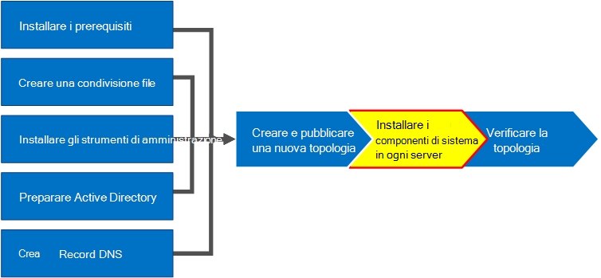

# Installare Skype for Business Server nei server della topologiaInstall Skype for Business Server on servers in the topology
 
**Riepilogo:** Informazioni su come installare i componenti di sistema di Skype for Business Server in ogni server della topologia.**Summary:** Learn how to install the Skype for Business Server system components on each server in the topology. Scaricare una versione di valutazione gratuita di Skype for Business Server dal [Centro di valutazione Microsoft.](https://www.microsoft.com/evalcenter/evaluate-skype-for-business-server)Download a free trial of Skype for Business Server from the [Microsoft Evaluation center](https://www.microsoft.com/evalcenter/evaluate-skype-for-business-server).
  
Dopo aver caricato la topologia nell'archivio di gestione centrale e che Active Directory sa quali server eseguiranno i ruoli, è necessario installare il sistema Skype for Business Server in ognuno dei server della topologia.Once the topology is loaded into the Central Management Store and Active Directory knows which servers will perform which roles, you need to install the Skype for Business Server system on each of the servers in the topology. È possibile eseguire i passaggi da 1 a 5 in qualsiasi ordine.You can do steps 1 through 5 in any order. È tuttavia necessario eseguire i passaggi 6, 7 e 8 nell'ordine e dopo i passaggi da 1 a 5 come illustrato nel diagramma.However, you must do steps 6, 7, and 8 in order, and after steps 1 through 5 as outlined in the diagram. L'installazione del sistema Skype for Business Server è il passaggio 7 di 8.Installing the Skype for Business Server system is step 7 of 8.
  

  
## Installare il sistema Skype for Business ServerInstall Skype for Business Server system

Dopo aver pubblicato una topologia, è possibile installare i componenti di Skype for Business Server in ogni server della topologia.Once you have published a topology, you can install the Skype for Business Server components on each server in the topology. In questa sezione viene illustrata l'installazione di Skype for Business Server e la configurazione dei ruoli del server per il pool Front End e gli eventuali ruoli del server collocati nei Front End Server.This section guides you through installing Skype for Business Server and setting up the server roles for the Front End pool and any server roles that are collocated with the Front End servers. Per installare e configurare i ruoli del server, eseguire la Distribuzione guidata di Skype for Business Server in ogni computer in cui si sta installando un ruolo del server.To install and set up server roles, you run the Skype for Business Server Deployment Wizard on each computer on which you are installing a server role. Utilizzare la Distribuzione guidata per completare tutti e quattro i passaggi di distribuzione, tra cui l'installazione dell'archivio di configurazione locale, l'installazione dei Front End Server, la configurazione dei certificati e l'avvio dei servizi.You use the Deployment Wizard to complete all four deployment steps, including installing the Local Configuration store, installing the Front End Servers, configuring certificates, and starting services.
  
> [!IMPORTANT]
> È necessario utilizzare Generatore di topologie per completare e pubblicare la topologia prima di installare Skype for Business Server nei server.You must use Topology Builder to complete and publish the topology before you can install Skype for Business Server on servers. 
  
> [!NOTE]
> Questa procedura deve essere completata per tutti i server della topologia.This procedure must be completed for all servers in the topology. 
  
> [!CAUTION]
> Dopo aver installato Skype for Business Server in un Front End Server, la prima volta che si avviano i servizi, è necessario verificare che il servizio Windows Firewall sia in esecuzione nel server.After you install Skype for Business Server on a Front End Server, the first time you start services, you must make sure that the Windows Firewall Service is running on the server. 
  
> [!CAUTION]
> Prima di eseguire questa procedura, verificare di aver eseguito l'accesso al server con un account utente di dominio sia amministratore locale che membro del gruppo RTCUniversalServerAdmins.Before you follow these steps, make sure you're logged onto the server with a domain user account that's both a local administrator and a member of the RTCUniversalServerAdmins group. 
  
> [!NOTE]
> Se non hai già eseguito l'installazione di Skype for Business Server su questo server, ti verrà richiesto di specificare un'unità e un percorso per l'installazione.If you haven't run Skype for Business Server setup on this server before, you'll be prompted for a drive and path for the installation. In questo modo è possibile eseguire l'installazione in un'unità diversa dall'unità di sistema, se richiesta dall'organizzazione o in caso di problemi di spazio.This provides the capability to install to a drive other than the system drive, if your organization requires it, or if you have space concerns. È possibile modificare il percorso di installazione per  i file di Skype for Business Server nella finestra di dialogo di installazione in una nuova unità disponibile.You can change the installation location path for the Skype for Business Server files in the **Setup** dialog box to a new, available drive. Se si installano i file di installazione in questo percorso, incluso OCSCore.msi, verranno distribuiti anche gli altri file di Skype for Business Server.If you install the Setup files to this path, including OCSCore.msi, the rest of the Skype for Business Server files will deploy there as well.
  
> [!IMPORTANT]
> Prima di iniziare l'installazione, assicurati che Windows Server sia aggiornato tramite Windows Update.Before you begin the installation, make sure that Windows Server is up-to-date by using Windows Update. 
  

  
### Installare il sistema Skype for Business ServerInstall Skype for Business Server system

1. Inserire il supporto di installazione di Skype for Business Server.Insert the Skype for Business Server installation media. Se l'installazione non viene avviata automaticamente, fare doppio clic su **Setup.**If the setup does not automatically begin, double-click **Setup**.
    
2. Il supporto di installazione richiede l'esecuzione di Microsoft Visual C++.The installation media requires Microsoft Visual C++ to run. Verrà visualizzata una finestra di dialogo in cui viene chiesto se si desidera installarla.A dialog will pop up asking if you want to install it. Fare **clic su Sì.**Click **Yes.**
    
3. Esaminare attentamente il Contratto di Licenza e, se si accetta, selezionare Accetto i termini del contratto di **licenza** e fare clic su **OK.**Carefully review the License Agreement, and if you agree, select **I accept the terms in the license agreement**, and click **OK**. 
    
4. Smart Setup è una funzionalità di Skype for Business Server in cui è possibile connettersi a Internet per verificare la disponibilità di aggiornamenti da Microsoft Update (MU) durante il processo di installazione, come illustrato nella figura.Smart Setup is a feature in Skype for Business Server where you can connect to the Internet to check for updates from Microsoft Update (MU) during the installation process, as shown in the figure. Ciò offre un'esperienza migliore assicurandoti di disporre degli aggiornamenti più recenti per il prodotto.This provides a better experience by making sure you have the most recent updates for the product. Fare clic su **Installa** per avviare l'installazione.Click **Install** to begin the installation.
    
    > [!NOTE]
    > Molte organizzazioni dispongono di Windows Server Update Services (WSUS) distribuito nei propri ambienti aziendali.Many organizations have Windows Server Update Services (WSUS) deployed in their corporate environments. WSUS consente agli amministratori di gestire completamente la distribuzione degli aggiornamenti rilasciati tramite Microsoft Update ai computer della propria rete.WSUS lets administrators fully manage the distribution of updates that are released through Microsoft Update to computers in their network. Nell'ambito della versione dell'aggiornamento cumulativo 1 di Skype for Business Server è stato introdotto il supporto per Smart Setup per l'utilizzo con WSUS.As part of the Cumulative Update 1 release Skype for Business Server introduced support for Smart Setup to work with WSUS. I clienti con WSUS che distribuiscono Skype for Business Server per la prima volta o eseguono l'aggiornamento dall'ambiente Lync Server 2013 tramite la funzionalità di aggiornamento di In-Place avranno un'installazione intelligente che recupera gli aggiornamenti di Skype for Windows da WSUS anziché recuperare gli aggiornamenti da MU.Customers with WSUS who are deploying Skype for Business Server for the first time or upgrading from the Lync Server 2013 environment using the In-Place Upgrade feature will have Smart Setup fetching Skype for Windows updates from WSUS as opposed to fetching updates from MU. I clienti che desiderano usare l'installazione intelligente devono eseguire SmartSetupWithWSUS.psq in tutti i computer prima di eseguire Setup.exe.Customers wanting to use Smart Setup need to run the SmartSetupWithWSUS.psq on all the machines before running Setup.exe. 
  
     
  
5. Nella pagina Distribuzione guidata fare clic su **Installa o aggiorna il sistema Skype for Business Server.**On the Deployment Wizard page, click **Install or Update Skype for Business Server System**.
    
6. Al termine, eseguire le procedure descritte di seguito, fare clic su **Esci** per chiudere la Distribuzione guidata.Perform the procedures in the following procedures, when you've completed them, click **Exit** to close the Deployment Wizard. Ripetere le procedure per ogni Front End Server nel pool.Repeat the procedures for each Front End server in the pool.
    
### Passaggio 1: Installare l'archivio di configurazione localeStep 1: Install Local Configuration Store

1. Esaminare i prerequisiti e quindi fare clic **su** Esegui accanto a **Passaggio 1: Installare l'archivio di configurazione locale.**Review the prerequisites, and then click **Run** next to **Step 1: Install Local Configuration Store**.
    
    > [!NOTE]
    > L'archivio di configurazione locale è una copia di sola lettura dell'archivio di gestione centrale.The Local Configuration Store is a read-only copy of the Central Management Store. In una distribuzione Standard Edition, l'archivio di gestione centrale viene creato utilizzando una copia locale di SQL Server Express Edition nel Front End Server.In a Standard Edition deployment, the Central Management Store is created using a local copy of SQL Server Express Edition on the Front End server. Ciò si verifica quando si esegue la procedura Prepare First Standard Edition Server.This happens when you run the Prepare First Standard Edition Server procedure. In una distribuzione Enterprise Edition l'archivio di gestione centrale viene creato quando si pubblica la topologia che include un pool Enterprise Edition Front End.In an Enterprise Edition deployment, the Central Management store is created when you publish the topology that includes an Enterprise Edition Front End pool. 
  
2. Nella pagina **Installa archivio di configurazione**  locale verificare che l'opzione Recupera direttamente dall'archivio di gestione centrale sia selezionata e quindi fare clic su **Avanti.**On the **Install Local Configuration Store** page, make sure that the **Retrieve directly from the Central Management store** option is selected, and then click **Next**.
    
    SQL Server Express Edition viene installato nel server locale.SQL Server Express Edition is installed on the local server. SQL Server Express Edition è necessario per l'archivio di configurazione locale.SQL Server Express Edition is required for the local configuration store.
    
3. Al termine dell'installazione con configurazione del server locale, fare clic su **Fine**.When the local server configuration installation is complete, click **Finish**.
    
### Passaggio 2: Configurare o rimuovere i componenti di Skype for Business ServerStep 2: Setup or remove Skype for Business Server components

1. Esaminare i prerequisiti, quindi fare clic su **Esegui** accanto a **Passaggio 2: Installazione o rimozione dei componenti di Skype for Business Server.**Review the prerequisites, and then click **Run** next to **Step 2: Setup or Remove Skype for Business Server Components**.
    
2. Nella pagina Configurazione componenti di Skype  for Business **Server** fare clic su Avanti per configurare i componenti come definito nella topologia pubblicata.On the **Set Up Skype for Business Server Components** page, click **Next** to set up components as defined in your published topology.
    
3. Nella **pagina Esecuzione comandi** in corso viene visualizzato un riepilogo dei comandi e delle informazioni di installazione durante la configurazione.The **Executing Commands** page displays a summary of commands and installation information as the set up takes place. Al termine, è possibile utilizzare l'elenco per selezionare un registro da visualizzare e quindi fare clic **su Visualizza registro.**When it's done, you can use the list to select a log to view, and then click **View Log**.
    
4. Al termine dell'installazione dei componenti di Skype for Business Server  e dopo aver esaminato i registri in base alle esigenze, fare clic su Fine per completare questo passaggio dell'installazione.When Skype for Business Server components setup is done and you've reviewed the logs as needed, click **Finish** to complete this step in the installation.
    
    > [!NOTE]
    > Riavvia il server se richiesto (cosa che potrebbe verificarsi se è necessario installare Esperienza desktop di Windows).Restart the server if prompted (which might happen if Windows Desktop Experience needed to be installed). Quando il computer è di nuovo in esecuzione, è necessario eseguire di nuovo questa procedura (Passaggio 2: Installazione o rimozione componenti di Skype for Business Server).When the computer is back up and running, you need to run this (Step 2: Setup or Remove Skype for Business Server Components) procedure again. 
  
    > [!NOTE]
    > Se il programma di installazione rileva prerequisiti non soddisfatti, verrà visualizzato il messaggio "Prerequisito non soddisfatto", come illustrato nella figura.If the installer finds any prerequisites that have not been satisfied, you will be notified with a "Prerequisite not satisfied" message, as shown in the figure. Soddisfare i prerequisiti necessari e quindi avviare di nuovo questa procedura (Passaggio 2: Installazione o rimozione dei componenti di Skype for Business Server).Satisfy the required prerequisite, and then start this (Step 2: Setup or Remove Skype for Business Server Components) procedure again. 
  
     
  
5. Verificare che i primi due passaggi siano stati completati come previsto.Verify that the first two steps completed as expected. Verificare che sia presente un segno di spunta verde con la parola **Completa,** come illustrato nella figura.Confirm that there is a green checkmark with the word **Complete**, as shown in the figure.
    
     
  
6. Eseguire **di nuovo Windows Update** per verificare se sono presenti aggiornamenti dopo l'installazione dei componenti di Skype for Business Server.Run **Windows Update** again to check if there are any updates after you install the Skype for Business Server Components.
    
### Passaggio 3: Richiedere, installare o assegnare certificatiStep 3: Request, install, or assign certificates

1. Esaminare i prerequisiti e quindi fare clic **su** Esegui accanto a **Passaggio 3: Richiesta, installazione o assegnazione dei certificati.**Review the prerequisites, and then click **Run** next to **Step 3: Request, Install or Assign Certificates**.
    
    > [!NOTE]
    > Skype for Business Server include il supporto per la famiglia di prodotti SHA-2 (SHA-2 usa lunghezze del digest di 224, 256, 384 o 512 bit) di algoritmi di hash e firma del digest per le connessioni dai client che eseguono i sistemi operativi Windows 10, Windows 8, Windows 7, Windows Server 2012 R2, Windows Server 2012 o Windows Server 2008 R2.Skype for Business Server includes support for the SHA-2 suite (SHA-2 uses digest lengths of 224, 256, 384 or 512 bits) of digest hash and signing algorithms for connections from clients running the Windows 10, Windows 8, Windows 7, Windows Server 2012 R2, Windows Server 2012, or Windows Server 2008 R2 operating systems. Per supportare l'accesso esterno tramite la famiglia di prodotti SHA-2, il certificato esterno viene emesso da una CA pubblica che può rilasciare un certificato con lo stesso digest di lunghezza in bit.To support external access using the SHA-2 suite, the external certificate is issued by a public CA that also can issue a certificate with the same bit length digest. 
  
    > [!IMPORTANT]
    > La selezione dell'algoritmo di digest hash e firma dipende dai client e dai server che utilizzeranno il certificato e da altri computer e dispositivi con cui i client e i server comunicheranno con chi deve anche sapere come usare gli algoritmi utilizzati nel certificato.The selection of which hash digest and signing algorithm is dependent on the clients and the servers that will use the certificate, and other computers and devices that clients and servers will communicate with who must also know how to use the algorithms used in the certificate. Per informazioni sulle lunghezze del digest supportate nel sistema operativo e in alcune applicazioni client, vedere il blog sull'infrastruttura a chiave pubblica di [Windows - SHA2 e Windows.](https://go.microsoft.com/fwlink/p/?LinkId=287002)For information on which digest lengths are supported in the operating system and some client applications, see [Windows PKI blog - SHA2 and Windows](https://go.microsoft.com/fwlink/p/?LinkId=287002). 
  
    Ogni Standard Edition o Front End Server richiede fino a quattro certificati: il certificato oAuthTokenIssuer, un certificato predefinito, un certificato Web interno e un certificato web esterno.Each Standard Edition or Front End server requires up to four certificates: the oAuthTokenIssuer certificate, a default certificate, a web internal certificate, and a web external certificate. Tuttavia, è possibile richiedere e assegnare un singolo certificato predefinito con voci del nome alternativo del soggetto appropriate, nonché il certificato oAuthTokenIssuer.However, you can request and assign a single default certificate with appropriate subject alternative name entries as well as the oAuthTokenIssuer certificate. Per informazioni dettagliate sui requisiti dei certificati, vedere Requisiti ambientali per i requisiti di [Skype for Business Server](../../plan-your-deployment/requirements-for-your-environment/environmental-requirements.md) o Server per Skype for Business Server [2019.](../../../SfBServer2019/plan/system-requirements.md)For details about the certificate requirements, see [Environmental requirements for Skype for Business Server](../../plan-your-deployment/requirements-for-your-environment/environmental-requirements.md) or [Server requirements for Skype for Business Server 2019](../../../SfBServer2019/plan/system-requirements.md).
    
    > [!IMPORTANT]
    > Nella procedura seguente viene descritto come configurare i certificati da un'autorità di certificazione interna basata su Servizi certificati Active Directory.The following procedure describes how to configure certificates from an internal Active Directory Certificate Services based certificate authority. 
  
2. Nella pagina **Configurazione guidata certificati** fare clic su **Richiesta**.On the **Certificate Wizard** page, click **Request**.
    
3. Nella pagina **Richiesta di certificato** immettere i dati pertinenti, inclusa la selezione del dominio SIP e fare clic su **Avanti.**On the **Certificate Request** page fill in the relevant data including selecting the SIP domain and , click **Next**.
    
4. Nella pagina **Richieste immediate o ritardate** è possibile accettare l'opzione predefinita **Invia immediatamente la richiesta a un'autorità di certificazione online** facendo clic su **Avanti**. Se si seleziona questa opzione, deve essere disponibile la CA interna con registrazione automatica online. Se si sceglie l'opzione di ritardare la richiesta, sarà necessario specificare un nome e un percorso in cui salvare il file di richiesta di certificato. La richiesta di certificato deve essere presentata ed elaborata da una CA all'interno dell'organizzazione o da una CA pubblica. Sarà quindi necessario importare il certificato di risposta e assegnarlo al ruolo appropriato.On the **Delayed or Immediate Requests** page, you can accept the default **Send the request immediately to an online certification authority** option by clicking **Next**. The internal CA with automatic online enrollment must be available if you select this option. If you choose the option to delay the request, you will be prompted for a name and location to save the certificate request file. The certificate request must be presented and processed by a CA either inside your organization, or by a public CA. You will then need to import the certificate response and assign it to the proper certificate role.
    
5. Nella pagina Scegliere un'autorità di certificazione **selezionare** l'opzione Seleziona un'autorità di certificazione dall'elenco rilevato nell'ambiente e quindi selezionare una **CA** nota (tramite la registrazione in Servizi di dominio Active Directory) nell'elenco.On the **Choose a Certificate Authority (CA)** page, select the **Select a CA from the list detected in your environment** option, and then select a known (through registration in Active Directory Domain Services) CA from the list. In alternativa, selezionare l'opzione **Specifica un'altra autorità di certificazione**, immettere il nome di un'altra CA e quindi fare clic su **Avanti**.Or, select the **Specify another certification authority** option, enter the name of another CA in the box, and then click **Next**.
    
6. Nella pagina **Account autorità di certificazione** viene richiesto di immettere le credenziali per richiedere ed elaborare la richiesta di certificato per la CA.On the **Certificate Authority Account** page, you are prompted for credentials to request and process the certificate request at the CA. Stabilire se è necessario specificare un nome utente e una password per richiedere un certificato in anticipo.You should have determined if a user name and password is necessary to request a certificate in advance. L'amministratore ca avrà le informazioni necessarie e potrebbe dover assistere l'utente in questo passaggio.Your CA administrator will have the required information and might have to assist you in this step. Se è necessario fornire credenziali alternative, selezionare la casella di controllo, specificare il nome utente e la password nelle caselle di testo, quindi fare clic su **Avanti**.If you need to supply alternate credentials, select the check box, provide a user name and password in the text boxes, and then click **Next**.
    
7. Nella pagina **Specifica modello di certificato alternativo** fare clic su **Avanti** per utilizzare il modello Server Web predefinito.On the **Specify Alternate Certificate Template** page, to use the default Web Server template, click **Next**.
    
    > [!NOTE]
    > Se l'organizzazione ha creato un modello da utilizzare come alternativa al modello Server Web predefinito della CA, selezionare la casella di controllo, quindi immettere il nome del modello alternativo. È necessario specificare il nome del modello come definito dall'amministratore della CA.If your organization has created a template for use as an alternative for the default Web server CA template, select the check box, and then enter the name of the alternate template. You will need the template name as defined by the CA administrator. 
  
8. Nella pagina **Impostazioni nome e sicurezza** specificare un nome **descrittivo.**On the **Name and Security Settings** page, specify a **Friendly Name**. Utilizzando un nome descrittivo, è possibile identificare rapidamente il certificato e lo scopo.By using a friendly name, you can quickly identify the certificate and purpose. Se questo campo viene lasciato vuoto, verrà generato automaticamente un nome.If you leave it blank, a name will be generated automatically. Impostare il valore **Lunghezza in bit** della chiave o accettare il valore predefinito di 2048 bit.Set the **Bit length** of the key, or accept the default of 2048 bits. Selezionare la **chiave privata** del certificato come esportabile se si determina che il certificato e la chiave privata devono essere spostati o copiati in altri sistemi e quindi fare clic su **Avanti.**Select the **Mark the certificate's private key as exportable** if you determine that the certificate and private key needs to be moved or copied to other systems, and then click **Next**.
    
    > [!NOTE]
    > Skype for Business Server ha requisiti minimi per una chiave privata esportabile.Skype for Business Server has minimal requirements for an exportable private key. La chiave viene esportata nei server perimetrali di un pool, dove il servizio di autenticazione del Media Relay utilizza copie del certificato anziché i singoli certificati per ogni istanza nel pool.One such place is on the Edge Servers in a pool, where the Media Relay Authentication Service uses copies of the certificate, rather than individual certificates for each instance in the pool. 
  
9. Nella pagina **Informazioni sull'organizzazione** immettere facoltativamente le informazioni sull'organizzazione e quindi fare clic su **Avanti**.On the **Organization Information** page, optionally provide organization information, and then click **Next**.
    
10. Nella pagina **Dati geografici** specificare facoltativamente i dati geografici e quindi fare clic su **Avanti**.On the **Geographical Information** page, optionally provide geographical information, and then click **Next**.
    
11. Nella pagina **Nome soggetto / Nomi soggetto alternativi** verificare i nomi soggetto alternativi che verranno aggiunti e quindi fare clic su **Avanti**.On the **Subject Name / Subject Alternate Names** page, review the subject alternative names that will be added, and then click **Next**.
    
12. Nella pagina **Impostazione del dominio SIP** selezionare la casella di controllo **Dominio SIP** e quindi fare clic su **Avanti**.On the **SIP Domain setting** page, select the **SIP Domain**, and then click **Next**.
    
13. Nella pagina **Configura nomi soggetto alternativi aggiuntivi** aggiungere eventuali nomi soggetto alternativi aggiuntivi necessari, inclusi quelli potranno essere richiesti in futuro per i domini SIP aggiuntivi, quindi fare clic su **Avanti**.On the **Configure Additional Subject Alternate Names** page, add any additional required subject alternative names, including any that might be required for additional SIP domains in the future, and then click **Next**.
    
14. Nella pagina **Riepilogo richiesta certificato** esaminare le informazioni. Se sono corrette, fare clic su **Avanti**. Se è necessario correggere o modificare un'impostazione, fare clic su **Indietro** fino alla pagina appropriata.On the **Certificate Request Summary** page, review the information in the summary. If the information is correct, click **Next**. If you need to correct or modify a setting, click **Back** to the proper page to make the correction or modification.
    
15. Nella pagina **Esecuzione comandi in corso** fare clic su **Avanti**.On the **Executing Commands** page, click **Next**.
    
16. Nella pagina On the **Stato richiesta di certificato online** esaminare le informazioni restituite.On the **Online Certificate Request Status** page, review the information returned. Verificare che il certificato sia stato emesso e installato nell'archivio certificati locale.You should note that the certificate was issued and installed into the local certificate store. Se viene segnalato come emesso e installato, ma non è valido, verificare che il certificato radice della CA sia stato installato nell'archivio della CA radice attendibile del server.If it is reported as having been issued and installed, but it is not valid, make sure that the CA root certificate has been installed in the server's Trusted Root CA store. Per informazioni su come recuperare un certificato di CA radice attendibile, consultare la documentazione sulla CA.Refer to your CA documentation on how to retrieve a Trusted Root CA certificate. Se è necessario visualizzare il certificato recuperato, fare clic su **Visualizza dettagli certificato**.If you need to view the retrieved certificate, click **View Certificate Details**. Per impostazione predefinita, la casella di controllo Assegna il certificato agli utilizzi dei certificati di **Skype for Business Server** è selezionata.By default, the check box for **Assign the certificate to Skype for Business Server certificate usages** is selected. Se si desidera assegnare manualmente il certificato, deselezionare la casella di controllo e quindi fare clic su **Fine**.If you want to manually assign the certificate, clear the check box, and then click **Finish**.
    
17. Se è stata deselezionata la casella di controllo Assegna il certificato agli utilizzi dei certificati di **Skype for Business Server** nella pagina precedente, verrà visualizzata la pagina **Assegnazione** certificato.If you cleared the check box for **Assign the certificate to Skype for Business Server certificate usages** on the previous page, you will be presented with the **Certificate Assignment** page. Fare clic su **Avanti**.Click **Next**.
    
18. Nella pagina **Archivio certificati** selezionare il certificato richiesto. Se si desidera visualizzarlo, fare clic su **Visualizza dettagli certificato** e quindi su **Avanti** per continuare.On the **Certificate Store** page, select the certificate that you requested. If you want to view the certificate, click **View Certificate Details**, and then click **Next** to continue.
    
    > [!NOTE]
    > Se nella **pagina Stato** richiesta certificato online è stato segnalato un problema con il certificato, ad esempio il certificato non è valido, visualizzare il certificato effettivo per assistenza nella risoluzione del problema.If the **Online Certificate Request Status** page reported an issue with the certificate, such as the certificate is not valid, view the actual certificate for help in resolving the issue. In particolare, il certificato può non essere valido perché non è stato emesso da una CA radice attendibile, come accennato in precedenza, oppure perché non è associato a una chiave privata.Two specific issues that can cause a certificate to not be valid is the previously mentioned missing Trusted Root CA certificate, and a missing private key that is associated with the certificate. Per risolvere questi due problemi, consultare la documentazione della CA.Refer to your CA documentation to resolve these two issues.
  
19. Nella pagina **Riepilogo assegnazione** certificato esaminare le informazioni presentate per assicurarsi che si tratta del certificato da assegnare e quindi fare clic su **Avanti.**On the **Certificate Assignment Summary** page, review the information presented to make sure that this is the certificate that should be assigned, and then click **Next**.
    
20. Nella pagina **Esecuzione comandi in corso** esaminare l'output del comando. Fare clic su **Visualizza registro** se si desidera rivedere il processo di assegnazione oppure se è stato generato un messaggio di errore o di avviso. Al termine, fare clic su **Fine**.On the **Executing Commands** page, review the output of the command. Click **View Log** if you want to review the assignment process or if there was an error or warning issued. When you are finished with your review, click **Finish**.
    
21. Nella  pagina Configurazione guidata certificati verificare che tutti i servizi presentino un controllo verde per indicare che a tutti è stato assegnato un certificato, incluso OAuthTokenIssuer, come illustrato nella figura, e quindi fare clic su **Chiudi.**On the **Certificate Wizard** page, confirm that all services have a green check to indicate that all have been assigned a certificate, including the OAuthTokenIssuer ,as shown in the figure, and then click **Close**.
    
     
  
    > [!TIP]
    > Se si esegue l'installazione in un ambiente lab ed è stata appena impostata l'autorità di certificazione utilizzando Servizi certificati Active Directory, sarà necessario riavviare sia il server che esegue Servizi certificati che il Front End Server prima che l'assegnazione del certificato possa essere completata correttamente.If you are installing in a lab environment and have just set up the Certificate Authority using Active Directory Certificate Services, you will need to reboot both the server running Certificate Services and also the Front End server before the certificate assignment can go through successfully. 
  
    > [!TIP]
    >  Per ulteriori informazioni sui certificati in Servizi certificati Active Directory, vedere [Servizi certificati Active Directory.](https://technet.microsoft.com/windowsserver/dd448615.aspx)For more information about certificates in Active Directory Certificate Services, see [Active Directory Certificate Services](https://technet.microsoft.com/windowsserver/dd448615.aspx). 
  
### Passaggio 4: Avviare i serviziStep 4: Start Services

1. Esaminare i prerequisiti per **il passaggio 4: avviare i servizi.**Review the prerequisites for **Step 4: Start Services**.
    
2. Se si tratta di un pool Enterprise Edition Front End con almeno tre server, viene utilizzato Windows Fabric ed è necessario utilizzare il cmdlet **Start-CsPool.**If this is an Enterprise Edition Front End pool with at least three servers, Windows Fabric is used, and you must use the **Start-CsPool** cmdlet. Se viene utilizzato un singolo server, come sempre nel caso della Standard Edition, è necessario utilizzare il cmdlet **Start-CsWindowsService.**If a single server is used, which is always the case with Standard Edition, you muse use the **Start-CsWindowsService** cmdlet. In questo esempio viene utilizzato Enterprise Edition con tre Front End Server nel pool, aprire **Skype for Business Server Management Shell** ed eseguire il cmdlet **Start-CsPool,** come illustrato nella figura.In this example we are using Enterprise Edition with three Front End servers in the pool, open the **Skype for Business Server Management Shell** and run the **Start-CsPool** cmdlet as shown in the figure. Per tutti gli altri ruoli, incluso il server Standard Edition, è necessario **utilizzare Start-CsWindowsService.**For all other roles, including Standard Edition server, you must use **Start-CsWindowsService**. Per distribuire ruoli diversi dal ruolo Front End, vedere la documentazione relativa a tali ruoli specifici.To deploy roles other than the Front End role, see documentation for those particular roles.
    
     
  
3. Nella pagina **Esecuzione comandi in corso**, dopo l'avvio di tutti i servizi, fare clic su **Fine**.On the **Executing Commands** page, after all services have started successfully, click **Finish**.
    
    > [!IMPORTANT]
    > Il comando per avviare i servizi nel server è un metodo ottimale per segnalare che i servizi sono stati avviati.The command to start the services on the server is a best effort method to report that the services have, in fact, started. Potrebbe non riflettere lo stato effettivo del servizio.It might not reflect the actual state of the service. È consigliabile utilizzare il passaggio Stato servizio **(facoltativo)** per aprire Microsoft Management Console (MMC) e verificare che i servizi sono stati avviati correttamente, come illustrato nella figura.We recommend that you use the step **Service Status (Optional)** to open the Microsoft Management Console (MMC) and confirm that the services have started successfully, as shown in the figure. Se un servizio Skype for Business Server non è stato avviato, è possibile fare clic con il pulsante destro del mouse su tale servizio in MMC e quindi scegliere **Avvia.**If any Skype for Business Server service has not started, you can right-click that service in the MMC, and then click **Start**. 
  
     
  

