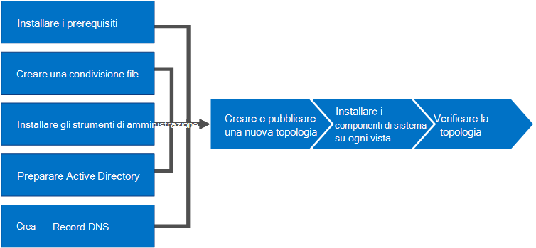

# Installare Skype for Business Server
 
**Riepilogo:** Informazioni su come preparare l'ambiente per un'installazione di Skype for Business Server. Scaricare una versione di valutazione gratuita di Skype for Business Server dal Microsoft Evaluation Center all'[https://www.microsoft.com/evalcenter/evaluate-skype-for-business-server](https://www.microsoft.com/evalcenter/evaluate-skype-for-business-server)Indirizzo:.
  
Questo articolo illustra come eseguire un'installazione di esempio di Skype for Business Server. Questo articolo non cerca di coprire tutte le procedure necessarie per eseguire un'installazione completa di Skype for Business Server. L'obiettivo è quello di includere procedure di esempio in una topologia definita in maniera restrittiva che include le funzionalità di base di riunione e condivisione.
  
## Panoramica del processo di installazione per Skype for Business Server

Un'installazione di Skype for Business Server include diverse procedure. Le procedure necessarie per ottenere Skype for Business Server in uso nell'ambiente dipendono dalle specifiche dell'ambiente. Se si usa Windows Server per DNS, ad esempio, si trarrà vantaggio dalla procedura di esempio per l'aggiunta di una voce DNS. Se si usa un altro sistema per DNS, è necessario seguire le procedure per il sistema DNS specifico. Questo vale per molte delle procedure descritte in questa sezione.
  
Skype for Business Server è disponibile in Standard Edition e Enterprise Edition. La differenza principale è che Standard Edition non supporta le caratteristiche di disponibilità elevata incluse in Enterprise Edition. 
  
Skype for Business Server è un prodotto avanzato e l'esatta procedura di installazione dipende molto dalle circostanze specifiche. In questa sezione vengono illustrati i passaggi generali per installare il prodotto. Tuttavia, ogni routine può essere diversa a seconda dell'ambiente e delle decisioni di pianificazione. Ad esempio, per le piccole organizzazioni un singolo server, è possibile eseguire Skype for Business Server Standard Edition, mentre un'organizzazione multinazionale di grandi dimensioni potrebbe avere server di 50 in tutte le sedi del mondo dedicate al prodotto.
  
> [!NOTE]
> Per informazioni sugli aggiornamenti cumulativi più recenti, vedere [aggiornamenti per Skype for Business Server](https://support.microsoft.com/en-us/kb/3061064). Dopo l'installazione della patch CU1, è necessario che un `Update-CsAdminRole` amministratore esegua il cmdlet. Questo cmdlet è necessario per accedere ai nuovi cmdlet di GCP tramite PowerShell remoto.
  
> [!IMPORTANT]
> Le procedure descritte in questa sezione fungono da esempio in base a un set di requisiti definito in modo restrittivo e presuppongono che siano già state prese decisioni specifiche. Le procedure effettive necessarie per installare Skype for Business Server saranno probabilmente molto diverse. Usare le procedure descritte in questa sezione solo come esempio e non come guida dettagliata per l'installazione di Skype for Business Server in tutti gli ambienti. 
  
L'accesso e l'esecuzione di Skype for Business Server per la prima volta comporta otto passaggi principali. Dovresti capire che le procedure di esempio in questa sezione non sono le sole procedure necessarie per l'installazione di Skype for Business Server. Gli otto passaggi seguenti sono semplicemente esempi che consentono di comprendere meglio il processo globale e di ottenere un ambiente di lavoro di base funzionante. È possibile eseguire i passaggi da 1 a 5 in qualsiasi ordine. Tuttavia, è necessario eseguire i passaggi 6, 7 e 8 in ordine e dopo i passaggi da 1 a 5, come illustrato nel diagramma. Gli otto passaggi sono i seguenti:
  

  
- [Installare prerequisiti per Skype for Business Server](install-prerequisites.md) : installare i prerequisiti in tutti i server che compongono la topologia di Skype for Business Server. Tieni presente che i prerequisiti non sono uguali per tutti i ruoli. Ad esempio, i server che includono il ruolo front-end hanno un set di prerequisiti e i server che prevedono un ruolo di amministratore hanno un set di prerequisiti diverso. Per altre informazioni, vedere documentazione relativa alla pianificazione dei prerequisiti.
    
- [Creare una condivisione file in Skype for Business Server](create-a-file-share.md) : creare una condivisione file che verrà usata dai server in tutta la topologia di Skype for Business Server.
    
- [Installare gli strumenti di amministrazione in Skype for Business Server](install-administrative-tools.md) : gli strumenti di amministrazione includono generatore di topologia e pannello di controllo. È necessario installare gli strumenti di amministrazione in almeno un server nella topologia o in una workstation di gestione a 64 bit in cui è in esecuzione una versione del sistema operativo Windows supportata per Skype for Business Server.
    
- [Preparare Active Directory per Skype for Business Server](prepare-active-directory.md) : Skype for Business Server lavora in stretta collaborazione con Active Directory. È necessario preparare il dominio Active Directory per l'utilizzo con Skype for Business Server. Puoi eseguire questa operazione tramite la distribuzione guidata ed è eseguita solo una volta per il dominio. Questo avviene perché il processo crea gruppi e modifica il dominio ed è necessario farlo una sola volta.
    
- [Creare record DNS per Skype for Business Server](create-dns-records.md) : affinché Skype for Business Server funzioni correttamente, è necessario che sia presente un certo numero di impostazioni DNS. In modo che i client sappiano come accedere ai servizi e i server sappiano reciprocamente. Queste impostazioni devono essere completate solo una volta per ogni distribuzione, perché una volta assegnata una voce DNS è disponibile in tutto il dominio.
    
- [Creare e pubblicare una nuova topologia in Skype for Business Server](create-and-publish-new-topology.md) : prima di installare il sistema Skype for Business Server in ognuno dei server della topologia, è necessario creare una topologia e pubblicarla. Quando si pubblica una topologia, si caricano le informazioni sulla topologia nel database Central Management store. Se si tratta di un pool di Enterprise Edition, la prima volta che si pubblica una nuova topologia si crea il database Central Management store. Se si tratta di Standard Edition, è necessario eseguire il processo di preparazione del primo server Standard Edition dalla distribuzione guidata prima di pubblicare una topologia. Questa operazione viene preparata per la versione standard con l'installazione di un'istanza di SQL Server Express Edition e la creazione di Central Management store.
    
- [Installare Skype for Business Server nei server](install-skype-for-business-server.md) della topologia: dopo aver caricato la topologia in Central Management store e Active Directory sa quali server eseguiranno i ruoli, è necessario installare il sistema di Skype for Business Server in ognuno dei i server della topologia.
    
- [Verificare la topologia in Skype for Business Server](verify-the-topology.md) : dopo aver pubblicato la topologia e i componenti di sistema di Skype for Business Server installati in ognuno dei server della topologia, si è pronti per verificare che la topologia funzioni come previsto. Ciò include verificare che la configurazione si sia propagata a tutti i server di Active Directory in modo che l'intero dominio sappia che Skype for business è disponibile nel dominio.
    

