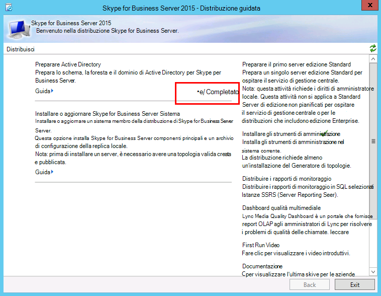

# <a name="prepare-active-directory-for-skype-for-business-server"></a>Preparare Active Directory per Skype for Business Server
 
**Riepilogo:** Informazioni su come preparare il dominio Active Directory per un'installazione di Skype for Business Server. Scaricare una versione di valutazione gratuita di Skype for Business Server dal [Microsoft Evaluation Center](https://www.microsoft.com/evalcenter/evaluate-skype-for-business-server).
  
Skype for Business Server lavora in stretta collaborazione con Active Directory. È necessario preparare il dominio Active Directory per l'utilizzo con Skype for Business Server. Questo processo viene eseguito nella distribuzione guidata ed è fatto solo una volta per il dominio. Questo avviene perché il processo crea gruppi e modifica il dominio ed è necessario farlo una sola volta. È possibile eseguire i passaggi da 1 a 5 in qualsiasi ordine. Tuttavia, è necessario eseguire i passaggi 6, 7 e 8 in ordine e dopo i passaggi da 1 a 5, come illustrato nel diagramma. La preparazione di Active Directory è il passaggio 4 di 8. Per altre informazioni sulla pianificazione di Active Directory, vedere [requisiti ambientali per i requisiti di Skype for Business Server](../../plan-your-deployment/requirements-for-your-environment/environmental-requirements.md) o server [per Skype for Business Server 2019](../../../SfBServer2019/plan/system-requirements.md).
  

  
## <a name="prepare-active-directory"></a>Preparare Active Directory

Skype for Business Server è strettamente integrato con Active Directory Domain Services (AD DS). Prima di poter installare Skype for Business Server per la prima volta, è necessario preparare Active Directory. La sezione della distribuzione guidata intitolata **preparare Active Directory** prepara l'ambiente Active Directory per l'uso con Skype for Business Server.
  
> [!NOTE]
> Skype for Business Server USA (AD DS) per tenere traccia e comunicare con tutti i server di una topologia. Ogni server deve essere unito al dominio in modo che Skype for Business Server possa funzionare correttamente. 
  
> [!IMPORTANT]
> La procedura di preparazione di Active Directory deve essere eseguita una sola volta per ogni dominio della distribuzione. 
  
Guardare la procedura video per **preparare Active Directory**:
  
> [!video https://www.microsoft.com/en-us/videoplayer/embed/RE1Ybuk]
  
### <a name="prepare-active-directory-from-the-deployment-wizard"></a>Preparare Active Directory dalla distribuzione guidata

1. Accedere come utente con le credenziali degli amministratori dello schema per il dominio Active Directory.
    
2. Aprire la distribuzione guidata di Skype for Business Server.
    
    > [!TIP]
    > Se si vogliono rivedere i file di log creati dalla distribuzione guidata di Skype for Business Server, è possibile trovarli nel computer in cui è stata eseguita la distribuzione guidata, nella directory utenti dell'utente di servizi di dominio Active Directory che ha eseguito il passaggio. Ad esempio, se l'utente ha effettuato l'accesso come amministratore del dominio nel dominio, contoso. local, i file di log si trovano in: C:\Users\Administrator.Contoso\AppData\Local\Temp. 
  
3. Fare clic sul collegamento **prepara Active Directory** .
    
4. **Passaggio 1: preparare lo schema**
    
    un. Esaminare le informazioni sui prerequisiti per il passaggio 1, a cui è possibile accedere facendo clic sull'elenco a discesa sotto il titolo del passaggio 1.
    
    b. Fare clic su **Esegui** nel passaggio 1 per avviare la procedura guidata Prepara schema.
    
    c. Tieni presente che la procedura deve essere eseguita una sola volta per ogni distribuzione, quindi fai clic su **Avanti**.
    
    3D. Dopo aver preparato lo schema, è possibile visualizzare il log facendo clic su **Visualizza log**. 
    
    e. Fare clic su **fine** per chiudere la procedura guidata Prepara schema e tornare alla procedura prepara Active Directory.
    
5. **Passaggio 2: verificare la replica della partizione dello schema**
    
    un. Accedere al controller di dominio per il dominio.
    
    b. Aprire **ADSI Edit** dal menu a discesa **strumenti** in **Server Manager**.
    
    c. Nel menu **azione** fare clic su **Connetti a**.
    
    3D. Nella finestra di dialogo **impostazioni di connessione** in **selezionare un contesto di denominazione ben noto**Selezionare **schema**e quindi fare clic su **OK**.
    
    e. In contenitore schema cercare **CN = ms-RTC-SIP-SchemaVersion**. Se l'oggetto esiste e il valore dell'attributo **rangeUpper** è 1150 e il valore dell'attributo **RangeLower** è 3, lo schema è stato aggiornato e replicato correttamente. Se l'oggetto non esiste o se i valori degli attributi **rangeUpper** e **RangeLower** non sono specificati, lo schema non è stato modificato o non è stato replicato.
    
6. **Passaggio 3: preparare la foresta corrente**
    
    un. Esaminare le informazioni sui prerequisiti per il passaggio 3 a cui è possibile accedere facendo clic sull'elenco a discesa sotto il titolo del passaggio 3.
    
    b. Fare clic su **Esegui** nel passaggio 3 per avviare la procedura guidata prepara foresta corrente.
    
    c. Tenere presente che la procedura deve essere eseguita una sola volta per la distribuzione e quindi fare clic su **Avanti**.
    
    3D. Specificare il dominio in cui verranno creati i gruppi universali. Se il server fa parte del dominio, è possibile scegliere il **dominio locale**e fare clic su **Avanti**.
    
    e. Dopo aver preparato la foresta, è possibile visualizzare il log facendo clic su **Visualizza log**. 
    
    f. Fare clic su **fine** per chiudere la procedura guidata prepara foresta corrente e tornare alla procedura prepara Active Directory.
    
    g. Fare clic su **Skype for Business Server Management Shell** dalla pagina **app** per avviare PowerShell.
    
    h. Digitare il comando Get-CsAdForest e premere **invio**.
    
    Ho. Se il risultato è **LC_FORESTSETTINGS_STATE_READY**, la foresta è stata preparata correttamente, come illustrato nella figura.
    
     
  
7. **Passaggio 4: verificare la replica del catalogo globale**
    
    un. In un controller di dominio (preferibilmente in un sito remoto dagli altri controller di dominio), nella foresta in cui è stata eseguita la preparazione della foresta, aprire **utenti e computer di Active Directory**.
    
    b. In **utenti e computer di Active Directory**espandere il nome di dominio della foresta o di un dominio figlio.
    
    c. Fare clic sul contenitore **utenti** nel riquadro sinistro e cercare il gruppo universale **CsAdministrator** nel riquadro destro. Se è presente CsAdministrator (tra gli altri nuovi gruppi universali che iniziano con CS), la replica di Active Directory ha avuto esito positivo.
    
    3D. Se i gruppi non sono ancora presenti, è possibile forzare la replica oppure attendere 15 minuti e aggiornare il riquadro laterale destro. Quando i gruppi sono presenti, la replica viene completata.
    
8. **Passaggio 5: preparare il dominio corrente**
    
    un. Esaminare le informazioni sui prerequisiti per il passaggio 5.
    
    b. Fare clic su **Esegui** nel passaggio 5 per avviare la procedura guidata Prepara dominio corrente.
    
    c. Tieni presente che la procedura deve essere eseguita una sola volta per ogni dominio della distribuzione e quindi fare clic su **Avanti**.
    
    3D. Dopo aver preparato il dominio, è possibile visualizzare il log facendo clic su **Visualizza log**. 
    
    e. Fare clic su **fine** per chiudere la procedura guidata Prepara dominio corrente e tornare alla procedura prepara Active Directory.
    
    Questi passaggi devono essere completati in tutti i domini in cui vengono trovati gli oggetti di Skype for Business Server, altrimenti i servizi potrebbero non essere avviati. Questo include qualsiasi tipo di oggetto Active Directory, ad esempio utenti, oggetti contatto, gruppi amministrativi o qualsiasi altro tipo di oggetto. Puoi usare set-CsUserReplicatorConfiguration-ADDomainNamingContextList per aggiungere solo i domini con gli oggetti di Skype for Business Server, se necessario.
    
9. **Passaggio 6: verificare la replica nel dominio**
    
    un. Fare clic su **Skype for Business Server Management Shell** dalla pagina **app** per avviare PowerShell.
    
    b. Usare il comando Get-CsAdDomain per verificare la replica all'interno del dominio.
    
   ```
   Get-CsAdDomain [-Domain <Fqdn>] [-DomainController <Fqdn>] [-GlobalCatalog <Fqdn>] [-GlobalSettingsDomainController <Fqdn>]
   ```

    > [!NOTE]
    > Se non si specifica il parametro Domain, per impostazione predefinita verrà utilizzato il dominio locale. 
  
    Esempio di eseguire il comando per il dominio contoso. local:
    
   ```
   Get-CsAdDomain -Domain contoso.local -GlobalSettingsDomainController dc.contoso.local
   ```

    > [!NOTE]
    > Usando il parametro GlobalSettingsDomainController, puoi indicare dove sono archiviate le impostazioni globali. Se le impostazioni sono archiviate nel contenitore di sistema (tipico delle distribuzioni di aggiornamento che non hanno eseguito la migrazione dell'impostazione globale al contenitore di configurazione), si definisce un domain controller nella radice della foresta di servizi di dominio Active Directory. Se invece le impostazioni globali sono incluse nel contenitore Configuration, come avviene in genere con le distribuzioni nuove o di aggiornamento per cui è stata eseguita la migrazione delle impostazioni nel contenitore Configuration, definire un controller di dominio nella foresta. Se non specifichi questo parametro, il cmdlet presuppone che le impostazioni siano archiviate nel contenitore di configurazione e faccia riferimento a qualsiasi controller di dominio in Active Directory. 
  
    c. Se il risultato è **LC_DOMAINSETTINGS_STATE_READY**, il dominio è stato replicato correttamente.
    
10. **Passaggio 7: aggiungere utenti per consentire l'accesso amministrativo al pannello di controllo di Skype for Business Server**
    
    un. Eseguire l'accesso come membri del gruppo Domain Admins o del gruppo RTCUniversalServerAdmins.
    
    b. Aprire **utenti e computer di Active Directory**, espandere il dominio, fare clic sul contenitore **utenti** , fare clic con il pulsante destro del mouse su CsAdministrator e scegliere **proprietà**.
    
    c. Nelle **** proprietà di CsAdministrator fare clic sulla scheda **Membri**.
    
    3D. Nella scheda **membri** fare clic su **Aggiungi**. In **Seleziona utenti, contatti, computer, account di servizio o gruppi** individuare **Immettere i nomi degli oggetti da selezionare**. Digitare i nomi degli utenti o dei gruppi da aggiungere al gruppo CsAdministrators. Fare clic su **OK**.
    
    e. Nella scheda **membri** verificare che gli utenti o i gruppi selezionati siano presenti. Fare clic su **OK**.
    
    > [!CAUTION]
    > Il pannello di controllo di Skype for Business Server è uno strumento di controllo di accesso basato sui ruoli. L'appartenenza al gruppo CsAdministrator offre a un utente che usa il controllo completo del pannello di controllo di Skype for Business Server per tutte le funzioni di configurazione disponibili. Vi sono inoltre altri ruoli per funzioni specifiche. Per informazioni dettagliate sui ruoli disponibili, vedere [requisiti ambientali per i requisiti di Skype for Business Server](../../plan-your-deployment/requirements-for-your-environment/environmental-requirements.md) o server [per Skype for Business Server 2019](../../../SfBServer2019/plan/system-requirements.md). Tieni presente che gli utenti non devono essere abilitati per Skype for Business Server per essere resi membri dei gruppi di gestione. 
  
    > [!CAUTION]
    > Per aiutare a mantenere la sicurezza e l'integrità del controllo di accesso basato sui ruoli, Aggiungi utenti ai gruppi che definiscono il ruolo che l'utente esegue nella gestione della distribuzione di Skype for Business Server. 
  
11. Disconnettersi e quindi accedere di nuovo a Windows in modo che il token di sicurezza venga aggiornato con il nuovo gruppo di sicurezza di Skype for Business Server e quindi riaprire la distribuzione guidata.
    
12. Verificare che venga visualizzato un segno di spunta verde accanto a **prepara Active Directory** per confermare l'esito positivo, come illustrato nella figura.
    
     
  

## <a name="see-also"></a>Vedere anche
 
[Servizi di dominio Active Directory per Skype for Business Server 2015](../../plan-your-deployment/security/active-directory-domain-services.md)
