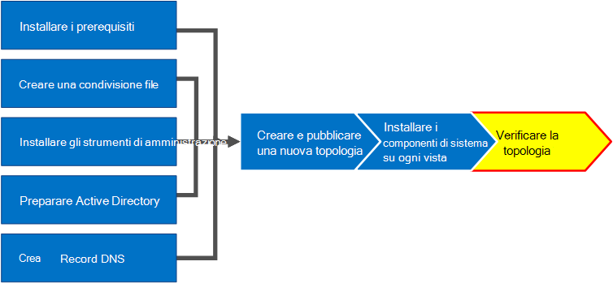

# Verificare la topologia in Skype for Business Server
 
**Riepilogo:** Informazioni su come verificare che la topologia di Skype for Business Server e i server Active Directory funzionino come previsto. Scaricare una versione di valutazione gratuita di Skype for Business Server dal [Microsoft Evaluation Center](https://www.microsoft.com/evalcenter/evaluate-skype-for-business-server).
  
Dopo avere pubblicato la topologia e i componenti di sistema di Skype for Business Server installati in ognuno dei server della topologia, si è pronti per verificare che la topologia funzioni come previsto. Ciò include verificare che la configurazione si sia propagata a tutti i server di Active Directory in modo che l'intero dominio sappia che Skype for business è disponibile nel dominio. È possibile eseguire i passaggi da 1 a 5 in qualsiasi ordine. Tuttavia, è necessario eseguire i passaggi 6, 7 e 8 in ordine e dopo i passaggi da 1 a 5, come illustrato nel diagramma. La verifica della topologia è il passaggio 8 di 8.
  

  
## Testare la distribuzione del pool Front-End

Il passaggio finale consiste nel testare il pool Front-end e verificare che i client Skype for business possano comunicare tra loro. 
  
### Aggiungere utenti e verificare la connettività del client

1. Usare i computer e gli utenti di Active Directory per aggiungere l'oggetto utente di Active Directory del ruolo di amministratore per la distribuzione di Skype for Business Server (in cui è installato il pannello di controllo di Skype for Business Server) nel gruppo **CsAdministrator** .
    
    > [!IMPORTANT]
    > Se non si aggiungono gli utenti e i gruppi appropriati al gruppo CsAdministors, viene visualizzato un messaggio di errore quando si apre il pannello di controllo di Skype for Business Server che legge "non autorizzato: l'accesso è negato a causa di un errore di autorizzazione del controllo di accesso basato sui ruoli (RBAC) ." 
  
2. Se l'oggetto utente è attualmente connesso, disconnettersi e quindi accedere di nuovo per registrare la nuova assegnazione del gruppo.
    
    > [!NOTE]
    > L'account utente non può essere l'amministratore locale di qualsiasi server che esegua Skype for Business Server. 
  
3. Usare l'account amministrativo per accedere al computer in cui è installato il pannello di controllo di Skype for Business Server.
    
4. Avviare il pannello di controllo di Skype for Business Server e quindi specificare le credenziali, se richiesto. Il pannello di controllo di Skype for Business Server Visualizza le informazioni sulla distribuzione.
    
5. Nella barra di spostamento sinistra fare clic su **topologia**e quindi verificare che lo stato del servizio visualizzi un computer con una freccia verde e che un segno di spunta verde per lo stato di replica sia accanto a ogni ruolo di Skype for Business Server distribuito e portato online. 
    
6. Sulla barra di spostamento sinistra fare clic su **utenti**e quindi su **Abilita utenti**. 
    
7. Nella **nuova pagina utente di Skype for Business Server** fare clic su **Aggiungi**.
    
8. Per definire i parametri di ricerca per gli oggetti che si desidera trovare, nella pagina **Seleziona da Active Directory** è possibile selezionare **ricerca**e quindi fare clic su **Aggiungi filtro**. È anche possibile selezionare **ricerca LDAP** e immettere un'espressione LDAP per filtrare o limitare gli oggetti che verranno restituiti. Dopo aver deciso le opzioni di ricerca, fare clic su **trova**.
    
9. Nel riquadro Risultati ricerca selezionare gli utenti che si desidera aggiungere e quindi fare clic su **OK**.
    
10. Nella **nuova pagina utente di Skype for Business Server** gli utenti selezionati si trovano nella visualizzazione **utenti** . Nell'elenco **Assegna utenti a un pool** selezionare il server in cui devono risiedere gli utenti.
    
    Di seguito è riportato un elenco di opzioni che è possibile usare per configurare gli oggetti.
    
    - **Generare l'URI SIP dell'utente**
    
    - **Telefonia**
    
    - **URI di linea**
    
    - **Criteri di conferenza**
    
    - **Criteri di versione client**
    
    - **Criteri PIN**
    
    - **Criteri di accesso esterno**
    
    - **Criteri di archiviazione**
    
    - **Criteri posizione**
    
    - **Criteri client**
    
    Per testare le funzionalità di base, selezionare l'opzione che si preferisce per l'impostazione **URI SIP dell'utente** (le altre opzioni nella configurazione usano le impostazioni predefinite) e quindi fare clic su **Abilita**, come illustrato nella figura.
    
     
  
11. Viene visualizzata una pagina di riepilogo che mostra un segno di spunta nella colonna **Enabled** per indicare che gli utenti sono impostati. Nella colonna **indirizzo SIP** viene visualizzato l'indirizzo necessario per la configurazione di accesso dell'utente.
    
     
  
12. È necessario registrare un utente in un computer a cui è associato il dominio e un altro utente in un altro computer del dominio.
    
13. Installare client Skype for business in ognuno dei due computer client e quindi verificare che entrambi gli utenti possano accedere a Skype for Business Server e inviare messaggi istantanei a vicenda.
    

