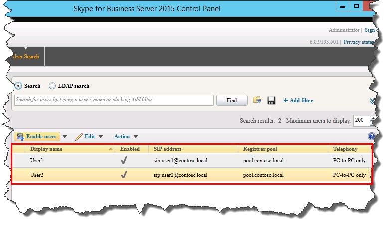

# Verificare la topologia in Skype for Business ServerVerify the topology in Skype for Business Server
 
**Riepilogo:** Informazioni su come verificare che la topologia di Skype for Business Server e i server Active Directory funzionino come previsto.**Summary:** Learn how to verify the Skype for Business Server topology and Active Directory servers are working as expected. Scaricare una versione di valutazione gratuita di Skype for Business Server dal [Microsoft Evaluation Center](https://www.microsoft.com/evalcenter/evaluate-skype-for-business-server).Download a free trial of Skype for Business Server from the [Microsoft Evaluation center](https://www.microsoft.com/evalcenter/evaluate-skype-for-business-server).
  
Dopo avere pubblicato la topologia e i componenti di sistema di Skype for Business Server installati in ognuno dei server della topologia, si è pronti per verificare che la topologia funzioni come previsto.After you have the topology published and the Skype for Business Server system components installed on each of the servers in the topology, you are ready to verify that the topology is working as expected. Ciò include verificare che la configurazione si sia propagata a tutti i server di Active Directory in modo che l'intero dominio sappia che Skype for business è disponibile nel dominio.This includes verifying that the configuration has propagated out to all of the Active Directory servers so that the entire domain knows Skype for Business is available in the domain. È possibile eseguire i passaggi da 1 a 5 in qualsiasi ordine.You can do steps 1 through 5 in any order. Tuttavia, è necessario eseguire i passaggi 6, 7 e 8 in ordine e dopo i passaggi da 1 a 5, come illustrato nel diagramma.However, you must do steps 6, 7, and 8 in order, and after steps 1 through 5, as outlined in the diagram. La verifica della topologia è il passaggio 8 di 8.Verifying the topology is step 8 of 8.
  

  
## Testare la distribuzione del pool Front-EndTest the Front End pool deployment

Il passaggio finale consiste nel testare il pool Front-end e verificare che i client Skype for business possano comunicare tra loro.The final step is to test the Front End pool and confirm that Skype for Business clients can communicate with each other. 
  
### Aggiungere utenti e verificare la connettività del clientAdd users and verify client connectivity

1. Usare i computer e gli utenti di Active Directory per aggiungere l'oggetto utente di Active Directory del ruolo di amministratore per la distribuzione di Skype for Business Server (in cui è installato il pannello di controllo di Skype for Business Server) nel gruppo **CsAdministrator** .Use Active Directory Computers and Users to add the Active Directory user object of the administrator role for the Skype for Business Server deployment (on which Skype for Business Server Control Panel is installed) to the **CSAdministrator** group.
    
    > [!IMPORTANT]
    > Se non si aggiungono gli utenti e i gruppi appropriati al gruppo CsAdministors, viene visualizzato un messaggio di errore quando si apre il pannello di controllo di Skype for Business Server che legge "non autorizzato: l'accesso è negato a causa di un errore di autorizzazione del controllo di accesso basato sui ruoli (RBAC) ."If you do not add the appropriate users and groups to the CsAdministors group, you will receive an error when you open Skype for Business Server Control Panel which reads, "Unauthorized: Access is denied due to a role-based access control (RBAC) authorization failure." 
  
2. Se l'oggetto utente è attualmente connesso, disconnettersi e quindi accedere di nuovo per registrare la nuova assegnazione del gruppo.If the user object is currently logged on, log off and then log on again to register the new group assignment.
    
    > [!NOTE]
    > L'account utente non può essere l'amministratore locale di qualsiasi server che esegua Skype for Business Server.The user account cannot be the local administrator of any server running Skype for Business Server. 
  
3. Usare l'account amministrativo per accedere al computer in cui è installato il pannello di controllo di Skype for Business Server.Use the administrative account to log on to the computer where Skype for Business Server Control Panel is installed.
    
4. Avviare il pannello di controllo di Skype for Business Server e quindi specificare le credenziali, se richiesto.Start Skype for Business Server Control Panel, and then provide credentials, if prompted. Il pannello di controllo di Skype for Business Server Visualizza le informazioni sulla distribuzione.Skype for Business Server Control Panel displays deployment information.
    
5. Nella barra di spostamento sinistra fare clic su **topologia**e quindi verificare che lo stato del servizio visualizzi un computer con una freccia verde e che un segno di spunta verde per lo stato di replica sia accanto a ogni ruolo di Skype for Business Server distribuito e portato online.In the left navigation bar, click **Topology**, and then confirm that the service status shows a computer with a green arrow and that a green check mark for replication status is next to each Skype for Business Server role that has been deployed and brought online. 
    
6. Sulla barra di spostamento sinistra fare clic su **utenti**e quindi su **Abilita utenti**.In the left navigation bar, click **Users**, and then click **Enable users**. 
    
7. Nella **nuova pagina utente di Skype for Business Server** fare clic su **Aggiungi**.On the **New Skype for Business Server User** page, click **Add**.
    
8. Per definire i parametri di ricerca per gli oggetti che si desidera trovare, nella pagina **Seleziona da Active Directory** è possibile selezionare **ricerca**e quindi fare clic su **Aggiungi filtro**.To define search parameters for the objects you want to find, on the **Select from Active Directory** page, you can select **Search**, and then optionally click **Add Filter**. È anche possibile selezionare **ricerca LDAP** e immettere un'espressione LDAP per filtrare o limitare gli oggetti che verranno restituiti.You can also select **LDAP search** and enter an LDAP expression to filter or limit the objects that will be returned. Dopo aver deciso le opzioni di ricerca, fare clic su **trova**.After you have decided on your Search options, click **Find**.
    
9. Nel riquadro Risultati ricerca selezionare gli utenti che si desidera aggiungere e quindi fare clic su **OK**.In the Search results pane, select the users you want to add, and then click **OK**.
    
10. Nella **nuova pagina utente di Skype for Business Server** gli utenti selezionati si trovano nella visualizzazione **utenti** .On the **New Skype for Business Server User** page, the users you selected are in the **Users** display. Nell'elenco **Assegna utenti a un pool** selezionare il server in cui devono risiedere gli utenti.In the **Assign users to a pool** list, select the server where the users should reside.
    
    Di seguito è riportato un elenco di opzioni che è possibile usare per configurare gli oggetti.The following is a list of options you can use to configure the objects.
    
    - **Generare l'URI SIP dell'utente****Generate user's SIP URI**
    
    - **Telefonia****Telephony**
    
    - **URI di linea****Line URI**
    
    - **Criteri di conferenza****Conferencing policy**
    
    - **Criteri di versione client****Client version policy**
    
    - **Criteri PIN****PIN policy**
    
    - **Criteri di accesso esterno****External access policy**
    
    - **Criteri di archiviazione****Archiving policy**
    
    - **Criteri posizione****Location policy**
    
    - **Criteri client****Client policy**
    
    Per testare le funzionalità di base, selezionare l'opzione che si preferisce per l'impostazione **URI SIP dell'utente** (le altre opzioni nella configurazione usano le impostazioni predefinite) e quindi fare clic su **Abilita**, come illustrato nella figura.To test the basic functionality, select the option you prefer for the **Generate user's SIP URI** setting (the other options in the configuration use default settings), and then click **Enable**, as shown in the figure.
    
     
  
11. Viene visualizzata una pagina di riepilogo che mostra un segno di spunta nella colonna **Enabled** per indicare che gli utenti sono impostati.A summary page is displayed that shows a check mark in the **Enabled** column to indicate that the users are setup. Nella colonna **indirizzo SIP** viene visualizzato l'indirizzo necessario per la configurazione di accesso dell'utente.The **SIP address** column displays the address you need for the user sign-in configuration.
    
     
  
12. È necessario registrare un utente in un computer a cui è associato il dominio e un altro utente in un altro computer del dominio.Log one user on to a computer that is joined to the domain and another user on to another computer in the domain.
    
13. Installare client Skype for business in ognuno dei due computer client e quindi verificare che entrambi gli utenti possano accedere a Skype for Business Server e inviare messaggi istantanei a vicenda.Install Skype for Business client on each of the two client computers, and then verify that both users can sign in to Skype for Business Server and can send instant messages to each other.
    

