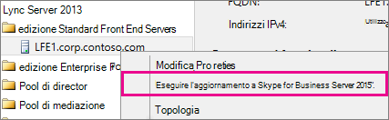
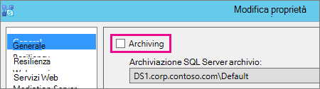
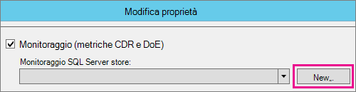
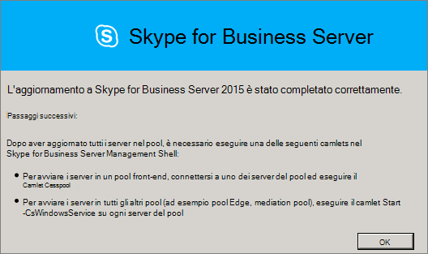
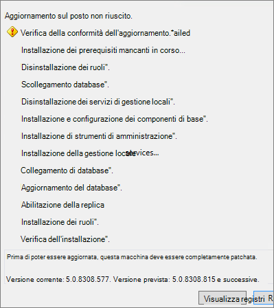

# <a name="upgrade-to-skype-for-business-server-2015"></a>Eseguire l'Skype for Business Server 2015
 
**Riepilogo:** Informazioni su come eseguire l'aggiornamento da Lync Server 2013 a Skype for Business Server 2015. Scarica una versione di valutazione gratuita di Skype for Business Server 2015 dal [Centro di valutazione Microsoft.](https://www.microsoft.com/evalcenter/evaluate-skype-for-business-server)
  
Utilizzare le procedure descritte in questo documento per eseguire l'aggiornamento da Lync Server 2013 a Skype for Business Server 2015 utilizzando il Generatore di topologie di Skype for Business Server e la nuova funzionalità di aggiornamento In-Place. Se si desidera eseguire l'aggiornamento da Lync Server 2010 o Office Communications Server 2007 R2, vedere [Plan to upgrade to Skype for Business Server 2015](../plan-your-deployment/upgrade.md).

> [!NOTE]
> Gli aggiornamenti sul posto erano disponibili Skype for Business Server 2015, ma non sono più supportati in Skype for Business Server 2019. La coesistenza affiancata è supportata, vedere [Migration to Skype for Business Server 2019](../../SfBServer2019/migration/migration-to-skype-for-business-server-2019.md) per ulteriori informazioni.
  
## <a name="upgrade-from-lync-server-2013"></a>Aggiornamento da Lync Server 2013

L'aggiornamento di Lync Server 2013 a Skype for Business Server 2015 implica l'installazione del software prerequisito, l'utilizzo del Generatore di topologie di Skype for Business Server per aggiornare i database nel pool e l'utilizzo dell'aggiornamento di Skype for Business Server In-Place in ognuno dei server associati al pool. Per completare l'aggiornamento, eseguire gli otto passaggi descritti in questo argomento.
  
### <a name="before-you-begin"></a>Prima di iniziare

- Rivedere [Plan to upgrade to Skype for Business Server 2015](../plan-your-deployment/upgrade.md).
    
- Esaminare [i requisiti del server per Skype for Business Server 2015](../plan-your-deployment/requirements-for-your-environment/server-requirements.md).
    
- [Installare i prerequisiti per Skype for Business Server 2015](install/install-prerequisites.md) .
    
- [Installare Skype for Business Server 2015](install/install.md) .
    
### <a name="step-1-install-administrator-tools-and-download-topology"></a>Passaggio 1: Installare gli strumenti di amministrazione e scaricare la topologia

1. Connessione computer nella topologia in cui non è installato Lync OCSCore o altri componenti lync.
    
2. Da Skype for Business Server di installazione 2015, **eseguire** Setup.exeda **OCS_Volume\Setup\AMD64**. 
    
3. Fare clic su **Installa**. 
    
4. Accettare il contratto di licenza.
    
5. Nella Distribuzione guidata fare clic **su Installa strumenti di amministrazione** e seguire la procedura per l'installazione.
    
     
  
6. Dalla schermata Windows start, aprire Skype for Business Server Generatore di topologie.
    
7. Fare **clic su Scarica topologia dalla distribuzione esistente** e quindi su **Avanti.**
    
8. Immettere un nome per la topologia e fare clic su **Salva.**
    
9. Passare al percorso in cui è stata salvata la topologia e creare una copia della topologia.
    
### <a name="step-2-upgrade-and-publish-topology-using-topology-builder"></a>Passaggio 2: Aggiornare e pubblicare la topologia tramite Generatore di topologie

Prima di avviare il processo di aggiornamento, tutti i servizi devono essere in esecuzione per i pool che si intende aggiornare. In questo modo le modifiche della topologia verranno replicate nel database locale dei server del pool.
  
> [!IMPORTANT]
>  Salvare una copia del file della topologia prima di eseguire l'aggiornamento. Dopo l'aggiornamento, non sarà possibile eseguire il downgrade della topologia.> Se i servizi si trovano sugli stessi server dei database, come se il servizio Persistent Chat si trova sullo stesso server del database di Persistent Chat, ignorare questo passaggio e andare al passaggio 4. Dopo aver arrestare i servizi, eseguire il programma di In-Place di aggiornamento in ogni server per aggiornare i database locali.
  
> [!NOTE]
> Se nella topologia è disponibile un database back-end con mirroring, quando si pubblica  la topologia tramite Generatore di topologie verranno visualizzati sia i database principal che i database con mirroring. Assicurarsi che tutti i database siano in esecuzione nell'entità e selezionare solo l'entità, non il mirror, quando si pubblica la topologia, altrimenti verrà visualizzato un avviso dopo la pubblicazione della topologia.
  
Selezionare una delle opzioni seguenti per aggiornare e pubblicare una nuova topologia utilizzando il Generatore di Skype for Business Server 2015. Dopo aver completato i passaggi e aver pubblicato la topologia aggiornata, passare al passaggio 3 di questo argomento.
  
#### <a name="option-1-upgrade-an-isolated-front-end-pool-and-associated-archiving-and-monitoring-stores"></a>Opzione 1: aggiornare un pool Front End isolato e gli archivi di archiviazione e monitoraggio associati

Se il pool che si sta aggiornando ha una dipendenza dell'archivio di archiviazione e monitoraggio, quando si utilizza la procedura seguente, verrà aggiornato anche l'archivio di archiviazione e monitoraggio.
  
1. In Generatore di topologie fare clic con il pulsante destro del mouse su un pool di Lync Server 2013, scegliere Aggiorna a **Skype for Business Server 2015** e seguire i passaggi. 
    
     
  
2. In Generatore di topologie fare clic **su Azione**  >  **Pubblica topologia** o Su azione Pubblicazione   >    >  **topologia.** 
    
     
  
3. Durante la pubblicazione scegliere di installare un database nell'archivio di archiviazione e monitoraggio.
    
#### <a name="option-2-upgrade-front-end-pool-without-upgrading-archiving-and-monitoring-stores"></a>Opzione 2: aggiornare il pool Front End senza aggiornare gli archivi di archiviazione e monitoraggio

Se si utilizza la procedura seguente, l'archiviazione e il monitoraggio per il pool selezionato vengono disabilitati. Il pool non avrà archivi di archiviazione e monitoraggio dopo l'aggiornamento.
  
1. In Generatore di topologie selezionare il pool di Lync Server 2013 che si desidera aggiornare.
    
2. Rimuovere la dipendenza per gli archivi di archiviazione e monitoraggio di Lync Server 2013. 
    
   - Vai a **Azione**  >  **Modifica proprietà.**
    
   - Deselezionare **la casella di** controllo Archiviazione.
    
     
  
   - Deselezionare **la casella di** controllo Monitoraggio.
    
     
  
3. Fare clic con il pulsante destro del mouse sul pool di Lync Server 2013, **selezionare Aggiorna a Skype for Business Server 2015** e seguire i passaggi. 
    
     
  
4. In Generatore di topologie fare clic **su Azione**  >  **Pubblica topologia** o Su azione Pubblicazione   >    >  **topologia.** 
    
#### <a name="option-3-upgrade-front-end-pool-and-associated-it-to-new-skype-for-business-server-2015-archiving-and-monitoring-stores"></a>Opzione 3: aggiornare il pool Front End e associarlo ai nuovi archivi di archiviazione e monitoraggio Skype for Business Server 2015

Se si utilizza la procedura seguente, l'archiviazione e il monitoraggio si interromperanno nell'archivio precedente e inizieranno nel nuovo archivio creato. 
  
1. In Generatore di topologie selezionare il pool di Lync Server 2013 che si desidera aggiornare. 
    
2. Rimuovere la dipendenza per gli archivi di archiviazione e monitoraggio di Lync Server 2013. 
    
   - Vai a **Azione**  >  **Modifica proprietà.**
    
   - Deselezionare **la casella di** controllo Archiviazione.
    
     
  
   - Deselezionare **la casella di** controllo Monitoraggio.
    
     
  
3. Fare clic con il pulsante destro del mouse sul pool di Lync Server 2013, **selezionare Aggiorna a Skype for Business Server 2015** e seguire i passaggi. 
    
     
  
4. Creare un nuovo archivio SQL per l'archiviazione. 
    
   - Selezionare il pool e **le proprietà Action**  >  **Edit.** 
    
   -  Selezionare la **casella di controllo** Archiviazione.
    
   - Fare clic su **Nuova regola**.
    
     
  
5. Creare un nuovo archivio SQL per il monitoraggio. 
    
   - Selezionare il pool e **le proprietà Action**  >  **Edit.** 
    
   -  Selezionare la **casella di controllo** Monitoraggio.
    
   - Fare clic su **Nuova regola**.
    
     
  
6. In Generatore di topologie fare clic **su Azione**  >  **Pubblica topologia** o Su azione Pubblicazione   >    >  **topologia.** 
    
7. Durante la pubblicazione scegliere di installare il database nel nuovo archivio di archiviazione e monitoraggio.
    
### <a name="step-3-wait-for-replication"></a>Passaggio 3: attendere la replica

Concedere alla replica un certo tempo per pubblicare la topologia aggiornata in tutti i server dell'ambiente.
  
### <a name="step-4-stop-all-services-in-pool-to-be-upgraded"></a>Passaggio 4: Arrestare tutti i servizi nel pool da aggiornare

In ogni server che esegue la manutenzione del pool che si desidera aggiornare, eseguire il cmdlet seguente in PowerShell:
  
```powershell
Disable-CsComputer -Scorch
```

È consigliabile utilizzare Disable-CsComputer perché potrebbe essere necessario riavviare il server durante il In-Place processo di aggiornamento. Se si utilizza Stop-CsWindowsService, alcuni servizi potrebbero essere riavviati automaticamente dopo un riavvio. Ciò potrebbe causare l'In-Place dell'aggiornamento.
  
### <a name="step-5-upgrade-front-end-pools-and-non-front-end-pool-servers"></a>Passaggio 5: Aggiornare pool Front End e server di pool non Front End

> [!NOTE]
>  Prima di eseguire l'aggiornamento, installare tutti i nuovi prerequisiti necessari per Skype for Business Server 2015 che includono:> Almeno 32 GB di spazio libero prima di tentare un aggiornamento. Inoltre, assicurati che l'unità sia un'unità locale fissa, non è connesso tramite USB o Firewire, è formattato con il file system NTFS, non è compresso e non contiene un file di pagina.> PowerShell versione 6.2.9200.0 o successiva.> L'aggiornamento cumulativo più recente di Lync Server 2013 installato.> SQL Server 2012 SP1 installato.> I seguenti KB installati (installati automaticamente se si utilizza Microsoft Update): > Windows Server 2008 R2 -[KB2533623](https://support.microsoft.com/kb/2533623)> Windows Server 2012 -[KB2858668](https://support.microsoft.com/kb/2858668)> Windows Server 2012 R2 -[KB2982006](https://support.microsoft.com/kb/2982006)
  
Utilizzare la In-Place di aggiornamento in ogni server per aggiornare il pool Front End, il pool di server perimetrali, il Mediation Server e il pool Persistent Chat.
  
1. In ogni server, eseguire **Setup.exe** da **OCS_Volume\Setup\amd64** nel supporto di installazione Skype for Business Server 2015.
    
2. Accettare il contratto di licenza e seguire le istruzioni per l'In-Place aggiornamento.
    
3. Ripetere questi passaggi per ogni server nel pool Front End e in ogni server del pool non Front End.
    
> [!NOTE]
> Potrebbe essere richiesto di riavviare il server durante l'In-Place aggiornamento. Va bene. Dopo il riavvio, lIn-Place di aggiornamento continua dal punto in cui è stato lasciato. 
  
Al termine In-Place'aggiornamento, viene visualizzato il messaggio seguente.
  

  
### <a name="step-6-restart-services-on-all-upgraded-servers"></a>Passaggio 6: Riavviare i servizi in tutti i server aggiornati

> [!NOTE]
> Prima di riavviare i servizi, assicurarsi che %ProgramData%\WindowsFabric non esista in tutti i Front End Server. Se esiste, eliminarlo prima di avviare i servizi. 
  
- Dopo aver aggiornato tutti i server nel pool Front End, riavviare i servizi utilizzando il comando powershell seguente: 
    
  ```powershell
  Start-CsPool
  ```

    > [!NOTE]
    > Se è già necessario un riavvio del sistema in sospeso prima di avviare l'esecuzione di In-Place Upgrade, In-Place Upgrade non chiederà di riavviare al termine dell'installazione. Ciò causerà la generazione di alcune eccezioni di assembly nel primo Front End Server quando si tenta di avviare i servizi utilizzando il cmdlet Start-CSPool. Per risolvere questi errori, riavviare tutti i server del pool ed eseguire di nuovo il cmdlet. 
  
- Nei server del pool non Front End riavviare i servizi utilizzando il comando seguente:
    
  ```powershell
  Start-CsWindowsService
  ```

Dopo aver fatto **clic su OK** nella pagina In-Place aggiornamento, verrà visualizzato il promemoria seguente per completare questo passaggio.
  

  
### <a name="step-7-verify-skype-for-business-functionality-works"></a>Passaggio 7: verificare che la Skype for Business funzioni correttamente

Per verificare che l'aggiornamento sia stato eseguito correttamente, per il pool aggiornato, testare Skype for Business verificare che la funzionalità funzioni come previsto. 
  
### <a name="step-8-upgrade-secondary-pools"></a>Passaggio 8: aggiornare i pool secondari

Ripetere i passaggi descritti in questo argomento per aggiornare eventuali pool aggiuntivi presenti nell'ambiente.
  
## <a name="troubleshoot-issues-with-the-in-place-upgrade"></a>Risolvere i problemi relativi all'In-Place aggiornamento

Se lIn-Place non riesce, è possibile che venga visualizzato un messaggio simile a quello riportato nell'immagine seguente. 
  

  
Esaminare il messaggio completo nella parte inferiore della pagina per risolvere il problema. Fare **clic su Visualizza** log per ottenere ulteriori dettagli.
  
Se l'aggiornamento di In-Place  ha esito negativo in Verifica della preparazione dell'aggiornamento o Installazione dei prerequisiti **mancanti,** verificare che nel server siano applicati tutti gli aggiornamenti più recenti di Windows Server, Lync Server e SQL Server e che siano installati tutti i ruoli e il software necessari. Per un elenco delle informazioni necessarie, vedere [Server requirements for Skype for Business Server 2015](../plan-your-deployment/requirements-for-your-environment/server-requirements.md) e Install [prerequisites for Skype for Business Server 2015](install/install-prerequisites.md).
  
## <a name="see-also"></a>Vedere anche

[Pianificare l'aggiornamento a Skype for Business Server 2015](../plan-your-deployment/upgrade.md)
  
[Requisiti del server per Skype for Business Server 2015](../plan-your-deployment/requirements-for-your-environment/server-requirements.md)
  
[Installare i prerequisiti per Skype for Business Server 2015](install/install-prerequisites.md)
  
[Installare Skype for Business Server 2015](install/install.md)
