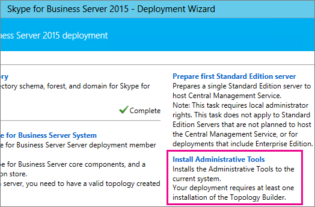

# <a name="upgrade-to-skype-for-business-server-2015"></a><span data-ttu-id="4e1e3-104">Eseguire l'aggiornamento a Skype for Business Server 2015</span><span class="sxs-lookup"><span data-stu-id="4e1e3-104">Upgrade to Skype for Business Server 2015</span></span>
 
<span data-ttu-id="4e1e3-105">**Riepilogo:** Informazioni su come eseguire l'aggiornamento da Lync Server 2013 a Skype for Business Server 2015.</span><span class="sxs-lookup"><span data-stu-id="4e1e3-105">**Summary:** Learn how to upgrade from Lync Server 2013 to Skype for Business Server 2015.</span></span> <span data-ttu-id="4e1e3-106">Scaricare una versione di valutazione gratuita di Skype for Business Server 2015 da  [Microsoft Evaluation Center](https://www.microsoft.com/evalcenter/evaluate-skype-for-business-server).</span><span class="sxs-lookup"><span data-stu-id="4e1e3-106">Download a free trial of Skype for Business Server 2015 from the  [Microsoft Evaluation center](https://www.microsoft.com/evalcenter/evaluate-skype-for-business-server).</span></span>
  
<span data-ttu-id="4e1e3-107">Utilizzare le procedure descritte in questo documento per eseguire l'aggiornamento da Lync Server 2013 a Skype for Business Server 2015 mediante il generatore di topologie di Skype for Business Server e la nuova funzionalità di aggiornamento In-Place.</span><span class="sxs-lookup"><span data-stu-id="4e1e3-107">Use the procedures in this document to upgrade from Lync Server 2013 to Skype for Business Server 2015 by using the Skype for Business Server Topology Builder and the new In-Place Upgrade feature.</span></span> <span data-ttu-id="4e1e3-108">Se si desidera eseguire l'aggiornamento da Lync Server 2010 o Office Communications Server 2007 R2, vedere [plan to upgrade to Skype for Business Server 2015](../plan-your-deployment/upgrade.md).</span><span class="sxs-lookup"><span data-stu-id="4e1e3-108">If you want to upgrade from Lync Server 2010 or Office Communications Server 2007 R2, see [Plan to upgrade to Skype for Business Server 2015](../plan-your-deployment/upgrade.md).</span></span>

> [!NOTE]
> <span data-ttu-id="4e1e3-109">Gli aggiornamenti sul posto sono disponibili in Skype for Business Server 2015 ma non sono più supportati in Skype for Business Server 2019.</span><span class="sxs-lookup"><span data-stu-id="4e1e3-109">In-place upgrades were available in Skype for Business Server 2015 but are no longer supported in Skype for Business Server 2019.</span></span> <span data-ttu-id="4e1e3-110">La coesistenza fianco a fianco è supportata, vedere [Migration to Skype for Business Server 2019](../../SfBServer2019/migration/migration-to-skype-for-business-server-2019.md) per ulteriori informazioni.</span><span class="sxs-lookup"><span data-stu-id="4e1e3-110">Side by side coexistance is supported, see [Migration to Skype for Business Server 2019](../../SfBServer2019/migration/migration-to-skype-for-business-server-2019.md) for more information.</span></span>
  
## <a name="upgrade-from-lync-server-2013"></a><span data-ttu-id="4e1e3-111">Eseguire l'aggiornamento da Lync Server 2013</span><span class="sxs-lookup"><span data-stu-id="4e1e3-111">Upgrade from Lync Server 2013</span></span>

<span data-ttu-id="4e1e3-112">L'aggiornamento di Lync Server 2013 a Skype for Business Server 2015 implica l'installazione del software prerequisito, l'utilizzo del generatore di topologie di Skype for Business Server per l'aggiornamento dei database nel pool e l'utilizzo dell'aggiornamento In-Place di Skype for Business Server in ogni server associato al pool.</span><span class="sxs-lookup"><span data-stu-id="4e1e3-112">Upgrading Lync Server 2013 to Skype for Business Server 2015 involves installing prerequisite software, using the Skype for Business Server Topology Builder to upgrade databases in the pool, and using the Skype for Business Server In-Place Upgrade on each of the servers associated with the pool.</span></span> <span data-ttu-id="4e1e3-113">Per completare l'aggiornamento, passare attraverso gli otto passaggi di questo argomento.</span><span class="sxs-lookup"><span data-stu-id="4e1e3-113">To complete the upgrade, go through the eight steps in this topic.</span></span>
  
### <a name="before-you-begin"></a><span data-ttu-id="4e1e3-114">Prima di iniziare</span><span class="sxs-lookup"><span data-stu-id="4e1e3-114">Before you begin</span></span>

- <span data-ttu-id="4e1e3-115">Esaminare il [piano per l'aggiornamento a Skype for Business Server 2015](../plan-your-deployment/upgrade.md).</span><span class="sxs-lookup"><span data-stu-id="4e1e3-115">Review [Plan to upgrade to Skype for Business Server 2015](../plan-your-deployment/upgrade.md).</span></span>
    
- <span data-ttu-id="4e1e3-116">Esaminare [i requisiti del server per Skype for Business server 2015](../plan-your-deployment/requirements-for-your-environment/server-requirements.md).</span><span class="sxs-lookup"><span data-stu-id="4e1e3-116">Review [Server requirements for Skype for Business Server 2015](../plan-your-deployment/requirements-for-your-environment/server-requirements.md).</span></span>
    
- <span data-ttu-id="4e1e3-117">[Installare i prerequisiti per Skype for Business Server 2015](install/install-prerequisites.md) .</span><span class="sxs-lookup"><span data-stu-id="4e1e3-117">[Install prerequisites for Skype for Business Server 2015](install/install-prerequisites.md) .</span></span>
    
- <span data-ttu-id="4e1e3-118">[Installare Skype for Business Server 2015](install/install.md) .</span><span class="sxs-lookup"><span data-stu-id="4e1e3-118">[Install Skype for Business Server 2015](install/install.md) .</span></span>
    
### <a name="step-1-install-administrator-tools-and-download-topology"></a><span data-ttu-id="4e1e3-119">Passaggio 1: installare gli strumenti di amministrazione e scaricare la topologia</span><span class="sxs-lookup"><span data-stu-id="4e1e3-119">Step 1: Install Administrator tools and download topology</span></span>

1. <span data-ttu-id="4e1e3-120">Connettersi a un computer nella topologia che non dispone di Lync OCSCore o di altri componenti di Lync installati.</span><span class="sxs-lookup"><span data-stu-id="4e1e3-120">Connect to computer in the topology that does not have Lync OCSCore or any other Lync components installed.</span></span>
    
2. <span data-ttu-id="4e1e3-121">Dal supporto di installazione di Skype for Business Server 2015, eseguire **Setup.exe** da **OCS_Volume \Setup\amd64**.</span><span class="sxs-lookup"><span data-stu-id="4e1e3-121">From Skype for Business Server 2015 installation media, run **Setup.exe** from **OCS_Volume\Setup\AMD64**.</span></span> 
    
3. <span data-ttu-id="4e1e3-122">Fare clic su **Installa**.</span><span class="sxs-lookup"><span data-stu-id="4e1e3-122">Click **Install**.</span></span> 
    
4. <span data-ttu-id="4e1e3-123">Accettare il contratto di licenza.</span><span class="sxs-lookup"><span data-stu-id="4e1e3-123">Accept the license agreement.</span></span>
    
5. <span data-ttu-id="4e1e3-124">Nella distribuzione guidata fare clic su **installa strumenti di amministrazione** e seguire i passaggi da installare.</span><span class="sxs-lookup"><span data-stu-id="4e1e3-124">On the Deployment Wizard, click **Install Administrator tools**, and follow the steps to install.</span></span>
    
     
  
6. <span data-ttu-id="4e1e3-126">Dalla schermata Start di Windows, aprire Generatore di topologie di Skype for Business Server.</span><span class="sxs-lookup"><span data-stu-id="4e1e3-126">From the Windows Start screen, open Skype for Business Server Topology Builder.</span></span>
    
7. <span data-ttu-id="4e1e3-127">Fare clic su **Scarica topologia dalla distribuzione esistente** e quindi fare clic su **Avanti**.</span><span class="sxs-lookup"><span data-stu-id="4e1e3-127">Click **Download topology from existing deployment**, and click **Next**.</span></span>
    
8. <span data-ttu-id="4e1e3-128">Immettere un nome per la topologia e fare clic su **Salva**.</span><span class="sxs-lookup"><span data-stu-id="4e1e3-128">Enter a name for the topology, and click **Save**.</span></span>
    
9. <span data-ttu-id="4e1e3-129">Passare alla posizione in cui è stata salvata la topologia e creare una copia della topologia.</span><span class="sxs-lookup"><span data-stu-id="4e1e3-129">Go to location where you saved the topology, and make a copy of the topology.</span></span>
    
### <a name="step-2-upgrade-and-publish-topology-using-topology-builder"></a><span data-ttu-id="4e1e3-130">Passaggio 2: aggiornare e pubblicare la topologia tramite Generatore di topologie</span><span class="sxs-lookup"><span data-stu-id="4e1e3-130">Step 2: Upgrade and publish topology using Topology Builder</span></span>

<span data-ttu-id="4e1e3-131">Prima di avviare il processo di aggiornamento, tutti i servizi devono essere in esecuzione per i pool che si intende aggiornare.</span><span class="sxs-lookup"><span data-stu-id="4e1e3-131">Before you start the upgrade process, all services must be running for the pools you plan to upgrade.</span></span> <span data-ttu-id="4e1e3-132">Questo è il modo in cui le modifiche alla topologia verranno replicate nel database locale dei server del pool.</span><span class="sxs-lookup"><span data-stu-id="4e1e3-132">This is so the topology changes will be replicated to the local database of the servers in the pool.</span></span>
  
> [!IMPORTANT]
>  <span data-ttu-id="4e1e3-133">Salvare una copia del file di topologia prima di eseguire l'aggiornamento.</span><span class="sxs-lookup"><span data-stu-id="4e1e3-133">Save a copy of your topology file before you upgrade.</span></span> <span data-ttu-id="4e1e3-134">Dopo aver eseguito l'aggiornamento, non sarà possibile eseguire il downgrade della topologia. > se i servizi sono nello stesso server dei database, come il servizio chat persistente si trova nello stesso server del database di chat persistente, ignorare questo passaggio e passare al passaggio 4.</span><span class="sxs-lookup"><span data-stu-id="4e1e3-134">After you upgrade, you will not be able to downgrade the topology.>  If your services are on the same servers as your databases, like the Persistent Chat service is on the same server as the Persistent Chat database, skip this step, and go to step 4.</span></span> <span data-ttu-id="4e1e3-135">Dopo aver interrotto i servizi, eseguire il programma di installazione di In-Place upgrade su ogni server per aggiornare i database locali.</span><span class="sxs-lookup"><span data-stu-id="4e1e3-135">After you stop the services, run the In-Place Upgrade setup on each server to upgrade the local databases.</span></span>
  
> [!NOTE]
> <span data-ttu-id="4e1e3-136">Se la topologia include un database back-end con mirroring, sarà possibile visualizzare sia l'entità che i database con mirroring **quando si pubblica la topologia** tramite Generatore di topologie.</span><span class="sxs-lookup"><span data-stu-id="4e1e3-136">If the topology has a back-end database that is mirrored then you will see both the Principal and the Mirrored databases show up **when you publish the topology** using Topology Builder.</span></span> <span data-ttu-id="4e1e3-137">Verificare che tutti i database siano in esecuzione nell'entità e selezionare solo l'entità, non il mirror, durante la pubblicazione della topologia, altrimenti verrà visualizzato un messaggio di avviso dopo la pubblicazione della topologia.</span><span class="sxs-lookup"><span data-stu-id="4e1e3-137">Make sure all of the databases are running on the Principal and only select the Principal, not the mirror, when publishing the topology otherwise you will see a warning after publishing the topology.</span></span>
  
<span data-ttu-id="4e1e3-138">Scegliere una delle opzioni seguenti per eseguire l'aggiornamento e la pubblicazione di una nuova topologia utilizzando il generatore di topologie di Skype for Business Server 2015.</span><span class="sxs-lookup"><span data-stu-id="4e1e3-138">Pick one of the options below to upgrade and publish a new topology by using the Skype for Business Server 2015 Topology Builder.</span></span> <span data-ttu-id="4e1e3-139">Dopo aver completato la procedura e aver pubblicato la topologia aggiornata, passare al passaggio 3 di questo argomento.</span><span class="sxs-lookup"><span data-stu-id="4e1e3-139">After you complete the steps and publish the updated topology, move to Step 3 in this topic.</span></span>
  
#### <a name="option-1-upgrade-an-isolated-front-end-pool-and-associated-archiving-and-monitoring-stores"></a><span data-ttu-id="4e1e3-140">Opzione 1: aggiornare un pool Front End isolato e gli archivi associati di archiviazione e monitoraggio</span><span class="sxs-lookup"><span data-stu-id="4e1e3-140">Option 1: Upgrade an isolated Front End pool and associated Archiving and Monitoring stores</span></span>

<span data-ttu-id="4e1e3-141">Se il pool che si sta aggiornando ha una dipendenza dell'archivio di archiviazione e di monitoraggio, quando si utilizzano i passaggi seguenti, verrà aggiornato anche l'archivio di archiviazione e di monitoraggio.</span><span class="sxs-lookup"><span data-stu-id="4e1e3-141">If the pool you're upgrading has an Archiving and Monitoring store dependency, when you use the following steps, the Archiving and Monitoring store will be upgraded as well.</span></span>
  
1. <span data-ttu-id="4e1e3-142">In Generatore di topologie fare clic con il pulsante destro del mouse su un pool di Lync Server 2013, scegliere **Aggiorna a Skype for Business server 2015** e seguire la procedura.</span><span class="sxs-lookup"><span data-stu-id="4e1e3-142">In Topology Builder, right-click a Lync Server 2013 pool, select **Upgrade to Skype for Business Server 2015**, and follow the steps.</span></span> 
    
     
  
2. <span data-ttu-id="4e1e3-144">In Generatore di topologie, fare clic su **azione** pubblicare la  >  **topologia** o la topologia di **azione**  >    >  .</span><span class="sxs-lookup"><span data-stu-id="4e1e3-144">In Topology Builder, click **Action** > **Publish topology** or **Action** > **Topology** > **Publish**.</span></span> 
    
     
  
3. <span data-ttu-id="4e1e3-146">Durante la pubblicazione, scegliere di installare un database nell'archivio di archiviazione e monitoraggio.</span><span class="sxs-lookup"><span data-stu-id="4e1e3-146">During publishing, choose to install a database on the Archiving and Monitoring store.</span></span>
    
#### <a name="option-2-upgrade-front-end-pool-without-upgrading-archiving-and-monitoring-stores"></a><span data-ttu-id="4e1e3-147">Opzione 2: aggiornare il pool Front end senza aggiornare gli archivi di archiviazione e monitoraggio</span><span class="sxs-lookup"><span data-stu-id="4e1e3-147">Option 2: Upgrade Front End pool without upgrading Archiving and Monitoring stores</span></span>

<span data-ttu-id="4e1e3-148">Se si utilizzano i passaggi seguenti, l'archiviazione e il monitoraggio per il pool selezionato sono disattivati.</span><span class="sxs-lookup"><span data-stu-id="4e1e3-148">If you use the following steps, archiving and monitoring for the selected pool are disabled.</span></span> <span data-ttu-id="4e1e3-149">Dopo l'aggiornamento, il pool non avrà archivi di archiviazione e monitoraggio.</span><span class="sxs-lookup"><span data-stu-id="4e1e3-149">The pool will not have Archiving and Monitoring stores after the upgrade.</span></span>
  
1. <span data-ttu-id="4e1e3-150">In Generatore di topologie selezionare il pool di Lync Server 2013 che si desidera aggiornare.</span><span class="sxs-lookup"><span data-stu-id="4e1e3-150">In Topology Builder, select the Lync Server 2013 pool that you want to upgrade.</span></span>
    
2. <span data-ttu-id="4e1e3-151">Rimuovere la dipendenza dagli archivi di archiviazione e monitoraggio di Lync Server 2013.</span><span class="sxs-lookup"><span data-stu-id="4e1e3-151">Remove the dependency to the Lync Server 2013 Archiving and Monitoring stores.</span></span> 
    
   - <span data-ttu-id="4e1e3-152">Passare a   >  **proprietà modifica** azione.</span><span class="sxs-lookup"><span data-stu-id="4e1e3-152">Go to **Action** > **Edit properties**.</span></span>
    
   - <span data-ttu-id="4e1e3-153">Deselezionare la casella di controllo **archiviazione** .</span><span class="sxs-lookup"><span data-stu-id="4e1e3-153">Clear the **Archiving** check box.</span></span>
    
     
  
   - <span data-ttu-id="4e1e3-155">Deselezionare la casella di controllo **monitoraggio** .</span><span class="sxs-lookup"><span data-stu-id="4e1e3-155">Clear the **Monitoring** check box.</span></span>
    
     
  
3. <span data-ttu-id="4e1e3-157">Fare clic con il pulsante destro del mouse sul pool Lync Server 2013, scegliere **Aggiorna a Skype for Business server 2015** e seguire la procedura.</span><span class="sxs-lookup"><span data-stu-id="4e1e3-157">Right-click the Lync Server 2013 pool, select **Upgrade to Skype for Business Server 2015**, and follow the steps.</span></span> 
    
     
  
4. <span data-ttu-id="4e1e3-159">In Generatore di topologie, fare clic su **azione** pubblicare la  >  **topologia** o la topologia di **azione**  >    >  .</span><span class="sxs-lookup"><span data-stu-id="4e1e3-159">In Topology Builder, click **Action** > **Publish topology** or **Action** > **Topology** > **Publish**.</span></span> 
    
#### <a name="option-3-upgrade-front-end-pool-and-associated-it-to-new-skype-for-business-server-2015-archiving-and-monitoring-stores"></a><span data-ttu-id="4e1e3-160">Opzione 3: aggiornare il pool Front end e associarlo ai nuovi archivi di archiviazione e monitoraggio di Skype for Business Server 2015</span><span class="sxs-lookup"><span data-stu-id="4e1e3-160">Option 3: Upgrade Front End pool and associated it to new Skype for Business Server 2015 Archiving and Monitoring stores</span></span>

<span data-ttu-id="4e1e3-161">Se si utilizzano i passaggi seguenti, l'archiviazione e il monitoraggio verranno arrestati nell'archivio precedente e iniziati nel nuovo archivio creato.</span><span class="sxs-lookup"><span data-stu-id="4e1e3-161">If you use the following steps, archiving and monitoring will stop in the previous store and start in the new store you've created.</span></span> 
  
1. <span data-ttu-id="4e1e3-162">In Generatore di topologie selezionare il pool di Lync Server 2013 che si desidera aggiornare.</span><span class="sxs-lookup"><span data-stu-id="4e1e3-162">In Topology Builder, select the Lync Server 2013 pool that you want to upgrade.</span></span> 
    
2. <span data-ttu-id="4e1e3-163">Rimuovere la dipendenza dagli archivi di archiviazione e monitoraggio di Lync Server 2013.</span><span class="sxs-lookup"><span data-stu-id="4e1e3-163">Remove the dependency to the Lync Server 2013 Archiving and Monitoring stores.</span></span> 
    
   - <span data-ttu-id="4e1e3-164">Passare a   >  **proprietà modifica** azione.</span><span class="sxs-lookup"><span data-stu-id="4e1e3-164">Go to **Action** > **Edit properties**.</span></span>
    
   - <span data-ttu-id="4e1e3-165">Deselezionare la casella di controllo **archiviazione** .</span><span class="sxs-lookup"><span data-stu-id="4e1e3-165">Clear the **Archiving** check box.</span></span>
    
     
  
   - <span data-ttu-id="4e1e3-167">Deselezionare la casella di controllo **monitoraggio** .</span><span class="sxs-lookup"><span data-stu-id="4e1e3-167">Clear the **Monitoring** check box.</span></span>
    
     
  
3. <span data-ttu-id="4e1e3-169">Fare clic con il pulsante destro del mouse sul pool Lync Server 2013, scegliere **Aggiorna a Skype for Business server 2015** e seguire la procedura.</span><span class="sxs-lookup"><span data-stu-id="4e1e3-169">Right-click the Lync Server 2013 pool, select **Upgrade to Skype for Business Server 2015**, and follow the steps.</span></span> 
    
     
  
4. <span data-ttu-id="4e1e3-171">Creare un nuovo archivio SQL per l'archiviazione.</span><span class="sxs-lookup"><span data-stu-id="4e1e3-171">Create a new SQL store for Archiving.</span></span> 
    
   - <span data-ttu-id="4e1e3-172">Selezionare le proprietà di modifica del pool e dell' **azione**  >  .</span><span class="sxs-lookup"><span data-stu-id="4e1e3-172">Select the pool and **Action** > **Edit properties**.</span></span> 
    
   -  <span data-ttu-id="4e1e3-173">Selezionare la casella di controllo **archiviazione** .</span><span class="sxs-lookup"><span data-stu-id="4e1e3-173">Select the **Archiving** check box.</span></span>
    
   - <span data-ttu-id="4e1e3-174">Fare clic su **Nuova regola**.</span><span class="sxs-lookup"><span data-stu-id="4e1e3-174">Click **New**.</span></span>
    
     
  
5. <span data-ttu-id="4e1e3-176">Creare un nuovo archivio SQL per il monitoraggio.</span><span class="sxs-lookup"><span data-stu-id="4e1e3-176">Create a new SQL store for Monitoring.</span></span> 
    
   - <span data-ttu-id="4e1e3-177">Selezionare le proprietà di modifica del pool e dell' **azione**  >  .</span><span class="sxs-lookup"><span data-stu-id="4e1e3-177">Select the pool and **Action** > **Edit properties**.</span></span> 
    
   -  <span data-ttu-id="4e1e3-178">Selezionare la casella di controllo **monitoraggio** .</span><span class="sxs-lookup"><span data-stu-id="4e1e3-178">Select the **Monitoring** check box.</span></span>
    
   - <span data-ttu-id="4e1e3-179">Fare clic su **Nuova regola**.</span><span class="sxs-lookup"><span data-stu-id="4e1e3-179">Click **New**.</span></span>
    
     
  
6. <span data-ttu-id="4e1e3-181">In Generatore di topologie, fare clic su **azione** pubblicare la  >  **topologia** o la topologia di **azione**  >    >  .</span><span class="sxs-lookup"><span data-stu-id="4e1e3-181">In Topology Builder, click **Action** > **Publish topology** or **Action** > **Topology** > **Publish**.</span></span> 
    
7. <span data-ttu-id="4e1e3-182">Durante la pubblicazione, scegliere di installare il database nel nuovo archivio di archiviazione e monitoraggio.</span><span class="sxs-lookup"><span data-stu-id="4e1e3-182">During publishing, choose to install the database on the new Archiving and Monitoring store.</span></span>
    
### <a name="step-3-wait-for-replication"></a><span data-ttu-id="4e1e3-183">Passaggio 3: attendere la replica</span><span class="sxs-lookup"><span data-stu-id="4e1e3-183">Step 3: Wait for replication</span></span>

<span data-ttu-id="4e1e3-184">Fornire alla replica un po' di tempo per pubblicare la topologia aggiornata in tutti i server dell'ambiente.</span><span class="sxs-lookup"><span data-stu-id="4e1e3-184">Give replication some time to publish the updated topology to all the servers in the environment.</span></span>
  
### <a name="step-4-stop-all-services-in-pool-to-be-upgraded"></a><span data-ttu-id="4e1e3-185">Passaggio 4: arrestare tutti i servizi nel pool per l'aggiornamento</span><span class="sxs-lookup"><span data-stu-id="4e1e3-185">Step 4: Stop all services in pool to be upgraded</span></span>

<span data-ttu-id="4e1e3-186">In ogni server che esegue la manutenzione del pool che si desidera aggiornare, eseguire il cmdlet seguente in PowerShell:</span><span class="sxs-lookup"><span data-stu-id="4e1e3-186">On each server that is servicing the pool that you're going to upgrade, run the following cmdlet in PowerShell:</span></span>
  
```powershell
Disable-CsComputer -Scorch
```

<span data-ttu-id="4e1e3-187">È consigliabile utilizzare Disable-CsComputer perché potrebbe essere necessario riavviare il server durante il processo di aggiornamento In-Place.</span><span class="sxs-lookup"><span data-stu-id="4e1e3-187">We recommend using Disable-CsComputer because you may need to reboot the server during the In-Place Upgrade process.</span></span> <span data-ttu-id="4e1e3-188">Se si utilizza Stop-CsWindowsService, è possibile che alcuni servizi vengano riavviati automaticamente dopo un riavvio.</span><span class="sxs-lookup"><span data-stu-id="4e1e3-188">If you use Stop-CsWindowsService, some services may restart automatically after a reboot.</span></span> <span data-ttu-id="4e1e3-189">Ciò potrebbe causare l'esito negativo dell'aggiornamento In-Place.</span><span class="sxs-lookup"><span data-stu-id="4e1e3-189">This may cause the In-Place Upgrade to fail.</span></span>
  
### <a name="step-5-upgrade-front-end-pools-and-non-front-end-pool-servers"></a><span data-ttu-id="4e1e3-190">Passaggio 5: aggiornare i pool Front end e i server del pool non front-end</span><span class="sxs-lookup"><span data-stu-id="4e1e3-190">Step 5: Upgrade Front End pools and non-Front End pool servers</span></span>

> [!NOTE]
>  <span data-ttu-id="4e1e3-191">Prima dell'aggiornamento, installare tutti i nuovi prerequisiti richiesti per Skype for Business Server 2015 che includono: > almeno 32GB di spazio libero prima di tentare un aggiornamento.</span><span class="sxs-lookup"><span data-stu-id="4e1e3-191">Before upgrading please install all new prerequisites required for Skype for Business Server 2015 which include:>  At least 32GB of free space before attempting an upgrade.</span></span> <span data-ttu-id="4e1e3-192">Inoltre, assicurarsi che l'unità sia un'unità locale fissa, non sia connessa tramite USB o FireWire, sia formattata con file system NTFS, non è compresso e non contiene un file di paging. > versione di PowerShell 6.2.9200.0 o versioni successive. > è stato installato l'aggiornamento cumulativo più recente di Lync Server 2013. > SQL Server 2012 SP1 installato. > sono installati i seguenti KB (installati automaticamente se si utilizza Microsoft Update): > Windows Server 2008 R2-[KB2533623](https://support.microsoft.com/kb/2533623)> windows Server 2012-[KB2858668](https://support.microsoft.com/kb/2858668)> Windows Server 2012 R2-[KB2982006](https://support.microsoft.com/kb/2982006)</span><span class="sxs-lookup"><span data-stu-id="4e1e3-192">In addition, make sure that the drive is a fixed local drive, is not connected by USB or Firewire, is formatted with NTFS file system, is not compressed, and does not contain a page file.>  PowerShell version 6.2.9200.0 or later.>  The latest Lync Server 2013 Cumulative Update installed.>  SQL Server 2012 SP1 installed.>  The following KB's installed (installed automatically if using Microsoft Update):>  Windows Server 2008 R2 -[KB2533623](https://support.microsoft.com/kb/2533623)>  Windows Server 2012 -[KB2858668](https://support.microsoft.com/kb/2858668)>  Windows Server 2012 R2 -[KB2982006](https://support.microsoft.com/kb/2982006)</span></span>
  
<span data-ttu-id="4e1e3-193">Utilizzare l'aggiornamento In-Place su ogni server per aggiornare il pool Front End, il pool di server perimetrali, il Mediation e il pool di chat persistente.</span><span class="sxs-lookup"><span data-stu-id="4e1e3-193">Use the In-Place Upgrade on each server to update the Front End pool, Edge pool, Mediation server, and the Persistent Chat pool.</span></span>
  
1. <span data-ttu-id="4e1e3-194">In ogni server, eseguire **Setup.exe** da **OCS_Volume \Setup\amd64** sul supporto di installazione di Skype for Business Server 2015.</span><span class="sxs-lookup"><span data-stu-id="4e1e3-194">On each server, run **Setup.exe** from **OCS_Volume\Setup\amd64** on the Skype for Business Server 2015 installation media.</span></span>
    
2. <span data-ttu-id="4e1e3-195">Accettare il contratto di licenza e seguire le istruzioni per l'aggiornamento In-Place.</span><span class="sxs-lookup"><span data-stu-id="4e1e3-195">Accept the license agreement and follow the prompts for the In-Place Upgrade.</span></span>
    
3. <span data-ttu-id="4e1e3-196">Ripetere questi passaggi per ogni server nel pool Front end e in ogni server del pool non front-end.</span><span class="sxs-lookup"><span data-stu-id="4e1e3-196">Repeat these steps for each server in the Front End pool and on each non-Front End pool server.</span></span>
    
> [!NOTE]
> <span data-ttu-id="4e1e3-197">Potrebbe essere richiesto di riavviare il server durante l'aggiornamento del In-Place.</span><span class="sxs-lookup"><span data-stu-id="4e1e3-197">You might be prompted to reboot the server during the In-Place Upgrade.</span></span> <span data-ttu-id="4e1e3-198">Va bene.</span><span class="sxs-lookup"><span data-stu-id="4e1e3-198">That's ok.</span></span> <span data-ttu-id="4e1e3-199">Dopo il riavvio, l'aggiornamento In-Place continuerà dal punto in cui è stato interrotto.</span><span class="sxs-lookup"><span data-stu-id="4e1e3-199">After you reboot, the In-Place Upgrade will continue from where it left off.</span></span> 
  
<span data-ttu-id="4e1e3-200">Al termine dell'aggiornamento In-Place, viene visualizzato il messaggio seguente.</span><span class="sxs-lookup"><span data-stu-id="4e1e3-200">When the In-Place Upgrade completes successfully, you see the following message.</span></span>
  

  
### <a name="step-6-restart-services-on-all-upgraded-servers"></a><span data-ttu-id="4e1e3-202">Passaggio 6: riavviare i servizi in tutti i server aggiornati</span><span class="sxs-lookup"><span data-stu-id="4e1e3-202">Step 6: Restart services on all upgraded servers</span></span>

> [!NOTE]
> <span data-ttu-id="4e1e3-203">Prima di riavviare i servizi, verificare che%ProgramData%\WindowsFabric non esista su tutti i Front End Server.</span><span class="sxs-lookup"><span data-stu-id="4e1e3-203">Before restarting the services, please make sure %ProgramData%\WindowsFabric doesn't exist on all Front End Servers.</span></span> <span data-ttu-id="4e1e3-204">Se esiste, eliminarlo prima di avviare i servizi.</span><span class="sxs-lookup"><span data-stu-id="4e1e3-204">If it exists, delete it before starting the services.</span></span> 
  
- <span data-ttu-id="4e1e3-205">Dopo aver aggiornato tutti i server nel pool Front End, riavviare i servizi utilizzando il seguente comando di PowerShell:</span><span class="sxs-lookup"><span data-stu-id="4e1e3-205">After you've upgraded all servers in the Front End pool, restart the services by using the following PowerShell command:</span></span> 
    
  ```powershell
  Start-CsPool
  ```

    > [!NOTE]
    > <span data-ttu-id="4e1e3-206">Se è già necessario riavviare il sistema in sospeso prima di iniziare a eseguire In-Place aggiornamento, In-Place aggiornamento non chiederà di riavviare il computer al termine dell'installazione.</span><span class="sxs-lookup"><span data-stu-id="4e1e3-206">If there is already a pending system reboot needed before you start running In-Place Upgrade, then In-Place Upgrade won't ask you to reboot at the end of the installation.</span></span> <span data-ttu-id="4e1e3-207">In questo modo vengono generate alcune eccezioni di assembly rispetto al primo front end server quando si tenta di avviare i servizi utilizzando il cmdlet Start-CSPool.</span><span class="sxs-lookup"><span data-stu-id="4e1e3-207">This will cause some assembly exceptions to be thrown against the first Front End server when you try to start services using the Start-CSPool cmdlet.</span></span> <span data-ttu-id="4e1e3-208">Per risolvere questi errori, riavviare tutti i server del pool ed eseguire di nuovo il cmdlet.</span><span class="sxs-lookup"><span data-stu-id="4e1e3-208">To resolve these errors, reboot all of the servers in the pool and run the cmdlet again.</span></span> 
  
- <span data-ttu-id="4e1e3-209">Nei server pool non front-end, riavviare i servizi utilizzando il comando seguente:</span><span class="sxs-lookup"><span data-stu-id="4e1e3-209">On the non-Front End pool servers, restart the services by using the following command:</span></span>
    
  ```powershell
  Start-CsWindowsService
  ```

<span data-ttu-id="4e1e3-210">Dopo aver fatto clic su **OK** nella pagina aggiornamento In-Place, verrà visualizzato il seguente promemoria per completare questo passaggio.</span><span class="sxs-lookup"><span data-stu-id="4e1e3-210">After you click **OK** on the In-Place Upgrade page, you'll see the following reminder to complete this step.</span></span>
  

  
### <a name="step-7-verify-skype-for-business-functionality-works"></a><span data-ttu-id="4e1e3-212">Passaggio 7: verificare le funzionalità di Skype for business</span><span class="sxs-lookup"><span data-stu-id="4e1e3-212">Step 7: Verify Skype for Business functionality works</span></span>

<span data-ttu-id="4e1e3-213">Per assicurarsi che l'aggiornamento sia stato eseguito correttamente, per il pool aggiornato, testare Skype for business per assicurarsi che la funzionalità funzioni come previsto.</span><span class="sxs-lookup"><span data-stu-id="4e1e3-213">To make sure the upgrade was successful, for the pool that was upgraded, test Skype for Business to make sure the functionality is working as expected.</span></span> 
  
### <a name="step-8-upgrade-secondary-pools"></a><span data-ttu-id="4e1e3-214">Passaggio 8: aggiornare i pool secondari</span><span class="sxs-lookup"><span data-stu-id="4e1e3-214">Step 8: Upgrade secondary pools</span></span>

<span data-ttu-id="4e1e3-215">Ripetere i passaggi descritti in questo argomento per aggiornare i pool aggiuntivi presenti nell'ambiente.</span><span class="sxs-lookup"><span data-stu-id="4e1e3-215">Repeat the steps in this topic to upgrade any additional pools that you have in your environment.</span></span>
  
## <a name="troubleshoot-issues-with-the-in-place-upgrade"></a><span data-ttu-id="4e1e3-216">Risoluzione dei problemi relativi all'aggiornamento In-Place</span><span class="sxs-lookup"><span data-stu-id="4e1e3-216">Troubleshoot issues with the In-Place Upgrade</span></span>

<span data-ttu-id="4e1e3-217">Se l'aggiornamento In-Place ha esito negativo, è possibile che venga visualizzato un messaggio analogo a quello riportato nell'immagine seguente.</span><span class="sxs-lookup"><span data-stu-id="4e1e3-217">If the In-Place Upgrade fails, you might see a message similar to what's in the following image.</span></span> 
  

  
<span data-ttu-id="4e1e3-219">Esaminare il messaggio completo nella parte inferiore della pagina per risolvere il problema.</span><span class="sxs-lookup"><span data-stu-id="4e1e3-219">Review the full message at the bottom of the page to help you troubleshoot the issue.</span></span> <span data-ttu-id="4e1e3-220">Fare clic su **Visualizza registri** per ottenere ulteriori dettagli.</span><span class="sxs-lookup"><span data-stu-id="4e1e3-220">Click **View logs** to get more detail.</span></span>
  
<span data-ttu-id="4e1e3-221">Se l'aggiornamento In-Place ha esito negativo sulla **Verifica della preparazione dell'aggiornamento** o dell'installazione dei **prerequisiti mancanti**, verificare che nel server siano stati applicati tutti gli aggiornamenti più recenti di Windows Server, Lync Server e SQL Server e che siano installati tutti i software e i ruoli necessari.</span><span class="sxs-lookup"><span data-stu-id="4e1e3-221">If the In-Place Upgrade fails on **Verifying upgrade readiness** or **Installing missing prerequisites**, make sure the server has all the latest Windows Server, Lync Server, and SQL Server updates applied, and all the required software and roles are installed.</span></span> <span data-ttu-id="4e1e3-222">Per un elenco di ciò che è necessario, vedere [server requirements for Skype for Business server 2015](../plan-your-deployment/requirements-for-your-environment/server-requirements.md) e [Install Prerequisites for Skype for Business Server 2015](install/install-prerequisites.md).</span><span class="sxs-lookup"><span data-stu-id="4e1e3-222">For a list of what's required, see [Server requirements for Skype for Business Server 2015](../plan-your-deployment/requirements-for-your-environment/server-requirements.md) and [Install prerequisites for Skype for Business Server 2015](install/install-prerequisites.md).</span></span>
  
## <a name="see-also"></a><span data-ttu-id="4e1e3-223">Vedere anche</span><span class="sxs-lookup"><span data-stu-id="4e1e3-223">See also</span></span>

[<span data-ttu-id="4e1e3-224">Pianificare l'aggiornamento a Skype for Business Server 2015</span><span class="sxs-lookup"><span data-stu-id="4e1e3-224">Plan to upgrade to Skype for Business Server 2015</span></span>](../plan-your-deployment/upgrade.md)
  
[<span data-ttu-id="4e1e3-225">Requisiti del server per Skype for Business Server 2015</span><span class="sxs-lookup"><span data-stu-id="4e1e3-225">Server requirements for Skype for Business Server 2015</span></span>](../plan-your-deployment/requirements-for-your-environment/server-requirements.md)
  
[<span data-ttu-id="4e1e3-226">Installare i prerequisiti per Skype for Business Server 2015</span><span class="sxs-lookup"><span data-stu-id="4e1e3-226">Install prerequisites for Skype for Business Server 2015</span></span>](install/install-prerequisites.md)
  
[<span data-ttu-id="4e1e3-227">Installare Skype for Business Server 2015</span><span class="sxs-lookup"><span data-stu-id="4e1e3-227">Install Skype for Business Server 2015</span></span>](install/install.md)
