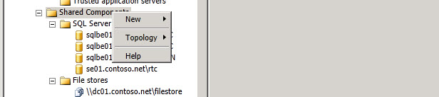
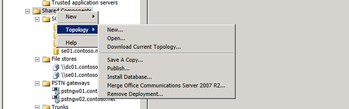

# Nodo dell'ambito dei componenti condivisiShared Components Scope Node
 
Fare clic con il pulsante destro del mouse sui **componenti condivisi** nell'albero della gerarchia del generatore di topologia per creare nuovi componenti condivisi o accedere alle opzioni del livello di topologia.You right click on **Shared Components** in the Topology Builder hierarchy tree to create new shared components or to access Topology level options.
  

  
Selezionare **nuovo** per creare un nuovo FileStore, un nuovo gateway IP/PSTN, un nuovo server di Office Web Apps, un nuovo archivio di SQL Server o un nuovo trunk.Select **New** to create a new filestore, a new IP/PSTN Gateway, a new Office Web Apps Server, a new SQL Server store, or a new Trunk.
  
> [!NOTE]
> Vedere gli argomenti della Guida per ognuna di queste opzioni.See the Help topics for each of these options. 
  

  
Si seleziona **topologia** per fare clic su opzioni per aprire un nuovo documento di topologia.You select **Topology** to click on options to open a New topology document. Aprire un documento esistente della topologia, scaricare la topologia corrente dall'Central Management store, salvare una copia del documento della topologia corrente, pubblicare il documento della topologia corrente, installare il database per creare le configurazioni di database attualmente configurate. Unire Office Communications Server 2007 R2 alla distribuzione corrente o rimuovere la distribuzione.Open an existing topology document, Download Current Topology from the Central Management store, Save a Copy of the current topology document, Publish the current topology document, Install Database to create the currently configured database configurations, Merge Office Communications Server 2007 R2 into the current deployment, or to Remove Deployment.
  

  

