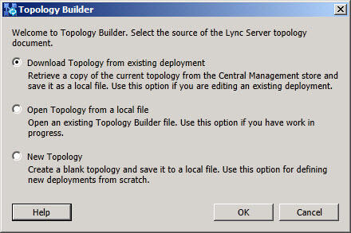

# Finestra di dialogo di avvio di Generatore di topologieTopology Builder Startup Dialog
 
Si avvia Generatore di topologie per configurare le proprietà e la configurazione della distribuzione.You start Topology Builder to configure the properties and configuration of your deployment. All'avvio, generatore di topologia Visualizza una finestra di dialogo che chiede quale sarà l'origine del documento di topologia.On startup, Topology Builder displays a dialog that asks what the source of the topology document will be. Si seleziona una delle tre opzioni seguenti:You select one of three options:
  
- **Scaricare la topologia dalla distribuzione esistente** Selezionare questa opzione se è stato eseguito Generatore di topologie e la topologia è stata pubblicata correttamente nel server di gestione centrale.**Download Topology from existing deployment** Select this option if you have run Topology Builder and have successfully published your topology to the Central Management Server. Questa opzione richiede e Scarica una copia locale della configurazione corrente, consentendo di modificare e configurare la distribuzione esistente.This option requests and downloads a local copy of the current configuration, allowing you to edit and configure the existing deployment.
    
- **Aprire la topologia da un file locale** Selezionare questa opzione se si sta configurando una distribuzione ma non è stata ancora pubblicata la configurazione.**Open Topology from a local file** Select this option if you are configuring a deployment but have not yet published the configuration. Questa opzione consente di salvare una copia locale del lavoro di configurazione in Generatore di topologie e di tornare in un secondo momento.This option allows you to save a local copy of the configuration work in Topology Builder and come back to it at a later time.
    
- **Nuova topologia** Selezionare questa opzione per iniziare la configurazione di un nuovo documento di topologia.**New Topology** Select this option to begin the configuration of a new topology document. Questa opzione consente di aprire un nuovo documento di topologia configurato in modo che soddisfi i requisiti per la distribuzione che verrà configurata.This option opens a new topology document that you configure to meet the requirements for the deployment that you will configure.
    

  
