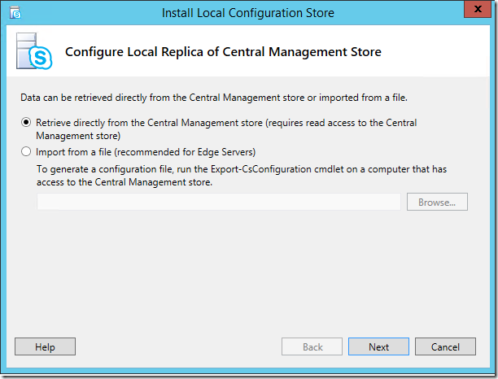

# <a name="disable-tls-1011-in-skype-for-business-server-2015"></a><span data-ttu-id="c24dc-103">Disabilitare TLS 1.0/1.1 in Skype for Business Server 2015</span><span class="sxs-lookup"><span data-stu-id="c24dc-103">Disable TLS 1.0/1.1 in Skype for Business Server 2015</span></span>

<span data-ttu-id="c24dc-104">Lo scopo di questo articolo è fornire le informazioni necessarie per prepararsi e implementare la disabilitazione di TLS 1,0 e 1,1 negli ambienti.</span><span class="sxs-lookup"><span data-stu-id="c24dc-104">The purpose of this article is to provide the necessary guidance for you to prepare for and implement disabling TLS 1.0 and 1.1 in your environments.</span></span> <span data-ttu-id="c24dc-105">Questo processo richiede una pianificazione e una preparazione estese.</span><span class="sxs-lookup"><span data-stu-id="c24dc-105">This process requires extensive planning and preparation.</span></span> <span data-ttu-id="c24dc-106">Leggere attentamente tutte le informazioni contenute in questo articolo quando si pianifica la disabilitazione di TLS 1,0 e 1,1 per la propria organizzazione.</span><span class="sxs-lookup"><span data-stu-id="c24dc-106">Please carefully review all of the information in this article as you make your plan to disable TLS 1.0 and 1.1 for your organization.</span></span> <span data-ttu-id="c24dc-107">Si noti che sono presenti molte dipendenze esterne e condizioni di connettività che possono essere influenzate dalla disattivazione di TLS 1.0/1.1, pertanto è garantita una pianificazione e un testing estensivi.</span><span class="sxs-lookup"><span data-stu-id="c24dc-107">Note that there are many external dependencies and connectivity conditions that could be impacted by disabling TLS 1.0/1.1, so extensive planning and testing is warranted.</span></span>

## <a name="in-this-article"></a><span data-ttu-id="c24dc-108">In questo articolo</span><span class="sxs-lookup"><span data-stu-id="c24dc-108">In this article</span></span>

- [<span data-ttu-id="c24dc-109">Sfondo e ambito</span><span class="sxs-lookup"><span data-stu-id="c24dc-109">Background and scope</span></span>](#background)
- [<span data-ttu-id="c24dc-110">Prerequisiti e processi</span><span class="sxs-lookup"><span data-stu-id="c24dc-110">Prerequisites and process</span></span>](#prerequisites-and-process)
- [<span data-ttu-id="c24dc-111">Scenari di distribuzione avanzata</span><span class="sxs-lookup"><span data-stu-id="c24dc-111">Advanced deployment scenarios</span></span>](#advanced-deployment-scenarios)

## <a name="background"></a><span data-ttu-id="c24dc-112">Sfondo</span><span class="sxs-lookup"><span data-stu-id="c24dc-112">Background</span></span>

<span data-ttu-id="c24dc-113">I driver principali per la fornitura di TLS 1,0 e 1,1 disabilitano il supporto per Skype for Business Server in locale sono i requisiti per gli standard di sicurezza di Payment Card Industry (PCI) e Federal Information Processing Standards.</span><span class="sxs-lookup"><span data-stu-id="c24dc-113">The primary drivers for providing TLS 1.0 and 1.1 disable support for Skype for Business Server On-Premises are Payment Card Industry (PCI) Security Standards Council and Federal Information Processing Standards requirements.</span></span> <span data-ttu-id="c24dc-114">Per ulteriori informazioni sui requisiti PCI è possibile trovare [qui](https://blog.pcisecuritystandards.org/are-you-ready-for-30-june-2018-sayin-goodbye-to-ssl-early-tls).</span><span class="sxs-lookup"><span data-stu-id="c24dc-114">More information for PCI requirements can be found [here](https://blog.pcisecuritystandards.org/are-you-ready-for-30-june-2018-sayin-goodbye-to-ssl-early-tls).</span></span>  <span data-ttu-id="c24dc-115">Microsoft non è in grado di fornire indicazioni sulla necessità o meno dell'organizzazione di aderire a questi o ad altri requisiti.</span><span class="sxs-lookup"><span data-stu-id="c24dc-115">Microsoft cannot provide guidance on whether or not your organization is required to adhere to these or other requirements.</span></span> <span data-ttu-id="c24dc-116">È necessario determinare se è necessario disabilitare TLS 1,0 e/o 1,1 negli ambienti.</span><span class="sxs-lookup"><span data-stu-id="c24dc-116">You must determine if it is required for you to disable TLS 1.0 and/or 1.1 in your environments.</span></span>

<span data-ttu-id="c24dc-117">Microsoft ha prodotto un white paper su TLS disponibile [qui](https://cloudblogs.microsoft.com/microsoftsecure/2017/06/20/tls-1-2-support-at-microsoft/), ed è consigliabile anche la lettura in background disponibile in questo [Blog di Exchange](https://blogs.technet.microsoft.com/exchange/2018/01/26/exchange-server-tls-guidance-part-1-getting-ready-for-tls-1-2/).</span><span class="sxs-lookup"><span data-stu-id="c24dc-117">Microsoft has produced a white paper on TLS available [here](https://cloudblogs.microsoft.com/microsoftsecure/2017/06/20/tls-1-2-support-at-microsoft/), and we also recommend the background reading available in this [Exchange blog](https://blogs.technet.microsoft.com/exchange/2018/01/26/exchange-server-tls-guidance-part-1-getting-ready-for-tls-1-2/).</span></span>

## <a name="supportability-scope"></a><span data-ttu-id="c24dc-118">Ambito di supporto</span><span class="sxs-lookup"><span data-stu-id="c24dc-118">Supportability Scope</span></span>

<span data-ttu-id="c24dc-119">L' *ambito* si riferisce ai limiti di supporto.</span><span class="sxs-lookup"><span data-stu-id="c24dc-119">*Scope* refers to supportability boundaries.</span></span> <span data-ttu-id="c24dc-120">*Pienamente testato e supportato* significa che sono stati completamente supportati e hanno testato la disabilitazione di TLS 1,0 e 1,1 per le versioni di prodotto elencate.</span><span class="sxs-lookup"><span data-stu-id="c24dc-120">*Fully tested and supported* means we fully support and have tested disabling of TLS 1.0 and 1.1 for the listed product versions.</span></span> <span data-ttu-id="c24dc-121">*Attualmente in fase di indagine* significa solo che; Stiamo attivamente studiando la possibilità di introdurre questi prodotti nell'ambito del supporto per la Disabilitazione TLS.</span><span class="sxs-lookup"><span data-stu-id="c24dc-121">*Currently being investigated* means just that; we are actively investigating bringing these products into scope for TLS disable support.</span></span> <span data-ttu-id="c24dc-122">*Fuori campo* significa che queste versioni di prodotto non supportano la disabilitazione di TLS 1,0 o 1,1 e non funzionano, con le eccezioni note.</span><span class="sxs-lookup"><span data-stu-id="c24dc-122">*Out of scope* means these product versions do not support disabling TLS 1.0 or 1.1 and will not work, with noted exceptions.</span></span>

### <a name="fully-tested-and-supported-servers"></a><span data-ttu-id="c24dc-123">Server completamente testati e supportati</span><span class="sxs-lookup"><span data-stu-id="c24dc-123">Fully tested and supported servers</span></span>

- <span data-ttu-id="c24dc-124">Skype for Business Server 2019 CU1 17.0.2046.123 (giugno 2019) o superiore</span><span class="sxs-lookup"><span data-stu-id="c24dc-124">Skype for Business Server 2019 CU1 17.0.2046.123 (June 2019) or higher</span></span>
- <span data-ttu-id="c24dc-125">Skype for Business Server 2015 CU9 6.0.9319.548 (maggio 2019) o versioni successive su Windows Server 2012 (con KB [3140245](https://support.microsoft.com/help/3140245/update-to-enable-tls-1-1-and-tls-1-2-as-a-default-secure-protocols-in) o aggiornamento sostitutivo), 2012 R2 o 2016.</span><span class="sxs-lookup"><span data-stu-id="c24dc-125">Skype for Business Server 2015 CU9 6.0.9319.548 (May 2019) or higher on Windows Server 2012 (with KB [3140245](https://support.microsoft.com/help/3140245/update-to-enable-tls-1-1-and-tls-1-2-as-a-default-secure-protocols-in) or superseding update), 2012 R2 or 2016.</span></span>
- <span data-ttu-id="c24dc-126">Aggiornamento sul posto di Skype for Business Server 2015, con CU9 6.0.9319.548 (maggio 2019) o versioni successive su Windows Server 2008 R2, 2012 (con KB [3140245](https://support.microsoft.com/help/3140245/update-to-enable-tls-1-1-and-tls-1-2-as-a-default-secure-protocols-in) o aggiornamento sostitutivo) oppure 2012 R2.</span><span class="sxs-lookup"><span data-stu-id="c24dc-126">In-place Upgraded Skype for Business Server 2015, with CU9 6.0.9319.548 (May 2019) or higher on Windows Server 2008 R2, 2012 (with KB [3140245](https://support.microsoft.com/help/3140245/update-to-enable-tls-1-1-and-tls-1-2-as-a-default-secure-protocols-in) or superseding update), or 2012 R2.</span></span>
- <span data-ttu-id="c24dc-127">Connettività di Exchange e Outlook Web App con Exchange Server 2010 SP3 RU19 o versione successiva, linee guida [qui](https://blogs.technet.microsoft.com/exchange/2018/01/26/exchange-server-tls-guidance-part-1-getting-ready-for-tls-1-2/)</span><span class="sxs-lookup"><span data-stu-id="c24dc-127">Exchange Connectivity and Outlook Web App with Exchange Server 2010 SP3 RU19 or higher, guidance [here](https://blogs.technet.microsoft.com/exchange/2018/01/26/exchange-server-tls-guidance-part-1-getting-ready-for-tls-1-2/)</span></span>
- <span data-ttu-id="c24dc-128">Survivable Branch Appliance (SBA) con Skype for Business Server 2015 CU6 HF2 o versione successiva (verificare con il fornitore che hanno inserito gli aggiornamenti corretti e che sono stati resi disponibili per il dispositivo)</span><span class="sxs-lookup"><span data-stu-id="c24dc-128">Survivable Branch Appliance (SBA) with Skype for Business Server 2015 CU6 HF2 or higher (confirm with your vendor that they packaged the appropriate updates and have been made available for your appliance)</span></span>
- <span data-ttu-id="c24dc-129">Survivable Branch Server (SBS) con Skype for Business Server 2015 CU6 HF2 o versione successiva</span><span class="sxs-lookup"><span data-stu-id="c24dc-129">Survivable Branch Server (SBS) with Skype for Business Server 2015 CU6 HF2 or higher</span></span>
- <span data-ttu-id="c24dc-130">**Solo ruolo** di Lync Server 2013 Edge, perché il ruolo Edge non ha una dipendenza da Windows Fabric 1,0.</span><span class="sxs-lookup"><span data-stu-id="c24dc-130">Lync Server 2013 **Edge Role Only**, this is because Edge role does not have a dependency on Windows Fabric 1.0.</span></span>

### <a name="fully-tested-and-supported-clients"></a><span data-ttu-id="c24dc-131">Client completamente testati e supportati</span><span class="sxs-lookup"><span data-stu-id="c24dc-131">Fully tested and supported clients</span></span>

- <span data-ttu-id="c24dc-132">Client desktop Lync 2013 (Skype for business), MSI e C2R, tra cui [15.0.5023.1000 di base o versione successiva](https://support.microsoft.com/help/4018334/april-3-2018-update-for-skype-for-business-2015-lync-2013-kb4018334)</span><span class="sxs-lookup"><span data-stu-id="c24dc-132">Lync 2013 (Skype for Business) Desktop Client, MSI and C2R, including Basic [15.0.5023.1000 or higher](https://support.microsoft.com/help/4018334/april-3-2018-update-for-skype-for-business-2015-lync-2013-kb4018334)</span></span>
- <span data-ttu-id="c24dc-133">Client desktop Skype for business 2016, MSI [16.0.4678.1000 o versione successiva](https://support.microsoft.com/help/4018323/april-3-2018-update-for-skype-for-business-2016-kb4018323), incluso Basic</span><span class="sxs-lookup"><span data-stu-id="c24dc-133">Skype for Business 2016 Desktop Client, MSI [16.0.4678.1000 or higher](https://support.microsoft.com/help/4018323/april-3-2018-update-for-skype-for-business-2016-kb4018323), including Basic</span></span>
- <span data-ttu-id="c24dc-134">Skype for business 2016 fare clic su Esegui per richiedere gli aggiornamenti di [aprile 2018](https://docs.microsoft.com/officeupdates/release-notes-office365-proplus) :</span><span class="sxs-lookup"><span data-stu-id="c24dc-134">Skype for Business 2016 Click to Run Require the [April 2018](https://docs.microsoft.com/officeupdates/release-notes-office365-proplus) Updates:</span></span> 
    - <span data-ttu-id="c24dc-135">Mensili e Semi-Annual mirati, 16 \. 0 \. 9126 \. 2152 o versioni successive</span><span class="sxs-lookup"><span data-stu-id="c24dc-135">Monthly and Semi-Annual Targeted, 16\.0\.9126\.2152 or higher</span></span>
    - <span data-ttu-id="c24dc-136">Semi-Annual e Deferred Channel, 16 \. 0 \. 8431 \. 2242 o versioni successive</span><span class="sxs-lookup"><span data-stu-id="c24dc-136">Semi-Annual and Deferred Channel, 16\.0\.8431\.2242 or higher</span></span>
- <span data-ttu-id="c24dc-137">Skype for business su Mac 16,15 o versione successiva</span><span class="sxs-lookup"><span data-stu-id="c24dc-137">Skype for Business on Mac 16.15 or higher</span></span>
- <span data-ttu-id="c24dc-138">Skype for business per iOS e Android 6,19 o versione successiva</span><span class="sxs-lookup"><span data-stu-id="c24dc-138">Skype for Business for iOS and Android 6.19 or higher</span></span>
- <span data-ttu-id="c24dc-139">Microsoft teams Rooms (precedentemente noto come Skype room System V2 SRS v2) 4.0.64.0 (2018 dicembre) o versioni successive</span><span class="sxs-lookup"><span data-stu-id="c24dc-139">Microsoft Teams Rooms (previously known as Skype Room System V2 SRS V2) 4.0.64.0 (December 2018) or higher</span></span>
- <span data-ttu-id="c24dc-140">Aggiornamento dell'hub di superficie per Team Edition basato su KB4499162 (maggio 2019, Build 15063,1835 OS) o superiore</span><span class="sxs-lookup"><span data-stu-id="c24dc-140">Surface Hub update for Team edition based on KB4499162 (May 2019, OS Build 15063.1835) or higher</span></span>
- <span data-ttu-id="c24dc-141">Skype Web App 2015 CU6 HF2 o versioni successive (navi con Server)</span><span class="sxs-lookup"><span data-stu-id="c24dc-141">Skype Web App 2015 CU6 HF2 or higher (ships with Server)</span></span>

### <a name="currently-being-investigated"></a><span data-ttu-id="c24dc-142">Attualmente in fase di analisi</span><span class="sxs-lookup"><span data-stu-id="c24dc-142">Currently being investigated</span></span>

- <span data-ttu-id="c24dc-143">Call Quality Dashboard (nuova installazione dopo che TLS 1,0, 1,1 sono stati disabilitati, vedere di seguito) \*</span><span class="sxs-lookup"><span data-stu-id="c24dc-143">Call Quality Dashboard (new install after TLS 1.0, 1.1 have been disabled, see below)\*</span></span>
 
### <a name="out-of-scope"></a><span data-ttu-id="c24dc-144">Esclusioni</span><span class="sxs-lookup"><span data-stu-id="c24dc-144">Out of scope</span></span>

<span data-ttu-id="c24dc-145">Eccetto dove indicato, i prodotti seguenti non sono nell'ambito del supporto per la disabilitazione di TLS 1.0/1.1 e non funzioneranno in un ambiente in cui TLS 1,0 e 1,1 sono stati disabilitati.</span><span class="sxs-lookup"><span data-stu-id="c24dc-145">Except where noted, the following products are not in scope for TLS 1.0/1.1 disable support and will not function in an environment where TLS 1.0 and 1.1 have been disabled.</span></span> <span data-ttu-id="c24dc-146">Cosa significa: se si utilizzano ancora server o client fuori ambito, è necessario aggiornarli o rimuoverli se è necessario disabilitare TLS 1.0/1.1 in qualsiasi punto della distribuzione locale di Skype for Business Server.</span><span class="sxs-lookup"><span data-stu-id="c24dc-146">What this means: if you still utilize out-of-scope servers or clients, you must update or remove these if you need to disable TLS 1.0/1.1 anywhere in your Skype for Business Server on-premises deployment.</span></span>

- <span data-ttu-id="c24dc-147">Lync Server 2013</span><span class="sxs-lookup"><span data-stu-id="c24dc-147">Lync Server 2013</span></span>
- <span data-ttu-id="c24dc-148">Lync Server 2010</span><span class="sxs-lookup"><span data-stu-id="c24dc-148">Lync Server 2010</span></span>
- <span data-ttu-id="c24dc-149">Windows Server 2008 o inferiore</span><span class="sxs-lookup"><span data-stu-id="c24dc-149">Windows Server 2008 or lower</span></span>
- <span data-ttu-id="c24dc-150">Lync per Mac 2011</span><span class="sxs-lookup"><span data-stu-id="c24dc-150">Lync for Mac 2011</span></span>
- <span data-ttu-id="c24dc-151">Lync 2013 per dispositivi mobili-iOS, iPad, Android o Windows Phone</span><span class="sxs-lookup"><span data-stu-id="c24dc-151">Lync 2013 for Mobile - iOS, iPad, Android or Windows Phone</span></span>
- <span data-ttu-id="c24dc-152">Lync "MX" client Windows Store</span><span class="sxs-lookup"><span data-stu-id="c24dc-152">Lync "MX" Windows Store client</span></span>
- <span data-ttu-id="c24dc-153">Lync room System (aka</span><span class="sxs-lookup"><span data-stu-id="c24dc-153">Lync Room System (a.k.a.</span></span> <span data-ttu-id="c24dc-154">SRSv1).</span><span class="sxs-lookup"><span data-stu-id="c24dc-154">SRSv1).</span></span> <span data-ttu-id="c24dc-155">LRS ha raggiunto la fine del supporto il 9 ottobre 2018 e non verrà aggiornato per supportare TLS 1,2.</span><span class="sxs-lookup"><span data-stu-id="c24dc-155">LRS reached end of support on October 9, 2018 and will not be updated to support TLS 1.2.</span></span>
- <span data-ttu-id="c24dc-156">Tutti i client Lync 2010</span><span class="sxs-lookup"><span data-stu-id="c24dc-156">All Lync 2010 clients</span></span>
- <span data-ttu-id="c24dc-157">Lync Phone Edition-informazioni aggiornate [qui](https://techcommunity.microsoft.com/t5/Skype-for-Business-Blog/Certified-Skype-for-Business-Online-Phones-and-what-this-means/ba-p/120035).</span><span class="sxs-lookup"><span data-stu-id="c24dc-157">Lync Phone Edition - updated guidance [here](https://techcommunity.microsoft.com/t5/Skype-for-Business-Blog/Certified-Skype-for-Business-Online-Phones-and-what-this-means/ba-p/120035).</span></span>
- <span data-ttu-id="c24dc-158">2013 basato Survivable Branch Appliance (SBA) o Survivable Branch Server (SBS)</span><span class="sxs-lookup"><span data-stu-id="c24dc-158">2013 based Survivable Branch Appliance (SBA) or Survivable Branch Server (SBS)</span></span>
- <span data-ttu-id="c24dc-159">Cloud Connector Edition (CCE)</span><span class="sxs-lookup"><span data-stu-id="c24dc-159">Cloud Connector Edition (CCE)</span></span>
- <span data-ttu-id="c24dc-160">Skype for business per Windows Phone</span><span class="sxs-lookup"><span data-stu-id="c24dc-160">Skype for Business for Windows Phone</span></span>

### <a name="exceptions"></a><span data-ttu-id="c24dc-161">Eccezioni</span><span class="sxs-lookup"><span data-stu-id="c24dc-161">Exceptions</span></span>

#### <a name="lync-server-2013"></a><span data-ttu-id="c24dc-162">Lync Server 2013</span><span class="sxs-lookup"><span data-stu-id="c24dc-162">Lync Server 2013</span></span>

<span data-ttu-id="c24dc-163">Lync Server 2013 assume una dipendenza da Windows Fabric versione 1,0.</span><span class="sxs-lookup"><span data-stu-id="c24dc-163">Lync Server 2013 takes a dependency on Windows Fabric version 1.0.</span></span>  <span data-ttu-id="c24dc-164">In fase di progettazione per Lync Server 2013, Windows Fabric 1,0 è stato scelto per la nuova architettura convincente e distribuita per fornire la replica, la disponibilità elevata e la tolleranza di errore.</span><span class="sxs-lookup"><span data-stu-id="c24dc-164">In the design phase for Lync Server 2013, Windows Fabric 1.0 was chosen for its compelling and new distributed architecture to provide replication, high availability, and fault tolerance.</span></span>  <span data-ttu-id="c24dc-165">Nel corso del tempo, sia Skype for Business Server che Windows Fabric hanno notevolmente migliorato questa architettura comune con una riprogettazione significativa nelle versioni successive.</span><span class="sxs-lookup"><span data-stu-id="c24dc-165">Over time, both Skype for Business Server and Windows Fabric have greatly improved this joint architecture with significant re-design in subsequent versions.</span></span>  <span data-ttu-id="c24dc-166">L'attuale server Skype for business 2015 utilizza Windows Fabric 3,0, ad esempio.</span><span class="sxs-lookup"><span data-stu-id="c24dc-166">Current Skype for Business 2015 Server uses Windows Fabric 3.0, for example.</span></span>

<span data-ttu-id="c24dc-167">Purtroppo, Windows Fabric 1,0 non **supporta TLS 1,2.  Tuttavia, verrà aggiornato Lync Server 2013 per l'utilizzo con TLS 1,2**.</span><span class="sxs-lookup"><span data-stu-id="c24dc-167">Unfortunately, Windows Fabric 1.0 **does not support TLS 1.2.  However, we will be updating Lync Server 2013 to work with TLS 1.2**.</span></span> <span data-ttu-id="c24dc-168">Questo verrà nel prossimo aggiornamento cumulativo per Lync Server 2013.</span><span class="sxs-lookup"><span data-stu-id="c24dc-168">This will be coming in the next Cumulative Update for Lync Server 2013.</span></span>  <span data-ttu-id="c24dc-169">Il supporto di TLS 1,2 viene fornito per consentire la coesistenza, la migrazione, la Federazione e gli scenari ibridi.</span><span class="sxs-lookup"><span data-stu-id="c24dc-169">We're providing TLS 1.2 support to enable co-existence, migration, federation, and hybrid scenarios.</span></span>

<span data-ttu-id="c24dc-170">Se l'organizzazione è necessaria per disabilitare TLS 1,0 e 1,1 e attualmente si utilizza Lync Server 2013, è consigliabile iniziare il processo di pianificazione, con la possibilità di eseguire l'aggiornamento sul posto o la migrazione affiancata (nuovi pool, spostare gli utenti) su Skype for Business Server 2015 o versione successiva.</span><span class="sxs-lookup"><span data-stu-id="c24dc-170">If your organization is required to disable TLS 1.0 and 1.1, and you currently use Lync Server 2013, we recommend you begin your planning process, with the possibility you may have to In-place upgrade or Side-by-Side migrate (new pools, move users) to Skype for Business Server 2015 or higher.</span></span>  <span data-ttu-id="c24dc-171">In alternativa, si consiglia di accelerare la migrazione a Skype for business online.</span><span class="sxs-lookup"><span data-stu-id="c24dc-171">Or you may want to accelerate migration to Skype for Business Online.</span></span>

#### <a name="call-quality-dashboard"></a><span data-ttu-id="c24dc-172">Dashboard Qualità della chiamata</span><span class="sxs-lookup"><span data-stu-id="c24dc-172">Call Quality Dashboard</span></span>

<span data-ttu-id="c24dc-173">Il dashboard per la qualità delle chiamate in locale è attualmente dipendente da TLS 1,0 durante la nuova installazione (prima installazione negli ambienti locali).</span><span class="sxs-lookup"><span data-stu-id="c24dc-173">On-Premises Call Quality Dashboard currently has a dependency on TLS 1.0 during new install (first time installing into your On-Premises environments).</span></span>  <span data-ttu-id="c24dc-174">Attualmente stiamo indagando su questo problema e intendiamo rilasciarne una soluzione nel prossimo futuro.</span><span class="sxs-lookup"><span data-stu-id="c24dc-174">We are currently investigating this issue and plan to release a fix in the near future.</span></span>  <span data-ttu-id="c24dc-175">Se si prevede di installare CQD e anche di disabilitare TLS 1,0, è consigliabile completare prima l'installazione di CQD e quindi procedere con la disabilitazione di TLS 1,0.</span><span class="sxs-lookup"><span data-stu-id="c24dc-175">If you are planning to install CQD and also disable TLS 1.0, we recommend that you complete CQD installation first, and then proceed with TLS 1.0 disabling.</span></span>

#### <a name="skype-for-business-sdn-manager"></a><span data-ttu-id="c24dc-176">Gestione di Skype for business SDN</span><span class="sxs-lookup"><span data-stu-id="c24dc-176">Skype for Business SDN Manager</span></span>

<span data-ttu-id="c24dc-177">Skype for business SDN Manager using SQL a database ha una dipendenza da TLS 1,0 durante la nuova installazione.</span><span class="sxs-lookup"><span data-stu-id="c24dc-177">Skype for Business SDN Manager using SQL a database has a dependency on TLS 1.0 during new install.</span></span> <span data-ttu-id="c24dc-178">Se si prevede di installare Skype for business SDN Manager tramite database SQL a e di disabilitare TLS 1,0, è consigliabile completare prima Skype for business SDN Manager e quindi procedere con la disabilitazione di TLS 1,0.</span><span class="sxs-lookup"><span data-stu-id="c24dc-178">If you are planning to install Skype for Business SDN Manager using SQL a database and also disable TLS 1.0, we recommend that you complete Skype for Business SDN Manager first, and then proceed with TLS 1.0 disabling.</span></span> <span data-ttu-id="c24dc-179">Nel caso in cui TLS 1,0 fosse disabilitato prima dell'installazione, è necessario abilitare temporaneamente TLS 1,0 nel server back-end di SQL Server che verrà utilizzato per ospitare il database SQL di Skype for business SDN Manager.</span><span class="sxs-lookup"><span data-stu-id="c24dc-179">In case TLS 1.0 was disabled prior to installation, you should temporarily enabled TLS 1.0 back in SQL Server backend server that will be used to host Skype for Business SDN Manager SQL database.</span></span>

#### <a name="third-party-devices"></a><span data-ttu-id="c24dc-180">Dispositivi di terze parti</span><span class="sxs-lookup"><span data-stu-id="c24dc-180">Third-party devices</span></span>

<span data-ttu-id="c24dc-181">Nei dispositivi di terze parti, ad esempio i telefoni 3PIP, le videoconferenze, i proxy inversi e i servizi di bilanciamento del carico, accertarsi di convalidare la supportabilità di TLS 1,2, testare attentamente e contattare il fornitore, se necessario.</span><span class="sxs-lookup"><span data-stu-id="c24dc-181">On third-party devices such as 3PIP phones, Video conferencing, Reverse Proxies and Load Balancers, be sure to validate TLS 1.2 supportability, test carefully, and contact the vendor if needed.</span></span>

### <a name="federation-considerations-when-disabling-tls-1011-on-edge-servers"></a><span data-ttu-id="c24dc-182">Considerazioni sulla Federazione per la disabilitazione di TLS 1.0/1.1 nei server perimetrali</span><span class="sxs-lookup"><span data-stu-id="c24dc-182">Federation considerations when disabling TLS 1.0/1.1 on Edge servers</span></span>

<span data-ttu-id="c24dc-183">È necessario pianificare attentamente e valutare l'impatto della disabilitazione di TLS 1.0/1.1 nei server perimetrali.</span><span class="sxs-lookup"><span data-stu-id="c24dc-183">You must carefully plan for and consider the impact of disabling TLS 1.0/1.1 on your Edge servers.</span></span>  <span data-ttu-id="c24dc-184">Dopo la disabilitazione di TLS 1,0 e 1,1, è possibile che altre organizzazioni non siano più in grado di eseguire la Federazione con l'organizzazione.</span><span class="sxs-lookup"><span data-stu-id="c24dc-184">Once TLS 1.0 and 1.1 are disabled, you may find that other organizations are no longer be able to federate with your organization.</span></span>

<span data-ttu-id="c24dc-185">È possibile scegliere di mantenere TLS 1.0/1.1 abilitato sui server perimetrali per mantenere la compatibilità con le versioni precedenti dei sistemi esterni (questo 2015, Lync 2013) o versioni precedenti (2010).</span><span class="sxs-lookup"><span data-stu-id="c24dc-185">You may opt to keep TLS 1.0/1.1 enabled on your Edge servers to maintain backward compatibility with non-patched (SfB 2015, Lync 2013) or older (2010) external systems.</span></span>

<span data-ttu-id="c24dc-186">Microsoft non è in grado di fornire consigli o suggerimenti su se la rete perimetrale (o qualsiasi rete) rientra in standard PCI; che deve essere determinata dalla singola società.</span><span class="sxs-lookup"><span data-stu-id="c24dc-186">Microsoft cannot provide advice or recommendations on whether or not your Edge network (or any network) falls under PCI standard; that must be determined by the individual company.</span></span>

<span data-ttu-id="c24dc-187">Skype for business online è in grado di TLS 1,2 oggi, quindi non è previsto alcun impatto su ibrido/Federazione con online.</span><span class="sxs-lookup"><span data-stu-id="c24dc-187">Skype for Business Online is capable of TLS 1.2 today, so no impact to Hybrid/Federation with Online is expected.</span></span>

<span data-ttu-id="c24dc-188">PIC (connettività di messaggistica istantanea pubblica) per Skype Consumer Service: non si prevede che la disabilitazione di TLS 1.0/1.1 influenzi la [connettività Skype](../../deploy/deploy-skype-connectivity.md); I gateway Microsoft PIC sono già in grado di disporre di TLS 1,2.</span><span class="sxs-lookup"><span data-stu-id="c24dc-188">PIC (Public IM Connectivity) to Skype Consumer service: We do not expect disabling TLS 1.0/1.1 to impact [Skype Connectivity](../../deploy/deploy-skype-connectivity.md); Microsoft PIC Gateways are already TLS 1.2 capable.</span></span>

## <a name="prerequisites-and-process"></a><span data-ttu-id="c24dc-189">Prerequisiti e processi</span><span class="sxs-lookup"><span data-stu-id="c24dc-189">Prerequisites and process</span></span>

<span data-ttu-id="c24dc-190">Eccetto se sopra indicato, una volta che i server TLS 1,0 e 1,1 sono disabilitati, i client e i dispositivi possono funzionare più a lungo.</span><span class="sxs-lookup"><span data-stu-id="c24dc-190">Except where noted above, once TLS 1.0 and 1.1 are disabled out-of-scope servers, clients and devices will longer function properly, or at all.</span></span> <span data-ttu-id="c24dc-191">Ciò può significare che è necessario sospendere e attendere l'aggiornamento delle indicazioni di Microsoft.</span><span class="sxs-lookup"><span data-stu-id="c24dc-191">This may mean you need to pause and wait for updated guidance from Microsoft.</span></span> <span data-ttu-id="c24dc-192">Una volta che si è soddisfatti di soddisfare tutti i requisiti e di avere un piano per risolvere gli spazi vuoti, procedere.</span><span class="sxs-lookup"><span data-stu-id="c24dc-192">Once you are satisfied that you meet all requirements and have a plan to address gaps, proceed.</span></span>

<span data-ttu-id="c24dc-193">Ad alto livello, mentre Skype for Business Server 2019 è pronto per la procedura di installazione, Skype for Business Server 2015 richiede l'installazione di CU9, l'applicazione di aggiornamenti prerequisiti a .NET e SQL, la distribuzione delle chiavi del registro di sistema prerequisite e infine un round separato di aggiornamenti di configurazione dei sistemi operativi (ovvero la disabilitazione di TLS 1,0 e 1,1 tramite importazione file di registro</span><span class="sxs-lookup"><span data-stu-id="c24dc-193">At a high level, while Skype for Business Server 2019 is ready for procedure at install, Skype for Business Server 2015 will require that you install CU9, applying pre-requisite updates to .NET and SQL, deploying prerequisite registry keys, and finally a separate round of OS configuration updates (i.e. disabling TLS 1.0 and 1.1 via registry file import).</span></span> <span data-ttu-id="c24dc-194">È estremamente importante completare l'installazione di tutti i prerequisiti, tra cui Skype for Business Server 2015 CU6 HF2, prima di disabilitare TLS 1,0 e 1,1 su qualsiasi server dell'ambiente.</span><span class="sxs-lookup"><span data-stu-id="c24dc-194">It is critically important that you complete installation of all prerequisites, including Skype for Business Server 2015 CU6 HF2, prior to disabling TLS 1.0 and 1.1 on any server in your environment.</span></span> <span data-ttu-id="c24dc-195">Ogni server Skype for business, inclusi i ruoli Edge e SQL, richiede gli aggiornamenti.</span><span class="sxs-lookup"><span data-stu-id="c24dc-195">Every Skype for Business server, including Edge role and SQL Backends, requires the updates.</span></span> <span data-ttu-id="c24dc-196">Verificare inoltre che tutti i client supportati (nell'ambito) siano stati aggiornati alle versioni minime necessarie.</span><span class="sxs-lookup"><span data-stu-id="c24dc-196">Also ensure that all supported (in-scope) clients have been updated to the required minimum versions.</span></span> <span data-ttu-id="c24dc-197">Non dimenticare di aggiornare anche le workstation di gestione.</span><span class="sxs-lookup"><span data-stu-id="c24dc-197">Don’t forget to update management workstations as well.</span></span>

<span data-ttu-id="c24dc-198">Per l'aggiornamento dei server Skype for business, è necessario seguire l'ordine usuale di operazioni "all'interno".</span><span class="sxs-lookup"><span data-stu-id="c24dc-198">We want to follow the usual order of operations of "inside out" for upgrading Skype for Business servers.</span></span> <span data-ttu-id="c24dc-199">Trattare i pool di server Director, la chat persistente e i pool associati nello stesso modo in cui si farebbe normalmente.</span><span class="sxs-lookup"><span data-stu-id="c24dc-199">Treat Director pools, Persistent chat, and Paired Pools in the same manner you normally would.</span></span> <span data-ttu-id="c24dc-200">L'ordine e i metodi per l'aggiornamento sono descritti [qui](topology.md) e [qui](https://support.microsoft.com/help/3061064/updates-for-skype-for-business-server-2015).</span><span class="sxs-lookup"><span data-stu-id="c24dc-200">Order and methods for upgrade are covered [here](topology.md) and [here](https://support.microsoft.com/help/3061064/updates-for-skype-for-business-server-2015).</span></span>

### <a name="high-level-process"></a><span data-ttu-id="c24dc-201">Processo di alto livello</span><span class="sxs-lookup"><span data-stu-id="c24dc-201">High-level process</span></span>

1. <span data-ttu-id="c24dc-202">Testare tutti i passaggi del Lab prima di configurare i server di produzione.</span><span class="sxs-lookup"><span data-stu-id="c24dc-202">Test all steps in your lab prior to configuring production servers.</span></span>
2. <span data-ttu-id="c24dc-203">Eseguire il backup e la conservazione di una copia del registro di sistema esportato su ogni singolo server da aggiornare.</span><span class="sxs-lookup"><span data-stu-id="c24dc-203">Back up and preserve a copy of exported registry on each and every individual server to be updated.</span></span> <span data-ttu-id="c24dc-204">Non è possibile condividere i registri tra i server; contengono chiavi esclusive basate su computer.</span><span class="sxs-lookup"><span data-stu-id="c24dc-204">You cannot share registries between servers; they contain unique machine-based keys.</span></span>
3. <span data-ttu-id="c24dc-205">Aggiornare tutti i server Skype for business 2015 a CU9 o versione successiva.</span><span class="sxs-lookup"><span data-stu-id="c24dc-205">Upgrade all Skype for Business 2015 servers to CU9 or higher.</span></span> <span data-ttu-id="c24dc-206">Per Skype for Business Server 2019, eseguire l'aggiornamento a CU1 o versione successiva.</span><span class="sxs-lookup"><span data-stu-id="c24dc-206">For Skype for Business Server 2019, upgrade to CU1 or higher.</span></span>
4. <span data-ttu-id="c24dc-207">Installare tutti i prerequisiti in tutti i server.</span><span class="sxs-lookup"><span data-stu-id="c24dc-207">Install all prerequisites to all servers.</span></span>
5. <span data-ttu-id="c24dc-208">Distribuire le chiavi del registro di sistema prerequisite.</span><span class="sxs-lookup"><span data-stu-id="c24dc-208">Deploy prerequisite registry keys.</span></span>
6. <span data-ttu-id="c24dc-209">Verificare che tutti i client nell'ambito vengano aggiornati.</span><span class="sxs-lookup"><span data-stu-id="c24dc-209">Ensure that all in-scope clients are updated.</span></span>
7. <span data-ttu-id="c24dc-210">Disabilitare TLS 1,0 e 1,1 tramite l'importazione del registro di sistema.</span><span class="sxs-lookup"><span data-stu-id="c24dc-210">Disable TLS 1.0 and 1.1 via registry import.</span></span>
8. <span data-ttu-id="c24dc-211">Verificare che i carichi di lavoro funzionino come previsto.</span><span class="sxs-lookup"><span data-stu-id="c24dc-211">Validate that workloads are functioning as expected.</span></span>
    - <span data-ttu-id="c24dc-212">Se vengono rilevati problemi, risolverli o risolvere il problema, oppure</span><span class="sxs-lookup"><span data-stu-id="c24dc-212">If problems are encountered, troubleshoot and resolve, or</span></span>
    - <span data-ttu-id="c24dc-213">Ripristinare il registro di sistema dal passaggio 2 per riattivare TLS 1,0 e 1,1</span><span class="sxs-lookup"><span data-stu-id="c24dc-213">Restore registry from step 2 to re-enable TLS 1.0 and 1.1</span></span>
9. <span data-ttu-id="c24dc-214">Verificare che sia in uso solo TLS 1,2.</span><span class="sxs-lookup"><span data-stu-id="c24dc-214">Validate that only TLS 1.2 is being used.</span></span>

### <a name="install-prerequisites-to-all-servers"></a><span data-ttu-id="c24dc-215">Installare i prerequisiti in tutti i server</span><span class="sxs-lookup"><span data-stu-id="c24dc-215">Install prerequisites to all servers</span></span>

<span data-ttu-id="c24dc-216">È necessario un aggiornamento estensivo delle dipendenze prima di iniziare a disabilitare TLS 1,0 e 1,1 a livello del sistema operativo nelle distribuzioni di Skype for Business Server 2015.</span><span class="sxs-lookup"><span data-stu-id="c24dc-216">Extensive dependency updating is required before you begin to disable TLS 1.0 and 1.1 at the operating system level in your Skype for Business Server 2015 deployments.</span></span> <span data-ttu-id="c24dc-217">Di seguito sono riportate le versioni minime che supportano TLS 1,2.</span><span class="sxs-lookup"><span data-stu-id="c24dc-217">The following are the minimum versions that can support TLS 1.2.</span></span> <span data-ttu-id="c24dc-218">Distribuire tutti gli aggiornamenti prerequisiti in ogni server Skype for business nel proprio ambiente prima di iniziare la disabilitazione di TLS 1,0 e 1,1.</span><span class="sxs-lookup"><span data-stu-id="c24dc-218">Deploy all prerequisite updates across every Skype for Business server in your environment before you begin disabling TLS 1.0 and 1.1.</span></span>

- <span data-ttu-id="c24dc-219">Skype for Business Server 2015 CU9 6.0.9319.548 (maggio 2019) o superiore</span><span class="sxs-lookup"><span data-stu-id="c24dc-219">Skype for Business Server 2015 CU9 6.0.9319.548 (May 2019) or higher</span></span>
- <span data-ttu-id="c24dc-220">[.NET Framework 4,7](https://www.microsoft.com/download/details.aspx?id=55167) o versione successiva con schusestrongcrypto consente abilitato nel registro di sistema (disponibile di seguito)</span><span class="sxs-lookup"><span data-stu-id="c24dc-220">[.NET Framework 4.7](https://www.microsoft.com/download/details.aspx?id=55167) or higher with SchUseStrongCrypto enabled in the registry (provided below)</span></span>
- <span data-ttu-id="c24dc-221">SQL deve essere aggiornato su tutti i server e i backend di Skype for business 2015.</span><span class="sxs-lookup"><span data-stu-id="c24dc-221">SQL must be updated on all Skype for Business 2015 servers and backends.</span></span> <span data-ttu-id="c24dc-222">Aggiornare le backends SQL del pool Enterprise Edition in primo luogo, quindi le rispettive FEs.</span><span class="sxs-lookup"><span data-stu-id="c24dc-222">Update Enterprise Edition Pool SQL Backends first, then their respective FEs.</span></span> 
    - <span data-ttu-id="c24dc-223">[SQL server 2014 SP1 + CU5](https://support.microsoft.com/help/3130926)o versione successiva/sql Server 2012 SP2 + CU16 o versione successiva/ [SQL Server 2014 RTM + CU12](https://support.microsoft.com/help/3130923/cumulative-update-12-for-sql-server-2014)o superiore/SQL Server 2014 SP2</span><span class="sxs-lookup"><span data-stu-id="c24dc-223">[SQL Server 2014 SP1 + CU5](https://support.microsoft.com/help/3130926), or higher / SQL Server 2012 SP2 + CU16 or higher / [SQL Server 2014 RTM + CU12](https://support.microsoft.com/help/3130923/cumulative-update-12-for-sql-server-2014), or higher / SQL Server 2014 SP2</span></span>
     - [<span data-ttu-id="c24dc-224">SQL Server Native Client per SQL Server 2012</span><span class="sxs-lookup"><span data-stu-id="c24dc-224">SQL Server Native Client for SQL Server 2012</span></span>](https://www.microsoft.com/download/details.aspx?id=50402)
     - <span data-ttu-id="c24dc-225">[Microsoft ODBC driver 11 per SQL Server](https://www.microsoft.com/download/details.aspx?id=36434)o versione successiva</span><span class="sxs-lookup"><span data-stu-id="c24dc-225">[Microsoft ODBC Driver 11 for SQL Server](https://www.microsoft.com/download/details.aspx?id=36434), or higher</span></span>
     - [<span data-ttu-id="c24dc-226">Oggetti di gestione condivisi per SQL Server 2014 SP2</span><span class="sxs-lookup"><span data-stu-id="c24dc-226">Shared Management Objects for SQL Server 2014 SP2</span></span>](https://www.microsoft.com/download/details.aspx?id=53164)
     - [<span data-ttu-id="c24dc-227">SQLSysClrTypes per SQL Server 2014 SP2</span><span class="sxs-lookup"><span data-stu-id="c24dc-227">SQLSysClrTypes for SQL server 2014 SP2</span></span>](https://www.microsoft.com/download/details.aspx?id=42295)

### <a name="basic-steps-to-install-pre-requisites-in-recommended-order-of-operations"></a><span data-ttu-id="c24dc-228">Passaggi di base per l'installazione dei prerequisiti, in ordine di operazioni consigliato</span><span class="sxs-lookup"><span data-stu-id="c24dc-228">Basic steps to install pre-requisites, in recommended order of operations</span></span>

1. <span data-ttu-id="c24dc-229">Installare l'aggiornamento di CU9 per Skype for Business Server su tutti i server.</span><span class="sxs-lookup"><span data-stu-id="c24dc-229">Install the Skype for Business Server CU9 update to all servers.</span></span> 
    1. <span data-ttu-id="c24dc-230">Installare l'aggiornamento ai componenti utilizzando l'Updater.</span><span class="sxs-lookup"><span data-stu-id="c24dc-230">Install the update to components using the updater.</span></span>
    2. <span data-ttu-id="c24dc-231">Aggiornare i database in base alle procedure documentate.</span><span class="sxs-lookup"><span data-stu-id="c24dc-231">Update databases according to documented procedures.</span></span> <span data-ttu-id="c24dc-232">Per Skype for Business Server 2015, vedere KB [3061064](https://support.microsoft.com/help/3061064/updates-for-skype-for-business-server-2015).</span><span class="sxs-lookup"><span data-stu-id="c24dc-232">For Skype for Business Server 2015, see KB [3061064](https://support.microsoft.com/help/3061064/updates-for-skype-for-business-server-2015).</span></span>
    3. <span data-ttu-id="c24dc-233">Convalidare la funzionalità del prodotto nella distribuzione prima di procedere con altre modifiche.</span><span class="sxs-lookup"><span data-stu-id="c24dc-233">Validate product functionality in the deployment prior to moving forward with any other changes.</span></span>
2. <span data-ttu-id="c24dc-234">Scaricare il programma di installazione di .NET 4,7 offline.</span><span class="sxs-lookup"><span data-stu-id="c24dc-234">Download .NET 4.7 Offline Installer.</span></span> 
    1. <span data-ttu-id="c24dc-235">Riferimento [https://www.microsoft.com/download/details.aspx?id=55167](https://www.microsoft.com/download/details.aspx?id=55167)</span><span class="sxs-lookup"><span data-stu-id="c24dc-235">Reference: [https://www.microsoft.com/download/details.aspx?id=55167](https://www.microsoft.com/download/details.aspx?id=55167)</span></span>
    2. <span data-ttu-id="c24dc-236">Assicurarsi che i servizi di Skype for Business Server 2015 siano stati arrestati nel front end server.</span><span class="sxs-lookup"><span data-stu-id="c24dc-236">Ensure that Skype for Business Server 2015 services are stopped on the Front End server.</span></span>
    3. <span data-ttu-id="c24dc-237">Riferimento [https://support.microsoft.com/help/3061064/updates-for-skype-for-business-server-2015](https://support.microsoft.com/help/3061064/updates-for-skype-for-business-server-2015)</span><span class="sxs-lookup"><span data-stu-id="c24dc-237">Reference: [https://support.microsoft.com/help/3061064/updates-for-skype-for-business-server-2015](https://support.microsoft.com/help/3061064/updates-for-skype-for-business-server-2015)</span></span>
    4. <span data-ttu-id="c24dc-238">Ex (Standard Edition): ```Stop-CsWindowsService```</span><span class="sxs-lookup"><span data-stu-id="c24dc-238">Ex (Standard Edition): ```Stop-CsWindowsService```</span></span>
    5. <span data-ttu-id="c24dc-239">Ex (Enterprise Edition): ```Invoke-CsComputerFailover```</span><span class="sxs-lookup"><span data-stu-id="c24dc-239">Ex (Enterprise Edition): ```Invoke-CsComputerFailover```</span></span>
    6. <span data-ttu-id="c24dc-240">Eseguire il pacchetto del programma di installazione.</span><span class="sxs-lookup"><span data-stu-id="c24dc-240">Run the installer package.</span></span>
    7. <span data-ttu-id="c24dc-241">Riavviare il server.</span><span class="sxs-lookup"><span data-stu-id="c24dc-241">Reboot the server.</span></span>
3. <span data-ttu-id="c24dc-242">Aggiornare SQL Express 2014 su tutti i server.</span><span class="sxs-lookup"><span data-stu-id="c24dc-242">Update SQL Express 2014 on all servers.</span></span> 
    1. <span data-ttu-id="c24dc-243">Riferimento [https://support.microsoft.com/help/3135244/tls-1-2-support-for-microsoft-sql-server](https://support.microsoft.com/help/3135244/tls-1-2-support-for-microsoft-sql-server)</span><span class="sxs-lookup"><span data-stu-id="c24dc-243">Reference: [https://support.microsoft.com/help/3135244/tls-1-2-support-for-microsoft-sql-server](https://support.microsoft.com/help/3135244/tls-1-2-support-for-microsoft-sql-server)</span></span>
    2. <span data-ttu-id="c24dc-244">Scaricare SQL 2014 SP2</span><span class="sxs-lookup"><span data-stu-id="c24dc-244">Download SQL 2014 SP2</span></span> 
        - <span data-ttu-id="c24dc-245">Riferimento [https://www.microsoft.com/download/details.aspx?id=53168](https://www.microsoft.com/download/details.aspx?id=53168)</span><span class="sxs-lookup"><span data-stu-id="c24dc-245">Reference: [https://www.microsoft.com/download/details.aspx?id=53168](https://www.microsoft.com/download/details.aspx?id=53168)</span></span>
    3. <span data-ttu-id="c24dc-246">Copiare il supporto di installazione in una cartella sul server (ad esempio, C:\ 01_2014SqlSp2)</span><span class="sxs-lookup"><span data-stu-id="c24dc-246">Copy the installation media to a folder on the server (Ex: C:\01_2014SqlSp2)</span></span>
    4. <span data-ttu-id="c24dc-247">Verificare che i servizi di Skype for Business Server 2015 siano stati arrestati nel front end server</span><span class="sxs-lookup"><span data-stu-id="c24dc-247">Ensure Skype for Business Server 2015 services are stopped on the Front End server</span></span> 
        - <span data-ttu-id="c24dc-248">Ex (Standard Edition): ```Stop-CsWindowsService```</span><span class="sxs-lookup"><span data-stu-id="c24dc-248">Ex (Standard Edition): ```Stop-CsWindowsService```</span></span>
        - <span data-ttu-id="c24dc-249">Ex (Enterprise Edition): ```Invoke-CsComputerFailover```</span><span class="sxs-lookup"><span data-stu-id="c24dc-249">Ex (Enterprise Edition): ```Invoke-CsComputerFailover```</span></span>
    5. <span data-ttu-id="c24dc-250">Aprire un prompt dei comandi di amministratore e aggiornare tutti i componenti e le istanze installati</span><span class="sxs-lookup"><span data-stu-id="c24dc-250">Open an Admin Command Prompt, and upgrade all installed components and instances</span></span> 
        - <span data-ttu-id="c24dc-251">Esempio: C:\01_2014SqlSp2\SQLServer2014SP2-KB3171021-x64-ENU.exe/qs/IAcceptSQLServerLicenseTerms/Action = Patch/AllInstances</span><span class="sxs-lookup"><span data-stu-id="c24dc-251">Example: C:\01_2014SqlSp2\SQLServer2014SP2-KB3171021-x64-ENU.exe /qs /IAcceptSQLServerLicenseTerms /Action=Patch /AllInstances</span></span>
4. <span data-ttu-id="c24dc-252">Aggiornare SQL Native Client.</span><span class="sxs-lookup"><span data-stu-id="c24dc-252">Update SQL Native Client.</span></span> 
    1. <span data-ttu-id="c24dc-253">Riferimento: [https://support.microsoft.com/help/3135244/tls-1-2-support-for-microsoft-sql-server](https://support.microsoft.com/help/3135244/tls-1-2-support-for-microsoft-sql-server) .</span><span class="sxs-lookup"><span data-stu-id="c24dc-253">Reference: [https://support.microsoft.com/help/3135244/tls-1-2-support-for-microsoft-sql-server](https://support.microsoft.com/help/3135244/tls-1-2-support-for-microsoft-sql-server).</span></span>
    2. <span data-ttu-id="c24dc-254">Scaricare da [https://www.microsoft.com/download/details.aspx?id=50402](https://www.microsoft.com/download/details.aspx?id=50402)</span><span class="sxs-lookup"><span data-stu-id="c24dc-254">Download from [https://www.microsoft.com/download/details.aspx?id=50402](https://www.microsoft.com/download/details.aspx?id=50402)</span></span>
    3. <span data-ttu-id="c24dc-255">Verificare che i servizi di Skype for Business Server 2015 siano stati arrestati nel front end server.</span><span class="sxs-lookup"><span data-stu-id="c24dc-255">Ensure Skype for Business Server 2015 services are stopped on the Front End server.</span></span> 
        - <span data-ttu-id="c24dc-256">Ex (Standard Edition): ```Stop-CsWindowsServices```</span><span class="sxs-lookup"><span data-stu-id="c24dc-256">Ex (Standard Edition): ```Stop-CsWindowsServices```</span></span>
        - <span data-ttu-id="c24dc-257">Ex (Enterprise Edition): ```Invoke-CsComputerFailover```</span><span class="sxs-lookup"><span data-stu-id="c24dc-257">Ex (Enterprise Edition): ```Invoke-CsComputerFailover```</span></span>
    4. <span data-ttu-id="c24dc-258">Interrompere l'esecuzione delle istanze di SQL installate</span><span class="sxs-lookup"><span data-stu-id="c24dc-258">Stop the SQL instances installed from running</span></span> 
        - <span data-ttu-id="c24dc-259">Ex ```Get-Service 'MSSQL$RTCLOCAL' | Stop-Service```</span><span class="sxs-lookup"><span data-stu-id="c24dc-259">Ex: ```Get-Service 'MSSQL$RTCLOCAL' | Stop-Service```</span></span>
        - <span data-ttu-id="c24dc-260">Ex ```Get-Service 'MSSQL$LYNCLOCAL' | Stop-Service```</span><span class="sxs-lookup"><span data-stu-id="c24dc-260">Ex: ```Get-Service 'MSSQL$LYNCLOCAL' | Stop-Service```</span></span>
        - <span data-ttu-id="c24dc-261">Ex (solo Standard Edition): ```Get-Service 'MSSQL$RTC' | Stop-Service```</span><span class="sxs-lookup"><span data-stu-id="c24dc-261">Ex (Standard Edition Only): ```Get-Service 'MSSQL$RTC' | Stop-Service```</span></span>
    5. <span data-ttu-id="c24dc-262">Installare l'aggiornamento.</span><span class="sxs-lookup"><span data-stu-id="c24dc-262">Install the update.</span></span>
5. <span data-ttu-id="c24dc-263">Aggiornare il driver ODBC 11 per SQL Server in modo da includere il supporto per TLS 1,2 (KB [3135244](https://support.microsoft.com/help/3135244/tls-1-2-support-for-microsoft-sql-server)).</span><span class="sxs-lookup"><span data-stu-id="c24dc-263">Update ODBC Driver 11 for SQL Server to include support for TLS 1.2 (KB [3135244](https://support.microsoft.com/help/3135244/tls-1-2-support-for-microsoft-sql-server)).</span></span>
    1. <span data-ttu-id="c24dc-264">Scaricare [ODBC driver 11 for SQL Server-Windows](https://www.microsoft.com/download/confirmation.aspx?id=36434).</span><span class="sxs-lookup"><span data-stu-id="c24dc-264">Download [ODBC Driver 11 for SQL Server - Windows](https://www.microsoft.com/download/confirmation.aspx?id=36434).</span></span>
    2. <span data-ttu-id="c24dc-265">Assicurarsi che i servizi di Skype for Business Server 2015 siano stati arrestati nel front end server.</span><span class="sxs-lookup"><span data-stu-id="c24dc-265">Ensure that Skype for Business Server 2015 services are stopped on the Front End server.</span></span>
        - <span data-ttu-id="c24dc-266">Esempio (Standard Edition): ```Stop-CsWindowsService```</span><span class="sxs-lookup"><span data-stu-id="c24dc-266">Example (Standard Edition): ```Stop-CsWindowsService```</span></span>
        - <span data-ttu-id="c24dc-267">Esempio (Enterprise Edition): ```Invoke-CsComputerFailover```</span><span class="sxs-lookup"><span data-stu-id="c24dc-267">Example (Enterprise Edition): ```Invoke-CsComputerFailover```</span></span>
    3. <span data-ttu-id="c24dc-268">Installare l'aggiornamento.</span><span class="sxs-lookup"><span data-stu-id="c24dc-268">Install the update.</span></span>
6. <span data-ttu-id="c24dc-269">Distribuire le chiavi del registro di sistema prerequisite.</span><span class="sxs-lookup"><span data-stu-id="c24dc-269">Deploy prerequisite registry keys.</span></span>

### <a name="pre-requisite-registry-keys"></a><span data-ttu-id="c24dc-270">Chiavi del registro di sistema prerequisite</span><span class="sxs-lookup"><span data-stu-id="c24dc-270">Pre-requisite registry keys</span></span>

<span data-ttu-id="c24dc-271">Copia/incolla il test seguente nel blocco note e Rinomina TLSPreReq. reg o un nome di vostra scelta, quindi importa:</span><span class="sxs-lookup"><span data-stu-id="c24dc-271">Copy/paste the following test into Notepad and rename TLSPreReq.reg or a name of your choice, then import:</span></span>

```console
Windows Registry Editor Version 5.00

[HKEY_LOCAL_MACHINE\SOFTWARE\Microsoft\.NETFramework\v2.0.50727]

"SchUseStrongCrypto"=dword:00000001

[HKEY_LOCAL_MACHINE\SOFTWARE\Microsoft\.NETFramework\v4.0.30319]

"SchUseStrongCrypto"=dword:00000001

[HKEY_LOCAL_MACHINE\SOFTWARE\Wow6432Node\Microsoft\.NETFramework\v2.0.50727]

"SchUseStrongCrypto"=dword:00000001

[HKEY_LOCAL_MACHINE\SOFTWARE\Wow6432Node\Microsoft\.NETFramework\v4.0.30319]

"SchUseStrongCrypto"=dword:00000001

[HKEY_LOCAL_MACHINE\SOFTWARE\Microsoft\Windows\CurrentVersion\Internet Settings\WinHttp]

"DefaultSecureProtocols"=dword:00000AA0

[HKEY_LOCAL_MACHINE\SOFTWARE\Wow6432Node\Microsoft\Windows\CurrentVersion\Internet Settings\WinHttp]

"DefaultSecureProtocols"=dword:00000AA0

[HKEY_LOCAL_MACHINE\SYSTEM\CurrentControlSet\Control\SecurityProviders\SCHANNEL\Protocols\TLS 1.2]

[HKEY_LOCAL_MACHINE\SYSTEM\CurrentControlSet\Control\SecurityProviders\SCHANNEL\Protocols\TLS 1.2\Client]

"DisabledByDefault"=dword:00000000

"Enabled"=dword:00000001

[HKEY_LOCAL_MACHINE\SYSTEM\CurrentControlSet\Control\SecurityProviders\SCHANNEL\Protocols\TLS 1.2\Server]

"DisabledByDefault"=dword:00000000

"Enabled"=dword:00000001
```

<span data-ttu-id="c24dc-272">Per i back-end SQL per i pool Enterprise Edition, i prerequisiti e la disabilitazione di TLS devono essere considerati come qualsiasi aggiornamento di SQL o OS; fare riferimento a: [https://docs.microsoft.com/skypeforbusiness/manage/topology/patch-or-update-a-back-end-or-standard-edition-server](https://docs.microsoft.com/skypeforbusiness/manage/topology/patch-or-update-a-back-end-or-standard-edition-server)</span><span class="sxs-lookup"><span data-stu-id="c24dc-272">For SQL back ends for Enterprise Edition Pools, prerequisites and TLS disable should be treated as any SQL or OS updates would; refer to: [https://docs.microsoft.com/skypeforbusiness/manage/topology/patch-or-update-a-back-end-or-standard-edition-server](https://docs.microsoft.com/skypeforbusiness/manage/topology/patch-or-update-a-back-end-or-standard-edition-server)</span></span>

<span data-ttu-id="c24dc-273">Sebbene sia possibile combinare entrambi i passaggi di disabilitazione dell'applicazione prerequisito e TLS, è consigliabile applicare tutti i prerequisiti prima di procedere con la disabilitazione di TLS 1,0 e 1,1 a livello del sistema operativo.</span><span class="sxs-lookup"><span data-stu-id="c24dc-273">While both the prerequisite application and TLS disabling steps can be combined, we strongly recommend all prerequisites be applied before proceeding with disabling of TLS 1.0 and 1.1 at the operating system level.</span></span> <span data-ttu-id="c24dc-274">L'approccio per la procedura consigliata consiste nel preparare l'ambiente distribuendo tutti i prerequisiti, convalidando che tutti i carichi di lavoro funzionino correttamente e come previsto e quindi procedendo con la disabilitazione di TLS 1.0/1.1 in un secondo momento.</span><span class="sxs-lookup"><span data-stu-id="c24dc-274">The best practice approach would be to prepare the environment by deploying all prerequisites, validating that workloads all function correctly and as expected, and then proceeding with TLS 1.0/1.1 disable at a later time.</span></span>

### <a name="disable-tls-10-and-11-via-registry-import"></a><span data-ttu-id="c24dc-275">Disabilitare TLS 1,0 e 1,1 tramite l'importazione del registro di sistema</span><span class="sxs-lookup"><span data-stu-id="c24dc-275">Disable TLS 1.0 and 1.1 via registry import</span></span>

<span data-ttu-id="c24dc-276">Prima di procedere con i passaggi successivi, accertarsi di *aver completato tutti i prerequisiti e di aver aggiornato i server Skype for business*.</span><span class="sxs-lookup"><span data-stu-id="c24dc-276">Before you proceed with the next steps, *make sure you have completed all prerequisites and updated Skype for Business Servers*.</span></span>

<span data-ttu-id="c24dc-277">Copiare il testo seguente in un file del blocco note e rinominarlo **TLSDisable. reg**:</span><span class="sxs-lookup"><span data-stu-id="c24dc-277">Copy the following text into a Notepad file and rename it **TLSDisable.reg**:</span></span>

```console
Windows Registry Editor Version 5.00

[HKEY_LOCAL_MACHINE\SOFTWARE\Policies\Microsoft\Cryptography\Configuration\SSL\00010002]

"Functions"="TLS_ECDHE_ECDSA_WITH_AES_256_GCM_SHA384_P384,TLS_ECDHE_ECDSA_WITH_AES_128_GCM_SHA256_P256,TLS_ECDHE_RSA_WITH_AES_256_GCM_SHA384_P384,TLS_ECDHE_RSA_WITH_AES_128_GCM_SHA256_P256,TLS_ECDHE_ECDSA_WITH_AES_256_CBC_SHA384_P384,TLS_ECDHE_ECDSA_WITH_AES_128_CBC_SHA256_P256,TLS_ECDHE_RSA_WITH_AES_256_CBC_SHA384_P384,TLS_ECDHE_RSA_WITH_AES_128_CBC_SHA256_P256,TLS_RSA_WITH_AES_256_GCM_SHA384,TLS_RSA_WITH_AES_128_GCM_SHA256,TLS_RSA_WITH_AES_256_CBC_SHA256,TLS_RSA_WITH_AES_128_CBC_SHA256"

[HKEY_LOCAL_MACHINE\SYSTEM\CurrentControlSet\Control\SecurityProviders\SCHANNEL]

"AllowInsecureRenegoClients"=dword:00000000

"AllowInsecureRenegoServers"=dword:00000000

[HKEY_LOCAL_MACHINE\SYSTEM\CurrentControlSet\Control\SecurityProviders\SCHANNEL\Ciphers]

[HKEY_LOCAL_MACHINE\SYSTEM\CurrentControlSet\Control\SecurityProviders\SCHANNEL\Ciphers\AES 128/128]

"Enabled"=dword:FFFFFFFF

[HKEY_LOCAL_MACHINE\SYSTEM\CurrentControlSet\Control\SecurityProviders\SCHANNEL\Ciphers\AES 256/256]

"Enabled"=dword:FFFFFFFF

[HKEY_LOCAL_MACHINE\SYSTEM\CurrentControlSet\Control\SecurityProviders\SCHANNEL\Ciphers\DES 56/56]

"Enabled"=dword:00000000

[HKEY_LOCAL_MACHINE\SYSTEM\CurrentControlSet\Control\SecurityProviders\SCHANNEL\Ciphers\NULL]

"Enabled"=dword:00000000

[HKEY_LOCAL_MACHINE\SYSTEM\CurrentControlSet\Control\SecurityProviders\SCHANNEL\Ciphers\RC2 128/128]

"Enabled"=dword:00000000

[HKEY_LOCAL_MACHINE\SYSTEM\CurrentControlSet\Control\SecurityProviders\SCHANNEL\Ciphers\RC2 40/128]

"Enabled"=dword:00000000

[HKEY_LOCAL_MACHINE\SYSTEM\CurrentControlSet\Control\SecurityProviders\SCHANNEL\Ciphers\RC2 56/128]

"Enabled"=dword:00000000

[HKEY_LOCAL_MACHINE\SYSTEM\CurrentControlSet\Control\SecurityProviders\SCHANNEL\Ciphers\RC2 56/56]

"Enabled"=dword:00000000

[HKEY_LOCAL_MACHINE\SYSTEM\CurrentControlSet\Control\SecurityProviders\SCHANNEL\Ciphers\RC4 128/128]

"Enabled"=dword:00000000

[HKEY_LOCAL_MACHINE\SYSTEM\CurrentControlSet\Control\SecurityProviders\SCHANNEL\Ciphers\RC4 40/128]

"Enabled"=dword:00000000

[HKEY_LOCAL_MACHINE\SYSTEM\CurrentControlSet\Control\SecurityProviders\SCHANNEL\Ciphers\RC4 56/128]

"Enabled"=dword:00000000

[HKEY_LOCAL_MACHINE\SYSTEM\CurrentControlSet\Control\SecurityProviders\SCHANNEL\Ciphers\RC4 64/128]

"Enabled"=dword:00000000

[HKEY_LOCAL_MACHINE\SYSTEM\CurrentControlSet\Control\SecurityProviders\SCHANNEL\Ciphers\Triple DES 168]

"Enabled"=dword:00000000

[HKEY_LOCAL_MACHINE\SYSTEM\CurrentControlSet\Control\SecurityProviders\SCHANNEL\Hashes]

[HKEY_LOCAL_MACHINE\SYSTEM\CurrentControlSet\Control\SecurityProviders\SCHANNEL\Hashes\MD5]

"Enabled"=dword:00000000

[HKEY_LOCAL_MACHINE\SYSTEM\CurrentControlSet\Control\SecurityProviders\SCHANNEL\Hashes\SHA]

"Enabled"=dword:FFFFFFFF

[HKEY_LOCAL_MACHINE\SYSTEM\CurrentControlSet\Control\SecurityProviders\SCHANNEL\Hashes\SHA256]

"Enabled"=dword:FFFFFFFF

[HKEY_LOCAL_MACHINE\SYSTEM\CurrentControlSet\Control\SecurityProviders\SCHANNEL\Hashes\SHA384]

"Enabled"=dword:FFFFFFFF

[HKEY_LOCAL_MACHINE\SYSTEM\CurrentControlSet\Control\SecurityProviders\SCHANNEL\Hashes\SHA512]

"Enabled"=dword:FFFFFFFF

[HKEY_LOCAL_MACHINE\SYSTEM\CurrentControlSet\Control\SecurityProviders\SCHANNEL\KeyExchangeAlgorithms]

[HKEY_LOCAL_MACHINE\SYSTEM\CurrentControlSet\Control\SecurityProviders\SCHANNEL\KeyExchangeAlgorithms\Diffie-Hellman]

"Enabled"=dword:FFFFFFFF

[HKEY_LOCAL_MACHINE\SYSTEM\CurrentControlSet\Control\SecurityProviders\SCHANNEL\KeyExchangeAlgorithms\ECDH]

"Enabled"=dword:FFFFFFFF

[HKEY_LOCAL_MACHINE\SYSTEM\CurrentControlSet\Control\SecurityProviders\SCHANNEL\KeyExchangeAlgorithms\PKCS]

"Enabled"=dword:FFFFFFFF

[HKEY_LOCAL_MACHINE\SYSTEM\CurrentControlSet\Control\SecurityProviders\SCHANNEL\Protocols]

[HKEY_LOCAL_MACHINE\SYSTEM\CurrentControlSet\Control\SecurityProviders\SCHANNEL\Protocols\Multi-Protocol Unified Hello]

[HKEY_LOCAL_MACHINE\SYSTEM\CurrentControlSet\Control\SecurityProviders\SCHANNEL\Protocols\Multi-Protocol Unified Hello\Client]

"DisabledByDefault"=dword:00000001

"Enabled"=dword:00000000

[HKEY_LOCAL_MACHINE\SYSTEM\CurrentControlSet\Control\SecurityProviders\SCHANNEL\Protocols\Multi-Protocol Unified Hello\Server]

"DisabledByDefault"=dword:00000001

"Enabled"=dword:00000000

[HKEY_LOCAL_MACHINE\SYSTEM\CurrentControlSet\Control\SecurityProviders\SCHANNEL\Protocols\PCT 1.0]

[HKEY_LOCAL_MACHINE\SYSTEM\CurrentControlSet\Control\SecurityProviders\SCHANNEL\Protocols\PCT 1.0\Client]

"DisabledByDefault"=dword:00000001

"Enabled"=dword:00000000

[HKEY_LOCAL_MACHINE\SYSTEM\CurrentControlSet\Control\SecurityProviders\SCHANNEL\Protocols\PCT 1.0\Server]

"DisabledByDefault"=dword:00000001

"Enabled"=dword:00000000

[HKEY_LOCAL_MACHINE\SYSTEM\CurrentControlSet\Control\SecurityProviders\SCHANNEL\Protocols\SSL 2.0]

[HKEY_LOCAL_MACHINE\SYSTEM\CurrentControlSet\Control\SecurityProviders\SCHANNEL\Protocols\SSL 2.0\Client]

"DisabledByDefault"=dword:00000001

"Enabled"=dword:00000000

[HKEY_LOCAL_MACHINE\SYSTEM\CurrentControlSet\Control\SecurityProviders\SCHANNEL\Protocols\SSL 2.0\Server]

"DisabledByDefault"=dword:00000001

"Enabled"=dword:00000000

[HKEY_LOCAL_MACHINE\SYSTEM\CurrentControlSet\Control\SecurityProviders\SCHANNEL\Protocols\SSL 3.0]

[HKEY_LOCAL_MACHINE\SYSTEM\CurrentControlSet\Control\SecurityProviders\SCHANNEL\Protocols\SSL 3.0\Client]

"DisabledByDefault"=dword:00000001

"Enabled"=dword:00000000

[HKEY_LOCAL_MACHINE\SYSTEM\CurrentControlSet\Control\SecurityProviders\SCHANNEL\Protocols\SSL 3.0\Server]

"DisabledByDefault"=dword:00000001

"Enabled"=dword:00000000

[HKEY_LOCAL_MACHINE\SYSTEM\CurrentControlSet\Control\SecurityProviders\SCHANNEL\Protocols\TLS 1.0]

[HKEY_LOCAL_MACHINE\SYSTEM\CurrentControlSet\Control\SecurityProviders\SCHANNEL\Protocols\TLS 1.0\Client]

"DisabledByDefault"=dword:00000001

"Enabled"=dword:00000000

[HKEY_LOCAL_MACHINE\SYSTEM\CurrentControlSet\Control\SecurityProviders\SCHANNEL\Protocols\TLS 1.0\Server]

"DisabledByDefault"=dword:00000001

"Enabled"=dword:00000000

[HKEY_LOCAL_MACHINE\SYSTEM\CurrentControlSet\Control\SecurityProviders\SCHANNEL\Protocols\TLS 1.1]

[HKEY_LOCAL_MACHINE\SYSTEM\CurrentControlSet\Control\SecurityProviders\SCHANNEL\Protocols\TLS 1.1\Client]

"DisabledByDefault"=dword:00000001

"Enabled"=dword:00000000

[HKEY_LOCAL_MACHINE\SYSTEM\CurrentControlSet\Control\SecurityProviders\SCHANNEL\Protocols\TLS 1.1\Server]

"DisabledByDefault"=dword:00000001

"Enabled"=dword:00000000
```

<span data-ttu-id="c24dc-278">Importare il file con estensione reg in ogni server che si desidera disabilitare TLS 1,0 e 1,1.</span><span class="sxs-lookup"><span data-stu-id="c24dc-278">Import the .reg file on each server you wish to disable TLS 1.0 and 1.1.</span></span> <span data-ttu-id="c24dc-279">Riavviare il server.</span><span class="sxs-lookup"><span data-stu-id="c24dc-279">Reboot the server.</span></span> <span data-ttu-id="c24dc-280">Dopo che i servizi sono ritornati online, passare al server successivo.</span><span class="sxs-lookup"><span data-stu-id="c24dc-280">Once the services have come back online, move to the next server.</span></span> <span data-ttu-id="c24dc-281">L'approccio per i pool Enterprise Edition è lo stesso necessario per qualsiasi aggiornamento del sistema operativo.</span><span class="sxs-lookup"><span data-stu-id="c24dc-281">The approach for Enterprise Edition Pools is the same you would take for any OS update.</span></span>

<span data-ttu-id="c24dc-282">È possibile che si noti che non è sufficiente disabilitare TLS 1,0 e 1,1 qui.</span><span class="sxs-lookup"><span data-stu-id="c24dc-282">You may have noticed we are doing more than just disabling TLS 1.0 and 1.1 here.</span></span> <span data-ttu-id="c24dc-283">Noi sosteniamo il riordino della famiglia di crittografia (come mostrato sopra) e la disabilitazione di alcuni vecchi cifrari deboli.</span><span class="sxs-lookup"><span data-stu-id="c24dc-283">We are supporting Cipher Suite re-order (as shown above) and the disabling of some older weak ciphers.</span></span> <span data-ttu-id="c24dc-284">Questa è la prima volta che sono state supportate ufficialmente queste modifiche a SCHANNEL e Crypto API su Skype for Business Server ed è importante tenere presente che queste modifiche sono le uniche che supportano e che sono state testate in questo momento.</span><span class="sxs-lookup"><span data-stu-id="c24dc-284">This is the first time we have officially supported these changes to SCHANNEL and Crypto API on Skype for Business Server, and it is important to note that these changes are the only ones we support and have tested at this time.</span></span> <span data-ttu-id="c24dc-285">È possibile prendere in considerazione altre configurazioni in futuro, ma per il momento, non modificare il file di importazione del registro di sistema nell'implementazione.</span><span class="sxs-lookup"><span data-stu-id="c24dc-285">We may consider additional configurations in the future, but for now, please do not modify the registry import file in your implementation.</span></span>

### <a name="validate-that-workloads-are-functioning-as-expected"></a><span data-ttu-id="c24dc-286">Convalidare il funzionamento dei carichi di lavoro come previsto</span><span class="sxs-lookup"><span data-stu-id="c24dc-286">Validate that workloads are functioning as expected</span></span>

<span data-ttu-id="c24dc-287">Una volta che TLS 1,0 e 1,1 sono stati disabilitati nell'ambiente, verificare che tutti i carichi di lavoro principali funzionino come previsto, ad esempio la presenza di & di messaggistica istantanea, le chiamate P2P, VoIP aziendale e così via.</span><span class="sxs-lookup"><span data-stu-id="c24dc-287">Once TLS 1.0 and 1.1 have been disabled in your environment, ensure that all your main workloads are functioning as expected, such as IM & Presence, P2P calls, Enterprise Voice, etc.</span></span>

<span data-ttu-id="c24dc-288">**Convalidare solo TLS 1,2 utilizzato**</span><span class="sxs-lookup"><span data-stu-id="c24dc-288">**Validate only TLS 1.2 is being used**</span></span>

<span data-ttu-id="c24dc-289">Fare in modo che il team di sicurezza esegua un nuovo controllo del traffico di Skype for business per assicurarsi che i protocolli meno recenti TLS 1,0 e 1,1 non siano più in uso.</span><span class="sxs-lookup"><span data-stu-id="c24dc-289">Have your Security Team perform a new audit of Skype for Business traffic to ensure that the older protocols TLS 1.0 and 1.1 are no longer in use.</span></span>

<span data-ttu-id="c24dc-290">In alternativa, è possibile utilizzare Internet Explorer per testare le connessioni TLS ai servizi Web da Skype for Business Server 2015 dopo che TLS 1,0 e TLS 1,1 sono stati disabilitati.</span><span class="sxs-lookup"><span data-stu-id="c24dc-290">Alternatively, you can use Internet Explorer to test TLS connections to web services from Skype for Business Server 2015 after TLS 1.0 and TLS 1.1 have been disabled.</span></span>

1. <span data-ttu-id="c24dc-291">Avviare Internet Explorer.</span><span class="sxs-lookup"><span data-stu-id="c24dc-291">Launch Internet Explorer.</span></span>
2. <span data-ttu-id="c24dc-292">Selezionare **strumenti**  >  **Internet Options**.</span><span class="sxs-lookup"><span data-stu-id="c24dc-292">Select **Tools** > **Internet Options**.</span></span>
3. <span data-ttu-id="c24dc-293">Selezionare la scheda **Avanzate** .</span><span class="sxs-lookup"><span data-stu-id="c24dc-293">Select the **Advanced** tab.</span></span>
4. <span data-ttu-id="c24dc-294">In **Impostazioni**, scorrere fino alla fine.</span><span class="sxs-lookup"><span data-stu-id="c24dc-294">Under **Settings**, scroll to the bottom.</span></span>
5. <span data-ttu-id="c24dc-295">Verificare che TLS 1,0, TLS 1,1 e TLS 1,2 siano abilitati.</span><span class="sxs-lookup"><span data-stu-id="c24dc-295">Verify that TLS 1.0, TLS 1.1, and TLS 1.2 are enabled.</span></span>
6. <span data-ttu-id="c24dc-296">Passare all'URL del servizio Web interno del pool di questo 2015 (è necessario connettersi correttamente).</span><span class="sxs-lookup"><span data-stu-id="c24dc-296">Browse the Internal Web Service URL of your SfB 2015 pool (should connect successfully).</span></span>
7. <span data-ttu-id="c24dc-297">Tornare in Internet Explorer e disabilitare l'opzione per l' **utilizzo solo di TLS 1,2** .</span><span class="sxs-lookup"><span data-stu-id="c24dc-297">Go back into Internet Explorer and disable the option to **Use TLS 1.2** only.</span></span>
8. <span data-ttu-id="c24dc-298">Consultare di nuovo l'URL del servizio Web interno del pool di questo 2015 (se la connessione non riesce).</span><span class="sxs-lookup"><span data-stu-id="c24dc-298">Browse the Internal Web Service URL of your SfB 2015 pool again (should fail to connect).</span></span>


## <a name="advanced-deployment-scenarios"></a><span data-ttu-id="c24dc-300">Scenari di distribuzione avanzata</span><span class="sxs-lookup"><span data-stu-id="c24dc-300">Advanced deployment scenarios</span></span>

<span data-ttu-id="c24dc-301">Poiché alcuni prerequisiti di dipendenza sono necessari per supportare TLS 1,2 in Skype for Business Server 2015, l'installazione da supporto RTM avrà esito negativo su qualsiasi sistema in cui TLS 1,0 e 1,1 sono stati disabilitati.</span><span class="sxs-lookup"><span data-stu-id="c24dc-301">Because some dependency prerequisites are required to support TLS 1.2 in Skype for Business Server 2015, installing from RTM media will fail on any system where TLS 1.0 and 1.1 have been disabled.</span></span>

<span data-ttu-id="c24dc-302">**Distribuzione di nuovi server Standard Edition o pool Enterprise Edition dopo che TLS 1,0 e 1,1 sono stati disabilitati nell'ambiente in uso.**</span><span class="sxs-lookup"><span data-stu-id="c24dc-302">**Deploying New Standard Edition Servers or Enterprise Edition Pools once TLS 1.0 and 1.1 have been disabled in your environment.**</span></span>

<span data-ttu-id="c24dc-303">**Opzione 1:** Utilizzare [SmartSetup](../../deploy/install/install-skype-for-business-server.md).</span><span class="sxs-lookup"><span data-stu-id="c24dc-303">**Option 1:** Use [SmartSetup](../../deploy/install/install-skype-for-business-server.md).</span></span> <span data-ttu-id="c24dc-304">Si noti che si sta aggiornando SmartSetup per ospitare i file binari SQL aggiornati in un futuro CU e questo articolo verrà aggiornato in futuro.</span><span class="sxs-lookup"><span data-stu-id="c24dc-304">Note that we are updating SmartSetup to accommodate the updated SQL binaries in a future CU, and will update this article in the future.</span></span>

<span data-ttu-id="c24dc-305">**Opzione 2:** Preinstallare le istanze di SQL locali (RTCLOCAL e LYNCLOCAL)</span><span class="sxs-lookup"><span data-stu-id="c24dc-305">**Option 2:** Pre-install local SQL instances (RTCLOCAL and LYNCLOCAL)</span></span>

1. <span data-ttu-id="c24dc-306">Scaricare e copiare SQL Express 2014 SP2 (SQLEXPR_x64.exe) nella cartella locale su FE.</span><span class="sxs-lookup"><span data-stu-id="c24dc-306">Download and copy SQL Express 2014 SP2 (SQLEXPR_x64.exe) to local folder on FE.</span></span> <span data-ttu-id="c24dc-307">Si supponga che il percorso della cartella <SQL_FOLDER_PATH>.</span><span class="sxs-lookup"><span data-stu-id="c24dc-307">Let’s say folder path <SQL_FOLDER_PATH>.</span></span>
2. <span data-ttu-id="c24dc-308">Avviare PowerShell o prompt di comandi e passare a <SQL_FOLDER_PATH>.</span><span class="sxs-lookup"><span data-stu-id="c24dc-308">Launch PowerShell or Command Prompt and navigate to <SQL_FOLDER_PATH>.</span></span>
3. <span data-ttu-id="c24dc-309">Creare l'istanza SQL di RTCLOCAL eseguendo il comando riportato di seguito.</span><span class="sxs-lookup"><span data-stu-id="c24dc-309">Create the RTCLOCAL SQL instance by running the command below.</span></span> <span data-ttu-id="c24dc-310">Attendere fino a quando non viene completata SQLEXPR_x64.exe prima di procedere:</span><span class="sxs-lookup"><span data-stu-id="c24dc-310">Wait until SQLEXPR_x64.exe finishes before proceeding:</span></span>

    <span data-ttu-id="c24dc-311">SQLEXPR_x64.exe/Q/IACCEPTSQLSERVERLICENSETERMS/UPDATEENABLED = 0/HIDECONSOLE/ACTION = install/FEATURES = SQLEngine, Tools/INSTANCENAME = RTCLOCAL/TCPENABLED = 1/SQLSVCACCOUNT = "NT AUTHORITY\NetworkService"/SQLSYSADMINACCOUNTS = "Builtin\Administrators"/BROWSERSVCSTARTUPTYPE = "Automatic"/AGTSVCACCOUNT = "NTAUTHORITY\NetworkService"/SQLSVCSTARTUPTYPE = automati</span><span class="sxs-lookup"><span data-stu-id="c24dc-311">SQLEXPR_x64.exe  /Q /IACCEPTSQLSERVERLICENSETERMS /UPDATEENABLED=0 /HIDECONSOLE /ACTION=Install /FEATURES=SQLEngine,Tools /INSTANCENAME=RTCLOCAL /TCPENABLED=1 /SQLSVCACCOUNT="NT AUTHORITY\NetworkService" /SQLSYSADMINACCOUNTS="Builtin\Administrators" /BROWSERSVCSTARTUPTYPE="Automatic" /AGTSVCACCOUNT="NTAUTHORITY\NetworkService" /SQLSVCSTARTUPTYPE=Automati</span></span>
1. <span data-ttu-id="c24dc-312">Creare l'istanza SQL di LYNCLOCAL eseguendo il comando riportato di seguito.</span><span class="sxs-lookup"><span data-stu-id="c24dc-312">Create the LYNCLOCAL SQL instance by running the command below.</span></span> <span data-ttu-id="c24dc-313">Attendere fino al termine della SQLEXPR_x64.exe prima di procedere con il passaggio successivo:</span><span class="sxs-lookup"><span data-stu-id="c24dc-313">Wait until SQLEXPR_x64.exe finishes before proceeding to the next step:</span></span>

    <span data-ttu-id="c24dc-314">SQLEXPR_x64.exe/Q/IACCEPTSQLSERVERLICENSETERMS/UPDATEENABLED = 0/HIDECONSOLE/ACTION = install/FEATURES = SQLEngine, Tools/INSTANCENAME = LYNCLOCAL/TCPENABLED = 1/SQLSVCACCOUNT = "NT AUTHORITY\NetworkService"/SQLSYSADMINACCOUNTS = "Builtin\Administrators"/BROWSERSVCSTARTUPTYPE = "Automatic"/AGTSVCACCOUNT = "NTAUTHORITY\NetworkService"/SQLSVCSTARTUPTYPE = Automatic</span><span class="sxs-lookup"><span data-stu-id="c24dc-314">SQLEXPR_x64.exe /Q /IACCEPTSQLSERVERLICENSETERMS /UPDATEENABLED=0 /HIDECONSOLE /ACTION=Install /FEATURES=SQLEngine,Tools /INSTANCENAME=LYNCLOCAL /TCPENABLED=1 /SQLSVCACCOUNT="NT AUTHORITY\NetworkService" /SQLSYSADMINACCOUNTS="Builtin\Administrators" /BROWSERSVCSTARTUPTYPE="Automatic" /AGTSVCACCOUNT="NTAUTHORITY\NetworkService" /SQLSVCSTARTUPTYPE=Automatic</span></span>
1. <span data-ttu-id="c24dc-315">Eseguire il programma di installazione di Skype for Business Server 2015 RTM.</span><span class="sxs-lookup"><span data-stu-id="c24dc-315">Run Skype for Business Server 2015 RTM setup.</span></span>
2. <span data-ttu-id="c24dc-316">Seguire i passaggi rimanenti dalla sezione Prerequisites precedente.</span><span class="sxs-lookup"><span data-stu-id="c24dc-316">Follow the remaining steps from the prerequisites section above.</span></span>

<span data-ttu-id="c24dc-317">**Opzione 3:** È inoltre possibile sostituire manualmente i file binari in una directory media di installazione locale, come indicato di seguito:</span><span class="sxs-lookup"><span data-stu-id="c24dc-317">**Option 3:** You may also manually replace binaries in a local installation media directory as follows:</span></span>

1. [<span data-ttu-id="c24dc-318">Installare i prerequisiti per Skype for Business Server</span><span class="sxs-lookup"><span data-stu-id="c24dc-318">Install prerequisites for Skype for Business Server</span></span>](../../deploy/install/install-prerequisites.md)  
2. <span data-ttu-id="c24dc-319">Installare .NET 4,7:</span><span class="sxs-lookup"><span data-stu-id="c24dc-319">Install .NET 4.7:</span></span> 
      - <span data-ttu-id="c24dc-320">**Nota:** Per la prima volta è stato introdotto il supporto per .NET 4,7 in Skype for Business Server 2015 CU5 (6.0.9319.281).</span><span class="sxs-lookup"><span data-stu-id="c24dc-320">**Note:** We first introduced support for .NET 4.7 in Skype for Business Server 2015 CU5 (6.0.9319.281).</span></span> <span data-ttu-id="c24dc-321">Pertanto, nei passaggi successivi di seguito verranno aggiornati i componenti di base prima dell'installazione principale.</span><span class="sxs-lookup"><span data-stu-id="c24dc-321">Therefore, in later steps below we will be updating Core Components prior to the main install.</span></span>
      - <span data-ttu-id="c24dc-322">Download: https://www.microsoft.com/download/details.aspx?id=55167 .</span><span class="sxs-lookup"><span data-stu-id="c24dc-322">Download: https://www.microsoft.com/download/details.aspx?id=55167.</span></span> 
      - <span data-ttu-id="c24dc-323">Riferimento: [software che deve essere installato prima di una distribuzione di Skype for Business Server 2015](../../plan-your-deployment/requirements-for-your-environment/server-requirements.md#software-that-should-be-installed-before-a-skype-for-business-server-2015-deployment)</span><span class="sxs-lookup"><span data-stu-id="c24dc-323">Reference: [Software that should be installed before a Skype for Business Server 2015 deployment](../../plan-your-deployment/requirements-for-your-environment/server-requirements.md#software-that-should-be-installed-before-a-skype-for-business-server-2015-deployment)</span></span>
3. <span data-ttu-id="c24dc-324">Copiare i file/cartelle ISO:</span><span class="sxs-lookup"><span data-stu-id="c24dc-324">Copy ISO Files/Folders:</span></span> 
    - <span data-ttu-id="c24dc-325">Con Skype for Business Server 2015 ISO allegato, aprire la directory radice dell'unità in cui è collegato come (es: D: \) in Esplora file.</span><span class="sxs-lookup"><span data-stu-id="c24dc-325">With the Skype for Business Server 2015 ISO attached, open the root directory of the drive it is attached as (Ex: D:\) in File Explorer.</span></span>
    - <span data-ttu-id="c24dc-326">Copiare tutte le cartelle e i file in una cartella su un disco locale (ad esempio, C:\SkypeForBusiness2015ISO).</span><span class="sxs-lookup"><span data-stu-id="c24dc-326">Copy all folders and files to a folder on a local disk (Ex: C:\SkypeForBusiness2015ISO).</span></span>
    - <span data-ttu-id="c24dc-327">**Nota:** Prima di installare i componenti, alcuni file dovranno essere aggiornati per il supporto di TLS 1,2.</span><span class="sxs-lookup"><span data-stu-id="c24dc-327">**Note:** Prior to installing components, some files will need to be updated for support of TLS 1.2.</span></span>
4. <span data-ttu-id="c24dc-328">Sostituire i pacchetti MSI/EXE:</span><span class="sxs-lookup"><span data-stu-id="c24dc-328">Replace MSI/EXE Packages:</span></span> 
    - <span data-ttu-id="c24dc-329">Sostituire i pacchetti MSI e EXE esistenti nella cartella/Setup/amd64/del supporto di installazione nel computer locale.</span><span class="sxs-lookup"><span data-stu-id="c24dc-329">Replace the existing MSI and EXE packages in the /Setup/amd64/ folder of the installation media on the local machine.</span></span>
    - <span data-ttu-id="c24dc-330">SQL 2014 SP2 Express: https://www.microsoft.com/download/details.aspx?id=53167</span><span class="sxs-lookup"><span data-stu-id="c24dc-330">SQL 2014 SP2 Express: https://www.microsoft.com/download/details.aspx?id=53167</span></span> 
        - <span data-ttu-id="c24dc-331">Rinominare SQLEXPR_x64 nel computer locale e sostituire il file esistente nella cartella Setup/amd64/del supporto di installazione.</span><span class="sxs-lookup"><span data-stu-id="c24dc-331">Rename to SQLEXPR_x64 on the local machine, and replace the existing file in the Setup/amd64/ folder of the installation media.</span></span>
    - <span data-ttu-id="c24dc-332">SQL Native Client: https://www.microsoft.com/download/details.aspx?id=50402</span><span class="sxs-lookup"><span data-stu-id="c24dc-332">SQL Native Client: https://www.microsoft.com/download/details.aspx?id=50402</span></span> 
        - <span data-ttu-id="c24dc-333">**Nota:** Rinominarla se necessario per sqlncli.msi, quindi sostituire il file esistente presente nella cartella Setup/amd64/del supporto di installazione.</span><span class="sxs-lookup"><span data-stu-id="c24dc-333">**Note:** Rename this if necessary to sqlncli.msi, and then replace the existing file that exists in the Setup/amd64/ folder of the installation media.</span></span>
    - <span data-ttu-id="c24dc-334">Oggetti di gestione SQL: https://www.microsoft.com/download/details.aspx?id=53164</span><span class="sxs-lookup"><span data-stu-id="c24dc-334">SQL Management Objects: https://www.microsoft.com/download/details.aspx?id=53164</span></span> 
        - <span data-ttu-id="c24dc-335">**Nota:** Il Feature Pack avrà un sacco di elementi che possono essere scaricati.</span><span class="sxs-lookup"><span data-stu-id="c24dc-335">**Note:** The Feature pack will have a lot of items that can be downloaded.</span></span> <span data-ttu-id="c24dc-336">Selezionare per scaricare solo SharedManagementObjects.msi.</span><span class="sxs-lookup"><span data-stu-id="c24dc-336">Select to download SharedManagementObjects.msi only.</span></span>
        - <span data-ttu-id="c24dc-337">**Nota:** Sostituire il file esistente presente nella cartella Setup/amd64/del supporto di installazione.</span><span class="sxs-lookup"><span data-stu-id="c24dc-337">**Note:** Replace the existing file that exists in the Setup/amd64/ folder of the installation media.</span></span>
    - <span data-ttu-id="c24dc-338">Tipi CLR SQL: https://www.microsoft.com/download/details.aspx?id=53164</span><span class="sxs-lookup"><span data-stu-id="c24dc-338">SQL CLR Types: https://www.microsoft.com/download/details.aspx?id=53164</span></span> 
        - <span data-ttu-id="c24dc-339">**Nota:** Il Feature Pack avrà un sacco di elementi che possono essere scaricati.</span><span class="sxs-lookup"><span data-stu-id="c24dc-339">**Note:** The Feature pack will have a lot of items that can be downloaded.</span></span> <span data-ttu-id="c24dc-340">Seleziona per scaricare solo CQLSysClrTypes.msi</span><span class="sxs-lookup"><span data-stu-id="c24dc-340">Select to download CQLSysClrTypes.msi only</span></span>
        - <span data-ttu-id="c24dc-341">**Nota**: sostituire il file esistente presente nella cartella Setup/amd64/del supporto di installazione.</span><span class="sxs-lookup"><span data-stu-id="c24dc-341">**Note**: Replace the existing file that exists in the Setup/amd64/ folder of the installation media.</span></span>
5. <span data-ttu-id="c24dc-342">Installare i componenti di base:</span><span class="sxs-lookup"><span data-stu-id="c24dc-342">Install Core Components:</span></span> 
    - <span data-ttu-id="c24dc-343">Eseguire Setup.exe dalla cartella Setup/amd64/del supporto di installazione.</span><span class="sxs-lookup"><span data-stu-id="c24dc-343">Run Setup.exe from the Setup/amd64/ folder of the installation media.</span></span> <span data-ttu-id="c24dc-344">Seguire le istruzioni per installare i componenti di base</span><span class="sxs-lookup"><span data-stu-id="c24dc-344">Follow the instructions to install Core Components</span></span>
    - <span data-ttu-id="c24dc-345">Chiudere i componenti di base.</span><span class="sxs-lookup"><span data-stu-id="c24dc-345">Close Core Components.</span></span>
6. <span data-ttu-id="c24dc-346">Aggiornare i componenti di base:</span><span class="sxs-lookup"><span data-stu-id="c24dc-346">Update Core Components:</span></span> 
    - <span data-ttu-id="c24dc-347">Scaricare il programma di installazione degli aggiornamenti di Skype for business.</span><span class="sxs-lookup"><span data-stu-id="c24dc-347">Download the Skype for Business Update Installer.</span></span>
    - <span data-ttu-id="c24dc-348">Eseguire il programma di installazione per aggiornare i componenti di base e installare i contatori delle prestazioni.</span><span class="sxs-lookup"><span data-stu-id="c24dc-348">Run the installer to update Core Components and install the performance counters.</span></span>
    - <span data-ttu-id="c24dc-349">**Nota:** Dopo la versione di CU6HF2, la caratteristica di aggiornamento automatico verrà installata solo fino a CU6.</span><span class="sxs-lookup"><span data-stu-id="c24dc-349">**Note:** As of the release of CU6HF2, the auto-update feature currently only will install up to CU6.</span></span> <span data-ttu-id="c24dc-350">Pertanto, l'Updater deve essere eseguito separatamente per aggiornare i componenti di base a 6.0.9319.516.</span><span class="sxs-lookup"><span data-stu-id="c24dc-350">Therefore, the updater must be run separately to update Core Components to 6.0.9319.516.</span></span>
    - <span data-ttu-id="c24dc-351">Riferimento https://support.microsoft.com/help/3061064/updates-for-skype-for-business-server-2015</span><span class="sxs-lookup"><span data-stu-id="c24dc-351">Reference: https://support.microsoft.com/help/3061064/updates-for-skype-for-business-server-2015</span></span>
7. <span data-ttu-id="c24dc-352">Installare gli strumenti di amministrazione (facoltativo):</span><span class="sxs-lookup"><span data-stu-id="c24dc-352">Install Administrative Tools (Optional):</span></span> 
    - <span data-ttu-id="c24dc-353">In questo modo, verranno installati Microsoft SQL Server 2012 Native client, SQL Server 2014 Management Objects (x64) e Microsoft System CLR Types for SQL Server 2014 (x64) utilizzando i file aggiornati.</span><span class="sxs-lookup"><span data-stu-id="c24dc-353">This will install the Microsoft SQL Server 2012 Native Client, SQL Server 2014 Management Objects (x64), and Microsoft System CLR Types for SQL Server 2014 (x64) using the updated files.</span></span> <span data-ttu-id="c24dc-354">Inoltre, il generatore di topologie e il pannello di controllo di Skype for Business Server 2015 saranno disponibili nel computer locale.</span><span class="sxs-lookup"><span data-stu-id="c24dc-354">Additionally, the Skype for Business Server 2015 Topology Builder and Control Panel will be available on the local machine.</span></span>
8. <span data-ttu-id="c24dc-355">Installare l'archivio di configurazione locale (passaggio 1):</span><span class="sxs-lookup"><span data-stu-id="c24dc-355">Install Local Configuration Store (Step 1):</span></span> 
     - <span data-ttu-id="c24dc-356">Aprire la distribuzione guidata, fare clic su Installa o aggiorna il sistema di Skype for Business Server, quindi fare clic su **Esegui** al passaggio 1: installazione dell'archivio di configurazione locale.</span><span class="sxs-lookup"><span data-stu-id="c24dc-356">Open the Deployment Wizard, click Install or Update Skype for Business Server System, and click on **Run** at Step 1: Install Local Configuration Store.</span></span>
     - <span data-ttu-id="c24dc-357">Fare clic su **Avanti** nella finestra di dialogo **Installa archivio di configurazione locale** .</span><span class="sxs-lookup"><span data-stu-id="c24dc-357">Click **Next** in the **Install Local Configuration Store** dialog box.</span></span>
     <span data-ttu-id="c24dc-358"></span><span class="sxs-lookup"><span data-stu-id="c24dc-358"></span></span>
     - <span data-ttu-id="c24dc-359">Esaminare i risultati e verificare che lo stato dell'attività sia stato completato.</span><span class="sxs-lookup"><span data-stu-id="c24dc-359">Review the results, and ensure that the Task Status is Completed.</span></span> <span data-ttu-id="c24dc-360">Esaminare il file di registro risultante facendo clic su **Visualizza registro**.</span><span class="sxs-lookup"><span data-stu-id="c24dc-360">Review the resulting log file by clicking **View Log**.</span></span>
     <span data-ttu-id="c24dc-361"></span><span class="sxs-lookup"><span data-stu-id="c24dc-361"></span></span>
     - <span data-ttu-id="c24dc-362">Fare clic su **Fine**.</span><span class="sxs-lookup"><span data-stu-id="c24dc-362">Click **Finish**.</span></span>
9. <span data-ttu-id="c24dc-363">Configurare o rimuovere componenti di Skype for Business Server (passaggio 2):</span><span class="sxs-lookup"><span data-stu-id="c24dc-363">Set up or remove Skype for Business Server Components (Step 2):</span></span>
    - <span data-ttu-id="c24dc-364">Aprire la distribuzione guidata, fare clic su **Installa o aggiorna il sistema di Skype for Business Server**, quindi fare clic su **Esegui** al passaggio 2: configurare o rimuovere componenti di Skype for Business Server</span><span class="sxs-lookup"><span data-stu-id="c24dc-364">Open the Deployment Wizard, click **Install or Update Skype for Business Server System**, and click **Run** at Step 2: Set up or Remove Skype for Business Server Components</span></span>
    - <span data-ttu-id="c24dc-365">Fare clic su **Avanti** nella finestra di dialogo Configura componenti di Skype for Business Server.</span><span class="sxs-lookup"><span data-stu-id="c24dc-365">Click **Next** in the Set Up Skype for Business Server Components dialog box.</span></span>
    <span data-ttu-id="c24dc-366"></span><span class="sxs-lookup"><span data-stu-id="c24dc-366"></span></span>
    - <span data-ttu-id="c24dc-367">Esaminare il registro tramite la visualizzazione log e verificare che l'installazione sia stata completata senza problemi.</span><span class="sxs-lookup"><span data-stu-id="c24dc-367">Review the log using View Log, and validate that setup completed without issues.</span></span> 
    - <span data-ttu-id="c24dc-368">Fare clic su **Fine**.</span><span class="sxs-lookup"><span data-stu-id="c24dc-368">Click **Finish**.</span></span>
10. <span data-ttu-id="c24dc-369">Procedere con l'installazione e la configurazione aggiuntive in base alle esigenze (è possibile riprendere le normali procedure di installazione a questo punto).</span><span class="sxs-lookup"><span data-stu-id="c24dc-369">Proceed with additional installation and configuration as required (you can resume normal installation procedures at this point).</span></span>
