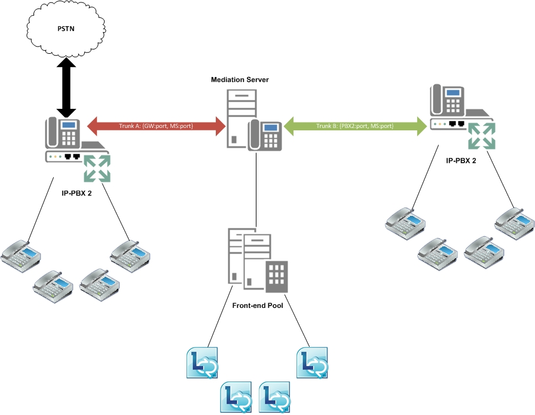

# Routing tra trunk in Skype for Business Server

Skype for Business Server fornisce la gestione delle sessioni di base tramite il supporto del routing tra trunk. Questa funzionalità consente a Skype for Business Server di fornire funzionalità di controllo delle chiamate ai sistemi di telefonia downstream. Il routing tra trunk può collegare un IP-PBX a un gateway PSTN (Public Switched Telephone Network) in modo che le chiamate da un telefono PBX (Private Branch Exchange) possano essere instradate verso la rete PSTN e le chiamate in entrata alla rete PSTN possano essere instradate verso un telefono PBX. Analogamente, Skype for Business Server può interconnettere due o più sistemi IP-PBX in modo che le chiamate possano essere inserite e ricevute tra i telefoni PBX dei diversi sistemi IP-PBX. 

Nella figura seguente viene illustrato Skype for Business Server che fornisce l'interconnettività tra un gateway PSTN e un IP-PBX.

Nella figura seguente viene illustrato Skype for Business Server che collega due sistemi IP-PBX.

