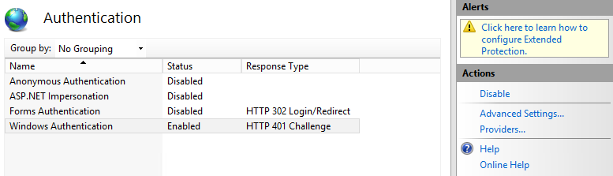

# <a name="deploy-call-quality-dashboard-for-skype-for-business-server"></a>Distribuire dashboard qualità chiamata per Skype for Business Server
 
**Riepilogo:** Informazioni sul processo di distribuzione per il dashboard qualità chiamata. Call Quality dashboard è uno strumento per Skype for Business Server.
  
## <a name="deployment-overview"></a>Panoramica della distribuzione

Call Quality Dashboard (CQD) è costituito da tre componenti principali:
  
- **Database di archiviazione**, in cui vengono replicati e archiviati i dati QoE (Quality of Experience).
    
- **Cubo**, in cui i dati provenienti dal database di archiviazione QoE vengono aggregati per ottimizzare e velocizzare l'accesso.
    
- **Portale**, in cui gli utenti possono facilmente interrogare e visualizzare i dati QoE.
    

  
Il processo di installazione per l'archivio QoE implica la creazione del database di archiviazione QoE, la distribuzione di una stored procedure SQL Server che sposterà i dati dal database di metriche QoE di origine nel database di archiviazione QoE e la configurazione del processo di SQL Server Agent per l'esecuzione della stored procedure a intervalli regolari. 
  
La distribuzione del cubo consente di ottenere informazioni dall'utente in cui si trova l'archivio QoE, distribuire il cubo e configurare un processo normale di agente SQL Server che aggiornerà il cubo a intervalli regolari.
  
L'installazione del portale crea un database del repository che archivia il mapping degli utenti di CQD ai report/query di ogni utente. Viene quindi impostata un'applicazione Web IIS che è il dashboard in cui gli utenti possono visualizzare un insieme predefinito di report, nonché personalizzare e creare le proprie query per visualizzare i dati del cubo. L'installazione del portale crea due ulteriori applicazioni Web che espongono le API per gli utenti a accedere a livello di programmazione all'archivio e al cubo. (Queste API vengono utilizzate internamente anche dal dashboard).
  

|**Fase**|**Procedura**|**Ruoli e appartenenza ai gruppi**|**Documentazione**|
|:-----|:-----|:-----|:-----|
|Installare l'hardware e il software prerequisito.  <br/> |Decidere la configurazione di CQD e scegliere un SQL Server da cui eseguire l'installazione.  <br/> |Utente del dominio membro del gruppo Administrators locale  <br/> |Sezione "requisiti di pre-installazione" nella documentazione relativa alla distribuzione.  <br/> |
|Installare CQD.  <br/> |Eseguire il MSI dopo il documento di distribuzione.  <br/> |Per eseguire il programma di installazione, è necessario che l'account di installazione sia un utente di dominio membro del gruppo Administrators locale e che disponga dell'accesso in lettura al database delle metriche QoE sul Monitoring Server.  <br/> |Sezione "account e passaggi di distribuzione" nella documentazione relativa alla distribuzione.  <br/> |
|Concedere l'accesso degli utenti.  <br/> |Per la gestione dell'autorizzazione utente per il portale, è consigliabile utilizzare l'autorizzazione URL, introdotta in IIS 7,0. Per ulteriori informazioni, vedere [Understanding IIS 7,0 URL Authorization](https://www.iis.net/learn/manage/configuring-security/understanding-iis-url-authorization).  <br/> |Utente del dominio membro del gruppo Administrators locale  <br/> |Gestione dell'accesso degli utenti per la sezione portale nella documentazione relativa alla distribuzione.  <br/> |
|Facoltativo: fornire informazioni di mapping della subnet.  <br/> |Popolare le tabelle di mapping di rete e creazione nel database di archivio QoE.  <br/> |Un account con accesso in scrittura al database di archiviazione QoE.  <br/> |Sezione "informazioni sulla subnet per la fornitura" nella documentazione dell'utente.  <br/> |
   


La distribuzione del dashboard per la qualità delle chiamate implica la configurazione dell'infrastruttura e l'installazione del software. Nella procedura seguente viene illustrato il processo.
  
## <a name="deployment-steps"></a>Passaggi di distribuzione

1. Copiare il CallQualityDashboard.msi nel computer in cui deve essere installato il componente di database di archiviazione di CQD (ovvero il computer in cui è installato SQL Server). 
    
2. Eseguire il MSI (Windows verrà richiesto di eseguire con privilegi di amministratore, farlo). 
    
3. Accettare il contratto di licenza.
    
4. Selezionare la cartella di destinazione in cui si trovano i file correlati ai componenti del dashboard qualità chiamata oppure accettare il percorso predefinito.
    
5. Selezionare tutte le funzionalità.
    
6. Nella pagina Configurazione archivio QoE, specificare le informazioni seguenti:
    
   - **Metriche QoE SQL Server:** Nome dell'istanza di SQL Server per la posizione in cui si trova il database di metriche QoE (questa sarà l'origine dati).
    
   - **Nome SQL Server di archiviazione QoE:** Si tratta di un campo di sola lettura e viene fissato al nome di dominio completo del computer locale. È possibile installare il database di archiviazione solo nel computer locale.
    
   - **Istanza di SQL Server di archiviazione QoE:** Nome di istanza di SQL Server locale in cui deve essere creato il database di archiviazione. Per utilizzare un'istanza di SQL Server predefinita, lasciare vuoto questo campo. Per utilizzare un'istanza di SQL Server denominata, specificare il nome dell'istanza (ad esempio, il nome dopo la " \" ).
    
   - **Database di archiviazione QoE:** Per impostazione predefinita, questa opzione è impostata su "Crea nuovo database". Dal momento che l'aggiornamento di archiviazione DB non è supportato, l'unica circostanza in cui è possibile utilizzare l'opzione "Usa database esistente" è se il database di archiviazione esistente ha lo stesso schema della build da installare.
    
   - **Directory file di database:** Percorso in cui devono essere posizionati i file di database (con estensione MDF e ldf) per il DB di archiviazione. Questo dovrebbe essere su un'unità (HDD2 nella configurazione hardware consigliata) separata dal sistema operativo. Si noti che, poiché i nomi dei file vengono corretti nell'installazione, per evitare potenziali conflitti, è consigliabile utilizzare una directory vuota senza file.
    
   - **Utilizzo di più partizioni:** Il valore predefinito è "multiple Partition", che richiede Business Intelligence Edition o Enterprise Edition di SQL Server. Per Standard Edition selezionare l'opzione "partizione singola". Si noti che le prestazioni di elaborazione del cubo possono essere influenzate se si utilizza una singola partizione.
    
     > [!NOTE]
     > L'opzione selezione per l'utilizzo di più partizioni non può essere modificata dopo il completamento dell'installazione. Per modificarlo, è necessario prima disinstallare la caratteristica cubo e quindi reinstallarla utilizzando l'opzione "cambia" nel pannello di controllo. 
  
   - **Directory file di partizione:** Percorso in cui deve essere posizionata la partizione per il database di archiviazione QoE. Questo dovrebbe essere su un'unità (HDD3 nella configurazione hardware consigliata) separata dall'unità del sistema operativo e dal disco dei file di registro di database SQL. Si noti che, poiché i nomi dei file vengono corretti nell'installazione, per evitare potenziali conflitti, è consigliabile utilizzare una directory vuota senza file.
    
   - Nome utente del **&amp; processo agente SQL Password:** nome dell'account del servizio di dominio e password (mascherata) che verrà utilizzata per eseguire il passaggio "dati di archiviazione QoE" del processo di SQL Server Agent (che eseguirà la stored procedure per recuperare i dati dal database delle metriche QoE in archivio DB, in questo modo questo account deve disporre dell'accesso in lettura al database delle metriche QoE, come indicato nella sezione account. Questo account deve inoltre disporre di un accesso nell'istanza di SQL Server di archiviazione QoE.
    
     > [!NOTE]
     > L'account su cui è in esecuzione l'istanza di SQL Server, ad esempio NT SERVICE\MSSQLSERVER, deve disporre di accesso/autorizzazione alle directory indicate in alto perché l'installazione abbia esito positivo. Per informazioni dettagliate, vedere [Configure file System Permissions for Database Engine Access](https://msdn.microsoft.com/library/jj219062%28v=sql.110%29.aspx)
  
7. Dopo aver fatto clic su Avanti, il programma di installazione eseguirà i controlli prerequisiti e riferirà se vengono rilevati problemi. Quando tutti i controlli prerequisiti passano, il programma di installazione passerà alla pagina di configurazione del cubo. 
    
    > [!NOTE]
    > Se il programma di installazione visualizza un messaggio di avviso in cui il servizio SQL Server Agent per l'istanza di SQL Server di archiviazione QoE non è in esecuzione, l'installazione può procedere, ma dopo l'installazione accertarsi che il servizio agente SQL sia in esecuzione e impostare il tipo di avvio su automatico in modo che venga eseguito il processo pianificato. 
  
8. Nella pagina Configurazione cubo fornire le informazioni seguenti:
    
   - **Nome SQL Server di archiviazione QoE:** Si tratta di un campo di sola lettura e viene fissato al nome di dominio completo del computer locale. Il cubo può essere installato solo dal computer in cui è presente il database di archiviazione QoE (nota. Il cubo stesso può essere installato in un computer remoto. Vedere di seguito)
    
   - **Istanza di SQL Server di archiviazione QoE:** Nome dell'istanza di SQL Server per la posizione in cui si trova il database di archiviazione QoE. Per specificare un'istanza di SQL Server predefinita, lasciare vuoto questo campo. Per specificare un'istanza di SQL Server denominata, immettere il nome dell'istanza (ad esempio il nome dopo la " \" ). Se il componente archivio QoE è stato selezionato per l'installazione, questo campo verrà prepopolato con il valore specificato nella pagina di configurazione dell'archivio QoE.
    
   - **Server di analisi del cubo:** Nome dell'istanza del servizio di analisi SQL Server per la posizione in cui deve essere creato il cubo. Può trattarsi di un computer diverso, ma l'utente che esegue l'installazione deve essere membro degli amministratori del server dell'istanza del servizio di analisi di SQL Server di destinazione.
    
     > [!NOTE]
     >  Per ulteriori informazioni sulla configurazione delle autorizzazioni di amministratore del server di Analysis Services, vedere [Grant Server Administrator permissions (Analysis Services)](https://msdn.microsoft.com/library/ms174561.aspx)
  
   - **Utilizzo di più partizioni:** Il valore predefinito è "multiple Partition", che richiede Business Intelligence Edition o Enterprise Edition di SQL Server. Per Standard Edition selezionare l'opzione "partizione singola". Si noti che le prestazioni di elaborazione del cubo possono essere influenzate se si utilizza una singola partizione.
    
     > [!NOTE]
     >  L'opzione selezione per l'utilizzo di più partizioni non può essere modificata dopo il completamento dell'installazione. Per modificarlo, è necessario prima disinstallare la caratteristica cubo e quindi reinstallarla utilizzando l'opzione "cambia" nel pannello di controllo.
  
   - Nome utente del **&amp; cubo Password:** nome dell'account del servizio di dominio e password (mascherata) che attiverà l'elaborazione del cubo. Se il componente archivio QoE è stato selezionato per l'installazione, questo campo verrà prepopolato con il valore specificato nella pagina Configurazione di archiviazione per l'utente del processo SQL Agent, ma è consigliabile specificare un account di servizio di dominio diverso in modo che il programma di installazione possa concedergli il privilegio meno richiesto.
    
9. Quando si fa clic su Avanti, verrà eseguito un altro round di convalida e verrà segnalato qualsiasi problema. Dopo aver completato la convalida, il programma di installazione passerà alla pagina di configurazione del portale. 
    
10. Nella pagina Configurazione portale, specificare le informazioni seguenti:
    
    - **Archivio QoE SQL Server:** Nome dell'istanza di SQL Server per la posizione in cui si trova il database di archiviazione QoE. Si noti che, a differenza della pagina di configurazione dell'archivio QoE e della pagina di configurazione del cubo, il nome del computer non è corretto e deve essere fornito. Se il componente archivio QoE è stato selezionato per l'installazione, questo campo verrà prepopolato con il valore specificato nella pagina di configurazione dell'archivio QoE.
    
    - **Server di analisi del cubo:** Nome dell'istanza del servizio di analisi SQL Server per la posizione in cui si trova il cubo. Se è stato selezionato il componente cubo per l'installazione, questo campo verrà prepopolato con il valore specificato nella pagina Configurazione cubo.
    
    - **Archivio SQL Server:** Nome dell'istanza di SQL Server in cui deve essere creato il database dell'archivio. Se il nome dell'istanza di SQL Server per la posizione in cui si trova il database di archiviazione QoE è stato specificato in precedenza nel programma di installazione (in altri componenti), questo campo verrà prepopolato con il nome dell'istanza di SQL Server di archiviazione QoE DB. Può trattarsi di qualsiasi istanza di SQL Server.
    
    - **Database repository:** Per impostazione predefinita, l'opzione è impostata su "Crea nuovo database". Dal momento che l'aggiornamento del repository DB non è supportato, l'unica circostanza in cui è possibile utilizzare l'opzione "Usa database esistente" è se il DB del repository esistente ha lo stesso schema della build da installare.
    
    - Nome utente del **&amp; pool di applicazioni IIS Password:** l'account in cui deve essere eseguito il pool di applicazioni IIS. I campi nome utente e password saranno disabilitati se sono selezionati account di sistema incorporati. Questi campi verranno abilitati solo se è selezionata l'opzione "altro" nella casella a discesa in modo che l'utente possa immettere le informazioni sull'account del servizio del dominio.
    
11. Quando si fa clic su Avanti, verrà eseguito l'ultimo round di convalida per garantire che le istanze di SQL Server siano accessibili utilizzando le credenziali fornite e che IIS sia disponibile nel computer. Dopo aver completato la convalida, il programma di installazione procederà con l'installazione. 
    
Al termine del programma di installazione, è probabile che il processo di SQL Server Agent sia in corso, eseguendo il caricamento iniziale dei dati QoE e l'elaborazione del cubo. A seconda della quantità di dati in QoE, il portale non avrà dati disponibili per la visualizzazione. Per verificare lo stato del caricamento dei dati e dell'elaborazione del cubo, passare a  `http://<machinename>/CQD/#/Health` . 
> [!NOTE]
> Si noti che l'URL per il controllo dello stato dell'elaborazione del cubo di download è distinzione tra maiuscole e minuscole. Se si immette "integrità", l'URL non funzionerà. È necessario immettere ' integrità' alla fine dell'URL con una maiuscola H. 
  
I messaggi dettagliati verranno visualizzati se la modalità di debug è abilitata. Per abilitare la modalità di debug, passare a **%SystemDrive%\Program Skype for Business 2015 CQD\QoEDataService\web.config** e aggiornare la riga seguente in modo che il valore sia impostato su **true**:

```xml
<add key="QoEDataLib.DebugMode" value="True" /> 
```

La pagina principale del portale è accessibile tramite  `http://<machinename>/CQD` . 
## <a name="managing-user-access-for-the-portal"></a>Gestione dell'accesso degli utenti per il portale

Per la gestione dell'autorizzazione utente per il portale, è consigliabile utilizzare l'autorizzazione URL, introdotta in IIS 7,0. Per ulteriori informazioni sulla sicurezza di IIS, vedere [Understanding iis 7,0 URL Authorization](https://www.iis.net/learn/manage/configuring-security/understanding-iis-url-authorization).
  
Qualsiasi sito Web o applicazione Web eredita l'autorizzazione URL predefinita configurata per l'intera IIS, che in genere è "Consenti a tutti gli utenti". Se l'accesso al portale deve essere più restrittivo, gli amministratori potranno concedere l'accesso solo a un gruppo specifico di utenti modificando le "regole di autorizzazione".
  

  
> [!NOTE]
> L'icona delle regole di autorizzazione non deve essere confusa con l'"autorizzazione .NET" nella sezione ASP.NET, che è un meccanismo di autorizzazione diverso. 
  
Gli amministratori devono prima rimuovere la regola "Consenti a tutti gli utenti" ereditata. In questo modo si evita che gli utenti non autorizzati accedano al portale.
  

  
Successivamente, gli amministratori devono aggiungere nuove regole Allow e fornire agli utenti specifici l'autorizzazione per accedere al portale. È consigliabile creare un gruppo locale denominato "CQDPortalUsers" per gestire gli utenti.
  

  
I dettagli di configurazione sono archiviati nella web.config che si trova nella directory fisica del portale.
  
```xml
<?xml version="1.0" encoding="UTF-8"?> <configuration> <system.webServer> <security> <authorization> <remove users="*" roles="" verbs="" /> <add accessType="Allow" roles="CQDPortalUsers" /> </authorization> </security> </system.webServer> </configuration> 
```

Il passaggio successivo consiste nel configurare il dashboard di CQD. Dopo che gli utenti sono stati autenticati da IIS, dovranno disporre delle autorizzazioni per i file nella directory CQD per accedere al contenuto del portale Web. È possibile modificare gli elenchi ACL tramite la scheda sicurezza delle proprietà della directory CQD per aggiungere singoli utenti o gruppi. Tuttavia, l'approccio consigliato consiste nel lasciare intatto il file Permissions. Modificare invece l'impostazione di IIS in modo da utilizzare il processo di lavoro IIS per accedere alla directory CQD indipendentemente dall'autenticazione dell'utente. 
  
> [!IMPORTANT]
> È importante modificare solo questa impostazione per l'applicazione CQD e non per le due applicazioni API: QoEDataService e QoERepositoryService. 
  
## <a name="configuring-file-access-for-the-cqd-dashboard"></a>Configurazione dell'accesso ai file per il CQD (Dashboard)

1. Aprire l'editor di configurazione per CQD.
    
     
  
2. In sezione scegliere **System. webserver/ServerRunTime**.
    
     
  
3. Modificare authenticatedUserOverride in **UseWorkerProcessUser**.
    
     
  
4. Fare clic su **applica** sul lato destro della pagina.
    
## <a name="known-issues"></a>Problemi noti

### <a name="the-cqd-shows-no-data-after-deployment"></a>Il CQD non Visualizza dati dopo la distribuzione

È possibile che venga visualizzato il messaggio di errore seguente:

*Non è stato possibile eseguire la query durante l'esecuzione del cubo. Utilizzare l'editor di query per modificare la query e risolvere eventuali problemi. Verificare inoltre che il cubo sia accessibile.*

Questo significa che il cubo deve essere elaborato in SQL Server Analysis Services prima di essere utilizzato in CQD. È possibile risolverlo attenendosi alla procedura seguente:

1. Aprire SQL Management Studio e selezionare **Analysis Services**.

2. Espandere l'oggetto **QoECube** , selezionare **metriche QoE**, fare clic con il pulsante destro del mouse e scegliere **Sfoglia**. 

    Se viene restituito il browser vuoto, il cubo non è stato ancora proceduto.

3. Fare clic con il pulsante destro del mouse su angain **metriche QoE** e scegliere **processo**.

4. Al termine dell'elaborazione, fare di nuovo clic con il pulsante destro del mouse sull'oggetto e scegliere **Sfoglia** per confermare che la pagina del browser visualizzi ora i dati. 


### <a name="users-have-trouble-logging-in-because-installer-fails-to-create-the-correct-settings-in-iis"></a>Gli utenti hanno problemi di accesso perché il programma di installazione non riesce a creare le impostazioni corrette in IIS

In rari casi, il programma di installazione non è in grado di creare le impostazioni corrette in IIS. La modifica manuale è necessaria per consentire agli utenti di accedere a CQD. Se si verificano problemi di accesso per gli utenti, attenersi alla seguente procedura:
  
1. Aprire Gestione IIS e passare al sito Web predefinito.
    
     
  
2. Fare clic su "autenticazione". Se l'autenticazione anonima, la rappresentazione di ASP.NET, l'autenticazione basata su form e l'autenticazione di Windows non corrispondono alle impostazioni riportate di seguito, modificarle manualmente in modo che corrispondano alle impostazioni seguenti. Tutti gli altri meccanismi di autenticazione devono essere disattivati.
    
     
  
3. Per "autenticazione di Windows", fare clic su Impostazioni avanzate sul lato destro.
    
     
  
4. Impostare "Extended Protection" per accettare e selezionare la casella di controllo Abilita autenticazione in modalità kernel.
    
     
  
5. Ripetere i passaggi precedenti per ognuna delle voci "CQD", "QoEDataService" e "QoERepositoryService" sotto "sito Web predefinito".
    
Per i binding delle porte HTTP e HTTPS, il programma di installazione creerà i binding delle porte sui numeri di porta predefiniti (porta 80 per HTTP e la porta 443 per HTTPS). Se nel computer è presente un altro sito Web che utilizza questi binding, si verificherà un conflitto e non sarà possibile prevedere il comportamento IIS. Il modo migliore per evitare questo problema consiste nel verificare che non vengano mappati altri siti Web alle porte 80 e 443 prima di installare CQD. 
  
Per abilitare SSL/TLS in IIS e imporre agli utenti di connettersi tramite HTTPS sicuro anziché HTTP:
  
1. Configure Secure Sockets Layer in IIS, vedere [Configuring Secure Sockets Layer in IIS 7](https://technet.microsoft.com/library/cc771438%28v=ws.10%29.aspx). Una volta fatto, Sostituisci  `http` con `https` .
    
2. Per istruzioni sull'abilitazione di TLS nelle connessioni a SQL Server, vedere [How to Enable SSL Encryption for an instance of SQL Server by using Microsoft Management Console](https://support.microsoft.com/kb/316898/).
    
## <a name="cube-sync-fails"></a>Errore di sincronizzazione del cubo

QoEMetrics potrebbe contenere alcuni record non validi basati su Clock degli utenti finali. Se l'inclinazione temporale è maggiore di 60 anni, l'importazione del cubo avrà esito negativo.
  
 Controllare le opzioni di min e Max StartTime/EndTime utilizzando le selezioni seguenti. Cercare ed eliminare i record in un futuro molto passato e molto lontano, possono essere ignorati e suddividere i processi di sincronizzazione.
  
- Selezionare MIN (StartTime) da CqdPartitionedStreamView
    
- Seleziona massimo (StartTime) da CqdPartitionedStreamView
    
- Selezionare MIN (EndTime) da CqdPartitionedStreamView
    
- Seleziona massimo (EndTime) da CqdPartitionedStreamView
    
## <a name="post-install-tasks"></a>Attività successive all'installazione

### <a name="importing-buildings-and-networks"></a>Importazione di edifici e reti

Dopo l'installazione di CQD, eseguire le attività di configurazione seguenti:
  
1. Definire i tipi di edifici (scelta consigliata)
    
2. Definire i tipi di proprietà degli edifici (scelta consigliata)
    
3. Definire i tipi di rete (altamente consigliato)
    
4. Importare edifici (scelta consigliata)
    
5. Importare le subnet (scelta consigliata)
    
### <a name="define-building-types"></a>Definire i tipi di edifici

I tipi di compilazione vengono utilizzati per descrivere le diverse definizioni o tipi di edifici all'interno dell'organizzazione. 
  
> [!NOTE]
> Questo passaggio è facoltativo, ma è consigliato. 
  
Esempi
  
- Headquarters
    
- Office remoto
    
- Percorso joint-venture
    
  **Sintassi SQL di esempio**
  
```SQL
INSERT INTO
[dbo].[CqdBuildingType]
([BuildingTypeId],
[BuildingTypeDesc])
VALUES
(1, 
'Headquarters')   
```

I parametri BuildingTypeId e BuildingTypeDesc sono obbligatori.
  
### <a name="define-building-ownership-types"></a>Definire i tipi di proprietà dell'edificio

I tipi di proprietà vengono utilizzati per distinguere le risorse possedute e quelle affittate.
  
> [!NOTE]
> Questo passaggio è facoltativo, ma è consigliato. 
  
Esempi
  
- Contoso leased non RE &amp; F
    
- Contoso leased RE &amp; F
    
- Contoso posseduto
    
- Filiale affittata
    
  **Sintassi SQL di esempio**
  
```SQL
INSERT INTO
[dbo].[CqdBuildingOwnershipType]
([OwnershipTypeId],
[OwnershipTypeDesc]
)

VALUES
(1,
'Contoso Owned'
)
```

I parametri OwnershipTypeId e OwnershipTypeDesc sono obbligatori. 
  
### <a name="define-network-names"></a>Definire i nomi di rete

I tipi di rete vengono utilizzati per descrivere diversi tipi di reti all'interno dell'organizzazione. In questo modo è possibile filtrare (o escludere) tipi di rete specifici.
  
> [!NOTE]
> È consigliabile definire i nomi di rete, ma è facoltativo. Se si decide di non definire i nomi di rete, assicurarsi che ogni voce di CqdNetwork abbia un BuildingId pari a 0. 
  
Esempi
  
- VPN
    
- DEL laboratorio
    
  **Sintassi SQL di esempio**
  
```SQL
INSERT INTO [dbo].[CqdNetworkName] 
( [NetworkName]
,[NetworkType]
 ) 
VALUES
('VPN','VPN') 
```

I parametri NetworkNameID e NetworkName sono obbligatori, il parametro NetworkType è facoltativo ma consigliato.
  
### <a name="import-buildings"></a>Importare edifici

L'importazione di edifici offre la possibilità di ottenere informazioni specifiche sull'edificio (chiamate insufficienti per ogni edificio su WiFi/Wired, ecc.). 
  
> [!NOTE]
> Questo passaggio è facoltativo, ma è consigliato. 
  
Prima di importare un nuovo edificio, è necessario che sia già stato identificato un BuildingKey predefinito. A tale scopo, eseguire il comando SQL "SELECT MAX (BuildingKey) FROM CqdBuilding" per identificare il valore corrente e aggiungere 1 al risultato.
  
 **Sintassi SQL di esempio**
  
```SQL
INSERT INTO [dbo].[CqdBuilding] 
( [BuildingKey]
,[BuildingName]
,[BuildingShortName]
,[OwnershipTypeId],
[BuildingTypeId]
)
VALUES
(2, 'Ann Arbor', 'AA', 0, 0)
```

I parametri BuildingKey, Buildingname, BuildingShortName, OwnershipTypeId, BuildingTypeId sono obbligatori, mentre gli altri parametri sono facoltativi.
  
### <a name="import-subnets"></a>Importare le subnet

L'importazione di edifici offre la possibilità di ottenere informazioni specifiche sull'edificio (chiamate insufficienti per ogni edificio su WiFi/Wired, ecc.). 
  
> [!NOTE]
> Questo passaggio è facoltativo, ma è consigliato.
  
Importare le subnet e mapparle agli edifici importati nell'ultimo passaggio. Se si è deciso di non popolare NetworkName, assicurarsi che ogni voce della tabella utilizzi un NetworkNameID di 0. Per ulteriori informazioni sulla sintassi e sui parametri SQL per il dashboard qualità chiamata, vedere [Use Call Quality dashboard for Skype for Business Server](https://docs.microsoft.com/skypeforbusiness/management-tools/call-quality-dashboard/use).
  
 **Sintassi SQL di esempio**
  
```SQL
INSERT INTO [dbo].[CqdNetwork] 
([Network]
,[NetworkRange]
,[NetworkNameID]
,[BuildingKey]
,[UpdatedDate]
)

VALUES
 ('172.16.254.0',32,0,1,'2015-11-11')
```

I parametri Network e UpdatedDate sono obbligatori, mentre gli altri parametri sono facoltativi.
  
### <a name="optional-bssid"></a>Facoltativo: BSSID

La compilazione delle informazioni di BSSID offre una correlazione di flusso WiFi supplementare tramite controller o radio. Questo è oltre a filtrare in base all'edificio o alla subnet. 
  
 **Sintassi SQL di esempio**
  
```SQL
INSERT INTO [dbo].[CqdBssid]
([Ap],
[Bss],
[Building],
[ess],
[phy]
)
VALUES
('AP1','00-00-00-00-00-00','Aruba AP 1','Controller1','bgn')
```

**Dettagli CqdBssidTable**

|**Come illustrato in CQD**|**Tabella CQDBssid**|**Input di esempio**|
|:-----|:-----|:-----|
|AP NName  <br/> |AP  <br/> |AP1  <br/> |
|BBssid  <br/> |BSS  <br/> |00-00-00-00-00-00 (è necessario utilizzare il utilizzare delimitato)  <br/> |
|Controller  <br/> |Creazione  <br/> |Aruba AP 7  <br/> |
|Dispositivo  <br/> |ESS  <br/> |Controller1  <br/> |
|Radio  <br/> |PHY  <br/> |BGN  <br/> |
   
### <a name="processing-the-imported-data"></a>Elaborazione dei dati importati

Per impostazione predefinita, dopo aver importato i dati di compilazione o di rete, l'applicazione verrà applicata solo ai record generati dopo quel momento. 
  
Per contrassegnare tutti i record precedenti con i nuovi dati, sarà necessario eseguire la stored procedure CqdUpdateBuilding come illustrato di seguito: 
  
Assegnare la data del primo record (identificare l'utilizzo del comando Seleziona MIN (StartTime) da CqdPartitionedStreamView SQL), una EndDate di domani, quindi NULL per gli ultimi due valori.
  
Dopo che i dati sono associati ai dati del flusso, è necessario che il cubo di SSIS rielabori tutti i record. Questo vale anche per l'aggiunta di massa dei dati di BSSID/ISP. Verificare che sia selezionata l'opzione "elaborazione completa".
  

