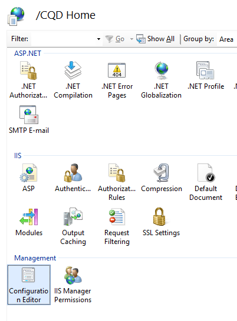

# <a name="deploy-call-quality-dashboard-for-skype-for-business-server"></a><span data-ttu-id="398e7-104">Distribuire dashboard qualità chiamata per Skype for Business Server</span><span class="sxs-lookup"><span data-stu-id="398e7-104">Deploy Call Quality Dashboard for Skype for Business Server</span></span>
 
<span data-ttu-id="398e7-105">**Riepilogo:** Informazioni sul processo di distribuzione di Call Quality dashboard.</span><span class="sxs-lookup"><span data-stu-id="398e7-105">**Summary:** Learn about the deployment process for Call Quality Dashboard.</span></span> <span data-ttu-id="398e7-106">Call Quality dashboard è uno strumento per Skype for Business Server.</span><span class="sxs-lookup"><span data-stu-id="398e7-106">Call Quality Dashboard is a tool for Skype for Business Server.</span></span>
  
## <a name="deployment-overview"></a><span data-ttu-id="398e7-107">Panoramica della distribuzione</span><span class="sxs-lookup"><span data-stu-id="398e7-107">Deployment Overview</span></span>

<span data-ttu-id="398e7-108">Call Quality Dashboard (Call Quality Dashboard) è costituito da tre componenti principali:</span><span class="sxs-lookup"><span data-stu-id="398e7-108">Call Quality Dashboard (CQD) consists of three major components:</span></span>
  
- <span data-ttu-id="398e7-109">**Database di archiviazione**in cui vengono replicati e archiviati i dati di qualità dell'esperienza (QoE).</span><span class="sxs-lookup"><span data-stu-id="398e7-109">**Archive Database**, where the Quality of Experience (QoE) data is replicated and stored.</span></span>
    
- <span data-ttu-id="398e7-110">**Cubo**, in cui i dati del database di archiviazione QoE vengono aggregati per l'accesso rapido e ottimizzato.</span><span class="sxs-lookup"><span data-stu-id="398e7-110">**Cube**, where data from QoE Archive database is aggregated for optimized and fast access.</span></span>
    
- <span data-ttu-id="398e7-111">**Portal**, in cui gli utenti possono facilmente eseguire query e visualizzare i dati QoE.</span><span class="sxs-lookup"><span data-stu-id="398e7-111">**Portal**, where users can easily query and visualize QoE data.</span></span>
    

  
<span data-ttu-id="398e7-113">Il processo di configurazione per l'archivio QoE include la creazione del database di archiviazione QoE, la distribuzione di una stored procedure di SQL Server che sposterà i dati dal database di metriche QoE di origine nel database di archiviazione QoE e la configurazione del processo di SQL Server Agent per l'esecuzione della stored procedura a intervalli regolari.</span><span class="sxs-lookup"><span data-stu-id="398e7-113">The setup process for QoE Archive involves creating the QoE Archive database, deploying a SQL Server stored procedure that will move the data from the source QoE Metrics database into QoE Archive database, and setting up the SQL Server Agent job to execute the stored procedure at a regular interval.</span></span> 
  
<span data-ttu-id="398e7-114">La distribuzione del cubo consente di ottenere informazioni dall'utente in cui si trova l'archivio QoE, distribuisce il cubo e configura un processo di SQL Server Agent regolare che aggiornerà il cubo a intervalli regolari.</span><span class="sxs-lookup"><span data-stu-id="398e7-114">Cube deployment gets information from the user on where the QoE Archive is located, deploys the cube, and sets up a regular SQL Server agent job that will refresh the cube at a regular interval.</span></span>
  
<span data-ttu-id="398e7-115">L'installazione del portale crea un database del repository che archivia il mapping degli utenti di Call Quality Dashboard ai report e alle query di ogni utente.</span><span class="sxs-lookup"><span data-stu-id="398e7-115">Portal install creates a Repository database that stores the mapping of CQD users to each user's reports/queries.</span></span> <span data-ttu-id="398e7-116">Configura quindi un'applicazione Web IIS che è il dashboard in cui gli utenti possono visualizzare un set predefinito di report, nonché personalizzare e creare query personalizzate per visualizzare i dati dal cubo.</span><span class="sxs-lookup"><span data-stu-id="398e7-116">It then sets up an IIS web application which is the dashboard where users can see a pre-defined set of reports as well as customize and create their own queries to visualize data from the cube.</span></span> <span data-ttu-id="398e7-117">L'installazione del portale crea due altre applicazioni Web che espongono le API per consentire agli utenti di accedere a livello di codice al repository e al cubo.</span><span class="sxs-lookup"><span data-stu-id="398e7-117">The portal install creates two additional web applications that exposes APIs for users to programmatically access the repository and the cube.</span></span> <span data-ttu-id="398e7-118">Queste API vengono usate anche internamente dal dashboard.</span><span class="sxs-lookup"><span data-stu-id="398e7-118">(These APIs are used internally by the dashboard as well.)</span></span>
  

|<span data-ttu-id="398e7-119">**Fase**</span><span class="sxs-lookup"><span data-stu-id="398e7-119">**Phase**</span></span>|<span data-ttu-id="398e7-120">**Passaggi**</span><span class="sxs-lookup"><span data-stu-id="398e7-120">**Steps**</span></span>|<span data-ttu-id="398e7-121">**Ruoli e appartenenza ai gruppi**</span><span class="sxs-lookup"><span data-stu-id="398e7-121">**Roles and group membership**</span></span>|<span data-ttu-id="398e7-122">**Documentazione**</span><span class="sxs-lookup"><span data-stu-id="398e7-122">**Documentation**</span></span>|
|:-----|:-----|:-----|:-----|
|<span data-ttu-id="398e7-123">Installare hardware e software prerequisiti.</span><span class="sxs-lookup"><span data-stu-id="398e7-123">Install prerequisite hardware and software.</span></span>  <br/> |<span data-ttu-id="398e7-124">Decidere la configurazione di Call Quality dashboard e scegliere un server SQL da cui eseguire l'installazione.</span><span class="sxs-lookup"><span data-stu-id="398e7-124">Decide on the CQD configuration, and choose a SQL Server from which to perform the install.</span></span>  <br/> |<span data-ttu-id="398e7-125">Utente del dominio che è un membro del gruppo Administrators locale.</span><span class="sxs-lookup"><span data-stu-id="398e7-125">Domain user who is a member of the local administrators group.</span></span>  <br/> |<span data-ttu-id="398e7-126">Sezione "requisiti di pre-installazione" nella documentazione relativa alla distribuzione.</span><span class="sxs-lookup"><span data-stu-id="398e7-126">"Pre-install Requirements" section in the deployment documentation.</span></span>  <br/> |
|<span data-ttu-id="398e7-127">Installare Call Quality dashboard.</span><span class="sxs-lookup"><span data-stu-id="398e7-127">Install CQD.</span></span>  <br/> |<span data-ttu-id="398e7-128">Eseguire il file MSI dopo il documento di distribuzione.</span><span class="sxs-lookup"><span data-stu-id="398e7-128">Run the MSI following the deployment document.</span></span>  <br/> |<span data-ttu-id="398e7-129">Per eseguire la configurazione, l'account di installazione deve essere un utente di dominio membro del gruppo Administrators locale e avere accesso in lettura al database delle metriche QoE nel server di monitoraggio.</span><span class="sxs-lookup"><span data-stu-id="398e7-129">To perform the setup, the installing account must be a domain user who is a member of the local administrators group and have read access to QoE Metrics database on the Monitoring Server.</span></span>  <br/> |<span data-ttu-id="398e7-130">Sezioni "account e passaggi di distribuzione" nella documentazione relativa alla distribuzione.</span><span class="sxs-lookup"><span data-stu-id="398e7-130">"Accounts and Deployment Steps" sections in the deployment documentation.</span></span>  <br/> |
|<span data-ttu-id="398e7-131">Concedere l'accesso degli utenti.</span><span class="sxs-lookup"><span data-stu-id="398e7-131">Grant user access.</span></span>  <br/> |<span data-ttu-id="398e7-132">Per la gestione dell'autorizzazione dell'utente al portale, è consigliabile usare l'autorizzazione URL, introdotta in IIS 7,0.</span><span class="sxs-lookup"><span data-stu-id="398e7-132">For managing user authorization to the Portal, we recommend using URL Authorization, which was introduced in IIS 7.0.</span></span> <span data-ttu-id="398e7-133">Per altre informazioni, vedere [concetti relativi all'autorizzazione URL di IIS 7,0](https://www.iis.net/learn/manage/configuring-security/understanding-iis-url-authorization).</span><span class="sxs-lookup"><span data-stu-id="398e7-133">For more information, see [Understanding IIS 7.0 URL Authorization](https://www.iis.net/learn/manage/configuring-security/understanding-iis-url-authorization).</span></span>  <br/> |<span data-ttu-id="398e7-134">Utente del dominio che è un membro del gruppo Administrators locale.</span><span class="sxs-lookup"><span data-stu-id="398e7-134">Domain user who is a member of the local administrators group.</span></span>  <br/> |<span data-ttu-id="398e7-135">Gestione dell'accesso degli utenti per la sezione Portal nella documentazione relativa alla distribuzione.</span><span class="sxs-lookup"><span data-stu-id="398e7-135">Managing User Access for the Portal section in the deployment documentation.</span></span>  <br/> |
|<span data-ttu-id="398e7-136">Facoltativo: fornisci informazioni sul mapping della subnet.</span><span class="sxs-lookup"><span data-stu-id="398e7-136">Optional: Provide subnet mapping information.</span></span>  <br/> |<span data-ttu-id="398e7-137">Popolare le tabelle di mapping di rete e creazione nel database di archivio QoE.</span><span class="sxs-lookup"><span data-stu-id="398e7-137">Populate network and building mapping tables in QoE Archive database.</span></span>  <br/> |<span data-ttu-id="398e7-138">Un account con accesso in scrittura al database di archiviazione QoE.</span><span class="sxs-lookup"><span data-stu-id="398e7-138">An account with write access to the QoE Archive database.</span></span>  <br/> |<span data-ttu-id="398e7-139">Sezione "fornitura di informazioni sulla subnet" nella documentazione dell'utente.</span><span class="sxs-lookup"><span data-stu-id="398e7-139">"Supplying Subnet Information" section in the user documentation.</span></span>  <br/> |
   


<span data-ttu-id="398e7-140">La distribuzione di Call Quality dashboard include la configurazione dell'infrastruttura e l'installazione del software.</span><span class="sxs-lookup"><span data-stu-id="398e7-140">Deployment of Call Quality Dashboard involves setting up the infrastructure and installing the software.</span></span> <span data-ttu-id="398e7-141">La procedura seguente illustra il processo.</span><span class="sxs-lookup"><span data-stu-id="398e7-141">The following procedure outlines the process.</span></span>
  
## <a name="deployment-steps"></a><span data-ttu-id="398e7-142">Passaggi di distribuzione</span><span class="sxs-lookup"><span data-stu-id="398e7-142">Deployment Steps</span></span>

1. <span data-ttu-id="398e7-143">Copiare il file CallQualityDashboard. msi nel computer in cui è installato il componente database di archiviazione di Call Quality dashboard, ovvero il computer in cui è installato SQL Server.</span><span class="sxs-lookup"><span data-stu-id="398e7-143">Copy the CallQualityDashboard.msi to the machine where the archive database component of CQD is to be installed (this is the machine that has SQL Server installed).</span></span> 
    
2. <span data-ttu-id="398e7-144">Eseguire il file MSI (Windows richiederà l'esecuzione con privilegi di amministratore).</span><span class="sxs-lookup"><span data-stu-id="398e7-144">Execute the MSI (Windows will prompt to run with administrator privilege, do so).</span></span> 
    
3. <span data-ttu-id="398e7-145">Accettare l'EULA.</span><span class="sxs-lookup"><span data-stu-id="398e7-145">Accept the EULA.</span></span>
    
4. <span data-ttu-id="398e7-146">Selezionare la cartella di destinazione in cui verranno individuati i file relativi ai componenti del dashboard qualità chiamata o accetteranno la posizione predefinita.</span><span class="sxs-lookup"><span data-stu-id="398e7-146">Select the destination folder where files related to Call Quality Dashboard components will be located or accept the default location.</span></span>
    
5. <span data-ttu-id="398e7-147">Selezionare tutte le caratteristiche.</span><span class="sxs-lookup"><span data-stu-id="398e7-147">Select all features.</span></span>
    
6. <span data-ttu-id="398e7-148">Nella pagina Configurazione archivio QoE specificare le informazioni seguenti:</span><span class="sxs-lookup"><span data-stu-id="398e7-148">At the QoE Archive Configuration page, provide the following information:</span></span>
    
   - <span data-ttu-id="398e7-149">**Metriche QoE SQL Server:** Nome istanza di SQL Server per la posizione in cui si trova il DB metriche QoE (questa sarà l'origine dati).</span><span class="sxs-lookup"><span data-stu-id="398e7-149">**QoE Metrics SQL Server:** SQL Server instance name for where the QoE Metrics DB is located (this will be the data source).</span></span>
    
   - <span data-ttu-id="398e7-150">**Nome dell'archivio QoE di SQL Server:** Si tratta di un campo di sola lettura e viene fissato al nome di dominio completo del computer locale.</span><span class="sxs-lookup"><span data-stu-id="398e7-150">**QoE Archive SQL Server Name:** This is read-only field and fixed to the fully qualified domain name of the local machine.</span></span> <span data-ttu-id="398e7-151">Archivio DB può essere installato solo nel computer locale.</span><span class="sxs-lookup"><span data-stu-id="398e7-151">Archive DB can be installed only on the local machine.</span></span>
    
   - <span data-ttu-id="398e7-152">**Istanza di SQL Server QoE Archive:** Nome di istanza di SQL Server locale in cui deve essere creato l'archivio DB di archiviazione.</span><span class="sxs-lookup"><span data-stu-id="398e7-152">**QoE Archive SQL Server Instance:** A local SQL Server instance name for where the Archive DB is to be created.</span></span> <span data-ttu-id="398e7-153">Per usare un'istanza di SQL Server predefinita, lascia vuoto questo campo.</span><span class="sxs-lookup"><span data-stu-id="398e7-153">To use a default SQL Server instance, leave this field blank.</span></span> <span data-ttu-id="398e7-154">Per usare un'istanza di SQL Server denominata, specificare il nome dell'istanza, ad esempio il nome dopo\"".</span><span class="sxs-lookup"><span data-stu-id="398e7-154">To use a named SQL Server instance, specify the instance name (e.g. the name after the "\").</span></span>
    
   - <span data-ttu-id="398e7-155">**Database archivio QoE:** Per impostazione predefinita, questa opzione è impostata su "Crea nuovo database".</span><span class="sxs-lookup"><span data-stu-id="398e7-155">**QoE Archive Database:** By default, this option is set to "Create new database".</span></span> <span data-ttu-id="398e7-156">Dato che l'aggiornamento dell'archivio DB non è supportato, l'unica circostanza in cui può essere usata l'opzione "Usa database esistente" è se il database di archivio esistente ha lo stesso schema della build da installare.</span><span class="sxs-lookup"><span data-stu-id="398e7-156">Since Archive DB upgrade is not supported, the only circumstance under which the "Use existing database" option can be used is if the existing Archive database has the same schema as the build to be installed.</span></span>
    
   - <span data-ttu-id="398e7-157">**Directory di file di database:** Percorso in cui devono essere posizionati i file di database (con estensione MDF e ldf) per l'archivio DB.</span><span class="sxs-lookup"><span data-stu-id="398e7-157">**Database File Directory:** Path to where the database files (.mdf and .ldf) for the Archive DB should be placed.</span></span> <span data-ttu-id="398e7-158">Questo dovrebbe essere su un'unità (HDD2 nella configurazione hardware consigliata) separata dal sistema operativo.</span><span class="sxs-lookup"><span data-stu-id="398e7-158">This should be on a drive (HDD2 in the recommended hardware configuration) separate from the OS.</span></span> <span data-ttu-id="398e7-159">Tieni presente che, dato che i nomi dei file sono corretti nell'installazione, per evitare potenziali conflitti, è consigliabile usare una directory vuota senza file.</span><span class="sxs-lookup"><span data-stu-id="398e7-159">Note that since the file names are fixed in the install, to avoid any potential conflict, it is recommended that a blank directory with no files be used.</span></span>
    
   - <span data-ttu-id="398e7-160">**Usare più partizioni:** L'impostazione predefinita è impostata su "più partizioni", che richiede Business Intelligence Edition o Enterprise Edition di SQL Server.</span><span class="sxs-lookup"><span data-stu-id="398e7-160">**Use Multiple Partitions:** The default is set to "Multiple partition", which requires Business Intelligence edition or Enterprise edition of SQL Server.</span></span> <span data-ttu-id="398e7-161">Per Standard Edition selezionare l'opzione "singola partizione".</span><span class="sxs-lookup"><span data-stu-id="398e7-161">For Standard edition, select "Single Partition" option.</span></span> <span data-ttu-id="398e7-162">Tieni presente che le prestazioni di elaborazione del cubo potrebbero avere un impatto se si usa una singola partizione.</span><span class="sxs-lookup"><span data-stu-id="398e7-162">Note that cube processing performance may be impacted if Single Partition is used.</span></span>
    
     > [!NOTE]
     > <span data-ttu-id="398e7-163">L'opzione selezione per l'uso di più partizioni non può essere modificata dopo il completamento dell'installazione.</span><span class="sxs-lookup"><span data-stu-id="398e7-163">The selection for Use Multiple Partitions option cannot be changed once Setup completes.</span></span> <span data-ttu-id="398e7-164">Per modificarla, la caratteristica cubo deve essere prima disinstallata e quindi reinstallata usando l'opzione "cambia" nel pannello di controllo.</span><span class="sxs-lookup"><span data-stu-id="398e7-164">In order to change it, the Cube feature needs to be first uninstalled and then reinstalled using "Change" option in Control Panel.</span></span> 
  
   - <span data-ttu-id="398e7-165">**Directory di file di partizione:** Percorso in cui devono essere posizionate le partizioni per il database di archiviazione QoE.</span><span class="sxs-lookup"><span data-stu-id="398e7-165">**Partition File Directory:** Path to where the partitions for the QoE Archive database should be placed.</span></span> <span data-ttu-id="398e7-166">Questa operazione dovrebbe essere su un'unità (HDD3 nella configurazione hardware consigliata) separata dall'unità OS e dai file di log del database SQL.</span><span class="sxs-lookup"><span data-stu-id="398e7-166">This should be on a drive (HDD3 in the recommended hardware configuration) separate from the OS drive and SQL database log files drive.</span></span> <span data-ttu-id="398e7-167">Tieni presente che, dato che i nomi dei file sono corretti nell'installazione, per evitare potenziali conflitti, è consigliabile usare una directory vuota senza file.</span><span class="sxs-lookup"><span data-stu-id="398e7-167">Note that since the file names are fixed in the install, to avoid any potential conflict, it is recommended that a blank directory with no files be used.</span></span>
    
   - <span data-ttu-id="398e7-168">**Processo agente SQL-password nome &amp; utente:** Nome dell'account del servizio di dominio e password (in maschera) che verranno usati per eseguire il passaggio "dati di archivio QoE" del processo di SQL Server Agent (che eseguirà la stored procedure per recuperare i dati da DB metriche QoE in archivio DB, quindi questo account deve avere accesso in lettura al DB metriche QoE, come indicato nella sezione account.</span><span class="sxs-lookup"><span data-stu-id="398e7-168">**SQL Agent Job User - User Name &amp; Password:** Domain service account name and password (masked) that will be used to run the "QoE Archive Data" step of the SQL Server Agent job (which will run the stored procedure to fetch data from QoE Metrics DB into Archive DB, so this account must have read access to QoE Metrics DB, as indicated under Accounts section.</span></span> <span data-ttu-id="398e7-169">Questo account deve anche avere un account di accesso nell'istanza di SQL Server di archiviazione QoE.</span><span class="sxs-lookup"><span data-stu-id="398e7-169">This account also needs to have a login in the QoE Archive SQL Server Instance).</span></span>
    
     > [!NOTE]
     > <span data-ttu-id="398e7-170">L'account in cui è in esecuzione l'istanza di SQL Server, ad esempio NT SERVICE\MSSQLSERVER, deve avere accesso/autorizzazione alle directory indicate in precedenza per avere successo nell'installazione.</span><span class="sxs-lookup"><span data-stu-id="398e7-170">The account that the SQL Server instance is running under, such as NT SERVICE\MSSQLSERVER, must have access/permission to the directories given above for the installation to succeed.</span></span> <span data-ttu-id="398e7-171">Per informazioni dettagliate, vedere [configurare le autorizzazioni di file System per l'accesso a motore di database](https://msdn.microsoft.com/library/jj219062%28v=sql.110%29.aspx)</span><span class="sxs-lookup"><span data-stu-id="398e7-171">For details, see [Configure File System Permissions for Database Engine Access](https://msdn.microsoft.com/library/jj219062%28v=sql.110%29.aspx)</span></span>
  
7. <span data-ttu-id="398e7-172">Dopo aver fatto clic su Avanti, il programma di installazione eseguirà i controlli pre-requisiti e riferirà se si verificano problemi.</span><span class="sxs-lookup"><span data-stu-id="398e7-172">Upon clicking next, the installer will perform pre-requisite checks and report if any issues are encountered.</span></span> <span data-ttu-id="398e7-173">Quando vengono superati tutti i controlli prerequisiti, il programma di installazione passa alla pagina di configurazione del cubo.</span><span class="sxs-lookup"><span data-stu-id="398e7-173">When all pre-requisite checks pass, the installer will go to the Cube Configuration page.</span></span> 
    
    > [!NOTE]
    > <span data-ttu-id="398e7-174">Se il programma di installazione mostra un messaggio di avviso che il servizio SQL Server Agent per l'istanza di SQL Server di archiviazione QoE non è attualmente in esecuzione, l'installazione può procedere, ma dopo l'installazione verificare che il servizio agente SQL sia in esecuzione e impostare il tipo di avvio su Automatico in modo che il processo programmato venga eseguito.</span><span class="sxs-lookup"><span data-stu-id="398e7-174">If the installer shows a warning message that the SQL Server Agent service for the QoE Archive SQL Server instance is currently not running, installation can proceed, but post installation please make sure that SQL Agent service is running and set the Startup type to Automatic so that the scheduled Job runs.</span></span> 
  
8. <span data-ttu-id="398e7-175">Nella pagina Configurazione cubo specificare le informazioni seguenti:</span><span class="sxs-lookup"><span data-stu-id="398e7-175">At Cube Configuration page, provide the following information:</span></span>
    
   - <span data-ttu-id="398e7-176">**Nome dell'archivio QoE di SQL Server:** Si tratta di un campo di sola lettura e viene fissato al nome di dominio completo del computer locale.</span><span class="sxs-lookup"><span data-stu-id="398e7-176">**QoE Archive SQL Server Name:** This is read-only field and fixed to the fully qualified domain name of the local machine.</span></span> <span data-ttu-id="398e7-177">Il cubo può essere installato solo dal computer in cui è presente il database di archiviazione QoE (nota.</span><span class="sxs-lookup"><span data-stu-id="398e7-177">Cube can be installed only from the machine that has QoE Archive database (Note.</span></span> <span data-ttu-id="398e7-178">Il cubo stesso può essere installato in un computer remoto.</span><span class="sxs-lookup"><span data-stu-id="398e7-178">Cube itself may be installed on a remote machine.</span></span> <span data-ttu-id="398e7-179">Vedere di seguito)</span><span class="sxs-lookup"><span data-stu-id="398e7-179">See below)</span></span>
    
   - <span data-ttu-id="398e7-180">**Istanza di SQL Server QoE Archive:** Nome istanza di SQL Server per la posizione in cui si trova l'archivio QoE DB.</span><span class="sxs-lookup"><span data-stu-id="398e7-180">**QoE Archive SQL Server Instance:** SQL Server instance name for where the QoE Archive DB is located.</span></span> <span data-ttu-id="398e7-181">Per specificare un'istanza di SQL Server predefinita, lascia vuoto questo campo.</span><span class="sxs-lookup"><span data-stu-id="398e7-181">To specify a default SQL Server instance, leave this field blank.</span></span> <span data-ttu-id="398e7-182">Per specificare un'istanza di SQL Server denominata, immettere il nome dell'istanza, ad esempio il nome dopo\"".</span><span class="sxs-lookup"><span data-stu-id="398e7-182">To specify a named SQL Server instance, enter the instance name (e.g. the name after the "\").</span></span> <span data-ttu-id="398e7-183">Se è stato selezionato il componente archivio QoE per l'installazione, questo campo verrà prepopolato con il valore specificato nella pagina di configurazione dell'archivio QoE.</span><span class="sxs-lookup"><span data-stu-id="398e7-183">If QoE Archive component was selected for the install, this field will be pre-populated with the value provided on the QoE Archive Configuration page.</span></span>
    
   - <span data-ttu-id="398e7-184">**Server analisi cubo:** Nome dell'istanza del servizio di SQL Server Analysis per la posizione in cui deve essere creato il cubo.</span><span class="sxs-lookup"><span data-stu-id="398e7-184">**Cube Analysis Server:** SQL Server Analysis Service instance name for where the cube is to be created.</span></span> <span data-ttu-id="398e7-185">Può trattarsi di un computer diverso, ma l'utente che esegue l'installazione deve essere un membro degli amministratori del server dell'istanza di SQL Server Analysis Service di destinazione.</span><span class="sxs-lookup"><span data-stu-id="398e7-185">This can be a different machine but the installing user has to be a member of Server administrators of the target SQL Server Analysis Service instance.</span></span>
    
     > [!NOTE]
     >  <span data-ttu-id="398e7-186">Per altre informazioni sulla configurazione delle autorizzazioni di amministratore del server di Analysis Services, vedere [concedere le autorizzazioni di amministratore del server (Analysis Services)](https://msdn.microsoft.com/library/ms174561.aspx)</span><span class="sxs-lookup"><span data-stu-id="398e7-186">For more information about configuring Analysis Services Server Administrator Permissions, see [Grant Server Administrator Permissions (Analysis Services)](https://msdn.microsoft.com/library/ms174561.aspx)</span></span>
  
   - <span data-ttu-id="398e7-187">**Usare più partizioni:** L'impostazione predefinita è impostata su "più partizioni", che richiede Business Intelligence Edition o Enterprise Edition di SQL Server.</span><span class="sxs-lookup"><span data-stu-id="398e7-187">**Use Multiple Partitions:** The default is set to "Multiple partition", which requires Business Intelligence edition or Enterprise edition of SQL Server.</span></span> <span data-ttu-id="398e7-188">Per Standard Edition selezionare l'opzione "singola partizione".</span><span class="sxs-lookup"><span data-stu-id="398e7-188">For Standard edition, select "Single Partition" option.</span></span> <span data-ttu-id="398e7-189">Tieni presente che le prestazioni di elaborazione del cubo potrebbero avere un impatto se si usa una singola partizione.</span><span class="sxs-lookup"><span data-stu-id="398e7-189">Note that cube processing performance may be impacted if Single Partition is used .</span></span>
    
     > [!NOTE]
     >  <span data-ttu-id="398e7-190">L'opzione selezione per l'uso di più partizioni non può essere modificata dopo il completamento dell'installazione.</span><span class="sxs-lookup"><span data-stu-id="398e7-190">The selection for Use Multiple Partitions option cannot be changed once Setup completes.</span></span> <span data-ttu-id="398e7-191">Per modificarla, la caratteristica cubo deve essere prima disinstallata e quindi reinstallata usando l'opzione "cambia" nel pannello di controllo.</span><span class="sxs-lookup"><span data-stu-id="398e7-191">In order to change it, the Cube feature needs to be first uninstalled and then reinstalled using "Change" option in Control Panel.</span></span>
  
   - <span data-ttu-id="398e7-192">**Cubo user-password nome &amp; utente:** Nome dell'account del servizio di dominio e password (mascherato) che attiverà l'elaborazione del cubo.</span><span class="sxs-lookup"><span data-stu-id="398e7-192">**Cube User - User Name &amp; Password:** Domain service account name and password (masked) that will trigger the cube processing.</span></span> <span data-ttu-id="398e7-193">Se il componente archivio QoE è stato selezionato per l'installazione, questo campo verrà prepopolato con il valore specificato nella pagina di configurazione dell'archivio per l'utente del processo dell'agente SQL, ma è consigliabile specificare un account del servizio di dominio diverso in modo che il programma di installazione possa concedere l' privilegio minimo richiesto.</span><span class="sxs-lookup"><span data-stu-id="398e7-193">If QoE Archive component was selected for the install, this field will be pre-populated with the value provided on the Archive Configuration page for the SQL Agent Job User, but we recommend specifying a different domain service account so that Setup can grant the least required privilege to it.</span></span>
    
9. <span data-ttu-id="398e7-194">Quando si fa clic su Avanti, verrà eseguito un altro ciclo di convalida e verrà segnalato un problema.</span><span class="sxs-lookup"><span data-stu-id="398e7-194">When clicking next, another round of validation will be performed and any issue will be reported.</span></span> <span data-ttu-id="398e7-195">Dopo aver completato correttamente la convalida, il programma di installazione passerà alla pagina di configurazione del portale.</span><span class="sxs-lookup"><span data-stu-id="398e7-195">Upon successful completion of the validation, the installer will go to the Portal Configuration page.</span></span> 
    
10. <span data-ttu-id="398e7-196">Nella pagina Configurazione portale, fornisci le informazioni seguenti:</span><span class="sxs-lookup"><span data-stu-id="398e7-196">At Portal Configuration page, provide the following information:</span></span>
    
    - <span data-ttu-id="398e7-197">**Archivio QoE SQL Server:** Nome istanza di SQL Server per la posizione in cui si trova il database di archiviazione QoE.</span><span class="sxs-lookup"><span data-stu-id="398e7-197">**QoE Archive SQL Server:** SQL Server instance name for where the QoE Archive database is located.</span></span> <span data-ttu-id="398e7-198">Si noti che, diversamente dalla pagina di configurazione dell'archivio QoE e dalla pagina di configurazione del cubo, il nome del computer non è corretto e deve essere fornito.</span><span class="sxs-lookup"><span data-stu-id="398e7-198">Note that unlike the QoE Archive Configuration page and the Cube Configuration page, the machine name is not fixed and must be provided.</span></span> <span data-ttu-id="398e7-199">Se è stato selezionato il componente archivio QoE per l'installazione, questo campo verrà prepopolato con il valore specificato nella pagina di configurazione dell'archivio QoE.</span><span class="sxs-lookup"><span data-stu-id="398e7-199">If QoE Archive component was selected for the install, this field will be pre-populated with the value provided on the QoE Archive Configuration page.</span></span>
    
    - <span data-ttu-id="398e7-200">**Server analisi cubo:** Nome dell'istanza del servizio di SQL Server Analysis per il punto in cui si trova il cubo.</span><span class="sxs-lookup"><span data-stu-id="398e7-200">**Cube Analysis Server:** SQL Server Analysis Service instance name for where the cube is located.</span></span> <span data-ttu-id="398e7-201">Se il componente cubo è stato selezionato per l'installazione, questo campo verrà prepopolato con il valore specificato nella pagina di configurazione del cubo.</span><span class="sxs-lookup"><span data-stu-id="398e7-201">If Cube component was selected for the install, this field will be pre-populated with the value provided on the Cube Configuration page.</span></span>
    
    - <span data-ttu-id="398e7-202">**Repository SQL Server:** Nome dell'istanza di SQL Server in cui deve essere creato il database del repository.</span><span class="sxs-lookup"><span data-stu-id="398e7-202">**Repository SQL Server:** SQL Server instance name where the Repository database is to be created.</span></span> <span data-ttu-id="398e7-203">Se il nome dell'istanza di SQL Server per cui si trova il database di archiviazione QoE è stato fornito in precedenza nella configurazione (in altri componenti), questo campo verrà prepopolato con il nome dell'istanza di SQL Server di archiviazione QoE DB.</span><span class="sxs-lookup"><span data-stu-id="398e7-203">If the SQL Server instance name for where the QoE Archive database is located has been provided earlier in the setup (in other components), this field will be pre-populated with the QoE Archive DB SQL Server instance name.</span></span> <span data-ttu-id="398e7-204">Può essere un'istanza di SQL Server.</span><span class="sxs-lookup"><span data-stu-id="398e7-204">This can be any SQL Server instance.</span></span>
    
    - <span data-ttu-id="398e7-205">**Database repository:** Per impostazione predefinita, l'opzione è impostata su "Crea nuovo database".</span><span class="sxs-lookup"><span data-stu-id="398e7-205">**Repository Database:** By default the option is set to "Create new database".</span></span> <span data-ttu-id="398e7-206">Dato che l'aggiornamento del repository DB non è supportato, l'unica circostanza in cui può essere usata l'opzione "Usa database esistente" è se il DB del repository esistente ha lo stesso schema della build da installare.</span><span class="sxs-lookup"><span data-stu-id="398e7-206">Since Repository DB upgrade is not supported, the only circumstance under which the "Use existing database" option can be used is if the existing Repository DB has the same schema as the build to be installed.</span></span>
    
    - <span data-ttu-id="398e7-207">**Utente del pool di app IIS- &amp; password nome utente:** Account in cui deve essere eseguito il pool di applicazioni IIS.</span><span class="sxs-lookup"><span data-stu-id="398e7-207">**IIS App Pool User - User Name &amp; Password:** The account that the IIS application pool should execute under.</span></span> <span data-ttu-id="398e7-208">I campi nome utente e password verranno visualizzati in grigio se sono selezionati account di sistema predefiniti.</span><span class="sxs-lookup"><span data-stu-id="398e7-208">The User Name and Password fields will be grayed out if built-in system accounts are selected.</span></span> <span data-ttu-id="398e7-209">Questi campi verranno abilitati solo se è selezionata l'opzione "altro" nella casella a discesa in modo che l'utente possa immettere le informazioni sull'account del servizio del dominio.</span><span class="sxs-lookup"><span data-stu-id="398e7-209">These fields will only be enabled if "Other" is selected from the drop down box so the user can enter the domain service account information.</span></span>
    
11. <span data-ttu-id="398e7-210">Quando si fa clic su Avanti, verrà eseguita l'ultima fase di convalida per verificare che le istanze di SQL Server siano accessibili tramite le credenziali fornite e che IIS sia disponibile nel computer.</span><span class="sxs-lookup"><span data-stu-id="398e7-210">When clicking next, the final round of validation will be done to ensure that the SQL Server instances are accessible using the credentials provided and that IIS is available on the machine.</span></span> <span data-ttu-id="398e7-211">Dopo aver completato correttamente la convalida, il programma di installazione procederà con la configurazione.</span><span class="sxs-lookup"><span data-stu-id="398e7-211">Upon successful completion of the validation, the installer will proceed with the setup.</span></span> 
    
<span data-ttu-id="398e7-212">Al termine del programma di installazione, probabilmente il processo di SQL Server Agent sarà in corso, eseguendo il caricamento iniziale dei dati QoE e dell'elaborazione del cubo.</span><span class="sxs-lookup"><span data-stu-id="398e7-212">When the installer is done, most likely the SQL Server Agent job will be in progress, doing the initial load of the QoE data and the cube processing.</span></span> <span data-ttu-id="398e7-213">A seconda della quantità di dati in QoE, il portale non avrà ancora i dati disponibili per la visualizzazione.</span><span class="sxs-lookup"><span data-stu-id="398e7-213">Depending on the amount of data in QoE, the portal will not have data available for viewing yet.</span></span> <span data-ttu-id="398e7-214">Per verificare lo stato del caricamento dei dati e dell'elaborazione dei cubi, Vai `http://<machinename>/CQD/#/Health`a.</span><span class="sxs-lookup"><span data-stu-id="398e7-214">To check on the status of the data load and cube processing, go to  `http://<machinename>/CQD/#/Health`.</span></span> 
> [!NOTE]
> <span data-ttu-id="398e7-215">Tieni presente che l'URL per verificare lo stato dell'elaborazione del cubo di download fa distinzione tra maiuscole e minuscole.</span><span class="sxs-lookup"><span data-stu-id="398e7-215">Note that the URL for checking the status of the download cube processing is case sensitive.</span></span> <span data-ttu-id="398e7-216">Se si immette "integrità" l'URL non funzionerà.</span><span class="sxs-lookup"><span data-stu-id="398e7-216">If you enter 'health' the URL will not work.</span></span> <span data-ttu-id="398e7-217">È necessario immettere "integrità" alla fine dell'URL con una maiuscola H.</span><span class="sxs-lookup"><span data-stu-id="398e7-217">You must enter 'Health' at the end of the URL with a capital H.</span></span> 
  
<span data-ttu-id="398e7-218">I messaggi di log dettagliati verranno visualizzati se è abilitata la modalità debug.</span><span class="sxs-lookup"><span data-stu-id="398e7-218">Detailed log messages will be shown if debug mode is enabled.</span></span> <span data-ttu-id="398e7-219">Per abilitare la modalità debug, passa a **%SystemDrive%\Program Skype for Business 2015 CQD\QoEDataService\web.config**e aggiorna la riga seguente in modo che il valore sia impostato su **true**:</span><span class="sxs-lookup"><span data-stu-id="398e7-219">To enable debug mode, go to **%SYSTEMDRIVE%\Program Files\Skype For Business 2015 CQD\QoEDataService\web.config**, and update the following line so the value is set to **True**:</span></span>

```xml
<add key="QoEDataLib.DebugMode" value="True" /> 
```

<span data-ttu-id="398e7-220">La pagina principale del portale è accessibile `http://<machinename>/CQD`tramite.</span><span class="sxs-lookup"><span data-stu-id="398e7-220">The main portal page is accessible via  `http://<machinename>/CQD`.</span></span> 
## <a name="managing-user-access-for-the-portal"></a><span data-ttu-id="398e7-221">Gestione dell'accesso degli utenti per il portale</span><span class="sxs-lookup"><span data-stu-id="398e7-221">Managing User Access for the Portal</span></span>

<span data-ttu-id="398e7-222">Per la gestione dell'autorizzazione dell'utente al portale, è consigliabile usare l'autorizzazione URL, introdotta in IIS 7,0.</span><span class="sxs-lookup"><span data-stu-id="398e7-222">For managing user authorization to the Portal, we recommend using URL Authorization, which was introduced in IIS 7.0.</span></span> <span data-ttu-id="398e7-223">Per altre informazioni sulla sicurezza di IIS, vedere informazioni sull' [autorizzazione dell'URL di iis 7,0](https://www.iis.net/learn/manage/configuring-security/understanding-iis-url-authorization).</span><span class="sxs-lookup"><span data-stu-id="398e7-223">For more information on IIS security, see [Understanding IIS 7.0 URL Authorization](https://www.iis.net/learn/manage/configuring-security/understanding-iis-url-authorization).</span></span>
  
<span data-ttu-id="398e7-224">Qualsiasi sito Web o applicazione Web eredita l'autorizzazione URL predefinita configurata per l'intero IIS, che in genere è "Consenti a tutti gli utenti".</span><span class="sxs-lookup"><span data-stu-id="398e7-224">Any web site or web application inherit the default URL Authorization configured for the entire IIS, which is typically "Allow All Users".</span></span> <span data-ttu-id="398e7-225">Se l'accesso al portale deve essere più restrittivo, gli amministratori possono concedere l'accesso solo al gruppo specifico di utenti modificando le "regole di autorizzazione".</span><span class="sxs-lookup"><span data-stu-id="398e7-225">If access to the Portal needs to be more restrictive, then administrators can grant access to only the specific group of users by editing the "Authorization Rules".</span></span>
  

  
> [!NOTE]
> <span data-ttu-id="398e7-227">L'icona regole di autorizzazione non deve essere confusa con l'"autorizzazione .NET" nella sezione ASP.NET, che è un meccanismo di autorizzazione diverso.</span><span class="sxs-lookup"><span data-stu-id="398e7-227">The Authorization Rules icon is not to be confused with the ".NET Authorization" under the ASP.NET section, which is a different authorization mechanism.</span></span> 
  
<span data-ttu-id="398e7-228">Gli amministratori devono prima rimuovere la regola ereditata "Consenti a tutti gli utenti".</span><span class="sxs-lookup"><span data-stu-id="398e7-228">Administrators should first remove the inherited "Allow All Users" rule.</span></span> <span data-ttu-id="398e7-229">Ciò impedisce agli utenti non autorizzati di accedere al portale.</span><span class="sxs-lookup"><span data-stu-id="398e7-229">This prevents any non-authorized users from accessing the Portal.</span></span>
  

  
<span data-ttu-id="398e7-231">Gli amministratori devono quindi aggiungere nuove regole Allow e concedere agli utenti specifici l'autorizzazione per accedere al portale.</span><span class="sxs-lookup"><span data-stu-id="398e7-231">Next, administrators should add new Allow Rules and give specific users the permission to access the Portal.</span></span> <span data-ttu-id="398e7-232">È consigliabile creare un gruppo locale denominato "CQDPortalUsers" per gestire gli utenti.</span><span class="sxs-lookup"><span data-stu-id="398e7-232">It is recommended that a local Group called "CQDPortalUsers" be created to manage the users.</span></span>
  

  
<span data-ttu-id="398e7-234">I dettagli della configurazione sono archiviati nel file Web. config situato nella directory fisica del portale.</span><span class="sxs-lookup"><span data-stu-id="398e7-234">The configuration details are stored in the web.config located at the Portal's physical directory.</span></span>
  
```xml
<?xml version="1.0" encoding="UTF-8"?> <configuration> <system.webServer> <security> <authorization> <remove users="*" roles="" verbs="" /> <add accessType="Allow" roles="CQDPortalUsers" /> </authorization> </security> </system.webServer> </configuration> 
```

<span data-ttu-id="398e7-235">Il passaggio successivo consiste nel configurare il dashboard della call Quality dashboard.</span><span class="sxs-lookup"><span data-stu-id="398e7-235">The next step is to configure the dashboard of the CQD.</span></span> <span data-ttu-id="398e7-236">Dopo che gli utenti sono stati autenticati da IIS, dovranno avere le autorizzazioni per i file nella directory Call Quality dashboard per accedere al contenuto del portale Web.</span><span class="sxs-lookup"><span data-stu-id="398e7-236">After users are authenticated by IIS, they will have to have file permissions on the CQD directory in order to access the web portal content.</span></span> <span data-ttu-id="398e7-237">È possibile modificare gli ACL tramite la scheda sicurezza delle proprietà della directory Call Quality dashboard per aggiungere singoli utenti o gruppi; Tuttavia, l'approccio consigliato consiste nel non toccare le autorizzazioni per i file.</span><span class="sxs-lookup"><span data-stu-id="398e7-237">It is possible to change the ACLs through the security tab of the CQD directory properties to add individual users or groups; however the recommended approach is to leave the file permissions untouched.</span></span> <span data-ttu-id="398e7-238">Modificare invece l'impostazione di IIS in modo da usare il processo di lavoro di IIS per accedere alla directory Call Quality dashboard indipendentemente dall'autenticazione dell'utente.</span><span class="sxs-lookup"><span data-stu-id="398e7-238">Instead, change the IIS setting to use the IIS worker process to access the CQD directory no matter which user is authenticated.</span></span> 
  
> [!IMPORTANT]
> <span data-ttu-id="398e7-239">È importante modificare solo questa impostazione per l'applicazione Call Quality dashboard e non per le due applicazioni API: QoEDataService e QoERepositoryService.</span><span class="sxs-lookup"><span data-stu-id="398e7-239">It is important to only change this setting for the CQD application, and not for the two API applications: QoEDataService and QoERepositoryService.</span></span> 
  
## <a name="configuring-file-access-for-the-cqd-dashboard"></a><span data-ttu-id="398e7-240">Configurazione dell'accesso ai file per Call Quality Dashboard (Dashboard)</span><span class="sxs-lookup"><span data-stu-id="398e7-240">Configuring File Access for the CQD (Dashboard)</span></span>

1. <span data-ttu-id="398e7-241">Aprire l'editor di configurazione per Call Quality dashboard.</span><span class="sxs-lookup"><span data-stu-id="398e7-241">Open the Configuration Editor for CQD.</span></span>
    
     
  
2. <span data-ttu-id="398e7-243">In sezione scegliere **System. webserver/ServerRunTime**.</span><span class="sxs-lookup"><span data-stu-id="398e7-243">Under Section, choose **system.webServer/serverRuntime**.</span></span>
    
     
  
3. <span data-ttu-id="398e7-245">Cambiare authenticatedUserOverride in **UseWorkerProcessUser**.</span><span class="sxs-lookup"><span data-stu-id="398e7-245">Change authenticatedUserOverride to **UseWorkerProcessUser**.</span></span>
    
     
  
4. <span data-ttu-id="398e7-247">Fare clic su **applica** sul lato destro della pagina.</span><span class="sxs-lookup"><span data-stu-id="398e7-247">Click **Apply** on the right-hand side of the page.</span></span>
    
## <a name="known-issues"></a><span data-ttu-id="398e7-248">Problemi noti</span><span class="sxs-lookup"><span data-stu-id="398e7-248">Known Issues</span></span>

### <a name="the-cqd-shows-no-data-after-deployment"></a><span data-ttu-id="398e7-249">Il Call Quality Dashboard non Visualizza dati dopo la distribuzione</span><span class="sxs-lookup"><span data-stu-id="398e7-249">The CQD shows no data after deployment</span></span>

<span data-ttu-id="398e7-250">Potrebbe essere visualizzato un messaggio di errore analogo al seguente:</span><span class="sxs-lookup"><span data-stu-id="398e7-250">You may receive the following error:</span></span>

<span data-ttu-id="398e7-251">*Non è stato possibile eseguire la query durante l'esecuzione del cubo. Usare l'editor di query per modificare la query e risolvere eventuali problemi. Verificare inoltre che il cubo sia accessibile.*</span><span class="sxs-lookup"><span data-stu-id="398e7-251">*We couldn’t perform the query while running it on the Cube. Use the Query Editor to modify the query and fix any issues. Also make sure that the Cube is accessible.*</span></span>

<span data-ttu-id="398e7-252">Questo significa che il cubo deve essere elaborato in SQL Server Analysis Services prima di essere usato in Call Quality dashboard.</span><span class="sxs-lookup"><span data-stu-id="398e7-252">This means that the cube must be processed in SQL Server Analysis Services prior to being used in CQD.</span></span> <span data-ttu-id="398e7-253">È possibile risolvere il problema seguendo questa procedura:</span><span class="sxs-lookup"><span data-stu-id="398e7-253">You can resolve this by following these steps:</span></span>

1. <span data-ttu-id="398e7-254">Aprire SQL Management Studio e selezionare **Analysis Services**.</span><span class="sxs-lookup"><span data-stu-id="398e7-254">Open SQL Management Studio and select **Analysis Services**.</span></span>

2. <span data-ttu-id="398e7-255">Espandere l'oggetto **QoECube** , selezionare **QoE Metric**, fare clic con il pulsante destro del mouse e scegliere **Sfoglia**.</span><span class="sxs-lookup"><span data-stu-id="398e7-255">Expand the **QoECube** object, select **QoE Metric**, right-click, and then choose **Browse**.</span></span> 

    <span data-ttu-id="398e7-256">Se questo restituisce un browser vuoto, il cubo non è ancora stato proceduto.</span><span class="sxs-lookup"><span data-stu-id="398e7-256">If this returns empty browser, the cube hasn’t been proceed yet.</span></span>

3. <span data-ttu-id="398e7-257">Fare clic con il pulsante destro del mouse su **QoE Metric** e scegliere **processo**.</span><span class="sxs-lookup"><span data-stu-id="398e7-257">Right-click **QoE Metric** angain and choose **Process**.</span></span>

4. <span data-ttu-id="398e7-258">Al termine dell'elaborazione, fare di nuovo clic con il pulsante destro del mouse sull'oggetto e scegliere **Sfoglia** per verificare che la pagina del browser mostri ora i dati.</span><span class="sxs-lookup"><span data-stu-id="398e7-258">When processing is complete, right-click the object again, and choose **Browse** to confirm that the browser page now shows data.</span></span> 


### <a name="users-have-trouble-logging-in-because-installer-fails-to-create-the-correct-settings-in-iis"></a><span data-ttu-id="398e7-259">Gli utenti hanno problemi di accesso perché il programma di installazione non riesce a creare le impostazioni corrette in IIS</span><span class="sxs-lookup"><span data-stu-id="398e7-259">Users have trouble logging in because installer fails to create the correct settings in IIS</span></span>

<span data-ttu-id="398e7-260">In rari casi, il programma di installazione non riesce a creare le impostazioni corrette in IIS.</span><span class="sxs-lookup"><span data-stu-id="398e7-260">In rare cases, the installer fails to create the correct settings in IIS.</span></span> <span data-ttu-id="398e7-261">È necessaria la modifica manuale per consentire agli utenti di accedere a Call Quality dashboard.</span><span class="sxs-lookup"><span data-stu-id="398e7-261">Manual change is required to allow users to log into the CQD.</span></span> <span data-ttu-id="398e7-262">Se gli utenti hanno problemi di accesso, seguire questa procedura:</span><span class="sxs-lookup"><span data-stu-id="398e7-262">If users are having trouble logging in, please follow these steps:</span></span>
  
1. <span data-ttu-id="398e7-263">Aprire Gestione IIS e passare al sito Web predefinito.</span><span class="sxs-lookup"><span data-stu-id="398e7-263">Open up IIS Manager, and navigate to Default Web Site.</span></span>
    
     
  
2. <span data-ttu-id="398e7-265">Fare clic su "autenticazione".</span><span class="sxs-lookup"><span data-stu-id="398e7-265">Click on "Authentication".</span></span> <span data-ttu-id="398e7-266">Se l'"autenticazione anonima", "rappresentazione ASP.NET", "autenticazione modulo" e "autenticazione di Windows" non corrispondono alle impostazioni visualizzate di seguito, modificarle manualmente in modo che corrispondano alle impostazioni seguenti.</span><span class="sxs-lookup"><span data-stu-id="398e7-266">If the "Anonymous Authentication", "ASP.NET Impersonation", "Form Authentication", and "Windows Authentication" do not match the settings shown below, manually change them to match the settings below.</span></span> <span data-ttu-id="398e7-267">Tutti gli altri meccanismi di autenticazione devono essere disabilitati.</span><span class="sxs-lookup"><span data-stu-id="398e7-267">All other authentication mechanisms should be disabled.</span></span>
    
     
  
3. <span data-ttu-id="398e7-269">Per "autenticazione di Windows", fare clic su Impostazioni avanzate sul lato destro.</span><span class="sxs-lookup"><span data-stu-id="398e7-269">For "Windows Authentication", click on Advanced Settings on the right-hand side.</span></span>
    
     
  
4. <span data-ttu-id="398e7-271">Imposta "protezione estesa" per accettare e selezionare la casella "Abilita autenticazione in modalità kernel".</span><span class="sxs-lookup"><span data-stu-id="398e7-271">Set "Extended Protection" to Accept and check the "Enable Kernel-mode authentication" box.</span></span>
    
     
  
5. <span data-ttu-id="398e7-273">Ripetere i passaggi precedenti per ognuna delle voci "Call Quality Dashboard", "QoEDataService" e "QoERepositoryService" sotto "sito Web predefinito".</span><span class="sxs-lookup"><span data-stu-id="398e7-273">Repeat the above steps for each of the "CQD", "QoEDataService", and "QoERepositoryService" entries below "Default Web Site".</span></span>
    
<span data-ttu-id="398e7-274">Per i binding della porta HTTP e HTTPS, il programma di installazione creerà i binding delle porte per i numeri di porta predefiniti (porta 80 per HTTP e la porta 443 per HTTPS).</span><span class="sxs-lookup"><span data-stu-id="398e7-274">For HTTP and HTTPS port bindings the installer will create port bindings on the default port numbers (port 80 for HTTP and port 443 for HTTPS).</span></span> <span data-ttu-id="398e7-275">Se nel computer è presente un altro sito Web che usa questi binding, si verificherà un conflitto e non sarà possibile prevedere il comportamento di IIS.</span><span class="sxs-lookup"><span data-stu-id="398e7-275">If there is another website on the machine that uses these bindings, there will be a conflict and the IIS behavior cannot be predicted.</span></span> <span data-ttu-id="398e7-276">Il modo migliore per evitare questo problema è assicurarsi che nessun altro sito Web sia mappato alle porte 80 e 443 prima di installare Call Quality dashboard.</span><span class="sxs-lookup"><span data-stu-id="398e7-276">The best way to avoid this problem is to make sure that no other websites are mapped to ports 80 and 443 before installing CQD.</span></span> 
  
<span data-ttu-id="398e7-277">Per abilitare SSL/TLS in IIS e imporre agli utenti di connettersi tramite HTTPS sicuro anziché HTTP:</span><span class="sxs-lookup"><span data-stu-id="398e7-277">To enable SSL/TLS in IIS and force users to connect via secure HTTPS instead of HTTP:</span></span>
  
1. <span data-ttu-id="398e7-278">Configurare Secure Sockets Layer in IIS, vedere [configurazione di Secure Sockets Layer in IIS 7](https://technet.microsoft.com/library/cc771438%28v=ws.10%29.aspx).</span><span class="sxs-lookup"><span data-stu-id="398e7-278">Configure Secure Sockets Layer in IIS, see [Configuring Secure Sockets Layer in IIS 7](https://technet.microsoft.com/library/cc771438%28v=ws.10%29.aspx).</span></span> <span data-ttu-id="398e7-279">Una volta terminato, `http` Sostituisci con `https`.</span><span class="sxs-lookup"><span data-stu-id="398e7-279">Once done, replace  `http` with `https`.</span></span>
    
2. <span data-ttu-id="398e7-280">Per istruzioni sull'abilitazione di TLS nelle connessioni di SQL Server, vedere [come abilitare la crittografia SSL per un'istanza di SQL Server tramite Microsoft Management Console](https://support.microsoft.com/en-us/kb/316898/).</span><span class="sxs-lookup"><span data-stu-id="398e7-280">For instructions on enabling TLS in the SQL Server connections, see [How to enable SSL encryption for an instance of SQL Server by using Microsoft Management Console](https://support.microsoft.com/en-us/kb/316898/).</span></span>
    
## <a name="cube-sync-fails"></a><span data-ttu-id="398e7-281">Errore di sincronizzazione del cubo</span><span class="sxs-lookup"><span data-stu-id="398e7-281">Cube Sync Fails</span></span>

<span data-ttu-id="398e7-282">QoEMetrics può contenere alcuni record non validi basati sugli orologi degli utenti finali.</span><span class="sxs-lookup"><span data-stu-id="398e7-282">QoEMetrics may contain some invalid records based on end user clocks.</span></span> <span data-ttu-id="398e7-283">Se l'inclinazione temporale è maggiore di 60 anni, l'importazione del cubo avrà esito negativo.</span><span class="sxs-lookup"><span data-stu-id="398e7-283">If the time skew is greater than 60 yrs, the cube import will fail.</span></span>
  
 <span data-ttu-id="398e7-284">Selezionare le opzioni min e Max StartTime/EndTime usando le selezioni seguenti.</span><span class="sxs-lookup"><span data-stu-id="398e7-284">Check the Min and Max StartTime/EndTime using the selections below.</span></span> <span data-ttu-id="398e7-285">Cercare ed eliminare record in un futuro molto lontano e molto lontano, possono essere ignorati e suddividere i processi di sincronizzazione.</span><span class="sxs-lookup"><span data-stu-id="398e7-285">Look for and delete records in the far past and very distant future, they can be disregarded and they will break up the sync processes.</span></span>
  
- <span data-ttu-id="398e7-286">Selezionare MIN (StartTime) da CqdPartitionedStreamView</span><span class="sxs-lookup"><span data-stu-id="398e7-286">Select MIN(StartTime) FROM CqdPartitionedStreamView</span></span>
    
- <span data-ttu-id="398e7-287">Selezionare MAX (StartTime) da CqdPartitionedStreamView</span><span class="sxs-lookup"><span data-stu-id="398e7-287">Select MAX(StartTime) FROM CqdPartitionedStreamView</span></span>
    
- <span data-ttu-id="398e7-288">Selezionare MIN (EndTime) da CqdPartitionedStreamView</span><span class="sxs-lookup"><span data-stu-id="398e7-288">Select MIN(EndTime) FROM CqdPartitionedStreamView</span></span>
    
- <span data-ttu-id="398e7-289">Selezionare MAX (EndTime) da CqdPartitionedStreamView</span><span class="sxs-lookup"><span data-stu-id="398e7-289">Select MAX(EndTime) FROM CqdPartitionedStreamView</span></span>
    
## <a name="post-install-tasks"></a><span data-ttu-id="398e7-290">Attività di post-installazione</span><span class="sxs-lookup"><span data-stu-id="398e7-290">Post-install tasks</span></span>

### <a name="importing-buildings-and-networks"></a><span data-ttu-id="398e7-291">Importazione di edifici e reti</span><span class="sxs-lookup"><span data-stu-id="398e7-291">Importing Buildings and Networks</span></span>

<span data-ttu-id="398e7-292">Dopo l'installazione di Call Quality dashboard, eseguire le attività di configurazione seguenti:</span><span class="sxs-lookup"><span data-stu-id="398e7-292">After Installing CQD, perform the following configuration tasks:</span></span>
  
1. <span data-ttu-id="398e7-293">Definire i tipi di edificio (scelta consigliata)</span><span class="sxs-lookup"><span data-stu-id="398e7-293">Define Building types (recommended)</span></span>
    
2. <span data-ttu-id="398e7-294">Definire i tipi di proprietà degli edifici (scelta consigliata)</span><span class="sxs-lookup"><span data-stu-id="398e7-294">Define Building Ownership types (recommended)</span></span>
    
3. <span data-ttu-id="398e7-295">Definire i tipi di rete (altamente consigliato)</span><span class="sxs-lookup"><span data-stu-id="398e7-295">Define Network types (highly recommended)</span></span>
    
4. <span data-ttu-id="398e7-296">Importare edifici (scelta consigliata)</span><span class="sxs-lookup"><span data-stu-id="398e7-296">Import Buildings (recommended)</span></span>
    
5. <span data-ttu-id="398e7-297">Importare subnet (scelta consigliata)</span><span class="sxs-lookup"><span data-stu-id="398e7-297">Import Subnets (recommended)</span></span>
    
### <a name="define-building-types"></a><span data-ttu-id="398e7-298">Definire i tipi di edificio</span><span class="sxs-lookup"><span data-stu-id="398e7-298">Define Building Types</span></span>

<span data-ttu-id="398e7-299">I tipi di edificio vengono usati per descrivere le diverse definizioni o i tipi di edifici all'interno dell'organizzazione.</span><span class="sxs-lookup"><span data-stu-id="398e7-299">Building types are used to describe the different buildings definitions or types within your organization.</span></span> 
  
> [!NOTE]
> <span data-ttu-id="398e7-300">Questo passaggio è facoltativo, ma consigliato.</span><span class="sxs-lookup"><span data-stu-id="398e7-300">This step is optional, but recommended.</span></span> 
  
<span data-ttu-id="398e7-301">Esempi</span><span class="sxs-lookup"><span data-stu-id="398e7-301">Examples</span></span>
  
- <span data-ttu-id="398e7-302">Sede</span><span class="sxs-lookup"><span data-stu-id="398e7-302">Headquarters</span></span>
    
- <span data-ttu-id="398e7-303">Office remoto</span><span class="sxs-lookup"><span data-stu-id="398e7-303">Remote Office</span></span>
    
- <span data-ttu-id="398e7-304">Posizione joint-venture</span><span class="sxs-lookup"><span data-stu-id="398e7-304">Joint-venture location</span></span>
    
  <span data-ttu-id="398e7-305">**Sintassi SQL di esempio**</span><span class="sxs-lookup"><span data-stu-id="398e7-305">**Sample SQL Syntax**</span></span>
  
```SQL
INSERT INTO
[dbo].[CqdBuildingType]
([BuildingTypeId],
[BuildingTypeDesc])
VALUES
(1, 
'Headquarters')   
```

<span data-ttu-id="398e7-306">I parametri BuildingTypeId e BuildingTypeDesc sono obbligatori.</span><span class="sxs-lookup"><span data-stu-id="398e7-306">The BuildingTypeId and BuildingTypeDesc parameters are required.</span></span>
  
### <a name="define-building-ownership-types"></a><span data-ttu-id="398e7-307">Definire i tipi di proprietà degli edifici</span><span class="sxs-lookup"><span data-stu-id="398e7-307">Define Building Ownership Types</span></span>

<span data-ttu-id="398e7-308">I tipi di proprietà vengono usati per distinguere le risorse di proprietà e quelle affittate.</span><span class="sxs-lookup"><span data-stu-id="398e7-308">Ownership types are used to distinguish owned vs leased assets.</span></span>
  
> [!NOTE]
> <span data-ttu-id="398e7-309">Questo passaggio è facoltativo, ma consigliato.</span><span class="sxs-lookup"><span data-stu-id="398e7-309">This step is optional, but recommended.</span></span> 
  
<span data-ttu-id="398e7-310">Esempi</span><span class="sxs-lookup"><span data-stu-id="398e7-310">Examples</span></span>
  
- <span data-ttu-id="398e7-311">Contoso leased non RE&amp;F</span><span class="sxs-lookup"><span data-stu-id="398e7-311">Contoso Leased non-RE&amp;F</span></span>
    
- <span data-ttu-id="398e7-312">Contoso leased RE&amp;F</span><span class="sxs-lookup"><span data-stu-id="398e7-312">Contoso Leased RE&amp;F</span></span>
    
- <span data-ttu-id="398e7-313">Proprietà di contoso</span><span class="sxs-lookup"><span data-stu-id="398e7-313">Contoso Owned</span></span>
    
- <span data-ttu-id="398e7-314">Filiale affittata</span><span class="sxs-lookup"><span data-stu-id="398e7-314">Subsidiary Leased</span></span>
    
  <span data-ttu-id="398e7-315">**Sintassi SQL di esempio**</span><span class="sxs-lookup"><span data-stu-id="398e7-315">**Sample SQL Syntax**</span></span>
  
```SQL
INSERT INTO
[dbo].[CqdBuildingOwnershipType]
([OwnershipTypeId],
[OwnershipTypeDesc]
)

VALUES
(1,
'Contoso Owned'
)
```

<span data-ttu-id="398e7-316">I parametri OwnershipTypeId e OwnershipTypeDesc sono obbligatori.</span><span class="sxs-lookup"><span data-stu-id="398e7-316">The OwnershipTypeId and OwnershipTypeDesc parameters are required.</span></span> 
  
### <a name="define-network-names"></a><span data-ttu-id="398e7-317">Definire i nomi di rete</span><span class="sxs-lookup"><span data-stu-id="398e7-317">Define Network Names</span></span>

<span data-ttu-id="398e7-318">I tipi di rete vengono usati per descrivere diversi tipi di reti all'interno dell'organizzazione.</span><span class="sxs-lookup"><span data-stu-id="398e7-318">Network Types are used to describe different types of networks within the organization.</span></span> <span data-ttu-id="398e7-319">In questo modo puoi filtrare i tipi di rete specifici (o filtrare).</span><span class="sxs-lookup"><span data-stu-id="398e7-319">This gives you the ability to filter on (or filter out) specific Network Types.</span></span>
  
> [!NOTE]
> <span data-ttu-id="398e7-320">È vivamente consigliabile definire i nomi di rete, ma è facoltativo.</span><span class="sxs-lookup"><span data-stu-id="398e7-320">It is highly recommended to define Network Names, but it is optional.</span></span> <span data-ttu-id="398e7-321">Se si decide di non definire i nomi di rete, verificare che ogni voce CqdNetwork abbia un BuildingId di 0.</span><span class="sxs-lookup"><span data-stu-id="398e7-321">If you decide to not define network names, ensure the each CqdNetwork entry has a BuildingId of 0.</span></span> 
  
<span data-ttu-id="398e7-322">Esempi</span><span class="sxs-lookup"><span data-stu-id="398e7-322">Examples</span></span>
  
- <span data-ttu-id="398e7-323">VPN</span><span class="sxs-lookup"><span data-stu-id="398e7-323">VPN</span></span>
    
- <span data-ttu-id="398e7-324">LABORATORIO</span><span class="sxs-lookup"><span data-stu-id="398e7-324">LAB</span></span>
    
  <span data-ttu-id="398e7-325">**Sintassi SQL di esempio**</span><span class="sxs-lookup"><span data-stu-id="398e7-325">**Sample SQL Syntax**</span></span>
  
```SQL
INSERT INTO [dbo].[CqdNetworkName] 
( [NetworkName]
,[NetworkType]
 ) 
VALUES
('VPN','VPN') 
```

<span data-ttu-id="398e7-326">I parametri NetworkNameID e NetworkName sono obbligatori, il parametro NetworkType è facoltativo, ma consigliato.</span><span class="sxs-lookup"><span data-stu-id="398e7-326">The NetworkNameID and NetworkName parameters are required, the NetworkType parameter is optional but recommended.</span></span>
  
### <a name="import-buildings"></a><span data-ttu-id="398e7-327">Importare edifici</span><span class="sxs-lookup"><span data-stu-id="398e7-327">Import Buildings</span></span>

<span data-ttu-id="398e7-328">L'importazione di edifici offre la possibilità di creare approfondimenti specifici (chiamate scadenti per ogni edificio su WiFi/Wired e così via).</span><span class="sxs-lookup"><span data-stu-id="398e7-328">Importing Buildings gives you the ability to get building specific insights (poor calls per building on WiFi/Wired, etc.).</span></span> 
  
> [!NOTE]
> <span data-ttu-id="398e7-329">Questo passaggio è facoltativo, ma consigliato.</span><span class="sxs-lookup"><span data-stu-id="398e7-329">This step is optional, but recommended.</span></span> 
  
<span data-ttu-id="398e7-330">Prima di importare una nuova struttura, è necessario avere già un BuildingKey predefinito identificato.</span><span class="sxs-lookup"><span data-stu-id="398e7-330">Before you Import a new building you should already have a predefined BuildingKey identified.</span></span> <span data-ttu-id="398e7-331">A tale scopo, eseguire il comando SQL "SELECT MAX (BuildingKey) FROM CqdBuilding" per identificare il valore corrente e aggiungere 1 al risultato.</span><span class="sxs-lookup"><span data-stu-id="398e7-331">To do that, issue the "SELECT MAX(BuildingKey) FROM CqdBuilding" SQL command to identify the current value and add 1 to the result.</span></span>
  
 <span data-ttu-id="398e7-332">**Sintassi SQL di esempio**</span><span class="sxs-lookup"><span data-stu-id="398e7-332">**Sample SQL Syntax**</span></span>
  
```SQL
INSERT INTO [dbo].[CqdBuilding] 
( [BuildingKey]
,[BuildingName]
,[BuildingShortName]
,[OwnershipTypeId],
[BuildingTypeId]
)
VALUES
(2, 'Ann Arbor', 'AA', 0, 0)
```

<span data-ttu-id="398e7-333">I parametri BuildingKey, Buildingname, BuildingShortName, OwnershipTypeId, BuildingTypeId sono obbligatori, mentre gli altri parametri sono facoltativi.</span><span class="sxs-lookup"><span data-stu-id="398e7-333">The BuildingKey, BuildingName, BuildingShortName, OwnershipTypeId, BuildingTypeId parameters are required, the other parameters are optional.</span></span>
  
### <a name="import-subnets"></a><span data-ttu-id="398e7-334">Importare subnet</span><span class="sxs-lookup"><span data-stu-id="398e7-334">Import Subnets</span></span>

<span data-ttu-id="398e7-335">L'importazione di edifici offre la possibilità di creare approfondimenti specifici (chiamate scadenti per ogni edificio su WiFi/Wired e così via).</span><span class="sxs-lookup"><span data-stu-id="398e7-335">Importing Buildings gives you the ability to get building specific insights (poor calls per building on WiFi/Wired, etc.).</span></span> 
  
> [!NOTE]
> <span data-ttu-id="398e7-336">Questo passaggio è facoltativo, ma consigliato.</span><span class="sxs-lookup"><span data-stu-id="398e7-336">This step is optional, but recommended.</span></span> 
  
<span data-ttu-id="398e7-337">Importare subnet e mapparle agli edifici importati nell'ultimo passaggio.</span><span class="sxs-lookup"><span data-stu-id="398e7-337">Import Subnets and map them to the Buildings imported in the last step.</span></span> <span data-ttu-id="398e7-338">Se si è deciso di non popolare NetworkName, verificare che ogni voce in questa tabella usi un NetworkNameID di 0.</span><span class="sxs-lookup"><span data-stu-id="398e7-338">If you decided not to populate NetworkName, ensure each entry in this table uses a NetworkNameID of 0.</span></span>
  
 <span data-ttu-id="398e7-339">**Sintassi SQL di esempio**</span><span class="sxs-lookup"><span data-stu-id="398e7-339">**Sample SQL Syntax**</span></span>
  
```SQL
INSERT INTO [dbo].[CqdNetwork] 
([Network]
,[NetworkNameID]
,[BuildingKey]
,[UpdatedDate]
)

VALUES
 ('172.16.254.0',0,1,'2015-11-11')
```

<span data-ttu-id="398e7-340">I parametri Network e UpdatedDate sono obbligatori, mentre gli altri parametri sono facoltativi.</span><span class="sxs-lookup"><span data-stu-id="398e7-340">The Network, and UpdatedDate parameters are required, the other parameters are optional.</span></span>
  
### <a name="optional-bssid"></a><span data-ttu-id="398e7-341">Facoltativo: BSSID</span><span class="sxs-lookup"><span data-stu-id="398e7-341">Optional: BSSID</span></span>

<span data-ttu-id="398e7-342">La compilazione di informazioni BSSID offre una correlazione di flusso WiFi aggiuntiva tramite controller o radio.</span><span class="sxs-lookup"><span data-stu-id="398e7-342">Populating BSSID information gives you additional WiFi stream correlation by controller or radio.</span></span> <span data-ttu-id="398e7-343">Questa operazione è in aggiunta al filtro per edificio o subnet.</span><span class="sxs-lookup"><span data-stu-id="398e7-343">This is in addition to filtering by building or subnet.</span></span> 
  
 <span data-ttu-id="398e7-344">**Sintassi SQL di esempio**</span><span class="sxs-lookup"><span data-stu-id="398e7-344">**Sample SQL Syntax**</span></span>
  
```SQL
INSERT INTO [dbo].[CqdBssid]
([Ap],
[Bss],
[Building],
[ess],
[phy]
)
VALUES
('AP1','00-00-00-00-00-00','Aruba AP 1','Controller1','bgn')
```

<span data-ttu-id="398e7-345">**Dettagli CqdBssidTable**</span><span class="sxs-lookup"><span data-stu-id="398e7-345">**CqdBssidTable Details**</span></span>

|<span data-ttu-id="398e7-346">**Come illustrato in Call Quality dashboard**</span><span class="sxs-lookup"><span data-stu-id="398e7-346">**As shown in CQD**</span></span>|<span data-ttu-id="398e7-347">**Tabella CQDBssid**</span><span class="sxs-lookup"><span data-stu-id="398e7-347">**CQDBssid Table**</span></span>|<span data-ttu-id="398e7-348">**Input di esempio**</span><span class="sxs-lookup"><span data-stu-id="398e7-348">**Example inputs**</span></span>|
|:-----|:-----|:-----|
|<span data-ttu-id="398e7-349">AP NName</span><span class="sxs-lookup"><span data-stu-id="398e7-349">Ap NName</span></span>  <br/> |<span data-ttu-id="398e7-350">AP</span><span class="sxs-lookup"><span data-stu-id="398e7-350">AP</span></span>  <br/> |<span data-ttu-id="398e7-351">AP1</span><span class="sxs-lookup"><span data-stu-id="398e7-351">AP1</span></span>  <br/> |
|<span data-ttu-id="398e7-352">BBssid</span><span class="sxs-lookup"><span data-stu-id="398e7-352">BBssid</span></span>  <br/> |<span data-ttu-id="398e7-353">BSS</span><span class="sxs-lookup"><span data-stu-id="398e7-353">BSS</span></span>  <br/> |<span data-ttu-id="398e7-354">00-00-00-00-00-00 (è necessario usare il utilizzare delimitato)</span><span class="sxs-lookup"><span data-stu-id="398e7-354">00-00-00-00-00-00 (you must use the delimited fformat)</span></span>  <br/> |
|<span data-ttu-id="398e7-355">Controller</span><span class="sxs-lookup"><span data-stu-id="398e7-355">Controller</span></span>  <br/> |<span data-ttu-id="398e7-356">Predefiniti</span><span class="sxs-lookup"><span data-stu-id="398e7-356">Building</span></span>  <br/> |<span data-ttu-id="398e7-357">Aruba AP 7</span><span class="sxs-lookup"><span data-stu-id="398e7-357">Aruba AP 7</span></span>  <br/> |
|<span data-ttu-id="398e7-358">Dispositivo</span><span class="sxs-lookup"><span data-stu-id="398e7-358">Device</span></span>  <br/> |<span data-ttu-id="398e7-359">ESS</span><span class="sxs-lookup"><span data-stu-id="398e7-359">ess</span></span>  <br/> |<span data-ttu-id="398e7-360">Controller1</span><span class="sxs-lookup"><span data-stu-id="398e7-360">Controller1</span></span>  <br/> |
|<span data-ttu-id="398e7-361">Opzione</span><span class="sxs-lookup"><span data-stu-id="398e7-361">Radio</span></span>  <br/> |<span data-ttu-id="398e7-362">PHY</span><span class="sxs-lookup"><span data-stu-id="398e7-362">phy</span></span>  <br/> |<span data-ttu-id="398e7-363">BGN</span><span class="sxs-lookup"><span data-stu-id="398e7-363">bgn</span></span>  <br/> |
   
### <a name="processing-the-imported-data"></a><span data-ttu-id="398e7-364">Elaborazione dei dati importati</span><span class="sxs-lookup"><span data-stu-id="398e7-364">Processing the imported data</span></span>

<span data-ttu-id="398e7-365">Per impostazione predefinita, dopo aver importato i dati della creazione/rete, l'applicazione si applica solo ai record generati dopo tale momento.</span><span class="sxs-lookup"><span data-stu-id="398e7-365">By default, after you import building/network data it will only apply to records generated after that point in time.</span></span> 
  
<span data-ttu-id="398e7-366">Per contrassegnare tutti i record precedenti con questi nuovi dati, sarà necessario eseguire la stored procedure CqdUpdateBuilding, come illustrato di seguito:</span><span class="sxs-lookup"><span data-stu-id="398e7-366">To tag all the previous records with this new data, you will need to run the CqdUpdateBuilding stored procedure as shown below:</span></span> 
  
<span data-ttu-id="398e7-367">Assegna alla data del primo record (identifica che usando il comando SELECT MIN (StartTime) FROM CqdPartitionedStreamView SQL), una EndDate di domani e quindi NULL per gli ultimi due valori.</span><span class="sxs-lookup"><span data-stu-id="398e7-367">Give it the date of your first record (identify that using the Select MIN(StartTime) FROM CqdPartitionedStreamView SQL command ), an EndDate of tomorrow, then NULL for the last two values.</span></span>
  
<span data-ttu-id="398e7-368">Quando i dati sono associati ai dati del flusso, il cubo SSIS deve rielaborare tutti i record.</span><span class="sxs-lookup"><span data-stu-id="398e7-368">Once the data is associated with stream data, the SSIS Cube needs to reprocess all records.</span></span> <span data-ttu-id="398e7-369">Questa operazione si applica anche quando si aggiungono dati BSSID/ISP in blocco.</span><span class="sxs-lookup"><span data-stu-id="398e7-369">This also applies when bulk adding BSSID/ISP data.</span></span> <span data-ttu-id="398e7-370">Verificare che "processo completo" sia selezionato.</span><span class="sxs-lookup"><span data-stu-id="398e7-370">Ensure that "Process Full" is selected.</span></span>
  

