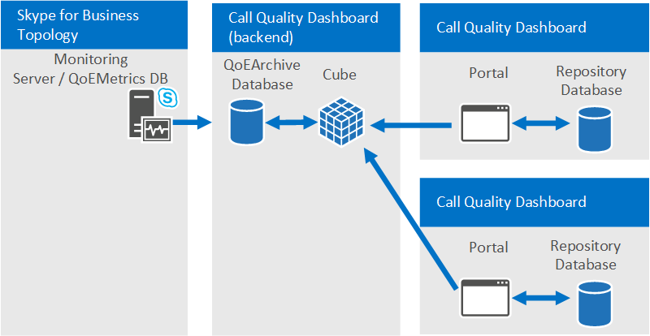

# <a name="plan-for-call-quality-dashboard-for-skype-for-business-server"></a><span data-ttu-id="a612c-103">Pianificare il dashboard per la qualità delle chiamate per Skype for Business Server</span><span class="sxs-lookup"><span data-stu-id="a612c-103">Plan for Call Quality Dashboard for Skype for Business Server</span></span> 
 
<span data-ttu-id="a612c-104">**Riepilogo:** Informazioni su cosa prendere in considerazione quando si pianifica il dashboard qualità chiamata.</span><span class="sxs-lookup"><span data-stu-id="a612c-104">**Summary:** Learn about what to consider when you plan for the Call Quality Dashboard.</span></span>
  
## <a name="overview-of-the-skype-for-business-server-call-quality-dashboard"></a><span data-ttu-id="a612c-105">Panoramica del dashboard per la qualità delle chiamate di Skype for Business Server</span><span class="sxs-lookup"><span data-stu-id="a612c-105">Overview of the Skype for Business Server Call Quality Dashboard</span></span>

<span data-ttu-id="a612c-106">Skype for Business Server Call Quality Dashboard (CQD) è un livello di Reporting al di sopra del database della qualità di esperienza nel Monitoring Server in Skype for Business Server.</span><span class="sxs-lookup"><span data-stu-id="a612c-106">The Skype for Business Server Call Quality Dashboard (CQD) is a reporting layer on top of the Quality of Experience Database in the Monitoring Server in Skype for Business Server.</span></span> <span data-ttu-id="a612c-107">In CQD viene utilizzato Microsoft SQL Server Analysis Services per fornire informazioni sull'utilizzo di aggregazione e sulla qualità delle chiamate, nonché per il filtro e il Pivoting sul set di dati.</span><span class="sxs-lookup"><span data-stu-id="a612c-107">CQD uses Microsoft SQL Server Analysis Services to provide aggregate usage and call quality information as well as for filtering and pivoting on the dataset.</span></span> <span data-ttu-id="a612c-108">Le caratteristiche di CQD includono:</span><span class="sxs-lookup"><span data-stu-id="a612c-108">CQD features include:</span></span>
  
- <span data-ttu-id="a612c-109">**Archiviazione archivistica dei dati QoE tramite il componente di archiviazione QoE di CQD.**</span><span class="sxs-lookup"><span data-stu-id="a612c-109">**Archival storage of QoE data via the QoE Archive component of CQD.**</span></span> <span data-ttu-id="a612c-110">Il componente di archiviazione QoE è in grado di archiviare i dati QoE per una durata molto più lunga rispetto a quella del server di monitoraggio.</span><span class="sxs-lookup"><span data-stu-id="a612c-110">The QoE Archive component can store QoE data for a much longer duration than the Monitoring Server can.</span></span> <span data-ttu-id="a612c-111">In questo modo è possibile eseguire il trend e la creazione di report per un massimo di sette mesi di dati alla volta, con la possibilità di scorrere la finestra dei report fino a quando non vi sono dati.</span><span class="sxs-lookup"><span data-stu-id="a612c-111">This allows for trending and reporting for up to seven months of data at a time, with the ability to slide the reporting window as far back as there is data.</span></span>
- <span data-ttu-id="a612c-112">**Reporting e analisi utilizzando la potenza e la velocità di Microsoft SQL Server Analysis Services.**</span><span class="sxs-lookup"><span data-stu-id="a612c-112">**Reporting and analysis using the power and speed of Microsoft SQL Server Analysis Services.**</span></span> <span data-ttu-id="a612c-113">CQD utilizza Microsoft SQL Analysis Services per fornire funzionalità di riepilogo, filtro e pivoting veloci per alimentare il dashboard tramite un cubo di analisi.</span><span class="sxs-lookup"><span data-stu-id="a612c-113">CQD utilizes Microsoft SQL Analysis Services to provide fast summary, filter, and pivoting capabilities to power the dashboard via an Analysis Cube.</span></span> <span data-ttu-id="a612c-114">La velocità di esecuzione dei rapporti e la possibilità di eseguire il drill-down nei dati possono ridurre drasticamente i tempi di analisi.</span><span class="sxs-lookup"><span data-stu-id="a612c-114">Reporting execution speed and the ability to drill down into the data can reduce analysis times dramatically.</span></span>
- <span data-ttu-id="a612c-115">**Nuovo schema di dati ottimizzato per i report sulla qualità delle chiamate.**</span><span class="sxs-lookup"><span data-stu-id="a612c-115">**New data schema optimized for call quality reporting.**</span></span> <span data-ttu-id="a612c-116">Il cubo ha uno schema disegnato per la creazione di report e le indagini sulla qualità vocale.</span><span class="sxs-lookup"><span data-stu-id="a612c-116">The Cube has a schema designed for voice quality reporting and investigations.</span></span> <span data-ttu-id="a612c-117">Gli utenti del portale possono concentrarsi sulle attività di creazione di report anziché capire come lo schema del database delle metriche QoE è mappato alle visualizzazioni di cui hanno bisogno.</span><span class="sxs-lookup"><span data-stu-id="a612c-117">Portal users can focus on the reporting tasks instead of figuring out how the QoE Metrics database schema maps to the views they need.</span></span> <span data-ttu-id="a612c-118">La combinazione dell'archivio QoE e del cubo fornisce un'astrazione che riduce la complessità della creazione di report e dell'analisi tramite CQD.</span><span class="sxs-lookup"><span data-stu-id="a612c-118">The combination of the QoE Archive and the Cube provides an abstraction that reduces the complexity of reporting and analysis via CQD.</span></span> <span data-ttu-id="a612c-119">Lo schema del database di archiviazione QoE contiene anche tabelle che possono essere popolate con dati specifici della distribuzione per migliorare il valore complessivo dei dati.</span><span class="sxs-lookup"><span data-stu-id="a612c-119">The QoE Archive database schema also contains tables that can be populated with deployment-specific data to enhance the overall value of the data.</span></span>
- <span data-ttu-id="a612c-120">**Progettazione report incorporata e modifica del rapporto sul posto.**</span><span class="sxs-lookup"><span data-stu-id="a612c-120">**Built-in report designer and in-place report editing.**</span></span> <span data-ttu-id="a612c-121">Il componente portale è dotato di numerosi report incorporati modellati dopo la metodologia della qualità delle chiamate.</span><span class="sxs-lookup"><span data-stu-id="a612c-121">The Portal component comes with several built-in reports modeled after the Call Quality Methodology.</span></span> <span data-ttu-id="a612c-122">Gli utenti del portale possono modificare i report e creare nuovi rapporti tramite la funzionalità di modifica del portale.</span><span class="sxs-lookup"><span data-stu-id="a612c-122">Portal users can modify the reports and create new reports via the Portal's editing functionality.</span></span>
- <span data-ttu-id="a612c-123">**Accesso API Web ai dati della struttura del report e dei cubi di analisi.**</span><span class="sxs-lookup"><span data-stu-id="a612c-123">**Web API access to the Report Structure and Analysis Cube Data.**</span></span> <span data-ttu-id="a612c-124">Il dashboard Reporting Framework non è l'unico modo per visualizzare i dati dal cubo.</span><span class="sxs-lookup"><span data-stu-id="a612c-124">The Dashboard reporting framework is not the only way to display the data from the Cube.</span></span> <span data-ttu-id="a612c-125">CQD fornisce diversi esempi di utilizzo di HTML e JavaScript per recuperare i dati dalle API Web di CQD ed eseguire il rendering dei dati in un formato personalizzato.</span><span class="sxs-lookup"><span data-stu-id="a612c-125">CQD provides several examples of using HTML and JavaScript to retrieve data from the CQD Web APIs and render the data in a custom format.</span></span> <span data-ttu-id="a612c-126">La combinazione dell'editor di report e delle API Web di CQD consente di creare rapidamente prototipi di report e layout di report personalizzati.</span><span class="sxs-lookup"><span data-stu-id="a612c-126">The combination of the Report Editor and the CQD Web APIs allows rapid prototyping of reports and custom report layout.</span></span>

> [!NOTE]
> <span data-ttu-id="a612c-127">Un amministratore può ora gestire Skype for Business Server 2019 utilizzando [CQD versione 3](https://cqd.teams.microsoft.com) (accedere con le credenziali di amministratore).</span><span class="sxs-lookup"><span data-stu-id="a612c-127">An admin can now manage Skype for Business Server 2019 using [CQD version 3](https://cqd.teams.microsoft.com) (log in with Admin credentials).</span></span> <span data-ttu-id="a612c-128">Ciò richiede un'implementazione ibrida e l'utilizzo del connettore di dati di chiamata (CDC).</span><span class="sxs-lookup"><span data-stu-id="a612c-128">This requires a hybrid implementation and the use of Call Data Connector (CDC).</span></span> <span data-ttu-id="a612c-129">Per ulteriori informazioni sull'abilitazione di CDC, vedere [Plan Call Data Connector](/SkypeForBusiness/hybrid/plan-call-data-connector) .</span><span class="sxs-lookup"><span data-stu-id="a612c-129">See [Plan Call Data Connector](/SkypeForBusiness/hybrid/plan-call-data-connector) for more information on enabling CDC.</span></span> <span data-ttu-id="a612c-130">Per la documentazione relativa a CQD versione 3, vedere [accendere e usare Call Quality dashboard per Microsoft teams e Skype for business online](/MicrosoftTeams/turning-on-and-using-call-quality-dashboard) per ulteriori informazioni su CQD versione 3.</span><span class="sxs-lookup"><span data-stu-id="a612c-130">For CQD version 3 documentation, see [Turn on and use Call Quality Dashboard for Microsoft Teams and Skype for Business Online](/MicrosoftTeams/turning-on-and-using-call-quality-dashboard) for more information about CQD version 3.</span></span>

## <a name="cqd-design-goals"></a><span data-ttu-id="a612c-131">Obiettivi di progettazione di CQD</span><span class="sxs-lookup"><span data-stu-id="a612c-131">CQD Design Goals</span></span>

<span data-ttu-id="a612c-132">CQD consente ai professionisti IT di utilizzare dati aggregati per identificare le aree di interesse nell'ambiente in cui si verificano problemi di qualità multimediale.</span><span class="sxs-lookup"><span data-stu-id="a612c-132">CQD allows IT Pros to use aggregate data to identify focus areas in their environment experiencing media quality issues.</span></span> <span data-ttu-id="a612c-133">Consente a un professionista IT di confrontare le statistiche per i diversi gruppi di utenti e identificare le tendenze e i modelli.</span><span class="sxs-lookup"><span data-stu-id="a612c-133">It allows an IT Pro to compare statistics for different groups of users and identify trends and patterns.</span></span> <span data-ttu-id="a612c-134">Non è incentrato sulla risoluzione dei singoli problemi di chiamata, ma sull'identificazione di problemi e soluzioni che si applicano a molti utenti in un determinato ambiente.</span><span class="sxs-lookup"><span data-stu-id="a612c-134">It is not focused on solving individual call issues, but on identifying problems and solutions that will apply to many users in a given environment.</span></span> 
  
## <a name="call-quality-dashboard-components"></a><span data-ttu-id="a612c-135">Componenti del dashboard per la qualità delle chiamate</span><span class="sxs-lookup"><span data-stu-id="a612c-135">Call Quality Dashboard components</span></span>

<span data-ttu-id="a612c-136">Il dashboard per la qualità delle chiamate è costituito da diversi database, processi e applicazioni Web di Microsoft SQL Agent.</span><span class="sxs-lookup"><span data-stu-id="a612c-136">The Call Quality Dashboard consists of several databases, Microsoft SQL Agent jobs, processes, and web applications.</span></span> <span data-ttu-id="a612c-137">I processi di Microsoft SQL Agent copiano periodicamente i dati dal database di metriche QoE nel database di archiviazione QoE e elaborano il cubo con i dati nel database di archiviazione QoE.</span><span class="sxs-lookup"><span data-stu-id="a612c-137">The Microsoft SQL Agent jobs periodically copy data from the QoE Metrics database into the QoE Archive database and processes the Cube with the data in the QoE Archive database.</span></span> <span data-ttu-id="a612c-138">Il database del repository archivia le definizioni di report che alimentano il portale.</span><span class="sxs-lookup"><span data-stu-id="a612c-138">The Repository database stores the report definitions that power the Portal.</span></span> <span data-ttu-id="a612c-139">Il portale fornisce l'accesso dei browser ai dati del cubo.</span><span class="sxs-lookup"><span data-stu-id="a612c-139">The Portal provides browser access to the Cube data.</span></span> 
  
<span data-ttu-id="a612c-140">I componenti di CQD, inclusi i database dell'archivio QoE, del cubo e del repository, possono essere installati nel Monitoring Server, installato nel proprio server o installati su più server.</span><span class="sxs-lookup"><span data-stu-id="a612c-140">The CQD components, including the QoE Archive, Cube, and Repository databases, can be installed on the Monitoring Server, installed on its own server, or installed across multiple servers.</span></span> <span data-ttu-id="a612c-141">Il metodo di installazione specifico dipende dalle richieste di prestazioni di CQD e dall'impatto su altri processi negli stessi server.</span><span class="sxs-lookup"><span data-stu-id="a612c-141">The particular installation method depends on the performance demands of CQD as well as impact to other processes on the same servers.</span></span> <span data-ttu-id="a612c-142">Per ulteriori informazioni, vedere la sezione "componenti e topologie per CQD" più avanti in questo articolo.</span><span class="sxs-lookup"><span data-stu-id="a612c-142">For more information, refer to the "Components and topologies for CQD" section later in this article.</span></span>
  
### <a name="architectural-overview"></a><span data-ttu-id="a612c-143">Panoramica dell'architettura</span><span class="sxs-lookup"><span data-stu-id="a612c-143">Architectural Overview</span></span>

<span data-ttu-id="a612c-144">Per riepilogare, CQD richiede gli elementi seguenti:</span><span class="sxs-lookup"><span data-stu-id="a612c-144">To summarize, CQD requires the following elements:</span></span>
  
- <span data-ttu-id="a612c-145">Due database: database di archiviazione e database dell'archivio.</span><span class="sxs-lookup"><span data-stu-id="a612c-145">Two databases: an Archive Database and a Repository Database.</span></span>
    
- <span data-ttu-id="a612c-146">Un cubo SSAS che Visualizza dati aggregati</span><span class="sxs-lookup"><span data-stu-id="a612c-146">One SSAS Cube visualizing aggregated data</span></span> 
    
- <span data-ttu-id="a612c-147">Portale Web CQD hosts IIS</span><span class="sxs-lookup"><span data-stu-id="a612c-147">IIS hosts CQD Web Portal</span></span>
    

  
<span data-ttu-id="a612c-149">La stessa architettura di CQD supporta Lync Server 2013 e Skype for business.</span><span class="sxs-lookup"><span data-stu-id="a612c-149">The same CQD architecture supports Lync Server 2013 and Skype for Business.</span></span> 
  
### <a name="cqd-and-skype-for-business-vs-lync-2013"></a><span data-ttu-id="a612c-150">CQD e Skype for business vs Lync 2013</span><span class="sxs-lookup"><span data-stu-id="a612c-150">CQD and Skype for Business vs. Lync 2013</span></span>

 <span data-ttu-id="a612c-151">Solo in un ambiente Skype for business, sono disponibili le seguenti funzionalità:</span><span class="sxs-lookup"><span data-stu-id="a612c-151">In a Skype for Business environment only, the following capabilities are available:</span></span>
  
- <span data-ttu-id="a612c-152">Wi-Fi segnalazione della potenza del segnale</span><span class="sxs-lookup"><span data-stu-id="a612c-152">Wi-Fi reporting of Signal Strength</span></span>
    
- <span data-ttu-id="a612c-153">Wi-Fi Reporting dei driver del chipset</span><span class="sxs-lookup"><span data-stu-id="a612c-153">Wi-Fi reporting of Chipset drivers</span></span>
    
- <span data-ttu-id="a612c-154">Valutare i dati delle chiamate</span><span class="sxs-lookup"><span data-stu-id="a612c-154">Rate my Call data</span></span> 
    
## <a name="information-available-through-cqd"></a><span data-ttu-id="a612c-155">Informazioni disponibili tramite CQD</span><span class="sxs-lookup"><span data-stu-id="a612c-155">Information available through CQD</span></span>

<span data-ttu-id="a612c-156">CQD è in grado di visualizzare i conteggi del flusso di condivisione applicazioni e video di Skype for Business Server e il conteggio delle chiamate valide e negative, nonché i rapporti di chiamate non valide.</span><span class="sxs-lookup"><span data-stu-id="a612c-156">CQD can show Skype for Business Server audio, video, and application sharing stream counts and count of good versus bad calls as well as ratios of bad to good calls.</span></span> <span data-ttu-id="a612c-157">Le visualizzazioni possono essere sezionate e filtrate da molte dimensioni diverse.</span><span class="sxs-lookup"><span data-stu-id="a612c-157">The views can be sliced and filtered by many different dimensions.</span></span> <span data-ttu-id="a612c-158">CQD estrae i dati dal database delle metriche QoE nel Monitoring Server.</span><span class="sxs-lookup"><span data-stu-id="a612c-158">CQD draws data from the QoE Metrics database in the Monitoring Server.</span></span> <span data-ttu-id="a612c-159">I dati vengono quindi Uniti con tutti i dati forniti dal cliente, ad esempio il mapping tra la subnet e la creazione di una rete per creare report quali "qualità chiamata per edificio" possibile.</span><span class="sxs-lookup"><span data-stu-id="a612c-159">The data is then merged with any customer-supplied data, such as network subnet-to-building mapping to make reports such as "Call Quality per Building" possible.</span></span> 
  
<span data-ttu-id="a612c-160">CQD inoltre astrae molte delle idiosincrasie dei dati QoE interni, ad esempio "chiamante" e "chiamato", in modo che l'utente possa concentrarsi sulla creazione di visualizzazioni di report su "Server" e "client".</span><span class="sxs-lookup"><span data-stu-id="a612c-160">CQD also abstracts many of the internal QoE data idiosyncrasies such as "caller" and "callee" such that the user can focus on building report views around "server" and "client".</span></span> <span data-ttu-id="a612c-161">Dopo la metodologia relativa alla qualità delle chiamate, CQD è semplificato per identificare le condizioni in cui le tasche delle chiamate povere sono in comune, uno dei principi per migliorare la qualità delle chiamate.</span><span class="sxs-lookup"><span data-stu-id="a612c-161">Following the Call Quality Methodology, CQD is streamlined to help identify the conditions that pockets of poor calls have in common—one of the tenets for improving call quality.</span></span>
  
## <a name="viewing-data-in-cqd"></a><span data-ttu-id="a612c-162">Visualizzazione dei dati in CQD</span><span class="sxs-lookup"><span data-stu-id="a612c-162">Viewing data in CQD</span></span>

<span data-ttu-id="a612c-163">I dati di CQD possono essere visualizzati tramite il portale CQD e accessibili tramite le chiamate API REST.</span><span class="sxs-lookup"><span data-stu-id="a612c-163">The CQD data can be viewed via the CQD Portal and accessed via REST API calls.</span></span>
  
### <a name="cqd-portal"></a><span data-ttu-id="a612c-164">Portale di CQD</span><span class="sxs-lookup"><span data-stu-id="a612c-164">CQD Portal</span></span>

<span data-ttu-id="a612c-165">Il portale è il modo più rapido per visualizzare i dati nel cubo.</span><span class="sxs-lookup"><span data-stu-id="a612c-165">The Portal is the fastest way to view the data in the Cube.</span></span> <span data-ttu-id="a612c-166">Il portale è dotato di numerosi rapporti incorporati che sono utilizzabili subito.</span><span class="sxs-lookup"><span data-stu-id="a612c-166">The Portal comes with several built-in reports that are usable right away.</span></span> <span data-ttu-id="a612c-167">I report incorporati sono collegati in modo strutturato per indirizzare l'utente a sezioni più piccole e successive dei dati di chiamata.</span><span class="sxs-lookup"><span data-stu-id="a612c-167">The built-in reports are linked in a structured manner to guide the user to successively smaller and smaller slices of the call data.</span></span> <span data-ttu-id="a612c-168">I report incorporati evidenziano anche i diversi modi in cui i dati possono essere visualizzati dimostrando una combinazione di grafici e tabelle con diversi pivot, filtri e misure.</span><span class="sxs-lookup"><span data-stu-id="a612c-168">The built-in reports also highlight the various different ways the data can be shown by demonstrating a combination of charts and tables with different pivots, filters, and measures.</span></span> <span data-ttu-id="a612c-169">Ogni utente che accede al portale può disporre di un proprio insieme di report che può modificare e condividere.</span><span class="sxs-lookup"><span data-stu-id="a612c-169">Each user that accesses the Portal can have his or her own set of reports that he/she can modify and share.</span></span> <span data-ttu-id="a612c-170">Per ulteriori informazioni sull'utilizzo del portale Web di CQD, vedere [Use Call Quality dashboard for Skype for Business Server](use.md).</span><span class="sxs-lookup"><span data-stu-id="a612c-170">For more information on the usage of the CQD Web Portal, see [Use Call Quality Dashboard for Skype for Business Server](use.md).</span></span>
  
<span data-ttu-id="a612c-171">Sistemi operativi supportati per il portale di CQD: Windows 8,1, Windows 8, Windows Server 2012 R2, Windows Server 2012 e Windows Server 2016 (solo Skype for Business Server 2019 CQD).</span><span class="sxs-lookup"><span data-stu-id="a612c-171">Supported Operating Systems for CQD Portal: Windows 8.1, Windows 8, Windows Server 2012 R2, Windows Server 2012 , and Windows Server 2016 (Skype for Business Server 2019 CQD only).</span></span>
  
<span data-ttu-id="a612c-172">Browser supportati per il portale di CQD: Internet Explorer 11, Internet Explorer 10 e Internet Explorer 9.</span><span class="sxs-lookup"><span data-stu-id="a612c-172">Supported Browsers for CQD Portal: Internet Explorer 11, Internet Explorer 10, and Internet Explorer 9.</span></span>
  
### <a name="rest-apis"></a><span data-ttu-id="a612c-173">API REST</span><span class="sxs-lookup"><span data-stu-id="a612c-173">REST APIs</span></span>

<span data-ttu-id="a612c-174">È inoltre possibile accedere ai dati del cubo tramite le chiamate API REST.</span><span class="sxs-lookup"><span data-stu-id="a612c-174">The Cube data can also be accessed via REST API calls.</span></span> <span data-ttu-id="a612c-175">I dati recuperati tramite le chiamate API REST possono essere sottoposte a rendering tramite pagine HTML.</span><span class="sxs-lookup"><span data-stu-id="a612c-175">The data retrieved via the REST API calls can be rendered via HTML pages.</span></span> <span data-ttu-id="a612c-176">Gli utenti possono trarre vantaggio dalla velocità di query e dallo schema di livello elevato di CQD, mentre ancora la creazione di report personalizzati è adatta alle proprie esigenze aziendali.</span><span class="sxs-lookup"><span data-stu-id="a612c-176">Users can take advantage of the query speed and the high level schema of CQD while still creating custom reports suited for their business needs.</span></span> <span data-ttu-id="a612c-177">Per ulteriori informazioni sull'API e sugli esempi, vedere [develop Call Quality dashboard for Skype for Business Server](develop.md).</span><span class="sxs-lookup"><span data-stu-id="a612c-177">For more information on the API and samples, see [Develop Call Quality Dashboard for Skype for Business Server](develop.md).</span></span> 
  
## <a name="defining-your-organizations-requirements-for-cqd"></a><span data-ttu-id="a612c-178">Definizione dei requisiti dell'organizzazione per CQD</span><span class="sxs-lookup"><span data-stu-id="a612c-178">Defining Your organization's requirements for CQD</span></span>

<span data-ttu-id="a612c-179">CQD fornisce archiviazione dei dati QoE e analisi rapida e approfondita dei dati sulla qualità delle chiamate.</span><span class="sxs-lookup"><span data-stu-id="a612c-179">CQD provides QoE data archiving and fast and deep analysis of call quality data.</span></span> <span data-ttu-id="a612c-180">La guida seguente consente di decidere quando e perché distribuire CQD.</span><span class="sxs-lookup"><span data-stu-id="a612c-180">The following guide helps you to decide when and why you would deploy CQD.</span></span>
  
### <a name="when-to-deploy-cqd"></a><span data-ttu-id="a612c-181">Quando distribuire CQD</span><span class="sxs-lookup"><span data-stu-id="a612c-181">When to deploy CQD</span></span>

 <span data-ttu-id="a612c-182">**È possibile distribuire CQD per stabilire una misura di qualità delle chiamate di base, anche se un'organizzazione non verifica problemi di qualità delle chiamate.**</span><span class="sxs-lookup"><span data-stu-id="a612c-182">**CQD can be deployed to establish a baseline call quality measurement, even if an organization doesn't experience call quality issues.**</span></span> <span data-ttu-id="a612c-183">La definizione di una misura di qualità delle chiamate di base è importante perché ogni organizzazione dispone di un diverso mix di Wi-Fi rispetto a Wired e remote rispetto ai dipendenti di Office.</span><span class="sxs-lookup"><span data-stu-id="a612c-183">Establishing a baseline call quality measurement is important because every organization has a different mix of Wi-Fi versus wired and remote versus office workers.</span></span> <span data-ttu-id="a612c-184">Quando si verificano problemi di qualità delle chiamate, le misure di qualità delle chiamate più recenti possono essere confrontate con gli intervalli di tempo precedenti.</span><span class="sxs-lookup"><span data-stu-id="a612c-184">When call quality issues arise, the most recent call quality measurements can be compared to previous time intervals.</span></span> <span data-ttu-id="a612c-185">Le funzionalità di trend di CQD consentono di rilevare facilmente le modifiche apportate alla qualità delle chiamate nel tempo.</span><span class="sxs-lookup"><span data-stu-id="a612c-185">CQD's trending features allow easy detection of changes in call quality over time.</span></span>
  
 <span data-ttu-id="a612c-186">**È possibile distribuire CQD per individuare in modo proattivo aree problematiche che potrebbero influire sulla qualità delle chiamate.**</span><span class="sxs-lookup"><span data-stu-id="a612c-186">**CQD can be deployed to proactively find problem areas that may impact call quality.**</span></span> <span data-ttu-id="a612c-187">Anche se la qualità media delle chiamate per un'organizzazione può essere conforme ai target stabiliti dall'organizzazione, potrebbero esserci sacche di problemi di qualità delle chiamate nascosti dietro metriche medie.</span><span class="sxs-lookup"><span data-stu-id="a612c-187">Even if the average call quality for an organization might meet the targets set by the organization, there could be pockets of call quality issues that are hidden behind average metrics.</span></span> <span data-ttu-id="a612c-188">CQD consente di suddividere le metriche di qualità delle chiamate da una tabella pivot di molte dimensioni nel database di QoEMetrics.</span><span class="sxs-lookup"><span data-stu-id="a612c-188">CQD allows pivot table-like breakdown of call quality metrics by many dimensions in the QoEMetrics database.</span></span> <span data-ttu-id="a612c-189">Lo spotting outliers nei gruppi peer rappresenta un modo rapido per individuare attivamente i problemi di qualità delle chiamate.</span><span class="sxs-lookup"><span data-stu-id="a612c-189">Spotting outliers in peer groups is a quick way to proactively locate call quality issues.</span></span>
  
 <span data-ttu-id="a612c-190">**CQD deve essere distribuito se nell'organizzazione sono presenti problemi di qualità delle chiamate per ridurre il tempo necessario per la risoluzione dei problemi.**</span><span class="sxs-lookup"><span data-stu-id="a612c-190">**CQD should be deployed if there are call quality issues in the organization to reduce the time needed to troubleshoot problems.**</span></span> <span data-ttu-id="a612c-191">CQD è in grado di semplificare le indagini esistenti sulla qualità delle chiamate, offrendo funzionalità di Reporting rapido e drill-down dinamico.</span><span class="sxs-lookup"><span data-stu-id="a612c-191">CQD can simplify existing call quality investigations by offering fast reporting performance and dynamic drill down capabilities.</span></span> <span data-ttu-id="a612c-192">CQD è stato creato per molti tipi di flussi di lavoro in indagini sulla qualità delle chiamate per la convalida delle riparazioni all'ambiente.</span><span class="sxs-lookup"><span data-stu-id="a612c-192">CQD is designed for many kinds of workflows in call quality investigations validation of repairs to the environment.</span></span>
  
### <a name="why-deploy-cqd"></a><span data-ttu-id="a612c-193">Perché distribuire CQD</span><span class="sxs-lookup"><span data-stu-id="a612c-193">Why deploy CQD</span></span>

 <span data-ttu-id="a612c-194">**CQD deve essere distribuito se la segnalazione QoE deve avvenire per più di 3 mesi di dati.**</span><span class="sxs-lookup"><span data-stu-id="a612c-194">**CQD should be deployed if QoE reporting needs to happen for more than 3 months of data.**</span></span> <span data-ttu-id="a612c-195">I report di database e Monitoring Server di QoEMetrics sono stati concepiti per mantenere e segnalare un piccolo set di dati.</span><span class="sxs-lookup"><span data-stu-id="a612c-195">The QoEMetrics database and monitoring server reports are designed to retain and report a small set of data.</span></span> <span data-ttu-id="a612c-196">Il database di metriche QoE è ottimizzato per gli inserimenti rapidi e pertanto le prestazioni dei report possono essere ostacolate da un elevato volume di chiamate o dall'accesso ai report in competizione con il database.</span><span class="sxs-lookup"><span data-stu-id="a612c-196">The QoE Metrics database is optimized for fast insertions, and therefore reporting performance can be impeded by large volume of calls or competing reporting access to the database.</span></span> <span data-ttu-id="a612c-197">Il database di archiviazione QoE di CQD fornisce una seconda copia dei dati della metrica QoE con funzionalità di conservazione molto più lunghe.</span><span class="sxs-lookup"><span data-stu-id="a612c-197">CQD's QoE Archive database provides a second copy of the QoE Metrics data with much longer retention capabilities.</span></span> <span data-ttu-id="a612c-198">Il portale è inoltre ottimizzato per visualizzare fino a 7 mesi di dati alla volta e può segnalare tutti i dati nell'archivio QoE in base alle esigenze.</span><span class="sxs-lookup"><span data-stu-id="a612c-198">The Portal is also optimized to show up to 7 months of data at a time and can report on all the data in the QoE Archive as needed.</span></span>
  
 <span data-ttu-id="a612c-199">**CQD deve essere distribuito se sono necessari report QoE personalizzati.**</span><span class="sxs-lookup"><span data-stu-id="a612c-199">**CQD should be deployed if custom QoE reports are needed.**</span></span> <span data-ttu-id="a612c-200">Il portale dispone di una funzionalità di editor di report per la creazione e la prototipazione dei report in modo rapido e semplice.</span><span class="sxs-lookup"><span data-stu-id="a612c-200">The Portal has a Report Editor feature for creating and prototyping reports quickly and easily.</span></span> <span data-ttu-id="a612c-201">Inoltre, rende disponibili API REST per l'accesso programmatico ai dati del cubo, consentendo la presentazione personalizzata tramite HTML/JavaScript o molti altri Framework.</span><span class="sxs-lookup"><span data-stu-id="a612c-201">It also makes available REST APIs for programmatic access to the Cube data, allowing custom presentation using HTML/JavaScript or many other frameworks.</span></span> <span data-ttu-id="a612c-202">Non è più necessario creare nuove query SQL ai fini della creazione di visualizzazioni dati personalizzate per i report.</span><span class="sxs-lookup"><span data-stu-id="a612c-202">It is no longer necessary to author new SQL queries for the purpose of creating custom data views for reporting.</span></span>
  
 <span data-ttu-id="a612c-203">**CQD deve essere distribuito se la funzionalità di Reporting QoE esistente non soddisfa la velocità o la profondità richieste dall'organizzazione.**</span><span class="sxs-lookup"><span data-stu-id="a612c-203">**CQD should be deployed if existing QoE reporting functionality does not meet the speed or depth required by the organization.**</span></span> <span data-ttu-id="a612c-204">CQD viene fornito con molti report incorporati.</span><span class="sxs-lookup"><span data-stu-id="a612c-204">CQD comes with many built-in reports.</span></span> <span data-ttu-id="a612c-205">I report sono immediatamente utili e dimostrano la graduale foratura dei dati in grado di offrire ulteriori approfondimenti a ogni livello.</span><span class="sxs-lookup"><span data-stu-id="a612c-205">The reports are immediately useful and demonstrate how progressively drilling into the data can offer additional insights at each level.</span></span> <span data-ttu-id="a612c-206">La gerarchia dei rapporti aiuta anche a gestire i numerosi rapporti in maniera logica e promuove la creazione di molti altri rapporti che sono facilmente accessibili e comprensibili.</span><span class="sxs-lookup"><span data-stu-id="a612c-206">The reports hierarchy also helps with managing the numerous reports in a logical manner and fosters creation of many more reports that are easily accessible and understandable.</span></span> <span data-ttu-id="a612c-207">CQD non offre solo velocità e flessibilità, ma è ottimizzato anche per i flussi di lavoro sviluppati dalla metodologia della qualità delle chiamate.</span><span class="sxs-lookup"><span data-stu-id="a612c-207">CQD doesn't just offer speed and flexibility but also is optimized for the workflows developed by the Call Quality Methodology.</span></span>
  
## <a name="components-and-topologies-for-cqd"></a><span data-ttu-id="a612c-208">Componenti e topologie per CQD</span><span class="sxs-lookup"><span data-stu-id="a612c-208">Components and topologies for CQD</span></span>

<span data-ttu-id="a612c-209">CQD viene fornito con diversi componenti e consente di comprendere i requisiti di ogni componente e la loro relazione tra loro per ottenere la distribuzione più semplice e ottimale dello strumento.</span><span class="sxs-lookup"><span data-stu-id="a612c-209">CQD comes with several components, and it helps to understand the requirements of each component and their relationship with each other to obtain the simplest and best performing deployment of the tool.</span></span> <span data-ttu-id="a612c-210">Nella tabella seguente viene descritto il componente dipendente per ogni componente di CQD.</span><span class="sxs-lookup"><span data-stu-id="a612c-210">The following table describes the dependent component for each CQD component.</span></span>
  

|<span data-ttu-id="a612c-211">**Nome componente**</span><span class="sxs-lookup"><span data-stu-id="a612c-211">**Component name**</span></span>|<span data-ttu-id="a612c-212">**Componente dipendente**</span><span class="sxs-lookup"><span data-stu-id="a612c-212">**Dependent component**</span></span>|
|:-----|:-----|
|<span data-ttu-id="a612c-213">Archivio QoE</span><span class="sxs-lookup"><span data-stu-id="a612c-213">QoE Archive</span></span>  <br/> |<span data-ttu-id="a612c-214">Microsoft SQL Server</span><span class="sxs-lookup"><span data-stu-id="a612c-214">Microsoft SQL Server</span></span>  <br/> |
|<span data-ttu-id="a612c-215">Cubo</span><span class="sxs-lookup"><span data-stu-id="a612c-215">Cube</span></span>  <br/> |<span data-ttu-id="a612c-216">Microsoft SQL Server Analysis Services</span><span class="sxs-lookup"><span data-stu-id="a612c-216">Microsoft SQL Server Analysis Services</span></span>  <br/> |
|<span data-ttu-id="a612c-217">Portale</span><span class="sxs-lookup"><span data-stu-id="a612c-217">Portal</span></span>  <br/> |<span data-ttu-id="a612c-218">Microsoft Information Services</span><span class="sxs-lookup"><span data-stu-id="a612c-218">Microsoft Information Services</span></span>  <br/> |
|<span data-ttu-id="a612c-219">Servizio repository (parte dell'installazione del portale)</span><span class="sxs-lookup"><span data-stu-id="a612c-219">Repository Service (part of Portal installation)</span></span>  <br/> |<span data-ttu-id="a612c-220">Microsoft SQL Server</span><span class="sxs-lookup"><span data-stu-id="a612c-220">Microsoft SQL Server</span></span>  <br/> |
   
> [!NOTE]
> <span data-ttu-id="a612c-221">Per l'archiviazione e il cubo QoE, alcune opzioni di distribuzione richiedono Business Intelligence o edizioni Enterprise di Microsoft SQL Server.</span><span class="sxs-lookup"><span data-stu-id="a612c-221">For QoE Archive and Cube, certain deployment options require Business Intelligence or Enterprise editions of Microsoft SQL Server.</span></span> <span data-ttu-id="a612c-222">Per ulteriori informazioni, vedere la sezione [requisiti dell'infrastruttura per CQD](plan.md#Infrastructure_Req) .</span><span class="sxs-lookup"><span data-stu-id="a612c-222">Refer to the [Infrastructure requirements for CQD](plan.md#Infrastructure_Req) section below for more details.</span></span>
  

  
### <a name="single-server-configuration"></a><span data-ttu-id="a612c-224">Configurazione a server singolo</span><span class="sxs-lookup"><span data-stu-id="a612c-224">Single server configuration</span></span>

<span data-ttu-id="a612c-225">Tutti i componenti di CQD e i componenti dipendenti possono essere installati in un unico computer.</span><span class="sxs-lookup"><span data-stu-id="a612c-225">All CQD components and dependent components can be installed onto one machine.</span></span> <span data-ttu-id="a612c-226">La configurazione di una singola casella è la configurazione più semplice e consente a CQD di essere indipendente.</span><span class="sxs-lookup"><span data-stu-id="a612c-226">The single box configuration is the simplest configuration and allows CQD to be self-contained.</span></span> <span data-ttu-id="a612c-227">CQD avrebbe solo bisogno di accedere al database di metriche QoE sul Monitoring Server.</span><span class="sxs-lookup"><span data-stu-id="a612c-227">CQD would just need access to the QoE Metrics database on the Monitoring Server.</span></span> <span data-ttu-id="a612c-228">Il server CQD può essere un computer autonomo, una macchina virtuale oppure può anche essere il Monitoring Server, in base alle risorse disponibili del computer host e ai requisiti di prestazioni.</span><span class="sxs-lookup"><span data-stu-id="a612c-228">The CQD Server can be a standalone machine, a virtual machine, or it can even be the Monitoring Server, depending on the available resources of the host machine and the performance requirements.</span></span> 
  
<span data-ttu-id="a612c-229">Durante l'installazione, l'utente che esegue l'installazione deve semplicemente fornire le istanze di Microsoft SQL Server e Microsoft SQL Server Analysis Services precedentemente configurate nel computer in cui deve essere installato CQD.</span><span class="sxs-lookup"><span data-stu-id="a612c-229">During installation, the user performing the installation simply needs to provide the Microsoft SQL Server and Microsoft SQL Server Analysis Services instances that have been previously set up on the machine where the CQD is to be installed.</span></span> <span data-ttu-id="a612c-230">Per ulteriori informazioni, fare riferimento a [deploy Call Quality dashboard for Skype for Business Server](deploy-0.md) .</span><span class="sxs-lookup"><span data-stu-id="a612c-230">Please refer to [Deploy Call Quality Dashboard for Skype for Business Server](deploy-0.md) for more information.</span></span>
  
### <a name="multiserver-configuration"></a><span data-ttu-id="a612c-231">Configurazione multiserver</span><span class="sxs-lookup"><span data-stu-id="a612c-231">Multiserver configuration</span></span>

<span data-ttu-id="a612c-232">In una configurazione multiserver, l'archivio QoE, il cubo e il portale possono essere tutti su computer diversi.</span><span class="sxs-lookup"><span data-stu-id="a612c-232">In a multiserver configuration, The QoE Archive, Cube, and Portal can all be on different machines.</span></span> <span data-ttu-id="a612c-233">Per la configurazione multiserver sono disponibili due utilizzi principali:</span><span class="sxs-lookup"><span data-stu-id="a612c-233">There are two main uses for the multiserver configuration:</span></span>
  
- <span data-ttu-id="a612c-234">Hosting del portale Web di CQD e del cubo di CQD su server diversi.</span><span class="sxs-lookup"><span data-stu-id="a612c-234">Hosting CQD Web Portal and CQD Cube on different servers.</span></span>
    
- <span data-ttu-id="a612c-235">Hosting di un portale di "sviluppo" separato dal portale di "produzione".</span><span class="sxs-lookup"><span data-stu-id="a612c-235">Hosting a "development" Portal separate from the "production" Portal.</span></span> 
    
  <span data-ttu-id="a612c-236">**Hosting del portale Web di CQD e del cubo di CQD su computer diversi.**</span><span class="sxs-lookup"><span data-stu-id="a612c-236">**Hosting CQD Web Portal and CQD Cube on different machines.**</span></span> <span data-ttu-id="a612c-237">Le organizzazioni che potrebbero avere i requisiti per separare il portale di CQD dall'installazione di SQL Server o che potrebbero voler combinare le edizioni di SQL Server per l'istanza di SQL Server e l'istanza di SQL Server Analysis Services possono scegliere di installare il portale di CQD e il cubo di CQD in computer diversi.</span><span class="sxs-lookup"><span data-stu-id="a612c-237">Organizations that might have requirements to separate the CQD Portal from the SQL Server installation or that might want to mix and match SQL Server editions for the SQL Server instance and SQL Server Analysis Services instance can choose to install the CQD Portal and CQD Cube on different machines.</span></span> <span data-ttu-id="a612c-238">Il componente di archiviazione QoE può anche essere il solo componente di CQD installato se l'organizzazione vuole semplicemente avere un metodo sostenibile per archiviare i dati QoE senza raggiungere limiti di prestazioni sul Monitoring Server.</span><span class="sxs-lookup"><span data-stu-id="a612c-238">The QoE Archive component can also be the sole CQD component that is installed if the organization simply wants to have a sustainable method to archive the QoE data without reaching performance limits on the Monitoring Server.</span></span>
  

  
 <span data-ttu-id="a612c-240">**Hosting di un portale di "sviluppo" separato dal portale di "produzione".**</span><span class="sxs-lookup"><span data-stu-id="a612c-240">**Hosting a "development" Portal separate from the "production" Portal.**</span></span> <span data-ttu-id="a612c-241">Le organizzazioni che sviluppano i propri report personalizzati (tramite le API REST) potrebbero preferire la distribuzione di istanze di portale aggiuntive (CQD) accanto al portale di produzione che gli utenti abituali accedono per il monitoraggio o le indagini sulla qualità delle chiamate.</span><span class="sxs-lookup"><span data-stu-id="a612c-241">Organizations that develop their own custom reports (via the REST APIs) might prefer to deploy additional (CQD) Portal instances alongside the production Portal that regular users access for call quality monitoring or investigations.</span></span> <span data-ttu-id="a612c-242">Il portale di sviluppo è in grado di isolare le modifiche apportate al portale dall'ambiente di produzione.</span><span class="sxs-lookup"><span data-stu-id="a612c-242">The development Portal can isolate any modifications to the Portal from the production environment.</span></span> <span data-ttu-id="a612c-243">I portali aggiuntivi Web possono essere distribuiti su computer diversi (illustrati di seguito) oppure distribuiti in directory Web diverse nello stesso computer (non visualizzato).</span><span class="sxs-lookup"><span data-stu-id="a612c-243">The additional web portals can be deployed on different machines (shown below) or deployed onto different web directories on the same machine (not shown).</span></span> <span data-ttu-id="a612c-244">Per eseguire quest'ultima operazione, è necessario copiare il portale Web di CQD aggiuntivo nel computer di produzione manualmente perché il processo di installazione di CQD distribuisce sempre il portale Web di CQD nel sito Web predefinito con nomi di applicazioni Web predefiniti.</span><span class="sxs-lookup"><span data-stu-id="a612c-244">To accomplish the latter, the additional CQD web portal must be copied to the production machine manually because the CQD setup process always deploys the CQD Web Portal to the default web site with predefined web application names.</span></span>
  

  
### <a name="supported-topologies"></a><span data-ttu-id="a612c-246">Topologie supportate</span><span class="sxs-lookup"><span data-stu-id="a612c-246">Supported topologies</span></span>

<span data-ttu-id="a612c-247">CQD non unisce i dati provenienti da più database di QoEMetrics, come nel caso in cui vi siano più topologie di Skype for Business Server, ognuna con un proprio Monitoring Server.</span><span class="sxs-lookup"><span data-stu-id="a612c-247">CQD does not merge data from multiple QoEMetrics databases, as is the case where there are multiple Skype for Business Server topologies, each with its own Monitoring Server.</span></span> <span data-ttu-id="a612c-248">Ogni istanza di CQD deve puntare a un database di QoEMetrics.</span><span class="sxs-lookup"><span data-stu-id="a612c-248">Each CQD instance must point to one QoEMetrics database.</span></span> <span data-ttu-id="a612c-249">Tuttavia, poiché CQD sposterà gran parte del carico di lavoro di Reporting fuori dal Monitoring Server, le organizzazioni di grandi dimensioni che necessitano di distribuire un Monitoring Server per la topologia di Skype for Business Server devono considerare l'utilizzo di un server di monitoraggio per tutte le topologie.</span><span class="sxs-lookup"><span data-stu-id="a612c-249">However, because CQD will move much of the reporting workload off of the Monitoring Server, large organizations that needed to deploy one Monitoring Server per Skype for Business Server topology should consider using one Monitoring Server for all topologies.</span></span>
  
## <a name="infrastructure-requirements-for-cqd"></a><span data-ttu-id="a612c-250">Requisiti dell'infrastruttura per CQD</span><span class="sxs-lookup"><span data-stu-id="a612c-250">Infrastructure requirements for CQD</span></span>
<span data-ttu-id="a612c-251"><a name="Infrastructure_Req"> </a></span><span class="sxs-lookup"><span data-stu-id="a612c-251"><a name="Infrastructure_Req"> </a></span></span>

<span data-ttu-id="a612c-252">CQD, inclusi tutti i componenti e i componenti dipendenti, può essere distribuito in una macchina virtuale, in un singolo computer o su più computer.</span><span class="sxs-lookup"><span data-stu-id="a612c-252">CQD, including all its components and dependent components, can be deployed on a virtual machine, a single machine, or across multiple machines.</span></span> <span data-ttu-id="a612c-253">Di seguito sono elencati i requisiti hardware e software minimi.</span><span class="sxs-lookup"><span data-stu-id="a612c-253">The minimum software and hardware requirements are listed below.</span></span> <span data-ttu-id="a612c-254">La disponibilità dei dati e le prestazioni delle query possono variare da un minuto all'altro, a seconda del numero di utenti e hardware e configurazione attivi di Skype for Business Server, per cui sono state riportate alcune misurazioni delle prestazioni.</span><span class="sxs-lookup"><span data-stu-id="a612c-254">Data availability and query performance can vary from minutes to hours, depending on the number of active Skype for Business Server users and hardware and configuration, so some performance measurements are given below.</span></span>
  
|||
|:-----|:-----|
|<span data-ttu-id="a612c-255">Per CQD 2015</span><span class="sxs-lookup"><span data-stu-id="a612c-255">For CQD 2015</span></span> <br/> |  <br/> |
|<span data-ttu-id="a612c-256">Sistemi operativi supportati </span><span class="sxs-lookup"><span data-stu-id="a612c-256">Supported Operating Systems</span></span>  <br/> |<span data-ttu-id="a612c-257">Windows Server 2008 R2, Windows Server 2012, Windows Server 2012 R2</span><span class="sxs-lookup"><span data-stu-id="a612c-257">Windows Server 2008 R2, Windows Server 2012, Windows Server 2012 R2</span></span>  <br/> |
|<span data-ttu-id="a612c-258">SQL Server supportato</span><span class="sxs-lookup"><span data-stu-id="a612c-258">Supported SQL Server</span></span>  <br/> |<span data-ttu-id="a612c-259">SQL Server 2012, SQL Server 2014, SQL Server 2016</span><span class="sxs-lookup"><span data-stu-id="a612c-259">SQL Server 2012, SQL Server 2014, SQL Server 2016</span></span>  <br/> |

|||
|:-----|:-----|
|<span data-ttu-id="a612c-260">Per CQD 2019</span><span class="sxs-lookup"><span data-stu-id="a612c-260">For CQD 2019</span></span> <br/> |  <br/> |
|<span data-ttu-id="a612c-261">Sistemi operativi supportati </span><span class="sxs-lookup"><span data-stu-id="a612c-261">Supported Operating Systems</span></span>  <br/> |<span data-ttu-id="a612c-262">Windows Server 2016, Windows Server 2019</span><span class="sxs-lookup"><span data-stu-id="a612c-262">Windows Server 2016, Windows Server 2019</span></span>  <br/> |
|<span data-ttu-id="a612c-263">SQL Server supportato</span><span class="sxs-lookup"><span data-stu-id="a612c-263">Supported SQL Server</span></span>  <br/> |<span data-ttu-id="a612c-264">SQL Server 2017, SQL Server 2019</span><span class="sxs-lookup"><span data-stu-id="a612c-264">SQL Server 2017, SQL Server 2019</span></span>  <br/> |
   
<span data-ttu-id="a612c-265">CQD utilizza Microsoft SQL Server, Microsoft SQL Server Analysis Services e Microsoft Internet Information Services in modo che i requisiti hardware e software minimi di CQD siano sostanzialmente identici a quelli dei componenti dipendenti.</span><span class="sxs-lookup"><span data-stu-id="a612c-265">CQD utilizes Microsoft SQL Server, Microsoft SQL Server Analysis Services, and Microsoft Internet Information Services so CQD's minimum hardware and software requirements are basically the same as those dependent components.</span></span> <span data-ttu-id="a612c-266">Tuttavia, in base ai requisiti dell'organizzazione relativi alla freschezza dei dati (che dipenderà in parte dal volume dei dati QoE generati dall'organizzazione) e ai costi di distribuzione, dovrebbero essere apportate ulteriori considerazioni sulla distribuzione.</span><span class="sxs-lookup"><span data-stu-id="a612c-266">However, based on the organization's requirements around data freshness (which will depend in part on the volume of QoE data the organization generates) and deployment cost, additional deployment considerations should be made.</span></span>
  
<span data-ttu-id="a612c-267">L'elaborazione dei dati in CQD è suddivisa in due fasi principali:</span><span class="sxs-lookup"><span data-stu-id="a612c-267">Data processing in CQD is separated into two main stages:</span></span> 
  
- <span data-ttu-id="a612c-268">Processo di archiviazione QoE</span><span class="sxs-lookup"><span data-stu-id="a612c-268">QoE Archive process</span></span>
    
- <span data-ttu-id="a612c-269">Elaborazione del cubo di CQD</span><span class="sxs-lookup"><span data-stu-id="a612c-269">CQD Cube processing</span></span>
    
  <span data-ttu-id="a612c-270">**Elaborazione dell'archivio QoE.**</span><span class="sxs-lookup"><span data-stu-id="a612c-270">**QoE Archive processing.**</span></span> <span data-ttu-id="a612c-271">L'attività di elaborazione dell'archivio QoE copia i dati dal database delle metriche QoE sul server di monitoraggio al database di archiviazione QoE.</span><span class="sxs-lookup"><span data-stu-id="a612c-271">The QoE Archive processing task copies data from the QoE Metrics database on the Monitoring Server to the QoE Archive database.</span></span> <span data-ttu-id="a612c-272">Esistono due situazioni in cui il tempo di elaborazione dell'attività avrebbe caratteristiche di prestazioni sostanzialmente diverse.</span><span class="sxs-lookup"><span data-stu-id="a612c-272">There are two situations where the processing time of the task would have fundamentally different performance characteristics.</span></span> <span data-ttu-id="a612c-273">Il primo è dopo l'installazione iniziale di CQD.</span><span class="sxs-lookup"><span data-stu-id="a612c-273">The first is after the initial installation of CQD.</span></span> <span data-ttu-id="a612c-274">Quando l'attività viene eseguita per la prima volta dopo un'installazione aggiornata, l'attività di elaborazione dell'archivio QoE copierà tutti i dati presenti nel database di metriche QoE nel database di archiviazione QoE.</span><span class="sxs-lookup"><span data-stu-id="a612c-274">When the task is run for the first time after a fresh installation, the QoE Archive processing task will copy all the data that is in the QoE Metrics database into QoE Archive database.</span></span> <span data-ttu-id="a612c-275">La seconda è l'elaborazione periodica dopo questo round iniziale.</span><span class="sxs-lookup"><span data-stu-id="a612c-275">The second is the periodic processing after this initial round.</span></span> <span data-ttu-id="a612c-276">L'attività di elaborazione dell'archivio QoE verrà eseguita ogni 15 minuti e elaborerà tutti i nuovi record QoE presenti nel database di metriche QoE.</span><span class="sxs-lookup"><span data-stu-id="a612c-276">The QoE Archive processing task will run every 15 minutes and process any new QoE records that are in the QoE Metrics database.</span></span> <span data-ttu-id="a612c-277">In generale, il tempo di elaborazione iniziale non è un problema perché viene eseguito solo la prima volta, quando CQD è installato.</span><span class="sxs-lookup"><span data-stu-id="a612c-277">Generally, the initial processing time is not a concern because it is run only the first time, when CQD is installed.</span></span> <span data-ttu-id="a612c-278">Tuttavia, se il server CQD è sottoposto a provisioning gravemente, questa attività può richiedere diverse ore.</span><span class="sxs-lookup"><span data-stu-id="a612c-278">However, if the CQD server is severely under-provisioned, this task can take several hours.</span></span> <span data-ttu-id="a612c-279">Fare riferimento alla tabella seguente, ad esempio tempi di elaborazione dell'archivio QoE iniziali.</span><span class="sxs-lookup"><span data-stu-id="a612c-279">Refer to the table below for example initial QoE Archive processing times.</span></span>
  
  <span data-ttu-id="a612c-280">**Elaborazione dei cubi di CQD.**</span><span class="sxs-lookup"><span data-stu-id="a612c-280">**CQD Cube processing.**</span></span> <span data-ttu-id="a612c-281">L'attività di elaborazione del cubo aggrega i dati dal database di archivio QoE nel cubo.</span><span class="sxs-lookup"><span data-stu-id="a612c-281">The Cube processing task aggregates the data from the QoE Archive database into the Cube.</span></span> <span data-ttu-id="a612c-282">Il tempo di elaborazione iniziale del cubo e il successivo tempo di elaborazione del cubo sono determinati dall'edizione SQL Server Analysis Services utilizzata per il cubo di CQD.</span><span class="sxs-lookup"><span data-stu-id="a612c-282">The initial cube processing time and subsequent cube processing time are determined by the SQL Server Analysis Services edition used for the CQD Cube.</span></span> <span data-ttu-id="a612c-283">Se viene utilizzata la versione Standard Edition, non vi è alcuna differenza tra il tempo di elaborazione del cubo iniziale e quello successivo, perché ogni volta che si aggiornano i dati del cubo, sarà sempre un'elaborazione completa di tutti i dati disponibili.</span><span class="sxs-lookup"><span data-stu-id="a612c-283">If the Standard edition is used, there is no difference between the initial cube processing time and the subsequent cube processing time because each time the Cube data is refreshed, it will always be a full processing of all available data.</span></span> <span data-ttu-id="a612c-284">Questo significa che il tempo di elaborazione del cubo aumenta man mano che aumenta la quantità di dati nel database di archiviazione QoE. Poiché la Business Intelligence Edition e Enterprise Edition di SQL Server dispongono del supporto delle partizioni, se viene utilizzata una delle edizioni, solo l'esecuzione iniziale elaborerà tutti i dati nel database di archiviazione QoE.</span><span class="sxs-lookup"><span data-stu-id="a612c-284">(This means that the Cube processing time increases as the amount of data in the QoE Archive database increases.) Because the Business Intelligence Edition and Enterprise Edition of SQL Server have partition support, if either edition is used, only the initial run will process all data in the QoE Archive database.</span></span> <span data-ttu-id="a612c-285">Nelle esecuzioni successive, quando l'attività viene attivata ogni 15 minuti, l'attività elaborerà solo i nuovi record aggiunti al database di archiviazione QoE dall'ultima volta che l'attività è stata eseguita.</span><span class="sxs-lookup"><span data-stu-id="a612c-285">In subsequent runs, when the task is triggered every 15 minutes, the task will only process the new records added to the QoE Archive database since the last time the task was run.</span></span> <span data-ttu-id="a612c-286">Una volta al giorno, vi sarà anche un'elaborazione completa sulla partizione contenente i dati del mese corrente.</span><span class="sxs-lookup"><span data-stu-id="a612c-286">Once a day, there will also be a full processing on the partition that contains the current month's data.</span></span>
  
<span data-ttu-id="a612c-287">Le caratteristiche del computer fisico possono influire sulle prestazioni di CQD e sulle funzionalità software disponibili nei componenti di SQL Server.</span><span class="sxs-lookup"><span data-stu-id="a612c-287">The physical machine characteristics can affect CQD performance as well as the software features that are available from the SQL Server components.</span></span> <span data-ttu-id="a612c-288">Il componente di archiviazione QoE avrà un maggiore utilizzo del disco rispetto ad altri componenti, mentre il componente cubo avrà un numero maggiore di CPU e memoria intensiva.</span><span class="sxs-lookup"><span data-stu-id="a612c-288">The QoE Archive component will be more disk-intensive compared to other components, whereas the Cube component will be more CPU and memory intensive.</span></span> <span data-ttu-id="a612c-289">Tutti questi fattori contribuiscono alla durata complessiva dell'elaborazione dei dati di CQD, che influiscono direttamente sulla disponibilità e sulla freschezza dei dati.</span><span class="sxs-lookup"><span data-stu-id="a612c-289">All of these factors contribute to CQD's total data processing time, which directly affects data freshness and availability.</span></span> <span data-ttu-id="a612c-290">Le organizzazioni devono prendere decisioni sull'hardware e il software in base alle esigenze dell'organizzazione.</span><span class="sxs-lookup"><span data-stu-id="a612c-290">Organizations should make decisions on the hardware and software based on the individual needs of the organization.</span></span> 
  
### <a name="tested-hardware-configurations"></a><span data-ttu-id="a612c-291">Configurazioni hardware testate</span><span class="sxs-lookup"><span data-stu-id="a612c-291">Tested Hardware Configurations</span></span>

<span data-ttu-id="a612c-292">In questa sezione si presuppone la presenza di un singolo database di QoEMetrics nell'ambiente.</span><span class="sxs-lookup"><span data-stu-id="a612c-292">This section makes the assumption that there is a single QoEMetrics DB in the environment.</span></span> 
  
<span data-ttu-id="a612c-293">**Profili del computer**</span><span class="sxs-lookup"><span data-stu-id="a612c-293">**Machine profiles**</span></span>

|<span data-ttu-id="a612c-294">**Computer**</span><span class="sxs-lookup"><span data-stu-id="a612c-294">**Machine**</span></span>|<span data-ttu-id="a612c-295">**Core della CPU**</span><span class="sxs-lookup"><span data-stu-id="a612c-295">**CPU Cores**</span></span>|<span data-ttu-id="a612c-296">**RAM**</span><span class="sxs-lookup"><span data-stu-id="a612c-296">**RAM**</span></span>|<span data-ttu-id="a612c-297">**Archivio QoE e cubo sullo stesso disco**</span><span class="sxs-lookup"><span data-stu-id="a612c-297">**QoE Archive and Cube on same disk**</span></span>|<span data-ttu-id="a612c-298">**Archivio QoE e SQL Temp DB sullo stesso disco**</span><span class="sxs-lookup"><span data-stu-id="a612c-298">**QoE Archive and SQL Temp DB on same disk**</span></span>|
|:-----|:-----|:-----|:-----|:-----|
|<span data-ttu-id="a612c-299">Macchina virtuale</span><span class="sxs-lookup"><span data-stu-id="a612c-299">Virtual machine</span></span>  <br/> |<span data-ttu-id="a612c-300">4 </span><span class="sxs-lookup"><span data-stu-id="a612c-300">4</span></span>  <br/> |<span data-ttu-id="a612c-301">7 GB</span><span class="sxs-lookup"><span data-stu-id="a612c-301">7 GB</span></span>  <br/> |<span data-ttu-id="a612c-302">Sì</span><span class="sxs-lookup"><span data-stu-id="a612c-302">Yes</span></span>  <br/> |<span data-ttu-id="a612c-303">Sì</span><span class="sxs-lookup"><span data-stu-id="a612c-303">Yes</span></span>  <br/> |
|<span data-ttu-id="a612c-304">4 core</span><span class="sxs-lookup"><span data-stu-id="a612c-304">4 core</span></span>  <br/> |<span data-ttu-id="a612c-305">4 </span><span class="sxs-lookup"><span data-stu-id="a612c-305">4</span></span>  <br/> |<span data-ttu-id="a612c-306">20 GB</span><span class="sxs-lookup"><span data-stu-id="a612c-306">20 GB</span></span>  <br/> |<span data-ttu-id="a612c-307">Sì</span><span class="sxs-lookup"><span data-stu-id="a612c-307">Yes</span></span>  <br/> |<span data-ttu-id="a612c-308">No</span><span class="sxs-lookup"><span data-stu-id="a612c-308">No</span></span>  <br/> |
|<span data-ttu-id="a612c-309">8 core</span><span class="sxs-lookup"><span data-stu-id="a612c-309">8 core</span></span>  <br/> |<span data-ttu-id="a612c-310">8 </span><span class="sxs-lookup"><span data-stu-id="a612c-310">8</span></span>  <br/> |<span data-ttu-id="a612c-311">32 GB</span><span class="sxs-lookup"><span data-stu-id="a612c-311">32 GB</span></span>  <br/> |<span data-ttu-id="a612c-312">Sì</span><span class="sxs-lookup"><span data-stu-id="a612c-312">Yes</span></span>  <br/> |<span data-ttu-id="a612c-313">No</span><span class="sxs-lookup"><span data-stu-id="a612c-313">No</span></span>  <br/> |
|<span data-ttu-id="a612c-314">16 core</span><span class="sxs-lookup"><span data-stu-id="a612c-314">16 core</span></span>  <br/> |<span data-ttu-id="a612c-315">16 </span><span class="sxs-lookup"><span data-stu-id="a612c-315">16</span></span>  <br/> |<span data-ttu-id="a612c-316">128 GB</span><span class="sxs-lookup"><span data-stu-id="a612c-316">128 GB</span></span>  <br/> |<span data-ttu-id="a612c-317">No</span><span class="sxs-lookup"><span data-stu-id="a612c-317">No</span></span>  <br/> |<span data-ttu-id="a612c-318">No</span><span class="sxs-lookup"><span data-stu-id="a612c-318">No</span></span>  <br/> |
   
<span data-ttu-id="a612c-319">**Risultati delle prestazioni**</span><span class="sxs-lookup"><span data-stu-id="a612c-319">**Performance results**</span></span>

|<span data-ttu-id="a612c-320">**Computer**</span><span class="sxs-lookup"><span data-stu-id="a612c-320">**Machine**</span></span>|<span data-ttu-id="a612c-321">**Metriche QoE dimensioni DB**</span><span class="sxs-lookup"><span data-stu-id="a612c-321">**QoE metrics DB size**</span></span>|<span data-ttu-id="a612c-322">**Partizioni SQL**</span><span class="sxs-lookup"><span data-stu-id="a612c-322">**SQL partitions**</span></span>|<span data-ttu-id="a612c-323">**Tipo di disco**</span><span class="sxs-lookup"><span data-stu-id="a612c-323">**Disk type**</span></span>|<span data-ttu-id="a612c-324">**Numero di flussi**</span><span class="sxs-lookup"><span data-stu-id="a612c-324">**Number of streams**</span></span>|<span data-ttu-id="a612c-325">**Processo di archiviazione iniziale**</span><span class="sxs-lookup"><span data-stu-id="a612c-325">**Initial Archive process**</span></span>|<span data-ttu-id="a612c-326">**Processo iniziale del cubo**</span><span class="sxs-lookup"><span data-stu-id="a612c-326">**Initial Cube process**</span></span>|<span data-ttu-id="a612c-327">**Processo di archiviazione successivo**</span><span class="sxs-lookup"><span data-stu-id="a612c-327">**Subsequent Archive process**</span></span>|<span data-ttu-id="a612c-328">**Processo di cubo successivo**</span><span class="sxs-lookup"><span data-stu-id="a612c-328">**Subsequent Cube process**</span></span>|
|:-----|:-----|:-----|:-----|:-----|:-----|:-----|:-----|:-----|
|<span data-ttu-id="a612c-329">Macchina virtuale</span><span class="sxs-lookup"><span data-stu-id="a612c-329">Virtual machine</span></span>  <br/> |<span data-ttu-id="a612c-330">900 MB</span><span class="sxs-lookup"><span data-stu-id="a612c-330">900 MB</span></span>  <br/> |<span data-ttu-id="a612c-331">Singolo</span><span class="sxs-lookup"><span data-stu-id="a612c-331">Single</span></span>  <br/> |<span data-ttu-id="a612c-332">VHD (dimensioni variabili)</span><span class="sxs-lookup"><span data-stu-id="a612c-332">VHD (variable-size)</span></span>  <br/> |<span data-ttu-id="a612c-333">.5 M</span><span class="sxs-lookup"><span data-stu-id="a612c-333">.5 M</span></span>  <br/> |<span data-ttu-id="a612c-334">30 m</span><span class="sxs-lookup"><span data-stu-id="a612c-334">30 m</span></span>  <br/> |<span data-ttu-id="a612c-335">2 m</span><span class="sxs-lookup"><span data-stu-id="a612c-335">2 m</span></span>  <br/> |<span data-ttu-id="a612c-336">30 s</span><span class="sxs-lookup"><span data-stu-id="a612c-336">30 s</span></span>  <br/> |<span data-ttu-id="a612c-337">1 m</span><span class="sxs-lookup"><span data-stu-id="a612c-337">1 m</span></span>  <br/> |
|<span data-ttu-id="a612c-338">Macchina virtuale</span><span class="sxs-lookup"><span data-stu-id="a612c-338">Virtual machine</span></span>  <br/> |<span data-ttu-id="a612c-339">9 GB</span><span class="sxs-lookup"><span data-stu-id="a612c-339">9 GB</span></span>  <br/> |<span data-ttu-id="a612c-340">Singolo</span><span class="sxs-lookup"><span data-stu-id="a612c-340">Single</span></span>  <br/> |<span data-ttu-id="a612c-341">VHD (dimensioni variabili)</span><span class="sxs-lookup"><span data-stu-id="a612c-341">VHD (variable-size)</span></span>  <br/> |<span data-ttu-id="a612c-342">5 M</span><span class="sxs-lookup"><span data-stu-id="a612c-342">5 M</span></span>  <br/> |<span data-ttu-id="a612c-343">4 h</span><span class="sxs-lookup"><span data-stu-id="a612c-343">4 h</span></span>  <br/> |<span data-ttu-id="a612c-344">15 m</span><span class="sxs-lookup"><span data-stu-id="a612c-344">15 m</span></span>  <br/> |<span data-ttu-id="a612c-345">1 m</span><span class="sxs-lookup"><span data-stu-id="a612c-345">1 m</span></span>  <br/> |<span data-ttu-id="a612c-346">5 m</span><span class="sxs-lookup"><span data-stu-id="a612c-346">5 m</span></span>  <br/> |
|<span data-ttu-id="a612c-347">Macchina virtuale</span><span class="sxs-lookup"><span data-stu-id="a612c-347">Virtual machine</span></span>  <br/> |<span data-ttu-id="a612c-348">9 GB</span><span class="sxs-lookup"><span data-stu-id="a612c-348">9 GB</span></span>  <br/> |<span data-ttu-id="a612c-349">Singolo</span><span class="sxs-lookup"><span data-stu-id="a612c-349">Single</span></span>  <br/> |<span data-ttu-id="a612c-350">VHD (dimensioni fisse)</span><span class="sxs-lookup"><span data-stu-id="a612c-350">VHD (fixed-size)</span></span>  <br/> |<span data-ttu-id="a612c-351">5 M</span><span class="sxs-lookup"><span data-stu-id="a612c-351">5 M</span></span>  <br/> |<span data-ttu-id="a612c-352">2 h</span><span class="sxs-lookup"><span data-stu-id="a612c-352">2 h</span></span>  <br/> |<span data-ttu-id="a612c-353">5 m</span><span class="sxs-lookup"><span data-stu-id="a612c-353">5 m</span></span>  <br/> |<span data-ttu-id="a612c-354">1 m</span><span class="sxs-lookup"><span data-stu-id="a612c-354">1 m</span></span>  <br/> |<span data-ttu-id="a612c-355">5 m</span><span class="sxs-lookup"><span data-stu-id="a612c-355">5 m</span></span>  <br/> |
|<span data-ttu-id="a612c-356">Macchina virtuale</span><span class="sxs-lookup"><span data-stu-id="a612c-356">Virtual machine</span></span>  <br/> |<span data-ttu-id="a612c-357">30 + GB</span><span class="sxs-lookup"><span data-stu-id="a612c-357">30+ GB</span></span>  <br/> |<span data-ttu-id="a612c-358">Singolo</span><span class="sxs-lookup"><span data-stu-id="a612c-358">Single</span></span>  <br/> |<span data-ttu-id="a612c-359">VHD (dimensioni fisse)</span><span class="sxs-lookup"><span data-stu-id="a612c-359">VHD (fixed-size)</span></span>  <br/> |<span data-ttu-id="a612c-360">10 M</span><span class="sxs-lookup"><span data-stu-id="a612c-360">10 M</span></span>  <br/> |<span data-ttu-id="a612c-361">15 h</span><span class="sxs-lookup"><span data-stu-id="a612c-361">15 h</span></span>  <br/> |<span data-ttu-id="a612c-362">20 m</span><span class="sxs-lookup"><span data-stu-id="a612c-362">20 m</span></span>  <br/> |<span data-ttu-id="a612c-363">2 m</span><span class="sxs-lookup"><span data-stu-id="a612c-363">2 m</span></span>  <br/> |<span data-ttu-id="a612c-364">45 m</span><span class="sxs-lookup"><span data-stu-id="a612c-364">45 m</span></span>  <br/> |
|<span data-ttu-id="a612c-365">8 core</span><span class="sxs-lookup"><span data-stu-id="a612c-365">8 core</span></span>  <br/> |<span data-ttu-id="a612c-366">9 GB</span><span class="sxs-lookup"><span data-stu-id="a612c-366">9 GB</span></span>  <br/> |<span data-ttu-id="a612c-367">Singolo</span><span class="sxs-lookup"><span data-stu-id="a612c-367">Single</span></span>  <br/> |<span data-ttu-id="a612c-368">Più dischi</span><span class="sxs-lookup"><span data-stu-id="a612c-368">Multiple Disks</span></span>  <br/> |<span data-ttu-id="a612c-369">5 M</span><span class="sxs-lookup"><span data-stu-id="a612c-369">5 M</span></span>  <br/> |<span data-ttu-id="a612c-370">2 h</span><span class="sxs-lookup"><span data-stu-id="a612c-370">2 h</span></span>  <br/> |<span data-ttu-id="a612c-371">5 m</span><span class="sxs-lookup"><span data-stu-id="a612c-371">5 m</span></span>  <br/> |<span data-ttu-id="a612c-372">25 s</span><span class="sxs-lookup"><span data-stu-id="a612c-372">25 s</span></span>  <br/> |<span data-ttu-id="a612c-373">5 m</span><span class="sxs-lookup"><span data-stu-id="a612c-373">5 m</span></span>  <br/> |
|<span data-ttu-id="a612c-374">8 core</span><span class="sxs-lookup"><span data-stu-id="a612c-374">8 core</span></span>  <br/> |<span data-ttu-id="a612c-375">9 GB</span><span class="sxs-lookup"><span data-stu-id="a612c-375">9 GB</span></span>  <br/> |<span data-ttu-id="a612c-376">Multiplo</span><span class="sxs-lookup"><span data-stu-id="a612c-376">Multiple</span></span>  <br/> |<span data-ttu-id="a612c-377">Più dischi</span><span class="sxs-lookup"><span data-stu-id="a612c-377">Multiple Disks</span></span>  <br/> |<span data-ttu-id="a612c-378">5 M</span><span class="sxs-lookup"><span data-stu-id="a612c-378">5 M</span></span>  <br/> |<span data-ttu-id="a612c-379">2 h</span><span class="sxs-lookup"><span data-stu-id="a612c-379">2 h</span></span>  <br/> |<span data-ttu-id="a612c-380">15 m</span><span class="sxs-lookup"><span data-stu-id="a612c-380">15 m</span></span>  <br/> |<span data-ttu-id="a612c-381">35 s</span><span class="sxs-lookup"><span data-stu-id="a612c-381">35 s</span></span>  <br/> |<span data-ttu-id="a612c-382">2 m</span><span class="sxs-lookup"><span data-stu-id="a612c-382">2 m</span></span>  <br/> |
|<span data-ttu-id="a612c-383">8 core</span><span class="sxs-lookup"><span data-stu-id="a612c-383">8 core</span></span>  <br/> |<span data-ttu-id="a612c-384">30 + GB</span><span class="sxs-lookup"><span data-stu-id="a612c-384">30+ GB</span></span>  <br/> |<span data-ttu-id="a612c-385">Singolo</span><span class="sxs-lookup"><span data-stu-id="a612c-385">Single</span></span>  <br/> |<span data-ttu-id="a612c-386">Più dischi</span><span class="sxs-lookup"><span data-stu-id="a612c-386">Multiple Disks</span></span>  <br/> |<span data-ttu-id="a612c-387">20 M</span><span class="sxs-lookup"><span data-stu-id="a612c-387">20 M</span></span>  <br/> |<span data-ttu-id="a612c-388">9 h</span><span class="sxs-lookup"><span data-stu-id="a612c-388">9 h</span></span>  <br/> |<span data-ttu-id="a612c-389">20 m</span><span class="sxs-lookup"><span data-stu-id="a612c-389">20 m</span></span>  <br/> |<span data-ttu-id="a612c-390">1 m</span><span class="sxs-lookup"><span data-stu-id="a612c-390">1 m</span></span>  <br/> |<span data-ttu-id="a612c-391">20 m</span><span class="sxs-lookup"><span data-stu-id="a612c-391">20 m</span></span>  <br/> |
|<span data-ttu-id="a612c-392">8 core</span><span class="sxs-lookup"><span data-stu-id="a612c-392">8 core</span></span>  <br/> |<span data-ttu-id="a612c-393">30 + GB</span><span class="sxs-lookup"><span data-stu-id="a612c-393">30+ GB</span></span>  <br/> |<span data-ttu-id="a612c-394">Multiplo</span><span class="sxs-lookup"><span data-stu-id="a612c-394">Multiple</span></span>  <br/> |<span data-ttu-id="a612c-395">Più dischi</span><span class="sxs-lookup"><span data-stu-id="a612c-395">Multiple Disks</span></span>  <br/> |<span data-ttu-id="a612c-396">20 M</span><span class="sxs-lookup"><span data-stu-id="a612c-396">20 M</span></span>  <br/> |<span data-ttu-id="a612c-397">9 h</span><span class="sxs-lookup"><span data-stu-id="a612c-397">9 h</span></span>  <br/> |<span data-ttu-id="a612c-398">30 m</span><span class="sxs-lookup"><span data-stu-id="a612c-398">30 m</span></span>  <br/> |<span data-ttu-id="a612c-399">2 m</span><span class="sxs-lookup"><span data-stu-id="a612c-399">2 m</span></span>  <br/> |<span data-ttu-id="a612c-400">2 m</span><span class="sxs-lookup"><span data-stu-id="a612c-400">2 m</span></span>  <br/> |
|<span data-ttu-id="a612c-401">4 core</span><span class="sxs-lookup"><span data-stu-id="a612c-401">4 core</span></span>  <br/> |<span data-ttu-id="a612c-402">200 GB</span><span class="sxs-lookup"><span data-stu-id="a612c-402">200 GB</span></span>  <br/> |<span data-ttu-id="a612c-403">Singolo</span><span class="sxs-lookup"><span data-stu-id="a612c-403">Single</span></span>  <br/> |<span data-ttu-id="a612c-404">Più dischi</span><span class="sxs-lookup"><span data-stu-id="a612c-404">Multiple Disks</span></span>  <br/> |<span data-ttu-id="a612c-405">125 M</span><span class="sxs-lookup"><span data-stu-id="a612c-405">125 M</span></span>  <br/> |<span data-ttu-id="a612c-406">6 + giorni</span><span class="sxs-lookup"><span data-stu-id="a612c-406">6+ days</span></span>  <br/> |<span data-ttu-id="a612c-407">7 h</span><span class="sxs-lookup"><span data-stu-id="a612c-407">7 h</span></span>  <br/> |<span data-ttu-id="a612c-408">2 m</span><span class="sxs-lookup"><span data-stu-id="a612c-408">2 m</span></span>  <br/> |<span data-ttu-id="a612c-409">6 h</span><span class="sxs-lookup"><span data-stu-id="a612c-409">6 h</span></span>  <br/> |
|<span data-ttu-id="a612c-410">16 core</span><span class="sxs-lookup"><span data-stu-id="a612c-410">16 core</span></span>  <br/> |<span data-ttu-id="a612c-411">500 GB</span><span class="sxs-lookup"><span data-stu-id="a612c-411">500 GB</span></span>  <br/> |<span data-ttu-id="a612c-412">Multiplo</span><span class="sxs-lookup"><span data-stu-id="a612c-412">Multiple</span></span>  <br/> |<span data-ttu-id="a612c-413">Mandrini multipli</span><span class="sxs-lookup"><span data-stu-id="a612c-413">Multiple Spindles</span></span>  <br/> |<span data-ttu-id="a612c-414">250 M</span><span class="sxs-lookup"><span data-stu-id="a612c-414">250 M</span></span>  <br/> |<span data-ttu-id="a612c-415">8 giorni</span><span class="sxs-lookup"><span data-stu-id="a612c-415">8 days</span></span>  <br/> |<span data-ttu-id="a612c-416">2 h</span><span class="sxs-lookup"><span data-stu-id="a612c-416">2 h</span></span>  <br/> |<span data-ttu-id="a612c-417">2 m</span><span class="sxs-lookup"><span data-stu-id="a612c-417">2 m</span></span>  <br/> |<span data-ttu-id="a612c-418">10 m</span><span class="sxs-lookup"><span data-stu-id="a612c-418">10 m</span></span>  <br/> |
   
<span data-ttu-id="a612c-419">\*Non è previsto che vengano rilevate nelle distribuzioni effettive, poiché il database di metriche QoE dovrebbe avere rispettivamente 9 e 18 mesi di dati, ma sono forniti qui per completezza.</span><span class="sxs-lookup"><span data-stu-id="a612c-419">\*These are not expected to be encountered in real deployments because the QoE Metrics database would have to have 9 and 18 months of data, respectively, but they're provided here for completeness.</span></span>
  
### <a name="service-account-requirements"></a><span data-ttu-id="a612c-420">Requisiti per gli account di servizio</span><span class="sxs-lookup"><span data-stu-id="a612c-420">Service Account Requirements</span></span>

<span data-ttu-id="a612c-421">Sarà necessario un account (con accesso in lettura a QoEMetrics) che può essere utilizzato dall'agente SQL sul server CQD per l'importazione dei dati in QoEArchiveDB.</span><span class="sxs-lookup"><span data-stu-id="a612c-421">You will need an account (with read access to QoEMetrics) that the SQL Agent on the CQD Server can use for importing data to the QoEArchiveDB.</span></span>
  
<span data-ttu-id="a612c-422">Potrebbe anche essere necessario configurare un account separato per un processo SSAS per estrarre i dati da QoEArchiveDB (processo facoltativo).</span><span class="sxs-lookup"><span data-stu-id="a612c-422">You may also need to configure a separate account for an SSAS Job to pull data from QoEArchiveDB (this is an optional process).</span></span>
  
<span data-ttu-id="a612c-423">IIS più comunemente utilizza il servizio di rete come identità del pool di applicazioni, ma può essere configurato per un account di servizio.</span><span class="sxs-lookup"><span data-stu-id="a612c-423">IIS most commonly uses Network Service as App Pool Identity, but can be configured to a Service Account.</span></span>
  
### <a name="portal-access-control"></a><span data-ttu-id="a612c-424">Controllo di accesso al portale</span><span class="sxs-lookup"><span data-stu-id="a612c-424">Portal Access Control</span></span>

<span data-ttu-id="a612c-425">Per impostazione predefinita, qualsiasi utente autenticato ha accesso.</span><span class="sxs-lookup"><span data-stu-id="a612c-425">By default, any authenticated user has access.</span></span> <span data-ttu-id="a612c-426">Questo può essere modificato tramite le regole di autorizzazione di IIS per limitare a un gruppo specifico.</span><span class="sxs-lookup"><span data-stu-id="a612c-426">This can be changed by using IIS Authorization rules to restrict to a specific group.</span></span>
  
### <a name="pre-install-requirements"></a><span data-ttu-id="a612c-427">Requisiti di preinstallazione</span><span class="sxs-lookup"><span data-stu-id="a612c-427">Pre-Install Requirements</span></span>

<span data-ttu-id="a612c-428">Queste istruzioni presuppongono che un database di metriche QoE sia già stato installato e che sia in esecuzione da qualche parte nella topologia di Skype for Business Server.</span><span class="sxs-lookup"><span data-stu-id="a612c-428">These instructions assume that a QoE Metrics database has already been installed and is running somewhere in the Skype for Business Server topology.</span></span>
  
#### <a name="hardware-requirements"></a><span data-ttu-id="a612c-429">Requisiti hardware</span><span class="sxs-lookup"><span data-stu-id="a612c-429">Hardware Requirements</span></span>

<span data-ttu-id="a612c-430">CQD utilizza Microsoft SQL Server, Microsoft SQL Analysis Server e Microsoft Internet Information Server in modo che i requisiti hardware e software minimi di CQD siano sostanzialmente identici a quelli dei componenti dipendenti.</span><span class="sxs-lookup"><span data-stu-id="a612c-430">CQD utilizes Microsoft SQL Server, Microsoft SQL Analysis Server, and Microsoft Internet Information Server so CQD's minimum hardware and software requirements are basically the same as those dependent components.</span></span> <span data-ttu-id="a612c-431">Tuttavia, in base ai requisiti dell'organizzazione relativi alla freschezza dei dati (che dipenderà in parte dal volume dei dati QoE generati dall'organizzazione) e ai costi di distribuzione, dovrebbero essere apportate ulteriori considerazioni sulla distribuzione.</span><span class="sxs-lookup"><span data-stu-id="a612c-431">However, based on the organization's requirements around data freshness (which will depend in part on the volume of QoE data the organization generates) and deployment cost, additional deployment considerations should be made.</span></span>
  
#### <a name="software-requirements"></a><span data-ttu-id="a612c-432">Requisiti software</span><span class="sxs-lookup"><span data-stu-id="a612c-432">Software Requirements</span></span>

<span data-ttu-id="a612c-433">Per CQD sono necessari i sistemi operativi seguenti:</span><span class="sxs-lookup"><span data-stu-id="a612c-433">The following operating systems are required for CQD:</span></span>
  
- <span data-ttu-id="a612c-434">Windows Server 2008 R2 con IIS 7,5</span><span class="sxs-lookup"><span data-stu-id="a612c-434">Windows Server 2008 R2 with IIS 7.5</span></span>
    
- <span data-ttu-id="a612c-435">Windows Server 2012 con IIS 8,0</span><span class="sxs-lookup"><span data-stu-id="a612c-435">Windows Server 2012 with IIS 8.0</span></span>
    
- <span data-ttu-id="a612c-436">Windows Server 2012 R2 con IIS 8,5</span><span class="sxs-lookup"><span data-stu-id="a612c-436">Windows Server 2012 R2 with IIS 8.5</span></span>

- <span data-ttu-id="a612c-437">Windows Server 2016 con IIS 10,0 (solo per CQD di Skype for Business Server 2019)</span><span class="sxs-lookup"><span data-stu-id="a612c-437">Windows Server 2016 with IIS 10.0 (Skype for Business Server 2019 CQD only)</span></span>

- <span data-ttu-id="a612c-438">Windows Server 2019 (solo CQD di Skype for Business Server 2019)</span><span class="sxs-lookup"><span data-stu-id="a612c-438">Windows Server 2019 (Skype for Business Server 2019 CQD only)</span></span>
    
<span data-ttu-id="a612c-439">Di seguito sono riportati i servizi ruolo IIS necessari (in ordine gerarchico):</span><span class="sxs-lookup"><span data-stu-id="a612c-439">The following are the required IIS role services (in hierarchical order):</span></span>
  
- <span data-ttu-id="a612c-440">Server Web</span><span class="sxs-lookup"><span data-stu-id="a612c-440">Web Server</span></span>
    
  - <span data-ttu-id="a612c-441">Caratteristiche HTTP comuni</span><span class="sxs-lookup"><span data-stu-id="a612c-441">Common HTTP Features</span></span>
    
  - <span data-ttu-id="a612c-442">Contenuto statico</span><span class="sxs-lookup"><span data-stu-id="a612c-442">Static Content</span></span>
    
  - <span data-ttu-id="a612c-443">Documento predefinito</span><span class="sxs-lookup"><span data-stu-id="a612c-443">Default Document</span></span>
    
  - <span data-ttu-id="a612c-444">Sviluppo di applicazioni</span><span class="sxs-lookup"><span data-stu-id="a612c-444">Application Development</span></span>
    
  - <span data-ttu-id="a612c-445">ASP.NET</span><span class="sxs-lookup"><span data-stu-id="a612c-445">ASP.NET</span></span>
    
  - <span data-ttu-id="a612c-446">Filtri ISAPI</span><span class="sxs-lookup"><span data-stu-id="a612c-446">ISAPI Filters</span></span>
    
  - <span data-ttu-id="a612c-447">Diagnostica di integrità &amp;</span><span class="sxs-lookup"><span data-stu-id="a612c-447">Health &amp; Diagnostics</span></span>
    
  - <span data-ttu-id="a612c-448">Registrazione HTTP</span><span class="sxs-lookup"><span data-stu-id="a612c-448">HTTP Logging</span></span>
    
  - <span data-ttu-id="a612c-449">Sicurezza</span><span class="sxs-lookup"><span data-stu-id="a612c-449">Security</span></span>
    
  - <span data-ttu-id="a612c-450">Autorizzazione URL</span><span class="sxs-lookup"><span data-stu-id="a612c-450">URL Authorization</span></span>
    
  - <span data-ttu-id="a612c-451">Autenticazione di Windows</span><span class="sxs-lookup"><span data-stu-id="a612c-451">Windows Authentication</span></span>
    
  - <span data-ttu-id="a612c-452">Strumenti di gestione</span><span class="sxs-lookup"><span data-stu-id="a612c-452">Management Tools</span></span>
    
  - <span data-ttu-id="a612c-453">Console di gestione IIS</span><span class="sxs-lookup"><span data-stu-id="a612c-453">IIS Management Console</span></span>
    
> [!NOTE]
>  <span data-ttu-id="a612c-454">Tenere presente quanto segue per i requisiti di cui sopra: sono disponibili le versioni di > 3,5 e 4,5 di .NET Framework.</span><span class="sxs-lookup"><span data-stu-id="a612c-454">Note the following for the above requirements:>  3.5 and 4.5 versions of the .Net framework are available.</span></span> <span data-ttu-id="a612c-455">Entrambi sono necessari (in particolare, è necessario 3,5 SP1). > in alcuni sistemi, se ASP.NET è impostato prima dell'installazione di IIS, ASP.NET potrebbe non essere registrato in IIS.</span><span class="sxs-lookup"><span data-stu-id="a612c-455">Both are required (more specifically, 3.5 SP1 is required).>  In some systems, if ASP.NET is setup before IIS install, then ASP.NET may not be registered in IIS.</span></span> <span data-ttu-id="a612c-456">Il problema si manifesta con l'assenza di pool di applicazioni per la versione .NET corrispondente e manca anche la versione CLR .NET nella configurazione del pool di applicazioni.</span><span class="sxs-lookup"><span data-stu-id="a612c-456">The problem manifests through the absence of application pools for the corresponding .Net version and also missing the .NET CLR version in app pool configuration.</span></span> <span data-ttu-id="a612c-457">Per risolvere un problema di questo tipo in Windows Server 2008 R2, eseguire `%systemroot%\Microsoft.NET\Framework64\4.0.30319\aspnet_regiis.exe -iru` .</span><span class="sxs-lookup"><span data-stu-id="a612c-457">To correct such an issue on Windows Server 2008 R2, execute `%systemroot%\Microsoft.NET\Framework64\4.0.30319\aspnet_regiis.exe -iru`.</span></span> <span data-ttu-id="a612c-458">In Windows Server 2012 e Windows Server 2012 R2, eseguire  `dism /online /enable-Feature /all /FeatureName:WCF-HTTP-Activation45` seguito rimuovendo il modulo "ServiceModel" dal sito Web predefinito in Gestione IIS. > gli strumenti di gestione sono facoltativi, ma sono consigliati.</span><span class="sxs-lookup"><span data-stu-id="a612c-458">On Windows Server 2012 and Windows Server 2012 R2, execute  `dism /online /enable-Feature /all /FeatureName:WCF-HTTP-Activation45` followed by removing the "ServiceModel" module from the Default Web Site in IIS Manager.>  Management tools is optional, but recommended.</span></span>
  
<span data-ttu-id="a612c-459">Per installare questi requisiti tramite PowerShell, eseguire le operazioni seguenti:</span><span class="sxs-lookup"><span data-stu-id="a612c-459">To install these requirements using PowerShell, run the following:</span></span>
  
```PowerShell
import-module servermanager
```

```PowerShell
add-windowsfeature Web-Server, Web-Static-Content, Web-Default-Doc, Web-Asp-Net, Web-Asp-Net45, Web-Net-Ext, Web-Net-Ext45, Web-ISAPI-Ext, Web-ISAPI-Filter, Web-Http-Logging, Web-Url-Auth, Web-Windows-Auth, Web-Mgmt-Console
```

<span data-ttu-id="a612c-460">Sono supportate le versioni di SQL Server seguenti:</span><span class="sxs-lookup"><span data-stu-id="a612c-460">The following versions of SQL Server are supported:</span></span>
  
|||
|:-----|:-----|
| <span data-ttu-id="a612c-461">CQD 2015</span><span class="sxs-lookup"><span data-stu-id="a612c-461">CQD 2015</span></span> <br/> |  <span data-ttu-id="a612c-462">SQL Server 2012, SQL Server 2014, SQL Server 2016</span><span class="sxs-lookup"><span data-stu-id="a612c-462">SQL Server 2012, SQL Server 2014, SQL Server 2016</span></span>  |
|<span data-ttu-id="a612c-463">CQD 2019</span><span class="sxs-lookup"><span data-stu-id="a612c-463">CQD 2019</span></span> <br/> |  <span data-ttu-id="a612c-464">SQL Server 2017, SQL Server 2019</span><span class="sxs-lookup"><span data-stu-id="a612c-464">SQL Server 2017, SQL Server 2019</span></span>  |
    
<span data-ttu-id="a612c-465">La Business Intelligence o Enterprise Edition è consigliata per motivi di prestazioni.</span><span class="sxs-lookup"><span data-stu-id="a612c-465">Business Intelligence or Enterprise edition is recommended for performance reasons.</span></span> <span data-ttu-id="a612c-466">Queste edizioni consentono l'utilizzo di più file di partizione che possono essere elaborati in parallelo, il che è utile per l'elaborazione dei dati che si estendono su più mesi o più.</span><span class="sxs-lookup"><span data-stu-id="a612c-466">These editions allow use of multiple partition files that can be processed in parallel, which is beneficial for processing data spanning multiple months or longer.</span></span> 
  
<span data-ttu-id="a612c-467">Anche se non consigliato, Standard Edition è supportato.</span><span class="sxs-lookup"><span data-stu-id="a612c-467">While not recommended, Standard edition is supported as well.</span></span> <span data-ttu-id="a612c-468">L'elaborazione sarà vincolata a una singola partizione (che deve essere configurata durante l'installazione).</span><span class="sxs-lookup"><span data-stu-id="a612c-468">Processing will be constrained to a single partition (which needs to be configured during setup).</span></span> 
  
<span data-ttu-id="a612c-469">In tutti i casi, è necessario installare "Servizi motore di database" e "Analysis Services".</span><span class="sxs-lookup"><span data-stu-id="a612c-469">In all cases, "Database Engine Services" and "Analysis Services" must be installed.</span></span> <span data-ttu-id="a612c-470">È consigliabile, ma non è necessario, installare anche la caratteristica "strumenti di gestione-completamento", che aggiunge il supporto di SQL Server Management Studio per Analysis Services.</span><span class="sxs-lookup"><span data-stu-id="a612c-470">It is recommended but not required to also install the "Management Tools - Complete" feature, which adds SQL Server Management Studio support for Analysis Services.</span></span> <span data-ttu-id="a612c-471">La schermata di selezione delle caratteristiche dovrebbe essere simile alla figura.</span><span class="sxs-lookup"><span data-stu-id="a612c-471">Feature selection screen should look like the figure.</span></span>
  

  
<span data-ttu-id="a612c-473">Quando si configura il programma di installazione di SSAS, nella configurazione di Analysis Services impostare "modalità server" su "Multidimensional and data mining Mode".</span><span class="sxs-lookup"><span data-stu-id="a612c-473">When configuring the SSAS setup, in the Analysis Services Configuration, set "Server Mode" to "Multidimensional and Data Mining Mode".</span></span> 
  
<span data-ttu-id="a612c-474">Per ulteriori informazioni sull'installazione e sulla configurazione delle funzionalità di business intelligence di SQL Server, vedere [Install Analysis Services in Multidimensional and data mining Mode](https://msdn.microsoft.com/library/ms143708%28v=sql.110%29.aspx).</span><span class="sxs-lookup"><span data-stu-id="a612c-474">For additional help in installing and configuring SQL Server Business Intelligence Features, see [Install Analysis Services in Multidimensional and Data Mining Mode](https://msdn.microsoft.com/library/ms143708%28v=sql.110%29.aspx).</span></span>
  
#### <a name="account-requirements"></a><span data-ttu-id="a612c-475">Requisiti per gli account</span><span class="sxs-lookup"><span data-stu-id="a612c-475">Account Requirements</span></span>

<span data-ttu-id="a612c-476">Sono consigliati tre account del servizio di dominio sul principio del privilegio minimo:</span><span class="sxs-lookup"><span data-stu-id="a612c-476">Three domain service accounts are recommended on the principle of least privilege:</span></span> 
  
- <span data-ttu-id="a612c-477">Uno che già dispone di un'entità di sicurezza dell'account di accesso per il database di metriche QoE (con privilegi db_datareader) e un'entità di sicurezza dell'account di accesso nell'istanza di SQL Server di archiviazione QoE (necessaria per creare un oggetto server collegato durante l'installazione).</span><span class="sxs-lookup"><span data-stu-id="a612c-477">One that already has both a login security principal for QoE Metrics database (with db_datareader privilege) and a login security principal in QoE Archive SQL Server Instance (needed to create a Linked Server object during setup).</span></span> <span data-ttu-id="a612c-478">Questo account verrà utilizzato per eseguire il passaggio "dati di archiviazione QoE" del processo di SQL Server Agent.</span><span class="sxs-lookup"><span data-stu-id="a612c-478">This account will be used to run "QoE Archive Data" step of the SQL Server Agent job.</span></span>
    
    > [!NOTE]
    > <span data-ttu-id="a612c-479">Se si lavora in un ambiente fortemente bloccato, è necessario verificare che l'account di servizio sia effettivamente concesso "accesso come processo batch" e "Consenti log on localmente" diritti utente su entrambi i database di monitoraggio metriche QoE Monitoring SQL Server e l'archivio QoE SQL Server.</span><span class="sxs-lookup"><span data-stu-id="a612c-479">If you are working in a heavily locked down environment, you need to check that this service account is indeed granted “Logon as a batch job” and “Allow log on locally” user rights on both the QoE Metrics Monitoring database SQL Server and the QoE Archive SQL Server.</span></span>
    
- <span data-ttu-id="a612c-480">Uno che verrà utilizzato per eseguire il passaggio "processo cubo" del processo di SQL Server Agent.</span><span class="sxs-lookup"><span data-stu-id="a612c-480">One that will be used to run "Process Cube" step of the SQL Server Agent job.</span></span> <span data-ttu-id="a612c-481">Il programma di installazione creerà un'entità di sicurezza per l'accesso al database di archiviazione QoE (con privilegi di lettura e scrittura) e creerà anche un membro nel ruolo QoE (con privilegi di controllo completo) per il cubo.</span><span class="sxs-lookup"><span data-stu-id="a612c-481">Setup will create a login security principal to QoE Archive database (with read and write privilege) and also create a member in the QoE Role (with full control privilege) for the Cube.</span></span>
    
- <span data-ttu-id="a612c-482">Uno che verrà utilizzato per eseguire il processo di lavoro IIS per i portali Web e le API Web.</span><span class="sxs-lookup"><span data-stu-id="a612c-482">One that will be used to run IIS Worker Process for the web portals and web APIs.</span></span> <span data-ttu-id="a612c-483">Il programma di installazione creerà un'entità di sicurezza dell'account di accesso per il database di archiviazione QoE (con privilegi di lettura), un'entità di sicurezza dell'account di accesso per il database di repository (con privilegi di lettura e scrittura) e un membro in QoERole (con privilegi di controllo completo) per il cubo.</span><span class="sxs-lookup"><span data-stu-id="a612c-483">Setup will create a login security principal to QoE Archive database (with read privilege), a login security principal to Repository database (with read and write privilege) , and a member in QoERole (with full control privilege) for the Cube.</span></span> 
    
    > [!NOTE]
    > <span data-ttu-id="a612c-484">Quando entrambi i database di archiviazione QoE e il database dell'archivio sono ospitati nello stesso SQL Server, viene creata una sola entità di sicurezza per gli account di accesso con due mapping degli utenti.</span><span class="sxs-lookup"><span data-stu-id="a612c-484">When both QoE Archive database and Repository database are hosted in the same SQL Server, only one login security principal with two user mappings is created.</span></span> 
  
<span data-ttu-id="a612c-485">I primi due account possono essere considerati logicamente come "account del servizio back-end" e l'ultimo account è un "account del servizio front end".</span><span class="sxs-lookup"><span data-stu-id="a612c-485">The first two accounts can be logically considered as "back end service accounts" and the last account is a "front end service account".</span></span> <span data-ttu-id="a612c-486">Anche se non consigliato, è possibile utilizzare un singolo account in tutti i casi.</span><span class="sxs-lookup"><span data-stu-id="a612c-486">While not recommended, it is possible to use a single account in all cases.</span></span>
  
> [!NOTE]
> <span data-ttu-id="a612c-487">L'account utente che avvia l'installazione deve disporre di accesso in lettura al database delle metriche QoE e (oltre a disporre di diritti di amministratore del computer nel server di archiviazione di database QoE in cui deve essere eseguita l'installazione).</span><span class="sxs-lookup"><span data-stu-id="a612c-487">The user account initiating the installation must have read access to QoE Metrics DB as well (in addition to having machine admin rights on the QoE Archive DB server where the installation must take place).</span></span> 
  
## <a name="capacity-planning"></a><span data-ttu-id="a612c-488">Pianificazione della capacità</span><span class="sxs-lookup"><span data-stu-id="a612c-488">Capacity Planning</span></span>
<span data-ttu-id="a612c-489"><a name="Infrastructure_Req"> </a></span><span class="sxs-lookup"><span data-stu-id="a612c-489"><a name="Infrastructure_Req"> </a></span></span>

<span data-ttu-id="a612c-490">CQD è stato ideato per un impatto minimo su QoEMetrics: il codice è stato ottimizzato per non bloccare i dati e i processi di importazione sono sintonizzabili.</span><span class="sxs-lookup"><span data-stu-id="a612c-490">CQD is designed for minimal Impact on QoEMetrics: the code has been optimized to not lock data, and import jobs are tunable.</span></span>
  
<span data-ttu-id="a612c-491">Il tipo di hardware da utilizzare dipende dai requisiti necessari per la rapida esecuzione delle sincronizzazioni.</span><span class="sxs-lookup"><span data-stu-id="a612c-491">The type of hardware to use depends on your requirements for how quickly syncs should run.</span></span> <span data-ttu-id="a612c-492">Il ridimensionamento del disco è il seguente:</span><span class="sxs-lookup"><span data-stu-id="a612c-492">Disk Sizing is as follows:</span></span>
  
- <span data-ttu-id="a612c-493">QoEArchive è ~ 1.5 x più grande di QoEMetrics DB inizialmente</span><span class="sxs-lookup"><span data-stu-id="a612c-493">QoEArchive is ~1.5x larger than QoEMetrics DB initially</span></span>
    
- <span data-ttu-id="a612c-494">Il cubo SSIS comprime i dati quasi 10x rispetto a DB</span><span class="sxs-lookup"><span data-stu-id="a612c-494">SSIS Cube compresses the data almost 10x compared to DB</span></span>
    
- <span data-ttu-id="a612c-495">I dati vengono partizionati mensilmente; le partizioni possono essere eliminate</span><span class="sxs-lookup"><span data-stu-id="a612c-495">Data is partitioned monthly; partitions can be deleted</span></span>
    

