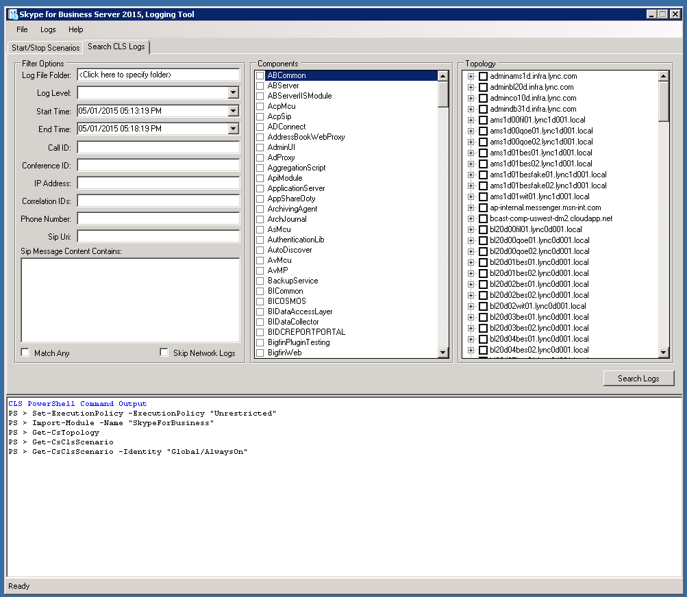

# Logger CLS per Skype for Business Server 2015
 
**Riepilogo:** Informazioni su come utilizzare il logger del servizio di registrazione centralizzato in Skype for Business Server 2015.
  
Il logger CLS è uno strumento che consente di gestire i log generati dal servizio di registrazione centralizzato.
  
## Prerequisiti

Per utilizzare correttamente il logger CLS, è necessario assicurarsi che siano soddisfatte le condizioni seguenti:
  
- Lo strumento viene utilizzato in un computer membro del dominio in cui è in esecuzione il servizio di registrazione centralizzato. Lo strumento attualmente non è supportato nelle sessioni remote di PowerShell.
    
- Il file default. TMX dalla cartella di traccia (la cartella in cui vengono acquisiti i dati di traccia per CLS) e Snooper deve essere copiato nella stessa cartella in cui è installato lo strumento di archiviazione CLS.
    
## Controllare lo stato di registrazione di un gruppo di pool/computer

Utilizzare i seguenti comandi per controllare lo stato della registrazione:
  
1. Nella scheda "scenari di avvio/arresto" selezionare un raggruppamento di pool e/o computer nella visualizzazione struttura ad albero della topologia.
    
2. Fare clic sul pulsante stato registrazione.
    
3. Visualizzare l'output del comando nell'area di output del comando di PowerShell per informazioni specifiche sullo stato di registrazione dei pool e/o computer selezionati.
    
## Avviare uno scenario esistente

Per avviare uno scenario esistente:
  
1. Nella scheda "scenari di avvio/arresto" selezionare uno scenario esistente dal menu a discesa degli scenari.
    
2. Selezionare un raggruppamento di pool e/o computer nella visualizzazione struttura ad albero della topologia.
    
3. Fare clic sul pulsante Start scenario. L'interfaccia utente verrà disabilitata finché l'operazione non viene completata. Questo potrebbe essere lento nelle distribuzioni di grandi dimensioni.
    
4. L'interfaccia utente verrà abilitata di nuovo dopo che lo scenario è stato avviato correttamente, i dettagli dell'azione verranno visualizzati anche nell'area di output del comando di PowerShell.
    
5. L'attività può richiedere del tempo prima che la registrazione venga ritirata da CLS prima di tutti i nuovi dati provenienti da questo scenario.
    
## Arrestare uno scenario esistente

Per arrestare uno scenario esistente:
  
1. Nella scheda "scenari di avvio/arresto" selezionare uno scenario esistente dal menu a discesa degli scenari.
    
2. Selezionare un raggruppamento di pool e/o computer nella visualizzazione struttura ad albero della topologia.
    
3. Fare clic sul pulsante Interrompi scenario. L'interfaccia utente verrà disabilitata finché l'operazione non viene completata. Questo potrebbe essere lento nelle distribuzioni di grandi dimensioni.
    
4. L'interfaccia utente verrà abilitata di nuovo dopo l'interruzione dello scenario, i dettagli dell'azione verranno visualizzati anche nell'area di output del comando di PowerShell.
    

  
## Cercare i log

Per cercare i log, selezionare la scheda "Search CLS logs" e fare clic sul pulsante "Search logs" dopo aver compilato i campi visualizzati come descritto di seguito:
  
> **Cartella file di registro** Cartella in cui salvare i risultati della ricerca del registro. Necessari
> 
> **Livello di registrazione** In questo modo viene determinato il livello più basso che verrà visualizzato nei risultati. Ad esempio, se è selezionata l'opzione avviso, verranno visualizzati solo gli avvisi, gli errori e i fatali. Impostazioni predefinite per il debug.
> 
> **Pool** Pool di computer per eseguire la ricerca dei log rispetto a, questi sono i nodi padre la visualizzazione struttura. Necessari
> 
> **Computer** Singoli computer per cui eseguire la ricerca del registro, sono tutti i nodi figlio nella visualizzazione struttura ad albero. Necessari
> 
> **Ora di inizio** Periodo di tempo in cui CLS eseguirà una query sui registri. Necessari
> 
> **Ora di fine** Periodo di tempo in cui CLS interrompe l'esecuzione di query nei registri. Necessari
> 
> **Componenti** Utilizzato per selezionare i componenti da aggiungere alla query. Optional
> 
> **ID chiamata** ID chiamata di qualsiasi finestra di dialogo SIP da filtrare. Si noti che questo campo utilizza la corrispondenza esatta. Optional
> 
> **ID conferenza** ID conferenza di tutte le conferenze a cui applicare il filtro. Si noti che questo campo utilizza la corrispondenza esatta. Optional
> 
> **Indirizzo IP** L'indirizzo IP che deve essere filtrato da. Si noti che questo campo utilizza la corrispondenza esatta. Optional
> 
> **ID di correlazione** Istruzioni di traccia collegate logicamente da questo ID. Optional
> 
> **Numero di telefono** Filtrare in base al numero di telefono. Optional
> 
> **URI SIP** Filtrare in base all'URI SIP. Optional
> 
> **Contenuto del messaggio SIP contiene** Filtrare in base al contenuto del messaggio SIP, verrà sottostringa la ricerca all'interno di questo campo. Optional
> 
> **Corrispondere a qualsiasi** Esegue la ricerca utilizzando un controllo logico o se controllato. Impostazione predefinita per la corrispondenza esatta di tutti i parametri.
> 
> **Ignorare i registri di rete** Ignora la ricerca di eventuali log di rete se sono stati selezionati.
    

  
## Creare uno scenario

1. Nella scheda **Modifica scenari** fare clic sul pulsante **Crea scenario** .
    
    > [!NOTE]
    > La creazione di un nuovo scenario consentirà di clonare la configurazione dello scenario attualmente selezionato. Se si fa clic su **Pulisci impostazioni** prima di creare un nuovo scenario, inizierà senza i componenti e i flag selezionati.
  
2. Immettere il nome dello scenario che si desidera creare e premere INVIO o fare clic sul pulsante OK.
    
3. Verrà ora creato il nuovo scenario. Una volta completata la creazione, l'elenco a discesa degli scenari verrà selezionato con lo scenario appena creato.
    
## Modificare uno scenario

  
1. Nella scheda **Modifica scenari** individuare lo scenario desiderato da modificare.
    
2. Apportare le modifiche desiderate ai componenti, ai livelli e ai flag.
    
3. Fare clic sul pulsante **Salva scenario** .
    
4. Dopo aver correttamente salvato lo scenario, il riquadro delle informazioni dello scenario verrà aggiornato con la configurazione aggiornata.
    
## Eliminare uno scenario

1. Nella scheda **Modifica scenari** selezionare uno scenario esistente dal menu a discesa degli scenari.
    
2. Fare clic su **Elimina scenario** per eliminare lo scenario.
    
3. Dopo la conferma dell'azione, lo scenario verrà eliminato.
    

