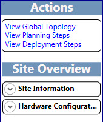

# Spostamento all'interno dello strumento di pianificazione in Lync Server 2013Navigate the Planning Tool in Skype for Business Server 2015

Si naviga nello strumento di pianificazione di Skype for Business Server 2015 usando una combinazione di barra degli strumenti, pulsanti e collegamenti specifici per la pagina e riquadri specifici del contesto.You navigate the Skype for Business Server 2015 Planning Tool by using a combination of a toolbar, page-specific buttons and links, and context-specific panes. I riquadri specifici del contesto includono informazioni sulla progettazione per la pianificazione e la capacità rilevanti per le opzioni di selezione in una pagina specifica.The context-specific panes provide design information for planning and capacity that is relevant to the selection options on a specific page.

All'avvio dello strumento di pianificazione, un progettista vede prima **di tutto il benvenuto nello strumento di pianificazione per Skype for Business Server 2015** pagina.On starting the Planning Tool, a designer first sees the **Welcome to the Planning Tool for Skype for Business Server 2015** page.

Nella pagina di benvenuto, la finestra di progettazione sceglie **Introduzione**, **siti di progettazione**o **visualizzazione**.On the Welcome page, the designer chooses **Get Started**, **Design Sites**, or **Display**. Per informazioni dettagliate, vedere [creare la progettazione della topologia iniziale per Skype for Business Server 2015](create-the-initial-design.md).For details, see [Create the initial topology design for Skype for Business Server 2015](create-the-initial-design.md).

Nella parte superiore dello strumento di pianificazione è disponibile una barra degli strumenti che consente di accedere facilmente alle funzioni usate di frequente.At the top of the Planning Tool is a toolbar that provides easy access to frequently used functions. La barra degli strumenti viene visualizzata qui per riferimento e ogni funzione verrà discussa in argomenti correlati.The toolbar is displayed here for reference, and each function will be discussed in related topics.

Lo strumento di pianificazione include una sezione collegamenti esterni sul lato sinistro dello strumento.The Planning Tool has an External Links section on the left side of the tool. Da qui, il progettista può accedere facilmente alle informazioni di pianificazione e distribuzione e ad altre risorse tecniche come formazione, Blog tecnici, forum e altre risorse scaricabili.From here, the designer has easy access to planning and deployment information, and other technical resources such as training, technical blogs, forums, and other downloadable resources. Nella sezione collegamenti esterni è inoltre presente un collegamento di feedback al team dello strumento di pianificazione di Skype for Business Server 2015.Also in the External Links section is a Feedback link to the Skype for Business Server 2015 Planning Tool team.

Un riquadro azioni sensibile al contesto viene visualizzato in molte pagine dello strumento di pianificazione.A context-sensitive Actions pane is displayed on many pages in the Planning Tool. Il riquadro azioni consente alla finestra di progettazione di accedere facilmente alle sezioni principali della topologia.The Actions pane gives the designer easy access to main sections of the topology. I collegamenti disponibili nel riquadro azioni cambiano in base al livello di dettaglio nella topologia.The links available in the Actions pane change based on the detail level in your topology. Il riquadro azioni è disponibile dopo aver completato le domande sull'intervista e visualizzato la topologia.The Actions pane is available after you have completed the interview questions and displayed your topology. Incluso nel riquadro azioni è la sezione Panoramica, che mostra i numeri immessi dalla finestra di progettazione come parte del processo di colloquio.Included in the Actions pane is the Overview section, which displays numbers that the designer has entered as part of the interview process. La panoramica è contestualmente correlata alle informazioni visualizzate.The overview is contextually related to the displayed information.

Le informazioni sull'hardware vengono inoltre visualizzate nella panoramica nel riquadro azioni.Additionally, hardware information is displayed in the overview under the Actions pane. La configurazione hardware Visualizza un elenco dei requisiti hardware consigliati dalla topologia corrente.The hardware configuration displays a list of hardware requirements that the current topology recommends.

## Vedere ancheSee also

[Creare la progettazione della topologia iniziale per Lync Server 2013Create the initial topology design for Skype for Business Server 2015](create-the-initial-design.md)

[Modifica della strutturaEditing the Design](https://technet.microsoft.com/library/08f639ba-0e5f-4ae7-9191-c3d96c25b169.aspx)

[Esame dei rapporti amministratoreReviewing the Administrator Reports](https://technet.microsoft.com/library/1dee56a9-a033-4201-9765-e3469bd7d3e3.aspx)
