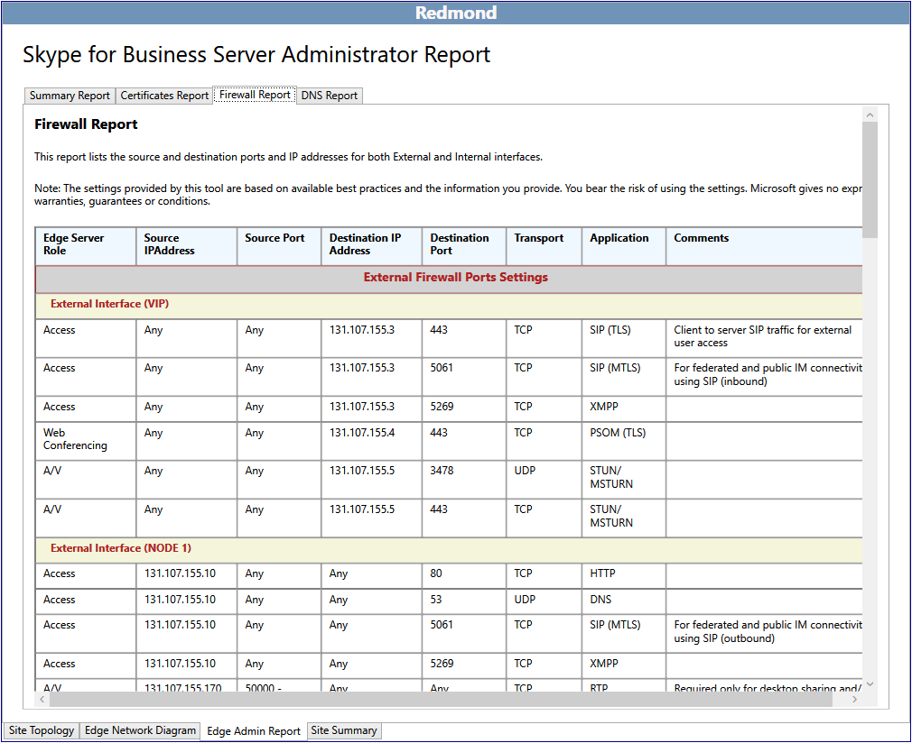

# Esaminare i report dell'amministratore in Skype for Business ServerReview the Administrator Reports in Skype for Business Server 2015

Nei rapporti di amministrazione sono incluse informazioni dettagliate per la distribuzione e le operazioni.The Administrator Reports are detailed information for deployment and operations. I report vengono generati in base alle selezioni contrassegnate in **Siti di progettazione.**The reports are generated based on the selections marked in **Design Sites**. Il progettista può dare valore aggiunto ai rapporti modificando i diagrammi di rete e definendo gli indirizzi IP completi e i nomi di dominio completi (FQDN) dei server, dei pool e dei servizi di bilanciamento del carico.The designer can further add value to the Administrator Reports by editing the network diagrams and defining the complete IP addresses and fully qualified domain names (FQDNs) for servers, pools, and load balancers.

La funzionalità dei report dell'amministratore consente di:The Administrator reports feature allows you to:

- [Esaminare il Rapporto riepilogativoReview the Summary Report](review-the-administrator-reports.md#Summary_report)

- [Esaminare il rapporto certificatiReview the Certificates Report](review-the-administrator-reports.md#Certificates_Report)

- [Esaminare il rapporto firewallReview the Firewall Report](review-the-administrator-reports.md#Firewall_report)

- [Esaminare il rapporto DNSReview the DNS Report](review-the-administrator-reports.md#DNS_Report)

## Esaminare il Rapporto riepilogativoReview the Summary Report

Il rapporto dell'amministratore di Skype for Business è il primo di quattro rapporti importanti che documentano in dettaglio la progettazione.The Skype for Business Administrator Report is the first of four valuable reports that document your design in detail. Le informazioni contenute in questo report e negli altri tre report associati sono utili per i team di Information Technology:The information in this report, and the other three associated reports, is useful for your Information Technology Teams:

Nel rapporto riepilogativo vengono elencate informazioni di configurazione generali associate alla rete perimetrale.The Summary Report lists general configuration information associated with your Edge network. Vengono documentati il percorso, il nome di dominio completo (FQDN) e l'indirizzo IP, il tipo di rete e i commenti specifici per un determinato ruolo.The location, fully qualified domain name (FQDN) and IP address, type of network, and comments specific to a given role are documented.

Il progettista e tutti i team che distribuiranno, gestiranno e gestiranno l'infrastruttura dovrebbero esaminare il rapporto riepilogativo per verificare l'accuratezza e assicurarsi che gli errori siano almeno minimi.The designer and each of the teams that will deploy, manage, and maintain the infrastructure should review the summary report for accuracy and to make sure that errors are at a minimum.

È inoltre possibile visualizzare report più dettagliati:You can also view more detailed reports:

- Rapporto certificatiCertificates Report

- Rapporto firewallFirewall Report

- Rapporto DNSDNS Report

## Esaminare il rapporto certificatiReview the Certificates Report

Il Rapporto certificati contiene tutti i certificati necessari nella distribuzione consigliata di Skype for Business Server 2015.The Certificates Report contains all certificates that are required in the recommended Skype for Business Server 2015 deployment. Lo strumento di pianificazione consente di utilizzare i nomi soggetto e i nomi alternativi soggetto immessi.The Planning Tool accounts for the subject names and subject alternative names that are entered. Il testo predefinito non modificabile può rappresentare una potenziale sfida per il team responsabile della richiesta e dell'emissione dei certificati.Default text that is left unedited may represent a potential challenge for the team responsible for requesting and issuing the certificates. Nelle informazioni sui certificati sono inoltre incluse informazioni sull'origine da cui in genere viene emesso il certificato.Certificate information also contains information about where the certificate can typically be issued from. Se l'infrastruttura non dispone di un'infrastruttura a chiave pubblica (PKI), tutti i certificati possono essere richiesti tramite un provider di certificati pubblico.If the infrastructure does not have an internal public key infrastructure (PKI) in place, all certificates can be requested through a public certificate provider. I campi relativi agli utilizzi chiave avanzati e alla destinazione del rapporto sono molto utili per comprendere lo scopo e il percorso di ogni certificato.Extended key usages (EKU) and Assign To fields in the report are very helpful in understanding what the purpose and location for each certificate should be.

Esaminare attentamente e assicurarsi di comprendere l'utilizzo e lo scopo di ogni certificato nella distribuzione.Carefully review, and be sure to understand, the use and purpose of each certificate in the deployment. In caso di dubbi sull'utilizzo di un certificato, determinare con quale server o servizio si sta parlando.If there is a question about what a certificate does, determine which server or service is talking to what. I certificati in Skype for Business Server 2015 vengono utilizzati per due scopi principali:Certificates in Skype for Business Server 2015 are used for two primary purposes:

- Mutual Transport Layer Security (MTLS) - I computer coinvolti nella comunicazione presentano ognuno un certificato che dimostra la propria identità a un altro computer.Mutual Transport Layer Security (MTLS) - The computers involved in the communication each present a certificate that proves their identity to another computer. Questa operazione è nota come autenticazione server.This is known as server authentication. La comunicazione non può iniziare finché ogni computer non considera attendibile l'identità dell'altro computer.Communication cannot begin until each computer trusts the other computer's identity.

- Crittografia - La crittografia (Secure Sockets Layer, SSL e Transport Layer Security o TLS) è uno strumento fondamentale per proteggere le comunicazioni, garantire la privacy e creare un sistema di comunicazione e collaborazione attendibile.Encryption - Encryption (Secure Sockets Layer, or SSL, and Transport Layer Security, or TLS) is a critical means to help secure communications, help ensure privacy, and to create a trusted communications and collaboration system.

## Esaminare il rapporto firewallReview the Firewall Report

Skype for Business Server 2015 include un insieme potenzialmente complesso di regole firewall.Skype for Business Server 2015 has a potentially complex set of firewall rules. Lo strumento di pianificazione riduce questa complessità generando un report che definisce in dettaglio tutti i requisiti del firewall, in base ai criteri di input del progettista.The Planning Tool reduces this complexity by generating a report that defines in detail all firewall requirements, based on the designer's input criteria. L'amministratore del firewall IT sarà in grado di utilizzare tale rapporto per configurare e definire le regole necessarie.The IT firewall administrator will be able to use this report to configure and define the necessary rules.

Dal punto di vista della gestione del firewall, il report deve essere esaminato attentamente per assicurarsi che non vi siano conflitti con le regole del firewall in uscita e che non vi siano criteri o procedure che potrebbero essere violati.From the standpoint of firewall management, the report should be carefully reviewed to make sure that there are no conflicts with exiting firewall rules and that there are no policies or procedures that might be violated.

## Esaminare il rapporto DNSReview the DNS Report

Il rapporto DNS, che fa parte del rapporto dell'amministratore, dettaglia tutte le voci consigliate e note per dns (Domain Name System) nelle reti interne, perimetrali ed esterne.The DNS Report, which is part of the Administrator Report, details all of the recommended and known entries for the Domain Name System (DNS) in the internal, perimeter, and external networks. Se il progettista ha completato le modifiche al diagramma di rete e tutti gli indirizzi IP e i nomi di dominio completi (FQDN) sono definiti in base ai valori di produzione, il rapporto DNS offre una risorsa di configurazione eccellente.If the designer has completed the edits to the network diagram, and all IP addresses and fully qualified domain names (FQDNs) are defined to their production values, the DNS Report provides an excellent configuration resource. Questo report può anche fungere da documento operativo per la risoluzione dei problemi.This report can also serve as an operational troubleshooting document.

È consigliabile che il team di gestione DNS riveda accuratamente il rapporto DNS per assicurarsi che non vi siano errori che possono causare difficoltà durante la distribuzione o che potrebbero complicare una sessione di risoluzione dei problemi.You should have your DNS management team review the DNS Report thoroughly to make sure that there are no errors that may cause difficulty during deployment or that may complicate a troubleshooting session.

## Vedere ancheSee also

[Esame dei rapporti di amministrazioneReviewing the Administrator Reports](https://technet.microsoft.com/library/1dee56a9-a033-4201-9765-e3469bd7d3e3.aspx)
