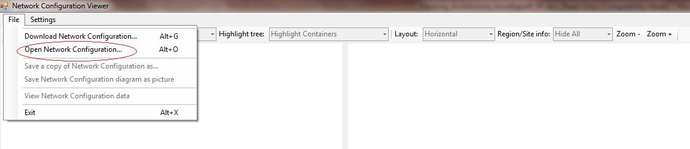
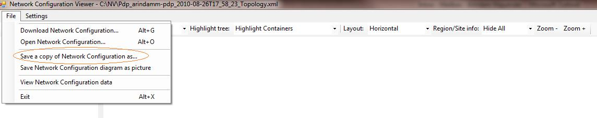
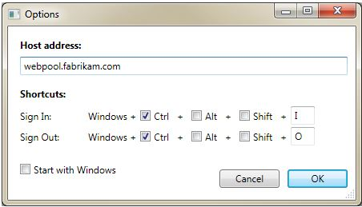

# <a name="skype-for-business-server-2015-resource-kit-tools-documentation"></a>Documentazione degli strumenti del Resource Kit di Skype for Business Server 2015

In questo argomento vengono descritti gli strumenti del Resource Kit di Skype for Business Server 2015, tra cui lo scopo di ogni strumento e gli esempi di utilizzo. Il Resource Kit di Skype for Business Server 2015 contribuisce a semplificare le attività di routine per gli amministratori IT che distribuiscono e gestiscono Skype for Business Server 2015. Ad esempio, è possibile utilizzare lo strumento di **dati di Web conf** per controllare facilmente i dati caricati dagli utenti durante una riunione online. Lo strumento **SEFAUtil** può essere utilizzato per configurare l'inoltro delle chiamate Delegate e la risposta per gli utenti. Si consiglia agli amministratori IT di utilizzare questi strumenti per gestire in modo più efficace Skype for Business Server 2015.

## <a name="installation-of-the-resource-kit-tools"></a>Installazione degli strumenti del Resource Kit

Per installare il Resource Kit di Skype for Business Server 2015, scaricare [OCSReskit. msi](https://www.microsoft.com/download/details.aspx?id=52631) dall'area download.

Eseguire **OCSResKit. msi** per eseguire un'installazione semplice. Con estensione msi vengono installati tutti gli strumenti nel percorso seguente: **% Program Files%\Skype for Business Server 2015 \ reskit**. Gli strumenti che sono eseguibili indipendenti sono presenti in questa cartella. Gli strumenti che dispongono anche di file di supporto sono presenti nelle rispettive sottocartelle.

## <a name="supported-environments"></a>Ambienti supportati

Il Resource Kit di Skype for Business Server 2015 deve essere installato in un server che soddisfi le specifiche richieste per Skype for Business Server 2015, in genere uno utilizzato per eseguire Skype for Business Server 2015.

## <a name="resource-kit-tools-overview"></a>Panoramica degli strumenti del Resource Kit

Di seguito è riportato un elenco degli strumenti forniti in Skype for Business Server 2015 Resource Kit. Una descrizione di ogni strumento, inclusi i requisiti e l'utilizzo di esempio, è illustrata nelle sezioni seguenti.

- [ABSConfig](resource-kit-tools.md#ABSConfig)

- [Monitoraggio del servizio criteri di larghezza di banda](resource-kit-tools.md#bpsm)

- [Analizzatore dell'utilizzo della larghezza di banda](resource-kit-tools.md#bua)

- [Chiamata Parkometer](resource-kit-tools.md#callpark)

- [DBAnalyze](resource-kit-tools.md#dba)

- [Importare i dati del servizio di archiviazione](resource-kit-tools.md#Issd)

- [LCSSync](resource-kit-tools.md#LCSSync)

- [Console utente di ricerca](resource-kit-tools.md#LUC)

- [MsTurnPing](resource-kit-tools.md#MsTurnPing)

- [Visualizzatore di configurazione di rete](resource-kit-tools.md#NCV)

- [Agente di Response Group Live](resource-kit-tools.md#RGAL)

- [SEFAUtil](resource-kit-tools.md#SEFAUtil)

- [SYSPrep. ps1](resource-kit-tools.md#SYSPrep)

- [Migrazione degli annunci di numeri non assegnati](resource-kit-tools.md#UNAM)

- [Dati Web conf](resource-kit-tools.md#WebConfData)

## <a name="absconfig"></a>ABSConfig
<a name="ABSConfig"> </a>

Lo strumento di configurazione del servizio di gestione della Rubrica (ABSConfig) è uno strumento di amministrazione che consente agli amministratori di personalizzare la configurazione del servizio Rubrica in Skype for Business Server 2015. Questo strumento consente inoltre agli amministratori di Skype for Business Server 2015 di ripristinare le impostazioni predefinite del servizio Rubrica.

### <a name="description"></a>Descrizione

ABSConfig è un'applicazione per l'interfaccia utente grafica che consente agli amministratori di configurare gli attributi di servizi di dominio Active Directory correlati al servizio Rubrica.

Gli scenari principali per lo strumento sono gli elementi seguenti:

- Per consentire agli amministratori di eseguire il mapping degli attributi in servizi di dominio Active Directory agli attributi di Skype for Business Server 2015.

- Per consentire agli amministratori di specificare l'attributo servizi di dominio Active Directory da includere o escludere nei file del servizio Rubrica.

- Per consentire agli amministratori di ripristinare le impostazioni predefinite del servizio Rubrica.

È possibile avviare lo strumento ABSConfig utilizzando il file ABSConfig. exe. Lo strumento verrà aperto alla scheda **Configure Attributes** . In questa tabella sono disponibili opzioni per il mapping degli attributi dei servizi di dominio Active Directory ai campi degli attributi per Skype for Business Server 2015 e per specificare quali utenti includere o escludere nei file del servizio Rubrica basati su filtri di attributi specifici. Sono inoltre disponibili opzioni per personalizzare il valore del numero di telefono da includere nel file della Rubrica. L'opzione **Ripristina valori predefiniti** consente agli amministratori di ripristinare le impostazioni del servizio Rubrica in valore predefinito.

> [!NOTE]
> La rimappatura degli attributi di Active Directory a diversi nomi di campi OC funzionerà solo per il download dei file della Rubrica e non è supportata dalla query Web della Rubrica.

### <a name="output"></a>Output

ABSConfig archivia la configurazione del servizio Rubrica nel database.

```console
Path: %ProgramFiles%\Skype for Business Server 2015\Reskit
```

### <a name="purpose"></a>Scopo

ABSConfig offre un modo semplice e rapido per personalizzare il servizio Rubrica di Skype for Business Server 2015.

### <a name="requirements"></a>Requisiti

#### <a name="computer"></a>Computer

ABSConfig può essere eseguito solo da un computer aggiunto al dominio in cui è installato Skype for Business Server 2015. Nel caso di Skype for Business Server 2015, Enterprise Edition, questo strumento può essere eseguito in tutti i front end server con il servizio Rubrica abilitato durante l'installazione.

#### <a name="network"></a>Rete

Il computer deve essere in grado di connettersi al pool Front end e al database back-end.

#### <a name="software"></a>Software

Prima di eseguire lo strumento ABSConfig, è necessario installare i componenti software seguenti:

- Skype for Business Server 2015

#### <a name="users"></a>Utenti

Amministratori che dispongono delle autorizzazioni necessarie per aggiornare la distribuzione di Skype for Business Server 2015.

### <a name="examples"></a>Esempi

ABSConfig può essere avviato digitando **ABSConfig. exe** al prompt dei comandi. Di seguito è riportata l'interfaccia utente dello strumento ABSConfig.


### <a name="summary"></a>Riepilogo

Lo strumento ABSConfig offre agli amministratori uno strumento rapido e facile da usare per personalizzare il servizio Rubrica di Skype for Business Server 2015.

## <a name="bandwidth-policy-service-monitor"></a>Monitoraggio del servizio criteri di larghezza di banda
<a name="bpsm"> </a>

Lo strumento di monitoraggio dei criteri di larghezza di banda è progettato per consentire agli amministratori di visualizzare un elenco di quanto segue:

1. Tutti i servizi di criteri di larghezza di banda di Skype for Business Server configurati 2015 (autenticazione e Core) nella topologia

2. Le connessioni che ogni servizio apporta ad altri servizi di criteri di larghezza di banda e ai server perimetrali

3. Tutti i collegamenti configurati nel documento di configurazione di rete e nell'utilizzo della larghezza di banda in tempo reale riportati da ciascuno dei servizi di criteri di larghezza di banda

### <a name="description"></a>Descrizione

Lo strumento di monitoraggio dei criteri di larghezza di banda è implementato come applicazione basata su GUI. Gli amministratori avviano lo strumento mediante l'esecuzione di PDPMonUI. exe.

Quando lo strumento viene avviato, cerca di individuare l'elenco dei servizi per i criteri di larghezza di banda nella topologia. Dopo aver eseguito l'aggiornamento iniziale, il riquadro a sinistra della finestra viene popolato con un elenco di servizi raggruppati per i cluster a cui appartengono.

Quando gli amministratori selezionano un particolare servizio per i criteri di larghezza di banda, nel riquadro a destra vengono visualizzate le informazioni relative a quel particolare servizio. Nel riquadro sono inoltre disponibili due schede principali che consentono di visualizzare le informazioni.

#### <a name="machine-info-tab"></a>Scheda informazioni sul computer

Nella scheda **informazioni sul computer** vengono visualizzati i dettagli del servizio dei criteri di larghezza di banda selezionato e l'elenco e lo stato di tutte le connessioni effettuate dal servizio criteri di larghezza di banda selezionato ad altri servizi.

#### <a name="topology-info-tab"></a>Scheda informazioni sulla topologia

Nella scheda **informazioni sulla topologia** viene visualizzato un elenco di tutti i collegamenti configurati nelle impostazioni di configurazione di rete. Per ogni collegamento viene visualizzata la capacità di larghezza di banda audio e video. Inoltre, viene visualizzata la larghezza di banda attualmente utilizzata, sia in Kbps che come percentuale della capacità. Lo strumento utilizza la codifica a colori per evidenziare i collegamenti che dispongono di un utilizzo vicino alla capacità, consentendo agli amministratori di isolare rapidamente tali collegamenti.

> [!NOTE]
>  Se lo strumento Monitoraggio servizi di larghezza di banda verifica un errore durante la connessione a uno dei servizi di criteri di larghezza di banda configurati, le informazioni contenute nelle schede informazioni **computer** e **topologia** non verranno popolate. Tuttavia, è possibile che lo strumento possa connettersi inizialmente, ma in seguito perde la connessione al servizio. In questi casi, gli amministratori possono visualizzare le informazioni obsolete. È presente un timestamp dell' **Ultimo aggiornamento** su ognuna delle schede che consentono agli amministratori di visualizzare l'ultimo aggiornamento dei dati per un particolare servizio criteri di larghezza di banda.

### <a name="output"></a>Output

Non è disponibile alcun output della riga di comando. l'output del programma è contenuto all'interno dell'interfaccia utente grafica principale (GUI).

### <a name="purpose"></a>Scopo

Lo strumento di monitoraggio dei criteri di larghezza di banda consente agli amministratori di visualizzare lo stato di ogni servizio dei criteri di larghezza di banda definito nella topologia. Gli amministratori possono inoltre visualizzare l'utilizzo della larghezza di banda in tempo reale per tutti i collegamenti definiti nel documento di configurazione della rete.

### <a name="requirements"></a>Requisiti

È necessario eseguire lo strumento di monitoraggio dei criteri di larghezza di banda su un computer che fa parte della topologia di Skype for Business Server.

### <a name="summary"></a>Riepilogo

Lo strumento di monitoraggio dei criteri di larghezza di banda può essere una risorsa importante per gli amministratori in modo che possano ispezionare lo stato di tutti i servizi dei criteri di larghezza di banda nella topologia e, soprattutto, possono ottenere l'utilizzo della larghezza di banda in tempo reale per i collegamenti che sono definito nelle impostazioni di configurazione di rete.

## <a name="bandwidth-utilization-analyzer"></a>Analizzatore dell'utilizzo della larghezza di banda
<a name="bua"> </a>

L'analizzatore dell'utilizzo della larghezza di banda è uno strumento che consente di creare report su diverse visualizzazioni del consumo di larghezza di banda da parte degli endpoint UC tra i collegamenti WAN nella rete aziendale. Questi report possono essere utilizzati per comprendere il modello di consumo di larghezza di banda corrente e per facilitare la pianificazione della capacità della larghezza di banda.

### <a name="description"></a>Descrizione

L'analizzatore dell'utilizzo della larghezza di banda viene implementato come applicazione basata su GUI. Questo strumento genera report in modo specifico per l'utilizzo dell'audio in rete e contribuisce alla pianificazione della capacità. Inoltre, viene eseguita una iterazione sulla capacità di larghezza di banda assegnata a vari collegamenti.

### <a name="output"></a>Output

L'analizzatore dell'utilizzo della larghezza di banda fornisce grafici al grafico della capacità e dell'utilizzo della larghezza di banda per l'audio per tutti i collegamenti WAN configurati nel sistema.

### <a name="purpose"></a>Scopo

In qualsiasi distribuzione di voce e video, è importante monitorare e comprendere l'andamento dell'utilizzo della larghezza di banda del traffico multimediale in tutta la rete aziendale. Lo strumento Analizzatore utilizzo larghezza di banda consente a un amministratore di raggiungere questo obiettivo. Questo strumento esegue le operazioni seguenti:

- Genera relazioni specifiche per l'utilizzo dell'audio in rete

- Consente di eseguire una pianificazione e un'iterazione della capacità più efficace sulla capacità di larghezza di banda assegnata a vari collegamenti

L'analizzatore dell'utilizzo della larghezza di banda può generare trame grafiche dei rapporti di utilizzo e capacità della larghezza di banda. sono i seguenti:

- Tutti i collegamenti WAN nella rete aziendale

- Filtrato da collegamenti WAN selezionati che sono stati scelti

- Filtrato tramite collegamenti WAN che hanno superato la capacità dei collegamenti

- Filtrato mediante collegamenti WAN che sono stati sottoposti a utilizzo della larghezza di banda provisioning

- Filtrare mediante collegamenti WAN che hanno raggiunto livelli critici (un utilizzo della larghezza di banda superiore al 90% della capacità di larghezza di banda del collegamento WAN)

- Filtro in base al tipo di collegamento WAN: collegamenti a siti di rete, collegamenti interregionali e collegamenti all'interno di un sito

- Filtrato in base all'area di rete

#### <a name="applications"></a>Applicazioni

Analizzatore dell'utilizzo della larghezza di banda contiene le due applicazioni seguenti (strumenti):

- **WanLinkLogCollector. exe** questo strumento consente all'utente di immettere le informazioni necessarie.

- **BandwidthUtilizationAnalyzer. xlsm** un rapporto software del foglio di calcolo di Microsoft Excel viene avviato automaticamente da WanLinkLogCollector. exe. Questa applicazione consente all'utente di applicare filtri al rapporto come mostrato più avanti in questo articolo.

#### <a name="phases-of-using-bandwidth-utilization-analyzer"></a>Fasi dell'utilizzo dell'analizzatore dell'utilizzo della larghezza di banda

Quando si utilizza l'analizzatore dell'utilizzo della larghezza di banda sono presenti due fasi:

- Raccogliere i registri, che vengono eseguiti utilizzando WanLinkLogCollector. exe

- Personalizzare i report, che vengono eseguiti mediante BandwidthUtilizationAnalyzer. xlsm

    > [!IMPORTANT]
    > È consigliabile che BandwidthUtilizationAnalyzer. xlsm non venga avviato manualmente dagli utenti finali.

#### <a name="starting-bandwidth-utilization-analyzer"></a>Avvio dell'analizzatore dell'utilizzo della larghezza di banda

Avviare WanLinkLogCollector. exe dal prompt dei comandi o tramite Esplora risorse.

 **Utilizzo di WanLinkLogCollector. exe**

Sono disponibili tre passaggi per l'utilizzo di WanLinkLogCollector. exe:

1. **Registrare la sequenza temporale** Specificare la sequenza temporale per la quale deve essere generato il report

2. **Specificare le directory di file** Fornire informazioni sul percorso del file

3. **Raccolta dei registri e avvio del Visualizzatore di report** Eseguire il comando per generare il report

#### <a name="step-1---log-the-timeline"></a>Passaggio 1-registrare la sequenza temporale

La registrazione della sequenza temporale consente all'utente dello strumento di specificare quanto segue come illustrato nella figura seguente.

1. **Data di inizio** Questa è la data di inizio della sequenza temporale per la quale deve essere generato il report. ad esempio, 2010 agosto 1.

2. **Data di fine** Questa è la data di fine della sequenza temporale per la quale deve essere generato il report. ad esempio, settembre 30, 2010.

     

#### <a name="step-2---specify-the-file-directories"></a>Passaggio 2: specificare le directory dei file

Le directory dei file seguenti possono essere specificate dall'utente come illustrato.

- **Percorso dei file di registro del server** Percorso della cartella in cui sono archiviati i registri del server dei criteri di larghezza di banda. Si \<tratta in genere di\> \\ Fileserver<scelta di\>Fe \AppServerFiles\PDP.

- **Percorso di archiviazione file temporaneo** Percorso temporaneo del file in cui vengono archiviati i file intermedi durante la generazione del report.

    

    > [!NOTE]
    > Verificare che all'utente dello strumento sia disponibile un numero sufficiente di accessi ai registri del server e alla cartella temporanea dell'archivio file.

#### <a name="step-3---collect-the-logs-and-start-the-report-viewer"></a>Passaggio 3: raccolta dei registri e avvio del Visualizzatore di report

Per raccogliere i registri e avviare il Visualizzatore di report, fare clic su **Esegui** come illustrato di seguito. Questo passaggio consente di raccogliere i dati necessari.


Quando la convalida dell'input ha esito positivo, viene visualizzato il messaggio mostrato di seguito.


Fare clic su **OK**. BandwidthUtilizationAnalyzer. xlsm viene avviato automaticamente. Seguire le istruzioni riportate nella finestra di messaggio. Per informazioni dettagliate, vedere **using BandwidthUtilizationAnalyzer. xlsm** nella sezione successiva.


### <a name="using-bandwidthutilizationanalyzerxlsm"></a>Utilizzo di BandwidthUtilizationAnalyzer. xlsm

1. Quando BandwidthUtilizationAnalyzer. xlsm viene avviato automaticamente, fare clic su **Aggiorna** come illustrato di seguito.

     

2. Quando si apre una cartella di file, selezionare Consolidated. csv dal percorso specificato nella finestra di messaggio come illustrato di seguito. Viene inoltre visualizzato il percorso come **C:\Temp**.

     

3. Fare clic su **Importa**.

4. La trama grafica viene generata automaticamente. È disponibile quando il puntatore di lavoro in background scompare.

     

#### <a name="applying-filters-to-the-report-view"></a>Applicazione di filtri alla visualizzazione del report

I filtri che è possibile applicare alla visualizzazione del rapporto come illustrato di seguito sono descritti nel modo seguente:


1. **Nome** Filtrare in base ai collegamenti WAN (il filtro è a destra del grafico). Il prefisso indica i tipi di collegamento seguenti. vedere la casella verticale (blu):

   - **Sito S** Collegamento WAN da un sito di rete a un'area di rete

   - **È tra siti** Collegamento WAN tra due siti di rete

   - **Inter-Region R** Collegamento WAN tra due aree di rete

2. **Limite superato** Filtra mediante collegamenti WAN il cui utilizzo della larghezza di banda è superiore alla capacità della larghezza di banda

3. **Livelli critici** Filtra mediante collegamenti WAN il cui utilizzo della larghezza di banda ha raggiunto il 90% o superiore alla capacità della larghezza di banda

4. **Sottoutilizzati** Filtra mediante collegamenti WAN il cui utilizzo della larghezza di banda è stato inferiore al 25% della capacità della larghezza di banda

5. **Tipo di collegamento** Filtrare in base ai seguenti tipi di collegamenti WAN:

   - Tipo di **sito di rete**

   - Tipo **tra siti**

   - Tipo **di collegamento tra aree** geografiche

6. **Area geografica** Filtrare in base all'area di rete

Nelle figure seguenti vengono illustrati i filtri descritti in precedenza.

Filtrare in base al **nome**. Selezionare l'elenco dei collegamenti che devono essere visualizzati nel grafico.


Filtrare in base al **limite superato**. Selezionare **true** per applicare il filtro.


Filtrare in base ai **livelli critici**. Selezionare **true** per applicare il filtro.


Filtro in **base a utilizzato**. Selezionare **true** per applicare il filtro.


Filtro in base al **tipo di collegamento**. Selezionare il tipo o i tipi che devono essere visualizzati.


Filtrare in base all' **area geografica**. Selezionare un elenco di aree di cui devono essere visualizzati i collegamenti.


### <a name="requirements"></a>Requisiti

- .NET Framework 3,5

- Microsoft Excel 2010 o Excel 2007

### <a name="summary"></a>Riepilogo

L'analizzatore dell'utilizzo della larghezza di banda viene utilizzato per tracciare l'utilizzo della larghezza di banda audio per il traffico UC sulla rete. Questo strumento può essere utilizzato per segnalare l'utilizzo della larghezza di banda video anche sulla rete.

## <a name="call-parkometer"></a>Chiamata Parkometer
<a name="callpark"> </a>

Call Parkometer è un'applicazione della riga di comando che consente di accedere facilmente al database di orbit del parcheggio di chiamata.

### <a name="description"></a>Descrizione

Call Parkometer è uno strumento che consente di monitorare le chiamate attualmente parcheggiate. Raccoglie anche le statistiche sulle orbite e sull'utilizzo del server parcheggio di chiamata (CPS). Questo strumento da riga di comando fornisce sia la lettura che l'accesso in scrittura al database di SQL Server Orbit di CPS da un computer locale o connesso in remoto.

Tutte le opzioni sono mutualmente esclusive. La sintassi della riga di comando è la seguente:

- **-o** parameter: elenca tutti gli intervalli di Orbit configurati per il pool.

- **-n** parameter: elenca tutte le orbite attualmente utilizzate nel pool. Di seguito sono riportate le informazioni visualizzate:

  - URI (Uniform Resource Identifier) SIP del parcheggiato e del Parker.

  - Nome host del CPS in cui è parcheggiata la chiamata.

  - Indicatore di data e ora di quando la chiamata è stata parcheggiata.

- **-f** parameter: elenca il numero di orbite attualmente libere nel pool.

- **-r \<n\> ** parameter: elenca le \<n\> ultime chiamate parcheggiate. Di seguito sono riportate le informazioni visualizzate:

  - URI SIP del parcheggio.

  - URI SIP Parker.

  - Nome host del CPS in cui la chiamata è stata parcheggiata.

  - Indicatore di data e ora di quando la chiamata è stata recuperata o eliminata.

- **-t\<n\> ** -test dei parametri che riservano un'orbita nel database per mostrare la casualità dei numeri di orbita assegnati.

### <a name="output"></a>Output

In base ai parametri di input specificati al prompt dei comandi, la chiamata a Parkometer Visualizza l'output seguente:

- Tutti gli intervalli di Orbit configurati per il pool

- Chiamate attualmente parcheggiate

- Numero di orbite libere (disponibili)

- Chiamate parcheggiate di recente

- Orbite riservate per testare valori di Orbit uniformi e casuali

### <a name="purpose"></a>Scopo

Lo strumento CPS ha lo scopo di fornire l'accesso da riga di comando al database CPS. L'amministratore può visualizzare l'utilizzo di CPS e determinare il numero di orbite assegnate a un pool.

### <a name="requirements"></a>Requisiti

Se lo strumento viene eseguito nello stesso computer in cui è in esecuzione CPS, non è previsto alcun requisito. Se lo strumento viene eseguito in un computer remoto, il database di SQL Server utilizzato da Skype for Business Server 2015 deve essere configurato in modo da consentire l'accesso remoto. La chiamata Parkometer deve essere configurata con una stringa di connessione al database di SQL Server per la connessione al server SQL del pool. La stringa di connessione del database di SQL Server è definita nel file di configurazione **parkometer. exe. config**. Deve essere collocato nella stessa directory in cui si trova parkometer. exe. Il file XML seguente è un esempio di parkometer. exe. config. I parametri che devono essere configurati sono il nome utente (ad esempio, mydomain\Administrator), la password (ad esempio, password) e il nome host, ad esempio myserver.

```xml
<?xml version="1.0" encoding="utf-8" ?>
<configuration>
  <appSettings>
   <add key="SQL" value="server=myserver\RTC;
database=cpsdyn;
User Id=mydomain\Administrator;
Password=mypassword.;
Integrated Security=false;"/>
  </appSettings>
</configuration>
```

### <a name="examples"></a>Esempi

Intervalli di Orbit distribuiti: il parametro-o elenca tutti gli intervalli di Orbit configurati per il pool come illustrato


Chiamate attualmente parcheggiate: il parametro-n elenca tutte le orbite attualmente utilizzate in questo pool come illustrato


Numero di orbite libere: il parametro-f elenca il numero di orbite attualmente libere nel pool come mostrato


Chiamate parcheggiate di recente: il parametro \<-\> r n elenca \<le\> chiamate n Last parcheggiate come mostrato


Test Orbit Reservation: i test dei \<parametri\> -t n che riservano un'orbita nel database come illustrato


### <a name="summary"></a>Riepilogo

Call Parkometer è uno strumento da riga di comando che fornisce informazioni dettagliate sul server parcheggio di chiamata.

## <a name="dbanalyze"></a>DBAnalyze
<a name="dba"> </a>

### <a name="description"></a>Descrizione

DBAnalyze è uno strumento da riga di comando che consente agli amministratori di raccogliere i report di analisi sui database di Skype for Business Server 2015. In DBAnalyze sono disponibili le seguenti modalità: diagnostica, dati utente, conferenza, MCU e frammentazione del disco:

- **Modalità diagnostica** Crea un report in cui sono incluse informazioni sulle tabelle (numero di record, frammentazione, dimensioni dei dati, e le dimensioni dell'indice), le dimensioni dei file di dati e di registro, l'ultimo tempo di backup, la distribuzione dei contatti tra i server che eseguono Microsoft Office Communications Server, il numero medio di autorizzazioni, contatti, contenitori, abbonamenti, pubblicazioni, endpoint per utente, tutti gli utenti che non possono essere instradati in modo improprio e la versione del database.

    > [!NOTE]
    > L'esecuzione della modalità diagnostica può influire sulle prestazioni del server.

- **Modalità dati utente** Segnala i dati relativi a contatti, contenitori, abbonamenti, pubblicazioni, autorizzazioni e gruppi di contatti per un utente specificato o per gli utenti che dispongono di tale utente negli elenchi di contatti e autorizzazioni. Questa modalità segnala anche i dati di riepilogo per le conferenze a cui un utente organizza o è invitato.

- **Modalità conferenza** Segnala i dati dettagliati per una conferenza specifica, inclusi tutti i dettagli relativi alla programmazione per la conferenza, l'elenco degli invitati, l'elenco dei tipi di contenuto multimediale consentiti per la conferenza, i MCU attivi (unità di controllo multipunto), l'elenco dei partecipanti attivi e lo stato di segnalazione di ogni partecipante.

- **Decodifica ID riunione** Consente di decodificare un ID riunione PSTN (Public Switched Telephone Network) specificato dall'opzione **/pstnid** ma non viene connesso al back-end per informazioni dettagliate.

- **Risoluzione conferenza** Consente di decodificare un ID riunione PSTN specificato dall'opzione **/pstnid** e di visualizzare le informazioni sulla conferenza indicate dall'ID.

- **Modalità MCU** Segnala l'ID, il tipo di supporto, l'URL, lo stato del battito cardiaco, il carico delle conferenze e il carico dei partecipanti per ogni MCU del pool.

- **Modalità di frammentazione del disco** Visualizza lo stato di frammentazione di tutti i dischi.

Questo strumento può essere utilizzato per diagnosticare diversi problemi o per assistere gli amministratori nella pianificazione della capacità. Ad esempio, se la maggior parte degli utenti ospitati nel server A sceglie gli utenti ospitati nel server B come contatti, l'amministratore può spostare gli utenti nel server a nel server B per ridurre il traffico tra server.

### <a name="output"></a>Output

Questo strumento restituisce i report predefiniti relativi al database di Skype for Business Server 2015. **Percorso**:%ProgramFiles%\Skype for Business Server 2015 \ reskit

### <a name="purpose"></a>Scopo

Per installare Dbanalyze. exe, copiarlo in una cartella locale e quindi eseguire lo strumento. Per utilizzare lo strumento, eseguire il comando riportato di seguito dalla riga di comando. `dbanalyze.exe [/v] [/report:value] [/sqlserver:value] [/user:user@domain.com] [/conf:value][/pstnid:Value] [/maxcontacts:value]`Di seguito sono riportate le descrizioni delle opzioni della riga di comando.


### <a name="requirements"></a>Requisiti

 **Computer** DBAnalyze può essere eseguito solo da un computer aggiunto al dominio in cui è installato Skype for Business Server 2015.

 **Rete** Il computer deve essere in grado di connettersi al database back-end.

 **Software** I componenti software di Skype for Business Server 2015 devono essere installati prima di eseguire DBAnalyze.

 **Utenti** Nella tabella seguente sono riportati gli amministratori che dispongono delle autorizzazioni necessarie per accedere ai database di Skype for Business Server 2015.


> [!NOTE]
> Per **/report: modalità disco** è necessario un account di amministratore locale.

### <a name="examples"></a>Esempi

Di seguito sono riportati alcuni esempi di comandi di Dbanalyze. exe validi:

```console
dbanalyze.exe /report:diag
dbanalyze.exe /report:user /user:usera@domainb.com
dbanalyze.exe /report:conf /user:bob@example.com /conf:1W9J71SKSX2X
dbanalyze.exe /report:resolve /pstnid:12345
dbanalyze.exe /report:mcus
dbanalyze.exe /report:disk
```

### <a name="summary"></a>Riepilogo

DBAnalyzer offre agli amministratori una soluzione rapida e semplice per l'analisi dei database di Skype for Business Server 2015.

## <a name="import-storage-service-data"></a>Importare i dati del servizio di archiviazione
<a name="Issd"> </a>

Lo strumento ImportStorageServiceData Resource Kit consente di riimportare i dati di coda e di endpoint che sono stati scaricati dal servizio di archiviazione (LYSS) nuovamente nel servizio di archiviazione.

### <a name="description"></a>Descrizione

I dati scaricati dal servizio di archiviazione avrebbero potuto essere automatici (periodici) in base allo stato della coda o alle dimensioni del database. Potrebbe essere accaduto a causa della chiamata manuale del cmdlet di failover del pool oppure del cmdlet StorageServiceFullFlush (che richiama il cmdlet di failover del pool). Si noti che i dati non devono essere reimportati idealmente se una delle dimensioni del database del servizio di archiviazione (LYSS) ai front-end è superiore al livello normale, perché in questo modo è probabile che vengano esportati più dati da esportare. Inoltre, tutti i problemi che potrebbero aver contribuito a errori che hanno causato la crescita della coda del servizio di archiviazione devono essere prima risolti (ad esempio, errori di endpoint di Exchange, problemi di rete o altri problemi).

 **Scenario 1:** durante il failover del pool, i file possono essere scaricati dal servizio di archiviazione per ogni front-end. Dopo aver completato il failover, è necessario eseguire lo strumento per importare di nuovo i dati.

 **Scenario 2:** i dati vengono scaricati automaticamente ogni giorno o in risposta al database del servizio di archiviazione che supera le soglie di determinate dimensioni, ad esempio 60%, 80%, 90% Full. I dati scaricati automaticamente devono essere reimportati di routine dall'amministratore. Nella situazione precedente, se il Monitoring SCOM Pack non è distribuito, esistono eventi per il servizio di archiviazione di Skype for Business Server relativo ai dati scaricati dal servizio di archiviazione. ID evento di 32075 (operazione full Flush è stato avviato), 32076 (Full Flush è stato completato), 32082 (livello di manutenzione incasso iniziato), 32083 (livello di manutenzione incasso completo), 32089 (si è verificato un errore a causa del riempimento del database). Nota Questi ID di evento corrispondono alla versione RTM. Quando un amministratore Visualizza questi eventi, significa che sono presenti file che sono stati scaricati. Questi dati devono essere importati di nuovo usando questo strumento, ad esempio una volta alla settimana.

Per la versione del servizio online, se il monitoraggio dell'integrità SCOM Pack per Skype for Business Server è distribuito, sono disponibili nuovi avvisi che possono essere generati dall'amministratore per reimportare nuovamente i dati scaricati nel servizio di archiviazione. Nel log eventi del front end server è presente un evento corrispondente che ha attivato l'avviso. L'evento fornirà una descrizione del percorso padre in cui si trovano i file di dati scaricati, nonché il numero di file che soddisfano i criteri di avviso. I criteri di avviso sono che sono presenti X o più file sotto il percorso padre specifico che hanno almeno Y giorni (dove X e Y sono preimpostati all'interno di StorageService ma possono essere ignorati cambiando il file APPCONFIG). Di seguito sono riportati due esempi di eventi che possono attivare l'avviso di integrità, con la differenza che è il percorso padre. Una possibilità è in condivisione file del servizio Web, mentre l'altra possibilità è la directory dei dati dell'applicazione locale di ogni front-end. (ad esempio, c:\ProgramData\Microsoft\Skype for Business Server 2015 \ StorageService). L'amministratore eseguirà quindi questo strumento reskit.

Questo strumento aumenterà il carico di CPU e IO sul front-end in cui è in esecuzione, oltre ad altri front-end, nella situazione in cui i dati non sono posseduti dal front-end in cui viene eseguito lo strumento. Si consiglia di Runng questo strumento quando i front-end non sono sotto carico elevato di CPU e IO, ad esempio al di fuori delle ore di punta. In secondo luogo, questo strumento può includere da 2 a 3 minuti per importare un file di dati. Tenere presente questo valore quando si stima la durata dell'esecuzione dello strumento. Il file di registro dettagliato generato dallo strumento verrà visualizzato per impostazione predefinita nell'archivio file. Eliminarlo se non sono stati segnalati errori, in quanto il file di registro può essere pari o superiore a 10 MB.


### <a name="requirements"></a>Requisiti

Installare gli strumenti del Resource Kit di Skype for Business Server 2015. Lo strumento viene eseguito su computer aggiunti a un dominio in cui sono installati Skype for Business Server e Skype for Business Server Management Shell. Lo strumento utilizza un cmdlet dalla shell di gestione per identificare tutti i Front End Server nel pool. In secondo luogo, è necessario eseguire lo strumento da un computer del pool in cui è installato il database di **RtcLocal** . Questo database viene utilizzato dallo strumento per recuperare il percorso della condivisione file WEBSERVICE per il pool. Inoltre, prima di utilizzare lo strumento, ogni Front End Server deve innanzitutto abilitare la comunicazione remota di Windows PowerShell tramite **Enable-PSRemoting** in ogni Front End Server, nonché il computer da cui viene eseguito lo strumento. In caso contrario, i comandi remoti di Windows PowerShell da questo strumento avranno esito negativo. La comunicazione remota di Windows PowerShell può essere disattivata in tutti i Front End Server nel pool dopo che è stata completata. Infine, l'account o la credenziale che richiama lo strumento deve disporre dell'autorizzazione di lettura/scrittura per la condivisione file WebService per il pool in cui è in esecuzione lo strumento. In caso contrario, lo strumento avrà esito negativo con errori di autorizzazione di IO.

> [!NOTE]
> In Windows Server 2012, la comunicazione remota di Windows PowerShell è abilitata per impostazione predefinita, ma non nel sistema operativo Windows Server 2008.

### <a name="examples"></a>Esempi

```console
>  C:\StorageService>ImportStorageServiceData.exe
Description:
This tool will re-import Storage Service (LYSS) flushed queue data back in.  For a pool: you are required to run this tool on a machine inside the pool which has the Lync Server Management Shell installed.  Additionally, all front end machines need to have Windows Powershell Remoting enabled before executing this tool by executing Enable-PSRemoting.  Also, please ensure that all Storage Service instance DB Size are at the 'Normal' level (verify this by viewing Eventlog events). Otherwise re-importing may cause data to be flushed out again if any Storage Service instance DB size level goes above 'Normal'.
Usage: Default behavior is to Import data from web service file share as well as any files on all Front End machines in pool.
Additional Options:
-Verbose                    : Turn verbose output on.

-StorageServiceHostName     : Host Name of Storage Service WCF endpoint.  ( Default=localhost netnamedpipe binding. )

-FileSharePath              : Import only all data from just under the UNC path specified.

ActivityID: cc3b62ff-bb66-4e61-a6e2-96cb3626315c. <-- Use this to correlate with StorageService trace logs if troubleshooting.
Type Server name (TCP binding) or press <enter> for localhost (NamePipe binding):
Using NetNamedPipeBinding...
OnTopologyChanged Event received
Web Service File Share: \\dc.vdomain.com\OcsFileStore\co1-WebServices-1\StorageService

Front Ends:
server.vdomain.com
server2.vdomain.com
server1.vdomain.com
server3.vdomain.com
Looking under directory: \\dc.vdomain.com\OcsFileStore\co1-WebServices-1\StorageService for exported data.
# Files found: 8
Starting Import for file:\\dc.vdomain.com\OcsFileStore\co1-WebServices-1\StorageService\DataExport\2
0120910\SERVER.vdomain.com\944f5724c65c5f93900dc1c8c898b102__0.xml
Items deserialized: 20

All items in file were enqueued successfully, will try to delete file: \\dc.vdomain.com\OcsFileStore\co1-WebServices-1\StorageService\DataExport\20120910\SERVER.vdomain.com\944f5724c65c5f93900dc1c8c898b102__0.xml

All items in file failed to enqueue so file will not be deleted.  File path: \\dc.vdomain.com\OcsFileStore\co1-WebServices-1\StorageService\DataExport\20120910\SERVER.vdomain.com\944f5724c65c5f93900dc1c8c898b102__0.xml

Summary for file \\dc.vdomain.com\OcsFileStore\co1-WebServices-1\StorageService\DataExport\20120910\SERVER.vdomain.com\944f5724c65c5f93900dc1c8c898b102__0.xml: succeeded: 20, failed: 0

Starting Import for file:\\dc.vdomain.com\OcsFileStore\co1-WebServices-1\StorageService\DataExport\20120910\SERVER1.vdomain.com\17d5435ae40259f7bbdf1866776386e4__0.xml
Items deserialized: 20

[cc3b62ff-bb66-4e61-a6e2-96cb3626315c] Send EnqueueMessages to redirected, targetServer=server1.vdomain.com, queueItems=20

All items in file were enqueued successfully, will try to delete file: \\dc.vdomain.com\OcsFileStore\co1-WebServices-1\StorageService\DataExport\20120910\SERVER1.vdomain.com\17d5435ae40259f7bbdf1866776386e4__0.xml

All items in file failed to enqueue so file will not be deleted.  File path: \\dc.vdomain.com\OcsFileStore\co1-WebServices-1\StorageService\DataExport\20120910\SERVER1.vdomain.com\17d5435ae40259f7bbdf1866776386e4__0.xml

Summary for file \\dc.vdomain.com\OcsFileStore\co1-WebServices-1\StorageService\DataExport\20120910\
SERVER1.vdomain.com\17d5435ae40259f7bbdf1866776386e4__0.xml: succeeded: 20, failed: 0

Starting Import for file:\\dc.vdomain.com\OcsFileStore\co1-WebServices-1\StorageService\DataExport\20120910\SERVER1.vdomain.com\904f6c9b8ac951ae8b3c86684d3832e4__0.xml

Items deserialized: 20
[cc3b62ff-bb66-4e61-a6e2-96cb3626315c] Send EnqueueMessages to redirected, targetServer=server1.vdomain.com, queueItems=20

All items in file were enqueued successfully, will try to delete file: \\dc.vdomain.com\OcsFileStore
\co1-WebServices-1\StorageService\DataExport\20120910\SERVER1.vdomain.com\904f6c9b8ac951ae8b3c86684d
3832e4__0.xml

All items in file failed to enqueue so file will not be deleted.  File path: \\dc.vdomain.com\OcsFil
eStore\co1-WebServices-1\StorageService\DataExport\20120910\SERVER1.vdomain.com\904f6c9b8ac951ae8b3c
86684d3832e4__0.xml

Summary for file \\dc.vdomain.com\OcsFileStore\co1-WebServices-1\StorageService\DataExport\20120910\
SERVER1.vdomain.com\904f6c9b8ac951ae8b3c86684d3832e4__0.xml: succeeded: 20, failed: 0

Starting Import for file:\\dc.vdomain.com\OcsFileStore\co1-WebServices-1\StorageService\DataExport\2
0120910\SERVER2.vdomain.com\69844a271e6c5633a1f2b46a42287dd6__0.xml

Items deserialized: 20

[cc3b62ff-bb66-4e61-a6e2-96cb3626315c] Send EnqueueMessages to redirected, targetServer=server2.vdom
ain.com, queueItems=20

All items in file were enqueued successfully, will try to delete file: \\dc.vdomain.com\OcsFileStore
\co1-WebServices-1\StorageService\DataExport\20120910\SERVER2.vdomain.com\69844a271e6c5633a1f2b46a42
287dd6__0.xml

All items in file failed to enqueue so file will not be deleted.  File path: \\dc.vdomain.com\OcsFil
eStore\co1-WebServices-1\StorageService\DataExport\20120910\SERVER2.vdomain.com\69844a271e6c5633a1f2
b46a42287dd6__0.xml

Summary for file \\dc.vdomain.com\OcsFileStore\co1-WebServices-1\StorageService\DataExport\20120910\
SERVER2.vdomain.com\69844a271e6c5633a1f2b46a42287dd6__0.xml: succeeded: 20, failed: 0

Starting Import for file:\\dc.vdomain.com\OcsFileStore\co1-WebServices-1\StorageService\DataExport\2
0120910\SERVER3.vdomain.com\3313935458e35b9b9759e08a15d251e6__0.xml

Items deserialized: 20

[cc3b62ff-bb66-4e61-a6e2-96cb3626315c] Send EnqueueMessages to redirected, targetServer=server3.vdom
ain.com, queueItems=1

All items in file were enqueued successfully, will try to delete file: \\dc.vdomain.com\OcsFileStore
\co1-WebServices-1\StorageService\DataExport\20120910\SERVER3.vdomain.com\3313935458e35b9b9759e08a15
d251e6__0.xml

All items in file failed to enqueue so file will not be deleted.  File path: \\dc.vdomain.com\OcsFil
eStore\co1-WebServices-1\StorageService\DataExport\20120910\SERVER3.vdomain.com\3313935458e35b9b9759
e08a15d251e6__0.xml

Summary for file \\dc.vdomain.com\OcsFileStore\co1-WebServices-1\StorageService\DataExport\20120910\
SERVER3.vdomain.com\3313935458e35b9b9759e08a15d251e6__0.xml: succeeded: 20, failed: 0

Starting Import for file:\\dc.vdomain.com\OcsFileStore\co1-WebServices-1\StorageService\DataExport\2
0120910\SERVER3.vdomain.com\4501e04eae4856059346949ff817c220__0.xml
Items deserialized: 20
[cc3b62ff-bb66-4e61-a6e2-96cb3626315c] Send EnqueueMessages to redirected, targetServer=server3.vdom
ain.com, queueItems=1
All items in file were enqueued successfully, will try to delete file: \\dc.vdomain.com\OcsFileStore
\co1-WebServices-1\StorageService\DataExport\20120910\SERVER3.vdomain.com\4501e04eae4856059346949ff8
17c220__0.xml
All items in file failed to enqueue so file will not be deleted.  File path: \\dc.vdomain.com\OcsFil
eStore\co1-WebServices-1\StorageService\DataExport\20120910\SERVER3.vdomain.com\4501e04eae4856059346
949ff817c220__0.xml

Summary for file \\dc.vdomain.com\OcsFileStore\co1-WebServices-1\StorageService\DataExport\20120910\
SERVER3.vdomain.com\4501e04eae4856059346949ff817c220__0.xml: succeeded: 20, failed: 0
Starting Import for file:\\dc.vdomain.com\OcsFileStore\co1-WebServices-1\StorageService\DataExport\2
0120910\SERVER3.vdomain.com\5ad77443ad955a22a876749be66d5317__0.xml

Items deserialized: 20
[cc3b62ff-bb66-4e61-a6e2-96cb3626315c] Send EnqueueMessages to redirected, targetServer=server3.vdom
ain.com, queueItems=20
All items in file were enqueued successfully, will try to delete file: \\dc.vdomain.com\OcsFileStore
\co1-WebServices-1\StorageService\DataExport\20120910\SERVER3.vdomain.com\5ad77443ad955a22a876749be6
6d5317__0.xml
All items in file failed to enqueue so file will not be deleted.  File path: \\dc.vdomain.com\OcsFil
eStore\co1-WebServices-1\StorageService\DataExport\20120910\SERVER3.vdomain.com\5ad77443ad955a22a876
749be66d5317__0.xml
Summary for file \\dc.vdomain.com\OcsFileStore\co1-WebServices-1\StorageService\DataExport\20120910\
SERVER3.vdomain.com\5ad77443ad955a22a876749be66d5317__0.xml: succeeded: 20, failed: 0
Starting Import for file:\\dc.vdomain.com\OcsFileStore\co1-WebServices-1\StorageService\DataExport\2
0120910\SERVER3.vdomain.com\a11e27ae439a582288d4657eda86b565__0.xml
Items deserialized: 20
[cc3b62ff-bb66-4e61-a6e2-96cb3626315c] Send EnqueueMessages to redirected, targetServer=server3.vdom
ain.com, queueItems=20
All items in file were enqueued successfully, will try to delete file: \\dc.vdomain.com\OcsFileStore
\co1-WebServices-1\StorageService\DataExport\20120910\SERVER3.vdomain.com\a11e27ae439a582288d4657eda
86b565__0.xml
All items in file failed to enqueue so file will not be deleted.  File path: \\dc.vdomain.com\OcsFil
eStore\co1-WebServices-1\StorageService\DataExport\20120910\SERVER3.vdomain.com\a11e27ae439a582288d4
657eda86b565__0.xml
Summary for file \\dc.vdomain.com\OcsFileStore\co1-WebServices-1\StorageService\DataExport\20120910\
SERVER3.vdomain.com\a11e27ae439a582288d4657eda86b565__0.xml: succeeded: 20, failed: 0
All files have been imported into Storage Service for path: \\dc.vdomain.com\OcsFileStore\co1-WebSer
vices-1\StorageService
Importing files for: server.vdomain.com
No files founds.
Importing files for: server2.vdomain.com
No files founds.
Importing files for: server1.vdomain.com
No files founds.
Importing files for: server3.vdomain.com
No files founds.
Writing log: \\dc.vdomain.com\OcsFileStore\co1-WebServices-1\StorageService\ImportStorageServiceData
Log20120910_1609SS
Tool has finished execution.
>  C:\StorageService>
```

## <a name="lcssync"></a>LCSSync
<a name="LCSSync"> </a>

Lo strumento LCSSync consente di distribuire il software di comunicazione di Skype for Business Server 2015 in un ambiente con più foreste. Questo strumento viene utilizzato per sincronizzare gli utenti e i gruppi provenienti da foreste di utenti diverse come un oggetto contatto di servizi di dominio Active Directory in una foresta centrale in cui è installato Skype for Business Server 2015.

### <a name="description"></a>Descrizione

 LCSSync utilizza gli oggetti contatto di servizi di dominio Active Directory sincronizzati nella foresta centrale per consentire agli utenti di Skype for Business Server. Per fornire l'accesso Single Sign-in, è necessario eseguire il mapping dell'account utente primario all'oggetto contatto dei servizi di dominio Active Directory nella foresta centrale per Skype for Business Server 2015. Questo strumento consente di eseguire tale mapping. Questo strumento fornisce modelli per la creazione di agenti di gestione in Microsoft Identity Integration Server.

### <a name="summary"></a>Riepilogo

Lo strumento LCSSync consente di distribuire Skype for Business Server 2015 in un ambiente con più foreste.

## <a name="lookup-user-console"></a>Console utente di ricerca
<a name="LUC"> </a>

Lo strumento LookupUserConsole consente di visualizzare le informazioni di routing interne di Skype for Business Server relative a utenti specifici. Tali informazioni possono essere utili per il supporto tecnico di Microsoft nella diagnostica dei problemi di distribuzione e routing.

### <a name="description"></a>Descrizione

 L'esecuzione di LookupUserConsole. exe aprirà un prompt dei comandi che accetta gli indirizzi SIP e tenta di visualizzare le informazioni di routing interne di Skype for Business Server correlate. Digitare **Exit** per chiudere lo strumento LookupUserConsole.

### <a name="requirements"></a>Requisiti

Installare il Resource Kit di Skype for Business Server 2015. Lo strumento viene eseguito nei computer aggiunti a un dominio in cui è installato Skype for Business Server.

### <a name="examples"></a>Esempi

C: Skype for Business Server 2015 \ reskit\>LookupUserConsole. exe

```console
> sip:john.doe@vdomain.com

  Execution time (ms):                            171.094
  Exeuction result:                               Success
  SIP URI:                                        sip:john.doe@vdomain.com
  User info:
    SID:                                          S-1-5-21-2831376166-29632525...    Display name:                                     John Doe
    Grouping ID:                                  00000000-0000-0000-0000-...
    Line URI:                                     <null>
    Policy assignment:                            TenantId={00000000--0000-000....
    SIP enabled:                                  True
    UC enabled:                                   False
    Tenant ID:                                    00000000-0000-0000-0000-...  Cluster info:
    Active cluster:                               pool0.vdomain.com
    Backup registrar cluster:                     <null>
    Deployment location:                          <null>
    Home Front-End FQDN:                          SERVER.vdomain.com
    Primary Registrar cluster:                    pool0.vdomain.com
    Remote Director external SIP FQDN:            <null>
    Remote Director internal SIP FQDN:            <null>
    Remote Director Web FQDN:                     <null>
    Routing group ID:                             4501e04e-ae48-5605-9346...
    Service tag ID:                               1266953005
    User Front-End resolved:                      True
    User in local forest:                         True
    User in remote forest:                        False
    User in split domain:                         False
    User-Services cluster:                        pool0.vdomain.com

> sip:nouser@vdomain.com

  Execution time (ms):                            948.7574
  Exeuction result:                               UserDoesNotExist

> exit
```

## <a name="msturnping"></a>MsTurnPing
<a name="MsTurnPing"> </a>

Lo strumento MSTurnPing consente a un amministratore del software di comunicazione di Skype for Business Server 2015 di controllare lo stato dei server che eseguono i servizi di autenticazione audio/video e i server che eseguono i servizi di criteri di larghezza di banda nella topologia.

### <a name="description"></a>Descrizione

Lo strumento MSTurnPing consente a un amministratore del software di comunicazione di Skype for Business Server 2015 di controllare lo stato dei server che eseguono i servizi di autenticazione audio/video e i server che eseguono i servizi di criteri di larghezza di banda nella topologia.

Lo strumento consente all'amministratore di eseguire i test seguenti:

1. Test a/V Edge Server: lo strumento esegue test su tutti i server a/V Edge nella topologia eseguendo le operazioni seguenti:

   - Verificare che il servizio di autenticazione audio/video di Skype for Business Server sia stato avviato e che possa emettere credenziali appropriate.

   - Verifica del corretto avvio del servizio Web di Skype for Business Server per l'audio/video Edge ed è in grado di allocare correttamente le risorse sul perimetro esterno.

2. Test del servizio criteri di larghezza di banda: lo strumento esegue test su tutti i server che eseguono i servizi dei criteri di larghezza di banda nella topologia eseguendo le operazioni seguenti:

   - Verificare che il servizio criteri di larghezza di banda di Skype for Business Server (autenticazione) sia avviato e possa emettere credenziali appropriate.

   - Verificare che il servizio criteri di larghezza di banda di Skype for Business Server (Core) sia stato avviato e che sia in grado di eseguire correttamente il controllo della larghezza di banda.

Questo strumento deve essere eseguito da un computer che fa parte della topologia e l'archivio locale è installato.

### <a name="output"></a>Output

Lo strumento restituisce i risultati di ciascuna delle operazioni.

- Se viene eseguito il test di **AudioVideoEdgeServer** , gli output dello strumento sono i seguenti:

  - I risultati del test dei computer che forniscono il servizio di autenticazione audio/video di Skype for Business Server 2015 nella topologia

  - I risultati del test dei computer che forniscono il servizio audio/video Edge di Skype for Business Server 2015 nella topologia

- Se viene eseguito il test di **BandwidthPolicyServer** , gli output dello strumento sono i seguenti:

  - I risultati del test dei computer che forniscono il servizio criteri di larghezza di banda di Skype for Business Server 2015 (autenticazione) nella topologia

  - I risultati del test dei computer che forniscono il servizio criteri di larghezza di banda di Skype for Business Server 2015 (Core) nella topologia

### <a name="requirements"></a>Requisiti

- Questo strumento deve essere eseguito da un computer presente nella topologia e con l'archivio locale.

- Lo strumento deve essere eseguito come un amministratore che ha accesso all'archivio locale.

### <a name="examples"></a>Esempi

Di seguito è riportato un esempio di input dello strumento.

```console
MsTurnPing -ServerRole AudioVideoEdgeServer

MsTurnPing -ServerRole BandwidthPolicyServer
```

### <a name="summary"></a>Riepilogo

Questo strumento può essere una risorsa importante per gli amministratori di Skype for Business Server 2015 che desiderano controllare lo stato dei server che eseguono i servizi di criteri di larghezza di banda e audio/video.

## <a name="network-configuration-viewer"></a>Visualizzatore di configurazione di rete
<a name="NCV"> </a>

Il Visualizzatore di configurazione di rete può essere utilizzato dagli amministratori del software di comunicazione di Skype for Business Server 2015 per visualizzare la topologia di rete di controllo di ammissione di chiamata per un'azienda di cui è stato effettuato il provisioning per consentire sessioni di comunicazione in tempo reale, ad esempio chiamate vocali o video in base alla capacità di larghezza di banda specificata. Gli amministratori di Skype for Business Server 2015 definiscono i criteri di CAC, applicati dai servizi per i criteri di larghezza di banda installati con Skype for Business Server 2015.

### <a name="description"></a>Descrizione

Network Configuration Viewer (NetworkConfigurationViewer. exe) consente agli amministratori di eseguire le attività seguenti:

- Caricare e visualizzare la topologia di rete CAC da una distribuzione di Skype for Business Server 2015 in formato grafico.

- Caricare e visualizzare la topologia di rete CAC da un file di registro del server dei criteri di larghezza di banda in formato grafico.

- Salvare e archiviare la topologia di rete CAC in un formato XML sul disco.

- Salvare e archiviare il diagramma della topologia di rete CAC in formato JPG o BMP.

- Visualizzare i dati di configurazione della topologia di rete CAC.

- Visualizzare la topologia di rete CAC in uno stile di visualizzazione ad albero.

- Definire i connettori personalizzati per i collegamenti alla topologia di rete CAC (ad esempio, da siti a area geografica, dall'area geografica e da sito a sito).

- Visualizzare le informazioni sul sito della topologia di rete CAC, le informazioni sulle aree geografiche e i criteri di larghezza di banda e collegamenti di rete.

### <a name="purpose"></a>Scopo

Visualizzare i collegamenti alla topologia di rete Enterprise CAC in un'interfaccia grafica.

### <a name="examples"></a>Esempi

 **Caricare e visualizzare la topologia di rete CAC da una distribuzione di Skype for Business server 2015 in formato grafico**: gli amministratori di Skype for business server 2015 possono caricare e visualizzare la configurazione della topologia di rete di CAC su qualsiasi computer Skype for business server 2015 utilizzando l'opzione **Download Network Configuration** come mostrato nella figura seguente. Lo strumento non riesce a scaricare o visualizzare una configurazione di questo tipo quando viene distribuita in un computer in cui non è presente la connettività all'archivio di configurazione di Skype for Business Server 2015.


 **Caricare e visualizzare la topologia di rete CAC da un file di registro del server dei criteri di larghezza di banda in formato grafico:** I server dei criteri di larghezza di banda di Skype for Business Server 2015 salvano la topologia di rete CAC come parte del meccanismo di registrazione nel percorso di condivisione file di Skype for Business Server 2015. Gli amministratori di Skype for Business Server 2015 possono visualizzare un file di questo tipo in formato grafico utilizzando l'opzione di **configurazione della rete aperta** come illustrato di seguito.



Salvare e archiviare la topologia di rete CAC in un formato XML sul disco: gli amministratori di Skype for Business Server 2015 possono salvare il file di configurazione della topologia di rete CAC in formato XML utilizzando l'opzione **Salva una copia di configurazione di rete** , come illustrato di seguito. Il file di configurazione salvato può quindi essere utilizzato offline per scopi di visualizzazione grafica.



Salvare e archiviare il diagramma della topologia di rete CAC in formato JPG o BMP: gli amministratori di Skype for Business Server 2015 possono salvare la configurazione della topologia di rete CAC in formato grafico (formati di file JPG e BMP) utilizzando l'opzione **Salva diagramma configurazione di rete come immagine** come illustrato di seguito.


 <strong>Visualizzare i dati di configurazione della topologia di rete CAC:</strong> Gli amministratori di Skype for Business Server 2015 possono visualizzare i dati relativi alla configurazione della rete, ad esempio aree di rete, siti di rete, profili larghezza di banda e indirizzi IP subnet sito in un formato testuale utilizzando l'opzione Visualizza dati di configurazione della rete come illustrato di seguito.


 **Visualizzare la topologia di rete CAC in uno stile di visualizzazione ad albero:** Gli amministratori di Skype for Business Server 2015 possono visualizzare i dati relativi alla configurazione di rete in uno stile di visualizzazione albero grafico utilizzando il pannello di controllo a sinistra della finestra degli strumenti, come illustrato di seguito.


 **Definire i connettori personalizzati per i collegamenti alla topologia di rete CAC (quali collegamenti da sito a area** geografica e da sito a sito): Gli amministratori di Skype for Business Server 2015 possono definire connettori grafici personalizzati per i collegamenti WAN di configurazione di rete di CAC utilizzando l'opzione impostazioni come illustrato di seguito. In questo modo è possibile distinguere tra vari tipi di collegamenti di rete di cui è stato effettuato il provisioning nella configurazione di rete.


 **Visualizzare le informazioni sul sito della topologia di rete CAC, informazioni sulle aree e criteri di larghezza di banda provisioning:** Gli amministratori di Skype for Business Server 2015 possono visualizzare le informazioni relative all'area di rete CAC, le informazioni sul sito e le informazioni sul provisioning della larghezza di banda CAC utilizzando le opzioni illustrate di seguito. Ad esempio, fare clic su **info** in un'area di rete o in un oggetto sito di rete.


### <a name="summary"></a>Riepilogo

Questo strumento può essere una risorsa importante per gli amministratori di Skype for Business Server 2015 che desiderano visualizzare la topologia di rete CAC per la distribuzione in formato grafico.

## <a name="response-group-agent-live"></a>Agente di Response Group Live
<a name="RGAL"> </a>

L'applicazione Response Group fornisce agli agenti la possibilità di accedere alle informazioni in tempo reale utili utilizzando il servizio Web incorporato. Purtroppo, nessuna visualizzazione grafica di questi dati è disponibile all'esterno dell'applicazione. Lo strumento Response Group Agent Live Resource Kit risolve questo problema fornendo una modalità semplice e grafica per accedere a queste informazioni, migliorate con le informazioni sul software di Skype for business in tempo reale per le comunicazioni, ad esempio la presenza di altri agenti.

### <a name="description"></a>Descrizione

Response Group Agent Live è un'applicazione di Windows che fornisce funzionalità di accesso e disconnessione e alcune informazioni in tempo reale, ad esempio l'appartenenza a un gruppo e il numero corrente di chiamate, agli agenti di Response Group. È destinata a essere una versione avanzata della pagina gruppi di agenti (accessibile da Skype for business.

### <a name="purpose"></a>Scopo

L'applicazione Response Group Accoda le chiamate in arrivo e quindi le instrada ai gruppi di agenti. Per prendere decisioni informate sulle chiamate al servizio, gli agenti possono accedere alle informazioni in tempo reale sui gruppi di agenti, ad esempio gli altri agenti disponibili e il numero di chiamate in attesa in ogni coda. Queste informazioni, inizialmente accessibili solo tramite il servizio Response Group, vengono rese disponibili in modo intuitivo dall'agente di Response Group Live.

#### <a name="features"></a>Caratteristiche

Lo strumento Response Group Agent Live è basato sul servizio Response Group e su Skype for Business Server 2015 SDK. Fornisce agli agenti di Response Group le informazioni e le funzionalità disponibili dal servizio Response Group, ad esempio l'appartenenza ai gruppi, la presenza di altri agenti e il numero di chiamate in attesa.

Nella figura seguente viene illustrata l'interfaccia principale di Response Group Agent Live.


Sono disponibili le tre funzionalità principali seguenti per gli agenti di Response Group Agent Live:

- **Accesso/uscita:** Contrariamente alla pagina gruppi di agenti (accessibile da Skype for Business Server 2015), Response Group Agent Live consente solo agli agenti di accedere o uscire contemporaneamente da tutti i gruppi di agenti. Questa applicazione offre tre modi rapidi per gli agenti di accedere o uscire:

  - Fare clic sui pulsanti di accesso/uscita (verde e rosso) all'interno dell'applicazione.

  - Fare clic con il pulsante destro del mouse sull'icona del vassoio di sistema e scegliere Accedi o Disconnetti.

  - Utilizzo di tasti di scelta rapida configurabili.

- **Appartenenza ai gruppi:** Quando si seleziona un gruppo di agenti, Response Group Agent Live Visualizza l'elenco degli agenti di questo gruppo nel riquadro destro. Se Skype for Business Server 2015 è in esecuzione nello stesso computer in cui si trova questa applicazione, le informazioni sulla presenza e la scheda contatto vengono visualizzate nell'agente Response Group Live. Gli agenti possono inviare un messaggio istantaneo o chiamare altri agenti direttamente da qui.

- **Statistiche in tempo reale:** Agente di Response Group Live fornisce statistiche in tempo reale per tutti i gruppi di agenti. La frequenza di aggiornamento è di un minuto. Quando una chiamata viene risolta da un Response Group, viene aggiunto un indicatore visivo accanto al nome del gruppo con il numero corrente di chiamate in coda. La sospensione del puntatore su un gruppo Visualizza anche il tempo di attesa più lungo.

### <a name="requirements"></a>Requisiti

L'agente Response Group Live richiede .NET Framework 4,0. Inoltre, per sfruttare le funzionalità di presenza e scheda contatto, Skype for business deve essere installato localmente (ed essere in esecuzione).

#### <a name="configuration"></a>Configurazione

L'agente di Response Group Live può essere personalizzato per le preferenze individuali utilizzando la finestra di dialogo Opzioni nell'applicazione. Inoltre, l'amministratore può definire l'indirizzo host predefinito modificando direttamente la proprietà defaultHostAddress del file RGAgentLive. exe. config.

Nella figura seguente è illustrata la finestra di dialogo Opzioni che gli agenti possono utilizzare per configurare l'indirizzo host e i tasti di scelta rapida. È possibile accedere a questa finestra di dialogo facendo clic sul pulsante Opzioni nell'angolo in alto a destra dell'interfaccia principale.



Nella configurazione di Response Group Agent Live è possibile personalizzare le tre diverse impostazioni seguenti:

- Indirizzo host: questo è in genere l'FQDN del pool Web che appartiene al pool di origine dell'agente. L'indirizzo esatto del servizio Response Group viene automaticamente derivato in background da queste informazioni (accodando il percorso destro dopo l'host).

- Tasti di scelta rapida: i collegamenti esatti per l'accesso/uscita possono essere personalizzati. L'unica limitazione è che entrambi i tasti di scelta rapida devono contenere il tasto "Windows logo" (oltre ad almeno un altro tasto).

- Iniziare con Windows: l'applicazione può essere configurata per l'avvio automatico con Windows.

### <a name="examples"></a>Esempi

Nella figura seguente viene illustrato come chiamare o inviare un messaggio istantaneo a un altro agente facendo clic con il pulsante destro del mouse sul contatto nel riquadro destro.


Nella figura seguente viene illustrato il modo in cui agente di Response Group Live Visualizza il numero corrente di chiamate nella coda e il tempo di attesa più lungo tra tutte le chiamate in arrivo.


### <a name="summary"></a>Riepilogo

L'accesso rapido e l'accesso, l'appartenenza a gruppi e le statistiche di base in tempo reale sono interessanti funzionalità di agente di Response Group disponibili solo all'esterno dell'applicazione dal servizio Response Group. Con lo strumento Response Group Agent Live Resource Kit, gli amministratori di Skype for Business Server 2015 possono fornire ai propri agenti un'applicazione Windows che consenta di eseguire le attività in modo più rapido e grafico.

## <a name="sefautil"></a>SEFAUtil
<a name="SEFAUtil"> </a>

SEFAUtil (Secondary Extension feature Activation) è uno strumento da riga di comando che consente agli amministratori di software di comunicazione di Skype for Business Server 2015 e ai consulenti helpdesk di configurare lo squillo di delegati, l'inoltro di chiamata e lo squillo simultaneo impostazioni di chiamata del team e raccolta di chiamate di gruppo per conto di un utente di Skype for Business Server 2015. Lo strumento consente inoltre agli amministratori di eseguire query sulle impostazioni di routing delle chiamate pubblicate per un utente specifico. Lo strumento SEFAUtil consente all'amministratore di abilitare/disabilitare/modificare l'inoltro delle chiamate o squillare contemporaneamente per conto dell'utente. L'amministratore può specificare la destinazione (nel formato di un URI SIP) oppure utilizzare una destinazione che è già stata pubblicata dall'utente. Questo strumento consente inoltre agli amministratori di aggiungere o rimuovere i delegati o i membri del gruppo di chiamata del team per conto dell'utente. Questo strumento è basato su Microsoft Unified Communications Managed API (UCMA) 3,0 e richiede che gli amministratori creino un'applicazione attendibile nell'archivio di gestione centrale per SEFAUtil.

SEFAUtil (funzione di estensione secondaria) consente agli amministratori e ai consulenti helpdesk di Skype for Business Server 2015 di configurare lo squillo di delegati, l'inoltro di chiamata, lo squillo simultaneo, le impostazioni di chiamata del team e il ritiro delle chiamate di gruppo per conto di Skype per l'utente di Business Server 2015. Questo strumento consente inoltre agli amministratori di eseguire query sulle impostazioni di routing delle chiamate pubblicate per un utente specifico.

### <a name="description"></a>Descrizione

La versione corrente di SEFAUtil è solo uno strumento da riga di comando. non è disponibile un'interfaccia utente grafica di supporto. Questo strumento si basa su Microsoft Unified Communications Managed API (UCMA) 3,0. Le funzionalità di questo strumento consentono agli amministratori e agli agenti del supporto tecnico di eseguire le operazioni seguenti:

- Visualizzare tutte le impostazioni di routing delle chiamate per un utente (include l'inoltro di chiamata, la delega, lo squillo simultaneo, la chiamata di team e il prelievo delle chiamate di gruppo)

- Abilitazione/disabilitazione/modifica dell'impostazione di inoltro di chiamata (include il timer di destinazione e no-answer)

- Abilitare/disabilitare/modificare le configurazioni immediate di inoltro di chiamata

- Abilitazione/disabilitazione/modifica delle impostazioni di delega

- Abilitare/disabilitare/modificare le impostazioni del gruppo di chiamata del team

    > [!NOTE]
    > Nuovo strumento di SEFAUtil di Skype for Business Server 2015

- Abilitazione/disabilitazione/modifica delle impostazioni di squillo simultaneo (include la destinazione)

    > [!NOTE]
    > Nuovo strumento di SEFAUtil di Skype for Business Server 2015

- Abilitazione/disabilitazione/modifica delle impostazioni di prelievo delle chiamate di gruppo

    > [!CAUTION]
    > Nuovo strumento di SEFAUtil di Skype for Business Server 2015

Questo strumento presenta le limitazioni seguenti:

- Supportato solo per gli utenti ospitati in un pool di Skype for Business Server

- La modifica in blocco delle impostazioni di routing delle chiamate per più utenti non è supportata

### <a name="output"></a>Output

La versione corrente di questo strumento fornisce l'output solo nella finestra del prompt dei comandi. Per ulteriori informazioni, vedere la sezione Examples più avanti in questo documento.

### <a name="purpose"></a>Scopo

Di seguito sono riportati alcuni degli scenari principali in cui è possibile utilizzare questo strumento:

- Bob è un dirigente ed è stato spostato in Skype for Business Server telefonia. Ha una delega per il sistema PBX esistente. Come parte dello spostamento in Skype for Business Server 2015, l'amministratore è in grado di configurare il routing di Roberto per riflettere la configurazione della delega preesistente.

- Alice è in viaggio e si rende conto che è in attesa di una chiamata importante da uno dei suoi clienti. Tuttavia, si trova in un hotel e non ha accesso a un computer. Chiama il supporto tecnico e richiede di inoltrare al proprio numero di cellulare tutte le chiamate effettuate al proprio numero di lavoro. Il personale del supporto tecnico è in grado di eseguire la configurazione per suo conto.

- Le chiamate di Joe al suo numero di lavoro stanno per passare alla segreteria telefonica mobile ogni volta che è al lavoro; Tuttavia, la maggior parte delle altre posizioni sembra funzionare correttamente. Il tecnico dell'helpdesk è in grado di visualizzare la configurazione di routing di Joe e rileva che Joe ha squillato simultaneamente configurato sul suo cellulare. Il tecnico chiede a Joe la copertura per dispositivi mobili nel suo ufficio ed è in grado di determinare che la regola di squillo simultaneo è ciò che sta causando la chiamata per andare alla segreteria telefonica di Joe quando la sua copertura di rete è scadente.

- Mike è un nuovo dipendente di contoso ed entra a far parte di un nuovo team in cui tutti i membri sono configurati per la chiamata di Team, quando vengono abilitati per Skype for Business Server 2015, l'amministratore è in grado di impostare le impostazioni del gruppo di chiamate del team per includere tutti i nuovi membri del team. Inoltre, l'amministratore aggiunge Mike come membro del gruppo di chiamata del team per ognuno dei membri del team.

- Una pratica del servizio clienti nel reparto risorse umane di Contoso è quella di fornire un servizio personale per tutti i chiamanti dopo la prima chiamata. Dato che tutti i membri del dipartimento siedono molto vicini l'uno all'altro, tutti i telefoni che squillano contemporaneamente con il team-Call sono molto sconvolgenti per il team. Per fornire il miglior servizio senza interrompere i membri del team, l'amministratore di Skype for Business Server 2015 si avvale della funzionalità di prelievo delle chiamate di gruppo. L'amministratore aggiunge tutti i membri del reparto a un gruppo di prelievo e comunica al reparto il numero del gruppo di prelievo. Quando Samantha è assente dalla sua scrivania, Joe si accorge di squillare il telefono e procede a rispondere alla telefonata dalla sua scrivania.

### <a name="requirements"></a>Requisiti

Lo strumento SEFAUtil può essere eseguito solo in un computer che fa parte di un pool di applicazioni attendibili. UCMA 3,0 deve essere installato nel computer in questione. Per eseguire lo strumento, è necessario creare una nuova applicazione attendibile con l'ID dell'applicazione SEFAUtil in tale pool.

### <a name="creating-a-new-trusted-application-for-the-sefautil-tool"></a>Creazione di una nuova applicazione attendibile per lo strumento SEFAUtil

1. Lo strumento SEFAUTil può essere eseguito solo in un computer che fa parte di un pool di applicazioni attendibili. Se necessario, l'aggiunta di un pool come nuovo pool di applicazioni attendibili può essere completata tramite Skype for Business Server Management Shell con il cmdlet seguente:

   ```powershell
   New-CsTrustedApplicationPool -id <Pool FQDN> -Registrar <Pool Registrar FQDN> -site Site:<Pool Site>
   ```

    > [!NOTE]
    > UCMA 3,0 deve essere installato in qualsiasi computer che verrà utilizzato per eseguire lo strumento SEFAUtil.

2. È necessario definire un'applicazione attendibile nella topologia per lo strumento SEFAUtil. Per definire SEFAUtil come nuova applicazione attendibile, utilizzare Skype for Business Server Management Shell ed eseguire il cmdlet seguente:

   ```powershell
   New-CsTrustedApplication -ApplicationId sefautil -TrustedApplicationPoolFqdn <Pool FQDN> -Port 7489
   ```

    > [!NOTE]
    > Se necessario, è possibile utilizzare una porta diversa.
    
    > [!NOTE]
    > FQDN pool: il nome di dominio completo del server o del pool che ospiterà l'applicazione SEFAUtil (in genere un server front end di Skype for business > o pool).
    > FQDN del registrar del pool: il nome di dominio completo del server o del pool Front End di Skype for business associato al pool di applicazioni.
    > Sito pool: l'ID del sito in cui è ospitato il pool.

3. Le modifiche alla topologia devono essere attivate. L'abilitazione delle modifiche alla topologia può essere eseguita tramite Skype for Business Server Management Shell eseguendo il cmdlet seguente:

   ```powershell
   Enable-CsToplogy
   ```

4. Se necessario, installare gli strumenti di Skype for Business Server 2015 Resource Kit nel server che verrà utilizzato per eseguire lo strumento SEFAUtil (il server deve far parte di un pool di applicazioni attendibili).

5. Verificare che SEFAUtil sia in esecuzione correttamente. A tale scopo, eseguire lo strumento da un prompt dei comandi di Windows con privilegi di amministratore per visualizzare le impostazioni di inoltro di chiamata di un utente nella distribuzione. Per impostazione predefinita, lo strumento sarà disponibile in: ". ..\Program Skype for Business Server 2015 \ reskit". Per visualizzare le impostazioni di inoltro di chiamata di un utente, utilizzare il seguente comando:

   ```console
   SEFAUtil.exe <user SIP address> /server:<Skype for Business Server/Pool FQDN>
   ```

    Le impostazioni di inoltro di chiamata dell'utente devono essere visualizzate.

#### <a name="group-call-pickup"></a>Prelievo delle chiamate di gruppo

Il prelievo delle chiamate di gruppo richiede una configurazione aggiuntiva in Skype for Business Server 2015 affinché la funzionalità sia abilitata completamente. Prima di assegnare i gruppi di prelievo agli utenti, fare riferimento alla documentazione del prodotto di prelievo delle chiamate di gruppo per i passaggi di pianificazione e distribuzione di questa funzionalità.

### <a name="examples"></a>Esempi

#### <a name="display-current-call-handling-settings"></a>Visualizzazione delle impostazioni di gestione delle chiamate correnti

Il comando seguente consente di visualizzare la gestione delle chiamate per l'utente.  `SEFAUtil.exe /server:SfBS2015server.contoso.com katarina@contoso.com`

> [!NOTE]
> In questo esempio viene utilizzata l'opzione **/Server** per specificare il server Skype for business a cui connettersi.

 **Output**

```console
User Aor: sip:katarina@contoso.com
Display Name: Katarina Larsson
UM Enabled: True
Simulring enabled: False
User Ring time: 00:00:20
Call Forward No Answer to: voicemail
```

#### <a name="set-the-call-forwardno-answer-destination"></a>Impostare la destinazione di chiamata forward/no answer

In questo esempio viene impostata la destinazione di chiamata forward/No Answer e il ritardo dell'anello. In questo caso, l'opzione/server non è disponibile. SEFAUtil tenta di individuare l'individuazione automatica di Skype for Business Server 2015.

```console
SEFAUtil.exe /server:SfBserver.contoso.com sip:katarina@contoso.com /enablefwdnoanswer /callanswerwaittime:30 /setfwddestination:+1425555 0126@contoso.com;user=phone
```

 **Output**

```console
User Aor: sip:katarina@contoso.com
Display Name: Katarina Larsson
UM Enabled: True
Simulring enabled: False
User Ring time: 00:00:30
Call Forward No Answer to: sip:+14255550126@contoso.com;user=phone
```

#### <a name="enable-call-forwarding-immediately"></a>Abilitazione immediata dell'inoltro di chiamata

In questo esempio viene immediatamente abilitato l'inoltro di chiamata a un altro utente.

```console
SEFAUtil.exe sip:katarina@contoso.com /enablefwdimmediate /setfwddestination:anders@contoso.com
```

 **Output**

```console
User Aor: sip:katarina@contoso.com
Display Name: Katarina Larsson
UM Enabled: True
Simulring enabled: False
Forward immediate to: sip:anders@contoso.com
```

#### <a name="disable-call-forwarding-immediately"></a>Disabilitare immediatamente l'inoltro di chiamata

In questo esempio viene disabilitato immediatamente l'inoltro di chiamata.

```console
SEFAUtil.exe /server:SfBserver.contoso.com katarina@contoso.com  /disablefwdimmediate
```

 **Output**

```console
User Aor: sip:katarina@contoso.com
Display Name: Katarina Larsson
UM Enabled: True
Simulring enabled: False
User Ring time: 00:00:30
Call Forward No Answer to: voicemail
```

#### <a name="add-a-user-as-a-delegate-and-set-up-simultaneous-ringing-of-delegates"></a>Aggiungere un utente come delegato e impostare lo squillo simultaneo dei delegati

In questo esempio viene aggiunto un utente come delegato e viene impostato lo squillo simultaneo dei delegati.

```console
SEFAUtil.exe /server:SfBserver.contoso.com sip:katarina@contoso.com /adddelegate:joe@contoso.com /simulringdelegates
```

 **Output**

```console
User Aor: sip:katarina@contoso.com
Display Name: Katarina Larsson
UM Enabled: True
Simultaneously Ringing Delegates: sip:joe@contoso.com
```

#### <a name="change-simultaneous-ringing-rule-of-delegates"></a>Modificare la regola di chiamata simultanea dei delegati

In questo esempio viene modificata la regola di chiamata simultanea configurata nell'esempio precedente alla regola di chiamata ritardata.

```console
SEFAUtil.exe /server:SfBserver.contoso.com sip:katarina@contoso.com /delayringdelegates:10
```

 **Output**

```console
User Aor: sip:katarina@contoso.com
Display Name: Katarina Larsson
UM Enabled: True
Simulring enabled: False
Delay Ringing Delegates (delay:10 seconds): sip:joe@contoso.com
```

#### <a name="remove-the-delegate"></a>Rimuovere il delegato

In questo esempio viene rimosso il delegato.

> [!NOTE]
> Quando l'ultimo delegato viene rimosso, il delegare squillo viene disabilitato automaticamente.

```console
SEFAUtil.exe /server:SfBserver.contoso.com sip:katarina@contoso.com /removedelegate:joe@contoso.com
```

 **Output**

```console
User Aor: sip:katarina@contoso.com
Display Name: Katarina Larsson
UM Enabled: True
Simulring enabled: False
User Ring time: 00:00:30
Call Forward No Answer to: voicemail
```

#### <a name="add-a-delegate-and-set-up-the-call-forward-to-delegates-rule"></a>Aggiungere un delegato e impostare la regola per i delegati di chiamata in avanti

In questo esempio viene aggiunto un delegato e viene impostata la regola dei delegati di chiamata inoltrata.

```console
SEFAUtil.exe /server:SfBserver.contoso.com sip:katarina@contoso.com /adddelegate:anders@contoso.com /fwdtodelegates
```

 **Output**

```console
User Aor: sip:katarina@contoso.com
Display Name: Katarina Larsson
UM Enabled: True
Forwarding calls to Delegates: sip:anders@contoso.com
```

#### <a name="enable-simultaneous-ringing-and-set-a-destination-number"></a>Abilitare lo squillo simultaneo e impostare un numero di destinazione

In questo esempio viene abilitato lo squillo simultaneo e viene impostato un numero di destinazione di squillo simultaneo.

```console
SEFAUtil.exe /server:SfBserver.contoso.com sip:katarina@contoso.com /setsimulringdestination:+14255550126 /enablesimulring
```

> [!NOTE]
> Per modificare il numero di destinazione di squillo simultaneo di un utente che ha già attivato lo squillo simultaneo, mantenere il comando con l'opzione/enablesimulring, altrimenti il numero di destinazione non verrà modificato.

 **Output**

```console
User Aor: sip:katarina@contoso.com
Display Name: Katarina Larsson
UM Enabled: True
Simulring enabled: True
Simul_Ringing to: sip:+14255550126@contoso.com;user=phone
```

#### <a name="disable-simultaneous-ringing"></a>Disabilitare lo squillo simultaneo

In questo esempio viene disabilitato lo squillo simultaneo.

```console
SEFAUtil.exe /server:SfBserver.contoso.com sip:katarina@contoso.com /disablesimulring
```

 **Output**

```console
User Aor: sip:katarina@contoso.com
Display Name: Katarina Larsson
UM Enabled: True
Simulring enabled: False
User Ring time: 00:00:30
Call Forward No Answer to: voicemail
```

#### <a name="add-a-team-member-for-team-call-and-set-up-simultaneous-ringing-to-the-team-call-members-group"></a>Aggiungere un membro del team per la chiamata di team e configurare lo squillo simultaneo al gruppo membri chiamata team

In questo esempio viene aggiunto un membro del team al gruppo di chiamata del team di un utente e viene abilitato lo squillo simultaneo al gruppo di chiamata del team.

```console
SEFAUtil.exe /server:SfBserver.contoso.com sip:katarina@contoso.com /addteammember:anders@contoso.com /simulringteam
```

> [!NOTE]
> L'aggiunta di un membro al gruppo di chiamata del team di un utente commuterà automaticamente la settigs di suoneria simultanea degli utenti per simulring il gruppo di chiamata del team.

 **Output**

```console
User Aor: sip:katarina@contoso.com
Display Name: Katarina Larsson
UM Enabled: True
Team ringing enabled. Team: sip:anders@contoso.com
```

#### <a name="remove-a-member-from-the-team-call-group"></a>Rimuovere un membro dal gruppo di chiamata del team

In questo esempio viene rimosso un membro del team del gruppo di chiamata del team di un utente.

```console
SEFAUtil.exe /server:SfBserver.contoso.com sip:katarina@contoso.com /removeteammember:anders@contoso.com
```

> [!NOTE]
> Se il membro che si sta rimuovendo è l'unico membro del gruppo di chiamata del team, lo squillo simultaneo al gruppo di chiamata del team verrà disabilitato automaticamente.

 **Output**

```console
User Aor: sip:katarina@contoso.com
Display Name: Katarina Larsson
UM Enabled: True
User Ring time: 00:00:30
Call Forward No Answer to: voicemail
```

#### <a name="set-the-delayed-ring-to-the-team-call-group"></a>Impostare l'anello ritardato sul gruppo di chiamata del team

In questo esempio viene modificato l'anello ritardato nell'impostazione di tempo del gruppo di chiamata del team.

```console
SEFAUtil.exe /server:SfBserver.contoso.com sip:katarina@contoso.com /delayringteam:5
```

 **Output**

```console
User Aor: sip:katarina@contoso.com
Display Name: Katarina Larsson
UM Enabled: True
Delay Ringing Team (delay:5 seconds). Team: sip:anders@contoso.com
```

#### <a name="enable-team-call"></a>Abilitazione di Team-Call

In questo esempio viene abilitata la chiamata di team per un utente specificato.

```console
SEFAUtil.exe /server:SfBserver.contoso.com sip:katarina@contoso.com /simulringteam
```

> [!NOTE]
> Se il gruppo di chiamata del team dell'utente non dispone di membri, la chiamata del team non verrà abilitata.

 **Output**

#### <a name="disable-team-call"></a>Disabilitare la chiamata di Team

In questo esempio viene disabilitata la chiamata del team per un utente specificato.

```console
SEFAUtil.exe /server:SfBserver.contoso.com sip:katarina@contoso.com /disableteamcall
```

 **Output**

```console
User Aor: sip:katarina@contoso.com
Display Name: Katarina Larsson
UM Enabled: True
User Ring time: 00:00:30
Call Forward No Answer to: voicemail
```

#### <a name="enable-group-call-pickup-and-assign-a-pickup-group-to-a-user"></a>Attivazione del prelievo delle chiamate di gruppo e assegnazione di un gruppo di prelievo a un utente

In questo esempio viene assegnato un gruppo di prelievo a un utente e viene abilitato il prelievo delle chiamate di gruppo.

```console
SEFAUtil.exe /server:SfBserver.contoso.com sip:katarina@contoso.com /enablegrouppickup:199
```

 **Output**

```console
User Aor: sip:katarina@contoso.com
Display Name: Katarina Larsson
UM Enabled: True
Group Pickup Orbit: sip:199;phone-context=user-default@ contoso.com;user=phone
```

#### <a name="disable-group-call-pickup"></a>Disattiva prelievo delle chiamate di gruppo

In questo esempio viene disabilitato il prelievo delle chiamate di gruppo per un utente specificato.

```console
SEFAUtil.exe /server:SfBserver.contoso.com sip:katarina@contoso.com /disablegrouppickup
```

> [!NOTE]
> Quando si disattiva il prelievo delle chiamate di gruppo per un utente, il numero del gruppo assegnato all'utente non viene mantenuto. Se successivamente si desidera riabilitare il prelievo delle chiamate di gruppo per tale utente, è necessario assegnare di nuovo il numero di gruppo con l'opzione/enablegrouppickup.

```console
User Aor: sip:katarina@contoso.com
Display Name: Katarina Larsson
UM Enabled: True
```

## <a name="sysprepps1"></a>SYSPrep. ps1
<a name="SYSPrep"> </a>

### <a name="description"></a>Descrizione

SYSPrep. ps1 è uno script di Windows PowerShell che installerà i prerequisiti di Skype for Business Server 2015 seguenti nel computer del sistema operativo Windows Server 2008.

- Microsoft .NET Framework 4,5

- Microsoft SQL Server Express

- Windows PowerShell versione 3,0

- Visual C++ 2010 Redistributable

- Aggiornamenti di Internet Information Server

- Windows Identity Foundation

- File di base di Skype for Business Server 2015

  Sebbene il nome dello script sia analogo a quello dello strumento di preparazione del sistema per i sistemi operativi Microsoft Windows, sono diversi. Lo script installerà solo i prerequisiti necessari per Skype for Business Server 2015. Dopo aver installato i prerequisiti, lo strumento SYSPrep di Windows può quindi essere utilizzato per creare un'immagine del server.

### <a name="requirements"></a>Requisiti

Prima di eseguire lo script SYSPrep. ps1, è necessario copiare i file prerequisiti in una cartella locale nel computer del sistema operativo Windows Server 2008 (ad esempio **D:\setup)**. Questa cartella deve includere anche una copia dei file di Skype for Business Server 2015, in particolare **Setup. exe.** È possibile scaricare i file prerequisiti dalle seguenti posizioni:


| **Prerequisito**                                | **Posizione**                                                            |
|:------------------------------------------------|:------------------------------------------------------------------------|
| Microsoft .NET Framework 4,5  <br/>             | <https://go.microsoft.com/?linkid=9816306>  <br/>                       |
| Microsoft SQL Server Express 2008 R2  <br/>     | <https://www.microsoft.com/download/details.aspx?id=23650>  <br/> |
| Windows PowerShell versione 3,0  <br/>           | <https://www.microsoft.com/download/details.aspx?id=34595>  <br/> |
| Visual C++ 2010 Redistributable  <br/>          | <https://www.microsoft.com/download/details.aspx?id=5555>  <br/>  |
| Aggiornamenti di Internet Information Server  <br/>      | <https://www.microsoft.com/download/details.aspx?id=34869>  <br/> |
| Windows Identity Foundation  <br/>              | <https://www.microsoft.com/download/details.aspx?id=17331>  <br/> |
| Skype for Business Server 2015 Setup. exe  <br/> | Copia da supporto di Skype for Business Server 2015  <br/>                   |

### <a name="parameter"></a>Parametro

Il parametro **-SetupFolder** accetta come argomento il percorso della directory dei file prerequisiti

### <a name="examples"></a>Esempi

Per eseguire lo script SYSPrep. ps1 e installare i prerequisiti di Skype for Business Server 2015, eseguire il comando seguente da un prompt dei comandi con privilegi elevati:

```console
./SysPrep.PS1 -SetupFolder D:\Setup
```

## <a name="unassigned-number-announcements-migration"></a>Migrazione degli annunci di numeri non assegnati
<a name="UNAM"> </a>

Lo strumento di migrazione annunci numeri non assegnati consente a un amministratore di Skype for Business Server 2015 di spostare la configurazione dei numeri non assegnati serviti dall'applicazione annuncio da un server o da un pool Skype for business di origine a un destinazione di Skype for Business Server o pool.

### <a name="description"></a>Descrizione

Lo strumento di migrazione annunci numeri non assegnati è uno script di Windows PowerShell che consente di spostare la configurazione dei numeri non assegnati serviti dall'applicazione Annuncio di un server o di un pool di origine in un altro server o pool.

Quando viene eseguito, lo script di migrazione degli annunci dei numeri non assegnati eseguirà le operazioni seguenti:

1. Spostare tutti i file audio utilizzati dagli annunci di numeri non assegnati dell'applicazione Annuncio ospitati nel server o nel pool di origine nell'archivio file del server o del pool di destinazione.

    > [!NOTE]
    > I file audio vengono rimossi dal pool di origine dopo essere stati copiati nel pool di destinazione.

2. Spostare tutti gli annunci di numeri non assegnati configurati per l'applicazione annuncio ospitata nel server o nel pool di origine nel server o nel pool di destinazione.

3. Riassegnare tutti gli intervalli di numeri non assegnati serviti dall'applicazione annuncio ospitata nel server o nel pool di origine al server o al pool di destinazione.

Dopo aver eseguito correttamente lo script, tutti gli intervalli di numeri non assegnati che sono stati serviti dall'applicazione annuncio ospitata nel server o nel pool di origine verranno ora serviti con la stessa configurazione dal server o dal pool di destinazione.

### <a name="output"></a>Output

Lo script **Move-CsAnnouncementConfiguration** indica nella finestra della shell di gestione di Skype for Business Server da cui è stato eseguito l'esito positivo o negativo dell'operazione di migrazione.

Se l'esecuzione dell'operazione viene interrotta da un errore, gli intervalli di numeri non assegnati che sono stati spostati nella destinazione rimarranno nella destinazione in un modulo operativo e gli altri intervalli di numeri non assegnati di cui eseguire la migrazione rimarranno in l'origine anche in un modulo operativo. Per eseguire la migrazione completa del resto della configurazione, rieseguire lo script dopo l'indirizzamento dell'errore.

### <a name="purpose"></a>Scopo

Lo script di migrazione degli annunci dei numeri non assegnati può essere utilizzato nei tre scenari seguenti:

- **Migrazione delle impostazioni di configurazione a una nuova versione di Skype for Business Server:** Contoso è in fase di migrazione a Skype for Business Server 2015 e come parte del processo di migrazione, l'amministratore di Skype for Business Server desidera spostare la configurazione dei numeri non assegnati serviti dall'applicazione annuncio dalla distribuzione di Lync Server 2013 alla nuova distribuzione di Skype for Business Server 2015. Per spostare le impostazioni di configurazione, l'amministratore di Skype for Business Server utilizza lo strumento di migrazione annunci numeri non assegnati.

- **Rollback di una distribuzione da Skype for Business Server 2015 a Lync server 2013:** A causa di fattori imprevisti, Contoso deve eseguire il rollback della migrazione alla nuova distribuzione di Skype for Business Server 2015. Per ridurre al minimo le interruzioni del servizio, l'amministratore di Skype for Business Server utilizza lo strumento di migrazione degli annunci dei numeri non assegnati per eseguire il rollback della configurazione dalla distribuzione di Skype for Business Server 2015 alla distribuzione di Lync Server 2013.

- **Spostamento dei dati tra le distribuzioni:** Contoso è in fase di sostituzione di tutti i server di un pool con server più recenti. La strategia è quella di distribuire un nuovo pool di Skype for Business Server 2015, spostare tutti i dati dal vecchio al nuovo pool e quindi deprecare il pool precedente. Dopo la distribuzione del nuovo pool, lo strumento di migrazione annunci di numeri non assegnati viene utilizzato per spostare la configurazione dal pool precedente a quello nuovo.

#### <a name="requirements"></a>Requisiti

Di seguito sono riportati i requisiti principali necessari per eseguire correttamente lo strumento:

1. Lo script deve essere eseguito da un computer in cui è installato Skype for Business Server Management Shell.

2. L'applicazione annuncio deve essere distribuita correttamente nei pool e nei server Skype for business di origine e di destinazione.

#### <a name="move-csannouncementconfiguration-script"></a>Move-CsAnnouncementConfiguration script

Lo script Move-CsAnnouncementConfiguration richiede i due parametri descritti nella tabella seguente.


### <a name="examples"></a>Esempi

#### <a name="moving-the-unassigned-number-announcements-configuration-from-a-lync-server-2013-pool-to-a-skype-for-business-server-2015-pool"></a>Spostamento della configurazione degli annunci dei numeri non assegnati da un pool di Lync Server 2013 a un pool di Skype for Business Server 2015

In questo esempio vengono spostati gli annunci dei numeri non assegnati dal pool di origine (Lync Server 2013) al pool di destinazione (Skype for Business Server 2015).

```powershell
Move-CsAnnouncementConfiguration.ps1 -Source LS2013Pool.contoso.com -Destination SfBS2015Pool.contoso.com
```

#### <a name="moving-the-unassigned-number-announcements-configuration-from-a-skype-for-business-server-2015-pool-to-a-lync-server-2013-pool"></a>Spostamento della configurazione degli annunci dei numeri non assegnati da un pool di Skype for Business Server 2015 a un pool di Lync Server 2013

In questo esempio vengono spostati gli annunci dei numeri non assegnati dal pool di origine (Skype for Business Server 2015) al pool di destinazione (Lync Server 2013).

```powershell
Move-CsAnnouncementConfiguration.ps1 -Source SfBS2015Pool.contoso.com -Destination LS2013Pool.contoso.com
```

## <a name="web-conf-data"></a>Dati Web conf
<a name="WebConfData"> </a>

Lo strumento di dati Web conf consente a un amministratore del software di comunicazione di Skype for Business Server 2015 di avere un maggiore controllo sui dati associati alle conferenze Web di un organizzatore. Gli scenari includono la possibilità di eliminare i dati di una riunione di un utente specifico in base a criteri timestamp.

### <a name="description"></a>Descrizione

Questo strumento consente all'amministratore di eseguire le operazioni seguenti:

1. Individuare tutti i dati di Web Conferencing associati a un singolo utente.

2. Eliminare tutti i dati di Web Conferencing associati a un singolo utente.

3. Eliminare tutti i dati di Web Conferencing associati a un singolo utente antecedente a una determinata data.

4. Spostare tutti i dati di Web Conferencing associati a un singolo utente quando l'utente viene spostato da un pool a un altro.

    > [!NOTE]
    > Gli strumenti del Resource Kit per Lync Server 2010 supportano lo spostamento di tutti i dati di Web Conferencing associati a un singolo utente quando l'utente viene spostato da un pool a un altro. Questa funzionalità è ora obsoleta da questo strumento a favore del parametro **MoveConferenceData** . Per informazioni dettagliate su questo parametro, vedere il cmdlet [Move-CsUser](https://docs.microsoft.com/powershell/module/skype/move-csuser.md?view=skype-ps) .

Lo strumento consente di eliminare i dati delle riunioni solo per le riunioni inattive. Le riunioni attive (o le riunioni in sessioni) non possono essere eliminate.

Questo strumento deve essere eseguito da un computer che si trova nello stesso pool dell'utente di destinazione. L'utente i cui dati del contenuto della riunione vengono gestiti da questo strumento deve essere ospitato nello stesso pool di utenti.

### <a name="output"></a>Output

Questo strumento restituisce i risultati di ciascuna delle operazioni seguenti:

- Se viene eseguita una query, lo strumento restituisce l'elenco di tutte le cartelle di dati riunione inattive che dispongono di tale utente come organizzatore.

- Se viene eseguita un'operazione di eliminazione, lo strumento restituisce l'elenco di tutte le cartelle di dati riunione i cui dati verranno eliminati.

### <a name="requirements"></a>Requisiti

Lo strumento deve essere eseguito nello stesso pool in cui è attualmente ospitato l'organizzatore.

È necessario eseguire lo strumento utilizzando i privilegi di amministratore con accesso all'archivio file di contenuto.

### <a name="examples"></a>Esempi

Nella tabella seguente vengono descritti i parametri, alcuni dei quali sono utilizzati negli esempi.


```console
WebConfDataTool.exe /User:user0@contoso.com /Action:query ""/ExpirationDate:08/09/2010 12:00:00""
```

Nell'esempio precedente viene illustrato il funzionamento di un comando di query. L'output di un comando di questo tipo è un elenco di tutte le cartelle del contenuto delle riunioni che potrebbero essere intaccate da questo strumento.

```console
WebConfDataTool.exe /User:user0@contoso.com /Action:delete
```

Il precedente è un esempio di un comando Delete. Il comando Delete rimuoverà tutte le cartelle riunione inattive dall'utente.

### <a name="summary"></a>Riepilogo

Questo strumento può essere una risorsa importante per gli amministratori che hanno bisogno di un controllo più preciso sui dati delle riunioni.


