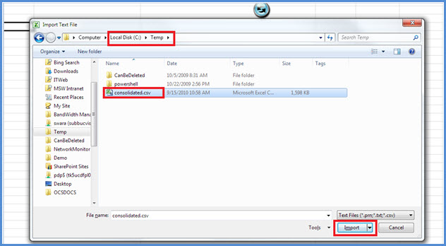

# <a name="skype-for-business-server-2015-resource-kit-tools-documentation"></a>Skype for Business Server strumenti del Resource Kit 2015

In questo articolo vengono descritti gli strumenti inclusi nel Resource Kit di Skype for Business Server 2015, incluso lo scopo di ogni strumento ed esempi del relativo utilizzo. Il Skype for Business Server Resource Kit 2015 consente di semplificare le attività di routine per gli amministratori IT che distribuiscono e gestiscono Skype for Business Server 2015. Ad esempio, lo **strumento Web Conf Data** può essere utilizzato per controllare facilmente i dati caricati dagli utenti durante una riunione online. Lo **strumento SEFAUtil** può essere utilizzato per configurare l'inoltro di chiamata delegato e la risposta per gli utenti. Incoraggiamo gli amministratori IT a usare questi strumenti per gestire in modo più efficace Skype for Business Server 2015.

## <a name="installation-of-the-resource-kit-tools"></a>Installazione degli strumenti del Resource Kit

Per installare il Resource Kit Skype for Business Server 2015, [scaricare](https://www.microsoft.com/download/details.aspx?id=52631)OCSReskit.msidall'Area download.

Eseguire **OCSResKit.msi** per eseguire un'installazione semplice. Il .msi installa tutti gli strumenti nel percorso seguente: **%Programmi%\Skype for Business Server 2015\ResKit**. Gli strumenti che sono eseguibili autonomi si possono trovare in questa cartella. Gli strumenti che dispongono anche di file di supporto sono nelle proprie sottocartelle.

## <a name="supported-environments"></a>Ambienti supportati

Il Resource Kit di Skype for Business Server 2015 deve essere installato in un server che soddisfi le specifiche richieste per Skype for Business Server 2015, in genere uno utilizzato per eseguire Skype for Business Server 2015.

## <a name="resource-kit-tools-overview"></a>Panoramica degli strumenti del Resource Kit

Di seguito è riportato un elenco degli strumenti disponibili nel Resource Kit Skype for Business Server 2015. Nelle sezioni seguenti viene illustrata una descrizione di ogni strumento, inclusi i requisiti e l'utilizzo di esempio.

- [ABSConfig](resource-kit-tools.md#ABSConfig)

- [Monitoraggio servizio criteri larghezza di banda](resource-kit-tools.md#bpsm)

- [Bandwidth Utilization Analyzer](resource-kit-tools.md#bua)

- [Parcheggio di chiamata](resource-kit-tools.md#callpark)

- [DBAnalyze](resource-kit-tools.md#dba)

- [Importare Archiviazione servizio dati](resource-kit-tools.md#Issd)

- [LCSSync](resource-kit-tools.md#LCSSync)

- [Console utente di ricerca](resource-kit-tools.md#LUC)

- [MsTurnPing](resource-kit-tools.md#MsTurnPing)

- [Visualizzatore configurazione di rete](resource-kit-tools.md#NCV)

- [Response Group Agent Live](resource-kit-tools.md#RGAL)

- [SEFAUtil](resource-kit-tools.md#SEFAUtil)

- [SYSPrep.ps1](resource-kit-tools.md#SYSPrep)

- [Migrazione degli annunci di numeri non assegnati](resource-kit-tools.md#UNAM)

- [Dati web conf](resource-kit-tools.md#WebConfData)

## <a name="absconfig"></a>ABSConfig
<a name="ABSConfig"> </a>

Lo strumento di configurazione del servizio Rubrica (ABSConfig) è uno strumento amministrativo che consente agli amministratori di personalizzare la configurazione del servizio Rubrica Skype for Business Server 2015. Questo strumento consente inoltre agli Skype for Business Server 2015 di ripristinare le impostazioni predefinite del servizio Rubrica.

### <a name="description"></a>Descrizione

ABSConfig è un'applicazione dell'interfaccia utente grafica che consente agli amministratori di configurare gli attributi di Servizi di dominio Active Directory correlati al servizio Rubrica.

Gli scenari principali per lo strumento sono i seguenti:

- Per consentire agli amministratori di mappare gli attributi in Servizi di dominio Active Directory agli attributi per Skype for Business Server 2015.

- Per consentire agli amministratori di specificare l'attributo Servizi di dominio Active Directory da includere o escludere nei file del servizio Rubrica.

- Per consentire agli amministratori di ripristinare le impostazioni predefinite del servizio Rubrica.

Lo strumento ABSConfig può essere avviato utilizzando il file ABSConfig.exe file. Lo strumento viene aperto nella **scheda Configura** attributi. In questa tabella sono disponibili opzioni per mappare gli attributi di Servizi di dominio Active Directory ai campi degli attributi per Skype for Business Server 2015 e per specificare quali utenti includere o escludere nei file del servizio Rubrica in base a filtri di attributo specifici. Sono inoltre disponibili opzioni per personalizzare il valore del numero di telefono da includere nel file della Rubrica. **L'opzione Ripristina valori predefiniti** consente agli amministratori di ripristinare i valori predefiniti delle impostazioni del servizio Rubrica.

> [!NOTE]
> Il re-mapping degli attributi di Ad a nomi di campo OC diversi funziona solo per il download di file della Rubrica e non è supportato da Address Book Web Query.

### <a name="output"></a>Output

ABSConfig archivia la configurazione del servizio Rubrica nel database.

```console
Path: %ProgramFiles%\Skype for Business Server 2015\Reskit
```

### <a name="purpose"></a>Finalità

ABSConfig offre un modo semplice e rapido per personalizzare Skype for Business Server 2015 Address Book Service.

### <a name="requirements"></a>Requisiti

#### <a name="computer"></a>Computer

ABSConfig può essere eseguito solo da un computer aggiunto a un dominio Skype for Business Server 2015 installato. Nel caso di Skype for Business Server 2015, edizione Enterprise, questo strumento può essere eseguito su qualsiasi server Front-End in cui è abilitato il servizio Rubrica durante l'installazione.

#### <a name="network"></a>Rete

Il computer dovrebbe essere in grado di connettersi al pool Front-End e al database back-end.

#### <a name="software"></a>Software

Prima di eseguire lo strumento ABSConfig, è necessario installare i componenti software seguenti:

- Skype for Business Server 2015

#### <a name="users"></a>Utenti

Amministratori che dispongono delle autorizzazioni necessarie per aggiornare la Skype for Business Server 2015.

### <a name="examples"></a>Esempi

ABSConfig può essere avviato digitando **ABSConfig.exe** al prompt dei comandi. Di seguito è illustrata l'interfaccia utente dello strumento ABSConfig.


### <a name="summary"></a>Riepilogo

Lo strumento ABSConfig offre agli amministratori uno strumento rapido e facile da usare per personalizzare Skype for Business Server 2015 Address Book Service.

## <a name="bandwidth-policy-service-monitor"></a>Monitoraggio servizio criteri larghezza di banda
<a name="bpsm"> </a>

Lo strumento Monitoraggio servizio criteri di larghezza di banda ha lo scopo di consentire agli amministratori di visualizzare un elenco degli elementi seguenti:

1. Tutti i servizi di Skype for Business Server 2015 configurati (autenticazione e core) nella topologia

2. Le connessioni che ogni servizio effettua ad altri servizi di criteri di larghezza di banda e ai server perimetrali

3. Tutti i collegamenti configurati nel documento di configurazione di rete e l'utilizzo della larghezza di banda in tempo reale, come riportato da ognuno dei servizi dei criteri di larghezza di banda

### <a name="description"></a>Descrizione

Lo strumento Monitoraggio servizio criteri di larghezza di banda viene implementato come applicazione basata su GUI. Gli amministratori avviano lo strumento eseguendo PDPMonUI.exe.

All'avvio dello strumento, tenta di individuare l'elenco dei servizi dei criteri di larghezza di banda nella topologia. Al termine dell'aggiornamento iniziale, il riquadro a sinistra della finestra viene popolato con un elenco di servizi raggruppati in base ai cluster a cui appartengono.

Quando gli amministratori selezionano un particolare servizio di criteri di larghezza di banda, nel riquadro a destra vengono visualizzate le informazioni su quel particolare servizio. In tale riquadro sono inoltre disponibili due schede principali che visualizzano informazioni.

#### <a name="machine-info-tab"></a>Scheda Informazioni computer

Nella **scheda Informazioni computer** vengono visualizzati i dettagli del servizio criteri larghezza di banda selezionato e l'elenco e lo stato di tutte le connessioni effettuate dal servizio criteri di larghezza di banda selezionato ad altri servizi.

#### <a name="topology-info-tab"></a>Scheda Informazioni topologia

Nella **scheda Informazioni topologia** viene visualizzato un elenco di tutti i collegamenti configurati nelle impostazioni di configurazione di rete. Per ogni collegamento viene visualizzata la capacità della larghezza di banda audio e video. Viene inoltre visualizzata la larghezza di banda attualmente utilizzata, sia in Kbps che come percentuale della capacità. Lo strumento utilizza la codifica a colori per evidenziare i collegamenti con un utilizzo vicino alla capacità, in modo da consentire agli amministratori di isolare rapidamente tali collegamenti.

> [!NOTE]
>  Se lo strumento Monitoraggio servizio criteri di larghezza di banda si verifica un  errore quando  si connette a uno dei servizi criteri di larghezza di banda configurati, le informazioni nelle schede Informazioni computer e Informazioni topologia non verranno popolate. Tuttavia, è possibile che lo strumento inizialmente si connetta ma successivamente perda la connessione al servizio. In questi casi, gli amministratori potrebbero visualizzare informazioni obsolete. In ognuna delle schede è presente un timestamp Last **Updated** che consente agli amministratori di visualizzare l'ultimo aggiornamento dei dati per un particolare servizio criteri larghezza di banda.

### <a name="output"></a>Output

Non è disponibile alcun output della riga di comando. l'output del programma è contenuto nell'interfaccia utente grafica (GUI) principale.

### <a name="purpose"></a>Finalità

Lo scopo dello strumento Monitoraggio servizio criteri di larghezza di banda è consentire agli amministratori di visualizzare lo stato di ognuno dei servizi dei criteri di larghezza di banda definiti nella topologia. Inoltre, gli amministratori possono visualizzare l'utilizzo della larghezza di banda in tempo reale per tutti i collegamenti definiti nel documento Configurazione di rete.

### <a name="requirements"></a>Requisiti

Lo strumento Monitoraggio servizio criteri di larghezza di banda deve essere eseguito in un computer che fa parte della topologia Skype for Business Server larghezza di banda.

### <a name="summary"></a>Riepilogo

Lo strumento Monitoraggio servizio criteri di larghezza di banda può essere una risorsa preziosa per gli amministratori, in modo che possano esaminare lo stato di tutti i servizi dei criteri di larghezza di banda nella topologia e, cosa ancora più importante, possono ottenere l'utilizzo della larghezza di banda in tempo reale per i collegamenti definiti nelle impostazioni di configurazione di rete.

## <a name="bandwidth-utilization-analyzer"></a>Bandwidth Utilization Analyzer
<a name="bua"> </a>

Bandwidth Utilization Analyzer è uno strumento che crea report sulle diverse visualizzazioni del consumo di larghezza di banda da parte degli endpoint UC attraverso i collegamenti WAN nella rete aziendale. Questi report possono essere utilizzati per comprendere il modello di consumo corrente della larghezza di banda e per facilitare la pianificazione della capacità della larghezza di banda.

### <a name="description"></a>Descrizione

Bandwidth Utilization Analyzer viene implementato come applicazione basata su GUI. Questo strumento genera report specifici per l'utilizzo audio in tutta la rete e consente di pianificare la capacità. It also iterates on the bandwidth capacity that is assigned to various links.

### <a name="output"></a>Output

Bandwidth Utilization Analyzer fornisce grafici della capacità e dell'utilizzo della larghezza di banda per l'audio per tutti i collegamenti WAN configurati nel sistema.

### <a name="purpose"></a>Finalità

In qualsiasi distribuzione vocale e video, è fondamentale monitorare e comprendere la tendenza dell'utilizzo della larghezza di banda del traffico multimediale nella rete aziendale. Lo strumento Bandwidth Utilization Analyzer consente a un amministratore di ottenere questo risultato. Questo strumento esegue le operazioni seguenti:

- Genera report specifici per l'utilizzo audio in rete

- Consente una pianificazione e un'iterazione della capacità più efficaci sulla capacità della larghezza di banda assegnata a vari collegamenti

Bandwidth Utilization Analyzer può generare grafici di report sulla capacità e sull'utilizzo della larghezza di banda; sono i seguenti:

- Tutti i collegamenti WAN nella rete aziendale

- Filtrato in base ai collegamenti WAN selezionati che sono stati scelti

- Filtrato in base ai collegamenti WAN che hanno superato la capacità dei collegamenti

- Filtrato in base ai collegamenti WAN che hanno utilizzato in modo insufficiente la larghezza di banda di cui è stato eseguito il provisioning

- Filtrare in base ai collegamenti WAN che hanno raggiunto livelli critici (un utilizzo della larghezza di banda superiore al 90% della capacità della larghezza di banda del collegamento WAN)

- Filtrato in base al tipo di collegamento WAN, ovvero collegamenti di rete-sito, collegamenti interregionali e collegamenti all'interno di un sito

- Filtrato per area di rete

#### <a name="applications"></a>Applicazioni

Bandwidth Utilization Analyzer dispone delle due applicazioni seguenti (strumenti):

- **WanLinkLogCollector.exe** Questo strumento consente all'utente di immettere le informazioni necessarie.

- **BandwidthUtilizationAnalyzer.xlsm** Un Microsoft Excel di foglio di calcolo viene avviato automaticamente da WanLinkLogCollector.exe. Questa applicazione consente all'utente di applicare filtri al report, come illustrato più avanti in questo articolo.

#### <a name="phases-of-using-bandwidth-utilization-analyzer"></a>Fasi dell'utilizzo di Bandwidth Utilization Analyzer

Quando si utilizza l'analizzatore dell'utilizzo della larghezza di banda, è necessario eseguire due fasi:

- Raccogliere i registri, che vengono eseguiti tramite WanLinkLogCollector.exe

- Personalizzare i report, che vengono eseguiti utilizzando BandwidthUtilizationAnalyzer.xlsm

    > [!IMPORTANT]
    > È consigliabile che BandwidthUtilizationAnalyzer.xlsm non sia avviato manualmente dagli utenti finali.

#### <a name="starting-bandwidth-utilization-analyzer"></a>Avvio di Bandwidth Utilization Analyzer

Avviare WanLinkLogCollector.exe al prompt dei comandi o utilizzando Windows Explorer.

 **Utilizzo di WanLinkLogCollector.exe**

Esistono tre passaggi per l'utilizzo di WanLinkLogCollector.exe:

1. **Registrare la sequenza temporale** Specificare la sequenza temporale per cui deve essere generato il report

2. **Specificare le directory dei file** Fornire informazioni sulla posizione dei file

3. **Raccogliere i log e avviare il visualizzatore di report** Eseguire il comando per generare il report

#### <a name="step-1---log-the-timeline"></a>Passaggio 1 - Registrare la sequenza temporale

La registrazione della sequenza temporale consente all'utente dello strumento di specificare quanto segue, come illustrato nella figura seguente.

1. **Data di inizio** Questa è la data di inizio della sequenza temporale per cui deve essere generato il report. ad esempio, 1 agosto 2010.

2. **Data di fine** Si tratta della data di fine della sequenza temporale per cui deve essere generato il report. ad esempio, 30 settembre 2010.

     

#### <a name="step-2---specify-the-file-directories"></a>Passaggio 2 - Specificare le directory dei file

Le directory di file seguenti possono essere specificate dall'utente come illustrato.

- **Percorso dei file di registro del server** Percorso della cartella in cui vengono archiviati i registri del server dei criteri di larghezza di banda. In genere si tratta di \<fileserver\> \\<fe \> \AppServerFiles\PDP.

- **Percorso di archiviazione file temporanei** Percorso del file temporaneo in cui vengono archiviati i file intermedi durante la generazione del report.

    

    > [!NOTE]
    > Verificare che all'utente dello strumento sia fornito un accesso sufficiente ai registri del server e alla cartella dell'archivio file temporaneo.

#### <a name="step-3---collect-the-logs-and-start-the-report-viewer"></a>Passaggio 3 - Raccogliere i log e avviare il visualizzatore di report

Per raccogliere i log e avviare il visualizzatore di report, fare clic **su Esegui** come illustrato di seguito. Questo passaggio raccoglie i dati necessari.


Quando la convalida dell'input ha esito positivo, viene visualizzato il messaggio riportato di seguito.


Fare clic su **OK**. BandwidthUtilizationAnalyzer.xlsm viene avviato automaticamente. Seguire le istruzioni nella finestra di messaggio. Per informazioni dettagliate, **vedere Using BandwidthUtilizationAnalyzer.xlsm** nella sezione successiva.


### <a name="using-bandwidthutilizationanalyzerxlsm"></a>Utilizzo di BandwidthUtilizationAnalyzer.xlsm

1. Quando BandwidthUtilizationAnalyzer.xlsm viene avviato automaticamente, fare clic **su Aggiorna** come illustrato di seguito.

     

2. Quando viene aperta una cartella di file, selezionare consolidated.csv dal percorso specificato nella finestra di messaggio, come illustrato di seguito. Il percorso viene inoltre visualizzato **come C:\Temp**.

     

3. Fare clic su **Importa**.

4. Il grafico viene generato automaticamente. È disponibile quando il puntatore in background scompare.

     

#### <a name="applying-filters-to-the-report-view"></a>Applicazione di filtri alla visualizzazione report

I filtri che possono essere applicati alla visualizzazione report come illustrato di seguito sono descritti di seguito:


1. **Nome** Filtra in base ai collegamenti WAN (il filtro si trova sul lato destro del grafico). Il prefisso indica i tipi di collegamento seguenti. vedi la casella verticale (blu):

   - **S Site** Collegamento WAN da un sito di rete a un'area di rete

   - **IS Intersosto** Collegamento WAN tra due siti di rete

   - **R Inter-Region** Collegamento WAN tra due aree di rete

2. **Limite superato** Filtrare in base ai collegamenti WAN il cui utilizzo della larghezza di banda è superiore alla capacità della larghezza di banda

3. **Livelli critici** Filtrare in base ai collegamenti WAN il cui utilizzo della larghezza di banda ha raggiunto il 90% o più della capacità della larghezza di banda

4. **Sotto-utilizzato** Filtro in base ai collegamenti WAN il cui utilizzo della larghezza di banda è inferiore al 25% della capacità della larghezza di banda

5. **Tipo di collegamento** Filtrare in base ai tipi di collegamenti WAN seguenti:

   - **Tipo di sito di** rete

   - **Tipo tra** siti

   - **Tipo di collegamento tra aree**

6. **Area geografica** Filtra per area di rete

Le figure seguenti mostrano i filtri descritti in precedenza.

Filtra per **nome**. Selezionare l'elenco dei collegamenti che devono essere visualizzati nel grafico.


Filtra per **limite superato**. Selezionare **True** per applicare il filtro.


Filtra per **livelli critici**. Selezionare **True** per applicare il filtro.


Filtro in **base a In uso**. Selezionare **True** per applicare il filtro.


Filtra in base **al tipo di collegamento**. Selezionare il tipo o i tipi che devono essere visualizzati.


Filtra per **area**. Selezionare un elenco di aree i cui collegamenti devono essere visualizzati.


### <a name="requirements"></a>Requisiti

- Il .NET Framework 3.5

- Microsoft Excel 2010 o Excel 2007

### <a name="summary"></a>Riepilogo

Bandwidth Utilization Analyzer viene utilizzato per tracciare l'utilizzo della larghezza di banda audio per il traffico UC attraverso la rete. Questo strumento può essere usato anche per segnalare l'utilizzo della larghezza di banda video nella rete.

## <a name="call-parkometer"></a>Parcheggio di chiamata
<a name="callpark"> </a>

Call Parkometer è un'applicazione da riga di comando che consente di accedere facilmente al database orbit del parcheggio di chiamata.

### <a name="description"></a>Descrizione

Call Parkometer è uno strumento per tenere traccia delle chiamate attualmente parcheggiate. Raccoglie inoltre le statistiche relative ai orbit e all'utilizzo del server di parcheggio di chiamata (CPS). Questo strumento da riga di comando fornisce accesso in lettura e scrittura al database orbit SQL Server CPS da un computer locale o connesso in remoto.

Tutte le opzioni si escludono a vicenda. La sintassi della riga di comando è la seguente:

- **-o** parametro: elenca tutti gli intervalli di orbit configurati per questo pool.

- **Parametro -n:** elenca tutti i orbit attualmente utilizzati nel pool. Le informazioni visualizzate sono le seguenti:

  - URI (Uniform Resource Identifier) SIP del parkee e del parcheggiatore.

  - Nome host del CPS in cui è parcheggiata la chiamata.

  - Timestamp del momento in cui è stata parcheggiata la chiamata.

- **Parametro -f:** elenca il numero di orbit attualmente liberi nel pool.

- **-r \<n\>** : elenca le \<n\> ultime chiamate parcheggiate. Le informazioni visualizzate sono le seguenti:

  - URI SIP Parkee.

  - URI SIP di Parker.

  - Nome host del CPS in cui è stata parcheggiata la chiamata.

  - Timestamp del momento in cui la chiamata è stata recuperata o interrotta.

- **-t \<n\>** parameter - verifica la prenotazione di un orbit nel database per mostrare la casualità dei numeri di orbit assegnati.

### <a name="output"></a>Output

A seconda dei parametri di input specificati al prompt dei comandi, call parkometer visualizza il seguente output:

- Tutti gli intervalli di orbit configurati per questo pool

- Chiamate attualmente parcheggiate

- Numero di orbit gratuiti (disponibili)

- Chiamate parcheggiate di recente

- Orbit riservati per il testing di valori di orbit casuali e uniformi

### <a name="purpose"></a>Finalità

Lo scopo dello strumento CPS è fornire l'accesso da riga di comando al database CPS. L'amministratore può visualizzare l'utilizzo di CPS e determinare il numero di orbit assegnati a un pool.

### <a name="requirements"></a>Requisiti

Non esistono requisiti se questo strumento viene eseguito nello stesso computer che esegue CPS. Se questo strumento viene eseguito in un computer remoto, il database SQL Server utilizzato da Skype for Business Server 2015 deve essere configurato per consentire l'accesso remoto. Il parkometer delle chiamate deve essere configurato con SQL Server stringa di connessione al database per connettersi alla SQL Server del pool. Questa SQL Server di connessione al database è definita nel file di configurazione, **parkometer.exe.config**. Deve essere posizionato nella stessa directory in cui parkometer.exe si trova. Il file XML seguente è un esempio di parkometer.exe.config. I parametri che devono essere configurati sono il nome utente (ad esempio, mydomain\Administrator), la password (ad esempio, mypassword) e il nome host (ad esempio, myserver).

```xml
<?xml version="1.0" encoding="utf-8" ?>
<configuration>
  <appSettings>
   <add key="SQL" value="server=myserver\RTC;
database=cpsdyn;
User Id=mydomain\Administrator;
Password=mypassword.;
Integrated Security=false;"/>
  </appSettings>
</configuration>
```

### <a name="examples"></a>Esempi

Intervalli di orbit distribuiti: il parametro -o elenca tutti gli intervalli di orbit configurati per questo pool, come mostrato


Chiamate attualmente parcheggiate: il parametro -n elenca tutti i orbit attualmente utilizzati nel pool, come mostrato


Numero di orbit liberi: il parametro -f elenca il numero di orbit attualmente liberi nel pool, come mostrato


Chiamate parcheggiate di recente: il parametro -r \<n\> elenca le ultime chiamate \<n\> parcheggiate come mostrato


Prenotazione orbit di test: il parametro -t verifica la prenotazione di un \<n\> orbit nel database come mostrato


### <a name="summary"></a>Riepilogo

Parcheggio di chiamata è uno strumento da riga di comando che fornisce informazioni dettagliate sul server parcheggio di chiamata.

## <a name="dbanalyze"></a>DBAnalyze
<a name="dba"> </a>

### <a name="description"></a>Descrizione

DBAnalyze è uno strumento da riga di comando che consente agli amministratori di raccogliere report di analisi sui Skype for Business Server 2015. DBAnalyze ha le modalità seguenti: diagnostica, dati utente, conferenza, MKU e frammentazione del disco:

- **Modalità diagnostica** Crea un report che include informazioni sulle tabelle (numero di record, frammentazione, dimensioni dei dati e dimensioni dell'indice), dimensioni dei file di dati e di registro, ultimo tempo di backup, distribuzione dei contatti tra i server che eseguono Microsoft Office Communications Server, numero medio di autorizzazioni, contatti, contenitori, sottoscrizioni, pubblicazioni, endpoint per utente, eventuali utenti ospitati in modo improprio, utenti che non possono essere instradati, numero medio di conferenze organizzate per utente, conferenze pianificate, conferenze attive e versione del database.

    > [!NOTE]
    > L'esecuzione della modalità diagnostica può influire sulle prestazioni del server.

- **Modalità dati utente** Segnala i dati di contatto, contenitore, sottoscrizione, pubblicazione, autorizzazione e gruppo di contatti per un utente specificato o per gli utenti che dispongono di tale utente nei propri elenchi di contatti e autorizzazioni. Questa modalità segnala anche i dati di riepilogo per le conferenze a cui un utente organizza o è invitato.

- **Modalità conferenza** Riporta i dati dettagliati per una conferenza specifica, inclusi tutti i dettagli della pianificazione della conferenza, l'elenco degli invitati, l'elenco dei tipi di supporti consentiti per la conferenza, le MKU attive (unità di controllo multipunto), l'elenco dei partecipanti attivi e lo stato di segnalazione di ogni partecipante.

- **Decodificare l'ID riunione** Decodifica un ID riunione PSTN (Public Switched Telephone Network) specificato dall'opzione **/pstnid** ma che non si connette al back-end per informazioni dettagliate.

- **Risolvere la conferenza** Decodifica un ID riunione PSTN specificato dall'opzione **/pstnid** e visualizza le informazioni sulla conferenza indicata dall'ID.

- **Modalità MKU** Segnala l'ID, il tipo di supporto, l'URL, lo stato heartbeat, il carico della conferenza e il carico dei partecipanti per ogni MCU nel pool.

- **Modalità frammentazione disco** Visualizza lo stato di frammentazione di tutti i dischi.

Questo strumento può essere utilizzato per diagnosticare vari problemi o per assistere gli amministratori nella pianificazione della capacità. Ad esempio, se la maggior parte degli utenti ospitati nel server A sceglie gli utenti ospitati nel server B come contatti, l'amministratore può spostare gli utenti nel server A al server B per ridurre il traffico tra server.

### <a name="output"></a>Output

Questo strumento genera report predefiniti sul database Skype for Business Server 2015. **Percorso**: %ProgramFiles%\Skype for Business Server 2015\Reskit

### <a name="purpose"></a>Finalità

Per installare Dbanalyze.exe, copiarlo in una cartella locale ed eseguire lo strumento. Per utilizzare lo strumento, eseguire il comando seguente dalla riga di comando. `dbanalyze.exe [/v] [/report:value] [/sqlserver:value] [/user:user@domain.com] [/conf:value][/pstnid:Value] [/maxcontacts:value]` Di seguito sono riportate le descrizioni delle opzioni della riga di comando.


### <a name="requirements"></a>Requisiti

 **Computer** DBAnalyze può essere eseguito solo da un computer aggiunto a un dominio Skype for Business Server 2015 installato.

 **Rete** Il computer dovrebbe essere in grado di connettersi al database back-end.

 **I** Skype for Business Server software 2015 devono essere installati prima di eseguire DBAnalyze.

 **Utenti** La tabella seguente mostra gli amministratori che dispongono delle autorizzazioni necessarie per accedere ai Skype for Business Server 2015.


> [!NOTE]
> Per la modalità **disco /report:disk** è necessario un account amministratore locale.

### <a name="examples"></a>Esempi

Di seguito sono riportati alcuni esempi di comandi Dbanalyze.exe validi:

```console
dbanalyze.exe /report:diag
dbanalyze.exe /report:user /user:usera@domainb.com
dbanalyze.exe /report:conf /user:bob@example.com /conf:1W9J71SKSX2X
dbanalyze.exe /report:resolve /pstnid:12345
dbanalyze.exe /report:mcus
dbanalyze.exe /report:disk
```

### <a name="summary"></a>Riepilogo

DBAnalyzer offre agli amministratori un'analisi rapida e semplice Skype for Business Server 2015.

## <a name="import-storage-service-data"></a>Importare Archiviazione servizio dati
<a name="Issd"> </a>

Lo strumento Del Resource Kit ImportStorageServiceData consente di reimportare i dati della coda e dell'endpoint scaricati dal servizio Archiviazione (LYSS) di nuovo nel servizio Archiviazione.

### <a name="description"></a>Descrizione

I dati scaricati dal servizio Archiviazione potrebbero essere stati automatici (periodici) in base allo stato dell'elemento della coda o alle dimensioni del database. Potrebbe essere avvenuto a causa della chiamata manuale del cmdlet di failover del pool o del cmdlet StorageServiceFullFlush (richiamato dal cmdlet di failover del pool). Si noti che i dati idealmente non devono essere reimportati se una qualsiasi delle dimensioni del database del servizio Archiviazione (LYSS) nei front-end è superiore al livello normale, perché in questo modo è probabile che si esportino più dati. Inoltre, tutti i problemi che potrebbero aver contribuito agli errori che hanno causato l'aumentare della coda del servizio Archiviazione devono essere risolti ,ad esempio errori di endpoint, problemi di rete o altri problemi di Exchange.

 **Scenario 1: durante** il failover del pool, i file possono essere scaricati dal servizio di archiviazione per ogni front-end. Al termine del failover, lo strumento deve essere eseguito per reimportare i dati.

 **Scenario 2:** i dati vengono scaricati automaticamente ogni giorno o in risposta Archiviazione Service database che supera determinate soglie di dimensione (ad esempio 60%, 80%, 90% pieno). Questi dati scaricati automaticamente devono essere reimportati regolarmente dall'amministratore. Nella situazione precedente, se il pacchetto SCOM di monitoraggio non viene distribuito, esistono eventi per il servizio Skype for Business Server Archiviazione relativi ai dati scaricati dal servizio Archiviazione. ID evento di 32075 (operazione di scaricamento completa avviata), 32076 (scaricamento completo completato), 32082 (scaricamento del livello di manutenzione avviato), 32083 (scaricamento del livello di manutenzione completato), 32089 (svuotamento dovuto al riempimento del database). Nota questi ID evento corrispondono alla versione RTM. Quando un amministratore visualizza questi eventi, significa che sono presenti file che sono stati scaricati. Questi dati devono essere regolarmente importati di nuovo usando questo strumento, ad esempio una volta alla settimana.

Per la versione del servizio online, se viene distribuito il pacchetto SCOM per il monitoraggio dell'integrità per Skype for Business Server, è possibile che venga generato un nuovo avviso che richiede all'amministratore di reimportare i dati scaricati nel servizio Archiviazione. Ci sarà un evento corrispondente nel registro eventi nel server Front-End che ha attivato l'avviso. L'evento darà una descrizione del percorso padre in cui si trovano i file di dati scaricati e il numero di file che soddisfano i criteri di avviso. I criteri di avviso sono x o più file nel percorso padre specifico che hanno almeno Y giorni (dove X e Y sono preimpostati all'interno di StorageService, ma possono essere ignorati modificando il file APPCONFIG). Di seguito sono riportati due esempi di eventi che possono attivare l'avviso di integrità, con la differenza che è il percorso padre. Una possibilità è la condivisione file del servizio Web, mentre l'altra è la directory dati applicazioni locale di ogni front-end. (ad esempio c:\ProgramData\Microsoft\Skype for Business Server 2015\StorageService). L'amministratore eseguirà quindi questo strumento reskit.

Questo strumento aumenterà il carico di CPU e I/O sul front-end in cui è in esecuzione e di altri front-end, nel caso in cui i dati non sono di proprietà del front-end in cui viene eseguito lo strumento. È consigliabile eseguire questo strumento quando i front-end non sono sotto carico elevato di CPU e I/O, ad esempio al di fuori delle ore di punta. In secondo luogo, questo strumento può richiedere da 2 a 3 minuti per importare un file di dati. Tieni presente questo problema durante la stima della durata dell'esecuzione dello strumento. Il file di registro dettagliato generato dallo strumento verrà visualizzato per impostazione predefinita nell'archivio file. Eliminarlo se non vengono segnalati errori, perché il file di registro può contenere decine di MB o più.


### <a name="requirements"></a>Requisiti

Installare gli strumenti Skype for Business Server Resource Kit di Skype for Business Server 2015. Lo strumento viene eseguito nei computer aggiunti al dominio Skype for Business Server e Skype for Business Server Management Shell. Lo strumento utilizza un cmdlet dalla shell di gestione per identificare tutti Front-End server nel pool. In secondo luogo, lo strumento deve essere eseguito da un computer del pool in cui è installato il database **RtcLocal.** Questo database viene utilizzato dallo strumento per recuperare il percorso della condivisione file WEBSERVICE per il pool. Inoltre, prima di utilizzare lo strumento, ogni server Front-End deve prima abilitare la comunicazione remota di Windows PowerShell tramite **Enable-PSRemoting** in ogni server Front-End e il computer da cui viene eseguito lo strumento. In caso contrario, Windows PowerShell comandi remoti da questo strumento avranno esito negativo. Windows PowerShell La comunicazione remota può essere disattivata in Front-End server nel pool al termine. Infine, l'account o le credenziali che richiamano lo strumento devono disporre dell'autorizzazione di lettura/scrittura per la condivisione file del servizio Web per il pool in cui sta eseguendo lo strumento. In caso contrario, lo strumento avrà esito negativo con errori di autorizzazione I/O.

> [!NOTE]
> In Windows Server 2012, la Windows PowerShell remota è abilitata per impostazione predefinita, ma non nel sistema operativo Windows Server 2008.

### <a name="examples"></a>Esempi

```console
>  C:\StorageService>ImportStorageServiceData.exe
Description:
This tool will re-import Storage Service (LYSS) flushed queue data back in.  For a pool: you are required to run this tool on a machine inside the pool which has the Lync Server Management Shell installed.  Additionally, all front end machines need to have Windows Powershell Remoting enabled before executing this tool by executing Enable-PSRemoting.  Also, please ensure that all Storage Service instance DB Size are at the 'Normal' level (verify this by viewing Eventlog events). Otherwise re-importing may cause data to be flushed out again if any Storage Service instance DB size level goes above 'Normal'.
Usage: Default behavior is to Import data from web service file share as well as any files on all Front End machines in pool.
Additional Options:
-Verbose                    : Turn verbose output on.

-StorageServiceHostName     : Host Name of Storage Service WCF endpoint.  ( Default=localhost netnamedpipe binding. )

-FileSharePath              : Import only all data from just under the UNC path specified.

ActivityID: cc3b62ff-bb66-4e61-a6e2-96cb3626315c. <-- Use this to correlate with StorageService trace logs if troubleshooting.
Type Server name (TCP binding) or press <enter> for localhost (NamePipe binding):
Using NetNamedPipeBinding...
OnTopologyChanged Event received
Web Service File Share: \\dc.vdomain.com\OcsFileStore\co1-WebServices-1\StorageService

Front Ends:
server.vdomain.com
server2.vdomain.com
server1.vdomain.com
server3.vdomain.com
Looking under directory: \\dc.vdomain.com\OcsFileStore\co1-WebServices-1\StorageService for exported data.
# Files found: 8
Starting Import for file:\\dc.vdomain.com\OcsFileStore\co1-WebServices-1\StorageService\DataExport\2
0120910\SERVER.vdomain.com\944f5724c65c5f93900dc1c8c898b102__0.xml
Items deserialized: 20

All items in file were enqueued successfully, will try to delete file: \\dc.vdomain.com\OcsFileStore\co1-WebServices-1\StorageService\DataExport\20120910\SERVER.vdomain.com\944f5724c65c5f93900dc1c8c898b102__0.xml

All items in file failed to enqueue so file will not be deleted.  File path: \\dc.vdomain.com\OcsFileStore\co1-WebServices-1\StorageService\DataExport\20120910\SERVER.vdomain.com\944f5724c65c5f93900dc1c8c898b102__0.xml

Summary for file \\dc.vdomain.com\OcsFileStore\co1-WebServices-1\StorageService\DataExport\20120910\SERVER.vdomain.com\944f5724c65c5f93900dc1c8c898b102__0.xml: succeeded: 20, failed: 0

Starting Import for file:\\dc.vdomain.com\OcsFileStore\co1-WebServices-1\StorageService\DataExport\20120910\SERVER1.vdomain.com\17d5435ae40259f7bbdf1866776386e4__0.xml
Items deserialized: 20

[cc3b62ff-bb66-4e61-a6e2-96cb3626315c] Send EnqueueMessages to redirected, targetServer=server1.vdomain.com, queueItems=20

All items in file were enqueued successfully, will try to delete file: \\dc.vdomain.com\OcsFileStore\co1-WebServices-1\StorageService\DataExport\20120910\SERVER1.vdomain.com\17d5435ae40259f7bbdf1866776386e4__0.xml

All items in file failed to enqueue so file will not be deleted.  File path: \\dc.vdomain.com\OcsFileStore\co1-WebServices-1\StorageService\DataExport\20120910\SERVER1.vdomain.com\17d5435ae40259f7bbdf1866776386e4__0.xml

Summary for file \\dc.vdomain.com\OcsFileStore\co1-WebServices-1\StorageService\DataExport\20120910\
SERVER1.vdomain.com\17d5435ae40259f7bbdf1866776386e4__0.xml: succeeded: 20, failed: 0

Starting Import for file:\\dc.vdomain.com\OcsFileStore\co1-WebServices-1\StorageService\DataExport\20120910\SERVER1.vdomain.com\904f6c9b8ac951ae8b3c86684d3832e4__0.xml

Items deserialized: 20
[cc3b62ff-bb66-4e61-a6e2-96cb3626315c] Send EnqueueMessages to redirected, targetServer=server1.vdomain.com, queueItems=20

All items in file were enqueued successfully, will try to delete file: \\dc.vdomain.com\OcsFileStore
\co1-WebServices-1\StorageService\DataExport\20120910\SERVER1.vdomain.com\904f6c9b8ac951ae8b3c86684d
3832e4__0.xml

All items in file failed to enqueue so file will not be deleted.  File path: \\dc.vdomain.com\OcsFil
eStore\co1-WebServices-1\StorageService\DataExport\20120910\SERVER1.vdomain.com\904f6c9b8ac951ae8b3c
86684d3832e4__0.xml

Summary for file \\dc.vdomain.com\OcsFileStore\co1-WebServices-1\StorageService\DataExport\20120910\
SERVER1.vdomain.com\904f6c9b8ac951ae8b3c86684d3832e4__0.xml: succeeded: 20, failed: 0

Starting Import for file:\\dc.vdomain.com\OcsFileStore\co1-WebServices-1\StorageService\DataExport\2
0120910\SERVER2.vdomain.com\69844a271e6c5633a1f2b46a42287dd6__0.xml

Items deserialized: 20

[cc3b62ff-bb66-4e61-a6e2-96cb3626315c] Send EnqueueMessages to redirected, targetServer=server2.vdom
ain.com, queueItems=20

All items in file were enqueued successfully, will try to delete file: \\dc.vdomain.com\OcsFileStore
\co1-WebServices-1\StorageService\DataExport\20120910\SERVER2.vdomain.com\69844a271e6c5633a1f2b46a42
287dd6__0.xml

All items in file failed to enqueue so file will not be deleted.  File path: \\dc.vdomain.com\OcsFil
eStore\co1-WebServices-1\StorageService\DataExport\20120910\SERVER2.vdomain.com\69844a271e6c5633a1f2
b46a42287dd6__0.xml

Summary for file \\dc.vdomain.com\OcsFileStore\co1-WebServices-1\StorageService\DataExport\20120910\
SERVER2.vdomain.com\69844a271e6c5633a1f2b46a42287dd6__0.xml: succeeded: 20, failed: 0

Starting Import for file:\\dc.vdomain.com\OcsFileStore\co1-WebServices-1\StorageService\DataExport\2
0120910\SERVER3.vdomain.com\3313935458e35b9b9759e08a15d251e6__0.xml

Items deserialized: 20

[cc3b62ff-bb66-4e61-a6e2-96cb3626315c] Send EnqueueMessages to redirected, targetServer=server3.vdom
ain.com, queueItems=1

All items in file were enqueued successfully, will try to delete file: \\dc.vdomain.com\OcsFileStore
\co1-WebServices-1\StorageService\DataExport\20120910\SERVER3.vdomain.com\3313935458e35b9b9759e08a15
d251e6__0.xml

All items in file failed to enqueue so file will not be deleted.  File path: \\dc.vdomain.com\OcsFil
eStore\co1-WebServices-1\StorageService\DataExport\20120910\SERVER3.vdomain.com\3313935458e35b9b9759
e08a15d251e6__0.xml

Summary for file \\dc.vdomain.com\OcsFileStore\co1-WebServices-1\StorageService\DataExport\20120910\
SERVER3.vdomain.com\3313935458e35b9b9759e08a15d251e6__0.xml: succeeded: 20, failed: 0

Starting Import for file:\\dc.vdomain.com\OcsFileStore\co1-WebServices-1\StorageService\DataExport\2
0120910\SERVER3.vdomain.com\4501e04eae4856059346949ff817c220__0.xml
Items deserialized: 20
[cc3b62ff-bb66-4e61-a6e2-96cb3626315c] Send EnqueueMessages to redirected, targetServer=server3.vdom
ain.com, queueItems=1
All items in file were enqueued successfully, will try to delete file: \\dc.vdomain.com\OcsFileStore
\co1-WebServices-1\StorageService\DataExport\20120910\SERVER3.vdomain.com\4501e04eae4856059346949ff8
17c220__0.xml
All items in file failed to enqueue so file will not be deleted.  File path: \\dc.vdomain.com\OcsFil
eStore\co1-WebServices-1\StorageService\DataExport\20120910\SERVER3.vdomain.com\4501e04eae4856059346
949ff817c220__0.xml

Summary for file \\dc.vdomain.com\OcsFileStore\co1-WebServices-1\StorageService\DataExport\20120910\
SERVER3.vdomain.com\4501e04eae4856059346949ff817c220__0.xml: succeeded: 20, failed: 0
Starting Import for file:\\dc.vdomain.com\OcsFileStore\co1-WebServices-1\StorageService\DataExport\2
0120910\SERVER3.vdomain.com\5ad77443ad955a22a876749be66d5317__0.xml

Items deserialized: 20
[cc3b62ff-bb66-4e61-a6e2-96cb3626315c] Send EnqueueMessages to redirected, targetServer=server3.vdom
ain.com, queueItems=20
All items in file were enqueued successfully, will try to delete file: \\dc.vdomain.com\OcsFileStore
\co1-WebServices-1\StorageService\DataExport\20120910\SERVER3.vdomain.com\5ad77443ad955a22a876749be6
6d5317__0.xml
All items in file failed to enqueue so file will not be deleted.  File path: \\dc.vdomain.com\OcsFil
eStore\co1-WebServices-1\StorageService\DataExport\20120910\SERVER3.vdomain.com\5ad77443ad955a22a876
749be66d5317__0.xml
Summary for file \\dc.vdomain.com\OcsFileStore\co1-WebServices-1\StorageService\DataExport\20120910\
SERVER3.vdomain.com\5ad77443ad955a22a876749be66d5317__0.xml: succeeded: 20, failed: 0
Starting Import for file:\\dc.vdomain.com\OcsFileStore\co1-WebServices-1\StorageService\DataExport\2
0120910\SERVER3.vdomain.com\a11e27ae439a582288d4657eda86b565__0.xml
Items deserialized: 20
[cc3b62ff-bb66-4e61-a6e2-96cb3626315c] Send EnqueueMessages to redirected, targetServer=server3.vdom
ain.com, queueItems=20
All items in file were enqueued successfully, will try to delete file: \\dc.vdomain.com\OcsFileStore
\co1-WebServices-1\StorageService\DataExport\20120910\SERVER3.vdomain.com\a11e27ae439a582288d4657eda
86b565__0.xml
All items in file failed to enqueue so file will not be deleted.  File path: \\dc.vdomain.com\OcsFil
eStore\co1-WebServices-1\StorageService\DataExport\20120910\SERVER3.vdomain.com\a11e27ae439a582288d4
657eda86b565__0.xml
Summary for file \\dc.vdomain.com\OcsFileStore\co1-WebServices-1\StorageService\DataExport\20120910\
SERVER3.vdomain.com\a11e27ae439a582288d4657eda86b565__0.xml: succeeded: 20, failed: 0
All files have been imported into Storage Service for path: \\dc.vdomain.com\OcsFileStore\co1-WebSer
vices-1\StorageService
Importing files for: server.vdomain.com
No files founds.
Importing files for: server2.vdomain.com
No files founds.
Importing files for: server1.vdomain.com
No files founds.
Importing files for: server3.vdomain.com
No files founds.
Writing log: \\dc.vdomain.com\OcsFileStore\co1-WebServices-1\StorageService\ImportStorageServiceData
Log20120910_1609SS
Tool has finished execution.
>  C:\StorageService>
```

## <a name="lcssync"></a>LCSSync
<a name="LCSSync"> </a>

Lo strumento LCSSync consente di distribuire Skype for Business Server 2015 in un ambiente a più foreste. Questo strumento viene utilizzato per sincronizzare utenti e gruppi di foreste di utenti diverse come oggetto contatto di Servizi di dominio Active Directory in una foresta centrale in cui è installato Skype for Business Server 2015.

### <a name="description"></a>Descrizione

 LCSSync utilizza gli oggetti contatto di Servizi di dominio Active Directory sincronizzati nella foresta centrale per abilitare gli utenti per Skype for Business Server. Per fornire l'accesso Single Sign-in, l'account utente principale deve essere mappato all'oggetto contatto di Servizi di dominio Active Directory nella foresta centrale per Skype for Business Server 2015. Questo strumento consente di eseguire tale mapping. Questo strumento fornisce modelli per la creazione di agenti di gestione in Microsoft Identity Integration Server.

### <a name="summary"></a>Riepilogo

Lo strumento LCSSync consente di distribuire Skype for Business Server 2015 in un ambiente a più foreste.

## <a name="lookup-user-console"></a>Console utente di ricerca
<a name="LUC"> </a>

Lo strumento LookupUserConsole consente di visualizzare informazioni Skype for Business Server instradamento di utenti specifici. Queste informazioni possono essere utili per il supporto personale di Microsoft nella diagnosi dei problemi di distribuzione e routing.

### <a name="description"></a>Descrizione

 L'LookupUserConsole.exe aprirà un prompt dei comandi che accetta indirizzi SIP e tenterà di visualizzare le informazioni di routing Skype for Business Server interno relative. Digitare **exit** per uscire dallo strumento LookupUserConsole.

### <a name="requirements"></a>Requisiti

Installare il Resource Kit Skype for Business Server 2015. Lo strumento viene eseguito nei computer aggiunti a un dominio Skype for Business Server è installato.

### <a name="examples"></a>Esempi

C:\Programmi\Skype for Business Server 2015\ResKit \>LookupUserConsole.exe

```console
> sip:john.doe@vdomain.com

  Execution time (ms):                            171.094
  Exeuction result:                               Success
  SIP URI:                                        sip:john.doe@vdomain.com
  User info:
    SID:                                          S-1-5-21-2831376166-29632525...    Display name:                                     John Doe
    Grouping ID:                                  00000000-0000-0000-0000-...
    Line URI:                                     <null>
    Policy assignment:                            TenantId={00000000--0000-000....
    SIP enabled:                                  True
    UC enabled:                                   False
    Tenant ID:                                    00000000-0000-0000-0000-...  Cluster info:
    Active cluster:                               pool0.vdomain.com
    Backup registrar cluster:                     <null>
    Deployment location:                          <null>
    Home Front-End FQDN:                          SERVER.vdomain.com
    Primary Registrar cluster:                    pool0.vdomain.com
    Remote Director external SIP FQDN:            <null>
    Remote Director internal SIP FQDN:            <null>
    Remote Director Web FQDN:                     <null>
    Routing group ID:                             4501e04e-ae48-5605-9346...
    Service tag ID:                               1266953005
    User Front-End resolved:                      True
    User in local forest:                         True
    User in remote forest:                        False
    User in split domain:                         False
    User-Services cluster:                        pool0.vdomain.com

> sip:nouser@vdomain.com

  Execution time (ms):                            948.7574
  Exeuction result:                               UserDoesNotExist

> exit
```

## <a name="msturnping"></a>MsTurnPing
<a name="MsTurnPing"> </a>

Lo strumento MSTurnPing consente a un amministratore del software di comunicazione di Skype for Business Server 2015 di controllare lo stato dei server che eseguono i servizi di autenticazione Audio/Video Edge, Audio/Video e dei server che eseguono Servizi criteri di larghezza di banda nella topologia.

### <a name="description"></a>Descrizione

Lo strumento MSTurnPing consente a un amministratore del software di comunicazione di Skype for Business Server 2015 di controllare lo stato dei server che eseguono i servizi di autenticazione Audio/Video Edge, Audio/Video e dei server che eseguono Servizi criteri di larghezza di banda nella topologia.

Lo strumento consente all'amministratore di eseguire i test seguenti:

1. Test A/V Edge Server: lo strumento esegue test su tutti i server A/V Edge Server della topologia eseguendo le operazioni seguenti:

   - Verifica che il servizio Skype for Business Server di autenticazione audio/video sia stato avviato e che possa emettere credenziali appropriate.

   - Verifica che il Skype for Business Server edge audio/video sia stato avviato e che possa allocare correttamente le risorse sul perimetro esterno.

2. Test del servizio criteri di larghezza di banda: lo strumento esegue test su tutti i server che eseguono i Servizi criteri di larghezza di banda nella topologia eseguendo le operazioni seguenti:

   - Verifica che il servizio criteri Skype for Business Server larghezza di banda (autenticazione) sia stato avviato e che possa emettere credenziali appropriate.

   - Verifica che il servizio criteri Skype for Business Server larghezza di banda (Core) sia stato avviato e che sia in grado di eseguire correttamente il controllo della larghezza di banda.

Questo strumento deve essere eseguito da un computer che fa parte della topologia e in cui è installato l'archivio locale.

### <a name="output"></a>Output

Lo strumento restituisce i risultati di ognuna delle operazioni.

- Se viene eseguito il test **AudioVideoEdgeServer,** gli output dello strumento sono i seguenti:

  - Risultati dei test dei computer che forniscono il Skype for Business Server di autenticazione audio/video 2015 nella topologia

  - Risultati dei test dei computer che forniscono il Skype for Business Server Edge audio/video 2015 nella topologia

- Se viene eseguito il test **BandwidthPolicyServer,** gli output dello strumento sono i seguenti:

  - Risultati dei test dei computer che forniscono il Skype for Business Server 2015 Bandwidth Policy Service (Authentication) nella topologia

  - Risultati dei test dei computer che forniscono il Skype for Business Server 2015 Bandwidth Policy Service (Core) nella topologia

### <a name="requirements"></a>Requisiti

- Questo strumento deve essere eseguito da un computer che si trova nella topologia e che dispone dell'archivio locale.

- Lo strumento deve essere eseguito come amministratore che ha accesso all'archivio locale.

### <a name="examples"></a>Esempi

Di seguito è riportato un esempio dell'input dello strumento.

```console
MsTurnPing -ServerRole AudioVideoEdgeServer

MsTurnPing -ServerRole BandwidthPolicyServer
```

### <a name="summary"></a>Riepilogo

Questo strumento può essere una risorsa preziosa per gli Skype for Business Server 2015 che desiderano controllare lo stato dei server che eseguono servizi di criteri audio/video e larghezza di banda.

## <a name="network-configuration-viewer"></a>Visualizzatore configurazione di rete
<a name="NCV"> </a>

Visualizzatore configurazione di rete può essere utilizzato dagli amministratori del software di comunicazione di Skype for Business Server 2015 per visualizzare la topologia di rete del servizio Controllo di ammissione di chiamata (CAC) per un'azienda di cui viene eseguito il provisioning per consentire sessioni di comunicazione in tempo reale, ad esempio chiamate vocali o video in base alla capacità di larghezza di banda specificata. Skype for Business Server 2015 gli amministratori definiscono i criteri di controllo di ammissione di chiamata, che vengono applicati dai servizi dei criteri di larghezza di banda installati con Skype for Business Server 2015.

### <a name="description"></a>Descrizione

Visualizzatore configurazione di rete (NetworkConfigurationViewer.exe) consente agli amministratori di eseguire le attività seguenti:

- Caricare e visualizzare la topologia di rete CAC da una Skype for Business Server 2015 in formato grafico.

- Caricare e visualizzare la topologia di rete CAC da un file di registro del server dei criteri di larghezza di banda in formato grafico.

- Salvare e archiviare la topologia di rete CAC in un formato XML sul disco.

- Salvare e archiviare il diagramma della topologia di rete CAC in formato JPG o BMP.

- Visualizzare i dati di configurazione della topologia di rete CAC.

- Visualizzare la topologia di rete del controllo di ammissione di chiamata in uno stile di visualizzazione albero.

- Definire connettori personalizzati per i collegamenti di topologia di rete CAC (ad esempio, collegamenti da sito a area, da area a area e da sito a sito).

- Visualizzare le informazioni sul sito della topologia di rete CAC, le informazioni sull'area e i criteri di larghezza di banda e i collegamenti di rete di cui è stato eseguito il provisioning.

### <a name="purpose"></a>Finalità

Visualizzare i collegamenti della topologia di rete del controllo di ammissione di chiamata dell'organizzazione in un'interfaccia grafica.

### <a name="examples"></a>Esempi

 Caricare e visualizzare la topologia di rete CAC da una distribuzione di **Skype for Business Server 2015 in** formato grafico: gli amministratori di Skype for Business Server 2015 possono caricare e visualizzare la configurazione della topologia di rete CAC in qualsiasi computer Skype for Business Server 2015 utilizzando l'opzione **Scarica** configurazione di rete, come illustrato nella figura seguente. Lo strumento non riesce a scaricare o visualizzare tale configurazione quando viene distribuito in un computer che non dispone di connettività all'Skype for Business Server 2015.


 Caricare e visualizzare la topologia di rete CAC da un file di registro del server dei criteri di larghezza di banda in formato grafico: i server dei criteri di larghezza di banda di Skype for Business Server 2015 salvano la topologia di rete **CAC** come parte del meccanismo di registrazione nel percorso di condivisione file di Skype for Business Server 2015. Skype for Business Server 2015 gli amministratori possono visualizzare un file di questo tipo in formato grafico utilizzando l'opzione Apri configurazione **di** rete come illustrato di seguito.


Salvare e archiviare la topologia di rete CAC in un formato XML sul disco: gli amministratori di Skype for Business Server 2015 possono salvare il file di configurazione della topologia di rete CAC in un formato XML utilizzando l'opzione Salva una copia di Configurazione di rete, come illustrato di seguito.  Il file di configurazione salvato può quindi essere utilizzato offline per la visualizzazione grafica.


Salvare e archiviare il diagramma della topologia di rete CAC in formato JPG o BMP: gli amministratori di Skype for Business Server 2015 possono  salvare la configurazione della topologia di rete CAC in un formato grafico (formati di file JPG e BMP) utilizzando l'opzione Salva diagramma configurazione di rete come immagine, come illustrato di seguito.


 <strong>View CAC network topology configuration data:</strong>Skype for Business Server 2015 administrators can view related network configuration data such as network regions, network sites, bandwidth profiles, and site subnet IP addresses in a textual format by using the View Network Configuration data option as shown below.


 Visualizzare la topologia di rete del controllo di ammissione di chiamata in uno stile di visualizzazione **albero:** gli amministratori di Skype for Business Server 2015 possono visualizzare i dati di configurazione di rete correlati in uno stile di visualizzazione ad albero grafico utilizzando il pannello di controllo sul lato sinistro della finestra degli strumenti, come illustrato di seguito.


 Definire connettori personalizzati per i collegamenti di topologia di rete **CAC (ad** esempio da sito a area, da area a area e da sito a sito): gli amministratori di Skype for Business Server 2015 possono definire connettori grafici personalizzati per i collegamenti WAN di configurazione della rete CAC utilizzando l'opzione Impostazioni, come illustrato di seguito. Ciò consente di distinguere tra vari tipi di collegamenti di rete di cui viene eseguito il provisioning nella configurazione di rete.


 Visualizzare le informazioni sul sito della topologia di rete **CAC,** le informazioni sull'area geografica e i criteri di larghezza di banda di cui è stato eseguito il provisioning: gli amministratori di Skype for Business Server 2015 possono visualizzare le informazioni correlate sull'area di rete del controllo di ammissione di chiamata, le informazioni sul sito e le informazioni sul provisioning della larghezza di banda del controllo di ammissione di chiamata utilizzando le opzioni illustrate di seguito. Ad esempio, fare clic su **Informazioni** in un'area di rete o in un oggetto sito di rete.


### <a name="summary"></a>Riepilogo

Questo strumento può essere una risorsa preziosa per gli Skype for Business Server 2015 che desiderano visualizzare la topologia di rete CAC per la distribuzione in un formato grafico.

## <a name="response-group-agent-live"></a>Response Group Agent Live
<a name="RGAL"> </a>

L'applicazione Response Group offre agli agenti la possibilità di accedere a informazioni utili in tempo reale utilizzando il servizio Web incorporato. Purtroppo, all'esterno dell'applicazione non è disponibile alcuna visualizzazione grafica di questi dati. Lo strumento Response Group Agent Live Resource Kit risolve questo problema fornendo un modo semplice e grafico per accedere a queste informazioni, migliorato con informazioni software di comunicazione Skype for Business Skype for Business in tempo reale, ad esempio la presenza di altri agenti.

### <a name="description"></a>Descrizione

Response Group Agent Live è un'applicazione Windows che fornisce funzionalità di accesso e disconnessione e alcune informazioni in tempo reale (ad esempio l'appartenenza al gruppo e il numero corrente di chiamate) agli agenti di Response Group. Ha lo scopo di essere una versione avanzata della pagina Gruppi di agenti (accessibile da Skype for Business.

### <a name="purpose"></a>Finalità

L'applicazione Response Group accoda le chiamate in arrivo e quindi le instrada ai gruppi di agenti. Per prendere decisioni informate sulle chiamate al servizio, gli agenti possono accedere a informazioni in tempo reale sui gruppi di agenti, ad esempio quali altri agenti sono disponibili e quante chiamate sono in attesa in ogni coda. Queste informazioni, inizialmente accessibili solo tramite il servizio Response Group, sono rese disponibili in modo intuitivo da Response Group Agent Live.

#### <a name="features"></a>Funzionalità

Lo strumento Response Group Agent Live è basato sul servizio Response Group e Skype for Business Server 2015 SDK. Fornisce agli agenti di Response Group le informazioni e le funzionalità disponibili dal servizio Response Group ,ad esempio l'appartenenza a gruppi, la presenza di altri agenti e il numero di chiamate in attesa.

La figura seguente illustra l'interfaccia principale di Response Group Agent Live.


Le tre funzionalità principali seguenti sono disponibili per gli agenti in Response Group Agent Live:

- **Accesso/disconnessione:** A differenza della pagina Gruppi di agenti (accessibile da Skype for Business Server 2015), Agente Response Group Live consente solo agli agenti di accedere o disconnettersi da tutti i gruppi di agenti contemporaneamente. Questa applicazione offre tre modi rapidi per l'accesso o la disconnessione degli agenti:

  - Fai clic sui pulsanti Accedi/Esci (verde e rosso) all'interno dell'applicazione.

  - Fai clic con il pulsante destro del mouse sull'icona della barra delle applicazioni e scegli Accedi o disconnetto.

  - Uso di tasti di scelta rapida configurabili.

- **Appartenenza al gruppo:** Quando un gruppo di agenti è selezionato, Response Group Agent Live visualizza l'elenco degli agenti in questo gruppo nel riquadro destro. Se Skype for Business Server 2015 è in esecuzione nello stesso computer dell'applicazione, le informazioni sulla presenza e la scheda contatto vengono visualizzate in Response Group Agent Live. Gli agenti possono inviare un messaggio istantaneo o chiamare altri agenti direttamente da lì.

- **Statistiche in tempo reale:** Response Group Agent Live fornisce statistiche in tempo reale per tutti i gruppi di agenti. La frequenza di aggiornamento è di un minuto. Quando un Response Group risponde a una chiamata, accanto al nome del gruppo viene aggiunto un indicatore visivo con il numero corrente di chiamate in coda. La sospensione del puntatore su un gruppo mostra anche il tempo di attesa più lungo.

### <a name="requirements"></a>Requisiti

L'agente di Response Group Live richiede .NET Framework 4.0. Inoltre, per sfruttare le funzionalità di presenza e scheda contatto, Skype for Business deve essere installato in locale (ed essere in esecuzione).

#### <a name="configuration"></a>Configurazione

Response Group Agent Live può essere personalizzato in base alle singole preferenze utilizzando la finestra di dialogo Opzioni dell'applicazione. Inoltre, l'amministratore può definire l'indirizzo host predefinito modificando direttamente la proprietà defaultHostAddress del file RGAgentLive.exe.config predefinito.

Nella figura seguente viene illustrata la finestra di dialogo Opzioni che gli agenti possono utilizzare per configurare l'indirizzo host e i tasti di scelta rapida. Per accedere a questa finestra di dialogo, fare clic sul pulsante Opzioni in alto a destra nell'interfaccia principale.


Nella configurazione live dell'agente Response Group è possibile personalizzare le tre impostazioni seguenti:

- Indirizzo host: si tratta in genere dell'FQDN del pool Web appartenente al pool principale dell'agente. L'indirizzo esatto del servizio Response Group viene automaticamente derivato in background da queste informazioni (aggiungendo il percorso corretto dopo l'host).

- Collegamenti: i collegamenti esatti per l'accesso/disconnessione possono essere personalizzati. L'unica limitazione è che entrambi i tasti di scelta rapida devono contenere il tasto "logo Windows" (oltre ad almeno un altro tasto).

- Iniziare con Windows: l'applicazione può essere configurata per l'avvio automatico con Windows.

### <a name="examples"></a>Esempi

Nella figura seguente viene illustrato come chiamare o inviare un messaggio istantaneo a un altro agente facendo clic con il pulsante destro del mouse sul contatto nel riquadro destro.


Nella figura seguente viene illustrato il modo in cui Response Group Agent Live visualizza il numero corrente di chiamate nella coda e il tempo di attesa più lungo tra tutte queste chiamate in arrivo.


### <a name="summary"></a>Riepilogo

L'accesso rapido e la disconnessione, l'appartenenza ai gruppi e le statistiche di base in tempo reale sono interessanti funzionalità degli agenti di Response Group disponibili solo all'esterno dell'applicazione dal servizio Response Group. Con lo strumento Response Group Agent Live Resource Kit, gli amministratori di Skype for Business Server 2015 possono fornire agli agenti un'applicazione Windows che consente loro di eseguire attività in modo più rapido e grafico.

## <a name="sefautil"></a>SEFAUtil
<a name="SEFAUtil"> </a>

SEFAUtil (attivazione delle funzionalità di estensione secondaria) è uno strumento da riga di comando che consente agli amministratori del software di comunicazione e agli agenti del supporto tecnico di Skype for Business Server 2015 di configurare l'squillo delegato, l'inoltro di chiamata, lo squillo simultaneo, le impostazioni delle chiamate del team e la risposta alle chiamate di gruppo per conto di un utente di Skype for Business Server 2015. Lo strumento consente inoltre agli amministratori di eseguire query nelle impostazioni di routing delle chiamate pubblicate per un determinato utente. Lo strumento SEFAUtil consente all'amministratore di abilitare/disabilitare/modificare l'inoltro di chiamata o di squillare contemporaneamente per conto dell'utente. L'amministratore può specificare la destinazione (sotto forma di URI SIP) o utilizzare una destinazione già pubblicata dall'utente. Questo strumento consente inoltre agli amministratori di aggiungere o rimuovere delegati o membri del gruppo di chiamate al team per conto dell'utente. Questo strumento è basato su Microsoft Unified Communications Managed API (UCMA) 3.0 e richiede che gli amministratori creino un'applicazione attendibile nell'archivio di gestione centrale per SEFAUtil.

SEFAUtil (attivazione delle funzionalità di estensione secondaria) consente agli amministratori e agli agenti helpdesk di Skype for Business Server 2015 di configurare l'squillo delegato, l'inoltro di chiamata, lo squillo simultaneo, le impostazioni delle chiamate del team e la risposta alle chiamate di gruppo per conto di un utente di Skype for Business Server 2015. Questo strumento consente inoltre agli amministratori di eseguire query nelle impostazioni di routing delle chiamate pubblicate per un determinato utente.

### <a name="description"></a>Descrizione

La versione corrente di SEFAUtil è solo uno strumento da riga di comando. non esiste un'interfaccia utente grafica di supporto. Questo strumento si basa su Microsoft Unified Communications Managed API (UCMA) 3.0. Le funzionalità di questo strumento consentono agli amministratori e agli agenti dell'helpdesk di eseguire le operazioni seguenti:

- Visualizzare tutte le impostazioni di routing delle chiamate per un utente (inclusi inoltro di chiamata, delega, squillo simultaneo, chiamata al team e prelievo delle chiamate di gruppo)

- Abilitare/disabilitare/modificare l'impostazione di inoltro di chiamata (include timer di destinazione e senza risposta)

- Abilitare/disabilitare/modificare le configurazioni immediate di inoltro di chiamata

- Abilitare/disabilitare/modificare le impostazioni di delega

- Abilitare/disabilitare/modificare le impostazioni del gruppo di chiamate al team

    > [!NOTE]
    > Novità dello Skype for Business Server 2015 SEFAUtil

- Abilitare/disabilitare/modificare le impostazioni di squillo simultaneo (inclusa la destinazione)

    > [!NOTE]
    > Novità dello Skype for Business Server 2015 SEFAUtil

- Abilitare/disabilitare/modificare le impostazioni di prelievo delle chiamate di gruppo

    > [!CAUTION]
    > Novità dello Skype for Business Server 2015 SEFAUtil

Questo strumento presenta le limitazioni seguenti:

- Supportato solo per gli utenti ospitati in Skype for Business Server pool

- La modifica in blocco delle impostazioni di routing delle chiamate per più utenti non è supportata

### <a name="output"></a>Output

La versione corrente di questo strumento fornisce l'output solo nella finestra del prompt dei comandi. Per informazioni dettagliate, vedere la sezione Esempi più avanti in questo documento.

### <a name="purpose"></a>Finalità

Di seguito sono riportati alcuni degli scenari principali in cui è possibile utilizzare questo strumento:

- Bob è un dirigente ed è stato spostato in Skype for Business Server telefonia. Ha la delega nel sistema PBX esistente. Come parte del passaggio a Skype for Business Server 2015, l'amministratore è in grado di configurare il routing di Bob in modo che rifletta la configurazione di delega preesiste.

- Alice è in viaggio e si rende conto di aspettarsi una chiamata importante da uno dei suoi clienti. Tuttavia, si trova in un hotel e non ha accesso a un computer. Chiama l'helpdesk e richiede di inoltrare al suo numero di cellulare tutte le chiamate effettuate al suo numero di lavoro. Il personale dell'helpdesk è in grado di eseguire la configurazione per suo conto.

- Le chiamate di Joe al suo numero di lavoro andranno alla segreteria telefonica mobile ogni volta che è al lavoro; Tuttavia, gli elementi sembrano funzionare correttamente nella maggior parte delle altre posizioni. Il tecnico dell'helpdesk è in grado di visualizzare la configurazione di instradamento di Joe e scopre che Joe ha squillo simultaneo configurato sul suo cellulare. Il tecnico chiede a Joe la copertura mobile nel suo ufficio ed è in grado di determinare che la regola di squillo simultaneo è ciò che causa le chiamate alla segreteria telefonica mobile di Joe quando la copertura di rete è scarsa.

- Mike è un nuovo dipendente di Contoso e si unisce a un nuovo team in cui tutti i membri sono configurati per la chiamata al team, quando viene abilitato per Skype for Business Server 2015, l'amministratore è in grado di impostare le impostazioni del gruppo di chiamata del team in modo da includere tutti i nuovi membri del team, inoltre, l'amministratore aggiunge Mike come membro del gruppo di chiamate al team per ognuno dei membri del suo team.

- Una pratica del servizio clienti nel reparto risorse umane di Contoso consiste nel fornire un servizio personale a tutti i chiamanti dopo la prima chiamata. Dato che tutti i membri del reparto siedono molto vicini tra loro, avere tutti i telefoni che squillano contemporaneamente con la chiamata al team è un problema per il team. Per fornire il servizio migliore senza interrompere i membri del team, l'amministratore Skype for Business Server 2015 sfrutta la funzionalità di prelievo delle chiamate di gruppo. L'amministratore aggiunge tutti i membri del reparto a un gruppo di prelievo e comunica al reparto il numero del gruppo di prelievo. Quando Samantha è assente dalla sua scrivania, Joe nota il suo telefono squillare e procede per rispondere alla chiamata dalla sua scrivania.

### <a name="requirements"></a>Requisiti

Lo strumento SEFAUtil può essere eseguito solo in un computer che fa parte di un pool di applicazioni attendibili. UCMA 3.0 deve essere installato in tale computer. Per eseguire lo strumento, è necessario creare una nuova applicazione attendibile con ID applicazione SEFAUtil in tale pool.

### <a name="creating-a-new-trusted-application-for-the-sefautil-tool"></a>Creazione di una nuova applicazione attendibile per lo strumento SEFAUtil

1. Lo strumento SEFAUTil può essere eseguito solo in un computer che fa parte di un pool di applicazioni attendibili. Se necessario, è possibile aggiungere un pool come nuovo pool di applicazioni attendibili tramite Skype for Business Server Management Shell con il cmdlet seguente:

   ```powershell
   New-CsTrustedApplicationPool -id <Pool FQDN> -Registrar <Pool Registrar FQDN> -site Site:<Pool Site>
   ```

    > [!NOTE]
    > UCMA 3.0 deve essere installato in qualsiasi computer che verrà utilizzato per eseguire lo strumento SEFAUtil.

2. È necessario definire un'applicazione attendibile nella topologia per lo strumento SEFAUtil. Per definire SEFAUtil come nuova applicazione attendibile, utilizzare Skype for Business Server Management Shell ed eseguire il cmdlet seguente:

   ```powershell
   New-CsTrustedApplication -ApplicationId sefautil -TrustedApplicationPoolFqdn <Pool FQDN> -Port 7489
   ```

    > [!NOTE]
    > Se necessario, è possibile utilizzare una porta diversa.
    
    > [!NOTE]
    > FQDN pool: FQDN del server o del pool che ospiterà l'applicazione SEFAUtil (in genere Skype for Business server Front End > o pool).
    > FQDN di registrazione pool: FQDN del Skype for Business Front End Server o del pool associato a questo pool di applicazioni.
    > Sito pool: ID sito del sito in cui si trova il pool.

3. Le modifiche alla topologia devono essere abilitate. L'abilitazione delle modifiche alla topologia può essere eseguita tramite Skype for Business Server Management Shell eseguendo il cmdlet seguente:

   ```powershell
   Enable-CsToplogy
   ```

4. Se necessario, installare gli strumenti del Resource Kit di Skype for Business Server 2015 nel server che verrà utilizzato per eseguire lo strumento SEFAUtil (il server deve far parte di un pool di applicazioni attendibili).

5. Verificare che SEFAUtil sia in esecuzione correttamente. A tale scopo, eseguire lo strumento da un prompt dei comandi di Windows con privilegi di amministratore per visualizzare le impostazioni di inoltro di chiamata di un utente nella distribuzione. Per impostazione predefinita, lo strumento si trova in: "...\Programmi\Skype for Business Server 2015\Reskit". Per visualizzare le impostazioni di inoltro di chiamata di un utente, utilizzare il comando seguente:

   ```console
   SEFAUtil.exe <user SIP address> /server:<Skype for Business Server/Pool FQDN>
   ```

    Devono essere visualizzate le impostazioni di inoltro di chiamata dell'utente.

#### <a name="group-call-pickup"></a>Risposta alle chiamate di gruppo

La risposta alle chiamate di gruppo richiede una configurazione aggiuntiva Skype for Business Server 2015 perché la funzionalità sia completamente abilitata. Prima di assegnare gruppi di prelievo agli utenti, fare riferimento alla documentazione del prodotto group call pickup per i passaggi di pianificazione e distribuzione di questa funzionalità.

### <a name="examples"></a>Esempi

#### <a name="display-current-call-handling-settings"></a>Visualizza la gestione delle chiamate corrente Impostazioni

Il comando seguente visualizza la gestione delle chiamate per l'utente.  `SEFAUtil.exe /server:SfBS2015server.contoso.com katarina@contoso.com`

> [!NOTE]
> In questo esempio viene utilizzata **l'opzione /server** per specificare Skype for Business Server a cui connettersi.

 **Output**

```console
User Aor: sip:katarina@contoso.com
Display Name: Katarina Larsson
UM Enabled: True
Simulring enabled: False
User Ring time: 00:00:20
Call Forward No Answer to: voicemail
```

#### <a name="set-the-call-forwardno-answer-destination"></a>Impostare la destinazione di inoltro di chiamata/nessuna risposta

In questo esempio vengono impostate la destinazione di inoltro/nessuna risposta della chiamata e il ritardo dell'anello. In questo caso, l'opzione /server non è disponibile. SEFAUtil tenta di eseguire l'individuazione automatica Skype for Business Server 2015.

```console
SEFAUtil.exe /server:SfBserver.contoso.com sip:katarina@contoso.com /enablefwdnoanswer /callanswerwaittime:30 /setfwddestination:+14255550126@contoso.com;user=phone
```

 **Output**

```console
User Aor: sip:katarina@contoso.com
Display Name: Katarina Larsson
UM Enabled: True
Simulring enabled: False
User Ring time: 00:00:30
Call Forward No Answer to: sip:+14255550126@contoso.com;user=phone
```

#### <a name="enable-call-forwarding-immediately"></a>Abilita inoltro di chiamata immediatamente

In questo esempio viene immediatamente abilitata l'inoltro di chiamata a un altro utente.

```console
SEFAUtil.exe sip:katarina@contoso.com /enablefwdimmediate /setfwddestination:anders@contoso.com
```

 **Output**

```console
User Aor: sip:katarina@contoso.com
Display Name: Katarina Larsson
UM Enabled: True
Simulring enabled: False
Forward immediate to: sip:anders@contoso.com
```

#### <a name="disable-call-forwarding-immediately"></a>Disabilitare immediatamente l'inoltro di chiamata

In questo esempio viene disabilitato immediatamente l'inoltro di chiamata.

```console
SEFAUtil.exe /server:SfBserver.contoso.com katarina@contoso.com /disablefwdimmediate
```

 **Output**

```console
User Aor: sip:katarina@contoso.com
Display Name: Katarina Larsson
UM Enabled: True
Simulring enabled: False
User Ring time: 00:00:30
Call Forward No Answer to: voicemail
```

#### <a name="add-a-user-as-a-delegate-and-set-up-simultaneous-ringing-of-delegates"></a>Aggiungere un utente come delegato e configurare lo squillo simultaneo dei delegati

In questo esempio viene aggiunto un utente come delegato e viene impostato lo squillo simultaneo dei delegati.

```console
SEFAUtil.exe /server:SfBserver.contoso.com sip:katarina@contoso.com /adddelegate:joe@contoso.com /simulringdelegates
```

 **Output**

```console
User Aor: sip:katarina@contoso.com
Display Name: Katarina Larsson
UM Enabled: True
Simultaneously Ringing Delegates: sip:joe@contoso.com
```

#### <a name="change-simultaneous-ringing-rule-of-delegates"></a>Modificare la regola di squillo simultaneo dei delegati

In questo esempio la regola di squillo simultaneo impostata nell'esempio precedente viene impostata sulla regola di squillo ritardato.

```console
SEFAUtil.exe /server:SfBserver.contoso.com sip:katarina@contoso.com /delayringdelegates:10
```

 **Output**

```console
User Aor: sip:katarina@contoso.com
Display Name: Katarina Larsson
UM Enabled: True
Simulring enabled: False
Delay Ringing Delegates (delay:10 seconds): sip:joe@contoso.com
```

#### <a name="remove-the-delegate"></a>Rimuovere il delegato

In questo esempio viene rimosso il delegato.

> [!NOTE]
> Quando viene rimosso l'ultimo delegato, lo squillo del delegato viene disabilitato automaticamente.

```console
SEFAUtil.exe /server:SfBserver.contoso.com sip:katarina@contoso.com /removedelegate:joe@contoso.com
```

 **Output**

```console
User Aor: sip:katarina@contoso.com
Display Name: Katarina Larsson
UM Enabled: True
Simulring enabled: False
User Ring time: 00:00:30
Call Forward No Answer to: voicemail
```

#### <a name="add-a-delegate-and-set-up-the-call-forward-to-delegates-rule"></a>Aggiungere un delegato e configurare il Call-Forward alla regola delegati

In questo esempio viene aggiunto un delegato e viene impostata la regola di inoltro di chiamata ai delegati.

```console
SEFAUtil.exe /server:SfBserver.contoso.com sip:katarina@contoso.com /adddelegate:anders@contoso.com /fwdtodelegates
```

 **Output**

```console
User Aor: sip:katarina@contoso.com
Display Name: Katarina Larsson
UM Enabled: True
Forwarding calls to Delegates: sip:anders@contoso.com
```

#### <a name="enable-simultaneous-ringing-and-set-a-destination-number"></a>Abilitare lo squillo simultaneo e impostare un numero di destinazione

In questo esempio viene abilitata la suoneria simultanea e viene impostato un numero di destinazione di squillo simultaneo.

```console
SEFAUtil.exe /server:SfBserver.contoso.com sip:katarina@contoso.com /setsimulringdestination:+14255550126 /enablesimulring
```

> [!NOTE]
> Per modificare il numero di destinazione di squillo simultaneo di un utente che ha già attivato lo squillo simultaneo, mantenere il comando con l'opzione /enablesimulring, altrimenti il numero di destinazione non verrà modificato.

 **Output**

```console
User Aor: sip:katarina@contoso.com
Display Name: Katarina Larsson
UM Enabled: True
Simulring enabled: True
Simul_Ringing to: sip:+14255550126@contoso.com;user=phone
```

#### <a name="disable-simultaneous-ringing"></a>Disabilita squillo simultaneo

In questo esempio viene disabilitato lo squillo simultaneo.

```console
SEFAUtil.exe /server:SfBserver.contoso.com sip:katarina@contoso.com /disablesimulring
```

 **Output**

```console
User Aor: sip:katarina@contoso.com
Display Name: Katarina Larsson
UM Enabled: True
Simulring enabled: False
User Ring time: 00:00:30
Call Forward No Answer to: voicemail
```

#### <a name="add-a-team-member-for-team-call-and-set-up-simultaneous-ringing-to-the-team-call-members-group"></a>Aggiungere un membro del team per Team-Call e configurare lo squillo simultaneo al gruppo Team-Call membri

In questo esempio viene aggiunto un membro del team al gruppo di chiamate al team di un utente e viene abilitata la chiamata simultanea al gruppo di chiamate al team.

```console
SEFAUtil.exe /server:SfBserver.contoso.com sip:katarina@contoso.com /addteammember:anders@contoso.com /simulringteam
```

> [!NOTE]
> L'aggiunta di un membro al gruppo di chiamate al team di un utente cambia automaticamente i gruppi di squilli simultanei degli utenti per squillare contemporaneamente il suo gruppo di chiamate al team.

 **Output**

```console
User Aor: sip:katarina@contoso.com
Display Name: Katarina Larsson
UM Enabled: True
Team ringing enabled. Team: sip:anders@contoso.com
```

#### <a name="remove-a-member-from-the-team-call-group"></a>Rimuovere un membro dal Team-Call gruppo

In questo esempio viene rimosso un membro del team del gruppo di chiamate al team di un utente.

```console
SEFAUtil.exe /server:SfBserver.contoso.com sip:katarina@contoso.com /removeteammember:anders@contoso.com
```

> [!NOTE]
> Se il membro rimosso è l'unico membro del gruppo di chiamate al team, il squillo simultaneo al gruppo di chiamate al team verrà disabilitato automaticamente.

 **Output**

```console
User Aor: sip:katarina@contoso.com
Display Name: Katarina Larsson
UM Enabled: True
User Ring time: 00:00:30
Call Forward No Answer to: voicemail
```

#### <a name="set-the-delayed-ring-to-the-team-call-group"></a>Impostare l'anello ritardato sul Team-Call gruppo

In questo esempio l'anello ritardato viene modificato in base all'impostazione del tempo del gruppo di chiamate del team.

```console
SEFAUtil.exe /server:SfBserver.contoso.com sip:katarina@contoso.com /delayringteam:5
```

 **Output**

```console
User Aor: sip:katarina@contoso.com
Display Name: Katarina Larsson
UM Enabled: True
Delay Ringing Team (delay:5 seconds). Team: sip:anders@contoso.com
```

#### <a name="enable-team-call"></a>Abilita Team-Call

In questo esempio viene abilitata la chiamata al team per un determinato utente.

```console
SEFAUtil.exe /server:SfBserver.contoso.com sip:katarina@contoso.com /simulringteam
```

> [!NOTE]
> Se il gruppo di chiamate al team dell'utente non dispone di membri, la chiamata al team non verrà abilitata.

 **Output**

#### <a name="disable-team-call"></a>Disabilita Team-Call

In questo esempio viene disabilitata la chiamata al team per un determinato utente.

```console
SEFAUtil.exe /server:SfBserver.contoso.com sip:katarina@contoso.com /disableteamcall
```

 **Output**

```console
User Aor: sip:katarina@contoso.com
Display Name: Katarina Larsson
UM Enabled: True
User Ring time: 00:00:30
Call Forward No Answer to: voicemail
```

#### <a name="enable-group-call-pickup-and-assign-a-pickup-group-to-a-user"></a>Abilitare la risposta alle chiamate di gruppo e assegnare un gruppo di prelievo a un utente

In questo esempio viene assegnato un gruppo di prelievo a un utente e viene abilitata la risposta alle chiamate di gruppo.

```console
SEFAUtil.exe /server:SfBserver.contoso.com sip:katarina@contoso.com /enablegrouppickup:199
```

 **Output**

```console
User Aor: sip:katarina@contoso.com
Display Name: Katarina Larsson
UM Enabled: True
Group Pickup Orbit: sip:199;phone-context=user-default@contoso.com;user=phone
```

#### <a name="disable-group-call-pickup"></a>Disabilitare la risposta alle chiamate di gruppo

In questo esempio viene disabilitata la risposta alle chiamate di gruppo per un determinato utente.

```console
SEFAUtil.exe /server:SfBserver.contoso.com sip:katarina@contoso.com /disablegrouppickup
```

> [!NOTE]
> Quando si disabilita la risposta alle chiamate di gruppo per un utente, il numero di gruppo assegnato all'utente non viene conservato. Se successivamente si desidera riattivare la risposta alle chiamate di gruppo per tale utente, è necessario assegnare di nuovo il numero di gruppo con l'opzione /enablegrouppickup.

```console
User Aor: sip:katarina@contoso.com
Display Name: Katarina Larsson
UM Enabled: True
```

## <a name="sysprepps1"></a>SYSPrep.ps1
<a name="SYSPrep"> </a>

### <a name="description"></a>Descrizione

SYSPrep.ps1 è uno script Windows PowerShell che installerà i prerequisiti di Skype for Business Server 2015 seguenti nel computer del sistema operativo Windows Server 2008.

- Microsoft .NET Framework 4.5

- Microsoft SQL Server Express

- Windows PowerShell versione 3.0

- Visual C++ 2010 Redistributable

- Aggiornamenti di Internet Information Server

- Windows Identity Foundation

- Skype for Business Server 2015 Core files

  Anche se il nome dello script è simile allo Strumento preparazione sistema per i sistemi operativi Microsoft Windows, sono diversi. Questo script installerà solo i prerequisiti necessari per Skype for Business Server 2015. Dopo l'installazione di tali prerequisiti, Windows lo strumento SYSPrep può essere utilizzato per creare un'immagine del server.

### <a name="requirements"></a>Requisiti

Prima di eseguire lo script SYSPrep.ps1, è necessario copiare i file dei prerequisiti in una cartella locale nel computer del sistema operativo Windows Server 2008 , ad esempio **D:\Setup.** Questa cartella deve includere anche una copia dei file Skype for Business Server 2015, in particolare **Setup.exe.** I file dei prerequisiti possono essere scaricati dai percorsi seguenti:


| **Prerequisito**                                | **Posizione**                                                            |
|:------------------------------------------------|:------------------------------------------------------------------------|
| Microsoft .NET Framework 4.5  <br/>             | <https://go.microsoft.com/?linkid=9816306>  <br/>                       |
| Microsoft SQL Server Express 2008 R2  <br/>     | <https://www.microsoft.com/download/details.aspx?id=23650>  <br/> |
| Windows PowerShell versione 3.0  <br/>           | <https://www.microsoft.com/download/details.aspx?id=34595>  <br/> |
| Visual C++ 2010 Redistributable  <br/>          | <https://www.microsoft.com/download/details.aspx?id=5555>  <br/>  |
| Aggiornamenti di Internet Information Server  <br/>      | <https://www.microsoft.com/download/details.aspx?id=34869>  <br/> |
| Windows Identity Foundation  <br/>              | <https://www.microsoft.com/download/details.aspx?id=17331>  <br/> |
| Skype for Business Server 2015 Setup.exe  <br/> | Copia da Skype for Business Server 2015  <br/>                   |

### <a name="parameter"></a>Parametro

Il **parametro -SetupFolder** accetta come argomento il percorso della directory dei file dei prerequisiti

### <a name="examples"></a>Esempi

Per eseguire lo script SYSPrep.ps1 e installare i prerequisiti di Skype for Business Server 2015, eseguire il comando seguente da un prompt dei comandi con privilegi elevati:

```console
./SysPrep.PS1 -SetupFolder D:\Setup
```

## <a name="unassigned-number-announcements-migration"></a>Migrazione degli annunci di numeri non assegnati
<a name="UNAM"> </a>

Lo strumento di migrazione Annunci di numeri non assegnati consente a un amministratore di Skype for Business Server 2015 di spostare la configurazione dei numeri non assegnati che viene serviceata dall'applicazione annuncio da un Skype for Business Server o un pool di origine a un Skype for Business Server o a un pool di destinazione.

### <a name="description"></a>Descrizione

Lo strumento di migrazione Annunci di numeri non assegnati è uno script di Windows PowerShell che sposta la configurazione dei numeri non assegnati a cui è stata assegnata l'applicazione di annuncio di un server o di un pool di origine in un server o pool diverso.

Quando viene eseguito, lo script di migrazione Annunci numero non assegnato eseguirà le operazioni seguenti:

1. Spostare tutti i file audio utilizzati dagli annunci dei numeri non assegnati dell'applicazione annuncio ospitata nel server o nel pool di origine nell'archivio file del server o del pool di destinazione.

    > [!NOTE]
    > I file audio vengono rimossi dal pool di origine dopo essere stati copiati nel pool di destinazione.

2. Spostare tutti gli annunci di numeri non assegnati configurati per l'applicazione annuncio ospitata nel server o nel pool di origine nel server o nel pool di destinazione.

3. Riassegnare al server o al pool di destinazione tutti gli intervalli di numeri non assegnati che vengono utilizzati dall'applicazione annuncio ospitata nel server o nel pool di origine.

Dopo aver eseguito correttamente lo script, tutti gli intervalli di numeri non assegnati che sono stati serviced dall'applicazione annuncio ospitata nel server o nel pool di origine verranno ora serviced con la stessa configurazione da parte del server o del pool di destinazione.

### <a name="output"></a>Output

Lo script **Move-CsAnnouncementConfiguration** indica nella finestra di Skype for Business Server Management Shell da cui viene eseguito l'esito positivo o negativo dell'operazione di migrazione.

Se l'esecuzione dell'operazione viene interrotta da un errore, gli intervalli di numeri non assegnati che sono stati spostati correttamente nella destinazione rimarranno nella destinazione in un formato operativo e il resto degli intervalli di numeri non assegnati da migrare rimarrà nell'origine, nonché in un formato operativo. Per eseguire la migrazione completa del resto della configurazione, eseguire di nuovo lo script dopo aver corretto l'errore.

### <a name="purpose"></a>Finalità

Lo script di migrazione Annunci numero non assegnato può essere utilizzato nei tre scenari seguenti:

- **Eseguire la migrazione delle impostazioni di configurazione a una nuova versione di Skype for Business Server:** Contoso è in fase di migrazione a Skype for Business Server 2015 e nell'ambito del processo di migrazione l'amministratore di Skype for Business Server desidera spostare la configurazione dei numeri non assegnati a cui è stata assegnata l'applicazione annuncio dalla distribuzione di Lync Server 2013 alla nuova distribuzione di Skype for Business Server 2015. Per spostare le impostazioni di configurazione, l Skype for Business Server amministratore utilizza lo strumento di migrazione Annunci di numeri non assegnati.

- **Rollback di una distribuzione da Skype for Business Server 2015 a Lync Server 2013:** A causa di fattori imprevisti, Contoso deve eseguire il rollback della migrazione alla nuova Skype for Business Server 2015. Per ridurre al minimo le interruzioni del servizio, l'amministratore di Skype for Business Server utilizza lo strumento di migrazione annunci di numeri non assegnati per eseguire il rollback della configurazione dalla distribuzione di Skype for Business Server 2015 alla distribuzione di Lync Server 2013.

- **Spostamento dei dati tra distribuzioni:** Contoso sta sostituendo tutti i server di un pool con server più nuovi. La strategia consiste nel distribuire un nuovo pool di Skype for Business Server 2015, spostare tutti i dati dal vecchio al nuovo pool e quindi depreare il pool precedente. Dopo la distribuzione del nuovo pool, viene utilizzato lo strumento di migrazione Annunci numero non assegnato per spostare la configurazione dal pool precedente a quello nuovo.

#### <a name="requirements"></a>Requisiti

Di seguito sono riportati i requisiti principali necessari per eseguire correttamente lo strumento:

1. Lo script deve essere eseguito da un computer in cui è Skype for Business Server Management Shell.

2. L'applicazione annuncio deve essere distribuita correttamente nell'origine e nella destinazione Skype for Business Server o Pool.

#### <a name="move-csannouncementconfiguration-script"></a>Move-CsAnnouncementConfiguration script

Lo script Move-CsAnnouncementConfiguration richiede i due parametri descritti nella tabella seguente.


### <a name="examples"></a>Esempi

#### <a name="moving-the-unassigned-number-announcements-configuration-from-a-lync-server-2013-pool-to-a-skype-for-business-server-2015-pool"></a>Spostamento della configurazione degli annunci dei numeri non assegnati da un pool di Lync Server 2013 a Skype for Business Server 2015

In questo esempio gli annunci di numeri non assegnati vengono spostati dal pool di origine (Lync Server 2013) al pool di destinazione (Skype for Business Server 2015).

```powershell
Move-CsAnnouncementConfiguration.ps1 -Source LS2013Pool.contoso.com -Destination SfBS2015Pool.contoso.com
```

#### <a name="moving-the-unassigned-number-announcements-configuration-from-a-skype-for-business-server-2015-pool-to-a-lync-server-2013-pool"></a>Spostamento della configurazione degli annunci dei numeri non assegnati da un pool Skype for Business Server 2015 a un pool di Lync Server 2013

In questo esempio gli annunci di numeri non assegnati vengono spostati dal pool di origine (Skype for Business Server 2015) al pool di destinazione (Lync Server 2013).

```powershell
Move-CsAnnouncementConfiguration.ps1 -Source SfBS2015Pool.contoso.com -Destination LS2013Pool.contoso.com
```

## <a name="web-conf-data"></a>Dati web conf
<a name="WebConfData"> </a>

Lo strumento Web Conf Data Consente a un amministratore del software di comunicazione Skype for Business Server 2015 di avere un maggiore controllo sui dati associati alle conferenze Web di un organizzatore. Gli scenari includono la possibilità di eliminare i dati di riunione di un utente specifico in base a criteri di timestamp.

### <a name="description"></a>Descrizione

Questo strumento consente all'amministratore di eseguire le operazioni seguenti:

1. Trovare tutti i dati delle conferenze Web associati a un singolo utente.

2. Eliminare tutti i dati delle conferenze Web associati a un singolo utente.

3. Eliminare tutti i dati delle conferenze Web associati a un singolo utente precedente a una determinata data.

4. Spostare tutti i dati delle conferenze Web associati a un singolo utente quando tale utente viene spostato da un pool a un altro.

    > [!NOTE]
    > Gli strumenti del Resource Kit per Lync Server 2010 supportano lo spostamento di tutti i dati delle conferenze Web associati a un singolo utente quando tale utente viene spostato da un pool a un altro. Questa funzionalità è ora deprecata da questo strumento a favore del **parametro MoveConferenceData.** Per informazioni dettagliate su questo parametro, vedere il cmdlet [Move-CsUser.](/powershell/module/skype/move-csuser?)

Lo strumento elimina i dati delle riunioni solo per le riunioni inattive. Le riunioni attive (o le riunioni nelle sessioni) non possono essere eliminate.

Questo strumento deve essere eseguito da un computer che si trova nello stesso pool dell'utente di destinazione. L'utente i cui dati del contenuto della riunione vengono gestiti da questo strumento deve essere presente nello stesso pool di utenti.

### <a name="output"></a>Output

Questo strumento restituisce i risultati di ognuna delle operazioni:

- Se viene eseguita una query, lo strumento restituisce l'elenco di tutte le cartelle di dati delle riunioni inattive che dispongono di tale utente come organizzatore.

- Se viene eseguita un'eliminazione, lo strumento restituisce l'elenco di tutte le cartelle di dati delle riunioni i cui dati verranno eliminati.

### <a name="requirements"></a>Requisiti

Lo strumento deve essere eseguito nello stesso pool in cui si trova attualmente l'organizzatore.

Lo strumento deve essere eseguito con privilegi di amministratore con accesso all'archivio file di contenuto.

### <a name="examples"></a>Esempi

Nella tabella seguente vengono descritti i parametri, alcuni dei quali vengono utilizzati negli esempi.


```console
WebConfDataTool.exe /User:user0@contoso.com /Action:query ""/ExpirationDate:08/09/2010 12:00:00""
```

Nell'esempio precedente viene illustrato il funzionamento di un comando di query. L'output di un comando di questo tipo sarebbe un elenco di tutte le cartelle del contenuto delle riunioni interessate da questo strumento.

```console
WebConfDataTool.exe /User:user0@contoso.com /Action:delete
```

Il precedente è un esempio di comando delete. Il comando delete rimuoverà tutte le cartelle riunioni inattive dall'utente.

### <a name="summary"></a>Riepilogo

Questo strumento può essere una risorsa preziosa per gli amministratori che necessitano di un controllo più preciso sui dati delle riunioni di conferenza.
