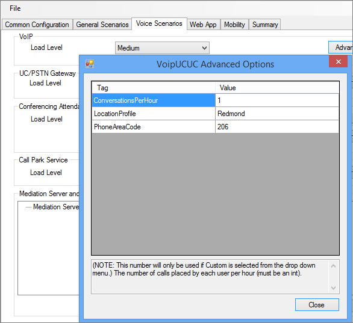
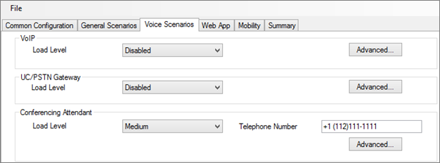

# Configurazione dei criteri per lo strumento di stress e prestazioni di Skype for Business Server 2015
 
Configurazione dei criteri per lo strumento di stress e prestazioni di Skype for Business Server 2015.
  
Esistono diversi criteri e altre aree che è possibile configurare in Skype for Business Server 2015, prima di eseguire lo strumento di stress e prestazioni:
  
- [Criteri di archiviazione](configuring-policies.md#ArchivingPolicy)
    
- [Criteri di conferenza](configuring-policies.md#ConferencingPolicy)
    
- [Criteri contatti](configuring-policies.md#ContactsPolicy)
    
- [Criteri federativi](configuring-policies.md#FederationPolicy)
    
- [Criteri di controllo dell'ammissione alle chiamate](configuring-policies.md#CACPolicy)
    
- [Regole di routing vocale](configuring-policies.md#VoiceRoutingRules)
    
- [Applicazione Operatore Conferenza](configuring-policies.md#ConfAttendantApp)
    
- [Servizio parcheggio di chiamata del server](configuring-policies.md#ServerCallParkServ)
    
- [Chiamate di emergenza](configuring-policies.md#EmergencyCalls)
    
- [Configurazione dell'applicazione Response Group](configuring-policies.md#ConfigResponseGroupApp)
    
## Criteri di archiviazione

Se si dispone di un server di archiviazione distribuito nella topologia di Skype for Business Server, è possibile esaminare lo script ArchivingPolicy. ps1. Per ulteriori informazioni, vedere i cmdlet per l'archiviazione e la Web Conferencing.
  
## Criteri di conferenza

Per i servizi di conferenza abbiamo lo script MeetingPolicy. ps1. Se è necessaria ulteriore assistenza, vedere i cmdlet di Web Conferencing.
  
## Criteri contatti

Lo script ContactsPolicy. ps1 sarà l'esempio che è necessario rivedere. I cmdlet di messaggistica istantanea e presenza ti aiuteranno se hai bisogno di ulteriori riferimenti.
  
## Criteri federativi

Lo script di esempio per la Federazione è FederationPolicy. ps1. I cmdlet da rivedere, se sono necessarie ulteriori informazioni, saranno Edge Server, Federation e Access esterno.
  
## Criteri di controllo dell'ammissione alle chiamate

Puoi fare riferimento a BandwidthPolicy. ps1 per questo criterio. I cmdlet per il controllo dell'ammissione alle chiamate avranno anche altre informazioni.
  
## Regole di routing vocale

È necessario lo script di esempio RoutingRules. ps1 per il routing vocale. Quando si configurano queste regole, prendere nota del contesto telefonico (ovvero/location profile o/SimpleName) e dei codici di area interni/esterni, in modo da poterli specificare quando si creano utenti. Sarà inoltre necessario durante la configurazione di LyncPerfTool (in particolare per PSTN-UC e UC-PSTN).
  
Ad esempio, il parametro SimpleName nella chiamata al cmdlet **New-CsDialPlan** nell'esempio RoutingRules. ps1 deve essere usato per il valore LocationProfile nella figura seguente di UserProfileGenerator. exe:
  

  
Per informazioni dettagliate, è possibile esaminare i cmdlet di VoIP aziendale.
  
## Applicazione Operatore Conferenza

Esaminare prima di tutto lo script ConferenceAutoAttendantConfiguration. ps1. Si vorrà prendere nota del numero di telefono di ConferencingAutoAttendant (1121111111 per impostazione predefinita), in modo che sia possibile immetterlo nello strumento di configurazione di LyncPerfTool per la generazione di configurazione, come indicato di seguito:
  

  
Sono disponibili altri dettagli nei cmdlet per i servizi di conferenza telefonica con accesso esterno.
  
## Servizio parcheggio di chiamata del server

Questo è effettivamente disabilitato per impostazione predefinita. Se necessario, è possibile verificare lo script di esempio CallParkConfiguration. ps1. Controlla inoltre i cmdlet delle applicazioni di Call Park in base alle esigenze.
  
## Chiamate di emergenza

È necessario eseguire la procedura seguente per configurare i test di stress e prestazioni per le chiamate di emergenza:
  
1. Configurare una route vocale per le chiamate di emergenza. Puoi usare lo script RoutingRules. ps1 e selezionare il commento " **Route E911 to PSTN** " per un esempio di come configurare questa route vocale.
    
    > [!CAUTION]
    > Il comando di esempio in RoutingRules. ps1 contiene un modello di numero che include il numero 119 anziché 911. È consigliabile evitare di usare 911 (o il numero di emergenza locale effettivo) per evitare chiamate accidentali agli operatori di emergenza locali durante il test di carico. Tenere presente che questa configurazione è solo per scopi di simulazione. 
  
2. Configurare gli indirizzi compilando i valori della scheda **config del servizio informazioni sulla posizione** in UserProvisioningTool, come illustrato nella figura seguente:
    
     
  
3. Dopo aver immesso tutto nel UserProvisioningTool, fare clic sul pulsante **genera file di configurazione LIS** .
    
4. Ora vengono generati file CSV per porte, subnet, switch e punti di accesso wireless (WAP), oltre a un file XML per lo strumento stress e prestazioni. È possibile usare i file CSV per gli input quando si configura il servizio informazioni sulla posizione con lo script LisConfiguration. ps1. A tale scopo, è necessario trasferire il file Locations0. XML nella stessa cartella dello strumento eseguibile di stress e prestazioni (LyncPerfTool. exe). In questo modo si consente di eseguire gli scenari del profilo posizione (dial plan).
    
## Configurazione dell'applicazione Response Group

Lo script di esempio è ResponseGroupConfiguration. ps1. Ci sono anche cmdlet di Response Group Application da rivedere per ulteriori dettagli sulla configurazione. Il diagramma seguente mostra alcuni dettagli della configurazione:
  

  

