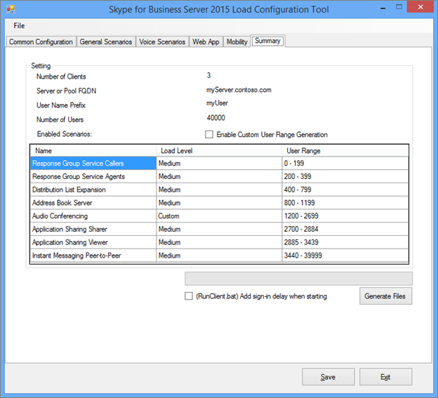

# <a name="using-the-skype-for-business-server-2015-stress-and-performance-tool"></a>Uso dello strumento di stress e prestazioni di Skype for Business Server 2015
 
Per eseguire lo strumento di stress e prestazioni di Skype for Business Server 2015, è necessario essere in grado di gestire sia gli utenti, i contatti e i profili utente, configurare lo strumento per l'esecuzione e quindi rivedere l'output o i risultati prodotti dallo strumento.
  
Ci sono quattro aree coinvolte nell'esecuzione dello strumento Skype for Business Server 2015 stress and performance (l'eseguibile è LyncPerfTool. exe):
  
- [Creare utenti e contatti](using-the-tool.md#BKMK_CreateUsersAndContacts)
    
- [Configurare il profilo utente](using-the-tool.md#BKMK_UserProfile)
    
- [Eseguire LyncPerfTool](using-the-tool.md#BKMK_RunTool)
    
- [Interpretazione dei risultati](using-the-tool.md#BKMK_Interpret)
    
## <a name="create-users-and-contacts"></a>Creare utenti e contatti
<a name="BKMK_CreateUsersAndContacts"> </a>

È necessario usare lo strumento di provisioning degli utenti di Skype for Business Server 2015 (SB 2015) (UserProvisioningTool. exe) per creare utenti e contatti per i test di stress e prestazioni.
  
Questo è un elenco di termini utili che potrebbero risultare utili durante la lettura degli argomenti:
  
- **Unità** organizzativa-unità organizzativa (OU) Active Directory Domain Services (ad DS).
    
- **Federati/Cross pool** -gli utenti che possono comunicare con utenti di altri servizi di messaggistica istantanea (im).
    
- **Liste di distribuzione** -o DLS. Si tratta di oggetti in servizi di dominio Active Directory che contengono un elenco di utenti di servizi di dominio Active Directory. Vengono usati per facilitare le comunicazioni tra gruppi di persone.
    
- **Servizio info posizione** -il servizio Skype for Business Server 2015 che, quando è abilitato e configurato per telefono, consente il recupero della posizione fisica per i servizi avanzati di 911 (E911).
    
- **Numeri di telefono statunitensi** -numeri di telefono assegnati all'utente oltre all'URI SIP usato per il routing delle chiamate in ingresso e in uscita nella ricerca di numeri inversa (RNL).
    
### <a name="create-users-and-contacts-by-using-userprovisioningtoolexe"></a>Creare utenti e contatti con UserProvisioningTool. exe

> [!NOTE]
> Prima ancora di iniziare, assicurati di aver effettuato l'accesso come membro del gruppo di sicurezza Domain Admins per eseguire questo strumento. È necessario eseguire questa operazione, perché si sta per creare utenti di Active Directory. 
  
È necessario usare lo strumento di provisioning degli utenti di Skype for Business Server per creare utenti e contatti per la simulazione di caricamento.
  
Lo **strumento di provisioning degli utenti di Skype for Business Server** viene installato con il pacchetto di **strumenti di stress e prestazioni di Skype for Business Server** . Assicurarsi che il programma di installazione del pacchetto (CapacityPlanningTool. msi) sia stato eseguito nel server front-end o nel server Standard Edition che si desidera testare.
  
Puoi avviare lo strumento di provisioning degli utenti di Skype for Business Server eseguendo il file UserProvisioningTool. exe (che si trova in% InstalledDirectory% LyncStressAndPerfTool \ LyncStress) nel server front-end o nel server Standard Edition.
  
> [!IMPORTANT]
> Quando si crea un numero elevato di utenti (ad esempio 10.000 o più), eseguire UserProvisioningTool. exe. È necessario eseguire questa operazione perché lo strumento creerà e configurerà *nuovi* utenti di annunci.
  
Quando viene aperto lo strumento di provisioning degli utenti, fare clic su configurazione e selezionare la configurazione di caricamento. 
  
Per iniziare a configurare utenti e contatti, caricare il file predefinito incluso nel pacchetto, denominato "SampleData. xml". Verranno precompilati i campi con dati di esempio che è necessario modificare per renderlo rilevante per la distribuzione.
  
Se si ha un file XML preconfigurato che contiene già le impostazioni personalizzate, è possibile caricare il file. Compilare i campi dello strumento di provisioning degli utenti, come descritto nelle sezioni seguenti.
  
### <a name="to-configure-server-options"></a>Per configurare le opzioni del server:

1. Nel campo **FQDN del pool Front-End** Digitare il nome di dominio completo (FQDN) del server Standard Edition o il pool Front-end in cui si vogliono ospitare gli utenti.
    
2. Nel campo **prefisso nome utente** Digitare un prefisso che si vuole usare per arrestare i nomi utente per scopi di test, ad esempio "testuser".
    
3. Nel campo **password** Digitare una password che verrà usata in tutti gli account utente di test.
    
4. Nel campo **dominio account** Digitare il nome di dominio del dominio di Active Directory corrente, ovvero quello in cui si desidera creare gli utenti di test.
    
5. Nel campo **unità organizzativa** Digitare il nome del dominio di Active Directory in cui si vogliono creare questi utenti di test. Se l'unità organizzativa non esiste già, verrà creata per l'utente.
    
6. Nel campo prefisso **telefonico** Digitare il codice di area a tre cifre da usare in tutti gli account utente di test. Verificare che il prefisso scelto non sia in conflitto con i codici di area di altri utenti in Active Directory.
    
7. Fare clic per selezionare la casella di controllo **abilitata** per la voce, se si vuole abilitare gli utenti di test per VoIP aziendale.
    
8. Nel campo **numero di utenti** specificare il numero totale di utenti di test che si desidera creare.
    
9. Nel campo **inizio indice** assegna il numero iniziale che verrà usato come suffisso per il prefisso del nome utente (ad esempio, il prefisso è "testuser" e il nome terminerà in "0" nell'esempio seguente).
    
     
  
#### <a name="create-users-button"></a>Pulsante Crea utenti

Quando si fa clic sul pulsante **Crea utenti** , i parametri di input immessi vengono convalidati. In caso di errori di convalida, verrà richiesto di correggerli. In alternativa, se tutti i valori sono corretti, gli utenti inizieranno a essere visualizzati in Active Directory (in qualsiasi OU specificata). Verrà visualizzata una barra di stato nella parte inferiore dello strumento durante l'esecuzione. Non chiudere l'applicazione mentre l'indicatore di stato è attivo.
  
La creazione degli utenti richiede tempo, quindi per pianificare di conseguenza. Questo processo può richiedere in qualsiasi momento diversi minuti per alcuni utenti, a poche ore per un numero elevato di utenti.
  
Se non si ha accesso al controller di dominio AD nell'ambiente di test, è comunque possibile convalidare la creazione dell'utente accedendo come uno degli utenti nell'intervallo di utenti specificato per la creazione. Ricordarsi di usare il prefisso e il suffisso, insieme al @sipDomain come nome utente. Ecco un esempio: <em>TestUser20@contoso.net</em> .
  
> [!NOTE]
> Se gli utenti sono già presenti, fare clic sul pulsante Crea utenti li aggiornerà con eventuali modifiche alla configurazione. 
  
#### <a name="delete-users-button"></a>Pulsante Elimina utenti

Quando si fa clic sul pulsante **Elimina utenti** , i parametri di input della scheda verranno convalidati. In caso di errori di convalida, verrà richiesto di correggerli e, se i valori di input sono corretti, gli utenti di test specificati verranno disabilitati ed eliminati da Active Directory. Anche in questo caso, nella parte inferiore della scheda verrà visualizzata una barra di stato e non è necessario chiudere l'applicazione mentre è attiva la barra di stato.
  
> [!NOTE]
> Sono supportati solo i numeri di telefono formattati negli Stati Uniti. I numeri di telefono vengono sempre assegnati agli utenti e tutti gli utenti creati da UserProvisioningTool. exe sono abilitati per impostazione predefinita per VoIP aziendale. Qualsiasi scenario che usa il numero di telefono, ad esempio l'operatore automatico di conferenza o le chiamate UC-PSTN, usa questo numero di telefono per instradare correttamente le chiamate. Per questo motivo, *ogni utente* deve avere un *numero di telefono univoco* .
  
> [!NOTE]
> **Se è necessario creare due volte gli utenti, il comando avrà esito negativo a meno che non si usi un codice di area diverso o se gli utenti precedenti sono stati disabilitati usando il cmdlet Disable-CsUser.**
  
> [!IMPORTANT]
> Prima di creare contatti, è necessario prima di tutto eseguire la replica degli utenti (eseguita dalla scheda Users). 
  
> [!IMPORTANT]
> Se hai appena creato gli utenti, devi attendere che la replica di Skype for Business Server venga completata e popola gli account utente nel database. **Se gli utenti non hanno terminato la replica, viene visualizzato un messaggio di errore.** Saprai quando gli utenti hanno terminato la replica se il servizio front-end di Skype for Business Server 2015 è stato avviato oppure eseguendo correttamente il cmdlet Get-CsUser sull'ultimo utente del numero totale specificato.
  
#### <a name="contacts-creation-tab"></a>Scheda creazione contatti

Questa scheda consente di fornire i dettagli dei contatti degli utenti per il test.
  

  
### <a name="to-configure-users-contacts-do-the-following"></a>Per configurare i contatti degli utenti, eseguire le operazioni seguenti:

1. Nel campo **Media contatti per utente** immettere il numero medio di contatti da popolare in elenchi di contatti per ogni utente.
    
2. Selezionare la casella di controllo **fissa** se si vuole creare un numero uguale di contatti per ogni utente. Se si vuole variare il numero di contatti creati per gli utenti, deselezionare la casella di controllo.
    
3. Nel campo **media gruppi di contatti per utente** immettere il numero di gruppi di contatti per utente. Questo numero deve essere inferiore ai **contatti medi per ogni utente**.
    
4. Nel campo **percentuale dei contatti federati/incrociati del pool** assegnare un numero compreso tra 0 e 100. Questa percentuale di contatti verrà creata con gli utenti federati.
    
5. Nel campo **prefisso dell'utente federati/pool** di dati assegnare il nome utente per gli utenti federati che verranno aggiunti agli elenchi di contatti degli utenti locali.
    
6. Nel campo del **dominio SIP dell'utente federativo/Cross pool** assegnare il nome di dominio SIP degli utenti federati.
    
7. Nella scheda **creazione utente** verificare che le informazioni siano corrette. I contatti verranno creati da valori nella scheda Creazione utente.
    
8. Fare clic su **Crea contatti** per iniziare la creazione del contatto. Questo processo può richiedere diversi minuti. Al termine, verrà visualizzata una finestra di dialogo con il messaggio "operazione completata correttamente". Puoi convalidare i contatti creati eseguendo l'accesso come utente creato dalla scheda Creazione utente.
    
> [!NOTE]
> Dopo aver creato i contatti, questo strumento ricomincerà tutti i server front-end nel pool di destinazione. In base al numero di contatti creati da questa operazione, potrebbe essere necessario più tempo (fino a 2 ore) per avviare i server front-end. 
  
#### <a name="distribution-list"></a>Elenco di distribuzione

Lo strumento per lo stress e le prestazioni di Skype for Business Server 2015 può simulare la funzionalità di espansione della lista di distribuzione (DL) nel client Skype for business 2015. Se non si vuole abilitare l'espansione DL nello strumento di provisioning degli utenti, è possibile ignorare questo passaggio.
  

  
La scheda lista di distribuzione consente di creare un DLs che lo strumento stress e prestazioni userà per la caratteristica di espansione della lista di distribuzione. Prima di creare DLs, è necessario distribuire Skype for Business Server 2015, incluso l'esecuzione di ForestPrep. In caso contrario, gli attributi DL non saranno presenti nello schema AD, quindi lo strumento non sarà in grado di creare DLs.
  
### <a name="to-configure-distribution-lists"></a>Per configurare le liste di distribuzione:

1. Nel campo **numero di liste di distribuzione** assegnare il numero totale di DLS da creare (la raccomandazione qui è che si inizia con un valore che raddoppia il numero di utenti che si hanno.).
    
2. Nel campo **prefisso elenco di distribuzione** immetti un prefisso che tutti i DLS creati avranno, ad esempio *testDL* . Questo significa che in 100 DLs i nomi di DL saranno simili a: testDL0, testDL1, fino a testDL99.
    
3. Nei **membri minimi in un campo dist. list** immettere il numero minimo di utenti da inserire in ogni DL.
    
4. Nei **membri massimi in un campo dist. list** immettere il numero massimo di utenti da aggiungere in ogni DL.
    
#### <a name="create-distribution-lists-button"></a>Pulsante Crea liste di distribuzione

Quando si fa clic sul pulsante Crea liste di distribuzione, lo strumento esegue una query in Active Directory per verificare se sono già presenti elenchi di distribuzione corrispondenti al prefisso e ai numeri. Lo strumento crea un DLs che non esiste già. Quando si aggiungono membri a queste liste di distribuzione appena create, scegliere gli utenti nell'intervallo specificato nella scheda Creazione utente.
  
#### <a name="location-info-service-config-tab"></a>Scheda configurazione del servizio info posizione

Lo strumento di stress e prestazioni di Skype for Business Server 2015 può anche generare file di configurazione fittizi per il servizio informazioni sulla posizione. Tieni presente che il servizio informazioni sulla posizione in genere non ha un impatto significativo sulle prestazioni nei server. 
  

  
Se si sceglie di testare questa caratteristica, inserire i valori nel modulo e fare clic sul pulsante genera file di configurazione LIS, che verrà creato. File CSV denominati:
  
- LIS_Subnet. csv
    
- LIS_Switches. csv
    
- LIS_Ports. csv
    
- LIS_WAP. csv
    
Per importare questi file nel database LIS, usare i cmdlet di PowerShell seguenti:
  
- Set-CsLisSubnet
    
- Set-CsLisSwitch
    
- Set-CsLisPort
    
- Set-CsWirelessAccessPoint
    
## <a name="configure-user-profile"></a>Configurare il profilo utente
<a name="BKMK_UserProfile"> </a>

Dopo aver creato gli utenti (tramite lo strumento Creazione utente), è possibile configurare i profili utente con lo strumento di configurazione del carico di Skype for Business Server 2015 (UserProfileGenerator. exe).
  
### <a name="running-the-skype-for-business-server-2015-load-configuration-tool"></a>Eseguire lo strumento di configurazione del carico di Skype for Business Server 2015

Avviare lo strumento di configurazione del caricamento (UserProfileGenerator. exe) e inserire le schede. Questo strumento crea una directory per ogni computer client per cui è necessario eseguire le simulazioni. Ogni directory client include uno script per avviare lo strumento di gestione dello stress e delle prestazioni di Skype for Business Server 2015 (LyncPerfTool. exe). Le sezioni seguenti illustrano come compilare i campi di ogni scheda dello strumento di configurazione del carico di Skype for Business Server 2015.
  
> [!IMPORTANT]
> I valori specifici dell'utente usati nello strumento di configurazione del carico (UserProfileGenerator. exe) devono corrispondere ai valori specificati nello strumento di creazione degli utenti di Skype for Business Server 2015 (UserProvisioningTool. exe) per il pool. 
  
#### <a name="common-configuration-tab"></a>Scheda configurazione comune

Di seguito è illustrata la scheda **configurazione comune** dello strumento di configurazione del carico. Compilare i campi della scheda configurazione comune, come descritto nella procedura seguente.
  

  
1. Nel campo **numero di macchine disponibili** Digitare il numero di computer che si vuole usare per eseguire lo strumento di stress e prestazioni (LyncPerfTool. exe). È consigliabile disporre di un computer per ogni utente di 4500 che verrà simulato, ma tale numero può variare se si riduce il livello di carico oppure se si usa solo un sottoinsieme delle funzionalità disponibili dello strumento (i livelli di carico sono impostati nella scheda scenari generali).
    
2. Nel campo **prefisso per i nomi utente** immettere un prefisso per il campo nome utente di tutti gli utenti. Per eseguire l'accesso l'Uniform Resource Identifier (URI) sarà: *UserPrefix [Indice Start utente... (Numero di utenti-1)] @User dominio* , ad esempio myUser009@Contoso.com.
    
3. Nel campo **password per tutti gli utenti** immettere la password usata durante la creazione degli utenti. Se si lascia vuoto questo campo, il nome utente verrà impostato come password.
    
4. Nel campo **Indice Start utente** immettere l'indice del primo utente da configurare. È possibile configurare intervalli diversi per diversi tipi o livelli di carico, ma è necessario eseguire lo strumento di configurazione del carico (UserProfileGenerator. exe) una volta per l'intervallo da configurare.
    
5. Nel campo **numero di utenti** immettere il numero totale di utenti che si vuole configurare.
    
6. Nel campo **dominio utente** immettere il dominio usato per l'URI SIP. Viene usato per creare l'URI SIP di ogni utente per accedere al server front-end di Skype for Business Server 2015 o Standard Edition e può essere diverso dal dominio dell'account.
    
7. Nel campo **dominio account** immettere l'accesso al dominio ad DS.
    
8. Nel campo **percentuale di MPOP** (multiple Point of Presence percentuale) assegnare un valore per la percentuale di utenti che hanno effettuato l'accesso da più computer o dispositivi, ad esempio il 10%.
    
9. Immettere il numero massimo di endpoint simultanei nel campo **accedi al secondo (per istanza)** . Questo è il numero massimo di log ins per gli utenti e la raccomandazione è una velocità inferiore a/uguale a 2 al secondo (<= 2).
    
10. Nel campo **FQDN proxy o pool di Access** immettere il nome di dominio completo (FQDN) del server a cui si vogliono connettere i client. Se gli utenti accedono esternamente, è necessario digitare il proxy di accesso. Se gli utenti sono interni, assegnare il nome di dominio completo del proprio pool aziendale o del server Standard Edition.
    
11. Nel campo **porta** immettere la porta che si vuole che gli utenti usino per SIP (il valore predefinito è 5061).
    
12. Per il campo **Impostazioni server di rete esterna** , assegnare al proxy di accesso o al nome FQDN del pool e, di nuovo, alla **porta**. Queste impostazioni vengono usate solo per la simulazione di caricamento degli endpoint esterni.
    
#### <a name="general-scenarios-tab"></a>Scheda scenari generali


  
È possibile configurare i livelli di carico e i parametri per ognuno degli scenari generali offerti determinando gli elementi che si vogliono eseguire o abbandonare disabilitati. Ecco le opzioni generali:
  
> [!NOTE]
> I valori del livello di caricamento per tutti i campi, ma i servizi di informazione locali sono **disabilitati**, **Bassi**, **medi**, **alti**o **personalizzati**. Se si seleziona qualsiasi impostazione ma disabilitata, vengono generate configurazioni per ogni client. Risultati elevati nel caricamento massimo supportato nel server; il mezzo è 60% di carico elevato; basso è il 30%. 
  
- **Messaggistica istantanea-** Questa funzionalità include peer-to-peer e conferenze; scegliere il valore appropriato per il livello di carico.
    
- **Audioconferenza-** Scegliere un livello di caricamento *solo* per i servizi di audioconferenza. Le chiamate peer-to-peer verranno affrontate un po' più avanti nella sezione **scenari vocali** . Aprire la scheda **Avanzate** per abilitare MultiView.
    
- **Condivisione applicazioni-** Scegliere un livello di carico per la condivisione delle applicazioni.
    
- **Collaborazione con i dati-** Scegliere un livello di carico per la collaborazione dei dati, che include i servizi di conferenza dati.
    
- **Espansione della lista di distribuzione-** Fare clic sul pulsante **Avanzate** e inserire il campo con gli stessi valori configurati nella scheda DL dello strumento di creazione dell'utente (UserProvisioningTool. exe). Scegliere un livello di carico.
    
- **Query Web della rubrica-** Si tratta del servizio di ricerca rubrica anziché del download del file della Rubrica. Se si vuole abilitare questa funzionalità per i download di file della Rubrica, fare clic sul pulsante **Avanzate** e impostare **EnableABSDownload** su true. Assegnare un valore per il livello di carico.
    
- **Response Group Service-** Fare clic sul pulsante **Avanzate** e specificare gli URI dei gruppi di risposte già creati quando si provisionano gli agenti del servizio Response Group. È necessario scegliere almeno un gruppo di risposte. Per usare altro, separare i gruppi di risposte con punti e virgola. Aggiornare **RGSUriSuffixStartIndex** e **RGSUriSuffixEndIndex** ai valori effettivi. Scegliere un livello di carico.
    
- **Servizi di informazioni sulla posizione-** Selezionare un livello di carico di abilitato o disabilitato.
    
> [!NOTE]
> Ogni scenario include un pulsante avanzato che si trova accanto a esso e un set di caselle di controllo che abilitano le varianti all'impostazione predefinita. 
  
- La scelta di *ad-hoc* consentirà allo strumento di generare una simulazione di conferenze che verranno create per tutta l'ora.
    
- La scelta di *grande conf* significa che verrà simulato uno scenario di conferenza di grandi dimensioni.
    
-  *External* indica allo strumento di simulare anche gli utenti esterni.
    
I pulsanti e le caselle di controllo sono valori aggiuntivi specifici per ogni scenario e modificano il comportamento dello strumento stress e prestazioni e rendono possibile la personalizzazione.
  
Per ogni scenario nella scheda scenari generali (ad eccezione di servizi di informazioni sulla posizione), se il valore del livello di carico è **personalizzato**, la frequenza di conversazione verrà calcolata usando il campo corrispondente nella finestra di dialogo avanzate. Il nome del campo può essere diverso, a seconda dello scenario, ma la descrizione del campo verrà visualizzata: *Nota Questo numero verrà usato solo se l'opzione personalizzato è selezionata nel menu a discesa* .
  
I valori **alto**, **medio**e **basso**altereranno i tassi di conversazione per modalità in linea con il modello di utente che rappresenta un bilanciamento di tutti gli scenari. Se è necessario modificare il livello di carico per modalità a causa di una differenza nell'utilizzo previsto, usare una frequenza di conversazione personalizzata.
  
#### <a name="voice-scenarios-tab"></a>Scheda scenari vocali

Questa è la scheda per la configurazione di tutti gli scenari relativi alla voce.
  

  
Le opzioni disponibili sono:
  
- **VoIP-** Fare clic sul pulsante **Avanzate** e aggiungere i valori per i campi PhoneAreaCode e LocationProfile (dial plan). Si darà anche un valore per il livello di carico. Se si sceglie un livello di carico per il gateway VoIP o UC/PSTN abilitato, verrà generato un file di configurazione PSTN (Public-Switched Telephone Network) to Unified Communications (UC) per simulare chiamate esterne.
    
- **Gateway UC/PSTN-** È necessario scegliere un valore a livello di carico e quando si sceglie qualcosa di diverso da disabled, è anche stato ottenuto di fornire un valore per il codice dell'area PSTN facendo clic sul pulsante **Avanzate** . Fare clic su **Aggiungi** sotto Mediation Server e PSTN. Verificare di avere una route configurata per il prefisso.
    
    > [!TIP]
    > Puoi usare il pannello di controllo di Skype for business o Skype for Business Management Shell per verificare la configurazione della route vocale. 
  
- **Assistente conferenza-** Specificare un valore per il livello di carico. Qualsiasi valore diverso da Disabled consentirà di abilitare il campo **numero di telefono** . Immettere il numero di telefono dell'operatore automatico che si vuole usare. Fare clic su **Avanzate** e assegnare un valore per il campo **LocationProfile** .
    
- **Servizio parcheggio chiamate-** In questo caso, fornisci un livello di carico.
    
- **Mediation Server e PSTN-** Ogni Mediation Server che si vuole usare richiede il proprio simulatore PSTN. Dopo aver determinato il client che si vuole usare per il simulatore, configurare il Mediation Server per instradare le chiamate al computer nel simulatore PSTN configurato. Fare clic sul pulsante **Aggiungi** per configurare un valore per il Mediation Server.
    
    > [!NOTE]
    > Ogni scenario ha un pulsante avanzato che si trova accanto. Le finestre di dialogo avanzate contengono impostazioni specifiche per ogni scenario che modifica il comportamento dello strumento di stress e prestazioni e Abilita la personalizzazione. > per ogni scenario della scheda scenari vocali, se il valore del livello di carico è **personalizzato**, la frequenza di conversazione verrà calcolata utilizzando il campo corrispondente nella finestra di dialogo avanzate. Il nome del campo può essere diverso, a seconda dello scenario, ma la descrizione del campo verrà visualizzata: *Nota Questo numero verrà usato solo se l'opzione personalizzato è selezionata nel menu a discesa* .
  
#### <a name="web-app-tab"></a>Scheda Web App


  
Web App supporta scenari di conferenza tramite il server UCWA (Unified Communications Web API) installato in un server front-end. Usare la scheda Web App per configurare tutti gli scenari correlati alle app Web. Le opzioni disponibili sono:
  
- **Impostazioni generali delle app Web-** Fare clic sul pulsante **Impostazioni aggiuntive** e impostare il **ReachTargetServerUrl** per l'indirizzo IP virtuale del pool di directory (VIP) del pool VIP di front-end.
    
- **Condivisione applicazioni-** Selezionare un valore per il livello di carico.
    
- **Collaborazione con i dati-** Selezionare un valore per il livello di carico.
    
- **Messaggistica istantanea-** Selezionare un valore per il livello di carico.
    
- **Conferenza telefonica-** Selezionare un valore per il livello di carico.
    
> [!NOTE]
> Ogni scenario contiene un pulsante **avanzato** che si trova accanto. Le finestre di dialogo avanzate contengono valori specifici di ogni scenario che cambierà il comportamento dello strumento di stress e prestazioni e consentirà la personalizzazione. > per ogni scenario dell'app Web, se il livello di carico è **personalizzato**, viene usato il valore specificato nel campo **ConversationsPerHour** anziché quello predefinito.
  
#### <a name="mobility-tab"></a>Scheda mobilità

Usare questa scheda per configurare tutti gli scenari relativi alla mobilità.
  

  
Le opzioni disponibili sono:
  
- **Impostazioni generali per la mobilità-** Fare clic su **altre impostazioni** e impostare il campo UcwaTargetServerUrl sul Virtual IP del pool di Director (VIP) o sul pool di front-end VIP.
    
- **Presenza e messaggistica istantanea P2P/audio-** Selezionare un valore per il livello di carico per abilitare la simulazione della mobilità.
    
> [!NOTE]
> Ogni scenario contiene un pulsante **avanzato** che si trova accanto. Le finestre di dialogo avanzate contengono valori specifici di ogni scenario che cambierà il comportamento dello strumento di stress e prestazioni e consentirà la personalizzazione. > per ognuno degli scenari di mobilità, se il livello di carico è **personalizzato**, viene usato il valore specificato nel campo **ConversationsPerHour** anziché quello predefinito.
  
#### <a name="summary-tab"></a>Scheda Riepilogo

La scheda Riepilogo indica gli utenti da usare per ogni scenario.
  

  
La scheda Riepilogo indica gli utenti da usare per ogni scenario. 
  
È possibile configurare manualmente gli intervalli di numeri degli utenti selezionando la casella di controllo Abilita generazione di intervalli di **utenti personalizzati** e facendo doppio clic sullo scenario nella tabella che contiene l'intervallo di utenti che si vuole personalizzare.
  
Controllo **(RunClient. bat) aggiungere ritardo di accesso quando si inizia** per includere ritardi nei file batch generati in modo che corrispondano alla frequenza di accesso. Questa operazione è utile per impedire l'overload del server quando si esegue l'accesso a un numero elevato di utenti.
  
Fare clic su **genera file** e selezionare la cartella in cui si vuole generare la configurazione. Quando i file sono stati creati correttamente, verrà visualizzata una finestra di dialogo.
  

  
## <a name="run-lyncperftool"></a>Eseguire LyncPerfTool
<a name="BKMK_RunTool"> </a>

È necessario creare utenti, contatti e scenari prima di eseguire lo strumento di stress e prestazioni di Skype for Business Server 2015 (LyncPerfTool. exe). Per informazioni dettagliate sull'uso degli strumenti per eseguire queste azioni, vedere [creare utenti e contatti](using-the-tool.md#BKMK_CreateUsersAndContacts) e [configurare il profilo utente](using-the-tool.md#BKMK_UserProfile) in precedenza in questo articolo. L'esecuzione di questi strumenti genera anche un file che verrà eseguito con lo strumento stress e prestazioni come parte di un file batch con i parametri obbligatori inclusi.
  
### <a name="running-the-skype-for-business-server-2015-stress-and-performance-tool"></a>Esecuzione dello strumento di stress e prestazioni di Skype for Business Server 2015

Lo strumento di configurazione del carico (UserProfileGenerator. exe) crea un file batch che consente di eseguire lo strumento di stress e prestazioni (LyncPerfTool. exe) registrando i contatori delle prestazioni e caricando il file di configurazione XML. Il file batch esegue un'istanza di LyncPerfTool. exe per ogni file di configurazione. Per eseguire il file batch, seguire questa procedura:
  
### <a name="run-the-stress-and-performance-test"></a>Eseguire il test di stress e prestazioni

1. Copiare la cartella con le cartelle e i file di configurazione nella directory in cui è installato LyncPerfTool. exe in ogni computer client. Ad esempio, se sono stati generati i file di configurazione nella cartella denominata 1.28 _ 13.16.16, copiare la cartella nella cartella con LyncPerfTool. exe. Eseguire questa operazione in ogni client.)
    
2. Passare alla cartella client ed eseguire lo script batch **RunClient** . È possibile fare doppio clic sul file batch in Esplora risorse e verranno eseguiti tutti i file di configurazione per il client. È anche possibile eseguire lo script da una cartella client usando la sintassi seguente:
    
   ```PowerShell
   RunClient0.bat "C:\Program Files\Skype for Business Server 2015\LyncStressAndPerfTool\LyncStress" 
   ```

Per eseguire direttamente lo strumento stress e prestazioni, aprire un prompt dei comandi e digitare il comando seguente alla riga di comando e, quando si esegue questa operazione per la prima volta, assicurarsi di registrare i `regsvr32 /i /n /s LyncPerfToolPerf.dll`contatori delle prestazioni, come illustrato nella nota più avanti in questo argomento.
  
```console
LyncPerfTool.exe /file:IM_client0.xml
```

Per visualizzare i valori nel file di configurazione, includere il `/displayfile` parametro nel comando precedente, in modo che abbia l'aspetto seguente:
  
```console
LyncPerfTool.exe /file:IM_client0.xml /displayfile
```

Per *terminare* il processo, premere CTRL + C.
  
> [!NOTE]
> Prima di eseguire direttamente lo strumento stress e prestazioni, è necessario registrare i contatori delle prestazioni tramite il comando seguente:`regsvr32 /i /n /s LyncPerfToolPerf.dll`
  
> [!NOTE]
> Ogni istanza dello strumento di stress e prestazioni che si avvia inizierà immediatamente l'accesso agli utenti, in genere a una velocità di un utente al secondo. 
  
La frequenza di accesso dell'utente Peak per il pool è di circa 12 al secondo. Questo significa che non dovresti iniziare più di 12 istanze di LyncPerfTool. exe contemporaneamente mentre gli utenti continuano a eseguire l'accesso. Gli utenti di 1000 impiegano circa 20 minuti per accedere completamente a uno al secondo.
  
## <a name="interpreting-the-results"></a>Interpretazione dei risultati
<a name="BKMK_Interpret"> </a>

Lo strumento di stress e prestazioni di Skype for Business Server 2015 include molti contatori che possono aiutarti a capire cosa sta facendo il client e che si verifichino problemi.
  
### <a name="client-counters"></a>Contatori client

Ogni istanza di LyncPerfTool. exe in corso ha un'istanza distinta dei contatori. Ogni istanza è denominata dall'ID processo. Se i client sono sovraccaricati, possono verificarsi altri problemi. Per evitare questi problemi:
  
- Monitorare l'utilizzo della CPU e della memoria nei computer client. Se la CPU è sempre superiore a 90%, ridurre il numero di utenti.
    
- Quando l'impronta della memoria è elevata, è possibile che si verifichino problemi se il file di pagina inizia a esaurire lo spazio. Verificare che la carica di conferma non colpisca il limite nel computer. Se si verificano limiti di memoria, valutare la possibilità di aumentare le dimensioni del file di pagina o ridurre il numero di utenti.
    
Ecco un elenco di contatori delle prestazioni chiave:
  
**Informazioni generali**

|**Contatore delle prestazioni**|**Descrizione**|
|:-----|:-----|
|Tempo trascorso in minuti  <br/> |Tempo trascorso da quando il processo è stato avviato.  <br/> |
|Endpoint attivi  <br/> |Numero di endpoint attualmente connessi al server.  <br/> |
|Accessi non riusciti  <br/> |Numero totale di errori di accesso di endpoint.  <br/> |
|Tentativi di accesso  <br/> |Numero totale di tentativi di accesso di endpoint.  <br/> |
|Endpoint disconnessi  <br/> |Numero totale di endpoint disconnessi.  <br/> |
   
**Informazioni sulla presenza**

|**Contatore delle prestazioni**|**Descrizione**|
|:-----|:-----|
|Chiamate di sepresenza  <br/> |Numero totale di tentativi di modifica della presenza. Per i diversi tipi di modifiche alla presenza, Vedi il contatore delle prestazioni chiamate sepresenza (tipo presenza).  <br/> |
|Risposte di NNN per sepresenza  <br/> |Numero totale di codici di risposta nnn ricevuti dal server.  <br/> |
|Chiamate GetPresence  <br/> |Numero totale di tentativi di richiesta di presenza Get.  <br/> |
|Risposte di NNN per GetPresence  <br/> |Numero totale di codici di risposta nnn ricevuti dal server.  <br/> |
   
**Informazioni sul servizio Rubrica**

|**Contatore delle prestazioni**|**Descrizione**|
|:-----|:-----|
|Download di file in ABS Full/Delta tentato  <br/> |Numero totale di richieste di download di file completi o Delta tentate.  <br/> |
|Download di file completi/Delta di ABS riuscito  <br/> |Numero totale di richieste di download di file completi o Delta tentate.  <br/> |
|Contatori correlati al servizio query Web di Rubrica  <br/> |Contatori correlati per il download del file della Rubrica.  <br/> |
|Chiamate in ABS WS tentate  <br/> |Numero totale di richieste di servizio query Web per la Rubrica.  <br/> |
|Chiamate in ABS WS succeeded  <br/> |Numero totale di richieste di servizio query Web per la rubrica che hanno restituito un codice di risposta riuscito.  <br/> |
|Chiamate in ABS WS non riuscite  <br/> |Numero totale di richieste di servizio query Web per la rubrica che hanno restituito un codice di risposta di errore.  <br/> |
   
> [!NOTE]
> Questa categoria include i contatori usati per monitorare i download di file in ABS e le richieste di servizio query Web della Rubrica. 
  
**Informazioni sulla lista di distribuzione (DL)**

|**Contatore delle prestazioni**|**Descrizione**|
|:-----|:-----|
|Chiamate tentativo  <br/> |Numero totale di richieste di servizio Web di espansione della lista di distribuzione (DLX) tentato.  <br/> |
|Chiamate succeeded  <br/> |Numero totale di richieste di servizio Web DLX che hanno restituito un codice di risposta riuscito.  <br/> |
|Chiamate non riuscite  <br/> |Numero totale di richieste di servizio Web DLX che hanno restituito un codice di risposta di errore.  <br/> |
   

  
> [!NOTE]
> I contatori delle prestazioni elencati sotto i numeri di report per tutte le chiamate VoIP (Voice over IP), incluse le chiamate a Mediation Server, A/V Conferencing Server, Edge Server, Response Group Application e Conference Auto Attendant, quando questi scenari sono abilitati. 
  
**Informazioni di base su VoIP**

|**Contatore delle prestazioni**|**Descrizione**|
|:-----|:-----|
|Chiamate attive  <br/> |Numero totale di chiamate vocali in arrivo/in uscita attualmente in corso.  <br/> |
|Chiamate terminate  <br/> |Numero totale di chiamate vocali in arrivo/in uscita già terminate.  <br/> |
|Chiamate rifiutate  <br/> |Numero totale di chiamate vocali in arrivo rifiutate.  <br/> |
|Tentativi di chiamata in arrivo/in uscita  <br/> |Numero totale di chiamate vocali in arrivo/in uscita tentate.  <br/> |
|Chiamate in arrivo/in uscita stabilite  <br/> |Numero totale di chiamate vocali in arrivo/in uscita stabilite.  <br/> |
|Chiamate di NNN ricevute  <br/> |Numero totale di codici di risposta nnn ricevuti dal server.  <br/> |
|Frequenza di abbonamento VoIP (%)  <br/> |Total calls established/Total calls Tented.  <br/> |
   
**Informazioni sulle chiamate di servizio Response Group**

|**Contatore delle prestazioni**|**Descrizione**|
|:-----|:-----|
|Chiamate attive  <br/> |Numero totale di chiamate attive all'applicazione Response Group.  <br/> |
|Chiamate tentativo  <br/> |Numero totale di chiamate tentate.  <br/> |
   
**Informazioni sulle chiamate di messaggistica istantanea (IM)**

|**Contatore delle prestazioni**|**Descrizione**|
|:-----|:-----|
|Chiamate attive  <br/> |Numero totale di chiamate di messaggistica istantanea in arrivo/in uscita.  <br/> |
|Chiamate terminate  <br/> |Numero totale di chiamate di messaggistica istantanea in arrivo/in uscita già terminate.  <br/> |
|Chiamate di NNN ricevute  <br/> |Numero totale di codici di risposta nnn ricevuti dal server.  <br/> |
|Messaggi ISTANTANEi ricevuti/inviati  <br/> |Numero totale di messaggi ricevuti o inviati per tutte le sessioni.  <br/> |
|Tentativi di chiamata in arrivo/in uscita  <br/> |Numero totale di chiamate di messaggistica istantanea in arrivo/in uscita tentate.  <br/> |
|Chiamate in arrivo/in uscita stabilite  <br/> |Numero totale di chiamate di messaggi istantanei in arrivo/in uscita stabilite.  <br/> |
   
**Informazioni sulle chiamate di condivisione delle app**

|**Contatore delle prestazioni**|**Descrizione**|
|:-----|:-----|
|Chiamate attive  <br/> |Numero totale di chiamate di condivisione delle applicazioni in entrata e in uscita.  <br/> |
|Chiamate terminate  <br/> |Numero totale di chiamate di condivisione delle applicazioni in arrivo/in uscita già terminate.  <br/> |
|Chiamate di NNN ricevute  <br/> |Numero totale di codici di risposta nnn ricevuti dal server.  <br/> |
|Tentativi di chiamata in arrivo/in uscita  <br/> |Numero totale di chiamate di condivisione delle applicazioni in arrivo/in uscita tentate.  <br/> |
|Chiamate in arrivo/in uscita stabilite  <br/> |Numero totale di chiamate di condivisione delle applicazioni in arrivo/in uscita stabilite.  <br/> |
   
**Informazioni sulle chiamate CAA**

|**Contatore delle prestazioni**|**Descrizione**|
|:-----|:-----|
|Chiamate attive  <br/> |Numero totale di chiamate PSTN (Public Switched Telephone Network) in arrivo/in uscita attualmente in corso.  <br/> |
|Chiamate terminate  <br/> |Numero totale di chiamate PSTN in arrivo/in uscita già terminate.  <br/> |
|Tentativi di chiamata in arrivo/in uscita  <br/> |Numero totale di chiamate PSTN in arrivo/in uscita tentate.  <br/> |
|Chiamate in arrivo/in uscita stabilite  <br/> |Numero totale di chiamate PSTN in arrivo/in uscita stabilite.  <br/> |
   
**Informazioni sulla conferenza**

|**Contatore delle prestazioni**|**Descrizione**|
|:-----|:-----|
|Conferenze di messaggistica istantanea attiva  <br/> |Numero totale di conferenze di messaggistica istantanea in corso.  <br/> |
|Conferenze audio/video attive  <br/> |Numero totale di conferenze audio/video (A/V) in corso.  <br/> |
|Conferenze per la condivisione di applicazioni attive  <br/> |Numero totale di conferenze di condivisione applicazioni in corso.  <br/> |
|Numero di partecipanti  <br/> |Numero totale di partecipanti attualmente connessi alle conferenze.  <br/> |
|Errore di programmazione conferenze  <br/> |Numero totale di errori durante il tentativo di pianificare una conferenza.  <br/> |
|Partecipare a una conferenza non riuscita  <br/> |Numero totale di errori durante il tentativo di connessione a una conferenza.  <br/> |
   
**Contatori client di UCWA**

|**Contatore delle prestazioni**|**Descrizione**|
|:-----|:-----|
|Numero totale di join IMMCU riusciti  <br/> |Numero totale di conferenze di messaggistica istantanea Unite.  <br/> |
|Numero totale di join DMCU riusciti  <br/> |Numero totale di conferenze A/V Unite.  <br/> |
   

