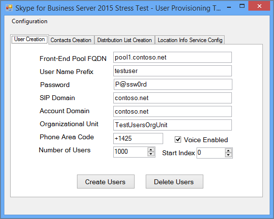

# <a name="using-the-skype-for-business-server-2015-stress-and-performance-tool"></a><span data-ttu-id="fa19f-103">Utilizzo dello strumento di sollecito e prestazioni di Skype for Business Server 2015</span><span class="sxs-lookup"><span data-stu-id="fa19f-103">Using the Skype for Business Server 2015 Stress and Performance Tool</span></span>
 
<span data-ttu-id="fa19f-104">Per eseguire lo strumento sollecitazione e prestazioni di Skype for Business Server 2015, è necessario essere in grado di gestire sia gli utenti, i contatti e i profili utente, configurare lo strumento per l'esecuzione e quindi esaminare l'output o i risultati che sono stati prodotti dallo strumento.</span><span class="sxs-lookup"><span data-stu-id="fa19f-104">To run the Skype for Business Server 2015 Stress and Performance Tool, you'll need to be able to manage both users, contacts and user profiles, configure the tool for running, and then review the output or results that are produced by the tool.</span></span>
  
<span data-ttu-id="fa19f-105">Sono disponibili quattro aree per l'esecuzione dello strumento di stress e prestazioni di Skype for Business Server 2015 (il file eseguibile è LyncPerfTool.exe):</span><span class="sxs-lookup"><span data-stu-id="fa19f-105">There are four areas involved with running the Skype for Business Server 2015 Stress and Performance Tool (the executable is LyncPerfTool.exe):</span></span>
  
- [<span data-ttu-id="fa19f-106">Creare utenti e contatti</span><span class="sxs-lookup"><span data-stu-id="fa19f-106">Create Users and Contacts</span></span>](using-the-tool.md#BKMK_CreateUsersAndContacts)
    
- [<span data-ttu-id="fa19f-107">Configurare il profilo utente</span><span class="sxs-lookup"><span data-stu-id="fa19f-107">Configure User Profile</span></span>](using-the-tool.md#BKMK_UserProfile)
    
- [<span data-ttu-id="fa19f-108">Eseguire LyncPerfTool</span><span class="sxs-lookup"><span data-stu-id="fa19f-108">Run LyncPerfTool</span></span>](using-the-tool.md#BKMK_RunTool)
    
- [<span data-ttu-id="fa19f-109">Interpretazione dei risultati</span><span class="sxs-lookup"><span data-stu-id="fa19f-109">Interpreting the Results</span></span>](using-the-tool.md#BKMK_Interpret)
    
## <a name="create-users-and-contacts"></a><span data-ttu-id="fa19f-110">Creare utenti e contatti</span><span class="sxs-lookup"><span data-stu-id="fa19f-110">Create Users and Contacts</span></span>
<span data-ttu-id="fa19f-111"><a name="BKMK_CreateUsersAndContacts"> </a></span><span class="sxs-lookup"><span data-stu-id="fa19f-111"><a name="BKMK_CreateUsersAndContacts"> </a></span></span>

<span data-ttu-id="fa19f-112">È necessario utilizzare lo strumento di provisioning degli utenti di Skype for Business Server 2015 (SB 2015) (UserProvisioningTool.exe) per creare utenti e contatti per i test di stress e prestazioni.</span><span class="sxs-lookup"><span data-stu-id="fa19f-112">You need to use the Skype for Business Server 2015 (SB 2015) User Provisioning Tool (UserProvisioningTool.exe) to create users and contacts for your stress and performance testing.</span></span>
  
<span data-ttu-id="fa19f-113">Si tratta di un elenco di termini utili che potrebbero essere utili durante la lettura degli argomenti:</span><span class="sxs-lookup"><span data-stu-id="fa19f-113">This is a list of helpful terms that might be useful as you read through the topics:</span></span>
  
- <span data-ttu-id="fa19f-114">**Unità organizzativa** -unità organizzativa di servizi di dominio Active Directory (ad DS).</span><span class="sxs-lookup"><span data-stu-id="fa19f-114">**Organizational Unit** - The Active Directory Domain Services (AD DS) organizational unit (OU).</span></span>
    
- <span data-ttu-id="fa19f-115">**Federati/pool incrociato** -utenti in grado di comunicare con utenti provenienti da altri servizi di messaggistica istantanea.</span><span class="sxs-lookup"><span data-stu-id="fa19f-115">**Federated / Cross Pool** - Users who can communicate with users from other Instant Messaging (IM) services.</span></span>
    
- <span data-ttu-id="fa19f-116">**Liste di distribuzione** -o DLS.</span><span class="sxs-lookup"><span data-stu-id="fa19f-116">**Distribution Lists** - Or DLs.</span></span> <span data-ttu-id="fa19f-117">Si tratta di oggetti in servizi di dominio Active Directory che contengono un elenco di utenti di servizi di dominio Active Directory.</span><span class="sxs-lookup"><span data-stu-id="fa19f-117">These are objects in AD DS that contain a list of AD DS users.</span></span> <span data-ttu-id="fa19f-118">Sono utilizzati per facilitare le comunicazioni tra gruppi di persone.</span><span class="sxs-lookup"><span data-stu-id="fa19f-118">They're used to facilitate communications across groups of people.</span></span>
    
- <span data-ttu-id="fa19f-119">**Service info location** -il servizio Skype for Business Server 2015 che, quando è abilitato e configurato per telefono, consente il recupero del percorso fisico per i servizi Enhanced 911 (E911).</span><span class="sxs-lookup"><span data-stu-id="fa19f-119">**Location Info Service** - The Skype for Business Server 2015 service that, when it's enabled and configured per phone, allows for the retrieval of physical location for Enhanced 911 (E911) services.</span></span>
    
- <span data-ttu-id="fa19f-120">**Numeri di telefono degli Stati Uniti** -numeri di telefono assegnati all'utente oltre all'URI SIP utilizzato per il routing delle chiamate in ingresso e in uscita nella ricerca di numeri inverso (inversa).</span><span class="sxs-lookup"><span data-stu-id="fa19f-120">**U.S. Phone Numbers** - Phone numbers assigned to user in addition to the SIP URI that's used for routing inbound and outbound calls in Reverse Number Lookup (RNL).</span></span>
    
### <a name="create-users-and-contacts-by-using-userprovisioningtoolexe"></a><span data-ttu-id="fa19f-121">Creare utenti e contatti tramite UserProvisioningTool.exe</span><span class="sxs-lookup"><span data-stu-id="fa19f-121">Create Users and Contacts by using UserProvisioningTool.exe</span></span>

> [!NOTE]
> <span data-ttu-id="fa19f-122">Prima di iniziare, accertarsi di aver eseguito l'accesso come membro del gruppo di sicurezza Domain Admins per eseguire questo strumento.</span><span class="sxs-lookup"><span data-stu-id="fa19f-122">Before you even begin, be absolutely sure you're logged in as a member of the Domain Admins security group to run this tool.</span></span> <span data-ttu-id="fa19f-123">È necessario eseguire questa operazione, perché si sta creando utenti di Active Directory.</span><span class="sxs-lookup"><span data-stu-id="fa19f-123">You need to do this, because you're going to be creating Active Directory users.</span></span> 
  
<span data-ttu-id="fa19f-124">Per creare utenti e contatti per la simulazione di carico, è necessario utilizzare lo strumento di provisioning utente di Skype for Business Server.</span><span class="sxs-lookup"><span data-stu-id="fa19f-124">You have to use the Skype for Business Server User Provisioning Tool to create users and contacts for load simulation.</span></span>
  
<span data-ttu-id="fa19f-125">Lo **strumento di provisioning degli utenti di Skype for Business Server** viene installato con il pacchetto dello **strumento di stress e prestazioni di Skype for Business Server** .</span><span class="sxs-lookup"><span data-stu-id="fa19f-125">The **Skype for Business Server User Provisioning Tool** is installed with the **Skype for Business Server Stress and Performance Tool** package.</span></span> <span data-ttu-id="fa19f-126">Assicurarsi che il programma di installazione del pacchetto (CapacityPlanningTool.msi) sia stato eseguito nel front end server o nel server Standard Edition che si desidera testare.</span><span class="sxs-lookup"><span data-stu-id="fa19f-126">Be sure that the package installer (CapacityPlanningTool.msi) has been run on the Front End Server or the Standard Edition server you intend to test.</span></span>
  
<span data-ttu-id="fa19f-127">È possibile avviare lo strumento di provisioning degli utenti di Skype for Business Server eseguendo il file UserProvisioningTool.exe (che si trova in% InstalledDirectory% LyncStressAndPerfTool \ LyncStress) nel front end server o nel server Standard Edition.</span><span class="sxs-lookup"><span data-stu-id="fa19f-127">You can start the Skype for Business Server User Provisioning Tool by running the file UserProvisioningTool.exe (located at %InstalledDirectory%LyncStressAndPerfTool\LyncStress) on the Front End Server or on the Standard Edition server.</span></span>
  
> [!IMPORTANT]
> <span data-ttu-id="fa19f-128">Quando si crea un numero elevato di utenti (ad esempio, 10.000 o più), eseguire il UserProvisioningTool.exe.</span><span class="sxs-lookup"><span data-stu-id="fa19f-128">When you create a large number of users (for example, 10,000 or more), run the UserProvisioningTool.exe.</span></span> <span data-ttu-id="fa19f-129">Sarà necessario eseguire questa operazione perché lo strumento sarà la creazione e la configurazione di  *nuovi*  utenti di Active Directory.</span><span class="sxs-lookup"><span data-stu-id="fa19f-129">You'll need to do this because the tool will be creating and configuring  *new*  AD users.</span></span>
  
<span data-ttu-id="fa19f-130">Quando si apre lo strumento di provisioning dell'utente, fare clic su configurazione e selezionare la configurazione del caricamento.</span><span class="sxs-lookup"><span data-stu-id="fa19f-130">When the User Provisioning Tool opens, click Configuration and select the Load Configuration.</span></span> 
  
<span data-ttu-id="fa19f-131">Per iniziare a configurare utenti e contatti, caricare il file predefinito incluso nel pacchetto, denominato "SampleData.xml".</span><span class="sxs-lookup"><span data-stu-id="fa19f-131">To begin configuring users and contacts, load the default file included with the package, called "SampleData.xml".</span></span> <span data-ttu-id="fa19f-132">Verranno precompilati i campi con i dati di esempio che dovranno essere modificati per renderli rilevanti per la distribuzione.</span><span class="sxs-lookup"><span data-stu-id="fa19f-132">This will prepopulate fields with sample data that you'll need to change to make it relevant for your deployment.</span></span>
  
<span data-ttu-id="fa19f-133">Se si dispone di un file XML preconfigurato che già contiene le impostazioni personalizzate, è possibile caricare il file.</span><span class="sxs-lookup"><span data-stu-id="fa19f-133">If you have a preconfigured XML file that already contains your customized settings, you can load that file instead.</span></span> <span data-ttu-id="fa19f-134">Compilare i campi dello strumento di provisioning degli utenti, come descritto nelle sezioni seguenti.</span><span class="sxs-lookup"><span data-stu-id="fa19f-134">Fill in the fields in the User Provisioning Tool, as described in the sections below.</span></span>
  
### <a name="to-configure-server-options"></a><span data-ttu-id="fa19f-135">Per configurare le opzioni del server:</span><span class="sxs-lookup"><span data-stu-id="fa19f-135">To configure server options:</span></span>

1. <span data-ttu-id="fa19f-136">Nel campo **FQDN del pool Front End** Digitare il nome di dominio completo (FQDN) del server Standard Edition o il pool Front end in cui si desidera ospitare gli utenti.</span><span class="sxs-lookup"><span data-stu-id="fa19f-136">In the **Front End Pool FQDN** field, type the fully qualified domain name (FQDN) of the Standard Edition server, or the Front End pool where you want to host the users.</span></span>
    
2. <span data-ttu-id="fa19f-137">Nel campo **prefisso nome utente** Digitare un prefisso che si desidera utilizzare per arrestare i nomi utente a scopo di testing, ad esempio "testuser".</span><span class="sxs-lookup"><span data-stu-id="fa19f-137">In the **User Name Prefix** field, type a prefix that you want to use to bust your user names for testing purposes (such as "TestUser").</span></span>
    
3. <span data-ttu-id="fa19f-138">Nel campo **password** , digitare una password che verrà utilizzata in tutti gli account utente di test.</span><span class="sxs-lookup"><span data-stu-id="fa19f-138">In the **Password** field, type a password that will be used across all the test user accounts.</span></span>
    
4. <span data-ttu-id="fa19f-139">Nel campo **dominio account** Digitare il nome di dominio del dominio di Active Directory corrente (quello in cui si desidera creare gli utenti di test).</span><span class="sxs-lookup"><span data-stu-id="fa19f-139">In the **Account Domain** field, type the domain name of your current AD domain (the one in which you want to create your test users).</span></span>
    
5. <span data-ttu-id="fa19f-140">Nel campo **unità organizzativa** , digitare il nome del dominio di Active Directory in cui si desidera creare gli utenti di test.</span><span class="sxs-lookup"><span data-stu-id="fa19f-140">In the **Organizational Unit** field, type the name of the AD domain where you want to create these test users.</span></span> <span data-ttu-id="fa19f-141">Se l'unità organizzativa non esiste già, verrà creata per l'utente.</span><span class="sxs-lookup"><span data-stu-id="fa19f-141">(If the OU doesn't already exist, it'll be created for you).</span></span>
    
6. <span data-ttu-id="fa19f-142">Nel campo prefisso **telefonico** Digitare il codice area a tre cifre da utilizzare in tutti gli account utente di test.</span><span class="sxs-lookup"><span data-stu-id="fa19f-142">In the **Phone Area Code** field, type the three-digit area code to be used across all test user accounts.</span></span> <span data-ttu-id="fa19f-143">Accertarsi che il prefisso scelto non sia in conflitto con i codici area di altri utenti in Active Directory.</span><span class="sxs-lookup"><span data-stu-id="fa19f-143">Make certain that the area code you chose doesn't conflict with other users' area codes in AD.</span></span>
    
7. <span data-ttu-id="fa19f-144">Fare clic per selezionare la casella di controllo **abilitata** per la voce, se si desidera abilitare gli utenti di test per VoIP aziendale.</span><span class="sxs-lookup"><span data-stu-id="fa19f-144">Click to select the **Voice Enabled** check box, if you want to enable the test users for Enterprise Voice.</span></span>
    
8. <span data-ttu-id="fa19f-145">Nel campo **numero di utenti** assegnare il numero totale di utenti di test che si desidera creare.</span><span class="sxs-lookup"><span data-stu-id="fa19f-145">In the **Number of Users** field, give the total number of test users you want to create.</span></span>
    
9. <span data-ttu-id="fa19f-146">Nel campo **inizio indice** , assegnare il numero iniziale che verrà utilizzato come suffisso per il prefisso del nome utente (ad esempio, il prefisso è "testuser" e il primo nome si concluderà con "0" nell'esempio seguente).</span><span class="sxs-lookup"><span data-stu-id="fa19f-146">In the **Start Index** field, give the starting number that'll be used as a suffix to the user name prefix (for example, the prefix is "TestUser", and the first name will end in "0" in the example below.)</span></span>
    
     
  
#### <a name="create-users-button"></a><span data-ttu-id="fa19f-148">Pulsante Crea utenti</span><span class="sxs-lookup"><span data-stu-id="fa19f-148">Create Users button</span></span>

<span data-ttu-id="fa19f-149">Quando si fa clic sul pulsante **Crea utenti** , i parametri di input immessi sono convalidati.</span><span class="sxs-lookup"><span data-stu-id="fa19f-149">When you click on the **Create Users** button, the input parameters you've entered are validated.</span></span> <span data-ttu-id="fa19f-150">Se si verificano errori di convalida, verrà richiesto di correggerli.</span><span class="sxs-lookup"><span data-stu-id="fa19f-150">If there are any validation errors, you'll be prompted to fix them.</span></span> <span data-ttu-id="fa19f-151">In alternativa, se tutti i valori sono corretti, gli utenti inizieranno a essere visualizzati in Active Directory (nell'unità organizzativa specificata).</span><span class="sxs-lookup"><span data-stu-id="fa19f-151">Or, if all the values are correct, users will start appearing in AD (in whichever OU you specified).</span></span> <span data-ttu-id="fa19f-152">Verrà visualizzata una barra di avanzamento nella parte inferiore dello strumento durante l'esecuzione.</span><span class="sxs-lookup"><span data-stu-id="fa19f-152">You'll see a progress bar at the bottom of the tool as it runs.</span></span> <span data-ttu-id="fa19f-153">Non chiudere l'applicazione mentre la barra di stato è attiva.</span><span class="sxs-lookup"><span data-stu-id="fa19f-153">Don't close the application while the progress bar is active.</span></span>
  
<span data-ttu-id="fa19f-154">La creazione degli utenti richiede tempo, quindi pianificare di conseguenza.</span><span class="sxs-lookup"><span data-stu-id="fa19f-154">User creation takes time, so please plan accordingly.</span></span> <span data-ttu-id="fa19f-155">Questo processo può richiedere da diversi minuti a pochi utenti, a poche ore, per un numero elevato di utenti.</span><span class="sxs-lookup"><span data-stu-id="fa19f-155">This process can take anywhere from several minutes for a few users, to a few hours for a large number of users.</span></span>
  
<span data-ttu-id="fa19f-156">Se non si ha accesso al controller di dominio AD nell'ambiente di testing, è comunque possibile convalidare la creazione dell'utente accedendo come uno degli utenti nell'intervallo di utenti specificati per la creazione.</span><span class="sxs-lookup"><span data-stu-id="fa19f-156">If you don't have access to the AD Domain Controller in your test environment, you can still validate user creation by logging in as one of the users in the range of users you specified to create.</span></span> <span data-ttu-id="fa19f-157">Ricordarsi di usare il prefisso e il suffisso, insieme alla @sipDomain come nome utente.</span><span class="sxs-lookup"><span data-stu-id="fa19f-157">Remember to use the prefix, and the suffix, along with the @sipDomain as the username.</span></span> <span data-ttu-id="fa19f-158">Di seguito è riportato un esempio:  <em>TestUser20@contoso.net</em>  .</span><span class="sxs-lookup"><span data-stu-id="fa19f-158">Here is an example:  <em>TestUser20@contoso.net</em>  .</span></span>
  
> [!NOTE]
> <span data-ttu-id="fa19f-159">Se gli utenti sono già esistenti, facendo clic sul pulsante Crea utenti verranno aggiornate le modifiche apportate alla configurazione.</span><span class="sxs-lookup"><span data-stu-id="fa19f-159">If the users already exist, clicking the Create Users button will update them with any configuration changes.</span></span> 
  
#### <a name="delete-users-button"></a><span data-ttu-id="fa19f-160">Pulsante Elimina utenti</span><span class="sxs-lookup"><span data-stu-id="fa19f-160">Delete Users button</span></span>

<span data-ttu-id="fa19f-161">Quando si fa clic sul pulsante **Elimina utenti** , i parametri di input della scheda verranno convalidati.</span><span class="sxs-lookup"><span data-stu-id="fa19f-161">When you click on the **Delete Users** button, the tab's input parameters will be validated.</span></span> <span data-ttu-id="fa19f-162">Se sono presenti errori di convalida, viene richiesto di correggerli e se i valori di input sono corretti, gli utenti di test specificati verranno disattivati ed eliminati da Active Directory.</span><span class="sxs-lookup"><span data-stu-id="fa19f-162">If there are validation errors, you'll be prompted to fix them, and if the input values are correct, the specified test users will be disabled and deleted from Active Directory.</span></span> <span data-ttu-id="fa19f-163">Anche in questo caso, nella parte inferiore della scheda viene visualizzata una barra di stato e non è necessario chiudere l'applicazione mentre la barra di avanzamento è attiva.</span><span class="sxs-lookup"><span data-stu-id="fa19f-163">Again, a progress bar will appear on the bottom of this tab, and you shouldn't close the application while the progress bar is active.</span></span>
  
> [!NOTE]
> <span data-ttu-id="fa19f-164">Sono supportati solo i numeri di telefono formattati negli Stati Uniti.</span><span class="sxs-lookup"><span data-stu-id="fa19f-164">Only U.S.-formatted phone numbers are supported.</span></span> <span data-ttu-id="fa19f-165">I numeri di telefono sono sempre assegnati agli utenti e tutti gli utenti creati da UserProvisioningTool.exe sono abilitati per impostazione predefinita per VoIP aziendale.</span><span class="sxs-lookup"><span data-stu-id="fa19f-165">Phone numbers are always assigned to users, and all users created by UserProvisioningTool.exe are enabled for Enterprise Voice by default.</span></span> <span data-ttu-id="fa19f-166">Tutti gli scenari che utilizzano il numero di telefono, ad esempio l'operatore automatico di conferenza o le chiamate di UC-PSTN, utilizzano questo numero di telefono per instradare correttamente le chiamate.</span><span class="sxs-lookup"><span data-stu-id="fa19f-166">Any scenarios that use the phone number, such as Conferencing Auto Attendant or UC-PSTN calls, use this phone number to properly route calls.</span></span> <span data-ttu-id="fa19f-167">Per questo motivo,  *ogni utente*  deve disporre di un *numero di telefono univoco*  .</span><span class="sxs-lookup"><span data-stu-id="fa19f-167">For this reason,  *every user*  must have a *unique phone number*  .</span></span>
  
> [!NOTE]
> <span data-ttu-id="fa19f-168">**Se è necessario creare due volte gli utenti, il comando avrà esito negativo a meno che non si utilizzi un codice area diverso o se gli utenti precedenti sono stati disabilitati utilizzando il cmdlet Disable-CsUser.**</span><span class="sxs-lookup"><span data-stu-id="fa19f-168">**If you have to create users twice, the command will fail unless you use a different area code, or if the previous users have been disabled by using the Disable-CsUser cmdlet.**</span></span>
  
> [!IMPORTANT]
> <span data-ttu-id="fa19f-169">Prima di creare contatti, è necessario prima di tutto eseguire la replica utente (operazione eseguita dalla scheda utenti).</span><span class="sxs-lookup"><span data-stu-id="fa19f-169">Before you create contacts, you first need to complete user replication (which is done from the Users tab).</span></span> 
  
> [!IMPORTANT]
> <span data-ttu-id="fa19f-170">Se gli utenti sono stati appena creati, è necessario attendere il completamento della replica di Skype for Business Server e inserire gli account utente nel database.</span><span class="sxs-lookup"><span data-stu-id="fa19f-170">If you've just created your users, you'll need to wait until Skype for Business Server replication completes and populates the user accounts in the database.</span></span> <span data-ttu-id="fa19f-171">**Se gli utenti non hanno completato la replica, verrà visualizzato un messaggio di errore.**</span><span class="sxs-lookup"><span data-stu-id="fa19f-171">**If the users haven't finished replicating, you'll see an error.**</span></span> <span data-ttu-id="fa19f-172">Se il servizio front end di Skype for Business Server 2015 è stato avviato, è possibile sapere quando gli utenti hanno finito di eseguire la replica oppure eseguendo correttamente il cmdlet Get-CsUser nell'ultimo utente del numero totale specificato.</span><span class="sxs-lookup"><span data-stu-id="fa19f-172">You'll know when users have finished replicating if the Skype for Business Server 2015 Front End service has started, or by successfully running the Get-CsUser cmdlet on the last user of the total number you specified.</span></span>
  
#### <a name="contacts-creation-tab"></a><span data-ttu-id="fa19f-173">Scheda creazione contatti</span><span class="sxs-lookup"><span data-stu-id="fa19f-173">Contacts Creation tab</span></span>

<span data-ttu-id="fa19f-174">Questa scheda consente di fornire i dettagli dei contatti degli utenti per il testing.</span><span class="sxs-lookup"><span data-stu-id="fa19f-174">This tab lets you give users' contacts details for your testing.</span></span>
  

  
### <a name="to-configure-users-contacts-do-the-following"></a><span data-ttu-id="fa19f-176">Per configurare i contatti degli utenti, eseguire le operazioni seguenti:</span><span class="sxs-lookup"><span data-stu-id="fa19f-176">To configure users' contacts, do the following:</span></span>

1. <span data-ttu-id="fa19f-177">Nel campo **Media contatti per utente** immettere il numero medio di contatti da popolare negli elenchi di contatti per ogni utente.</span><span class="sxs-lookup"><span data-stu-id="fa19f-177">In the **Average Contacts per User** field, enter the average number of contacts to populate in contact lists for each user.</span></span>
    
2. <span data-ttu-id="fa19f-178">Selezionare la casella di controllo **fisso** se si desidera creare un numero uguale di contatti per ogni utente.</span><span class="sxs-lookup"><span data-stu-id="fa19f-178">Select the **Fixed** check box if you want to create an equal number of contacts for every user.</span></span> <span data-ttu-id="fa19f-179">Se si desidera variare il numero di contatti creati per gli utenti, deselezionare questa casella di controllo.</span><span class="sxs-lookup"><span data-stu-id="fa19f-179">If you want to vary the number of contacts created for users, clear that check box.</span></span>
    
3. <span data-ttu-id="fa19f-180">Nel campo **media gruppi di contatti per utente** immettere il numero di gruppi di contatti per utente.</span><span class="sxs-lookup"><span data-stu-id="fa19f-180">In the **Average Contact Groups per User** field, enter the number of contact groups per user.</span></span> <span data-ttu-id="fa19f-181">Questo numero deve essere inferiore ai **contatti medi per utente**.</span><span class="sxs-lookup"><span data-stu-id="fa19f-181">This number needs to be smaller than **Average Contacts per User**.</span></span>
    
4. <span data-ttu-id="fa19f-182">Nel campo **percentuale contatti federati/pool incrociato** assegnare un numero compreso tra 0 e 100.</span><span class="sxs-lookup"><span data-stu-id="fa19f-182">In the **Federated / Cross Pool Contacts Percentage** field, give a number between 0 and 100.</span></span> <span data-ttu-id="fa19f-183">Questa percentuale di contatti verrà creata con gli utenti federati.</span><span class="sxs-lookup"><span data-stu-id="fa19f-183">This percentage of contacts will be created with the federated users.</span></span>
    
5. <span data-ttu-id="fa19f-184">In campo **federato/pool incrociato** , assegnare il nome utente per gli utenti federati che verranno aggiunti agli elenchi di contatti degli utenti locali.</span><span class="sxs-lookup"><span data-stu-id="fa19f-184">In the **Federated / Cross Pool User Prefix** field, give the username for federated users that will be added to the contact lists of local users.</span></span>
    
6. <span data-ttu-id="fa19f-185">Nel campo **dominio SIP dell'utente federata/pool incrociato** assegnare il nome di dominio SIP degli utenti federati.</span><span class="sxs-lookup"><span data-stu-id="fa19f-185">In the **Federated / Cross Pool User SIP Domain** field, give the SIP Domain Name of the federated users.</span></span>
    
7. <span data-ttu-id="fa19f-186">Nella scheda **creazione utente** verificare che le informazioni siano corrette.</span><span class="sxs-lookup"><span data-stu-id="fa19f-186">In **User Creation** tab make sure the information is correct.</span></span> <span data-ttu-id="fa19f-187">I contatti verranno creati dai valori nella scheda Creazione utente.</span><span class="sxs-lookup"><span data-stu-id="fa19f-187">Your contacts will be created from values on the User Creation tab.</span></span>
    
8. <span data-ttu-id="fa19f-188">Fare clic su **Crea contatti** per iniziare la creazione dei contatti.</span><span class="sxs-lookup"><span data-stu-id="fa19f-188">Click **Create Contacts** to begin the contact creation.</span></span> <span data-ttu-id="fa19f-189">Questo processo può richiedere alcuni minuti.</span><span class="sxs-lookup"><span data-stu-id="fa19f-189">This process can take several minutes.</span></span> <span data-ttu-id="fa19f-190">Al termine dell'operazione, verrà visualizzata una finestra di dialogo con il messaggio "Operation completed successfully".</span><span class="sxs-lookup"><span data-stu-id="fa19f-190">After it completes, a dialog box will appear with the message, "Operation Completed Successfully."</span></span> <span data-ttu-id="fa19f-191">È possibile convalidare i contatti creati accedendo come utente creato dalla scheda Creazione utente.</span><span class="sxs-lookup"><span data-stu-id="fa19f-191">You can validate the contacts that were created by logging on as a user that was created from the User Creation tab.</span></span>
    
    > [!NOTE]
    > <span data-ttu-id="fa19f-192">Dopo la creazione dei contatti, questo strumento riavvierà tutti i Front End Server nel pool di destinazione.</span><span class="sxs-lookup"><span data-stu-id="fa19f-192">After the contacts are created, this tool will restart all the Front End Servers in the target pool.</span></span> <span data-ttu-id="fa19f-193">Potrebbe essere necessario più tempo (fino a 2 ore) per l'avvio dei Front End Server, a seconda del numero di contatti creati dall'operazione.</span><span class="sxs-lookup"><span data-stu-id="fa19f-193">It may take longer (up to 2 hours) for the Front End Servers to start, depending on how many contacts were created by this operation.</span></span> 
  
#### <a name="distribution-list"></a><span data-ttu-id="fa19f-194">Lista di distribuzione</span><span class="sxs-lookup"><span data-stu-id="fa19f-194">Distribution List</span></span>

<span data-ttu-id="fa19f-195">Lo strumento di sviluppo dello stress e delle prestazioni di Skype for Business Server 2015 è in grado di simulare la funzionalità di espansione della lista di distribuzione (DL) nel client Skype for business 2015.</span><span class="sxs-lookup"><span data-stu-id="fa19f-195">The Skype for Business Server 2015 Stress and Performance Tool can simulate the Distribution List (DL) expansion feature in the Skype for Business 2015 client.</span></span> <span data-ttu-id="fa19f-196">È possibile ignorare questo passaggio se non si intende abilitare l'espansione DL nello strumento di provisioning dell'utente.</span><span class="sxs-lookup"><span data-stu-id="fa19f-196">You can skip this step if you don't intend to enable DL expansion in the User Provisioning tool.</span></span>
  

  
<span data-ttu-id="fa19f-198">La scheda della lista di distribuzione consente di creare un DLs che lo strumento di stress e prestazioni utilizzerà per la funzionalità di espansione della lista di distribuzione.</span><span class="sxs-lookup"><span data-stu-id="fa19f-198">The Distribution List tab allows you to create DLs that the Stress and Performance Tool will use for Distribution List Expansion feature.</span></span> <span data-ttu-id="fa19f-199">Prima di creare DLs, è necessario distribuire Skype for Business Server 2015, incluso l'esecuzione di ForestPrep.</span><span class="sxs-lookup"><span data-stu-id="fa19f-199">Before creating DLs, Skype for Business Server 2015 needs to be deployed, including having run ForestPrep.</span></span> <span data-ttu-id="fa19f-200">In caso contrario, gli attributi DL non saranno presenti nello schema di AD, quindi lo strumento non sarà in grado di creare DLs.</span><span class="sxs-lookup"><span data-stu-id="fa19f-200">If this isn't done, the DL attributes will not exist in the AD schema, so the tool won't be able to create DLs.</span></span>
  
### <a name="to-configure-distribution-lists"></a><span data-ttu-id="fa19f-201">Per configurare le liste di distribuzione:</span><span class="sxs-lookup"><span data-stu-id="fa19f-201">To configure Distribution Lists:</span></span>

1. <span data-ttu-id="fa19f-202">Nel campo **numero di liste di distribuzione** , assegnare il numero totale di DLS che si desidera creare (la raccomandazione è che si inizia con un valore doppio del numero di utenti.).</span><span class="sxs-lookup"><span data-stu-id="fa19f-202">In the **Number of Distribution Lists** field, give the total number of DLs you want to create (The recommendation here is that you start with a value that is double the number of users you have.).</span></span>
    
2. <span data-ttu-id="fa19f-203">Nel campo **prefisso della lista di distribuzione** , immettere un prefisso che tutti i DLS creati avranno, ad esempio *testDL*  .</span><span class="sxs-lookup"><span data-stu-id="fa19f-203">In the **Distribution List Prefix** field, enter a prefix that all the DLs you create will have, for example *testDL*  .</span></span> <span data-ttu-id="fa19f-204">Questo significa che, a 100 DLs, i nomi di DL saranno simili a: testDL0, testDL1, fino a testDL99.</span><span class="sxs-lookup"><span data-stu-id="fa19f-204">That means, at 100 DLs, your DL names will look like: testDL0, testDL1, up to testDL99.</span></span>
    
3. <span data-ttu-id="fa19f-205">Nei **membri minimi di un campo dist. list** , immettere il numero minimo di utenti da inserire in ogni DL.</span><span class="sxs-lookup"><span data-stu-id="fa19f-205">In the **Minimum Members in a Dist. List** field, enter the minimum number of users to put in each DL.</span></span>
    
4. <span data-ttu-id="fa19f-206">Nei **membri massimi di un campo dist. list** , immettere il numero massimo di utenti da aggiungere in ogni DL.</span><span class="sxs-lookup"><span data-stu-id="fa19f-206">In the **Maximum Members in a Dist. List** field, enter the maximum number of users to add in each DL.</span></span>
    
#### <a name="create-distribution-lists-button"></a><span data-ttu-id="fa19f-207">Pulsante Crea liste di distribuzione</span><span class="sxs-lookup"><span data-stu-id="fa19f-207">Create Distribution Lists button</span></span>

<span data-ttu-id="fa19f-208">Quando si fa clic sul pulsante Crea liste di distribuzione, lo strumento esegue una query in Active Directory per verificare se sono già presenti liste di distribuzione corrispondenti al prefisso e ai numeri.</span><span class="sxs-lookup"><span data-stu-id="fa19f-208">When you click the Create Distribution Lists button, the tool queries Active Directory to see if distribution lists matching the prefix and numbers already exist.</span></span> <span data-ttu-id="fa19f-209">Lo strumento crea un DLs che non esiste già.</span><span class="sxs-lookup"><span data-stu-id="fa19f-209">The tool creates any DLs that don't already exist.</span></span> <span data-ttu-id="fa19f-210">Quando si aggiungono membri a queste liste di distribuzione appena create, verranno scelti gli utenti dall'intervallo specificato nella scheda Creazione utente.</span><span class="sxs-lookup"><span data-stu-id="fa19f-210">When adding members to these newly created Distribution Lists, it'll choose the users from the range specified on the User Creation tab.</span></span>
  
#### <a name="location-info-service-config-tab"></a><span data-ttu-id="fa19f-211">Scheda configurazione del servizio informazioni percorso</span><span class="sxs-lookup"><span data-stu-id="fa19f-211">Location Info Service Config tab</span></span>

<span data-ttu-id="fa19f-212">Lo strumento di gestione dello stress e delle prestazioni di Skype for Business Server 2015 può generare anche file di configurazione fittizi per il servizio informazioni percorso.</span><span class="sxs-lookup"><span data-stu-id="fa19f-212">The Skype for Business Server 2015 Stress and Performance Tool can also generate dummy configuration files for the Location Information Service.</span></span> <span data-ttu-id="fa19f-213">Si noti che il servizio informazioni percorso in genere non ha un impatto significativo sulle prestazioni nei server.</span><span class="sxs-lookup"><span data-stu-id="fa19f-213">Note that the Location Information Service typically doesn't have significant performance impact on the servers.</span></span> 
  

  
<span data-ttu-id="fa19f-215">Se si sceglie di verificare questa funzionalità, inserire i valori nel modulo e fare clic sul pulsante genera file di configurazione LIS, che verrà creato. File CSV denominati:</span><span class="sxs-lookup"><span data-stu-id="fa19f-215">If you choose to test this feature, fill in the values in the form and click the Generate LIS Config Files button, which will create .CSV files called:</span></span>
  
- <span data-ttu-id="fa19f-216">LIS_Subnet.csv</span><span class="sxs-lookup"><span data-stu-id="fa19f-216">LIS_Subnet.csv</span></span>
    
- <span data-ttu-id="fa19f-217">LIS_Switches.csv</span><span class="sxs-lookup"><span data-stu-id="fa19f-217">LIS_Switches.csv</span></span>
    
- <span data-ttu-id="fa19f-218">LIS_Ports.csv</span><span class="sxs-lookup"><span data-stu-id="fa19f-218">LIS_Ports.csv</span></span>
    
- <span data-ttu-id="fa19f-219">LIS_WAP.csv</span><span class="sxs-lookup"><span data-stu-id="fa19f-219">LIS_WAP.csv</span></span>
    
<span data-ttu-id="fa19f-220">Per importare questi file nel database LIS, utilizzare i cmdlet di PowerShell seguenti:</span><span class="sxs-lookup"><span data-stu-id="fa19f-220">To import these files into the LIS database use these PowerShell cmdlets:</span></span>
  
- <span data-ttu-id="fa19f-221">Set-CsLisSubnet</span><span class="sxs-lookup"><span data-stu-id="fa19f-221">Set-CsLisSubnet</span></span>
    
- <span data-ttu-id="fa19f-222">Set-CsLisSwitch</span><span class="sxs-lookup"><span data-stu-id="fa19f-222">Set-CsLisSwitch</span></span>
    
- <span data-ttu-id="fa19f-223">Set-CsLisPort</span><span class="sxs-lookup"><span data-stu-id="fa19f-223">Set-CsLisPort</span></span>
    
- <span data-ttu-id="fa19f-224">Set-CsWirelessAccessPoint</span><span class="sxs-lookup"><span data-stu-id="fa19f-224">Set-CsWirelessAccessPoint</span></span>
    
## <a name="configure-user-profile"></a><span data-ttu-id="fa19f-225">Configurare il profilo utente</span><span class="sxs-lookup"><span data-stu-id="fa19f-225">Configure User Profile</span></span>
<span data-ttu-id="fa19f-226"><a name="BKMK_UserProfile"> </a></span><span class="sxs-lookup"><span data-stu-id="fa19f-226"><a name="BKMK_UserProfile"> </a></span></span>

<span data-ttu-id="fa19f-227">Dopo aver creato gli utenti (tramite lo strumento di creazione utente), è possibile configurare i profili utente con lo strumento di configurazione del carico di Skype for Business Server 2015 (UserProfileGenerator.exe).</span><span class="sxs-lookup"><span data-stu-id="fa19f-227">After your users are created (via the User Creation Tool) you can configure user profiles with the Skype for Business Server 2015 Load Configuration tool (UserProfileGenerator.exe).</span></span>
  
### <a name="running-the-skype-for-business-server-2015-load-configuration-tool"></a><span data-ttu-id="fa19f-228">Esecuzione dello strumento di configurazione del carico di Skype for Business Server 2015</span><span class="sxs-lookup"><span data-stu-id="fa19f-228">Running the Skype for Business Server 2015 Load Configuration tool</span></span>

<span data-ttu-id="fa19f-229">Avviare lo strumento di configurazione del caricamento (UserProfileGenerator.exe) e compilare le schede.</span><span class="sxs-lookup"><span data-stu-id="fa19f-229">Start the Load Configuration tool (UserProfileGenerator.exe) and fill in the tabs.</span></span> <span data-ttu-id="fa19f-230">Questo strumento consente di creare una directory per ogni computer client che sarà necessario eseguire le simulazioni.</span><span class="sxs-lookup"><span data-stu-id="fa19f-230">This tool creates a directory for each of the client computers that you'll need to run your simulations.</span></span> <span data-ttu-id="fa19f-231">Ogni directory client include uno script che consente di avviare lo strumento di gestione dello stress e delle prestazioni di Skype for Business Server 2015 (LyncPerfTool.exe).</span><span class="sxs-lookup"><span data-stu-id="fa19f-231">Each client directory comes with a script to start the Skype for Business Server 2015 Stress and Performance tool (LyncPerfTool.exe).</span></span> <span data-ttu-id="fa19f-232">Nelle sezioni seguenti vengono forniti esempi di come compilare i campi di ogni scheda dello strumento di configurazione del carico di Skype for Business Server 2015.</span><span class="sxs-lookup"><span data-stu-id="fa19f-232">The sections below will give examples of how to fill in the fields on each tab of the Skype for Business Server 2015 Load Configuration tool.</span></span>
  
> [!IMPORTANT]
> <span data-ttu-id="fa19f-233">I valori specifici dell'utente utilizzati nello strumento di configurazione del caricamento (UserProfileGenerator.exe) devono corrispondere ai valori specificati nello strumento di creazione degli utenti di Skype for Business Server 2015 (UserProvisioningTool.exe) per il pool.</span><span class="sxs-lookup"><span data-stu-id="fa19f-233">The user-specific values used in the Load Configuration tool (UserProfileGenerator.exe) must match the values specified in the Skype for Business Server 2015 User Creation Tool (UserProvisioningTool.exe) for the pool.</span></span> 
  
#### <a name="common-configuration-tab"></a><span data-ttu-id="fa19f-234">Scheda di configurazione comune</span><span class="sxs-lookup"><span data-stu-id="fa19f-234">Common Configuration tab</span></span>

<span data-ttu-id="fa19f-235">Di seguito è riportata la scheda **configurazione comune** dello strumento di configurazione del carico.</span><span class="sxs-lookup"><span data-stu-id="fa19f-235">The **Common Configuration** tab of the Load Configuration Tool is shown below.</span></span> <span data-ttu-id="fa19f-236">Compilare i campi della scheda configurazione comune, come descritto nella procedura seguente.</span><span class="sxs-lookup"><span data-stu-id="fa19f-236">Fill in the fields of the Common Configuration tab, as described in the following steps.</span></span>
  

  
1. <span data-ttu-id="fa19f-238">Nel campo **numero di macchine disponibili** , digitare il numero di computer che si desidera utilizzare per eseguire lo strumento stress and Performance (LyncPerfTool.exe).</span><span class="sxs-lookup"><span data-stu-id="fa19f-238">In the **Number of Available Machines** field, type the number of computers you want to use to run the Stress and Performance tool (LyncPerfTool.exe).</span></span> <span data-ttu-id="fa19f-239">È consigliabile disporre di un solo computer per ogni 4500 utenti da simulare, ma tale numero può variare se si riduce il livello di carico o si utilizza solo un sottoinsieme delle funzionalità disponibili dello strumento (i livelli di carico sono impostati nella scheda scenari generali).</span><span class="sxs-lookup"><span data-stu-id="fa19f-239">We recommend that you have one computer for every 4500 users you'll be simulating, but that number may vary if you reduce the load level, or use only a subset of the tool's available features (Load levels are set on the General Scenarios tab).</span></span>
    
2. <span data-ttu-id="fa19f-240">Nel campo **prefisso per i nomi utente** , immettere un prefisso per il campo nome utente di tutti gli utenti.</span><span class="sxs-lookup"><span data-stu-id="fa19f-240">In the **Prefix for User Names** field, enter a prefix for the user name field of all users.</span></span> <span data-ttu-id="fa19f-241">Per eseguire l'accesso l'URI (Uniform Resource Identifier) sarà: *UserPrefix [Indice inizio utente... (Numero di utenti-1)] @User dominio*  , ad esempio myUser009@Contoso.com.</span><span class="sxs-lookup"><span data-stu-id="fa19f-241">To log in the Uniform Resource Identifier (URI) will be: *UserPrefix[User Start Index…(Number Of Users-1)]@User Domain*  , for example, myUser009@Contoso.com.</span></span>
    
3. <span data-ttu-id="fa19f-242">Nel campo **password per tutti gli utenti** , immettere la password utilizzata durante la creazione degli utenti.</span><span class="sxs-lookup"><span data-stu-id="fa19f-242">In the **Password for All Users** field, enter the password used during creation of the users.</span></span> <span data-ttu-id="fa19f-243">Se si lascia questo campo vuoto, il nome utente verrà impostato come password.</span><span class="sxs-lookup"><span data-stu-id="fa19f-243">If you leave this field empty the username will be set as the password.</span></span>
    
4. <span data-ttu-id="fa19f-244">Nel campo **Indice inizio utente** immettere l'indice del primo utente da configurare.</span><span class="sxs-lookup"><span data-stu-id="fa19f-244">In the **User Start Index** field, enter the index of the first user to be configured.</span></span> <span data-ttu-id="fa19f-245">È possibile configurare diversi intervalli per diversi tipi o livelli di carico, ma è necessario eseguire lo strumento di configurazione del caricamento (UserProfileGenerator.exe) una volta per l'intervallo che si desidera configurare.</span><span class="sxs-lookup"><span data-stu-id="fa19f-245">You can configure different ranges for different types or levels of load, but you must run the Load Configuration tool (UserProfileGenerator.exe) once per the range you want to configure.</span></span>
    
5. <span data-ttu-id="fa19f-246">Nel campo **numero di utenti** , immettere il numero totale di utenti che si desidera configurare.</span><span class="sxs-lookup"><span data-stu-id="fa19f-246">In the **Number of Users** field, enter the total number of users you're going to configure.</span></span>
    
6. <span data-ttu-id="fa19f-247">Nel campo **dominio utente** immettere il dominio utilizzato per l'URI SIP.</span><span class="sxs-lookup"><span data-stu-id="fa19f-247">In the **User Domain** field, enter the domain used for the SIP URI.</span></span> <span data-ttu-id="fa19f-248">Questa operazione viene utilizzata per creare l'URI SIP di ogni utente per accedere al server front end server o all'endpoint di Skype for Business Server 2015 o Standard Edition e potrebbe essere diverso dal dominio dell'account.</span><span class="sxs-lookup"><span data-stu-id="fa19f-248">This is used to construct the SIP URI of each user to log on to the Skype for Business Server 2015 Front End Server or Standard Edition server, and may be different from the Account Domain.</span></span>
    
7. <span data-ttu-id="fa19f-249">Nel campo **dominio account** immettere l'accesso al dominio ad DS.</span><span class="sxs-lookup"><span data-stu-id="fa19f-249">In the **Account Domain** field, enter the AD DS domain logon.</span></span>
    
8. <span data-ttu-id="fa19f-250">Nel campo **percentuale di MPOP** (più punti percentuali di presenza) assegnare un valore per la percentuale di utenti che hanno effettuato l'accesso da più computer o dispositivi, ad esempio il 10%.</span><span class="sxs-lookup"><span data-stu-id="fa19f-250">In the **MPOP Percentage** (Multiple Point of Presence percentage) field, give a value for the percentage of users that are logged on from multiple machines or devices, for example 10 percent.</span></span>
    
9. <span data-ttu-id="fa19f-251">Immettere il numero massimo di endpoint contemporanei nel campo **accedi al secondo (per istanza)** .</span><span class="sxs-lookup"><span data-stu-id="fa19f-251">Enter the maximum number of concurrent endpoints in the **Sign in Per Second (per Instance)** field.</span></span> <span data-ttu-id="fa19f-252">Questo è il numero massimo di log in per gli utenti e la raccomandazione è una velocità inferiore a/uguale a 2 al secondo (<= 2).</span><span class="sxs-lookup"><span data-stu-id="fa19f-252">This is the maximum number of log ins for your users, and the recommendation is a rate of less than/equal to 2 per second (<=2).</span></span>
    
10. <span data-ttu-id="fa19f-253">Nel campo **proxy di accesso o FQDN del pool** , immettere il nome di dominio completo (FQDN) del server a cui si desidera connettere i client.</span><span class="sxs-lookup"><span data-stu-id="fa19f-253">In the **Access Proxy or Pool FQDN** field, enter the fully qualified domain name (FQDN) of the server you want the clients to connect to.</span></span> <span data-ttu-id="fa19f-254">Se gli utenti accedono esternamente, è necessario digitare il proxy di accesso.</span><span class="sxs-lookup"><span data-stu-id="fa19f-254">If the users are logging on externally, you'll need to type the access proxy.</span></span> <span data-ttu-id="fa19f-255">Se gli utenti sono interni, assegnare il nome di dominio completo del pool Enterprise o del server Standard Edition.</span><span class="sxs-lookup"><span data-stu-id="fa19f-255">If the users are internal, give the FQDN of their Enterprise Pool or Standard Edition server.</span></span>
    
11. <span data-ttu-id="fa19f-256">Nel campo **porta** immettere la porta che si desidera venga utilizzata dagli utenti per SIP (il valore predefinito è 5061).</span><span class="sxs-lookup"><span data-stu-id="fa19f-256">In the **Port** field, enter the port that you want users to use for SIP (the default here is 5061).</span></span>
    
12. <span data-ttu-id="fa19f-257">Per il campo **Impostazioni server di rete esterno** , assegnare il proxy di accesso o il nome FQDN del pool e, ancora una volta, la **porta**.</span><span class="sxs-lookup"><span data-stu-id="fa19f-257">For the **External Network Server Settings** field, give the Access Proxy or Pool FQDN and, again, the **Port**.</span></span> <span data-ttu-id="fa19f-258">Queste impostazioni vengono utilizzate solo per la simulazione del caricamento degli endpoint esterni.</span><span class="sxs-lookup"><span data-stu-id="fa19f-258">These settings are used only for External endpoints load simulation.</span></span>
    
#### <a name="general-scenarios-tab"></a><span data-ttu-id="fa19f-259">Scheda scenari generali</span><span class="sxs-lookup"><span data-stu-id="fa19f-259">General Scenarios tab</span></span>


  
<span data-ttu-id="fa19f-261">È possibile configurare i livelli di carico e i parametri per ogni scenario generale offerto determinando gli elementi che si desidera eseguire o lasciare disattivati.</span><span class="sxs-lookup"><span data-stu-id="fa19f-261">You can configure the load levels and parameters for each of the general scenarios offered by determining what you want to run or leave disabled.</span></span> <span data-ttu-id="fa19f-262">Di seguito sono elencate le opzioni generali:</span><span class="sxs-lookup"><span data-stu-id="fa19f-262">Here are your general options:</span></span>
  
> [!NOTE]
> <span data-ttu-id="fa19f-263">I valori dei livelli di carico per tutti i campi, ma i servizi di informazioni locali sono **disabilitati**, **basso**, **medio**, **alto** o **personalizzato**.</span><span class="sxs-lookup"><span data-stu-id="fa19f-263">Load level values for all fields but Local Information Services are **Disabled**, **Low**, **Medium**, **High**, or **Custom**.</span></span> <span data-ttu-id="fa19f-264">Se si seleziona qualsiasi impostazione ma disabilitata, vengono generate le configurazioni per ogni client.</span><span class="sxs-lookup"><span data-stu-id="fa19f-264">If you select any setting but Disabled, then configurations are generated for each client.</span></span> <span data-ttu-id="fa19f-265">Risultati elevati nel carico massimo supportato sul server; il medium è 60% del carico elevato; il valore basso è 30%.</span><span class="sxs-lookup"><span data-stu-id="fa19f-265">High results in the max supported load on the server; medium is 60% of high load; low is 30%.</span></span> 
  
- <span data-ttu-id="fa19f-266">**Messaggistica istantanea-** Sono inclusi peer-to-peer e servizi di conferenza. scegliere il valore appropriato per il livello di carico.</span><span class="sxs-lookup"><span data-stu-id="fa19f-266">**Instant Messaging -** This includes peer-to-peer and conferencing; choose the appropriate value for Load Level.</span></span>
    
- <span data-ttu-id="fa19f-267">Servizi **di audioconferenza-** Scegliere un livello di carico *solo* per le conferenze audio.</span><span class="sxs-lookup"><span data-stu-id="fa19f-267">**Audio Conferencing -** Choose a load level for audio conferencing *only*  .</span></span> <span data-ttu-id="fa19f-268">Le chiamate peer-to-peer verranno affrontate un po' più avanti nella sezione **Voice Scenarios** .</span><span class="sxs-lookup"><span data-stu-id="fa19f-268">Peer-to-peer calls will be tackled a little later in the **Voice Scenarios** section.</span></span> <span data-ttu-id="fa19f-269">Aprire la scheda **Avanzate** per abilitare MultiView.</span><span class="sxs-lookup"><span data-stu-id="fa19f-269">Open the **Advanced** tab to enable MultiView.</span></span>
    
- <span data-ttu-id="fa19f-270">**Condivisione applicazioni-** Scegliere un livello di carico per la condivisione di applicazioni.</span><span class="sxs-lookup"><span data-stu-id="fa19f-270">**Application Sharing -** Choose a load level for application sharing.</span></span>
    
- <span data-ttu-id="fa19f-271">**Collaborazione dati-** Scegliere un livello di carico per la collaborazione dati, che include i servizi di conferenza dati.</span><span class="sxs-lookup"><span data-stu-id="fa19f-271">**Data Collaboration -** Choose a load level for data collaboration, which includes data conferencing.</span></span>
    
- <span data-ttu-id="fa19f-272">**Espansione della lista di distribuzione-** Fare clic sul pulsante **Avanzate** e compilare il campo con gli stessi valori configurati nella scheda DL dello strumento di creazione utente (UserProvisioningTool.exe).</span><span class="sxs-lookup"><span data-stu-id="fa19f-272">**Distribution List Expansion -** Click the **Advanced** button and fill in the field with the same values configured on the DL tab of the User Creation Tool (UserProvisioningTool.exe).</span></span> <span data-ttu-id="fa19f-273">Scegliere un livello di carico.</span><span class="sxs-lookup"><span data-stu-id="fa19f-273">Choose a load level.</span></span>
    
- <span data-ttu-id="fa19f-274">**Query Web della rubrica-** Questo è il servizio di ricerca della Rubrica anziché il download dei file della Rubrica.</span><span class="sxs-lookup"><span data-stu-id="fa19f-274">**Address Book Web Query -** This is the address book lookup service rather than the address book file download.</span></span> <span data-ttu-id="fa19f-275">Se si desidera abilitare questa opzione per i download dei file della Rubrica, fare clic sul pulsante **Avanzate** e impostare **EnableABSDownload** su true.</span><span class="sxs-lookup"><span data-stu-id="fa19f-275">If you want to enable this for address book file downloads, click the **Advanced** button and set **EnableABSDownload** to True.</span></span> <span data-ttu-id="fa19f-276">Assegnare un valore per il livello di carico.</span><span class="sxs-lookup"><span data-stu-id="fa19f-276">Give a value for load level.</span></span>
    
- <span data-ttu-id="fa19f-277">**Response Group Service-** Fare clic sul pulsante **Avanzate** e specificare gli URI dei Response Group già creati quando si esegue il provisioning degli agenti del servizio Response Group.</span><span class="sxs-lookup"><span data-stu-id="fa19f-277">**Response Group Service -** Click the **Advanced** button and specify the URIs of the response groups you already created when you provisioned Response Group Service agents.</span></span> <span data-ttu-id="fa19f-278">È necessario scegliere almeno un gruppo di risposta.</span><span class="sxs-lookup"><span data-stu-id="fa19f-278">You must choose at least one response group.</span></span> <span data-ttu-id="fa19f-279">Per utilizzare altre informazioni, separare i Response Group con punti e virgola.</span><span class="sxs-lookup"><span data-stu-id="fa19f-279">To use more, separate the response groups with semicolons.</span></span> <span data-ttu-id="fa19f-280">Aggiornare **RGSUriSuffixStartIndex** e **RGSUriSuffixEndIndex** ai valori effettivi.</span><span class="sxs-lookup"><span data-stu-id="fa19f-280">Update **RGSUriSuffixStartIndex** and **RGSUriSuffixEndIndex** to the actual values.</span></span> <span data-ttu-id="fa19f-281">Scegliere un livello di carico.</span><span class="sxs-lookup"><span data-stu-id="fa19f-281">Choose a load level.</span></span>
    
- <span data-ttu-id="fa19f-282">**Servizi informazioni percorso-** Selezionare un livello di carico abilitato o disabilitato.</span><span class="sxs-lookup"><span data-stu-id="fa19f-282">**Location Information Services -** Select a load level of either Enabled or Disabled.</span></span>
    
> [!NOTE]
> <span data-ttu-id="fa19f-283">A ognuno degli scenari è associato un pulsante avanzato e un set di caselle di controllo che consentono varianti all'impostazione predefinita.</span><span class="sxs-lookup"><span data-stu-id="fa19f-283">Each of the scenarios has an Advanced button located next to it, and a set of check boxes that enable variations to the default setting.</span></span> 
  
- <span data-ttu-id="fa19f-284">La scelta di  *ad-hoc*  consentirà allo strumento di generare una simulazione delle conferenze che verranno create per tutta l'ora.</span><span class="sxs-lookup"><span data-stu-id="fa19f-284">Choosing  *Ad-hoc*  will allow the tool to generate simulation of conferences that will be created throughout the hour.</span></span>
    
- <span data-ttu-id="fa19f-285">La scelta di  *grandi dimensioni*  significa che verrà simulato uno scenario di conferenza di grandi dimensioni.</span><span class="sxs-lookup"><span data-stu-id="fa19f-285">Choosing  *Large Conf*  means that a Large Conference Scenario will be simulated.</span></span>
    
-  <span data-ttu-id="fa19f-286">*External*  indica allo strumento di simulare anche gli utenti esterni.</span><span class="sxs-lookup"><span data-stu-id="fa19f-286">*External*  tells the tool to also simulate external users.</span></span>
    
<span data-ttu-id="fa19f-287">Questi pulsanti e caselle di controllo sono valori aggiuntivi specifici di ogni scenario e modificano il comportamento dello strumento stress and performance e rendono possibile la personalizzazione.</span><span class="sxs-lookup"><span data-stu-id="fa19f-287">These buttons and check boxes are extra values specific to each scenario and will change the behavior of the Stress and Performance Tool and make customization possible.</span></span>
  
<span data-ttu-id="fa19f-288">Per ogni scenario nella scheda scenari generali (ad eccezione di Location Information Services), se il valore del livello di carico è **Custom**, la frequenza di conversazione viene calcolata utilizzando il campo corrispondente nella finestra di dialogo avanzate.</span><span class="sxs-lookup"><span data-stu-id="fa19f-288">For each scenario on the General Scenarios tab (except for Location Information Services), if the value of Load Level is **Custom**, then the conversation rate will be calculated using the corresponding field in the Advanced dialog box.</span></span> <span data-ttu-id="fa19f-289">Il nome del campo può variare a seconda dello scenario, ma la descrizione del campo verrà impostata su:  *Nota Questo numero verrà utilizzato solo se è selezionata l'opzione personalizzato dal menu a discesa*  .</span><span class="sxs-lookup"><span data-stu-id="fa19f-289">The field name may differ, depending on the scenario, but the field description will state:  *NOTE This number will only be used if Custom is selected from the drop-down menu*  .</span></span>
  
<span data-ttu-id="fa19f-290">I valori **High**, **medium** e **low**, altereranno i tassi di conversazione per modalità in linea con il modello utente che rappresenta un bilanciamento di tutti gli scenari.</span><span class="sxs-lookup"><span data-stu-id="fa19f-290">The values **High**, **Medium**, and **Low**, will alter the conversation rates per modality in line with the User Model that is a balance of all the scenarios.</span></span> <span data-ttu-id="fa19f-291">Se è necessario modificare il livello di carico per modalità a causa di una differenza nell'utilizzo previsto, utilizzare un tasso di conversazione personalizzato.</span><span class="sxs-lookup"><span data-stu-id="fa19f-291">If there's a need to change the load level per modality due to a difference in expected usage, use a Custom conversation rate.</span></span>
  
#### <a name="voice-scenarios-tab"></a><span data-ttu-id="fa19f-292">Scheda scenari vocali</span><span class="sxs-lookup"><span data-stu-id="fa19f-292">Voice Scenarios tab</span></span>

<span data-ttu-id="fa19f-293">Questa è la scheda per la configurazione di tutti gli scenari relativi alla voce.</span><span class="sxs-lookup"><span data-stu-id="fa19f-293">This is the tab for configuration of all your voice-related scenarios.</span></span>
  

  
<span data-ttu-id="fa19f-295">Le opzioni disponibili sono:</span><span class="sxs-lookup"><span data-stu-id="fa19f-295">Your options are:</span></span>
  
- <span data-ttu-id="fa19f-296">**VoIP-** Fare clic sul pulsante **Avanzate** e aggiungere i valori per i campi PhoneAreaCode e LocationProfile (dial plan).</span><span class="sxs-lookup"><span data-stu-id="fa19f-296">**VoIP -** Click the **Advanced** button and add values for the PhoneAreaCode and LocationProfile (dial plan) fields.</span></span> <span data-ttu-id="fa19f-297">Verrà inoltre assegnato un valore per il livello di carico.</span><span class="sxs-lookup"><span data-stu-id="fa19f-297">You'll also give a value for Load Level.</span></span> <span data-ttu-id="fa19f-298">Se si sceglie un livello di carico per il gateway VoIP o UC/PSTN abilitato, verrà generato un file di configurazione PSTN (Public-Switched Telephone Network) a Unified Communications (UC) per simulare le chiamate esterne.</span><span class="sxs-lookup"><span data-stu-id="fa19f-298">If you choose a load level for VoIP or UC/PSTN Gateway enabled, then a public-switched telephone network (PSTN) to unified communications (UC) configuration file will be generated to simulate external calls.</span></span>
    
- <span data-ttu-id="fa19f-299">**Gateway UC/PSTN-** È necessario scegliere un valore a livello di carico e, quando si sceglie altro che disabilitato, è inoltre necessario specificare un valore per il codice area PSTN facendo clic sul pulsante **Avanzate** .</span><span class="sxs-lookup"><span data-stu-id="fa19f-299">**UC/PSTN Gateway -** You need to choose a Load Level value, and when you choose anything other than Disabled, you've also got to supply a value for PSTN area code by clicking the **Advanced** button.</span></span> <span data-ttu-id="fa19f-300">Fare clic su **Aggiungi** sotto Mediation Server e PSTN.</span><span class="sxs-lookup"><span data-stu-id="fa19f-300">Click **Add** under the Mediation Server and PSTN.</span></span> <span data-ttu-id="fa19f-301">Verificare di disporre di una route configurata per il prefisso.</span><span class="sxs-lookup"><span data-stu-id="fa19f-301">Make sure you have a route configured for the area code.</span></span>
    
    > [!TIP]
    > <span data-ttu-id="fa19f-302">È possibile utilizzare il pannello di controllo di Skype for business o Skype for Business Management Shell per verificare la configurazione della route vocale.</span><span class="sxs-lookup"><span data-stu-id="fa19f-302">You can use either the Skype for Business Control Panel or Skype for Business Management Shell to verify your voice route configuration.</span></span> 
  
- <span data-ttu-id="fa19f-303">**Operatore Conferenza-** Specificare un valore per il livello di carico.</span><span class="sxs-lookup"><span data-stu-id="fa19f-303">**Conferencing Attendant -** Supply a value for Load Level.</span></span> <span data-ttu-id="fa19f-304">Qualsiasi valore diverso da Disabled consentirà il campo del **numero di telefono** .</span><span class="sxs-lookup"><span data-stu-id="fa19f-304">Any value other than Disabled will enable the **Telephone Number** field.</span></span> <span data-ttu-id="fa19f-305">Immettere il numero di telefono dell'operatore automatico che si desidera utilizzare.</span><span class="sxs-lookup"><span data-stu-id="fa19f-305">Enter the phone number of the Auto Attendant you want to use.</span></span> <span data-ttu-id="fa19f-306">Fare clic su **Avanzate** e assegnare un valore per il campo **LocationProfile** .</span><span class="sxs-lookup"><span data-stu-id="fa19f-306">Click **Advanced** and give a value for the **LocationProfile** field.</span></span>
    
- <span data-ttu-id="fa19f-307">**Servizio parcheggio di chiamata-** In questo caso, fornire un livello di carico.</span><span class="sxs-lookup"><span data-stu-id="fa19f-307">**Call Parking Service -** Here, supply a Load Level.</span></span>
    
- <span data-ttu-id="fa19f-308">**Mediation Server e PSTN-** Ogni Mediation Server che si desidera utilizzare richiede il proprio simulatore PSTN.</span><span class="sxs-lookup"><span data-stu-id="fa19f-308">**Mediation Server and PSTN -** Each Mediation Server that you want to use needs its own PSTN simulator.</span></span> <span data-ttu-id="fa19f-309">Dopo aver determinato il client che si intende utilizzare per il simulatore, configurare il Mediation Server per instradare le chiamate al computer sul simulatore PSTN configurato.</span><span class="sxs-lookup"><span data-stu-id="fa19f-309">After you've determined which client you're going to use for the simulator, configuration your Mediation Server to route calls to that computer on the PSTN Simulator you configured.</span></span> <span data-ttu-id="fa19f-310">Fare clic sul pulsante **Aggiungi** per configurare un valore per il Mediation Server.</span><span class="sxs-lookup"><span data-stu-id="fa19f-310">Click the **Add** button to configure a value for the Mediation Server.</span></span>
    
    > [!NOTE]
    > <span data-ttu-id="fa19f-311">A ogni scenario è posizionato un pulsante avanzato.</span><span class="sxs-lookup"><span data-stu-id="fa19f-311">Each scenario has an Advanced button located next to it.</span></span> <span data-ttu-id="fa19f-312">Le finestre di dialogo avanzate contengono le impostazioni specifiche di ogni scenario che modificano il comportamento dello strumento stress and performance e consentono la personalizzazione.</span><span class="sxs-lookup"><span data-stu-id="fa19f-312">Advanced dialog boxes contain settings specific to each scenario that change the behavior of the Stress and Performance Tool and enable customization.</span></span> <span data-ttu-id="fa19f-313">> per ogni scenario nella scheda scenari vocali, se il valore del livello di carico è **Custom**, la frequenza di conversazione viene calcolata utilizzando il campo corrispondente nella finestra di dialogo avanzate.</span><span class="sxs-lookup"><span data-stu-id="fa19f-313">> For each scenario on the Voice Scenarios tab, if the value of Load Level is **Custom**, then the conversation rate will be calculated by using the corresponding field in the Advanced dialog box.</span></span> <span data-ttu-id="fa19f-314">Il nome del campo può variare a seconda dello scenario, ma la descrizione del campo verrà impostata su:  *Nota Questo numero verrà utilizzato solo se è selezionata l'opzione personalizzato dal menu a discesa*  .</span><span class="sxs-lookup"><span data-stu-id="fa19f-314">The field name may differ, depending on the scenario, but the field description will state:  *NOTE This number will only be used if Custom is selected from the drop-down menu*  .</span></span>
  
#### <a name="web-app-tab"></a><span data-ttu-id="fa19f-315">Scheda Web App</span><span class="sxs-lookup"><span data-stu-id="fa19f-315">Web App tab</span></span>


  
<span data-ttu-id="fa19f-317">Web App supporta gli scenari di conferenza tramite il server Unified Communications Web API (UCWA) installato in un front end server.</span><span class="sxs-lookup"><span data-stu-id="fa19f-317">Web App supports conferencing scenarios through the Unified Communications Web API (UCWA) server that's installed on a Front End server.</span></span> <span data-ttu-id="fa19f-318">La scheda Web App consente di configurare tutti gli scenari relativi a Web App.</span><span class="sxs-lookup"><span data-stu-id="fa19f-318">Use the Web App tab to configure all web app-related scenarios.</span></span> <span data-ttu-id="fa19f-319">Le opzioni sono:</span><span class="sxs-lookup"><span data-stu-id="fa19f-319">Options are:</span></span>
  
- <span data-ttu-id="fa19f-320">**Impostazioni generali dell'applicazione Web-** Fare clic sul pulsante **Impostazioni aggiuntive** e impostare **ReachTargetServerUrl** su IP virtuale del pool di directory (VIP) del VIP del pool Front end.</span><span class="sxs-lookup"><span data-stu-id="fa19f-320">**General Web App Settings -** Click the **Additional Settings** button and set the **ReachTargetServerUrl** to the Directory Pool virtual IP (VIP) of the Front End pool VIP.</span></span>
    
- <span data-ttu-id="fa19f-321">**Condivisione applicazioni-** Selezionare un valore per il livello di carico.</span><span class="sxs-lookup"><span data-stu-id="fa19f-321">**Application Sharing -** Select a value for Load Level.</span></span>
    
- <span data-ttu-id="fa19f-322">**Collaborazione dati-** Selezionare un valore per il livello di carico.</span><span class="sxs-lookup"><span data-stu-id="fa19f-322">**Data Collaboration -** Select a value for Load Level.</span></span>
    
- <span data-ttu-id="fa19f-323">**Messaggistica istantanea-** Selezionare un valore per il livello di carico.</span><span class="sxs-lookup"><span data-stu-id="fa19f-323">**Instant Messaging -** Select a value for Load Level.</span></span>
    
- <span data-ttu-id="fa19f-324">Servizi **di conferenza vocale-** Selezionare un valore per il livello di carico.</span><span class="sxs-lookup"><span data-stu-id="fa19f-324">**Voice Conferencing -** Select a value for Load Level.</span></span>
    
> [!NOTE]
> <span data-ttu-id="fa19f-325">A ognuno degli scenari è associato un pulsante **avanzato** .</span><span class="sxs-lookup"><span data-stu-id="fa19f-325">Each of the scenarios has an **Advanced** button located next to it.</span></span> <span data-ttu-id="fa19f-326">Le finestre di dialogo avanzate contengono valori specifici per ogni scenario in cui viene modificato il comportamento dello strumento stress and performance e l'abilitazione della personalizzazione. > per ogni scenario di applicazione Web, se il livello di carico è **Custom**, viene utilizzato il valore specificato nel campo **ConversationsPerHour** anziché quello predefinito.</span><span class="sxs-lookup"><span data-stu-id="fa19f-326">Advanced dialogs contain values specific to each scenario that will change the behavior of the Stress and Performance Tool and enable customization.> For each of the Web App scenarios, if the Load Level is **Custom**, then the value specified in the **ConversationsPerHour** field is used instead of the default.</span></span>
  
#### <a name="mobility-tab"></a><span data-ttu-id="fa19f-327">Scheda dispositivi mobili</span><span class="sxs-lookup"><span data-stu-id="fa19f-327">Mobility tab</span></span>

<span data-ttu-id="fa19f-328">Utilizzare questa scheda per configurare tutti gli scenari relativi alla mobilità.</span><span class="sxs-lookup"><span data-stu-id="fa19f-328">Use this tab to configure all of the mobility-related scenarios.</span></span>
  

  
<span data-ttu-id="fa19f-330">Le opzioni seguenti sono:</span><span class="sxs-lookup"><span data-stu-id="fa19f-330">The options here are:</span></span>
  
- <span data-ttu-id="fa19f-331">**Impostazioni generali per la mobilità-** Fare clic su **Impostazioni aggiuntive** e impostare il campo UcwaTargetServerUrl sul server IP virtuale (VIP) del pool di server Director o sul VIP del pool Front end.</span><span class="sxs-lookup"><span data-stu-id="fa19f-331">**General Mobility Settings -** Click **Additional Settings** and set the field UcwaTargetServerUrl to the Director Pool virtual IP (VIP) or the Front End pool VIP.</span></span>
    
- <span data-ttu-id="fa19f-332">**Presenza e messaggistica istantanea P2P/audio-** Selezionare un valore per il livello di carico per abilitare la simulazione di dispositivi mobili.</span><span class="sxs-lookup"><span data-stu-id="fa19f-332">**Presence and P2P Instant Messaging/Audio -** Select a value for Load Level to enable the Mobility simulation.</span></span>
    
> [!NOTE]
> <span data-ttu-id="fa19f-333">A ognuno degli scenari è associato un pulsante **avanzato** .</span><span class="sxs-lookup"><span data-stu-id="fa19f-333">Each of the scenarios has an **Advanced** button located next to it.</span></span> <span data-ttu-id="fa19f-334">Le finestre di dialogo avanzate contengono valori specifici di ogni scenario in cui viene modificato il comportamento dello strumento stress and performance e l'abilitazione della personalizzazione. > per ognuno degli scenari di mobilità, se il livello di carico è **Custom**, viene utilizzato il valore specificato nel campo **ConversationsPerHour** anziché quello predefinito.</span><span class="sxs-lookup"><span data-stu-id="fa19f-334">Advanced dialogs contain values specific to each scenario that will change the behavior of the Stress and Performance Tool and enable customization.> For each of the Mobility scenarios, if the Load Level is **Custom**, then the value specified in the **ConversationsPerHour** field is used instead of the default.</span></span>
  
#### <a name="summary-tab"></a><span data-ttu-id="fa19f-335">Scheda Riepilogo</span><span class="sxs-lookup"><span data-stu-id="fa19f-335">Summary tab</span></span>

<span data-ttu-id="fa19f-336">La scheda Riepilogo indica gli utenti da utilizzare per ogni scenario.</span><span class="sxs-lookup"><span data-stu-id="fa19f-336">The Summary tab indicates which users to use for each of the scenarios.</span></span>
  

  
<span data-ttu-id="fa19f-338">La scheda Riepilogo indica gli utenti da utilizzare per ogni scenario.</span><span class="sxs-lookup"><span data-stu-id="fa19f-338">The Summary tab indicates which users to use for each of the scenarios.</span></span> 
  
<span data-ttu-id="fa19f-339">È possibile configurare manualmente gli intervalli di numeri utente selezionando la casella di controllo **Abilita generazione di un intervallo di utenti personalizzato** e quindi facendo doppio clic sullo scenario nella tabella che include l'intervallo di utenti che si desidera personalizzare.</span><span class="sxs-lookup"><span data-stu-id="fa19f-339">It's possible to manually configure user number ranges by selecting the **Enable Custom User Range Generation** check box, and then double-clicking the scenario in the table that has the User Range that you want to customize.</span></span>
  
<span data-ttu-id="fa19f-340">Controllare **(RunClient.bat) aggiungere ritardo di accesso all'avvio** per includere i ritardi nei file batch generati in modo che corrispondano alla frequenza di accesso.</span><span class="sxs-lookup"><span data-stu-id="fa19f-340">Check **(RunClient.bat) Add sign-in delay when starting** in order to include delays in the generated batch files to correspond to the sign-in rate.</span></span> <span data-ttu-id="fa19f-341">Questa operazione è utile per impedire l'overload del server quando si effettua l'accesso a un numero elevato di utenti.</span><span class="sxs-lookup"><span data-stu-id="fa19f-341">This is useful to prevent server overload when signing in a large number of users.</span></span>
  
<span data-ttu-id="fa19f-342">Fare clic su **genera file** e selezionare la cartella in cui si desidera generare la configurazione.</span><span class="sxs-lookup"><span data-stu-id="fa19f-342">Click **Generate Files** and select the folder where you want to generate the configuration.</span></span> <span data-ttu-id="fa19f-343">Quando i file sono stati creati correttamente, verrà visualizzata una finestra di dialogo.</span><span class="sxs-lookup"><span data-stu-id="fa19f-343">A dialog box will appear when your files have been successfully created.</span></span>
  

  
## <a name="run-lyncperftool"></a><span data-ttu-id="fa19f-346">Eseguire LyncPerfTool</span><span class="sxs-lookup"><span data-stu-id="fa19f-346">Run LyncPerfTool</span></span>
<span data-ttu-id="fa19f-347"><a name="BKMK_RunTool"> </a></span><span class="sxs-lookup"><span data-stu-id="fa19f-347"><a name="BKMK_RunTool"> </a></span></span>

<span data-ttu-id="fa19f-348">Prima di eseguire lo strumento di gestione dello stress e delle prestazioni di Skype for business 2015 Server (LyncPerfTool.exe), è necessario creare gli utenti, i contatti e gli scenari.</span><span class="sxs-lookup"><span data-stu-id="fa19f-348">You'll need to create users, contacts, and scenarios before running the Skype for Business Server 2015 Stress and Performance Tool (LyncPerfTool.exe).</span></span> <span data-ttu-id="fa19f-349">Per informazioni dettagliate sull'utilizzo degli strumenti per eseguire queste operazioni, vedere [creare utenti e contatti](using-the-tool.md#BKMK_CreateUsersAndContacts) e [configurare il profilo utente](using-the-tool.md#BKMK_UserProfile) in precedenza in questo articolo.</span><span class="sxs-lookup"><span data-stu-id="fa19f-349">For details about using the tools to perform these actions, see [Create Users and Contacts](using-the-tool.md#BKMK_CreateUsersAndContacts) and [Configure User Profile](using-the-tool.md#BKMK_UserProfile) previously in this article.</span></span> <span data-ttu-id="fa19f-350">L'esecuzione di questi strumenti genererà anche un file che verrà eseguito con lo strumento stress and performance come parte di un file batch con i parametri necessari inclusi.</span><span class="sxs-lookup"><span data-stu-id="fa19f-350">Running these tools will also generate a file that will run with the Stress and Performance tool as part of a batch file with the required parameters included.</span></span>
  
### <a name="running-the-skype-for-business-server-2015-stress-and-performance-tool"></a><span data-ttu-id="fa19f-351">Esecuzione dello strumento di sollecito e prestazioni di Skype for Business Server 2015</span><span class="sxs-lookup"><span data-stu-id="fa19f-351">Running the Skype for Business Server 2015 Stress and Performance tool</span></span>

<span data-ttu-id="fa19f-352">Lo strumento di configurazione del caricamento (UserProfileGenerator.exe) crea un file batch che consente di eseguire lo strumento stress and performance (LyncPerfTool.exe) registrando i contatori delle prestazioni e caricando il file di configurazione XML.</span><span class="sxs-lookup"><span data-stu-id="fa19f-352">The Load Configuration tool (UserProfileGenerator.exe) creates a batch file that enables you to run the Stress and Performance tool (LyncPerfTool.exe) by registering performance counters and loading the XML configuration file.</span></span> <span data-ttu-id="fa19f-353">Il file batch esegue un'istanza di LyncPerfTool.exe per ogni file di configurazione.</span><span class="sxs-lookup"><span data-stu-id="fa19f-353">The batch file runs one instance of LyncPerfTool.exe per configuration file.</span></span> <span data-ttu-id="fa19f-354">Per eseguire il file batch, attenersi alla seguente procedura:</span><span class="sxs-lookup"><span data-stu-id="fa19f-354">To run the batch file follow these steps:</span></span>
  
### <a name="run-the-stress-and-performance-test"></a><span data-ttu-id="fa19f-355">Eseguire il test di stress e prestazioni</span><span class="sxs-lookup"><span data-stu-id="fa19f-355">Run the Stress and Performance test</span></span>

1. <span data-ttu-id="fa19f-356">Copiare la cartella con le cartelle e i file di configurazione all'interno della directory in cui è LyncPerfTool.exe su ogni computer client.</span><span class="sxs-lookup"><span data-stu-id="fa19f-356">Copy the folder with the configuration folders and files inside to the directory that has LyncPerfTool.exe on each client computer.</span></span> <span data-ttu-id="fa19f-357">Ad esempio, se i file di configurazione sono stati generati nella cartella denominata 1.28 _ 13.16.16, copiare tale cartella nella cartella con LyncPerfTool.exe.</span><span class="sxs-lookup"><span data-stu-id="fa19f-357">(For example, if you generated the configuration files in the folder named 1.28_13.16.16, copy that folder to the folder with LyncPerfTool.exe in it.</span></span> <span data-ttu-id="fa19f-358">Eseguire questa operazione su ogni client.</span><span class="sxs-lookup"><span data-stu-id="fa19f-358">Do this on each client.)</span></span>
    
2. <span data-ttu-id="fa19f-359">Passare alla cartella client ed eseguire lo script batch di **RunClient** .</span><span class="sxs-lookup"><span data-stu-id="fa19f-359">Navigate to the client folder and run the **RunClient** batch script.</span></span> <span data-ttu-id="fa19f-360">È possibile fare doppio clic sul file batch in Esplora risorse e verranno eseguiti tutti i file di configurazione per il client.</span><span class="sxs-lookup"><span data-stu-id="fa19f-360">You can double-click the batch file in Windows Explorer and it will run all of the configuration files for that client.</span></span> <span data-ttu-id="fa19f-361">È inoltre possibile eseguire lo script da una cartella client utilizzando la sintassi seguente:</span><span class="sxs-lookup"><span data-stu-id="fa19f-361">You can also run the script from a client folder by using the following syntax:</span></span>
    
   ```console
   RunClient0.bat "C:\Program Files\Skype for Business Server 2015\LyncStressAndPerfTool\LyncStress" 
   ```

<span data-ttu-id="fa19f-362">Per eseguire direttamente lo strumento stress and performance, aprire una finestra del prompt dei comandi e digitare il comando seguente dalla riga di comando e, quando si esegue questa operazione per la prima volta, assicurarsi di registrare i contatori delle prestazioni  `regsvr32 /i /n /s LyncPerfToolPerf.dll` , come illustrato nella nota più avanti in questo argomento:</span><span class="sxs-lookup"><span data-stu-id="fa19f-362">To run the Stress and Performance tool directly, open a command prompt and type the following command at the command line (and when doing this for the first time, be sure to register the performance counters  `regsvr32 /i /n /s LyncPerfToolPerf.dll`, as shown in the note later in this topic):</span></span>
  
```console
LyncPerfTool.exe /file:IM_client0.xml
```

<span data-ttu-id="fa19f-363">Affinché lo strumento visualizzi i valori nel file di configurazione, includere il  `/displayfile` parametro nel comando precedente, in modo che sia simile al seguente:</span><span class="sxs-lookup"><span data-stu-id="fa19f-363">To have the tool display the values in the configuration file, include the  `/displayfile` parameter on the preceding command, so that it looks like this:</span></span>
  
```console
LyncPerfTool.exe /file:IM_client0.xml /displayfile
```

<span data-ttu-id="fa19f-364">Per  *terminare*  il processo, premere CTRL + C.</span><span class="sxs-lookup"><span data-stu-id="fa19f-364">To  *end*  the process, press Ctrl+C.</span></span>
  
> [!NOTE]
> <span data-ttu-id="fa19f-365">Prima di eseguire direttamente lo strumento stress and performance, è necessario registrare i contatori delle prestazioni tramite il seguente comando:  `regsvr32 /i /n /s LyncPerfToolPerf.dll`</span><span class="sxs-lookup"><span data-stu-id="fa19f-365">Before running the Stress and Performance tool directly, you must register the performance counters via the following command:  `regsvr32 /i /n /s LyncPerfToolPerf.dll`</span></span>
  
> [!NOTE]
> <span data-ttu-id="fa19f-366">Ogni istanza dello strumento di stress e prestazioni avviato inizierà immediatamente l'accesso agli utenti, generalmente a una velocità di un utente al secondo.</span><span class="sxs-lookup"><span data-stu-id="fa19f-366">Every instance of the Stress and Performance tool that you start will immediately begin signing in users, usually at a rate of one user per second.</span></span> 
  
<span data-ttu-id="fa19f-367">La frequenza di accesso dell'utente di picco per il pool è pari a circa 12 al secondo.</span><span class="sxs-lookup"><span data-stu-id="fa19f-367">The peak user sign-in rate for the pool is about 12 per second.</span></span> <span data-ttu-id="fa19f-368">Questo significa che non è necessario avviare più di 12 LyncPerfTool.exe istanze contemporaneamente mentre gli utenti continuano a eseguire l'accesso.</span><span class="sxs-lookup"><span data-stu-id="fa19f-368">This means that you shouldn't start more than 12 LyncPerfTool.exe instances at the same time while users are still signing in.</span></span> <span data-ttu-id="fa19f-369">1000 gli utenti impiegano circa 20 minuti per accedere completamente a uno al secondo.</span><span class="sxs-lookup"><span data-stu-id="fa19f-369">One thousand users will take about 20 minutes to fully sign in at one per second.</span></span>
  
## <a name="interpreting-the-results"></a><span data-ttu-id="fa19f-370">Interpretazione dei risultati</span><span class="sxs-lookup"><span data-stu-id="fa19f-370">Interpreting the Results</span></span>
<span data-ttu-id="fa19f-371"><a name="BKMK_Interpret"> </a></span><span class="sxs-lookup"><span data-stu-id="fa19f-371"><a name="BKMK_Interpret"> </a></span></span>

<span data-ttu-id="fa19f-372">Lo strumento per lo stress e le prestazioni di Skype for Business Server 2015 è costituito da numerosi contatori che consentono di comprendere il funzionamento del client e l'eventuale presenza di problemi.</span><span class="sxs-lookup"><span data-stu-id="fa19f-372">The Skype for Business Server 2015 Stress and Performance Tool has many counters that can help you understand what the client is doing, and whether it's encountering issues.</span></span>
  
### <a name="client-counters"></a><span data-ttu-id="fa19f-373">Contatori client</span><span class="sxs-lookup"><span data-stu-id="fa19f-373">Client Counters</span></span>

<span data-ttu-id="fa19f-374">Ogni istanza di LyncPerfTool.exe in esecuzione dispone di un'istanza separata dei contatori.</span><span class="sxs-lookup"><span data-stu-id="fa19f-374">Each instance of LyncPerfTool.exe running has a separate instance of the counters.</span></span> <span data-ttu-id="fa19f-375">Ogni istanza è denominata dal relativo ID di processo.</span><span class="sxs-lookup"><span data-stu-id="fa19f-375">Each instance is named by its process ID.</span></span> <span data-ttu-id="fa19f-376">Se i client sono sovraccaricati, possono verificarsi altri problemi.</span><span class="sxs-lookup"><span data-stu-id="fa19f-376">If clients are overloaded other issues can occur.</span></span> <span data-ttu-id="fa19f-377">Per evitare questi problemi:</span><span class="sxs-lookup"><span data-stu-id="fa19f-377">To prevent these issues:</span></span>
  
- <span data-ttu-id="fa19f-378">Monitorare l'utilizzo della CPU e della memoria nei computer client.</span><span class="sxs-lookup"><span data-stu-id="fa19f-378">Monitor CPU and Memory usage on the client computers.</span></span> <span data-ttu-id="fa19f-379">Se la CPU è costantemente al di sopra del 90%, ridurre il numero di utenti.</span><span class="sxs-lookup"><span data-stu-id="fa19f-379">If the CPU is consistently above 90 percent, reduce the number of users.</span></span>
    
- <span data-ttu-id="fa19f-380">Quando l'impronta della memoria è elevata, è possibile che si verifichino problemi se il file di paging inizia a esaurire lo spazio.</span><span class="sxs-lookup"><span data-stu-id="fa19f-380">When the Memory footprint is high, you may run into issues if the Page File begins to run out of space.</span></span> <span data-ttu-id="fa19f-381">Verificare che la carica di commit non colpisca il limite del computer.</span><span class="sxs-lookup"><span data-stu-id="fa19f-381">Verify that the Commit Charge is not hitting the limit on the computer.</span></span> <span data-ttu-id="fa19f-382">Se si eseguono dei limiti di memoria, valutare l'aumento delle dimensioni dei file di paging o la riduzione del numero di utenti.</span><span class="sxs-lookup"><span data-stu-id="fa19f-382">If you are running into Memory limits consider increasing the Page File size or reducing the number of users.</span></span>
    
<span data-ttu-id="fa19f-383">Ecco un elenco dei contatori delle prestazioni chiave:</span><span class="sxs-lookup"><span data-stu-id="fa19f-383">Here's a list of key performance counters:</span></span>
  
<span data-ttu-id="fa19f-384">**Informazioni generali**</span><span class="sxs-lookup"><span data-stu-id="fa19f-384">**General Information**</span></span>

|<span data-ttu-id="fa19f-385">**Contatore delle prestazioni**</span><span class="sxs-lookup"><span data-stu-id="fa19f-385">**Performance Counter**</span></span>|<span data-ttu-id="fa19f-386">**Descrizione**</span><span class="sxs-lookup"><span data-stu-id="fa19f-386">**Description**</span></span>|
|:-----|:-----|
|<span data-ttu-id="fa19f-387">Tempo impiegato in minuti</span><span class="sxs-lookup"><span data-stu-id="fa19f-387">Time Spent in Minutes</span></span>  <br/> |<span data-ttu-id="fa19f-388">Tempo trascorso dopo l'avvio del processo.</span><span class="sxs-lookup"><span data-stu-id="fa19f-388">Time spent since the process was started.</span></span>  <br/> |
|<span data-ttu-id="fa19f-389">Endpoint attivi</span><span class="sxs-lookup"><span data-stu-id="fa19f-389">Active Endpoints</span></span>  <br/> |<span data-ttu-id="fa19f-390">Numero di endpoint attualmente connessi al server.</span><span class="sxs-lookup"><span data-stu-id="fa19f-390">Number of endpoints currently connected to the server.</span></span>  <br/> |
|<span data-ttu-id="fa19f-391">Accessi non riusciti</span><span class="sxs-lookup"><span data-stu-id="fa19f-391">Failed Logons</span></span>  <br/> |<span data-ttu-id="fa19f-392">Numero totale di errori di accesso endpoint.</span><span class="sxs-lookup"><span data-stu-id="fa19f-392">Total number of endpoint sign-in failures.</span></span>  <br/> |
|<span data-ttu-id="fa19f-393">Tentativi di accesso</span><span class="sxs-lookup"><span data-stu-id="fa19f-393">Logon Attempts</span></span>  <br/> |<span data-ttu-id="fa19f-394">Numero totale di tentativi di accesso all'endpoint.</span><span class="sxs-lookup"><span data-stu-id="fa19f-394">Total number of endpoint sign-in attempts.</span></span>  <br/> |
|<span data-ttu-id="fa19f-395">Endpoint disconnessi</span><span class="sxs-lookup"><span data-stu-id="fa19f-395">Endpoints Disconnected</span></span>  <br/> |<span data-ttu-id="fa19f-396">Numero totale di endpoint che sono stati disconnessi.</span><span class="sxs-lookup"><span data-stu-id="fa19f-396">Total number of endpoints that have been disconnected.</span></span>  <br/> |
   
<span data-ttu-id="fa19f-397">**Informazioni sulla presenza**</span><span class="sxs-lookup"><span data-stu-id="fa19f-397">**Presence Information**</span></span>

|<span data-ttu-id="fa19f-398">**Contatore delle prestazioni**</span><span class="sxs-lookup"><span data-stu-id="fa19f-398">**Performance Counter**</span></span>|<span data-ttu-id="fa19f-399">**Descrizione**</span><span class="sxs-lookup"><span data-stu-id="fa19f-399">**Description**</span></span>|
|:-----|:-----|
|<span data-ttu-id="fa19f-400">Chiamate di sepresenza</span><span class="sxs-lookup"><span data-stu-id="fa19f-400">SetPresence Calls</span></span>  <br/> |<span data-ttu-id="fa19f-401">Numero totale di tentativi di modifica della presenza.</span><span class="sxs-lookup"><span data-stu-id="fa19f-401">Total number of presence change attempts.</span></span> <span data-ttu-id="fa19f-402">Per i diversi tipi di modifiche alla presenza, vedere il contatore delle prestazioni chiamate di tipo sepresence (Presence Type).</span><span class="sxs-lookup"><span data-stu-id="fa19f-402">For different types of presence changes, see the SetPresence (Presence Type) Calls Performance Counter.</span></span>  <br/> |
|<span data-ttu-id="fa19f-403">Risposte di NNN per la presenza</span><span class="sxs-lookup"><span data-stu-id="fa19f-403">NNN Responses for SetPresence</span></span>  <br/> |<span data-ttu-id="fa19f-404">Numero totale di codici di risposta nnn ricevuti dal server.</span><span class="sxs-lookup"><span data-stu-id="fa19f-404">Total number of nnn response codes received from the server.</span></span>  <br/> |
|<span data-ttu-id="fa19f-405">Chiamate GetPresence</span><span class="sxs-lookup"><span data-stu-id="fa19f-405">GetPresence Calls</span></span>  <br/> |<span data-ttu-id="fa19f-406">Numero totale di tentativi di richiesta di presenza per ottenere.</span><span class="sxs-lookup"><span data-stu-id="fa19f-406">Total number of get presence request attempts.</span></span>  <br/> |
|<span data-ttu-id="fa19f-407">Risposte di NNN per GetPresence</span><span class="sxs-lookup"><span data-stu-id="fa19f-407">NNN Responses for GetPresence</span></span>  <br/> |<span data-ttu-id="fa19f-408">Numero totale di codici di risposta nnn ricevuti dal server.</span><span class="sxs-lookup"><span data-stu-id="fa19f-408">Total number of nnn response codes received from the server.</span></span>  <br/> |
   
<span data-ttu-id="fa19f-409">**Informazioni sul servizio Rubrica**</span><span class="sxs-lookup"><span data-stu-id="fa19f-409">**Address Book service information**</span></span>

|<span data-ttu-id="fa19f-410">**Contatore delle prestazioni**</span><span class="sxs-lookup"><span data-stu-id="fa19f-410">**Performance Counter**</span></span>|<span data-ttu-id="fa19f-411">**Descrizione**</span><span class="sxs-lookup"><span data-stu-id="fa19f-411">**Description**</span></span>|
|:-----|:-----|
|<span data-ttu-id="fa19f-412">Download di file in ABS Full/Delta tentati</span><span class="sxs-lookup"><span data-stu-id="fa19f-412">ABS Full/Delta File Downloads Attempted</span></span>  <br/> |<span data-ttu-id="fa19f-413">Numero totale di richieste di download di file completi o Delta tentate.</span><span class="sxs-lookup"><span data-stu-id="fa19f-413">Total number of full or delta file download requests attempted.</span></span>  <br/> |
|<span data-ttu-id="fa19f-414">Download di file completi/Delta in ABS con esito positivo</span><span class="sxs-lookup"><span data-stu-id="fa19f-414">ABS Full/Delta File Downloads Succeeded</span></span>  <br/> |<span data-ttu-id="fa19f-415">Numero totale di richieste di download di file completi o Delta tentate.</span><span class="sxs-lookup"><span data-stu-id="fa19f-415">Total number of full or delta file download requests attempted.</span></span>  <br/> |
|<span data-ttu-id="fa19f-416">Contatori correlati al servizio query Web della Rubrica</span><span class="sxs-lookup"><span data-stu-id="fa19f-416">Address Book Web Query service related counters</span></span>  <br/> |<span data-ttu-id="fa19f-417">Contatori relativi al download di file della Rubrica.</span><span class="sxs-lookup"><span data-stu-id="fa19f-417">Address book file download related counters.</span></span>  <br/> |
|<span data-ttu-id="fa19f-418">Tentativi di WS ABS</span><span class="sxs-lookup"><span data-stu-id="fa19f-418">ABS WS Calls attempted</span></span>  <br/> |<span data-ttu-id="fa19f-419">Numero totale di richieste del servizio query Web della rubrica tentate.</span><span class="sxs-lookup"><span data-stu-id="fa19f-419">Total number of Address Book Web Query service requests attempted.</span></span>  <br/> |
|<span data-ttu-id="fa19f-420">Chiamate in ABS WS con esito positivo</span><span class="sxs-lookup"><span data-stu-id="fa19f-420">ABS WS Calls Succeeded</span></span>  <br/> |<span data-ttu-id="fa19f-421">Numero totale di richieste del servizio di query Web della rubrica che hanno restituito un codice di risposta corretto.</span><span class="sxs-lookup"><span data-stu-id="fa19f-421">Total number of Address Book Web Query service requests that returned a successful response code.</span></span>  <br/> |
|<span data-ttu-id="fa19f-422">Chiamate in ABS WS non riuscite</span><span class="sxs-lookup"><span data-stu-id="fa19f-422">ABS WS Calls Failed</span></span>  <br/> |<span data-ttu-id="fa19f-423">Numero totale di richieste del servizio di query Web della rubrica che hanno restituito un codice di risposta di errore.</span><span class="sxs-lookup"><span data-stu-id="fa19f-423">Total number of Address Book Web Query service requests that returned an error response code.</span></span>  <br/> |
   
> [!NOTE]
> <span data-ttu-id="fa19f-424">In questa categoria sono inclusi i contatori utilizzati per monitorare i download di file in ABS (Address Book Service) e le richieste del servizio query Web della Rubrica.</span><span class="sxs-lookup"><span data-stu-id="fa19f-424">This category includes counters used to monitor Address Book service (ABS) file downloads and Address Book Web Query service requests.</span></span> 
  
<span data-ttu-id="fa19f-425">**Informazioni sulle liste di distribuzione (DL)**</span><span class="sxs-lookup"><span data-stu-id="fa19f-425">**Distribution List (DL) Information**</span></span>

|<span data-ttu-id="fa19f-426">**Contatore delle prestazioni**</span><span class="sxs-lookup"><span data-stu-id="fa19f-426">**Performance Counter**</span></span>|<span data-ttu-id="fa19f-427">**Descrizione**</span><span class="sxs-lookup"><span data-stu-id="fa19f-427">**Description**</span></span>|
|:-----|:-----|
|<span data-ttu-id="fa19f-428">Tentativi di chiamata</span><span class="sxs-lookup"><span data-stu-id="fa19f-428">Calls Attempted</span></span>  <br/> |<span data-ttu-id="fa19f-429">Numero totale di richieste del servizio Web di espansione della lista di distribuzione (DLX) tentate.</span><span class="sxs-lookup"><span data-stu-id="fa19f-429">Total number of distribution list expansion (DLX) web service requests attempted.</span></span>  <br/> |
|<span data-ttu-id="fa19f-430">Chiamate con esito positivo</span><span class="sxs-lookup"><span data-stu-id="fa19f-430">Calls Succeeded</span></span>  <br/> |<span data-ttu-id="fa19f-431">Numero totale di richieste del servizio Web DLX che hanno restituito un codice di risposta corretto.</span><span class="sxs-lookup"><span data-stu-id="fa19f-431">Total number of DLX web service requests that returned a successful response code.</span></span>  <br/> |
|<span data-ttu-id="fa19f-432">Chiamate non riuscite</span><span class="sxs-lookup"><span data-stu-id="fa19f-432">Calls Failed</span></span>  <br/> |<span data-ttu-id="fa19f-433">Numero totale di richieste del servizio Web DLX che hanno restituito un codice di risposta di errore.</span><span class="sxs-lookup"><span data-stu-id="fa19f-433">Total number of DLX web service requests that returned an error response code.</span></span>  <br/> |
   

  
> [!NOTE]
> <span data-ttu-id="fa19f-434">I contatori delle prestazioni elencati di seguito numeri di rapporto per tutte le chiamate VoIP (Voice over IP), incluse le chiamate a Mediation Server, A/V Conferencing Server, Edge Server, Response Group Application e Conference Auto Attendant, quando questi scenari sono abilitati.</span><span class="sxs-lookup"><span data-stu-id="fa19f-434">The performance counters listed below report numbers for all Voice over IP (VoIP) calls, including calls to Mediation Server, A/V Conferencing Server, Edge Server, Response Group application, and Conference Auto Attendant, when these scenarios are enabled.</span></span> 
  
<span data-ttu-id="fa19f-435">**Informazioni di base sul VoIP**</span><span class="sxs-lookup"><span data-stu-id="fa19f-435">**VoIP Basic Information**</span></span>

|<span data-ttu-id="fa19f-436">**Contatore delle prestazioni**</span><span class="sxs-lookup"><span data-stu-id="fa19f-436">**Performance Counter**</span></span>|<span data-ttu-id="fa19f-437">**Descrizione**</span><span class="sxs-lookup"><span data-stu-id="fa19f-437">**Description**</span></span>|
|:-----|:-----|
|<span data-ttu-id="fa19f-438">Chiamate attive</span><span class="sxs-lookup"><span data-stu-id="fa19f-438">Calls Active</span></span>  <br/> |<span data-ttu-id="fa19f-439">Numero totale di chiamate vocali in ingresso/in uscita attualmente in corso.</span><span class="sxs-lookup"><span data-stu-id="fa19f-439">Total number of incoming/outgoing voice calls ongoing currently.</span></span>  <br/> |
|<span data-ttu-id="fa19f-440">Chiamate terminate</span><span class="sxs-lookup"><span data-stu-id="fa19f-440">Calls Terminated</span></span>  <br/> |<span data-ttu-id="fa19f-441">Numero totale di chiamate vocali in ingresso/in uscita già terminate.</span><span class="sxs-lookup"><span data-stu-id="fa19f-441">Total number of incoming/outgoing voice calls already terminated.</span></span>  <br/> |
|<span data-ttu-id="fa19f-442">Chiamate rifiutate</span><span class="sxs-lookup"><span data-stu-id="fa19f-442">Calls Declined</span></span>  <br/> |<span data-ttu-id="fa19f-443">Il numero totale di chiamate vocali in ingresso è stato rifiutato.</span><span class="sxs-lookup"><span data-stu-id="fa19f-443">Total number of incoming voice calls declined.</span></span>  <br/> |
|<span data-ttu-id="fa19f-444">Tentativi di chiamata in arrivo/in uscita</span><span class="sxs-lookup"><span data-stu-id="fa19f-444">Incoming/Outgoing Calls Attempted</span></span>  <br/> |<span data-ttu-id="fa19f-445">Numero totale di chiamate vocali in ingresso/in uscita tentate.</span><span class="sxs-lookup"><span data-stu-id="fa19f-445">Total number of incoming/outgoing voice calls attempted.</span></span>  <br/> |
|<span data-ttu-id="fa19f-446">Chiamate in ingresso/in uscita stabilite</span><span class="sxs-lookup"><span data-stu-id="fa19f-446">Incoming/Outgoing Calls Established</span></span>  <br/> |<span data-ttu-id="fa19f-447">Numero totale di chiamate vocali in ingresso/in uscita stabilite.</span><span class="sxs-lookup"><span data-stu-id="fa19f-447">Total number of incoming/outgoing voice calls established.</span></span>  <br/> |
|<span data-ttu-id="fa19f-448">Chiamate NNN ricevute</span><span class="sxs-lookup"><span data-stu-id="fa19f-448">Calls Received NNN</span></span>  <br/> |<span data-ttu-id="fa19f-449">Numero totale di codici di risposta nnn ricevuti dal server.</span><span class="sxs-lookup"><span data-stu-id="fa19f-449">Total number of nnn response codes received from the server.</span></span>  <br/> |
|<span data-ttu-id="fa19f-450">Velocità di passaggio VoIP (%)</span><span class="sxs-lookup"><span data-stu-id="fa19f-450">VoIP Pass Rate (%)</span></span>  <br/> |<span data-ttu-id="fa19f-451">Total calls established/Total calls Tented.</span><span class="sxs-lookup"><span data-stu-id="fa19f-451">Total calls established/Total calls attempted.</span></span>  <br/> |
   
<span data-ttu-id="fa19f-452">**Informazioni sulle chiamate di servizio di Response Group**</span><span class="sxs-lookup"><span data-stu-id="fa19f-452">**Response Group service Call Information**</span></span>

|<span data-ttu-id="fa19f-453">**Contatore delle prestazioni**</span><span class="sxs-lookup"><span data-stu-id="fa19f-453">**Performance Counter**</span></span>|<span data-ttu-id="fa19f-454">**Descrizione**</span><span class="sxs-lookup"><span data-stu-id="fa19f-454">**Description**</span></span>|
|:-----|:-----|
|<span data-ttu-id="fa19f-455">Chiamate attive</span><span class="sxs-lookup"><span data-stu-id="fa19f-455">Calls Active</span></span>  <br/> |<span data-ttu-id="fa19f-456">Numero totale di chiamate attive all'applicazione Response Group.</span><span class="sxs-lookup"><span data-stu-id="fa19f-456">Total number of active calls to the Response Group application.</span></span>  <br/> |
|<span data-ttu-id="fa19f-457">Tentativi di chiamata</span><span class="sxs-lookup"><span data-stu-id="fa19f-457">Calls Attempted</span></span>  <br/> |<span data-ttu-id="fa19f-458">Numero totale di chiamate tentate.</span><span class="sxs-lookup"><span data-stu-id="fa19f-458">Total number of calls attempted.</span></span>  <br/> |
   
<span data-ttu-id="fa19f-459">**Informazioni sulle chiamate di messaggistica immediata**</span><span class="sxs-lookup"><span data-stu-id="fa19f-459">**Instant Messaging (IM) Call Information**</span></span>

|<span data-ttu-id="fa19f-460">**Contatore delle prestazioni**</span><span class="sxs-lookup"><span data-stu-id="fa19f-460">**Performance Counter**</span></span>|<span data-ttu-id="fa19f-461">**Descrizione**</span><span class="sxs-lookup"><span data-stu-id="fa19f-461">**Description**</span></span>|
|:-----|:-----|
|<span data-ttu-id="fa19f-462">Chiamate attive</span><span class="sxs-lookup"><span data-stu-id="fa19f-462">Calls Active</span></span>  <br/> |<span data-ttu-id="fa19f-463">Numero totale di chiamate di messaggistica istantanea in arrivo/in uscita.</span><span class="sxs-lookup"><span data-stu-id="fa19f-463">Total number of ongoing incoming/outgoing instant messaging calls.</span></span>  <br/> |
|<span data-ttu-id="fa19f-464">Chiamate terminate</span><span class="sxs-lookup"><span data-stu-id="fa19f-464">Calls Terminated</span></span>  <br/> |<span data-ttu-id="fa19f-465">Numero totale di chiamate di messaggistica istantanea in ingresso/in uscita già terminate.</span><span class="sxs-lookup"><span data-stu-id="fa19f-465">Total number of incoming/outgoing instant messaging calls already terminated.</span></span>  <br/> |
|<span data-ttu-id="fa19f-466">Chiamate NNN ricevute</span><span class="sxs-lookup"><span data-stu-id="fa19f-466">Calls Received NNN</span></span>  <br/> |<span data-ttu-id="fa19f-467">Numero totale di codici di risposta nnn ricevuti dal server.</span><span class="sxs-lookup"><span data-stu-id="fa19f-467">Total number of nnn response codes received from the server.</span></span>  <br/> |
|<span data-ttu-id="fa19f-468">Messaggi di messaggistica istantanea ricevuti/inviati</span><span class="sxs-lookup"><span data-stu-id="fa19f-468">IM Messages Received/Sent</span></span>  <br/> |<span data-ttu-id="fa19f-469">Numero totale di messaggi ricevuti o inviati per tutte le sessioni.</span><span class="sxs-lookup"><span data-stu-id="fa19f-469">Total number of messages received or sent for all sessions.</span></span>  <br/> |
|<span data-ttu-id="fa19f-470">Tentativi di chiamata in arrivo/in uscita</span><span class="sxs-lookup"><span data-stu-id="fa19f-470">Incoming/Outgoing Calls Attempted</span></span>  <br/> |<span data-ttu-id="fa19f-471">Numero totale di chiamate di messaggistica istantanea in arrivo/in uscita tentate.</span><span class="sxs-lookup"><span data-stu-id="fa19f-471">Total number of incoming/outgoing instant messaging calls attempted.</span></span>  <br/> |
|<span data-ttu-id="fa19f-472">Chiamate in ingresso/in uscita stabilite</span><span class="sxs-lookup"><span data-stu-id="fa19f-472">Incoming/Outgoing Calls Established</span></span>  <br/> |<span data-ttu-id="fa19f-473">Numero totale di chiamate di messaggi istantanei in arrivo/in uscita stabilite.</span><span class="sxs-lookup"><span data-stu-id="fa19f-473">Total number of incoming/outgoing instant message calls established.</span></span>  <br/> |
   
<span data-ttu-id="fa19f-474">**Informazioni sulle chiamate di condivisione delle app**</span><span class="sxs-lookup"><span data-stu-id="fa19f-474">**App Sharing Call Information**</span></span>

|<span data-ttu-id="fa19f-475">**Contatore delle prestazioni**</span><span class="sxs-lookup"><span data-stu-id="fa19f-475">**Performance Counter**</span></span>|<span data-ttu-id="fa19f-476">**Descrizione**</span><span class="sxs-lookup"><span data-stu-id="fa19f-476">**Description**</span></span>|
|:-----|:-----|
|<span data-ttu-id="fa19f-477">Chiamate attive</span><span class="sxs-lookup"><span data-stu-id="fa19f-477">Calls Active</span></span>  <br/> |<span data-ttu-id="fa19f-478">Numero totale di chiamate di condivisione delle applicazioni in arrivo/in uscita.</span><span class="sxs-lookup"><span data-stu-id="fa19f-478">Total number of ongoing incoming/outgoing application sharing calls.</span></span>  <br/> |
|<span data-ttu-id="fa19f-479">Chiamate terminate</span><span class="sxs-lookup"><span data-stu-id="fa19f-479">Calls Terminated</span></span>  <br/> |<span data-ttu-id="fa19f-480">Numero totale di chiamate di condivisione applicazioni in ingresso/in uscita già terminate.</span><span class="sxs-lookup"><span data-stu-id="fa19f-480">Total number of incoming/outgoing application sharing calls already terminated.</span></span>  <br/> |
|<span data-ttu-id="fa19f-481">Chiamate NNN ricevute</span><span class="sxs-lookup"><span data-stu-id="fa19f-481">Calls Received NNN</span></span>  <br/> |<span data-ttu-id="fa19f-482">Numero totale di codici di risposta nnn ricevuti dal server.</span><span class="sxs-lookup"><span data-stu-id="fa19f-482">Total number of nnn response codes received from the server.</span></span>  <br/> |
|<span data-ttu-id="fa19f-483">Tentativi di chiamata in arrivo/in uscita</span><span class="sxs-lookup"><span data-stu-id="fa19f-483">Incoming/Outgoing Calls Attempted</span></span>  <br/> |<span data-ttu-id="fa19f-484">Numero totale di chiamate di condivisione applicazioni in ingresso/in uscita tentate.</span><span class="sxs-lookup"><span data-stu-id="fa19f-484">Total number of incoming/outgoing application sharing calls attempted.</span></span>  <br/> |
|<span data-ttu-id="fa19f-485">Chiamate in ingresso/in uscita stabilite</span><span class="sxs-lookup"><span data-stu-id="fa19f-485">Incoming/Outgoing Calls Established</span></span>  <br/> |<span data-ttu-id="fa19f-486">Numero totale di chiamate di condivisione delle applicazioni in ingresso/in uscita stabilite.</span><span class="sxs-lookup"><span data-stu-id="fa19f-486">Total number of incoming/outgoing application sharing calls established.</span></span>  <br/> |
   
<span data-ttu-id="fa19f-487">**Informazioni sulle chiamate CAA**</span><span class="sxs-lookup"><span data-stu-id="fa19f-487">**CAA Call Information**</span></span>

|<span data-ttu-id="fa19f-488">**Contatore delle prestazioni**</span><span class="sxs-lookup"><span data-stu-id="fa19f-488">**Performance Counter**</span></span>|<span data-ttu-id="fa19f-489">**Descrizione**</span><span class="sxs-lookup"><span data-stu-id="fa19f-489">**Description**</span></span>|
|:-----|:-----|
|<span data-ttu-id="fa19f-490">Chiamate attive</span><span class="sxs-lookup"><span data-stu-id="fa19f-490">Calls Active</span></span>  <br/> |<span data-ttu-id="fa19f-491">Numero totale di chiamate PSTN (Public Switched Telephone Network) in ingresso/in uscita attualmente in corso.</span><span class="sxs-lookup"><span data-stu-id="fa19f-491">Total number of incoming/outgoing public switched telephone network (PSTN) calls ongoing currently.</span></span>  <br/> |
|<span data-ttu-id="fa19f-492">Chiamate terminate</span><span class="sxs-lookup"><span data-stu-id="fa19f-492">Calls Terminated</span></span>  <br/> |<span data-ttu-id="fa19f-493">Numero totale di chiamate PSTN in ingresso/in uscita già terminate.</span><span class="sxs-lookup"><span data-stu-id="fa19f-493">Total number of incoming/outgoing PSTN calls already terminated.</span></span>  <br/> |
|<span data-ttu-id="fa19f-494">Tentativi di chiamata in arrivo/in uscita</span><span class="sxs-lookup"><span data-stu-id="fa19f-494">Incoming/Outgoing Calls Attempted</span></span>  <br/> |<span data-ttu-id="fa19f-495">Numero totale di chiamate PSTN in ingresso/in uscita tentate.</span><span class="sxs-lookup"><span data-stu-id="fa19f-495">Total number of incoming/outgoing PSTN calls attempted.</span></span>  <br/> |
|<span data-ttu-id="fa19f-496">Chiamate in ingresso/in uscita stabilite</span><span class="sxs-lookup"><span data-stu-id="fa19f-496">Incoming/Outgoing Calls Established</span></span>  <br/> |<span data-ttu-id="fa19f-497">Numero totale di chiamate PSTN in ingresso/in uscita stabilite.</span><span class="sxs-lookup"><span data-stu-id="fa19f-497">Total number of incoming/outgoing PSTN calls established.</span></span>  <br/> |
   
<span data-ttu-id="fa19f-498">**Informazioni sulla conferenza**</span><span class="sxs-lookup"><span data-stu-id="fa19f-498">**Conference Information**</span></span>

|<span data-ttu-id="fa19f-499">**Contatore delle prestazioni**</span><span class="sxs-lookup"><span data-stu-id="fa19f-499">**Performance Counter**</span></span>|<span data-ttu-id="fa19f-500">**Descrizione**</span><span class="sxs-lookup"><span data-stu-id="fa19f-500">**Description**</span></span>|
|:-----|:-----|
|<span data-ttu-id="fa19f-501">Conferenze di messaggistica istantanea attive</span><span class="sxs-lookup"><span data-stu-id="fa19f-501">Active Instant Messaging Conferences</span></span>  <br/> |<span data-ttu-id="fa19f-502">Numero totale di conferenze di messaggistica istantanea in continuo.</span><span class="sxs-lookup"><span data-stu-id="fa19f-502">Total number of ongoing instant messaging conferences.</span></span>  <br/> |
|<span data-ttu-id="fa19f-503">Conferenze audio/video attive</span><span class="sxs-lookup"><span data-stu-id="fa19f-503">Active Audio/Video Conferences</span></span>  <br/> |<span data-ttu-id="fa19f-504">Numero totale di conferenze audio/video (A/V) in uscita.</span><span class="sxs-lookup"><span data-stu-id="fa19f-504">Total number of ongoing audio/video (A/V) conferences.</span></span>  <br/> |
|<span data-ttu-id="fa19f-505">Conferenze di condivisione applicazioni attive</span><span class="sxs-lookup"><span data-stu-id="fa19f-505">Active Application Sharing Conferences</span></span>  <br/> |<span data-ttu-id="fa19f-506">Numero totale di conferenze di condivisione applicazioni in uscita.</span><span class="sxs-lookup"><span data-stu-id="fa19f-506">Total number of ongoing application sharing conferences.</span></span>  <br/> |
|<span data-ttu-id="fa19f-507">Numero di partecipanti</span><span class="sxs-lookup"><span data-stu-id="fa19f-507">Number of Participants</span></span>  <br/> |<span data-ttu-id="fa19f-508">Numero totale di partecipanti attualmente connessi a conferenze.</span><span class="sxs-lookup"><span data-stu-id="fa19f-508">Total number of participants currently connected to conferences.</span></span>  <br/> |
|<span data-ttu-id="fa19f-509">Errore della pianificazione delle conferenze</span><span class="sxs-lookup"><span data-stu-id="fa19f-509">Conference Schedule Failure</span></span>  <br/> |<span data-ttu-id="fa19f-510">Numero totale di errori durante il tentativo di pianificazione di una conferenza.</span><span class="sxs-lookup"><span data-stu-id="fa19f-510">Total number of failures while trying to schedule a conference.</span></span>  <br/> |
|<span data-ttu-id="fa19f-511">Partecipare a una conferenza non riuscita</span><span class="sxs-lookup"><span data-stu-id="fa19f-511">Join Conference Failure</span></span>  <br/> |<span data-ttu-id="fa19f-512">Numero totale di errori durante il tentativo di connessione a una conferenza.</span><span class="sxs-lookup"><span data-stu-id="fa19f-512">Total number of failures while trying to connect to a conference.</span></span>  <br/> |
   
<span data-ttu-id="fa19f-513">**Contatori client di UCWA**</span><span class="sxs-lookup"><span data-stu-id="fa19f-513">**UCWA Client Counters**</span></span>

|<span data-ttu-id="fa19f-514">**Contatore delle prestazioni**</span><span class="sxs-lookup"><span data-stu-id="fa19f-514">**Performance Counter**</span></span>|<span data-ttu-id="fa19f-515">**Descrizione**</span><span class="sxs-lookup"><span data-stu-id="fa19f-515">**Description**</span></span>|
|:-----|:-----|
|<span data-ttu-id="fa19f-516">Numero totale di join IMMCU con esito positivo</span><span class="sxs-lookup"><span data-stu-id="fa19f-516">Total Number of IMMCU Joins Succeeded</span></span>  <br/> |<span data-ttu-id="fa19f-517">Numero totale di conferenze di messaggistica istantanea Unite.</span><span class="sxs-lookup"><span data-stu-id="fa19f-517">Total number of instant messaging conferences joined.</span></span>  <br/> |
|<span data-ttu-id="fa19f-518">Numero totale di join DMCU con esito positivo</span><span class="sxs-lookup"><span data-stu-id="fa19f-518">Total Number of DMCU Joins Succeeded</span></span>  <br/> |<span data-ttu-id="fa19f-519">Numero totale di conferenze A/V Unite.</span><span class="sxs-lookup"><span data-stu-id="fa19f-519">Total number of A/V conferences joined.</span></span>  <br/> |
   

