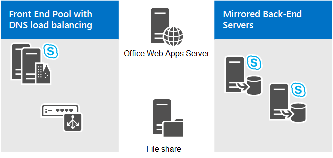

# Pianificare la topologia di conferenza per Skype for Business Server
 
**Riepilogo:** Leggere questo argomento per informazioni sulla pianificazione della topologia di conferenza in Skype for Business Server.
  
In questo argomento vengono descritti i concetti di base della topologia per le conferenze in Skype for Business Server:
  
- Topologie supportate
    
- Considerazioni sulle conferenze telefoniche con accesso esterno
    
- Considerazioni su Web Conferencing
    
- Requisiti per riunioni di grandi dimensioni
    
Per ulteriori informazioni sui requisiti hardware e software, vedere [hardware and software requirements for Conferencing in Skype for Business Server](hardware-and-software-requirements.md).
  
## Topologie supportate

In Skype for Business Server, il server che esegue servizi di conferenza è sempre collocato con i Front End Server o i server Standard Edition. Quando si distribuisce Skype for Business Server, le funzionalità di conferenza di messaggistica istantanea vengono distribuite automaticamente. È possibile specificare se si desidera distribuire web, audio e video (A/V) e le conferenze telefoniche con accesso esterno utilizzando il generatore di topologie. È inoltre possibile utilizzare Generatore di topologie per aggiungere servizi di conferenza a una distribuzione esistente. Per informazioni dettagliate sulle nozioni di base sulla topologia e sulla collocazione, vedere [Basics Topologies for Skype for Business Server](../../plan-your-deployment/topology-basics/topology-basics.md).
  
È possibile distribuire le conferenze nelle topologie e configurazioni seguenti:
  
- Skype for Business Server Standard Edition
    
- Skype for Business Server Enterprise Edition
    
- Con o senza VoIP aziendale
    
## Considerazioni sulle conferenze telefoniche con accesso esterno

Se si sta distribuendo servizi di conferenza telefonica con accesso esterno, è necessario tenere conto di quanto segue:
  
- Per le conferenze telefoniche con accesso esterno è necessario che un Mediation Server converta la segnalazione (e il supporto in alcune configurazioni) tra Skype for Business Server e il gateway PSTN e un gateway PSTN per tradurre la segnalazione e i supporti tra il Mediation Server e il gateway PSTN. .
    
   Prima di poter configurare le conferenze telefoniche con accesso esterno, è necessario distribuire VoIP aziendale o Mediation Server e almeno una delle seguenti operazioni:
    
  - Gateway PSTN
    
  - IP-PBX
    
  - SBC (Session Border Controller), per un provider di servizi di telefonia Internet a cui viene eseguita la connessione tramite la configurazione di un trunk SIP
    
- È possibile distribuire l'applicazione servizio applicazioni, operatore conferenza e Annuncio conferenza in un sito centrale, ma non in un sito di succursale.
    
- È necessario distribuire le conferenze telefoniche con accesso esterno in tutti i pool in cui si distribuiscono le conferenze di Skype for Business Server. Non è necessario assegnare numeri di accesso in ogni pool, ma è necessario distribuire la caratteristica di conferenza con accesso esterno in ogni pool. Questo requisito supporta la funzionalità del nome registrato quando un utente chiama un numero di accesso da un pool per partecipare a una conferenza di Skype for Business Server in un pool diverso. 
    
Per ulteriori informazioni, vedere [pianificare le conferenze telefoniche con accesso esterno in Skype for Business Server](dial-in-conferencing.md).
  
## Considerazioni su Web Conferencing

Web Conferencing richiede quanto segue: 
  
- Accesso all'archivio file utilizzato per l'archiviazione del contenuto delle conferenze Web.
    
- Integrazione con Office Web Apps Server/Office Online Server, che è necessario per condividere i file di PowerPoint durante una conferenza.
    
> [!NOTE]
> L'ultima iterazione del server Office Web Apps è denominata Office Online Server, che è supportato da Skype for Business Server. Per ulteriori informazioni, fare riferimento alla [documentazione di Office Online Server](https://technet.microsoft.com/library/jj219456%28v=office.16%29.aspx). 
  
In Skype for Business Server sono disponibili le seguenti modalità di configurazione di Office Web Apps Server/Office Online Server. A seconda delle esigenze, è possibile:
  
- **Installare sia Skype for Business Server che Office Web Apps Server/Office Online Server in locale dietro il firewall dell'organizzazione e nella stessa area di rete.** Con questa topologia, l'accesso esterno al server Office Web Apps/Office Online Server verrà fornito tramite il server proxy inverso. Idealmente, è consigliabile installare Office Web Apps Server/Office Online Server nella stessa area di rete di Skype for Business Server.
    
    I client Skype for business esterni possono connettersi a Skype for Business Server e a Office Web Apps Server/Office Online Server tramite un server proxy inverso, ovvero un server che accetta richieste da Internet e le inoltra alla rete interna. I client interni non devono utilizzare il server proxy inverso perché possono connettersi direttamente a Office Web Apps Server/Office Online Server. Questa topologia funziona meglio se si desidera utilizzare una farm di Office Web Apps Server/Office Online Server dedicata utilizzata solo da Skype for Business Server.
    
- **Utilizzare un server Office Web Apps distribuito esternamente.** In questa topologia, Skype for Business Server viene distribuito in locale e utilizza un server Office Web Apps/Office Online Server distribuito all'esterno dell'area di rete di Skype for Business Server. Ciò può verificarsi quando il server Office Web Apps/Office Online Server è condiviso tra più applicazioni nella società ed è distribuito in una rete che richiede a Skype for Business Server di utilizzare l'interfaccia esterna del server Office Web Apps/Office Online Server e viceversa.
    
    Non è necessario installare un server proxy inverso; al contrario, tutte le richieste provenienti dal server Office Web Apps/Office Online Server a Skype for Business Server vengono instradate attraverso il server perimetrale. Sia i client interni che quelli esterni di Skype for business si connettono a Office Web Apps Server/Office Online Server utilizzando l'URL esterno.
    
    Se il server Office Web Apps/Office Online Server viene distribuito all'esterno del firewall interno, selezionare l'opzione il **Server Office Web Apps è distribuito in una rete esterna** (ovvero perimetro/Internet) in Generatore di topologie.
    
Per ulteriori informazioni, vedere [configurazione dell'integrazione con Office Web Apps Server in Skype for Business Server](../../deploy/deploy-conferencing/office-web-app-server.md). 
  
Indipendentemente dalla topologia selezionata, è fondamentale aprire le porte del firewall corrette. È necessario assicurarsi che i nomi DNS, gli indirizzi IP e le porte non siano bloccati dai firewall sul server Office Web Apps/Office Online Server, sul servizio di bilanciamento del carico o su Skype for Business Server.
  
> [!NOTE]
> Un'altra opzione per fornire accesso esterno al server Office Web Apps/Office Online Server consiste nel distribuire il server nella rete perimetrale. Se si sceglie di eseguire questa operazione, è necessario tenere presente che il computer server Office Web Apps Server/Office Online Server richiede che sia membro del dominio di Active Directory. A meno che il criterio di rete non consenta ai computer della rete perimetrale di essere membri del dominio Active Directory, è consigliabile non installare Office Web Apps Server/Office Online Server nella rete perimetrale. Al contrario, è necessario installare Office Web Apps Server/Office Online Server nella rete interna e fornire l'accesso degli utenti esterni tramite il server proxy inverso. 
  
## Requisiti della topologia per riunioni di grandi dimensioni

Una singola riunione di grandi dimensioni richiede almeno un front end server e un server back-end. Tuttavia, per garantire una disponibilità elevata, è consigliabile disporre di un pool di due front end server con server back-end con mirroring, come illustrato nel diagramma seguente:
  
**Topologia di riunioni di grandi dimensioni**

  
L'utente che ospita le riunioni di grandi dimensioni deve disporre dell'account utente ospitato nel pool Front end. Non è tuttavia consigliabile ospitare altri account utente in questo pool. Usarlo invece solo per le riunioni di grandi dimensioni. È preferibile creare un account utente speciale in questo pool da usare solo per ospitare riunioni di grandi dimensioni. Poiché l'impostazione di una riunione di grandi dimensioni è ottimizzata per le prestazioni, utilizzarla come utente normale potrebbe avere problemi come l'impossibilità di promuovere una sessione P2P a una riunione quando è coinvolto un endpoint PSTN.
  
La gestione di un pool con esattamente due server Front End richiede alcune considerazioni speciali. Per ulteriori informazioni, vedere [nozioni di base sulla topologia per Skype for Business server 2015](../../plan-your-deployment/topology-basics/topology-basics.md) e [topologie di riferimento per Skype for Business Server 2015](../../plan-your-deployment/topology-basics/reference-topologies.md).
  
Inoltre, se si desidera fornire facoltativamente il backup e il failover del ripristino di emergenza per il pool utilizzato per le riunioni di grandi dimensioni, è possibile associarlo a un pool di dati di installazione analogo, in un data center diverso. Per ulteriori informazioni, vedere [pianificare la disponibilità elevata e il ripristino di emergenza in Skype for Business Server](../../plan-your-deployment/high-availability-and-disaster-recovery/high-availability-and-disaster-recovery.md).
  
Note aggiuntive sulla topologia:
  
- È necessaria una condivisione file per l'archiviazione del contenuto delle riunioni e, se il server di archiviazione è distribuito e abilitato, per l'archiviazione dei file di archiviazione. La condivisione di file può essere dedicata al pool oppure corrispondere a quella usata da un altro pool nello stesso sito di distribuzione. Per informazioni dettagliate sulla configurazione della condivisione file, vedere [creare una condivisione file in Skype for Business Server 2015](../../deploy/install/create-a-file-share.md).
    
- Un server Office Web Apps/Office Online Server è necessario per abilitare la funzionalità di presentazione di PowerPoint nelle riunioni di grandi dimensioni. Il server Office Web Apps/Office Online Server può essere dedicato al pool di riunioni di grandi dimensioni oppure può essere lo stesso server Office Web Apps/Office Online Server utilizzato da altri pool nel sito in cui è distribuito il pool dedicato. Per ulteriori informazioni, vedere [configurazione dell'integrazione con Office Web Apps Server in Skype for Business Server](../../deploy/deploy-conferencing/office-web-app-server.md). 
    
- Il bilanciamento del carico dei Front End Server richiede il bilanciamento del carico hardware per il traffico HTTP (ad esempio, il download del contenuto della riunione). Per il traffico SIP è consigliato il bilanciamento del carico DNS. Per informazioni dettagliate, vedere [requisiti per il bilanciamento del carico per Skype for business](../../plan-your-deployment/network-requirements/load-balancing.md). 
    
- Se si desidera utilizzare il Monitoring Server per il pool di riunioni di grandi dimensioni dedicato, è consigliabile utilizzare il Monitoring Server e il relativo database condiviso in tutti i pool Front End Server della distribuzione di Skype for Business Server. Per ulteriori informazioni, vedere [Plan for monitoring in Skype for Business Server](../../plan-your-deployment/monitoring.md).
    

