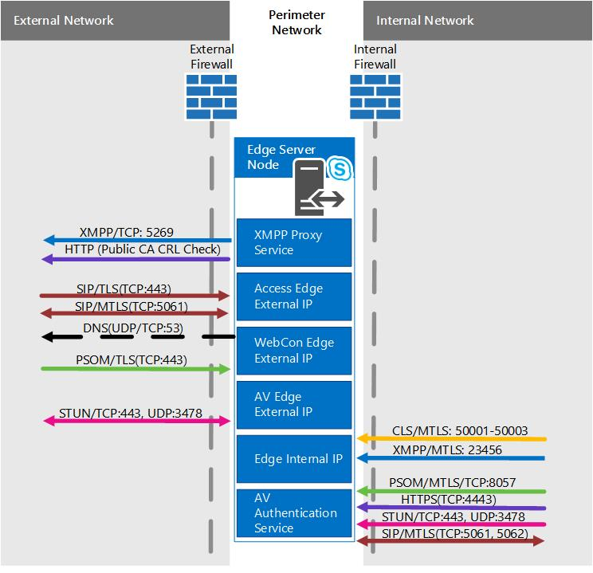

# Scenari del server perimetrale in Skype for Business Server
 
**Riepilogo:** Esaminare questi scenari per semplificare la pianificazione della topologia del server perimetrale in Skype for Business Server.
  
Sono disponibili alcuni diagrammi degli scenari per facilitare la visualizzazione e la scelta di una topologia del server perimetrale di Skype for Business Server che si desidera implementare. Dopo aver scelto un buon candidato, è possibile andare a leggere i requisiti ambientali necessari per l'indirizzo. Il seguente è applicabile a tutti gli scenari, per cui viene menzionato per primo.
  
Queste cifre, che sono mostrate solo a scopo esemplificativo (e come tali contengono dati IPv4 e IPv6 di esempio), non rappresentano il flusso di comunicazione effettivo, bensì una visualizzazione di alto livello del traffico possibile. I dettagli delle porte possono essere visualizzati anche nei diagrammi delle porte per ogni scenario di seguito.
  
I diagrammi mostrano. com per l'interfaccia esterna e .NET per l'interno, che è anche materiale di esempio. Naturalmente, è possibile che le proprie voci siano molto diverse quando si sta mettendo insieme il proprio piano definitivo Edge.
  
Non è incluso il Director (che è un componente facoltativo) in uno dei diagrammi, ma è possibile leggerlo separatamente (è menzionato in altri argomenti di pianificazione).
  
Come indicato in alto, nei diagrammi sono presenti dati IPv6 di esempio. La maggior parte della documentazione in [Plan for Edge Server Deployments in Skype for Business Server](edge-server-deployments.md) si riferisce a IPv4, ma è certamente supportato se si desidera utilizzare IPv6. Tenere presente che gli indirizzi IPv6 sono necessari nello spazio di indirizzi assegnato e dovranno collaborare con l'indirizzamento interno ed esterno, come con gli IP IPv4. È possibile, grazie a Windows, utilizzare la funzionalità dual stack, che è uno stack di rete distinto e distinti per IPv4 e IPv6. In questo modo, se necessario, è possibile assegnare contemporaneamente gli indirizzi IPv4 e IPv6.
  
Esistono dispositivi NAT che consentono NAT64 (IPv6 a IPv4) e NAT66 (IPv6 a IPv6)) e questo è valido per l'utilizzo con Skype for Business Server.
  
> [!IMPORTANT]
> Se si utilizza il controllo di ammissione di chiamata (CAC), è necessario utilizzare IPv4 sull'interfaccia interna affinché funzioni. 
  
## Server perimetrale Single Consolidated Skype for Business Server con indirizzi IP privati e NAT

In questo scenario, non è disponibile alcuna opzione per la disponibilità elevata. In questo modo si spende meno sull'hardware e si dispone di una distribuzione più semplice. Se è necessario disporre di disponibilità elevata, vedere gli scenari consolidati in scala di seguito.
  

  
### Diagramma porta

È inoltre presente un diagramma per le porte per i singoli server perimetrali consolidati.
  

  
## Server perimetrale Single Consolidated Skype for Business Server con indirizzi IP pubblici

In questo scenario, non è disponibile alcuna opzione per la disponibilità elevata. In questo modo si spende meno sull'hardware e si dispone di una distribuzione più semplice. Se è necessario disporre di disponibilità elevata, vedere gli scenari consolidati in scala di seguito.
  

  
### Diagramma porta

È inoltre presente un diagramma per le porte per i singoli server perimetrali consolidati.
  

  
## Pool di server perimetrali di Skype for business consolidato in scala, con bilanciamento del carico DNS e indirizzi IP privati e NAT

In questo scenario, è possibile disporre di disponibilità elevata nella distribuzione dei server perimetrali, che offre i vantaggi della scalabilità e del supporto per il failover.
  

  
### Diagramma porta

È inoltre presente un diagramma per i pool di server perimetrali consolidati in scala con bilanciamento del carico DNS.
  

  
## Pool di server perimetrali consolidati in scala Skype for business, con bilanciamento del carico DNS e indirizzi IP pubblici

In questo scenario, è possibile disporre di disponibilità elevata nella distribuzione dei server perimetrali, che offre i vantaggi della scalabilità e del supporto per il failover.
  

  
### Diagramma porta

È inoltre presente un diagramma per i pool di server perimetrali consolidati in scala con bilanciamento del carico DNS.
  

  
## Pool di server perimetrali di Skype for business consolidato in scala con bilanciamento del carico hardware

In questo scenario, è possibile disporre di disponibilità elevata nella distribuzione dei server perimetrali, che offre i vantaggi della scalabilità e del supporto per il failover.
  

 
