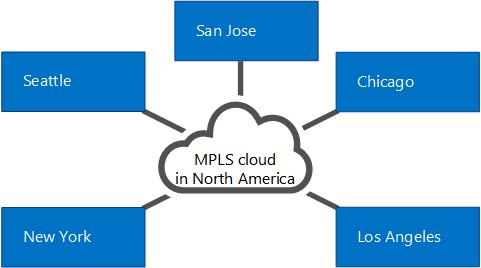
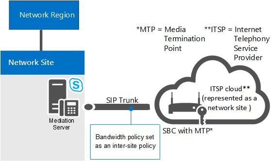

# Componenti e topologie per il controllo di ammissione di chiamata in Skype for Business

Pianificazione del servizio Controllo di ammissione di chiamata (CAC) se si dispone di una rete MPLS, di un trunk SIP o di un gateway PSTN o PBX di terze parti. Si applica a Skype for Business Server VoIP aziendale.

Negli argomenti di questa sezione vengono fornite informazioni sulle considerazioni speciali di cui tenere conto per la distribuzione del servizio Controllo di ammissione di chiamata con diversi tipi di topologie di rete.

## Controllo di ammissione di chiamata in una rete MPLS

In una rete MPLS (Multiprotocol Label Switching) tutti i siti sono connessi tramite full mesh, ovvero tutti i siti sono connessi direttamente alla dorsale MPLS del provider di servizi Internet e a ogni sito viene assegnata una larghezza di banda da utilizzare nel cloud MPLS attraverso un collegamento WAN. Non è presente alcun hub di rete o sito centrale per controllare il routing IP. Nella figura seguente viene illustrata una rete semplice basata sulla tecnologia MPLS.

**Rete MPLS di esempio**

Per distribuire il controllo di ammissione di chiamata in una rete MPLS, è necessario creare un'area di rete che rappresenti il cloud MPLS e un sito di rete che rappresenti ogni sito satellite MPLS. Nella figura seguente viene illustrato come è consigliabile configurare l'area di rete e i siti di rete per rappresentare la rete MPLS di esempio della figura precedente. I limiti di larghezza di banda totali e quelli di sessione sono quindi basati sulla capacità del collegamento WAN che va da ogni sito di rete all'area di rete che rappresenta il cloud MPLS.

**Area di rete e siti di rete per una rete MPLS**

## Controllo di ammissione di chiamata in un trunk SIP

Per distribuire il servizio Controllo di ammissione di chiamata in un trunk SIP, creare un sito di rete per rappresentare il provider di servizi di telefonia Internet (ITSP). Per applicare i valori dei criteri di larghezza di banda nel trunk SIP, creare criteri tra siti tra il sito di rete dell'organizzazione e il sito di rete creato per rappresentare l'ITSP.

Nella figura seguente è illustrato un esempio di distribuzione del servizio Controllo di ammissione di chiamata in un trunk SIP.

**Configurazione del servizio Controllo di ammissione di chiamata in un trunk SIP**

Per configurare il servizio Controllo di ammissione di chiamata in un trunk SIP, è necessario eseguire le operazioni seguenti durante la distribuzione del servizio:

1. Creare un sito di rete per rappresentare l'ITSP. Associare il sito di rete a un'area di rete appropriata e allocare una larghezza di banda pari a zero per audio e video per il sito di rete. Per informazioni dettagliate, vedere [Configure Network Sites for CAC](/previous-versions/office/lync-server-2013/lync-server-2013-configure-network-sites-for-cac) nella documentazione relativa alla distribuzione.

    > [!NOTE]
    > Per l'ITSP, questa configurazione del sito di rete non è funzionale. I valori dei criteri di larghezza di banda vengono effettivamente applicati nel passaggio 2.

2. Creare un collegamento tra siti per il trunk SIP utilizzando i valori dei parametri rilevanti per il sito creato nel passaggio 1. Utilizzare, ad esempio, il nome del sito di rete dell'organizzazione come valore del parametro NetworkSiteID1 e il sito di rete dell'ITSP come valore del parametro NetworkSiteID2. Per informazioni dettagliate, vedere [Create network intersite policies in Skype for Business Server](../../deploy/deploy-enterprise-voice/create-network-intersite-policies.md) nella documentazione relativa alla distribuzione e [New-CsNetworkInterSitePolicy.](/powershell/module/skype/new-csnetworkintersitepolicy?view=skype-ps)

3. Ottenere l'indirizzo IP del punto di terminazione multimediale scb (Session Border Controller) dal provider ITSP. Aggiungere tale indirizzo IP con una subnet mask di 32 al sito di rete che rappresenta l'ITSP. Per informazioni dettagliate, vedere [Associate a Subnet with a Network Site](/previous-versions/office/lync-server-2013/lync-server-2013-associate-a-subnet-with-a-network-site).

## Controllo di ammissione di chiamata con un gateway PSTN o UN PBX di terze parti

In questo argomento vengono descritti esempi di come è possibile distribuire il controllo di ammissione di chiamata sul collegamento tra l'interfaccia gateway del Mediation Server e un gateway PSTN (Public Switched Telephone Network) di terze parti o UN PBX (Private Branch Exchange).

### Caso 1: controllo di ammissione di chiamata tra Mediation Server e un gateway PSTN

Il controllo di ammissione di chiamata può essere distribuito sul collegamento WAN dall'interfaccia gateway del Mediation Server a un pbx di terze parti o a un gateway PSTN.

**Caso 1: controllo di ammissione di chiamata tra Mediation Server e un gateway PSTN**

In questo esempio, il controllo di ammissione di chiamata viene applicato tra Mediation Server e un gateway PSTN. Se un Skype for Business client del sito di rete 1 chiama PSTN tramite il gateway PSTN in Sito di rete 2, il contenuto multimediale passa attraverso il collegamento WAN. Di conseguenza, vengono eseguiti due controlli del controllo di ammissione di chiamata per ogni sessione PSTN:

- Tra l Skype for Business appalto client e Mediation Server

- Tra Mediation Server e il gateway PSTN

Ciò funziona sia per le chiamate PSTN in arrivo a un client in Sito di rete 1 sia per le chiamate PSTN in uscita provenienti da un'applicazione client in Sito di rete 1.

> [!NOTE]
> Verificare che la subnet IP a cui appartiene il gateway PSTN sia configurata e associata a Sito di rete 2.

> [!NOTE]
> Verificare che la subnet IP a cui appartengono entrambe le interfacce del Mediation Server sia configurata e associata al sito di rete 1.

> [!NOTE]
> Per informazioni dettagliate, vedere [Associate a Subnet with a Network Site](/previous-versions/office/lync-server-2013/lync-server-2013-associate-a-subnet-with-a-network-site).

### Caso 2: controllo di ammissione di chiamata tra Mediation Server e un PBX di terze parti con Media Termination Point

Questa configurazione è simile al caso 1. In entrambi i casi, mediation server sa quale dispositivo termina il supporto all'estremità opposta del collegamento WAN e l'indirizzo IP del gateway PSTN o PBX con media terminazione point (MTP) è configurato nel Mediation Server come hop successivo.

**Caso 2: controllo di ammissione di chiamata tra Mediation Server e un PBX di terze parti con MTP**

In questo esempio, il controllo di ammissione di chiamata viene applicato tra Mediation Server e PBX/MTP. Se un Skype for Business client di rete presso il sito di rete 1 invia una chiamata PSTN tramite IL PBX/MTP che si trova in Sito di rete 2, i supporti passano attraverso il collegamento WAN. Pertanto, per ogni sessione PSTN vengono eseguiti due controlli CAC:

- Tra l Skype for Business appalto client e Mediation Server

- Tra Mediation Server e PBX/MTP

Ciò funziona sia per le chiamate PSTN in arrivo a un client in Sito di rete 1 che per le chiamate PSTN in uscita provenienti da un client in Sito di rete 1.

> [!NOTE]
> Verificare che la subnet IP a cui appartiene LTP sia configurata e associata al sito di rete 2.

> [!NOTE]
> Verificare che la subnet IP a cui appartengono entrambe le interfacce del Mediation Server sia configurata e associata al sito di rete 1.

> [!NOTE]
> Per informazioni dettagliate, vedere [Associate a Subnet with a Network Site](/previous-versions/office/lync-server-2013/lync-server-2013-associate-a-subnet-with-a-network-site).

### Caso 3: controllo di ammissione di chiamata tra Mediation Server e un PBX di terze parti senza un punto di terminazione multimediale

Il caso 3 è leggermente diverso dai primi due casi. Se nel SISTEMA PBX di terze parti non è presente alcun MTP, per una richiesta di sessione in uscita al SISTEMA PBX di terze parti il Mediation Server non sa dove verrà terminato il contenuto multimediale nel limite PBX. In questo caso, il contenuto multimediale scorre direttamente tra Mediation Server e il dispositivo endpoint di terze parti.

**Caso 3: controllo di ammissione di chiamata tra Mediation Server e un PBX di terze parti senza MTP**

In questo esempio, se un utente client di Skype for Business nel sito di rete 1 effettua una chiamata a un utente tramite IL PBX, il Mediation Server è in grado di eseguire controlli CAC solo sul lato proxy (tra l'applicazione client Skype for Business e Mediation Server). Poiché il Mediation Server non dispone di informazioni sul dispositivo endpoint durante la richiesta della sessione, i controlli CAC non possono essere eseguiti sul collegamento WAN (tra Mediation Server e l'endpoint di terze parti) prima della creazione della chiamata. Una volta stabilita la sessione, tuttavia, il Mediation Server facilita la contabilizzazione della larghezza di banda utilizzata nel trunk.

Per le chiamate provenienti dall'endpoint di terze parti, le informazioni sul dispositivo endpoint sono disponibili al momento della richiesta di sessione e il controllo CAC può essere eseguito su entrambi i lati del Mediation Server.

> [!NOTE]
> Verificare che la subnet IP a cui appartengono i dispositivi endpoint sia configurata e associata a Sito di rete 2.

> [!NOTE]
> Verificare che la subnet IP a cui appartengono entrambe le interfacce del Mediation Server sia configurata e associata al sito di rete 1.

> [!NOTE]
> Per informazioni dettagliate, vedere [Associate a Subnet with a Network Site](/previous-versions/office/lync-server-2013/lync-server-2013-associate-a-subnet-with-a-network-site).