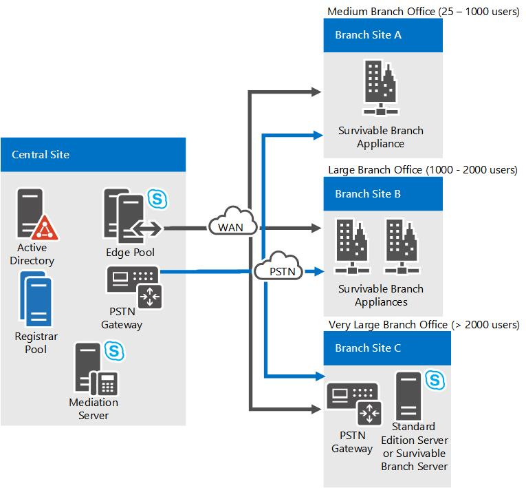

# Pianificare la resilienza di VoIP aziendale in Skype for Business ServerPlan for Enterprise Voice resiliency in Skype for Business Server

Informazioni su come supportare la resilienza vocale in Skype for Business Server VoIP aziendale, sia in siti centrali che in siti di succursale.Learn how to support voice resiliency in Skype for Business Server Enterprise Voice, at both central sites and branch sites. Le opzioni del sito della filiale includono la distribuzione di appliance Survivable Branch o Survivable Branch Servers.Branch site options include deploying Survivable Branch Appliances or Survivable Branch Servers.

La resilienza vocale si riferisce alla capacità degli utenti di continuare a effettuare e ricevere chiamate se un sito centrale che ospita Skype for Business Server non è disponibile, sia tramite un errore WAN (Wide Area Network) che con un'altra causa.Voice resiliency refers to the ability of users to continue making and receiving calls if a central site that hosts Skype for Business Server becomes unavailable, whether through a wide area network (WAN) failure or another cause. Se un sito centrale non riesce, il servizio VoIP aziendale deve continuare senza interruzioni attraverso il failover continuo in un sito di backup.If a central site fails, Enterprise Voice service must continue uninterrupted through seamless failover to a backup site. In caso di errore WAN, le chiamate del sito di succursale devono essere reindirizzate a un gateway PSTN locale.In the event of WAN failure, branch site calls must be redirected to a local PSTN gateway. In questa sezione viene illustrata la pianificazione della resilienza vocale in caso di errori WAN o del sito centrale.This section discusses planning for voice resiliency in the event of central-site or WAN failure.

## Resilienza del sito centraleCentral site resiliency

Sempre più spesso, le aziende hanno più siti distribuiti in tutto il mondo.Increasingly, enterprises have multiple sites spread across the globe. La gestione dei servizi di emergenza, l'accesso al supporto tecnico e la possibilità di svolgere attività commerciali critiche quando un sito centrale è fuori servizio sono essenziali per qualsiasi soluzione di resilienza vocale aziendale.Maintaining emergency services, access to help desk, and the ability to conduct critical business tasks when a central site is out of service is essential for any Enterprise Voice resiliency solution. Quando un sito centrale diventa non disponibile, è necessario che siano soddisfatte le condizioni seguenti:When a central site becomes unavailable, the following conditions must be met:

- Il failover vocale deve essere specificato.Voice failover must be provided.

- Gli utenti che normalmente si iscrivono con il pool Front-end presso il sito centrale devono essere in grado di eseguire la registrazione con un pool di front end alternativo.Users who ordinarily register with the Front End pool at the central site must be able to register with an alternative Front End pool. Questa operazione può essere eseguita creando più record SRV DNS, ognuno dei quali viene risolto in un pool di Director o in un pool di front-end in ognuno dei siti centrali.This can be done by creating multiple DNS SRV records, each of which resolves to a Director pool or Front End pool in each of your central sites. È possibile modificare la priorità e i pesi dei record SRV in modo che gli utenti serviti da tale sito centrale ottengano il relativo Director e il pool Front end prima di quelli presenti in altri record SRV.You can adjust the priority and weights of the SRV records so that users who are served by that central site get the corresponding Director and Front End pool ahead of those in other SRV records.

- Le chiamate da e verso gli utenti che si trovano in altri siti devono essere reinstradate alla rete PSTN.Calls to and from users located at other sites must be rerouted to the PSTN.

Questo argomento descrive la soluzione consigliata per la protezione della resilienza vocale del sito centrale.This topic describes the recommended solution for securing central site voice resiliency.

### Architettura e topologiaArchitecture and Topology

La pianificazione della resilienza vocale in un sito centrale richiede una conoscenza di base del ruolo centrale svolto da Skype for Business Server registrar per abilitare il failover vocale.Planning for voice resiliency at a central site requires a basic understanding of the central role played by the Skype for Business Server Registrar in enabling voice failover. Il registrar di Skype for Business Server è un servizio che consente la registrazione e l'autenticazione del client e fornisce servizi di routing.The Skype for Business Server Registrar is a service that enables client registration and authentication and provides routing services. Viene eseguito in tutti i server standard, Front End Server, Director o Survivable Branch Appliance.It runs on all Standard Edition server, Front End Server, Director, or Survivable Branch Appliance. Un pool di registrar è costituito da servizi di registrazione eseguiti nel pool Front-end e residenti nello stesso sito.A Registrar pool consists of Registrar Services running on the Front End pool and residing at the same site. Un client Skype for Business individua il pool Front-end tramite il meccanismo di individuazione seguente:A Skype for Business client discovers the Front End pool through the following discovery mechanism:

1. Record SRV DNSDNS SRV record

2. Servizio Web di individuazione automaticaAutodiscovery Web Service

3. Opzione DHCP 120DHCP option 120

Dopo che il client Skype for business si connette al pool Front-End, viene diretto dal bilanciamento del carico su uno dei server front-end nel pool.After the Skype for Business client connects to the Front End pool, it is directed by the load balancer to one of the Front End Servers in the pool. Il server front-end, a sua volta, reindirizza il client a un registrar preferito nel pool.That Front End Server, in turn, redirects the client to a preferred Registrar in the pool.

Ogni utente abilitato per VoIP aziendale viene assegnato a un pool di registrar specifico, che diventa il pool di registrar principale dell'utente.Each user enabled for Enterprise Voice is assigned to a particular Registrar pool, which becomes that user's primary Registrar pool. In un sito specifico, centinaia o migliaia di utenti condividono in genere un singolo pool di registrar principale.At a given site, hundreds or thousands of users typically share a single primary Registrar pool. Per tenere conto del consumo di risorse del sito centrale da parte di tutti gli utenti del sito della filiale che si basano sul sito centrale per presenza, conferenza o failover, è consigliabile considerare ogni utente del sito filiale come se l'utente fosse un utente registrato nel sito centrale.To account for the consumption of central site resources by any branch site users that rely on the central site for presence, conferencing, or failover, we recommend that you consider each branch site user as though the user were a user registered with the central site. Attualmente non esistono limiti al numero di utenti del sito succursale, inclusi gli utenti registrati con un Survivable Branch Appliance.There are currently no limits on the number of branch site users, including users registered with a Survivable Branch Appliance.

Per garantire la resilienza vocale in caso di errore di un sito centrale, il pool di registrar principale deve avere un unico pool di registrar di backup designato situato in un altro sito.To assure voice resiliency in the event of a central site failure, the primary Registrar pool must have a single designated backup Registrar pool located at another site. Il backup può essere configurato usando le impostazioni di resilienza del generatore di topologia.The backup can be configured by using Topology Builder resiliency settings. Supponendo che un collegamento WAN resiliente tra i due siti, gli utenti il cui pool di registrar principale non è più disponibile vengano automaticamente indirizzati al pool di registrar di backup.Assuming a resilient WAN link between the two sites, users whose primary Registrar pool is no longer available are automatically directed to the backup Registrar pool.

I passaggi seguenti descrivono il processo di individuazione e registrazione del client:The following steps describe the client discovery and registration process:

1. Un client individua Skype for Business Server tramite i record SRV DNS.A client discovers Skype for Business Server through DNS SRV records. In Skype for Business Server i record SRV DNS possono essere configurati in grado di restituire più di un FQDN alla query SRV DNS.In Skype for Business Server, DNS SRV records can be configured to return more than one FQDN to the DNS SRV query. Ad esempio, se Enterprise Contoso ha tre siti centrali (Nord America, Europa e Asia-Pacifico) e un pool di Director in ogni sito centrale, i record SRV DNS possono puntare agli FQDN del pool di Director in ognuna delle tre posizioni.For example, if enterprise Contoso has three central sites (North America, Europe, and Asia-Pacific) and a Director pool at each central site, DNS SRV records can point to the Director pool FQDNs in each of the three locations. Purché il pool di Director in una delle posizioni sia disponibile, il client può connettersi al primo server Skype for business hop.As long as the Director pool in one of the locations is available, the client can connect to the first hop Skype for Business Server.

    > [!NOTE]
    > L'uso di un pool di Director è facoltativo.Using a Director pool is optional. È invece possibile usare un pool Front-end.A Front End pool can be used instead.

2. Il pool di Director informa il client Skype for business sul pool di registrar principale dell'utente e sul pool di registrar di backup.The Director pool informs the Skype for Business client about the user's primary Registrar pool and backup Registrar pool.

3. Il client Skype for business tenta innanzitutto di connettersi al pool di registrar principale dell'utente.The Skype for Business client attempts to connect to the user's primary Registrar pool first. Se il pool di registrar principale è disponibile, il registrar accetta la registrazione.If the primary Registrar pool is available, the Registrar accepts the registration. Se il pool di registrar principale non è disponibile, il client Skype for business tenterà di connettersi al pool di registrazione di backup.If the primary Registrar pool is unavailable, the Skype for Business client attempts to connect to the backup Registrar pool. Se il pool di registrar di backup è disponibile e ha determinato che il pool di registrar principale dell'utente non è disponibile (rilevando una mancanza di heartbeat per un intervallo di failover specificato), il pool di registrar accetta la registrazione dell'utente.If the backup Registrar pool is available and has determined that the user's primary Registrar pool is unavailable (by detecting a lack of heartbeat for a specified failover interval) the backup Registrar pool accepts the user's registration. Dopo che il registrar di backup rileva che il registrar principale è di nuovo disponibile, il pool di registrazione di backup reindirizza i client di failover nel pool principale.After the backup Registrar detects that the primary Registrar is again available, the backup Registrar pool will redirect failover clients to their primary pool.

### Requisiti e suggerimentiRequirements and Recommendations

I requisiti e le raccomandazioni seguenti per l'implementazione della resilienza vocale del sito centrale sono appropriati per la maggior parte delle organizzazioni:The following requirements and recommendations for implementing central site voice resiliency are appropriate for most organizations:

- I siti in cui risiedono i pool di registrar primari e di backup devono essere connessi da un collegamento WAN resiliente.The sites in which the primary and backup Registrar pools reside should be connected by a resilient WAN link.

- Ogni sito centrale deve contenere un pool di registrar costituito da uno o più registrar.Each central site must contain a Registrar pool consisting of one or more Registrars.

- Ogni pool di registrar deve essere bilanciato tramite bilanciamento del carico DNS, bilanciamento del carico hardware o entrambi.Each Registrar pool must be load-balanced by using DNS load balancing, hardware load balancing, or both. Per informazioni dettagliate sulla pianificazione della configurazione del bilanciamento del carico, vedere [requisiti di bilanciamento del carico per Skype for business](../../plan-your-deployment/network-requirements/load-balancing.md).For detailed information about planning your load balancing configuration, see [Load balancing requirements for Skype for Business](../../plan-your-deployment/network-requirements/load-balancing.md).

- Ogni utente deve essere assegnato a un pool di registrar principale usando il cmdlet **Set-CsUser** di Skype for Business Server Management Shell o il pannello di controllo di Skype for Business Server.Each user must be assigned to a primary Registrar pool by using either the Skype for Business Server Management Shell **set-CsUser** cmdlet or the Skype for Business Server Control Panel.

- Il pool di registrar principale deve avere un singolo pool di registrar di backup situato in un sito centrale diverso.The primary Registrar pool must have a single backup Registrar pool located in a different central site.

- Il pool di registrar principale deve essere configurato per il failover nel pool di registrazione di backup.The primary Registrar pool must be configured to fail over to the backup Registrar pool. Per impostazione predefinita, il registrar principale è impostato per il failover nel pool di registrar di backup dopo un intervallo di 300 secondi.By default, the primary Registrar is set to fail over to the backup Registrar pool after an interval of 300 seconds. Puoi modificare questo intervallo usando il generatore di topologia di Skype for Business Server.You can change this interval by using the Skype for Business Server Topology Builder.

- Configurare una route di failover.Configure a failover route. Quando si configura la route, specificare un gateway che si trova in un sito diverso dal gateway specificato nella route principale.When configuring the route, specify a gateway that is located at a different site from the gateway specified in the primary route.

- Se il sito centrale conteneva il server di gestione principale e probabilmente il sito è in calo per un periodo prolungato, sarà necessario reinstallare gli strumenti di gestione nel sito di backup. in caso contrario, non sarà possibile modificare le impostazioni di gestione.If the central site contained your primary management server and the site is likely to be down for an extended period, you will need to reinstall your management tools at the backup site; otherwise, you won't be able to change any management settings.

### DipendenzeDependencies

Skype for Business Server dipende dai seguenti componenti di infrastruttura e software per assicurare la resilienza vocale:Skype for Business Server depends on the following infrastructure and software components to assure voice resiliency:

|**Componente****Component**   |**Funzionale****Functional**   |
|:-----|:-----|
|DNSDNS    |Risoluzione di record SRV e record per la connettività server-server e client-serverResolving SRV records and A records for server-server and server-client connectivity    |
|Servizi Web Exchange e Exchange (EWS)Exchange and Exchange Web Services (EWS)    |Archiviazione contatti; dati del calendarioContact storage; calendar data    |
|Servizi Web di Exchange e messaggistica unificataExchange Unified Messaging and Exchange Web Services    |Registri delle chiamate, elenco della segreteria telefonica, casella vocaleCall logs, voice mail list, voice mail    |
|Opzioni DHCP 120DHCP Options 120    |Se DNS SRV non è disponibile, il client tenterà di usare l'opzione DHCP 120 per individuare il registrar.If DNS SRV is unavailable, the client will attempt to use DHCP Option 120 to discover the Registrar. Affinché questo funzioni, è necessario configurare un server DHCP o abilitare il protocollo DHCP di Skype for Business Server.For this to work, either a DHCP server must be configured or Skype for Business Server DHCP must be enabled.    |

### Funzionalità vocali SurvivableSurvivable Voice Features

Se sono stati implementati i requisiti e le raccomandazioni precedenti, le funzionalità vocali seguenti verranno fornite dal pool di registrazione di backup:If the preceding requirements and recommendations have been implemented, the following voice features will be provided by the backup Registrar pool:

- Chiamate PSTN in uscitaOutbound PSTN calls

- Chiamate PSTN in ingresso, se il provider del servizio di telefonia supporta la possibilità di eseguire il failover in un sito di backupInbound PSTN calls, if the telephony service provider supports the ability to fail over to a backup site

- Chiamate aziendali tra utenti sia nello stesso sito che tra due siti diversiEnterprise calls between users at both the same site and between two different sites

- Gestione delle chiamate di base, incluso il blocco delle chiamate, il recupero e il trasferimentoBasic call handling, including call hold, retrieval, and transfer

- Messaggistica istantanea con due parti e condivisione di audio e video tra utenti nello stesso sitoTwo-party instant messaging and sharing audio and video between users at the same site

- Inoltro di chiamata, squillo simultaneo di endpoint, delegazione delle chiamate e servizi di chiamata del team, ma solo se entrambe le parti per chiamare delegazione o tutti i membri del team sono configurate nello stesso sito.Call forwarding, simultaneous ringing of endpoints, call delegation, and team call services, but only if both parties to call delegation, or all team members, are configured at the same site.

- I telefoni e i client esistenti continuano a funzionare.Existing phones and clients continue to work.

- Registrazione dettagli chiamata (CDR)Call detail recording (CDR)

- Autenticazione e autorizzazioneAuthentication and authorization

A seconda del modo in cui sono configurate, le funzionalità vocali seguenti potrebbero non funzionare quando un sito centrale principale non è più in servizio:Depending on how they are configured, the following voice features may or may not work when a primary central site is out of service:

- Deposito e recupero della segreteria telefonicaVoice mail deposit and retrieval

    Se si vuole rendere disponibile la messaggistica unificata di Exchange quando il sito centrale principale non è in servizio, è necessario eseguire una delle operazioni seguenti:If you want to make Exchange UM available when the primary central site is out of service, you must do one of the following:

  - Modificare i record SRV DNS in modo che i server di messaggistica unificata di Exchange nel sito centrale puntino ai server di messaggistica unificata di Exchange in un altro sito.Change DNS SRV records so that the Exchange UM servers at the central site point to backup Exchange UM servers at another site.

  - Configurare il dial plan di messaggistica unificata di Exchange di ogni utente per includere i server di messaggistica unificata di Exchange sia nel sito centrale che nel sito di backup, ma designa i server di messaggistica unificata di Exchange come disabilitati.Configure each user's Exchange UM dial plan to include Exchange UM servers at both the central site and the backup site, but designate the backup Exchange UM servers as disabled. Se il sito principale diventa non disponibile, l'amministratore di Exchange deve contrassegnare i server di messaggistica unificata di Exchange nel sito di backup come abilitato.If the primary site becomes unavailable, the Exchange administrator has to mark the Exchange UM servers at the backup site as enabled.

    Se nessuna delle soluzioni precedenti è possibile, la messaggistica unificata di Exchange non sarà disponibile in caso il sito centrale diventi non disponibile.If neither of the preceding solutions is possible, then Exchange UM will not be available in the event the central site becomes unavailable.

- Conferenze di tutti i tipiConferencing of all types

    Un utente che ha eseguito il failover in un sito di backup può partecipare a una conferenza creata o ospitata da un organizzatore il cui pool è disponibile, ma non può creare o ospitare una conferenza nel proprio pool principale, che non è più disponibile.A user who has failed over to a backup site can join a conference that is created or hosted by an organizer whose pool is available but cannot create or host a conference on his or her own primary pool, which is no longer available. Analogamente, altri utenti non possono partecipare a conferenze ospitate nel pool principale dell'utente interessato.Similarly, others users cannot join conferences that are hosted on the affected user's primary pool.

Le funzionalità vocali seguenti non funzionano quando un sito centrale principale non è più in servizio:The following voice features do not work when a primary central site is out of service:

- Operatore automatico conferenzaConference Auto-Attendant

- Presenza e routing basato su DNDPresence and DND-based routing

- Aggiornamento delle impostazioni di inoltro di chiamataUpdating call forwarding settings

- Servizio Response Group e parcheggio delle chiamateResponse Group service and Call Park

- Provisioning di nuovi telefoni e clientProvisioning new phones and clients

- Ricerca Web RubricaAddress Book Web Search

## Resilienza del sito della filialeBranch site resiliency

Se si vuole specificare la resilienza del sito di succursale, ossia il servizio VoIP aziendale a elevata disponibilità, sono disponibili tre opzioni:If you want to provide branch-site resiliency, that is, high-availability Enterprise Voice service, you have three options for doing so:

- Survivable Branch ApplianceSurvivable Branch Appliance

- Survivable Branch ServerSurvivable Branch Server

- Una distribuzione completa di Skype for Business Server nel sito della filialeA full Skype for Business Server deployment at the branch site

Questa guida ti aiuterà a valutare la soluzione di resilienza migliore per l'organizzazione e, in base alla tua soluzione di resilienza, la soluzione di connettività PSTN da usare.This guide will help you evaluate which resiliency solution is best for your organization and, based on your resiliency solution, which PSTN-connectivity solution to use. Sarà inoltre utile preparare la distribuzione della soluzione scelta descrivendo i prerequisiti e altre considerazioni sulla pianificazione.It will also help you prepare to deploy the solution that you choose by describing prerequisites and other planning considerations.

### Caratteristiche di resilienza del sito filialeBranch site resiliency features

Se si specifica la resilienza del sito di succursale, se la connessione WAN di un sito di succursale a un sito centrale non riesce o se il sito centrale non è raggiungibile, è necessario che le caratteristiche vocali seguenti continuino a essere disponibili:If you provide branch-site resiliency, if a branch site's WAN connection to a central site fails or if the central site is unreachable, the following voice features should continue to be available:

- Chiamate PSTN (Public Switched Telephone Network) in ingresso e in uscitaInbound and outbound public switched telephone network (PSTN) calls

- Chiamate aziendali tra utenti sia nello stesso sito che tra due siti diversiEnterprise calls between users at both the same site and between two different sites

- Gestione delle chiamate di base, incluso il blocco delle chiamate, il recupero e il trasferimentoBasic call handling, including call hold, retrieval, and transfer

- Messaggistica istantanea a due partiTwo-party instant messaging

- Inoltro di chiamata, squillo simultaneo di endpoint, delega delle chiamate e servizi di chiamata del team, ma solo se il delegante e il delegato, ad esempio un Manager e l'amministratore del responsabile, o tutti i membri del team, sono configurati nello stesso sitoCall forwarding, simultaneous ringing of endpoints, call delegation, and team call services, but only if the delegator and delegate (for example, a manager and the manager's administrator), or all team members, are configured at the same site

- Record dettagli chiamata (CDRs)Call detail records (CDRs)

- Servizi di conferenza telefonica con accesso esterno PSTN con l'operatore automatico di conferenzaPSTN dial-in conferencing with Conferencing Auto-Attendant

- Funzionalità della segreteria telefonica se si configurano le impostazioni di reinstradamento della segreteria telefonica.Voice mail capabilities, if you configure voice mail rerouting settings.

- Autenticazione e autorizzazione dell'utenteUser authentication and authorization

Le caratteristiche seguenti sono disponibili solo se la soluzione di resilienza è una distribuzione su vasta scala di Skype for Business Server presso il sito della filiale:The following features will be available only if your resiliency solution is a full-scale Skype for Business Server deployment at the branch site:

- Servizi di conferenza di messaggistica istantanea, Web e A/VIM, web, and A/V conferencing

- Routing basato su presenza e non disturbare (DND) (dove le chiamate non squillano in estensioni con DND attivato)Presence and Do Not Disturb (DND)-based routing (where calls are prevented from ringing on extensions that have DND activated)

- Aggiornamento delle impostazioni di inoltro di chiamataUpdating call forwarding settings

- Applicazione Response Group Application e Call ParkResponse Group application and Call Park application

- Provisioning di nuovi telefoni e client, ma solo se i servizi di dominio Active Directory sono presenti nel sito della filiale.Provisioning new phones and clients, but only if Active Directory Domain Services is present at the branch site.

- Enhanced 9-1-1 (E9-1-1)Enhanced 9-1-1 (E9-1-1)

    Se E9-1-1 è distribuito e il trunk SIP nel sito centrale non è disponibile perché il collegamento WAN è in calo, il Survivable Branch Appliance instraderà le chiamate E9-1-1 al gateway della filiale locale.If E9-1-1 is deployed, and the SIP trunk at the central site is not available because the WAN link is down, then the Survivable Branch Appliance will route E9-1-1 calls to the local branch gateway. Per abilitare questa funzionalità, i criteri vocali degli utenti del sito della filiale devono instradare le chiamate al gateway locale in caso di errore WAN.To enable this feature, the branch-site users' voice policies should route calls to the local gateway in the event of WAN failure.

> [!NOTE]
> SBA (Survivable Branch Office) non è supportato per XMPP.SBA (survivable branch office) is not supported for XMPP. Gli utenti ospitati in una configurazione SBA non saranno in grado di inviare messaggi istantanei o vedere la presenza con contatti XMPP.Users homed in a SBA configurations will not be able to send IMs or see Presence with XMPP contacts.

### Soluzioni di resilienza del sito filialeBranch site resiliency solutions

Sono evidenti i vantaggi per fornire alla propria organizzazione la resilienza del sito di succursale.There are obvious advantages to providing branch-site resiliency to your organization. In particolare, se si perde la connessione al sito centrale, gli utenti del sito succursale continueranno ad avere il servizio VoIP aziendale e la segreteria telefonica (se si configurano le impostazioni di reinstradamento della segreteria telefonica).Specifically, if you lose the connection to the central site, branch site users will continue to have Enterprise Voice service and voice mail (if you configure voice mail rerouting settings). Tuttavia, per i siti con meno di 25 utenti, una soluzione di resilienza potrebbe non fornire un rendimento sufficiente per gli investimenti.However, for sites with fewer than 25 users, a resiliency solution may not provide a sufficient return on investment.

Se si decide di specificare la resilienza del sito filiale, sono disponibili tre opzioni.If you decide to provide branch-site resiliency, you have three options. La tabella seguente può aiutare a determinare l'opzione migliore per l'organizzazione.The following table can help you determine the best option for your organization.

|**Se si...****If you…**|**Ti consigliamo di usare un...****We recommend that you use a…**|
|:-----|:-----|
|Ospita tra gli utenti di 25 e 1000 nel sito di succursale e se il ritorno sugli investimenti non supporta una distribuzione completa o il supporto amministrativo locale non è disponibileHost between 25 and 1000 users at your branch site, and if the return on investment does not support a full deployment or where local administrative support is unavailable    |Survivable Branch ApplianceSurvivable Branch Appliance    Survivable Branch Appliance è un server blade di livello industriale con un registrar di Skype for Business Server e Mediation Server in uso in Windows Server 2008 R2.The Survivable Branch Appliance is an industry-standard blade server with a Skype for Business Server Registrar and Mediation Server running on Windows Server 2008 R2. Il Survivable Branch Appliance contiene anche un gateway PSTN (Public Switched Telephone Network).The Survivable Branch Appliance also contains a public switched telephone network (PSTN) gateway. I dispositivi di terze parti qualificati (sviluppati da Microsoft Partners nel programma di qualifica/certificazione di Survivable Branch Appliance (SBA)) garantiscono una connessione PSTN continua in caso di errore WAN, ma questo approccio non offre una soluzione resiliente presenza e conferenza perché queste funzionalità dipendono dai server front-end nel sito centrale.Qualified third-party devices (developed by Microsoft partners in the Survivable Branch Appliance (SBA) qualification/certification program) provide a continuous PSTN connection in the event of WAN failure, but this approach does not provide resilient presence and conferencing because these features depend on Front End Servers at the central site.    Per informazioni dettagliate sugli elettrodomestici Survivable Branch, vedere "dettagli Survivable Branch Appliance" più avanti in questo argomento.For details about Survivable Branch Appliances, see "Survivable Branch Appliance Details," later in this topic.    **Nota:** Se si decide di usare anche un trunk SIP con l'appliance Survivable Branch, contattare il fornitore Survivable Branch Appliance per conoscere il provider di servizi migliore per l'organizzazione.**Note:** If you decide to also use a SIP trunk with your Survivable Branch Appliance, contact your Survivable Branch Appliance vendor to learn about which service provider is best for your organization.   |
|Host tra gli utenti di 1000 e 2000 nel sito di succursale, non hanno una connessione WAN resiliente e sono disponibili amministratori di Skype for Business Server.Host between 1000 and 2000 users at your branch site, lack a resilient WAN connection, and have trained Skype for Business Server administrators available    |Survivable Branch Server o due Survivable Branch Appliance.Survivable Branch Server or two Survivable Branch Appliances.    Il Survivable Branch Server è una riunione di Windows Server requisiti hardware specificati che contiene Skype for Business Server registrar e il software Mediation Server installato.The Survivable Branch Server is a Windows Server meeting specified hardware requirements that has Skype for Business Server Registrar and Mediation Server software installed on it. Deve essere collegato a un gateway PSTN o a un trunk SIP a un provider di servizi telefonici.It must connect to either a PSTN gateway or a SIP trunk to a telephone service provider.    Per informazioni dettagliate sui Survivable Branch Server, vedere "dettagli Survivable Branch Server" più avanti in questo argomento.For details about Survivable Branch Servers, see "Survivable Branch Server Details," later in this topic.    |
|Se hai bisogno di funzionalità di presenza e conferenze oltre alle funzionalità vocali per un massimo di 5000 utenti e hai addestrato gli amministratori di Skype for Business Server disponibiliIf you require presence and conferencing features in addition to voice features for up to 5000 users, and have trained Skype for Business Server administrators available    |Distribuire come sito centrale con un server Standard Edition anziché come sito di succursale.Deploy as a central site with a Standard Edition server rather than as a branch site.    Una distribuzione su vasta scala di Skype for Business Server offre una connessione PSTN continua e una presenza resiliente e conferenze in caso di errore WAN.A full-scale Skype for Business Server deployment provides a continuous PSTN connection and resilient presence and conferencing in the event of WAN failure.    |

#### Topologie di resilienzaResiliency Topologies

La figura seguente mostra le topologie consigliate per la resilienza del sito di succursale.The following figure shows the recommended topologies for branch-site resiliency.

**Opzioni di resilienza del sito filiale****Branch site resiliency options**

#### Dettagli Survivable Branch ApplianceSurvivable Branch Appliance Details

Il Survivable Branch Appliance di Skype for Business Server include i componenti seguenti:The Skype for Business Server Survivable Branch Appliance includes the following components:

- Registrar per l'autenticazione utente, la registrazione e il routing delle chiamateA Registrar for user authentication, registration and call routing

- Un Mediation Server per la gestione della segnalazione tra il registrar e un gateway PSTNA Mediation Server for handling signaling between the Registrar and a PSTN gateway

- Gateway PSTN per il routing delle chiamate alla rete PSTN come trasporto di fallback in caso di interruzioni WANA PSTN gateway for routing calls to the PSTN as a fallback transport in the event of a WAN outage

- SQL Server Express per l'archiviazione dei dati dell'utente localeSQL Server Express for local user data storage

Il Survivable Branch Appliance include anche trunk PSTN, porte analogiche e una scheda Ethernet.The Survivable Branch Appliance also includes PSTN trunks, analog ports, and an Ethernet adapter.

Se la connessione WAN del sito della filiale a un sito centrale diventa non disponibile, gli utenti di Branch interni continuano a essere registrati presso il registrar Survivable Branch Appliance e a ottenere il servizio vocale ininterrotto usando la connessione Survivable Branch Appliance alla rete PSTN.If the branch site's WAN connection to a central site becomes unavailable, internal branch users continue to be registered with the Survivable Branch Appliance Registrar and obtain uninterrupted voice service by using the Survivable Branch Appliance connection to the PSTN. Gli utenti del sito della filiale che si connettono da una sede o da altre posizioni remote potranno eseguire la registrazione presso un server di registrazione in un sito centrale se il collegamento WAN al sito della filiale non è disponibile.Branch site users who connect from home or other remote locations will be able to register with a Registrar server at a central site if the WAN link to the branch site is unavailable. Questi utenti avranno la funzionalità di comunicazioni unificate completa, con l'unica eccezione che le chiamate in ingresso al sito della filiale andranno alla segreteria telefonica.These users will have full unified communications functionality, with the one exception that inbound calls to the branch site will go to voice mail. Quando la connessione WAN diventa disponibile, la funzionalità completa deve essere ripristinata agli utenti del sito succursale.When the WAN connection becomes available, full functionality should be restored to branch site users. Né il failover per il Survivable Branch Appliance né il ripristino del servizio richiedono la presenza di un amministratore IT.Neither the failover to the Survivable Branch Appliance nor the restoration of service requires the presence of an IT administrator.

Skype for Business Server supporta fino a due Survivable Branch Appliance in un sito di succursale.Skype for Business Server supports up to two Survivable Branch Appliance at a branch site.

#### Panoramica della distribuzione Survivable Branch ApplianceSurvivable Branch Appliance Deployment Overview

Il Survivable Branch Appliance è prodotto da produttori di apparecchiature originali in collaborazione con Microsoft e distribuito per loro conto da rivenditori a valore aggiunto.The Survivable Branch Appliance is manufactured by original equipment manufacturers in partnership with Microsoft and deployed on their behalf by value-added retailers. Questa distribuzione deve avvenire solo dopo la distribuzione di Skype for Business Server presso il sito centrale, una connessione WAN al sito di succursale e gli utenti del sito succursale sono abilitati per VoIP aziendale.This deployment should occur only after Skype for Business Server has been deployed at the central site, a WAN connection to the branch site is in place, and branch site users are enabled for Enterprise Voice.

Per informazioni dettagliate su queste fasi, vedere [distribuzione di un Survivable Branch Appliance o server](https://technet.microsoft.com/library/cb780c14-dc5f-41ba-8092-f20ae905bd16.aspx) nella documentazione relativa alla distribuzione.For details about these phases, see [Deploying a Survivable Branch Appliance or Server](https://technet.microsoft.com/library/cb780c14-dc5f-41ba-8092-f20ae905bd16.aspx) in the Deployment documentation.

|**Fase****Phase**|**Passaggi****Steps**|**Diritti utente****User Rights**|
|:-----|:-----|:-----|
|Configurare servizi di dominio Active Directory per Survivable Branch ApplianceSet up Active Directory Domain Services for the Survivable Branch Appliance    |**Nel sito centrale:****At the central site:**    Creare un account utente di dominio (o un'identità aziendale) per il tecnico che installerà e attiverà il Survivable Branch Appliance presso il sito della filiale.Create a domain user account (or enterprise identity) for the technician who will install and activate the Survivable Branch Appliance at the branch site.    Creare un account del computer (con il nome di dominio completo applicabile) per Survivable Branch Appliance in servizi di dominio Active Directory.Create a computer account (with the applicable fully qualified domain name (FQDN)) for Survivable Branch Appliance in Active Directory Domain Services.    In Generatore di topologie creare e pubblicare l'appliance Survivable Branch.In Topology Builder, create and publish the Survivable Branch Appliance.   |L'account utente tecnico deve essere un membro di RTCUniversalSBATechnicians.The technician user account must be a member of RTCUniversalSBATechnicians. Il Survivable Branch Appliance deve appartenere al gruppo RTCSBAUniversalServices, che si verifica automaticamente quando si usa generatore di topologie.The Survivable Branch Appliance must belong to the RTCSBAUniversalServices group, which happens automatically when you use Topology Builder.    |
|Installare e attivare Survivable Branch Appliance.Install, and activate the Survivable Branch Appliance.    |**Nel sito della filiale:****At the branch site:**    Connettere il Survivable Branch Appliance a una porta Ethernet e a una porta PSTN.Connect the Survivable Branch Appliance to an Ethernet port and PSTN port.    Avviare Survivable Branch Appliance.Start the Survivable Branch Appliance.    Aggiungere il Survivable Branch Appliance al dominio usando l'account utente di dominio creato per Survivable Branch Appliance nel sito centrale.Join the Survivable Branch Appliance to the domain, using the domain user account created for the Survivable Branch Appliance at the central site. Impostare il nome di dominio completo e l'indirizzo IP in base al nome di dominio completo creato nell'account del computer.Set the FQDN and IP address to match the FQDN created in the computer account.    Configurare l'appliance Survivable Branch utilizzando l'interfaccia utente OEM.Configure the Survivable Branch Appliance using the OEM user interface.    Testare la connettività PSTN.Test PSTN connectivity.   |L'account utente tecnico deve essere un membro di RTCUniversalSBATechnicians.The technician user account must be a member of RTCUniversalSBATechnicians.    |

#### Dettagli Survivable Branch ServerSurvivable Branch Server Details

In Generatore di topologia creare il sito della filiale, aggiungere il Survivable Branch Server a tale sito e quindi eseguire la distribuzione guidata di Skype for Business Server nel computer in cui si vuole installare il ruolo.In Topology Builder create the branch site, add the Survivable Branch Server to that site, and then run the Skype for Business Server Deployment Wizard on the computer where you want to install the role.

### Requisiti di resilienza del sito filialeBranch site resiliency requirements

Questo argomento consente di preparare gli utenti per la sopravvivenza della filiale e della segreteria telefonica e specifica anche i requisiti hardware e software pertinenti.This topic will help you to prepare users for branch-site resiliency and voice mail survivability, and also specifies the relevant hardware and software requirements.

#### Preparazione degli utenti della filiale per la resilienza del sito filialePreparing Branch Users for Branch-Site Resiliency

Preparare gli utenti per la resilienza del sito di succursale impostando il pool di registrar come Survivable Branch Appliance (SBA) o Survivable Branch Server.Prepare users for branch-site resiliency by setting their Registrar pool as the Survivable Branch Appliance (SBA) or Survivable Branch Server.

#### Assegnazioni del registrar per gli utenti della filialeRegistrar Assignments for Branch Users

Indipendentemente dalla soluzione di resilienza del sito di succursale scelta, è necessario assegnare un registrar principale a ogni utente.Regardless of which branch-site resiliency solution you choose, you will need to assign a primary Registrar to each user. Gli utenti del sito succursale devono sempre registrarsi con il Registrar presso il sito della filiale, indipendentemente dal fatto che il registrar si trovi nella Survivable Branch Appliance, Survivable Branch Server o in Skype for Business Server standard o Enterprise Edition Server.Branch site users should always register with the Registrar at the branch site, regardless of whether that Registrar resides in the Survivable Branch Appliance, Survivable Branch Server, or stand-alone Skype for Business Server Standard or Enterprise Edition server. È necessario un record di risorse del servizio DNS (Domain Name System) (SRV) in modo che un client possa individuare il pool di registrar.A domain name system (DNS) service (SRV) resource record is required so that a client can discover its Registrar pool. Se il Survivable Branch Appliance diventa non disponibile, questo è il modo in cui i client del sito Branch verranno automaticamente individuati nel registrar.If the Survivable Branch Appliance becomes unavailable, this is how branch site clients will automatically discover the backup Registrar.

Se un sito di succursale non ha un server DNS, esistono due modi alternativi per configurare l'individuazione di Survivable Branch Appliance o Survivable Branch Server:If a branch site does not have a DNS server, there are two alternative ways to configure discovery of the Survivable Branch Appliance or Survivable Branch Server:

- Configurare l'opzione DHCP 120 nel server DHCP (Dynamic Host Configuration Protocol) del sito della filiale in modo che punti al nome di dominio completo (FQDN) del Survivable Branch Appliance o Survivable Branch Server.Configure DHCP option 120 on the branch site's Dynamic Host Configuration Protocol (DHCP) server to point to the fully qualified domain name (FQDN) of the Survivable Branch Appliance or Survivable Branch Server.

- Configurare Survivable Branch Appliance o Survivable Branch Server per rispondere alle query di 120 DHCP.Configure the Survivable Branch Appliance or Survivable Branch Server to respond to DHCP 120 queries.

#### Routing vocale per gli utenti di BranchVoice Routing for Branch Users

È consigliabile creare un criterio VoIP (Voice over Internet Protocol) separato per gli utenti in un sito di succursale.We recommend that you create a separate user-level Voice over Internet Protocol (VoIP) policy for users in a branch site. Questo criterio deve includere una route primaria che usa il gateway Survivable Branch Appliance o Branch Server e una o più route di backup che usano un trunk con un gateway PSTN (Public Switched Telephone Network) nel sito centrale.This policy should include a primary route that uses the Survivable Branch Appliance or branch server gateway, and one or more backup routes that use a trunk with a public switched telephone network (PSTN) gateway at the central site. Se la route principale non è disponibile, viene usata invece la route di backup che usa uno o più gateway di sito centrale.If the primary route is unavailable, the backup route that uses one or more central site gateways is used instead. In questo modo, indipendentemente dalla posizione in cui un utente è registrato, nel registrar del sito succursale o nel pool di registrazione del backup presso il sito centrale, il criterio VoIP dell'utente è sempre attivo.This way, regardless of where a user is registered—on the branch site Registrar or the backup Registrar pool at the central site—the user's VoIP policy is always in effect. Si tratta di una considerazione importante per gli scenari di failover.This is an important consideration for failover scenarios. Ad esempio, se è necessario rinominare il Survivable Branch Appliance o riconfigurare Survivable Branch Appliance per connettersi a un pool di registrar di backup presso il sito centrale, è necessario trasferire gli utenti del sito della filiale nel sito centrale per la durata.For example, if you need to rename the Survivable Branch Appliance or reconfigure the Survivable Branch Appliance to connect to a backup Registrar pool at the central site, then you must move branch site users to the central site for the duration. Per informazioni dettagliate sulla ridenominazione o la riconfigurazione di un Survivable Branch Appliance, vedere l' [Appendice B: gestione di un Survivable Branch Appliance](https://technet.microsoft.com/library/2ec9d505-6d39-491c-9524-8cf36866b855.aspx) nella documentazione relativa alla distribuzione. Se gli utenti non hanno criteri VoIP a livello di utente o piani di chiamata a livello di utente, quando gli utenti vengono spostati in un altro sito, i criteri VoIP a livello di sito e i piani di chiamata a livello di sito del sito centrale si applicano agli utenti per impostazione predefinita, al posto del VoIP a livello di sito del sito della filiale. criteri e dial plan,.(For details about renaming or reconfiguring a Survivable Branch Appliance, see [Appendix B: Managing a Survivable Branch Appliance](https://technet.microsoft.com/library/2ec9d505-6d39-491c-9524-8cf36866b855.aspx) in the Deployment documentation.) If those users do not have user-level VoIP policies or user-level dial plans, when the users are moved to another site, the site-level VoIP policies and site-level dial plans of the central site apply to the users by default, instead of the branch site site-level VoIP policies and dial plans,. In questo scenario, a meno che i criteri VoIP a livello di sito e i piani di chiamata a livello di sito usati dal pool di registrazione di backup possano essere applicati anche agli utenti del sito succursale, le chiamate non riusciranno.In this scenario, unless the site-level VoIP policies and site-level dial plans used by the backup Registrar pool can also apply to the branch site users, their calls will fail. Ad esempio, se gli utenti di un sito di filiale che si trovano in Giappone vengono spostati in un sito centrale di Redmond, un dial plan con regole di normalizzazione che prevedono + 1425 a tutte le chiamate a 7 cifre è improbabile che si traducano in modo appropriato le chiamate per tali utenti.For example, if users from a branch site located in Japan are moved to a central site in Redmond, then a dial plan with normalization rules that prepend +1425 to all 7-digit calls is unlikely to appropriately translate calls for those users.

> [!IMPORTANT]
> Quando si crea una route di backup di una filiale, è consigliabile aggiungere due record di utilizzo PSTN al criterio utente della filiale e assegnare le route separate a ognuna di esse.When you create a branch office backup route, we recommend that you add two PSTN phone usage records to the branch office user policy and assign separate routes to each one. La route First o Primary indirizza le chiamate al gateway associato a Survivable Branch Appliance (SBA) o Branch Server; la route secondo o backup consentirebbe di indirizzare le chiamate al gateway nel sito centrale.The first, or primary, route would direct calls to the gateway associated with the Survivable Branch Appliance (SBA) or branch server; the second, or backup, route would direct calls to the gateway at the central site. In indirizzamento delle chiamate, l'SBA o il server di succursale tenterà tutte le route assegnate al primo record di utilizzo PSTN prima di tentare il secondo record di utilizzo.In directing calls, the SBA or branch server will attempt all routes assigned to the first PSTN usage record before attempting the second usage record.

Per assicurarti che le chiamate in ingresso agli utenti del sito succursale raggiungano questi utenti quando il gateway di succursale o il componente Windows del sito Survivable Branch Appliance non è disponibile (il che accadrebbe, ad esempio, se il Survivable Branch Appliance o Branch il gateway non è più disponibile per la manutenzione), crea una route di failover nel gateway (o usa il provider di chiamate dirette in diretta) per reindirizzare le chiamate in arrivo al pool di registrazione del backup presso il sito centrale.To help ensure that inbound calls to branch site users will reach those users when the branch gateway or the Windows component of the Survivable Branch Appliance site is unavailable (which would happen, for example, if the Survivable Branch Appliance or branch gateway were down for maintenance), create a failover route on the gateway (or work with your Direct Inward Dialing (DID) provider) to redirect incoming calls to the backup Registrar pool at the central site. Da lì le chiamate verranno instradate sul collegamento WAN agli utenti di Branch.From there, the calls will be routed over the WAN link to branch users. Assicurarsi che la route traguardi i numeri in modo che siano conformi al gateway PSTN o ad altri formati di numeri di telefono accettati del peer trunk.Be sure that the route translates numbers to comply with the PSTN gateway or other trunk peer's accepted phone number formats. Per informazioni dettagliate sulla creazione di una route di failover, vedere [configurazione di una route di failover](https://technet.microsoft.com/library/76e48df4-3b78-4fb7-b1f7-c1e604b81bad.aspx).For details about creating a failover route, see [Configuring a Failover Route](https://technet.microsoft.com/library/76e48df4-3b78-4fb7-b1f7-c1e604b81bad.aspx). Creare anche piani di chiamata a livello di servizio per il trunk associato al gateway nel sito della filiale per normalizzare le chiamate in arrivo.Also create service-level dial plans for the trunk associated with the gateway at the branch site to normalize incoming calls. Se si dispone di due appliance Survivable Branch in un sito di succursale, è possibile creare un dial plan a livello di sito per entrambi, a meno che non sia necessario un piano separato a livello di servizio.If you have two Survivable Branch Appliances at a branch site, you can create a site-level dial plan for both unless a separate service-level plan for each is necessary.

> [!NOTE]
> Per tenere conto del consumo di risorse del sito centrale da parte di tutti gli utenti del sito di succursale che si basano sul sito centrale per presenza, conferenza o failover, è consigliabile considerare ogni utente del sito filiale come se l'utente fosse registrato presso il sito centrale.To account for the consumption of central site resources by any branch site users that rely on the central site for presence, conferencing, or failover, we recommend that you consider each branch site user as if the user were registered with the central site. Attualmente non esistono limiti al numero di utenti del sito succursale, inclusi gli utenti registrati con un Survivable Branch Appliance.There are currently no limits on the number of branch site users, including users registered with a Survivable Branch Appliance.

Ti consigliamo anche di creare un dial plan a livello di utente e un criterio vocale e quindi assegnarlo agli utenti del sito succursale.We also recommend that you create a user-level dial plan and voice policy, and then assign it to branch site users. Per informazioni dettagliate, vedere [creare o modificare un dial plan in Skype for Business Server](../../deploy/deploy-enterprise-voice/dial-plans.md) e [creare i criteri di routing VoIP per gli utenti della filiale](https://technet.microsoft.com/library/10deca9f-f870-4a42-b25d-e4fc53108658.aspx) nella documentazione relativa alla distribuzione.For details, see [Create or modify a dial plan in Skype for Business Server](../../deploy/deploy-enterprise-voice/dial-plans.md) and [Create the VoIP Routing Policy for Branch Users](https://technet.microsoft.com/library/10deca9f-f870-4a42-b25d-e4fc53108658.aspx) in the Deployment documentation.

#### Numeri di interno di routingRouting Extension Numbers

Quando si preparano i dial plan e i criteri vocali per gli utenti del sito succursale, assicurarsi di includere regole di normalizzazione e regole di traduzione corrispondenti alle stringhe e al formato numerico usati nell'attributo msRTCSIP-line (o URI di linea), in modo che le chiamate Skype for business siano abilitate tra gli utenti del sito di succursale e gli utenti del sito centrale verranno instradati correttamente, in particolare quando le chiamate devono essere reinstradate tramite la rete PSTN perché il collegamento WAN non è disponibile.When preparing dial plans and voice policies for branch site users, be sure to include normalization rules and translation rules that match the strings and number format used in the msRTCSIP-line (or Line URI) attribute, so that Skype for Business calls enabled between branch site users and central site users will be routed correctly—particularly when calls must be rerouted over the PSTN because the WAN link is unavailable. Ci sono inoltre considerazioni speciali per i numeri composti che includono numeri di interno, ma solo numeri di telefono.Additionally, there are special considerations for dialed numbers that include extension numbers, rather just phone numbers.

Regole di normalizzazione e traduzioni che corrispondono a URI di linea che contengono un numero di interno, sia in esclusiva che in aggiunta a un numero di telefono E. 164 completo, hanno requisiti aggiuntivi.Normalization rules and translations rules that match Line URIs that contain an extension number, whether exclusively or in addition to a full E.164 phone number, have additional requirements. Questa sezione descrive diversi scenari di esempio per instradare le chiamate per gli URI di linea con un numero di interno.This section describes several example scenarios to route calls for Line URIs with an extension number.

Se l'organizzazione non ha numeri di telefono diretti per singoli utenti e l'URI di linea di ogni utente è configurato con solo un numero di interno, gli utenti interni possono chiamarsi a vicenda componendo solo un numero di interno.If your organization does not have Direct Inward Dial (DID) phone numbers configured for individual users and the Line URI of each user is configured with only an extension number, internal users can call one another by dialing only an extension number. Tuttavia, è necessario configurare le regole di normalizzazione che possono essere applicate alle chiamate da un utente di un sito di succursale a un utente del sito centrale, che corrispondono ai numeri di interno.However, you must configure normalization rules that can apply to calls from a branch site user to a central site user, that match the extension numbers.

In uno scenario in cui il collegamento WAN tra un sito di succursale e un sito centrale è disponibile, le chiamate dagli utenti del sito della filiale agli utenti del sito centrale non richiedono la regola di normalizzazione corrispondente per tradurre il numero perché la chiamata non viene instradata tramite la rete PSTN.In a scenario where the WAN link between a branch site and a central site is available, calls from branch site users to central site users do not require the matching normalization rule to translate the number because the call is not routed over the PSTN. Ad esempio:For example:

|**Nome regola****Rule name**|**Descrizione****Description**|**Schema numerico****Number pattern**|**Conversione****Translation**|**Esempio****Example**|
|:-----|:-----|:-----|:-----|:-----|
|5digitExtensions5digitExtensions    |Non traduce i numeri a 5 cifreDoes not translate 5-digit numbers    |^ (\d{5}) $^(\d{5})$    |$1$1    |10001 non viene tradotto10001 is not translated    |

È inoltre necessario includere i numeri di interno per scenari specifici, ad esempio quando il collegamento WAN tra un sito di succursale e un sito centrale non è disponibile e una chiamata da un sito di succursale deve essere instradata tramite la rete PSTN.You must also accommodate extension numbers for specific scenarios, such as when the WAN link between a branch site and central site is unavailable and a call from a branch site must be routed over the PSTN. Durante un'interruzione WAN, se un utente del sito filiale chiama un utente del sito centrale solo tramite la chiamata dell'estensione dell'utente del sito centrale, è necessario disporre di una regola di traduzione in uscita che aggiunga il numero di telefono completo dell'utente del sito centrale.During a WAN outage, if a branch site user calls a central site user only by dialing the central site user's extension, you must have an outbound translation rule that adds the central site user's full phone number. Se l'URI di linea di un utente contiene il numero di telefono completo dell'organizzazione e il numero di interno univoco dell'utente invece di un numero di telefono completo univoco per l'utente, è necessario disporre di una regola di traduzione in uscita che aggiunga il numero di telefono completo dell'organizzazione. .If a user's Line URI contains your organization's full phone number and the user's unique extension number instead of a full phone number that is unique to the user, then you must have an outbound translation rule that adds your organization's full phone number instead. Ad esempio:For example:

|**Descrizione****Description**|**Modello di corrispondenza****Matching pattern**|**Conversione****Translation**|**Esempio****Example**|
|:-----|:-----|:-----|:-----|
|Converte i numeri a 5 cifre in un numero di telefono e un'estensione di un utenteTranslates 5-digit numbers to a user's phone number and extension    |^ (\d{5}) $^(\d{5})$    |+ 14255550123; ext = $1+14255550123;ext=$1    |10001 viene convertito in + 14255550123; ext = 1000110001 is translated to +14255550123;ext=10001    |
|Converte i numeri a 5 cifre nel numero di telefono dell'organizzazione e nell'estensione di un utenteTranslates 5-digit numbers to your organization's phone number and a user's extension    |^ (\d{5}) $^(\d{5})$    |+ 14255550100; ext = $1+14255550100;ext=$1    |10001 viene convertito in + 14255550100; ext = 1000110001 is translated to +14255550100;ext=10001    |

In questo scenario, se il peer trunk che gestisce il reinstradamento alla rete PSTN non supporta i numeri di interno, la regola di traduzione in uscita deve anche rimuovere il numero di interno.In this scenario, if the trunk peer that handles rerouting to the PSTN does not support extension numbers, then the outbound translation rule must also remove the extension number. Ad esempio:For example:

|**Descrizione****Description**|**Modello di corrispondenza****Matching pattern**|**Conversione****Translation**|**Esempio****Example**|
|:-----|:-----|:-----|:-----|
|Rimuove l'estensione dai numeri di telefono con le estensioniRemoves extension from phone numbers with extensions    |^\+(\d\*); EXT = (\d\*) $^\+(\d\*);ext=(\d\*)$    |+ $1+$1    |+ 14255550123; ext = 10001 viene tradotto in + 14255550123+14255550123;ext=10001 is translated to +14255550123    |

Indipendentemente dal fatto che sia disponibile un collegamento WAN, se l'organizzazione non ha numeri DID configurati per singoli utenti e l'URI di linea per un utente contiene il numero di telefono dell'organizzazione e il numero di interno univoco dell'utente, è necessario configurare il URI della linea numero di telefono dell'organizzazione con un numero raggiungibile dal peer trunk o dal gateway PSTN del sito della filiale.Whether or not a WAN link is available, if your organization does not have DID numbers configured for individual users and the Line URI for a user contains your organization's phone number and the user's unique extension number, then you must configure your organization's phone number Line URI with a number that is reachable by the trunk peer or PSTN gateway at the branch site. Devi anche configurare l'URI della linea di numeri di telefono dell'organizzazione per includere la relativa estensione univoca per le chiamate da instradare al numero.You must also configure your organization's phone number Line URI to include its own unique extension for calls to be routed to that number.

#### Preparazione per la sopravvivenza della segreteria telefonicaPreparing for Voice Mail Survivability

La messaggistica unificata di Exchange viene in genere installata solo in un sito centrale e non nei siti di succursale.Exchange Unified Messaging (UM) is usually installed only at a central site and not at branch sites. Un chiamante dovrebbe essere in grado di uscire da un messaggio di segreteria telefonica, anche se il collegamento WAN tra sito di succursale e sito centrale non è disponibile.A caller should be able to leave a voice mail message, even if the WAN link between branch site and central site is unavailable. Di conseguenza, la configurazione dell'URI di linea per il numero di telefono dell'operatore automatico di messaggistica unificata di Exchange che fornisce la segreteria telefonica per gli utenti del sito filiale richiede considerazioni particolari, oltre al criterio vocale, al dial plan e alle regole di normalizzazione applicabili alla segreteria telefonica. numero.As a result, configuring the Line URI for the Exchange UM Auto Attendant phone number that provides voice mail for branch site users requires special considerations, in addition to the voice policy, dial plan, and normalization rules applicable to that voice mail number.

Survivable Branch Appliances (SBAs) e Survivable Branch Servers garantiscono la sopravvivenza della segreteria telefonica per gli utenti di Branch durante un'interruzione WAN.Survivable Branch Appliances (SBAs) and Survivable Branch Servers provide voice mail survivability for branch users during a WAN outage. In particolare, se si usa un Survivable Branch Appliance o Survivable Branch Server e la WAN non è disponibile, l'SBA o Survivable Branch Server reindirizza le chiamate senza risposta tramite la rete PSTN alla messaggistica unificata di Exchange nel sito centrale.Specifically, if you are using a Survivable Branch Appliance or Survivable Branch Server and the WAN becomes unavailable, the SBA or Survivable Branch Server reroutes unanswered calls over the PSTN to Exchange UM at the central site. Con un SBA o un Survivable Branch Server, gli utenti possono anche recuperare i messaggi della segreteria telefonica tramite la rete PSTN durante un'interruzione WAN.With a SBA or Survivable Branch Server, users can also retrieve voice mail messages through the PSTN during a WAN outage. Infine, durante un'interruzione WAN il Survivable Branch Appliance o Survivable Branch Server accoda le notifiche di mancata chiamata e quindi le carica nel server Messaggistica unificata di Exchange quando viene ripristinata la rete WAN.Finally, during a WAN outage the Survivable Branch Appliance or Survivable Branch Server queues missed-call notifications and then uploads them to the Exchange UM server when the WAN is restored. Per assicurarti che il reindirizzamento della segreteria telefonica sia resiliente, assicurati di aggiungere una voce per il nome di dominio completo del pool di siti centrali e una voce per il nome di dominio completo del server perimetrale nel file hosts nel Survivable Branch Server.To help ensure that voice mail rerouting is resilient, be sure that you add an entry for the central site pool's FQDN and an entry for the Edge Server FQDN to the hosts file on the Survivable Branch Server. In caso contrario, la risoluzione DNS può uscire se non si dispone di un server DNS presso il sito della filiale.Otherwise, DNS resolution can time out if you do not have a DNS server at the branch site.

Per gli utenti del sito succursale è consigliabile disporre delle configurazioni seguenti per la sopravvivenza della segreteria telefonica:We recommend the following configurations for voice mail survivability for branch site users:

- Un amministratore di Microsoft Exchange deve configurare l'operatore automatico di messaggistica unificata di Exchange (AA) per accettare solo i messaggi.An Microsoft Exchange administrator should configure Exchange UM Auto Attendant (AA) to accept messages only. Questa configurazione Disabilita tutte le altre funzionalità generiche, ad esempio il trasferimento a un utente o il trasferimento a un operatore, e limita l'AA ad accettare solo i messaggi.This configuration disables all other generic functionality, such as transfer to a user or transfer to an operator, and limits the AA to only accepting messages. In alternativa, l'amministratore di Exchange può usare un generico AA o un AA personalizzato per instradare la chiamata a un operatore.Alternatively, the Exchange administrator can use a generic AA or an AA customized to route the call to an operator.

- L'amministratore di Skype for Business Server deve assumere il numero di telefono AA e usare tale numero come numero di **operatore automatico di messaggistica unificata di Exchange** nelle impostazioni di reinstradazione della segreteria telefonica per Survivable Branch Appliance o Branch Server.The Skype for Business Server administrator should take the AA phone number and use that phone number as the **exchange um auto attendant** number in the voice mail rerouting settings for the Survivable Branch Appliance or branch server.

- L'amministratore di Skype for Business Server dovrebbe ottenere il numero di telefono dell'accesso abbonato alla messaggistica unificata di Exchange e usare tale numero come numero di **accesso** del Sottoscrittore nelle impostazioni di reinstradazione della segreteria telefonica per Survivable Branch Appliance o Survivable Branch Server .The Skype for Business Server administrator should get the Exchange UM subscriber access phone number and use that number as the **subscriber access** number in the voice mail rerouting settings for the Survivable Branch Appliance or Survivable Branch Server.

- L'amministratore di Skype for Business Server deve configurare la messaggistica unificata di Exchange in modo che solo un dial plan sia associato a tutti gli utenti della filiale che hanno bisogno di accedere alla segreteria telefonica durante un'interruzione WAN.The Skype for Business Server administrator should configure Exchange UM so that only one dial plan is associated with all branch users who need access to voice mail during a WAN outage.

- Quando il collegamento WAN non è disponibile, le chiamate agli utenti del sito succursale possono essere indirizzate alla segreteria telefonica di Exchange Unified Messaging (UM) dell'utente, ma solo se il criterio vocale applicato alla chiamata specifica un numero di telefono della segreteria telefonica univoco e non include un'estensione numero.When the WAN link is unavailable, calls to branch site users can be routed to the user's Exchange Unified Messaging (UM) voice mailbox, but only if the voice policy applied to the call specifies a voice mail phone number that is unique and does not include an extension number.

#### Requisiti hardware e software per la resilienza del sito filialeHardware and Software Requirements for Branch-Site Resiliency

I requisiti hardware e software variano a seconda della soluzione di resilienza.The hardware and software requirements vary, depending on your resiliency solution.

#### Requisiti per gli elettrodomestici Survivable BranchRequirements for Survivable Branch Appliances

Hardware e software obbligatori sono integrati nell'appliance Survivable Branch.Required hardware and software is built into the Survivable Branch Appliance. Tuttavia, è consigliabile anche che ogni sito della filiale distribuisca un server DHCP per ottenere gli indirizzi IP del client. in caso contrario, quando il lease DHCP scade, i client non avranno connettività IP.However, we also recommend that each branch site deploy a DHCP server to obtain client IP addresses; otherwise, when the DHCP lease expires, clients will not have IP connectivity.

Se i server DNS dell'organizzazione si trovano solo nei siti centrali, gli utenti del sito succursale non potranno connettersi a questi ultimi durante un'interruzione WAN e quindi l'individuazione di Skype for Business Server che usa il record di risorse DNS SRV (SRV) non riuscirà.If the enterprise DNS servers are located only in central sites, branch site users will be unable to connect to them during a WAN outage, and therefore Skype for Business Server discovery that uses DNS SRV (service (SRV) resource record) will fail. Per assicurare il reinstradamento rapido durante un'interruzione WAN, i record DNS devono essere memorizzati nella cache del sito della filiale.To assure prompt rerouting during a WAN outage, DNS records must be cached at the branch site. Se il router della filiale lo supporta, attivare la memorizzazione nella cache DNS.If the branch router supports it, turn on DNS caching. In alternativa, è possibile distribuire un server DNS presso la filiale.Or, you can deploy a DNS server at the branch. Può trattarsi di un server autonomo o di una versione dell'appliance Survivable Branch che supporta le funzionalità DNS.This can be a stand-alone server or a version of the Survivable Branch Appliance that supports DNS capabilities. Per informazioni dettagliate, contattare il provider Survivable Branch Appliance.For details, contact your Survivable Branch Appliance provider.

> [!NOTE]
> Non è necessario disporre di un controller di dominio in un sito di succursale.It is not necessary to have a domain controller at a branch site. Il Survivable Branch Appliance autentica i client usando un certificato speciale che invia il client in risposta alla richiesta di certificato del client quando viene eseguita la firma.The Survivable Branch Appliance authenticates clients by using a special certificate that it sends the client in response to the client's certificate request when it signs in.

I client Skype for business possono trovare il server Skype for business usando l'opzione DHCP 120 (opzione registrar SIP).Skype for Business clients can discover the Skype for Business Server by using DHCP Option 120 (SIP Registrar Option). Questa operazione può essere configurata in uno dei due modi seguenti:This can be configured in one of two ways:

- Configurare il server DHCP presso il sito della filiale per rispondere alle query di 120 DHCP, che restituiscono il nome di dominio completo del registrar nel Survivable Branch Appliance o Survivable Branch Server.Configure the DHCP server at the branch site to reply to DHCP 120 queries, which return the FQDN of the Registrar on the Survivable Branch Appliance or Survivable Branch Server.

- Attivare DHCP per Skype for Business Server.Turn on Skype for Business Server DHCP. Quando questo è attivato, il registrar di Skype for Business Server risponde alle query di opzione 120 per DHCP.When this is turned on, the Skype for Business Server Registrar responds to DHCP Option 120 queries. Tieni presente che il registrar non risponde a nessuna query DHCP diversa dalle opzioni DHCP 120.Note that the Registrar does not respond to any DHCP queries other than DHCP Options 120.

Inoltre, per i siti di succursale più grandi con più subnet, gli agenti di inoltro DHCP devono essere abilitati per inoltrare query DHCP Option 120 al server DHCP (configurazione 1) o al registrar (configurazione 2).Additionally, for larger branch sites that have multiple subnets, DHCP relay agents should be enabled to forward DHCP Option 120 queries to the DHCP Server (configuration 1) or to the Registrar (configuration 2).

Infine, gli utenti del sito succursale devono essere configurati per VoIP aziendale e provisioning con un endpoint di comunicazioni unificato appropriato.Finally, branch site users must be configured for Enterprise Voice and provisioned with an appropriate unified communications endpoint.

#### Requisiti per Survivable Branch ServersRequirements for Survivable Branch Servers

I requisiti per i Survivable Branch Server corrispondono ai requisiti per un server front-end.The requirements for Survivable Branch Servers are the same as the requirements for a Front End Server. Per informazioni dettagliate, vedere [requisiti del server per Skype for Business server 2015](../../plan-your-deployment/requirements-for-your-environment/server-requirements.md).For details, see [Server requirements for Skype for Business Server 2015](../../plan-your-deployment/requirements-for-your-environment/server-requirements.md).

#### Requisiti per le distribuzioni del sito di Skype for Business Server su vasta scalaRequirements for Full-Scale Skype for Business Server Branch-Site Deployments

Per informazioni dettagliate, vedere [requisiti del server per Skype for Business server 2015](../../plan-your-deployment/requirements-for-your-environment/server-requirements.md) nella documentazione relativa alla pianificazione.For details, see [Server requirements for Skype for Business Server 2015](../../plan-your-deployment/requirements-for-your-environment/server-requirements.md) in the Planning documentation.

### Esempio: configurazione di una route di failoverExample: configuring a failover route

 L'esempio seguente mostra il modo in cui un amministratore può definire una route di failover da usare se Dallas-GW1 è in calo per la manutenzione o altrimenti non è disponibile.The following example shows how an administrator can define a failover route for use if the Dallas-GW1 is down for maintenance or is otherwise unavailable. Le tabelle seguenti illustrano la modifica della configurazione necessaria.The following tables illustrate the required configuration change.

**Tabella 1. Criteri utente****Table 1. User Policy**

|**Criteri utente****User policy**|**Uso del telefono****Phone usage**|
|:-----|:-----|
|Criteri di chiamata predefinitiDefault Calling Policy    |LocaleLocal    GlobalPSTNHopoffGlobalPSTNHopoff    |
|Criteri locali RedmondRedmond Local Policy    |RedmondLocalRedmondLocal    |
|Criteri di chiamata DallasDallas Calling Policy    |DallasUsersDallasUsers    GlobalPSTNHopoffGlobalPSTNHopoff    |

**Tabella 2. Indirizza****Table 2. Routes**

| **Nome Route****Route name**             | **Schema numerico****Number pattern** | **Uso del telefono****Phone usage**         | **Tronco****Trunk**                                 | **Gateway****Gateway**                                     |
|:---------------------------|:-------------------|:------------------------|:------------------------------------------|:------------------------------------------------|
| Route locale RedmondRedmond Local Route    | ^\+1 (425^\+1(425           | 206206                     | 253) (\d{7}) $253)(\d{7})$                          | LocaleLocal    RedmondLocalRedmondLocal                   |
| Route locale di DallasDallas Local Route     | ^\+1 (972^\+1(972           | 214214                     | 469) (\d{7}) $469)(\d{7})$                          | LocaleLocal                                       |
| Route universaleUniversal Route        | ^\+? (\d\*) $^\+?(\d\*)$    | GlobalPSTNHopoffGlobalPSTNHopoff    | Trunk1Trunk1    Trunk2Trunk2    Trunk3Trunk3    | Rosso-GW1Red-GW1    Rosso-GW2Red-GW2    Dallas-GW1Dallas-GW1    |
| Route utenti DallasDallas Users Route     | ^\+? (\d\*) $^\+?(\d\*)$    | DallasUsersDallasUsers         | Trunk3Trunk3                                | Dallas-GW1Dallas-GW1                                  |

Nella tabella 1 viene aggiunto un uso telefonico di GlobalPSTNHopoff dopo l'uso del telefono DallasUsers nei criteri di chiamata di Dallas.In Table 1, a phone usage of GlobalPSTNHopoff is added after the DallasUsers phone usage in the Dallas Calling Policy. In questo modo, le chiamate con i criteri di chiamata di Dallas possono usare le route configurate per l'utilizzo di GlobalPSTNHopoff Phone se non è disponibile una route per l'utilizzo del telefono DallasUsers.This enables calls with the Dallas Calling policy to use routes that are configured for the GlobalPSTNHopoff phone usage if a route for the DallasUsers phone usage is unavailable.

