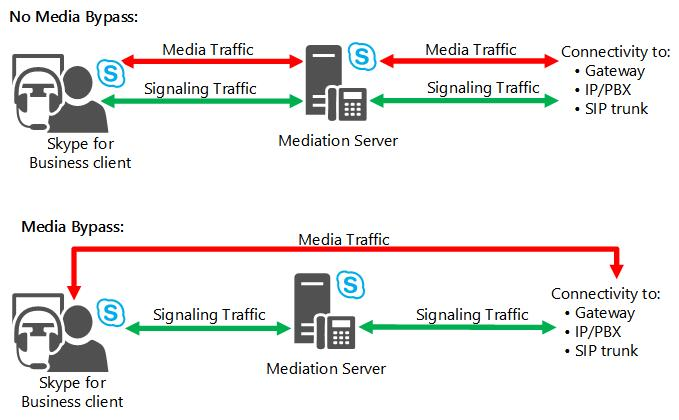

# Pianificare il bypass multimediale in Skype for Business

Decisioni necessarie per la pianificazione del bypass multimediale in Skype for Business Server VoIP aziendale. Include l'interoperabilità con il servizio Controllo di ammissione di chiamata( CAC).

Il termine bypass multimediale indica la rimozione del Mediation Server dal percorso multimediale in tutti i casi possibili per le chiamate con segnale che attraversa il Mediation Server.

Media Bypass consente di migliorare la qualità vocale riducendo la latenza, le conversioni inutili, la possibilità di perdita di pacchetti e il numero di potenziali punti di errore. Può inoltre essere migliorata la scalabilità, in quanto l'eliminazione dell'elaborazione multimediale per le chiamate ignorate consente di ridurre il carico di Mediation Server. Questa riduzione del carico integra la capacità del Mediation Server di controllare più gateway.

 Se un sito di succursale senza Mediation Server è connesso a un sito centrale da uno o più collegamenti WAN con larghezza di banda limitata, il bypass multimediale riduce il requisito di larghezza di banda consentendo ai supporti di un client di un sito di succursale di fluire direttamente al gateway locale senza dover prima passare attraverso il collegamento WAN a un Mediation Server nel sito centrale e di nuovo.

Grazie all'esclusione del Mediation Server dall'elaborazione multimediale, il bypass multimediale può anche ridurre il numero di Mediation Server necessari VoIP aziendale'infrastruttura. In generale, è consigliabile abilitare Media Bypass quando possibile.

Nella figura seguente sono illustrati i percorsi multimediali e di segnalazione di base in topologie con e senza Media Bypass.

**Percorsi multimediali e di segnalazione con e senza Media Bypass**

La funzionalità bypass multimediale è utile se si desidera ridurre il numero dei Mediation Server distribuiti. Un pool Mediation Server viene in genere distribuito in un sito centrale e controlla i gateway nei siti di succursale. Abilitando il bypass multimediale, gli elementi multimediali per chiamate PSTN da client dei siti di succursale possono attraversare direttamente i gateway di tali siti. Skype for Business Server le route delle chiamate in uscita e i criteri VoIP aziendale devono essere configurati correttamente in modo che le chiamate PSTN provenienti dai client di un sito di succursale siano instradati al gateway appropriato.

Nelle reti Wi-Fi in genere si verificano più perdite di pacchetti rispetto alle reti cablate. Il recupero da queste perdite di pacchetti non può solitamente essere supportato dai gateway. Pertanto, è consigliabile valutare la qualità di una rete Wi-Fi prima di stabilire se abilitare il bypass per una subnet wireless. È inoltre necessario valutare il compromesso tra la riduzione della latenza e la perdita di pacchetti. RTAudio, un codec non disponibile per le chiamate che non aggirano il Mediation Server, è più indicato per la gestione della perdita di pacchetti.

## Pianificazione della distribuzione del bypass multimediale

Dopo l'implementazione della struttura di VoIP aziendale, la pianificazione del bypass multimediale è semplice.

- Se si dispone di una topologia centralizzata senza collegamenti WAN ai siti di succursale, è possibile abilitare un bypass multimediale globale, perché non è necessario un controllo capillare.

- Se si dispone di una topologia distribuita costituita da una o più aree di rete e relativi siti di succursale affiliati, verificare quanto segue:

  - Se i peer di Mediation Server sono in grado di supportare le funzionalità necessarie per il bypass multimediale.

  - Quali siti in ogni area di rete sono ben connessi.

  - Quale combinazione di bypass multimediale e controllo di ammissione di chiamata è appropriato per la rete.

Quando si abilita il bypass multimediale, viene generato automaticamente un ID bypass univoco per un'area della rete e per tutti i siti della rete senza vincoli di larghezza di banda nell'ambito di tale area. Ai siti con vincoli di larghezza di banda nell'ambito dell'area e ai siti connessi a tale area tramite collegamenti WAN con vincoli di larghezza di banda vengono assegnati ID di bypass univoci specifici.

Quando un utente effettua una chiamata alla rete PSTN, mediation server confronta l'ID bypass della subnet client con l'ID bypass della subnet gateway. Se i due ID combaciano, per la chiamata viene utilizzato il bypass multimediale. Se gli ID bypass non corrispondono, i supporti per la chiamata devono passare attraverso il Mediation Server.

Quando un utente riceve una chiamata dalla rete PSTN, il client dell'utente confronta l'ID bypass con quello del gateway PSTN. Se i due ID bypass corrispondono, i flussi multimediali vengono flussi multimediali direttamente dal gateway al client, ignorando il Mediation Server.

Solo i client e i dispositivi Lync 2010 o versioni più nuove supportano le interazioni di bypass multimediale con un Mediation Server.

> [!IMPORTANT]
> Oltre che a livello globale, il bypass multimediale deve essere abilitato singolarmente in ogni trunk PSTN. Se il bypass viene abilitato globalmente ma non per un determinato trunk PSTN, non verrà richiamato per le chiamate che coinvolgono questo trunk PSTN. Inoltre, se il bypass multimediale è impostato per l'utilizzo delle informazioni del sito e dell'area geografica, è necessario associare tutte le subnet instradabili ai siti in cui si trovano. Se in un sito sono presenti subnet instradabili per cui non si desidera il bypass, sarà necessario raggruppare queste subnet in un nuovo sito prima di abilitare il bypass multimediale. In questo modo, le subnet non instradabili verranno assegnate a un ID bypass diverso.

## Modalità bypass multimediale

È necessario configurare il bypass multimediale sia a livello globale che per i singoli trunk PSTN. Quando si abilita il bypass multimediale a livello globale, sono disponibili due opzioni, ovvero **Ignora sempre** e **Usa le informazioni del sito e dell'area**.

Come indicato dal nome, **Ignora sempre** indica che verrà tentato di eseguire il bypass per tutte le chiamate PSTN. L'opzione **Ignora sempre** viene utilizzata per le distribuzioni in cui non è necessario abilitare il servizio Controllo di ammissione di chiamata né specificare informazioni di configurazione dettagliate in cui indicare quando tentare di eseguire il bypass multimediale. L'opzione **Ignora sempre** viene utilizzata inoltre quando esiste la connettività completa tra i client e i gateway PSTN. In questa configurazione tutte le subnet sono mappate a un solo ID bypass, calcolato dal sistema.

Con **Utilizza configurazione siti e aree**, l'ID bypass associato alla configurazione dei siti e delle aree viene utilizzato per decidere se eseguire il bypass. Questa configurazione consente di configurare il bypass per le topologie più comuni, poiché offre un controllo granulare su quando eseguire il bypass, oltre a supportare le interazioni con il servizio Controllo di ammissione di chiamata. Il sistema tenta di semplificare l'attività assegnando automaticamente gli ID bypass come indicato di seguito.

- Il sistema assegna automaticamente un singolo ID bypass univoco a ogni area.

- Ogni sito connesso a un'area tramite un collegamento WAN senza vincoli di larghezza di banda eredita lo stesso ID bypass dell'area.

- A un sito associato all'area tramite un collegamento WAN con vincoli di larghezza di banda è assegnato un ID bypass diverso rispetto a quello dell'area.

- Le subnet associate a ogni sito ereditano l'ID bypass del sito.

## Bypass multimediale e controllo di ammissione di chiamata

Il bypass multimediale (o Media Bypass, ovvero la possibilità di ignorare il Mediation Server) e il servizio Controllo di ammissione di chiamata interagiscono per gestire il controllo della larghezza di banda per i supporti di chiamata. Il bypass multimediale facilita il flusso multimediale su buoni collegamenti. Il servizio Controllo di ammissione di chiamata gestisce il traffico sui collegamenti con vincoli di larghezza di banda. Poiché le due funzionalità si escludono a vicenda, è necessario ricordarsi dell'una quando si pianifica l'altra. Sono supportate le combinazioni seguenti:

- Il controllo di ammissione di chiamata e il bypass multimediale sono entrambi abilitati. Il secondo deve essere impostato su **Utilizza configurazione siti e aree**. Tali informazioni sui siti e sulle aree sono le stesse utilizzate per il controllo di ammissione di chiamata.

    Se si abilita il controllo di ammissione di chiamata, non sarà possibile selezionare **Ignora sempre** e viceversa perché le due configurazioni si escludono reciprocamente. In altri termini, solo una delle due funzionalità verrà applicata a una determinata chiamata PSTN. Viene innanzitutto effettuata una verifica per determinare se il bypass multimediale sia applicabile alla chiamata. In caso affermativo, non viene utilizzato il controllo di ammissione di chiamata. Questo comportamento è logico in quanto, se una chiamata è idonea per il bypass, utilizza per definizione una connessione su cui il controllo di ammissione di chiamata non è necessario. Se non è possibile applicare il bypass alla chiamata, ovvero se gli ID di bypass del client e del gateway non corrispondono, il controllo di ammissione di chiamata viene applicato alla chiamata.

- Il controllo di ammissione di chiamata non è abilitato e il bypass multimediale è impostato su **Ignora sempre**.

    In questa configurazione le subnet di client e trunk sono mappate a un solo ID bypass, che viene calcolato dal sistema.

- Il controllo di ammissione di chiamata non è abilitato e il bypass multimediale è impostato su **Utilizza configurazione siti e aree**.

    Se **l'opzione Usa informazioni** sito e area geografica è abilitata, la determinazione del bypass funziona essenzialmente allo stesso modo, indipendentemente dal fatto che il controllo di ammissione di chiamata sia abilitato o meno. In altre informazioni, per qualsiasi chiamata PSTN specifica, la subnet del client viene mappata a un sito specifico e viene estratto l'ID bypass per tale subnet. Analogamente, la subnet del gateway viene mappata a un sito specifico e viene estratto l'ID bypass per tale subnet. Solo se i due ID bypass sono identici verrà ignorato per la chiamata. Se non sono identici, il bypass multimediale non verrà eseguito.

    Anche se il controllo di ammissione di chiamata è disabilitato a livello globale, è necessario definire criteri di larghezza di banda per ogni sito e collegamento se si desidera utilizzare la configurazione dei siti e delle aree per controllare la decisione di applicare o meno il bypass. Il valore effettivo del vincolo di larghezza di banda o la relativa modalità non è importante. Lo scopo finale è avere il sistema che calcola automaticamente ID bypass diversi da associare a impostazioni locali diverse non connesse perfettamente. Se si stabilisce un vincolo di larghezza di banda, significa per definizione che un collegamento non è ben connesso.

- Il controllo di ammissione di chiamata è abilitato e il bypass multimediale non è abilitato. Questa situazione si verifica esclusivamente se tutti i gateway e i sistemi IP-PBX non sono ben connessi o non soddisfano altri requisiti per il bypass multimediale. Per informazioni dettagliate su tali requisiti, vedere [Requirements for Media Bypass](/previous-versions/office/lync-server-2013/lync-server-2013-technical-requirements-for-media-bypass).

## Requisiti tecnici

Per ogni chiamata alla rete PSTN, il Mediation Server determina se i supporti dall'endpoint Skype for Business di origine possono essere inviati direttamente a un peer Mediation Server senza attraversare il Mediation Server. Il peer può essere un gateway PSTN, un IP-PBX o un SBC (Session Border Controller) presso un provider di servizi di telefonia Internet (ITSP) associato al trunk tra il Mediation Server in cui viene instradata la chiamata.

Il bypass multimediale può essere utilizzato quando vengono soddisfatti i requisiti seguenti:

- Un peer Mediation Server deve supportare le funzionalità necessarie per il bypass multimediale, la più importante è la capacità di gestire più risposte con forking (note come "finestre di dialogo iniziali"). Rivolgersi al produttore del gateway o del PBX o al provider di servizi di telefonia Internet per ottenere il numero massimo di dialoghi anticipati accettato da gateway, PBX o SBC.

- Il peer Mediation Server deve accettare il traffico multimediale direttamente Skype for Business endpoint. Molti ITSP consentono al proprio SBC di ricevere traffico solo dal Mediation Server. Contattare il provider ITSP per determinare se il servizio SBC accetta il traffico multimediale direttamente Skype for Business endpoint.

- Skype for Business client e un peer Mediation Server devono essere connessi correttamente, ovvero si trovano nella stessa area di rete o nei siti di rete che si connettono all'area tramite collegamenti WAN senza vincoli di larghezza di banda