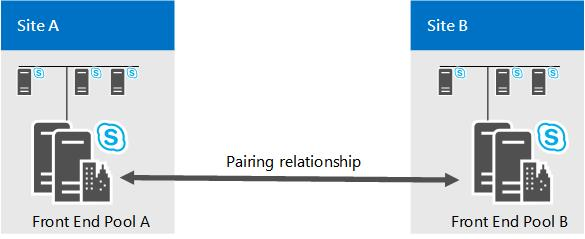

# Ripristino di emergenza del pool Front end in Skype for Business Server
 
Per il ripristino di emergenza, Skype for Business Server offre l'abbinamento del pool con il failover nel caso in cui un pool rientri.
  
Per le opzioni di ripristino di emergenza più robuste in Skype for Business Server, distribuire coppie di pool Front end tra due siti dislocati in aree geografiche diverse. Ogni sito dispone di un pool Front end che è associato a un pool Front End corrispondente nell'altro sito. Entrambi i siti sono attivi e il servizio di backup fornisce la replica dei dati in tempo reale per mantenere sincronizzati i pool. Se si desidera implementare l'abbinamento dei pool Front End, vedere [deploy front end pool associati per il ripristino di emergenza in Skype for Business Server](../../deploy/deploy-high-availability-and-disaster-recovery/front-end-pools-for-disaster-recovery.md) .
  

  
Se il pool in un sito ha esito negativo, è possibile eseguire il failover degli utenti da tale pool al pool nell'altro sito, che quindi serve tutti gli utenti in entrambi i pool. Per la pianificazione della capacità, è consigliabile progettare ogni pool per poter gestire il carico di lavoro di tutti gli utenti in entrambi i pool in caso di emergenza.
  
Due data center che includono pool Front End abbinati tra loro possono essere separati da qualsiasi distanza. È consigliabile associare due data center nella stessa area del mondo, con collegamenti ad alta velocità tra di essi. 
  
L'utilizzo di due Data Center tra le aree del mondo è possibile, ma potrebbe verificarsi una maggiore perdita di dati in caso di emergenza, a causa della latenza nella replica dei dati.
  
Quando si pianificano i pool da associare, è necessario tenere presente che sono supportate solo le associazioni seguenti:
  
- I pool Enterprise Edition possono essere abbinati solo ad altri pool Enterprise Edition. Analogamente, i pool Standard Edition sono abbinabili solo ad altri pool Standard Edition.
    
- I pool fisici possono essere abbinati solo ad altri pool fisici. Analogamente, i pool virtuali sono abbinabili solo ad altri pool virtuali.
    
- I pool associati insieme devono eseguire lo stesso sistema operativo di base.
    
È possibile abbinare due pool in un modo diverso da quanto consigliato sia nel Generatore di topologie sia durante la convalida della topologia. Il Generatore di topologie, ad esempio, consente di abbinare un pool Enterprise Edition a un pool Standard Edition. Tuttavia, questi tipi di abbinamenti non sono supportati.
  
## Backup delle relazioni di registrazione e Survivable Branch Appliance

Oltre ad offrire funzioni di ripristino di emergenza, due pool accoppiati funzionano come registrar di backup l'uno per l'altro. Ogni pool può essere il backup solo per un altro pool Front end.
  
Anche se le relazioni di backup tra due pool Front end devono essere 1:1 e simmetriche, ogni pool Front end può essere sempre anche il servizio di registrazione di backup per un numero qualsiasi di Survivable Branch Appliance.
  
Si noti che Skype for business non estende il supporto per il ripristino di emergenza agli utenti ospitati in un Survivable Branch Appliance. Se un pool Front end che funge da backup per un Survivable Branch Appliance diminuisce, gli utenti che hanno effettuato l'accesso a Survivable Branch Appliance rientrano in modalità di resilienza anche se gli utenti ospitati nel pool Front end non sono riusciti a eseguire il backup del pool Front end.
  
## Tempo di ripristino per il failover del pool e il failback del pool

Per il failover del pool e il failback del pool, la destinazione ingegneristica per l'obiettivo del tempo di ripristino (RTO) è di 15-20 minuti. Questo è il tempo necessario per l'esecuzione del failover, dopo che gli amministratori hanno determinato che si è verificato un errore e che sono state avviate le procedure di failover. Non include il tempo necessario agli amministratori per valutare la situazione e prendere decisioni né quello impiegato dagli utenti per ripetere l'accesso dopo il completamento del failover.
  
Per il failover del pool e il failback del pool, la destinazione ingegneristica per l'obiettivo del punto di ripristino (RPO) è di 5 minuti. Questo valore rappresenta la misura temporale dei dati che potrebbero essere persi a causa dell'emergenza, in virtù della latenza della replica del servizio di backup. Ad esempio, se un pool scende alle 10:00 A.M. e il RPO è di 5 minuti, i dati vengono scritti nel pool tra 9:55 A.M. e 10:00 potrebbe non essere stato replicato nel pool di backup e verrebbe perso.
  
Tutti i numeri degli obiettivi relativi al tempo e al punto di ripristino riportati in questo documento presuppongono che i due data center si trovino nella medesima area geografica con trasporto ad alta velocità e bassa latenza tra i siti. Questi numeri sono misurati per un pool con 40.000 utenti attivi contemporaneamente e 200.000 utenti abilitati per Skype for business rispetto a un modello utente predefinito in cui non è presente alcun backlog nella replica dei dati. Le cifre sono soggette a modifiche a seconda dei test e della convalida delle prestazioni.
  
## Failover dell'archivio di gestione centrale

L'archivio di gestione centrale contiene i dati di configurazione relativi ai server e ai servizi della distribuzione. Ogni distribuzione di Skype for Business Server include un archivio di gestione centrale, ospitato dal server back-end di un pool Front end.
  
Se si associa il pool che ospita l'archivio di gestione centrale, nel pool di backup è configurato un database dell'archivio di gestione centrale di backup. In qualsiasi momento, uno dei due database dell'archivio di gestione centrale è attivo e l'altro è una modalità di standby. Il contenuto viene replicato dal servizio di backup dal database attivo alla modalità standby.
  

  
Durante un failover del pool che include il pool che ospita l'archivio di gestione centrale, è necessario eseguire il failover dell'archivio di gestione centrale prima di eseguire il failback sul pool Front end.
  
Dopo aver ripristinato il disastro, non è necessario eseguire il failover dell'archivio di gestione centrale. L'archivio di gestione centrale può rimanere nel pool a cui è stato eseguito il failover.
  
Gli obiettivi di progettazione per il failover dell'archivio di gestione centrale sono di 5 minuti per l'obiettivo del tempo di ripristino (RTO) e di 5 minuti per l'obiettivo del punto di ripristino (RPO).
  
## Sicurezza dei dati per l'abbinamento del pool Front End

Il servizio di backup trasferisce continuamente i dati degli utenti e il contenuto delle conferenze tra due pool Front End abbinati. I dati dell'utente contengono URI SIP degli utenti, nonché pianificazioni di conferenze, elenchi di contatti e impostazioni. Il contenuto delle conferenze include i caricamenti di Microsoft PowerPoint, così come le lavagne utilizzate nelle conferenze.
  
Dal pool di origine, questi dati vengono esportati dall'archivio locale, zippati e quindi trasferiti nel pool di destinazione, in cui vengono decompressi e importati nello spazio di archiviazione locale. Il Servizio di backup presume che i collegamenti di comunicazione tra i due data center si trovino all'interno di una rete aziendale protetta da Internet. Non crittografa i dati trasferiti tra i due Data Center, né i dati sono incapsulati in modo nativo all'interno di un protocollo sicuro, ad esempio HTTPS. Pertanto, è possibile un attacco man-in-the-Middle da parte di personale interno della rete aziendale.
  
Qualsiasi organizzazione che distribuisce Skype for Business Server su più data center e utilizza la funzionalità di ripristino di emergenza deve garantire che il traffico tra i Data Center sia protetto dalla propria Intranet aziendale. Le aziende che interessano la protezione da attacchi interni devono proteggere i collegamenti di comunicazione tra i Data Center. Si tratta di un requisito standard che consente di Protech anche molti altri tipi di dati sensibili aziendali trasferiti tra i Data Center.
  
Sebbene in un'azienda esista il pericolo di attacchi man-in-the-middle, è relativamente contenuto se paragonato al rischio di esporre il traffico in Internet. In particolare, i dati degli utenti esposti dal servizio di backup (come gli URI SIP) sono in genere disponibili per tutti i dipendenti all'interno della società tramite altri strumenti, ad esempio la Rubrica globale o un altro software di directory. Pertanto, è necessario concentrarsi sulla protezione della WAN tra i due Data Center quando il servizio di backup viene utilizzato per copiare i dati tra i due pool associati.
  
### Attenuazione dei rischi per la sicurezza

Sono disponibili diversi modi per migliorare la protezione della sicurezza per il traffico del servizio di backup. Questa operazione varia da limitare l'accesso ai Data Center per garantire il trasporto WAN tra i due data center. Nella maggior parte dei casi, è possibile che le aziende che distribuiscono Skype for Business Server dispongano già dell'infrastruttura di sicurezza necessaria. Per le aziende alla ricerca di linee guida, Microsoft fornisce una soluzione come esempio di come creare un'infrastruttura IT sicura. Per informazioni dettagliate, vedere [https://go.microsoft.com/fwlink/p/?LinkId=268544](https://go.microsoft.com/fwlink/p/?LinkId=268544) . 
  
Non si presuppone che sia l'unica soluzione, né si presuppone che sia la soluzione preferita per Skype for Business Server. Si consiglia ai clienti aziendali di scegliere la soluzione adatta alle proprie esigenze specifiche, in base all'infrastruttura e ai requisiti di sicurezza IT. Nell'esempio di soluzione Microsoft vengono impiegati IPSec e criteri di gruppo per l'isolamento del server e del dominio.
  
Un'altra possibile soluzione consiste nell'utilizzare IPSec solo per garantire la protezione dei dati inviati dal servizio di backup stesso. Se si sceglie questo metodo, è necessario configurare le regole IPSec per il protocollo SMB per i server seguenti, in cui il pool A e il pool B sono due pool Front End abbinati.
  
- Il servizio SMB (TCP/445) di ogni front end server del pool A nell'archivio file utilizzato dal pool B.
    
- Il servizio SMB (TCP/445) da ogni Front End Server nel pool B all'archivio file utilizzato dal pool A.
    
> [!CAUTION]
>  IPsec non è destinato a essere sostituito per la sicurezza a livello di applicazione, ad esempio SSL/TLS. Un vantaggio dell'utilizzo di IPsec è che può garantire la sicurezza del traffico di rete per le applicazioni esistenti senza dover cambiare. Le aziende che desiderano garantire solo il trasporto tra i due data center devono consultare i rispettivi fornitori di hardware di rete in merito alle modalità di configurazione delle connessioni WAN sicure tramite l'equipaggiamento del fornitore.
  
## Vedere anche

[Distribuire pool Front End abbinati per il ripristino di emergenza in Skype for Business Server](../../deploy/deploy-high-availability-and-disaster-recovery/front-end-pools-for-disaster-recovery.md)
