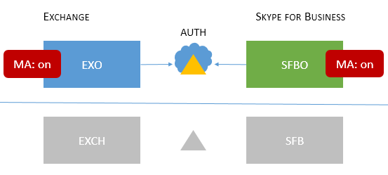

# Topologie di Skype for Business supportate per l'autenticazione modernaSkype for Business topologies supported with Modern Authentication

In questo articolo sono elencate le topologie online e locali supportate con l'autenticazione moderna in Skype for Business, nonché le funzionalità di sicurezza che si applicano a ogni topologia.This article lists what online and on-premises topologies are supported with Modern Authentication in Skype for Business, as well as security features that apply to each topology.

## Autenticazione moderna in Skype for BusinessModern Authentication in Skype for Business

Skype for Business può sfruttare i vantaggi della sicurezza dell'autenticazione moderna.Skype for Business can leverage security advantages of Modern Authentication. Poiché Skype for Business funziona a stretto contatto con Exchange, il comportamento di accesso che gli utenti del client Skype for Business potranno vedere saranno influenzati anche dallo stato ma di Exchange.Because Skype for Business works closely with Exchange, the login behavior Skype for Business client users will see will also be affected by the MA status of Exchange. Ciò si applica anche se si dispone di un ambiente ibrido con dominio diviso di Skype for Business.This will also apply if you have a Skype for Business split-domain hybrid. Si tratta di molte parti in movimento, ma l'obiettivo qui è visualizzare facilmente un elenco delle topologie supportate.That's a lot of moving parts, but the aim here is an easy to visualize list of supported topologies.

Date Skype for Business, Skype for Business online, Exchange Server ed Exchange online, quali topologie sono supportate con MA?Given Skype for Business, Skype for Business online, Exchange Server, and Exchange online, what topologies are supported with MA?

<!--  > [!TIP] > Not sure what Modern Authentication even is? No worries.  This Skype for Business article  4e6a99cd-7859-4062-8a30-5ac79ba36b52  explains it in the first paragraphs. -->

### Topologie ma supportate in Skype for BusinessSupported MA topologies in Skype for Business

Esistono potenzialmente due applicazioni server e due carichi di lavoro di Microsoft 365 o Office 365, coinvolti nelle topologie di Skype for Business usate da MA.There are potentially two server applications, and two Microsoft 365 or Office 365 workloads, involved with Skype for Business topologies used by MA.

- Skype for Business Server (CU 5) localeSkype for Business server (CU 5) on-premises

- Skype for Business online (SFBO)Skype for Business online (SFBO)

- Server Exchange localeExchange server on-premises

- Exchange Server online (EXO)Exchange server online (EXO)

Un'altra parte importante di MA è sapere dove avrà luogo l'autenticazione (authN) e l'autorizzazione (authZ) degli utenti.Another important part of MA is knowing where the authentication (authN) and authorization (authZ) of users will take place. Le due opzioni sono:The two options are:

- Azure AD, online in the Microsoft CloudAzure AD, online in the Microsoft Cloud

- Active Directory Federation Server (ADFS) localeActive Directory Federation Server (ADFS) on-premises

Questo aspetto è simile al seguente, con EXO e SFBO nel cloud con Azure AD e Exchange Server (EXCH) e Skype for Business server (SFB) in locale.So it looks a bit like this, with EXO and SFBO in the Cloud with Azure AD, and Exchange Server (EXCH) and Skype for Business server (SFB) on-prem.

Ecco le topologie supportate.Here are the supported topologies. Tieni presente la chiave per la grafica:Please note the key for the graphics:

- Se l'icona è in grigio o in grigio, non viene utilizzata nello scenario.If the icon is dimmed or grey, it is not used in the scenario.

- EXO è Exchange Online.EXO is Exchange Online.

- SFBO è Skype for Business online.SFBO is Skype for Business Online.

- EXCH è Exchange locale.EXCH is Exchange on-premises.

- SFB è Skype for Business locale.SFB is Skype for Business on-premises.

- I server di autorizzazione sono rappresentati da triangoli, ad esempio, Azure AD è un triangolo con un cloud dietro di esso.Authorizing servers are represented by triangles, for example, the Azure AD is a triangle with a cloud behind it.

- Le frecce puntano al server di autorizzazione che verrà utilizzato quando i client tentano di raggiungere la risorsa server specificata.Arrows point at the authorizing server that will be used when clients try to reach the specified server resource.

Prima di tutto, esamini ma con Skype for Business sia in topologie locali che solo cloud.First, let's cover MA with Skype for Business in both On-premises-only or Cloud-only topologies.

> [!IMPORTANT]
> Sei pronto per configurare l'autenticazione moderna in Skype for Business online?Are you ready to set up Modern Authentication in Skype for Business Online? I passaggi per abilitare questa funzionalità sono [qui](https://social.technet.microsoft.com/wiki/contents/articles/34339.skype-for-business-online-enable-your-tenant-for-modern-authentication.aspx).The steps to enable this feature are right [here](https://social.technet.microsoft.com/wiki/contents/articles/34339.skype-for-business-online-enable-your-tenant-for-modern-authentication.aspx).

|Nome topologiaTopology name    |EsempioExample    |DescrizioneDescription    |SupportatoSupported    |
|:-----|:-----|:-----|:-----|
|Solo cloudCloud only    |Utenti ospitati/cassette postali: onlineUsers homed/mailboxes located: Online    |MA è disponibile sia per EXO che per SFBO.MA is on for both EXO and SFBO.    Di conseguenza, il server di autorizzazione è Azure AD.Therefore, the authorization server is Azure AD.    |Autenticazione a più fattori (MFA), Autenticazione basata su certificato client (CBA), Accesso condizionale (CA)/Gestione applicazioni mobili (MAM) con Intune.Multi-factor authentication (MFA), Client-certificate based authentication (CBA), Conditional Access (CA)/Mobile Application Management (MAM) with Intune. \*\*    |
|Solo in base all'utenteOn-prem only    |Utenti ospitati/cassette postali situati: localeUsers homed/mailboxes located: On-premises    |Ma è per SFB locale.MA is on for SFB on-premises.    Di conseguenza, il server di autorizzazione è ADFS.Therefore, the authorization server is ADFS.    Per informazioni dettagliate sulla configurazione, vedere [questo articolo.](/microsoft-365/enterprise/hybrid-modern-auth-overview)For configuration details, please see [this article.](/microsoft-365/enterprise/hybrid-modern-auth-overview)   |MFA (solo Desktop di Windows: i client mobili non sono supportati).MFA (Windows Desktop only - mobile clients are not supported). Nessuna funzionalità di integrazione di Exchange.No Exchange integration features.   
 **Questo approccio non è consigliato. Vedere qui:**[https://aka.ms/ModernAuthOverview](/microsoft-365/enterprise/hybrid-modern-auth-overview)**We do not recommend this approach. Please see here:** [https://aka.ms/ModernAuthOverview](/microsoft-365/enterprise/hybrid-modern-auth-overview)
 |

> [!IMPORTANT]
> Per ridurre il numero di richieste, è consigliabile che lo stato ma sia lo stesso in Skype for Business ed Exchange (e nelle rispettive controparti online).It's recommended that the MA state be the same across Skype for Business and Exchange (and their online counterparts) to reduce the number of prompts.

Le topologie miste implicano combinazioni di ibridi con dominio diviso SFB.Mixed topologies involve combinations of SFB split-domain hybrids. Di seguito sono descritte le topologie miste attualmente supportate:These are the Mixed topologies currently supported:

|Nome topologiaTopology name    |EsempioExample    |DescrizioneDescription    |SupportatoSupported    |
|:-----|:-----|:-----|:-----|
|Misto 1Mixed 1    |             Utenti ospitati/cassette postali situati: EXO e SFBUsers homed/mailboxes located: EXO and SFB    |Ma non è abilitato per SFB; nessuna funzionalità di GESTIONE SFB disponibile in questa topologia.MA is not enabled for SFB; no SFB MA features available in this topology.    |Nessuna funzionalità di gestione per SFB.No MA features for SFB.    |
|Misto 2Mixed 2    |             Utenti ospitati/cassette postali situati: EXCH e SFBOUsers homed/mailboxes located: EXCH and SFBO    |Ma è solo per SFBO.MA is on for SFBO only. Il server di autorizzazione è Azure AD per gli utenti ospitati in SFBO, ma AD per EXCH locale.The authorization server is Azure AD for users homed in SFBO, but AD for EXCH on-premises.    |MFA, CBA, CA/MAM con Intune.\*MFA, CBA, CA/MAM with Intune.\*    |
|Misto 3Mixed 3    |             Utenti ospitati/cassette postali situati: EXO + SFB o EXCH + SFBUsers homed/mailboxes located: EXO + SFB, or EXCH + SFB    |Nessuna funzionalità di GESTIONE SFB disponibile in questa topologiaNo SFB MA features available in this topology    |Nessuna funzionalità di gestione per SFB.No MA features for SFB.    |
|Misto 4Mixed 4    |             Utenti ospitati/cassette postali situati: EXCH +SFBO o EXCH + SFBUsers homed/mailboxes located: EXCH +SFBO or EXCH + SFB    |Ma è per SFBO, quindi il server di autorizzazione è Azure AD per gli utenti ospitati in SFBO.MA is on for SFBO, therefore the authorization server is Azure AD for users homed in SFBO. Gli utenti locali in SFB ed EXO utilizzano AD.On-prem users in SFB and EXO use AD.    |MFA, CBA, CA/MAM con Intune solo per gli utenti online.\*MFA, CBA, CA/MAM with Intune for online users only.\*    |
|Misto 5Mixed 5    |             Utenti ospitati/cassette postali situati: EXO + SFBO, EXO + SFB, EXCH + SFBO o EXCH + SFBUsers homed/mailboxes located: EXO + SFBO, EXO + SFB, EXCH + SFBO, or EXCH + SFB    |Ma è in esecuzione sia in EXO che in SFBO, pertanto il server di autorizzazione è Azure AD per gli utenti ospitati in SFBO; Gli utenti locali in EXCH e SFB usano AD.MA is on in both EXO and SFBO, therefore the authorization server is Azure AD for users homed in SFBO; on-prem users in EXCH and SFB use AD.    |MFA, CBA, CA/MAM con Intune solo per gli utenti online.\*MFA, CBA, CA/MAM with Intune for online users only.\*    |
|Misto 6Mixed 6    |             Utenti ospitati/cassette postali situati: EXO + SFBO, EXO + SFB, EXCH + SFBO o EXCH + SFBUsers homed/mailboxes located: EXO + SFBO, EXO + SFB, EXCH + SFBO, or EXCH + SFB    |Ma è ovunque, quindi il server di autorizzazione è Azure AD per tutti gli utenti.MA is on everywhere, therefore the authorization server is Azure AD for all users. (online e locale)(online and on-premises)     Vedere la [https://aka.ms/ModernAuthOverview](/microsoft-365/enterprise/hybrid-modern-auth-overview) procedura di distribuzione.Please see [https://aka.ms/ModernAuthOverview](/microsoft-365/enterprise/hybrid-modern-auth-overview) for deployment steps.   |MFA, CBA e CA/MAM (tramite Intune) per tutti gli utenti.MFA, CBA and CA/MAM (via Intune) for all users.    |

\* - MFA include Windows Desktop, MAC, iOS, dispositivi Android e Windows Phone; CBA include dispositivi Windows Desktop, iOS e Android; CA/MAM con Intune, include dispositivi Android e iOS.\* - MFA includes Windows Desktop, MAC, iOS, Android devices, and Windows Phones; CBA includes Windows Desktop, iOS and Android devices; CA/MAM with Intune, includes Android and iOS devices.

> [!IMPORTANT]
> È molto importante notare che gli utenti possono visualizzare più richieste **in** alcuni casi, in particolare quando lo stato di Ma non è lo stesso per tutte le risorse del server che potrebbero essere necessarie e richieste dai client, come nel caso di tutte le versioni delle topologie miste.It's very important to note that users may see **multiple prompts** in some cases, notably where the MA state is not the same across all the server resources that clients may need and request, as is the case with all versions of the Mixed topologies.

> [!IMPORTANT]
> Si noti inoltre che in alcuni casi (mixed 1, 3 e 5 in particolare) è necessario impostare una chiave del Registro di sistema [AllowADALForNonLyncIndependentOfLync](https://support.microsoft.com/help/3082803/info-about-the-allowadalfornonlyncindependentoflync-setting-in-skype-for-business,-lync-2013,-and-exchange-online) per la configurazione appropriata per i client Desktop Windows.Also note that in some cases (Mixed 1, 3, and 5 specifically) an [AllowADALForNonLyncIndependentOfLync](https://support.microsoft.com/help/3082803/info-about-the-allowadalfornonlyncindependentoflync-setting-in-skype-for-business,-lync-2013,-and-exchange-online) registry key must be set for proper configuration for Windows Desktop Clients.