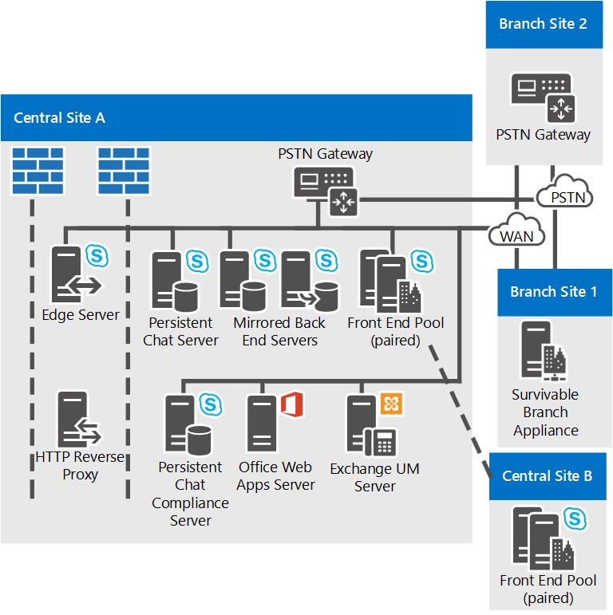

# Topologie di riferimento per Skype for Business Server

Topologie di riferimento per Skype for Business Server, inclusi diagrammi e decisioni da prendere per organizzazioni di grandi, medie e piccole dimensioni.

La migliore topologia di Skype for Business Server dipende dalle dimensioni dell'organizzazione, dai carichi di lavoro che si desidera distribuire e dalle preferenze per la disponibilità elevata e il costo dell'investimento.

In questa sezione vengono descritte tre topologie di riferimento di esempio, inclusa la motivazione alla base di molte delle decisioni prese in ogni topologia.

## Topologia di riferimento per un'organizzazione di piccole dimensioni

La topologia di riferimento per le organizzazioni di piccole dimensioni mostra come distribuire una soluzione affidabile e a disponibilità elevata distribuendo solo tre server che eseguono Skype for Business Server.

**Topologia di riferimento per organizzazioni di piccole dimensioni**

- **Coppia di server Standard Edition distribuiti** Questa organizzazione ha 4.000 utenti nel sito centrale. Hanno distribuito due server Standard Edition e li hanno accoppiati per abilitare la disponibilità elevata e il ripristino di emergenza. Ogni server contiene 2.000 utenti, ma le informazioni su tutti gli utenti vengono sincronizzate tra i due server. In caso di problemi, un amministratore può eseguire il failover di tali utenti in modo che siano serviti dall'altro server, con un minimo disagi per gli utenti. Per ulteriori informazioni sulle funzionalità di disponibilità elevata e ripristino di emergenza in Skype for Business Server, vedere Pianificare la disponibilità elevata e il ripristino di emergenza [in Skype for Business Server.](../../plan-your-deployment/high-availability-and-disaster-recovery/high-availability-and-disaster-recovery.md)

- **È consigliata la distribuzione di un server perimetrale.** Anche se non è necessario distribuire un server perimetrale per la messaggistica istantanea interna, la presenza e le conferenze, è consigliabile utilizzarne uno persino per le distribuzioni di piccole dimensioni. È possibile ottimizzare l'investimento in Skype for Business Server distribuendo un server perimetrale per fornire il servizio agli utenti attualmente esterni ai firewall dell'organizzazione. Tra i vantaggi derivanti dall'utilizzo di server perimetrali sono inclusi i seguenti:

  - Gli utenti dell'organizzazione possono usare le funzionalità di Skype for Business Server, se lavorano da casa o sono fuori strada.

  - Gli utenti possono invitare utenti esterni a partecipare alle riunioni.

  - Se si dispone di un'organizzazione partner, fornitore o cliente che utilizza anche Skype for Business Server, è possibile creare una relazione federata con tale organizzazione. La distribuzione di Skype for Business Server riconoscerebbe quindi gli utenti di tale organizzazione federata, migliorando la collaborazione.

  - Gli utenti possono scambiare messaggi istantanei con gli utenti di alcuni servizi di messaggistica istantanea pubblici.

- **Funzionamento garantito per i siti di succursale.** Questa organizzazione esegue un programma pilota della funzionalità VoIP aziendale di Skype for Business Server. Alcuni utenti usano Skype for Business Server come unica soluzione vocale. Alcune di queste VoIP aziendale utenti pilota si trovano nel sito di succursale. Il sito di succursale non dispone di un collegamento WAN (Wide Area Network) affidabile al sito centrale, pertanto in tale sito viene distribuito un Survivable Branch Appliance. Con questa distribuzione, se il collegamento WAN si ferma, gli utenti del sito di succursale possono comunque effettuare e ricevere chiamate (sia chiamate all'interno dell'organizzazione che chiamate PSTN), disporre della funzionalità di segreteria telefonica e comunicare con la messaggistica istantanea tra due parti. Gli utenti possono inoltre essere autenticati anche quando il collegamento WAN non è disponibile. Per ulteriori informazioni, vedere [Pianificare VoIP aziendale resilienza in Skype for Business Server.](../../plan-your-deployment/enterprise-voice-solution/enterprise-voice-resiliency.md)

- **Distribuzione di Messaggistica unificata di Exchange.** Questa topologia di riferimento include un server Messaggistica unificata di Exchange, che esegue Microsoft Exchange Server, non Skype for Business Server.

- **Server Office Web Apps.** È consigliabile distribuire un server Office Web Apps o una farm di server Office Web Apps in tutte le organizzazioni che utilizzano le conferenze Web. Il server Office Web Apps consente la presentazione delle diapositive di PowerPoint in conferenze Web.

## Topologia di riferimento per un'organizzazione di medie dimensioni

La topologia di riferimento con disponibilità elevata e un solo data center è specifica per un'organizzazione di piccole-medie dimensioni con un unico sito centrale. La topologia esatta nel diagramma seguente è per un'organizzazione di 20.000 utenti.

**Topologia di riferimento per organizzazioni di medie dimensioni**

- **Supporto di più utenti aggiungendo più Front End Server.** La topologia esatta in questo diagramma include tre Front End Server per fornire supporto per 20.000 utenti. Se si dispone di un singolo sito centrale e di un numero maggiore di utenti, è sufficiente aggiungere altri Front End Server al pool. Il numero massimo di utenti per pool è 80.000, con 12 Front End Server.

    Tuttavia, la topologia a sito singolo può supportare un numero ancora maggiore di utenti aggiungendo un altro pool Front End al sito.

- **È possibile aggiungere il ripristino di emergenza.** Per questa organizzazione, la disponibilità elevata per i servizi di Skype for Business Server è una funzionalità necessaria, ma non il ripristino di emergenza. Il pool di Front End Server distribuiti offre disponibilità elevata.

    Se desideravano aggiungere funzionalità di ripristino di emergenza, potevano prendere in considerazione la creazione di un altro datacenter e l'aggiunta di un altro pool Front End e l'associazione con il pool Front End nel datacenter corrente. Quindi, se si verifica un'emergenza che influisce sul pool principale, gli amministratori possono eseguire il failover degli utenti nel pool di backup.

- **I server back-end sono con mirroring** Per garantire una maggiore disponibilità per le funzionalità utente di base, l'organizzazione ha distribuito una coppia di server back-end con mirroring per ogni pool Front End.

- **Opzioni di database del Monitoring Server.** Questa organizzazione ha distribuito il monitoraggio per garantire la qualità VoIP aziendale chiamate e conferenze audio/video. Il monitoraggio viene distribuito in ogni Front End Server e il database di monitoraggio è collocato con i server back-end. Sono inoltre supportate le topologie in cui il database di monitoraggio si trova in un server separato.

- **Disponibilità elevata dei server perimetrali** In questo esempio l'organizzazione con 20.000 utenti è sufficiente un solo server perimetrale per le prestazioni. Tuttavia, hanno distribuito un pool di due server perimetrali distribuiti per fornire disponibilità elevata.

- **Opzioni di distribuzione del sito di succursale.** Nell'organizzazione di questa topologia è distribuito VoIP aziendale come soluzione vocale. Il sito di succursale 1 non dispone di un collegamento WAN (Wide Area Network) resiliente al sito centrale, pertanto dispone di un Survivable Branch Appliance distribuito per mantenere molte funzionalità di Skype for Business Server nel caso in cui il collegamento WAN al sito centrale si insedi. Nel Sito di succursale 2 invece è presente un collegamento WAN resiliente e pertanto è necessario solo un gateway PSTN (Public Switched Telephone Network). Poiché il gateway PSTN distribuito supporta il bypass multimediale, non sono necessari Mediation Server nel Sito di succursale 2. Per ulteriori informazioni, vedere [Pianificare VoIP aziendale resilienza in Skype for Business Server.](../../plan-your-deployment/enterprise-voice-solution/enterprise-voice-resiliency.md)

- **Bilanciamento del carico DNS.** Nel pool Front End e nel pool di server perimetrali è distribuito il bilanciamento del carico DNS per il traffico SIP. In questo modo si evita di dover utilizzare dispositivi di bilanciamento del carico hardware per i server perimetrali, riducendo in modo significativo le attività di configurazione e manutenzione dei dispositivi di bilanciamento del carico hardware per gli altri pool, poiché i dispositivi di bilanciamento del carico hardware sono necessari solo per il traffico HTTP. Per ulteriori informazioni, vedere [Bilanciamento del carico DNS.](../../plan-your-deployment/network-requirements/load-balancing.md#BKMK_DNSLoadBalancing)

- **Distribuzione di Messaggistica unificata di Exchange.** Questa topologia di riferimento include un server Messaggistica unificata di Exchange, che esegue Microsoft Exchange Server, non Skype for Business Server.

- **Server Office Web Apps.** È consigliabile distribuire un server Office Web Apps o una farm di server Office Web Apps in tutte le organizzazioni che utilizzano le conferenze Web. Il server Office Web Apps consente la presentazione delle diapositive di PowerPoint in conferenze Web.

- **È possibile aggiungere director.** Se l'organizzazione desidera aumentare la sicurezza contro gli attacchi Denial of Service, può anche distribuire un pool di Director. Un Director è un ruolo del server facoltativo separato in Skype for Business Server che non ospita account utente o fornisce servizi di presenza o conferenza. Funge da server dell'hop successivo interno a cui un server perimetrale instrada il traffico SIP in ingresso destinato ai server interni. Il Director prea autentica le richieste in ingresso e le reindirizza al pool principale o al server dell'utente. La pre-autenticazione nel Director consente di eliminare le richieste dagli account utente sconosciuti alla distribuzione. Un Director consente di isolare i Front End Server da traffico dannoso, ad esempio attacchi Denial of Service (DoS). Se la rete è invasa da traffico esterno non valido in un attacco di questo tipo, il traffico termina nel Director.

- **È consigliabile utilizzare System Center Operations Manager.** È consigliabile monitorare l'integrità della distribuzione di Skype for Business Server per garantire la disponibilità del servizio per gli utenti finali. È possibile utilizzare il Management Pack di System Center Operations Manager per Skype for Business disponibile come download gratuito da Microsoft. Con Skype for Business Management Pack, è possibile ricevere avvisi in tempo reale quando si verificano problemi, eseguire transazioni sintetiche per testare le funzionalità end-to-end di Skype for Business, ottenere report sulla disponibilità del servizio e così via. In questo modo è possibile rispondere in modo proattivo ai problemi relativi alla distribuzione prima che gli utenti finali li verifichino.

## Topologia di riferimento per un'organizzazione di grandi dimensioni

La topologia di riferimento per un'organizzazione di grandi dimensioni con più data center supportati è per qualsiasi dimensione dell'organizzazione con più di un sito centrale. La topologia esatta nel diagramma seguente è per un'organizzazione di 50.000 utenti, con 20.000 utenti nel sito centrale A, 20.000 nel sito centrale B e un totale di 10.000 nel sito centrale C e nei siti di succursale. Il tipo di topologia illustrato in questo diagramma può supportare le organizzazioni con un numero qualsiasi di utenti.

Oltre alla disponibilità elevata fornita dai pool di Front End Server, questa topologia aggiunge il supporto per il ripristino di emergenza. I pool Front End nei siti centrali A e B sono abbinati. Se uno di questi pool non è più in funzione, l'amministratore può spostare i servizi per gli utenti interessati nel pool associato nel sito non interessato.

Questa topologia è illustrata in più diagrammi, con una panoramica seguita da visualizzazioni dettagliate dei siti centrali.

**Panoramica della topologia di riferimento per organizzazioni di grandi dimensioni con più data center**

**Topologia di riferimento per organizzazioni di grandi dimensioni: visualizzazione dettagliata del sito centrale A**

**Topologia di riferimento per organizzazioni di grandi dimensioni: visualizzazione dettagliata del sito centrale B**

**Topologia di riferimento per organizzazioni di grandi dimensioni: visualizzazione dettagliata del sito centrale C**

- **I pool Front End sono associati per abilitare il ripristino di emergenza.** I pool Front End nel sito A e nel sito B sono abbinati tra loro per fornire il supporto per il ripristino di emergenza. Se si verifica un errore nel pool di un sito, l'amministratore può eseguire il failover degli utenti da tale sito al pool Front End associato nell'altro sito, con un minimo di interruzione del servizio per gli utenti. Ognuno di questi due pool Front End dispone di sei server, sufficienti per tutti i 40.000 utenti in entrambi i pool in caso di failover. Per ulteriori informazioni, vedere [Pianificare la disponibilità elevata e il ripristino di emergenza in Skype for Business Server.](../../plan-your-deployment/high-availability-and-disaster-recovery/high-availability-and-disaster-recovery.md)

- **I server back-end sono con mirroring** Per garantire una maggiore disponibilità per le funzionalità utente di base, l'organizzazione ha distribuito una coppia di server back-end con mirroring per ogni pool Front End. Si tratta di una topologia facoltativa ed è possibile scegliere di distribuire un singolo server back-end. SQL sono supportati anche il clustering e i gruppi di disponibilità AlwaysOn. Per ulteriori informazioni, vedere [Disponibilità elevata del server back-end in Skype for Business Server.](../../plan-your-deployment/high-availability-and-disaster-recovery/back-end-server.md)

- **Utilizzo del server Standard Edition in un sito di succursale.** Questa organizzazione considera il sito C come un sito di succursale perché ha solo 600 dipendenti. Tuttavia, gli utenti hanno molte conferenze audio/video tra loro. Se è stato distribuito in Skype for Business Server come sito di succursale, i supporti per queste conferenze verrebbero eseguiti nella rete WAN (Wide Area Network) da e verso un sito centrale in cui è distribuito un Front End Server. Per evitare questo potenziale carico di larghezza di banda, hanno installato una coppia di server Standard Edition in questo sito, che ospiteranno queste conferenze. Poiché i server Standard Edition sono installati in tale posizione, Skype for Business Server lo considera per definizione un sito centrale e viene considerato come tale in Generatore di topologie e nello strumento di pianificazione.

    Un solo server Standard Edition sarebbe sufficiente per le prestazioni, ma l'organizzazione ne ha distribuiti due e li ha accoppiati per fornire disponibilità elevata in caso di problemi di un server.

    Sebbene il sito C sia considerato un sito centrale, non è necessario distribuire i server perimetrali in tale sito. In questo esempio, il sito C utilizzerà i server perimetrali distribuiti nel sito A.

- **Monitoraggio e archiviazione** Questa organizzazione ha distribuito sia il monitoraggio che l'archiviazione. Quando si distribuisce il monitoraggio o l'archiviazione, questo viene eseguito in ogni Front End Server. I database per queste funzionalità possono essere collocati nel database back-end o in un server separato. Questa organizzazione ha collocato questi database in un server separato dai server back-end, nel sito centrale B. I database ricevono i dati di monitoraggio e archiviazione dai Front End Server in tutti i siti.

- **Opzioni di distribuzione del sito di succursale.** Questa organizzazione ha in realtà più di 50 siti di succursale, solo due dei quali sono illustrati nei diagrammi dettagliati. Il sito di succursale 1 non dispone di un collegamento WAN resiliente al sito centrale, pertanto dispongono di Survivable Branch Appliance distribuiti per fornire il servizio telefonico nel caso in cui il collegamento WAN al sito centrale si insedi. Il sito di succursale 2 dispone tuttavia di un collegamento WAN resiliente, pertanto richiede solo un gateway PSTN (Public Switched Telephone Network). Poiché il gateway PSTN distribuito supporta il bypass multimediale, non sono necessari Mediation Server nel Sito di succursale 2. Per informazioni dettagliate su come decidere cosa installare in un sito di succursale, vedere Pianificare VoIP aziendale [resilienza in Skype for Business Server.](../../plan-your-deployment/enterprise-voice-solution/enterprise-voice-resiliency.md)

- **Trunking SIP e Mediation Server.** Si noti che nel sito centrale B il Mediation Server non è collocato con i Front End Server. Ciò è dovuto al fatto che il Mediation Server autonomo è consigliato per i siti che utilizzano il trunking SIP. Nella maggior parte degli altri casi, è consigliabile collocare Mediation Server con Front End Server. Per informazioni dettagliate sulle topologie di Mediation Server, vedere [Components and Topologies for Mediation Server](https://technet.microsoft.com/library/71397168-36c3-4d21-b8ef-db6a751634ee.aspx) nella documentazione relativa alla pianificazione.

- **Persistent Chat distribuita.** Questa organizzazione ha distribuito i server necessari per abilitare Persistent Chat. Sono stati distribuiti più Front End Server di Chat persistente per gestire il carico per il numero di utenti nel pool e per fornire disponibilità elevata. Ha inoltre distribuito la conformità per Persistent Chat e ha individuato l'archivio chat persistente e l'archivio di conformità di Persistent Chat in server separati. Questi archivi possono essere collocati e persino collocati con il server back-end, ma questa organizzazione ha scelto di separarli per garantire prestazioni migliori.

    > [!NOTE]
    > La chat persistente è disponibile in Skype for Business Server 2015, ma non è più supportata in Skype for Business Server 2019. Le stesse funzionalità sono disponibili in Teams. Per altre informazioni, vedere [Introduzione all'aggiornamento di Microsoft Teams.](/microsoftteams/upgrade-start-here) Se è necessario usare Chat persistente, è possibile eseguire la migrazione degli utenti che richiedono questa funzionalità a Teams o continuare a usare Skype for Business Server 2015.

- **Bilanciamento del carico DNS.** Il pool Front End e il pool di server perimetrali utilizzano il bilanciamento del carico DNS. In questo modo si elimina la necessità di servizi di bilanciamento del carico hardware per l'interfaccia interna dei server perimetrali e si riduce notevolmente la quantità di tempo da dedicare alla configurazione e alla manutenzione dei servizi di bilanciamento del carico hardware per gli altri pool, poiché i servizi di bilanciamento del carico hardware sono necessari solo per il traffico HTTP. Per ulteriori informazioni, vedere (.. /.. /plan-your-deployment/network-requirements/load-balancing.md#BKMK_DNSLoadBalancing).

- **Distribuzione di Messaggistica unificata di Exchange.** Skype for Business Server funziona sia con le distribuzioni locali della messaggistica unificata di Exchange che con la messaggistica unificata di Exchange ospitata. Il sito centrale A include un server Messaggistica unificata di Exchange, che esegue Microsoft Exchange Server, non Skype for Business Server. La funzionalità di messaggistica unificata di Exchange per Skype for Business Server viene eseguita nel pool Front End.

    Il sito centrale B utilizza Exchange ospitato, quindi viene ospitata anche la funzionalità del server Messaggistica unificata di Exchange.

    Per informazioni dettagliate sulla messaggistica unificata di Exchange, vedere [On-Premises Exchange Unified Messaging Integration](https://technet.microsoft.com/library/e7c63a71-2d99-4aa9-b649-36c1a431bdf1.aspx) and [Hosted Exchange Unified Messaging Integration](https://technet.microsoft.com/library/f4de0165-da3b-499e-98fc-28ddd0db02d5.aspx) nella documentazione relativa alla pianificazione.

- **Server Office Web Apps.** È consigliabile distribuire un server Office Web Apps o una farm di server Office Web Apps in tutte le organizzazioni che utilizzano le conferenze Web. È possibile distribuire una singola farm di server Office Web Apps in un sito che serve il traffico da tutti i siti oppure distribuirla in ogni sito. Il server Office Web Apps consente la presentazione delle diapositive di PowerPoint in conferenze Web.

- **È possibile aggiungere director.** Se l'organizzazione desidera aumentare la sicurezza contro gli attacchi Denial of Service, può anche distribuire un pool di Director. Un Director è un ruolo del server facoltativo separato in Skype for Business Server che non ospita account utente o fornisce servizi di presenza o conferenza. Funge da server dell'hop successivo interno a cui un server perimetrale instrada il traffico SIP in ingresso destinato ai server interni. Il Director prea autentica le richieste in ingresso e le reindirizza al pool principale o al server dell'utente. La pre-autenticazione nel Director consente di eliminare le richieste dagli account utente sconosciuti alla distribuzione. Un Director consente di isolare i Front End Server da traffico dannoso, ad esempio attacchi Denial of Service (DoS). Se la rete è invasa da traffico esterno non valido in un attacco di questo tipo, il traffico termina nel Director.

- **È consigliabile utilizzare System Center Operations Manager.** È consigliabile monitorare l'integrità della distribuzione di Skype for Business Server per garantire la disponibilità del servizio per gli utenti finali. È possibile utilizzare il Management Pack di System Center Operations Manager per Skype for Business disponibile come download gratuito da Microsoft. Con Skype for Business Management Pack, è possibile ricevere avvisi in tempo reale quando si verificano problemi, eseguire transazioni sintetiche per testare le funzionalità end-to-end di Skype for Business, ottenere report sulla disponibilità del servizio e così via. In questo modo è possibile rispondere in modo proattivo ai problemi relativi alla distribuzione prima che gli utenti finali li verifichino.

