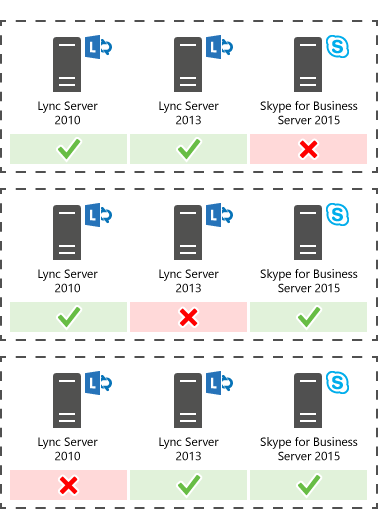

# Pianificare l'aggiornamento a Skype for Business Server 2015
 
Riepilogo: informazioni sugli aspetti da considerare quando si pianifica un aggiornamento a Skype for Business Server 2015. Scaricare una versione di valutazione gratuita di Skype for Business Server 2015 dal Centro di valutazione Microsoft all'indirizzo: [https://www.microsoft.com/evalcenter/evaluate-skype-for-business-server](https://www.microsoft.com/evalcenter/evaluate-skype-for-business-server).
  
Nell'ambito del piano di aggiornamento a Skype for Business Server 2015, utilizzare questo argomento per comprendere i percorsi di aggiornamento consigliati a Skype for Business Server 2015, il funzionamento dell'aggiornamento di In-Place, gli scenari di coesistenza supportati e l'aspetto del processo di aggiornamento.

> [!NOTE]
> Gli aggiornamenti sul posto erano disponibili Skype for Business Server 2015, ma non sono più supportati in Skype for Business Server 2019. La coesistenza affiancata è supportata, vedere [Migration to Skype for Business Server 2019](../../SfBServer2019/migration/migration-to-skype-for-business-server-2019.md) per ulteriori informazioni.
  
## Percorsi di aggiornamento consigliati Skype for Business Server 2015

 Per eseguire l'aggiornamento da Lync Server 2013, Lync Server 2010 o Office Communications Server 2007 R2 a Skype for Business Server 2015, utilizzare i percorsi di aggiornamento seguenti:
  
> [!CAUTION]
> In-Place aggiornamento sposta automaticamente le directory conferenze da Lync Server 2013 a Skype for Business Server 2015. Tuttavia, se si prevede di spostare manualmente le directory conferenze, è molto importante utilizzare Skype for Business Server 2015 Management Shell. Se si tenta di utilizzare Lync Server 2013 Management Shell per spostare le directory conferenze da Lync Server 2013 a Skype for Business Server 2015, può verificarsi una perdita di dati. In generale, ogni volta che si utilizza Skype for Business Server 2015 in qualsiasi capacità, è consigliabile utilizzare il set di strumenti Skype for Business Server 2015.  
  
|**Versione**|**Raccomandazioni**|
|:-----|:-----|
|Lync Server 2013    | Per eseguire l'aggiornamento, utilizzare Skype for Business Server Generatore di topologie e la nuova funzionalità di aggiornamento In-Place in ognuno dei server associati al pool. per la procedura dettagliata, vedere Plan [to upgrade from Lync Server 2013 to Skype for Business Server 2015](upgrade.md#BKMK_PlanUpgradeFromLync2013) e [Upgrade to Skype for Business Server 2015](../deploy/upgrade-to-skype-for-business-server.md).   |
|Lync Server 2010 + Lync Server 2013 (modalità doppia)    |Prima di tutto, eseguire l'aggiornamento a Lync Server 2013 e quindi a Skype for Business Server 2015 utilizzando la nuova funzionalità In-Place aggiornamento. Tuttavia, se la topologia è lync server 2010 principale, è anche possibile eseguire il rollback dei componenti di Lync Server 2013 in Lync Server 2010 e quindi eseguire l'aggiornamento direttamente a Skype for Business Server 2015. In questo caso, non sarebbe possibile sfruttare In-Place Upgrade e utilizzare una coesistenza diretta tra Lync Server 2010 e Skype for Business Server 2015. La triesistenza non è supportata, ma è supportata la coesistenza.    |
|Lync Server 2010    |Visualizzare un nuovo pool Skype for Business Server 2015 e quindi eseguire la migrazione degli utenti a questo nuovo pool. È quindi possibile rimuovere le autorizzazioni del pool di Lync Server 2010 precedente. L'aggiornamento da Lync Server 2010 a Skype for Business Server 2015 è simile all'aggiornamento da Lync Server 2010 a Lync Server 2013. Vedere [Migrazione da Lync Server 2010 a Lync Server 2013](/previous-versions/office/lync-server-2013/migration-from-lync-server-2010-to-lync-server-2013).    |
|Office Communications Server 2007 R2    | Scegliere una delle due opzioni seguenti:    Configurare un nuovo ambiente Skype for Business Server 2015.    In caso contrario, se l'hardware e il software soddisfano i requisiti per Skype for Business Server 2015, eseguire l'aggiornamento a Lync Server 2013 e quindi eseguire l'aggiornamento a Skype for Business Server 2015 utilizzando la nuova funzionalità di aggiornamento di In-Place. Per ulteriori informazioni, vedere [Server requirements for Skype for Business Server 2015](requirements-for-your-environment/server-requirements.md) e [Migration from Office Communications Server 2007 R2 to Lync Server 2013](/previous-versions/office/lync-server-2013/migration-from-office-communications-server-2007-r2-to-lync-server-2013).    |
   
> [!NOTE]
> SQL Server 2014 è supportato in Skype for Business Server 2015, ma non è supportato in Lync Server 2013. Se si desidera eseguire l'aggiornamento da SQL Server 2012 a SQL Server 2014, il pool deve prima essere aggiornato a Skype for Business Server 2015 utilizzando il metodo di aggiornamento di In-Place come descritto in questo documento. È quindi possibile eseguire l'aggiornamento da SQL Server 2012 a SQL Server 2014, vedere [Upgrade to SQL Server 2014](/sql/database-engine/install-windows/upgrade-sql-server?viewFallbackFrom=sql-server-2014). Per ulteriori informazioni sui requisiti del database, vedere [Server requirements for Skype for Business Server 2015](requirements-for-your-environment/server-requirements.md). 
  
## Pianificare l'aggiornamento da Lync Server 2013 a Skype for Business Server 2015

È possibile aggiornare i sistemi Lync Server 2013 a Skype for Business Server 2015 utilizzando la nuova In-Place di aggiornamento. L'aggiornamento sul posto offre una soluzione con un solo clic che esegue il backup dei certificati, disinstalla i componenti server, aggiorna i database locali e installa i ruoli di Skype for Business Server 2015. L'aggiornamento sul posto mira a mantenere gli investimenti esistenti in hardware e server, riducendo il costo complessivo per la Skype for Business Server 2015.
  
> [!NOTE]
> In-Place l'aggiornamento consente di utilizzare lo stesso hardware durante l'aggiornamento a Skype for Business Server. Tuttavia, il riutilizzo dello stesso hardware non si traduce nella stessa capacità di prestazioni. Non è consigliabile prevedere carichi di prestazioni identici per Lync Server 2013 e Skype for Business Server 2015. 
  
> [!NOTE]
> In-Place non supporta la disponibilità elevata o il ripristino di emergenza per Skype for Business Server. 
  
L'aggiornamento sul posto implica la modalità offline del pool di Lync Server 2013 e l'aggiornamento a un pool Skype for Business Server 2015. 
  
### Creare un piano In-Place di aggiornamento

Creare un piano che includa:
  
1. Informazioni sulla topologia corrente.
    
    > [!NOTE]
    > Assicurarsi di disinstallare lo strumento di amministrazione di LRS per Lync Server 2013 prima di eseguire In-Place Upgrade. Lo strumento di amministrazione di LRS per Lync Server 2013 non può coesistere con Skype for Business Server 2015. Dopo aver eseguito In-Place aggiornamento, installare il nuovo strumento di amministrazione di LRS. Per [ulteriori informazioni, vedere Microsoft Lync Room System Administrative Web Portal per Skype for Business Server 2015](https://go.microsoft.com/fwlink/?LinkID=544807).
  
2. Pool principale per l'aggiornamento.
    
3. Sia che si a upgradeno i database di archiviazione e monitoraggio o si creino nuovi database.
    
4. Il In-Place di aggiornamento da usare: Offline o Sposta utenti. Nell'ambito di Move Users sarà inoltre necessario eseguire la migrazione delle directory conferenze globali associate al pool principale. 
    
5. Un piano di comunicazione per gli utenti che hanno un impatto.
    
6. Un piano di backup in caso di esito negativo degli aggiornamenti.
    
Gli utenti che si trova nel pool principale durante l'aggiornamento non potranno utilizzare i servizi fino al completamento dell'aggiornamento. Se si dispone di un pool secondario funzionante, è possibile evitare di influire sugli utenti spostandoli nel pool secondario prima dell'aggiornamento. Dopo l'aggiornamento, spostare di nuovo gli utenti nel pool principale.
  
### Metodi di aggiornamento sul posto

Esistono due scenari per l'In-Place aggiornamento: 
  
- Il metodo Move User, che non richiede tempi di inattività per gli utenti. 
    
- Il metodo Offline, che richiede tempi di inattività.
    
È consigliabile programmare l'aggiornamento di un metodo offline durante una finestra di manutenzione e agli utenti viene notificato il tempo di inattività.
  
> [!NOTE]
> Quando si aggiorna un pool associato in Lync Server 2013 e si desidera aggiornare entrambi i pool a Skype for Business Server 2015. Assicurarsi di aggiornare il secondo pool subito dopo l'aggiornamento del primo pool. Quando un pool esegue Lync Server 2013 e il secondo pool Skype for Business Server 2015, le opzioni di ripristino di emergenza vengono ridotte al minimo. Ad esempio, se un pool esegue la versione 2013 e il secondo è 2015 e si verifica un'emergenza, è possibile che si verifichi una perdita di dati perché il failover del pool non è supportato in modalità di emergenza quando i pool associati non sono della stessa versione. 
  
#### Metodo offline per l'aggiornamento sul posto

Utilizzare questo metodo se non si desidera spostare utenti tra pool di utenti. Durante l'aggiornamento, gli utenti non saranno in grado di utilizzare Lync o Skype for Business servizi. 
  
Il diagramma seguente mostra una panoramica di questo processo.
  

  
> [!NOTE]
> Se sono stati associati pool, non annullarli prima dell'aggiornamento. 
  
Dopo aver avviato l'aggiornamento di un pool di server, è necessario completare l'aggiornamento dell'intero pool. Skype for Business Server non supporta l'aggiornamento solo di una parte del pool. 
  
#### Metodo Move Users (nessun tempo di inattività utente)

Per utilizzare questo metodo, spostare gli utenti in un altro pool prima di avviare l'aggiornamento. Durante l'aggiornamento, gli utenti possono utilizzare i servizi Lync. Dopo essere stati spostati nel pool aggiornato, possono usare Skype for Business. Il diagramma seguente mostra una panoramica di questo processo.
  
> [!IMPORTANT]
> Nell'ambito di Move Users sarà inoltre necessario eseguire la migrazione delle directory conferenze globali associate al pool principale. Le conferenze telefoniche con accesso esterno PSTN risolveranno comunque ConferenceID nel pool da aggiornare, anziché nel pool associato. È quindi necessario spostare le directory conferenze, se si desidera che le conferenze PSTN pianificate nel pool siano accessibili durante l'aggiornamento. 
  

  
#### Spostare gli utenti per l'aggiornamento hardware

 Se l'hardware non soddisfa i requisiti del [server per Skype for Business Server 2015](requirements-for-your-environment/server-requirements.md), configurare un nuovo ambiente Skype for Business Server 2015 e spostarne gli utenti. Nel diagramma seguente viene illustrata una panoramica di questo processo per l'aggiornamento da Lync Server 2010. 
  

  
### Processo di aggiornamento sul posto

 Eseguire l'aggiornamento da Lync Server 2013 a Skype for Business Server 2015 utilizzando la procedura seguente:
  
1. Eseguire il backup di tutti i database prima dell'aggiornamento.
    
2. Verificare che tutti i servizi da aggiornare siano in esecuzione.
    
3. Aggiornare e pubblicare il file della topologia utilizzando il generatore di topologie.
    
4. Arrestare tutti i servizi in tutti i Front End Server.
    
5. Installare i nuovi prerequisiti necessari per Skype for Business Server.
    
6. In ogni Front End Server avviare l'In-Place aggiornamento.
    
7. Al termine dell'aggiornamento, riavviare tutti i servizi.
    
   - Per il pool Front End, riavviare i servizi utilizzando il comando Start-CsPool.
    
   - Per i server non Front End, utilizzare Start-CSWindowsService.
    
> [!NOTE]
>  Se non si desidera aggiornare i database di archiviazione e monitoraggio esistenti, rimuovere la dipendenza prima di aggiornare la topologia. Se si desidera creare nuovi database di archiviazione e monitoraggio, durante l'aggiornamento è possibile creare un nuovo archivio SQL e associarlo al pool. Per informazioni su come eseguire questa operazione, vedere [Upgrade to Skype for Business Server 2015](../deploy/upgrade-to-skype-for-business-server.md). > l'aggiornamento sul posto non supporta la disponibilità elevata o il ripristino di emergenza per Skype for Business Server. Per evitare di interrompere i servizi degli utenti, utilizzare il metodo [Move Users (](upgrade.md#bkmk_MoveUsersMethod) nessun tempo di inattività utente) per eseguire l'aggiornamento.> Durante il processo di aggiornamento la replica xds viene inserita nella cartella condivisa locale nell'unità disco con la maggior parte dello spazio disponibile. Se il disco viene rimosso in un secondo momento, è possibile che si possano verificare problemi quali l'avvio dei servizi.
  
### Ordine di aggiornamento

Aggiornare la topologia dall'interno all'esterno. Aggiornare prima tutti i pool, quindi i server perimetrali e infine il pool dell'archivio di gestione centrale (CMS). 
  
### Considerazioni sull'autenticazione Kerberos

Se si utilizza l'autenticazione Kerberos per i servizi Web, è necessario riassegnare gli account Kerberos e reimpostare la password al termine In-Place'aggiornamento. Per informazioni su come eseguire questa operazione, vedere [Setting up Kerberos authentication](/previous-versions/office/lync-server-2013/lync-server-2013-setting-up-kerberos-authentication).
  
## Supporto per la coesistenza con Lync Server 2013 e Lync Server 2010

È possibile eseguire Skype for Business Server 2015 nella stessa topologia di Lync Server 2013 o Lync Server 2010, ma non è possibile avere tutti e tre nella stessa topologia.
  
Se esiste una coesistenza tra Lync Server 2010 e Lync Server 2013, è consigliabile aggiornare l'intera topologia a Lync Server 2013 e quindi eseguire l'aggiornamento a Skype for Business Server 2015 utilizzando l'aggiornamento In-Place. Per ulteriori informazioni, vedere [Migration from Lync Server 2010 to Lync Server 2013](/previous-versions/office/lync-server-2013/migration-from-lync-server-2010-to-lync-server-2013).
  
Se la topologia è principalmente Lync Server 2010, eseguire il rollback dei componenti di Lync Server 2013 in Lync Server 2010 prima di aggiornare la topologia a Skype for Business Server 2015. In questo caso, si perde il vantaggio dell'aggiornamento In-Place e si dispone di una topologia di coesistenza tra Lync Server 2010 e Skype for Business Server 2015.
  
Nel diagramma seguente viene illustrato il supporto della coesistenza Skype for Business Server 2015 con Lync Server 2013 e Lync Server 2010.
  

  
## Processo di aggiornamento con Survivable Branch Appliance e Server esistenti

Skype for Business Server 2015 non supporta un aggiornamento In-Place di un Survivable Branch Appliance (SBA) o di un Survivable Branch Server (SBS).
  
È tuttavia possibile supportare la coesistenza Skype for Business Server datacenter con Lync Server 2010 o Lync Server 2013 SBA/SBS. 
  
Quando si pianifica un aggiornamento In-Place di un pool Front End (FE) di Lync Server 2013 con un ramo associato, è possibile lasciare gli utenti esistenti in Lync Server 2013 SBA/SBS. Durante l'aggiornamento, gli utenti SBA/SBS passano in modalità resilienza e tornano alla normale funzionalità al termine dell'aggiornamento. Per ulteriori informazioni sull'esperienza degli utenti durante la modalità di resilienza, vedere Funzionalità di resilienza dei siti di succursale [in Lync Server 2013](/previous-versions/office/lync-server-2013/lync-server-2013-branch-site-resiliency-features).
  
Quando si esegue la migrazione di una topologia di Lync Server 2010 a Skype for Business Server 2015, È necessario aggiungere di nuovo SBA/SBS alla topologia, in modo analogo alla migrazione a Lync Server 2013. Per i passaggi necessari, leggere [Connessione di Survivable Branch Appliance al pool Front End di Lync Server 2013](/previous-versions/office/lync-server-2013/lync-server-2013-connecting-survivable-branch-appliance-to-lync-server-2013-front-end-pool).
  
Per le topologie di coesistenza di Lync Server 2010 e Lync Server 2013, allinearsi innanzitutto alle indicazioni fornite nella sezione "Supporto per la coesistenza con Lync Server 2013 e Lync Server 2010".
  
## Vedere anche

[Eseguire l'aggiornamento Skype for Business Server 2015](../deploy/upgrade-to-skype-for-business-server.md)
  
[Requisiti ambientali per Skype for Business Server 2015](requirements-for-your-environment/environmental-requirements.md)
  
[Requisiti del server per Skype for Business Server 2015](requirements-for-your-environment/server-requirements.md)