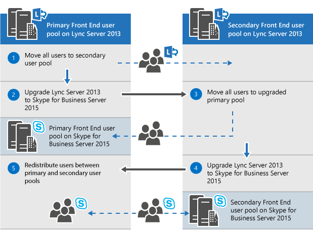

# Pianificare l'aggiornamento a Skype for Business Server 2015
 
Riepilogo: informazioni sugli aspetti da considerare quando si pianifica un aggiornamento a Skype for Business Server 2015.
  
Nell'ambito del piano di aggiornamento a Skype for Business Server 2015, usare questo argomento per comprendere i percorsi di aggiornamento consigliati per Skype for Business Server 2015, il funzionamento dell'aggiornamento In-Place, gli scenari di coesistenza supportati e l'aspetto del processo di aggiornamento.

> [!NOTE]
> Gli aggiornamenti sul posto erano disponibili in Skype for Business Server 2015, ma non sono più supportati in Skype for Business Server 2019. La coesistenza affiancata è supportata, vedere [Migrazione a Skype for Business Server 2019](../../SfBServer2019/migration/migration-to-skype-for-business-server-2019.md) per altre informazioni.
  
## Percorsi di aggiornamento consigliati per Skype for Business Server 2015

 Per eseguire l'aggiornamento da Lync Server 2013, Lync Server 2010 o Office Communications Server 2007 R2 a Skype for Business Server 2015, usare i percorsi di aggiornamento seguenti:
  
> [!CAUTION]
> In-Place Upgrade sposta automaticamente le directory conferenza da Lync Server 2013 a Skype for Business Server 2015. Tuttavia, se si prevede di spostare manualmente le directory conferenza, è molto importante usare Skype for Business Server 2015 Management Shell. Se si tenta di usare Lync Server 2013 Management Shell per spostare le directory delle conferenze da Lync Server 2013 a Skype for Business Server 2015, può verificarsi la perdita di dati. In generale, ogni volta che si lavora con Skype for Business Server 2015 in qualsiasi capacità, è necessario usare il set di strumenti Skype for Business Server 2015.  
  
|**Versione**|**Raccomandazioni**|
|:-----|:-----|
|Lync Server 2013    | Per eseguire l'aggiornamento, usare Skype for Business Server Generatore di topologie e la nuova funzionalità di aggiornamento In-Place in ognuno dei server associati al pool. Per i passaggi dettagliati, vedere [Pianificare l'aggiornamento da Lync Server 2013 a Skype for Business Server 2015](upgrade.md#BKMK_PlanUpgradeFromLync2013) e [Eseguire l'aggiornamento a Skype for Business Server 2015](../deploy/upgrade-to-skype-for-business-server.md).   |
|Lync Server 2010 + Lync Server 2013 (modalità doppia)    |Eseguire prima l'aggiornamento a Lync Server 2013 e quindi eseguire l'aggiornamento a Skype for Business Server 2015 usando la nuova funzionalità di aggiornamento In-Place. Tuttavia, se la topologia è Lync Server 2010 primaria, è anche possibile eseguire il rollback dei componenti di Lync Server 2013 in Lync Server 2010 e quindi eseguire l'aggiornamento direttamente a Skype for Business Server 2015. In questo caso non è possibile sfruttare i vantaggi dell'aggiornamento In-Place e usare la coesistenza diretta tra Lync Server 2010 e Skype for Business Server 2015. La triesistenza non è supportata, ma la coesistenza è supportata.    |
|Lync Server 2010    |Visualizzare un nuovo pool di Skype for Business Server 2015 e quindi eseguire la migrazione degli utenti a questo nuovo pool. È quindi possibile rimuovere il pool di Lync Server 2010 precedente. L'aggiornamento da Lync Server 2010 a Skype for Business Server 2015 è simile all'aggiornamento da Lync Server 2010 a Lync Server 2013. Vedere [Migrazione da Lync Server 2010 a Lync Server 2013](/previous-versions/office/lync-server-2013/migration-from-lync-server-2010-to-lync-server-2013).    |
|Office Communications Server 2007 R2    | Scegliere una delle due opzioni seguenti:    Configurare un nuovo ambiente Skype for Business Server 2015.    In alternativa, se l'hardware e il software soddisfano i requisiti per Skype for Business Server 2015, eseguire l'aggiornamento a Lync Server 2013 e quindi eseguire l'aggiornamento a Skype for Business Server 2015 usando la nuova funzionalità di aggiornamento In-Place. Per altre informazioni, vedere [Requisiti del server per Skype for Business Server 2015](requirements-for-your-environment/server-requirements.md) e [Migrazione da Office Communications Server 2007 R2 a Lync Server 2013](/previous-versions/office/lync-server-2013/migration-from-office-communications-server-2007-r2-to-lync-server-2013).    |
   
> [!NOTE]
> SQL Server 2014 è supportato in Skype for Business Server 2015, ma non è supportato in Lync Server 2013. Se si vuole eseguire l'aggiornamento da SQL Server 2012 a SQL Server 2014, è necessario aggiornare il pool a Skype for Business Server 2015 usando il metodo di aggiornamento In-Place come descritto in questo documento. È quindi possibile eseguire l'aggiornamento da SQL Server 2012 a SQL Server 2014, vedere [Aggiornamento a SQL Server 2014](/sql/database-engine/install-windows/upgrade-sql-server?viewFallbackFrom=sql-server-2014). Per altre informazioni sui requisiti del database, vedere [Requisiti del server per Skype for Business Server 2015](requirements-for-your-environment/server-requirements.md). 
  
## Pianificare l'aggiornamento da Lync Server 2013 a Skype for Business Server 2015

È possibile aggiornare i sistemi Lync Server 2013 a Skype for Business Server 2015 usando la nuova funzionalità di aggiornamento In-Place. L'aggiornamento sul posto offre una soluzione con un clic che esegue il backup dei certificati, disinstalla i componenti del server, aggiorna i database locali e installa i ruoli Skype for Business Server 2015. L'aggiornamento sul posto cerca di mantenere gli investimenti esistenti in hardware e server, riducendo i costi complessivi per la distribuzione Skype for Business Server 2015.
  
> [!NOTE]
> In-Place Upgrade consente di usare lo stesso hardware durante l'aggiornamento a Skype for Business Server. Tuttavia, il riutilizzo dello stesso hardware non si traduce nella stessa capacità di prestazioni. Non è consigliabile prevedere che i caricamenti delle prestazioni per Lync Server 2013 e Skype for Business Server 2015 siano identici. 
  
> [!NOTE]
> In-Place'aggiornamento non supporta la disponibilità elevata o il ripristino di emergenza per Skype for Business Server. 
  
L'aggiornamento sul posto comporta la disconnettezione del pool di Lync Server 2013 e l'aggiornamento a un pool di Skype for Business Server 2015. 
  
### Creare un piano di aggiornamento In-Place

Creare un piano che includa:
  
1. Conoscenza della topologia corrente.
    
    > [!NOTE]
    > Assicurarsi di disinstallare lo strumento Amministrazione LRS per Lync Server 2013 prima di eseguire l'aggiornamento In-Place. Lo strumento di Amministrazione LRS per Lync Server 2013 non può coesistere con Skype for Business Server 2015. Dopo aver eseguito In-Place Upgrade installare il nuovo strumento di Amministrazione LRS. Per altre informazioni, vedere [Portale Web di amministrazione del sistema di Microsoft Lync Room per Skype for Business Server 2015](https://go.microsoft.com/fwlink/?LinkID=544807).
  
2. Pool primario per l'aggiornamento.
    
3. Sia che si aggiornino i database di archiviazione e monitoraggio o ne si creino di nuovi.
    
4. Il metodo di aggiornamento In-Place che verrà usato: Offline o Sposta utenti. Nell'ambito di Move Users sarà anche necessario eseguire la migrazione delle directory conferenza globali associate al pool primario. 
    
5. Un piano di comunicazione per gli utenti interessati.
    
6. Un piano di backup nel caso in cui gli aggiornamenti non riescano.
    
Tutti gli utenti che si trovano nel pool primario durante l'aggiornamento non potranno usare i servizi fino al completamento dell'aggiornamento. Se si dispone di un pool secondario funzionante, è possibile evitare di influire sugli utenti spostandoli nel pool secondario prima dell'aggiornamento. Dopo l'aggiornamento, spostare di nuovo gli utenti nel pool primario.
  
### Metodi di aggiornamento sul posto

Esistono due scenari per l'aggiornamento In-Place: 
  
- Il metodo Move User, che non richiede tempi di inattività per gli utenti. 
    
- Il metodo Offline, che richiede tempi di inattività.
    
È consigliabile pianificare un aggiornamento del metodo offline durante una finestra di manutenzione e gli utenti ricevono una notifica del tempo di inattività.
  
> [!NOTE]
> Quando si aggiorna un pool associato in Lync Server 2013 e si vuole aggiornare entrambi i pool a Skype for Business Server 2015. Assicurarsi di aggiornare il secondo pool immediatamente dopo l'aggiornamento del primo pool. Quando un pool esegue Lync Server 2013 e il secondo è in esecuzione Skype for Business Server 2015, le opzioni di ripristino di emergenza vengono ridotte al minimo. Ad esempio, se un pool è in esecuzione 2013 e il secondo è 2015 e si verifica un'emergenza, è possibile che si verifichi una perdita di dati perché il failover del pool non è supportato in modalità di emergenza quando i pool abbinati non sono la stessa versione. 
  
#### Metodo offline per l'aggiornamento sul posto

Usare questo metodo se non si vuole spostare gli utenti tra pool di utenti. Durante l'aggiornamento, gli utenti non potranno usare Lync o Skype for Business servizi. 
  
Il diagramma seguente illustra una panoramica di questo processo.
  

  
> [!NOTE]
> Se sono presenti pool associati, non separarli prima dell'aggiornamento. 
  
Dopo aver avviato l'aggiornamento di un pool di server, è necessario completare l'aggiornamento dell'intero pool. Skype for Business Server non supporta l'aggiornamento di una sola parte del pool. 
  
#### Metodo Move Users (nessun tempo di inattività utente)

Per usare questo metodo, spostare gli utenti in un altro pool prima di avviare l'aggiornamento. Durante l'aggiornamento, gli utenti possono usare i servizi Lync. Dopo essere stati spostati nel pool aggiornato, possono usare Skype for Business. Il diagramma seguente illustra una panoramica di questo processo.
  
> [!IMPORTANT]
> Nell'ambito di Move Users sarà anche necessario eseguire la migrazione delle directory conferenza globali associate al pool primario. I servizi di conferenza telefonica con accesso esterno PSTN risolveranno comunque ConferenceID nel pool in fase di aggiornamento, anziché nel pool associato. È quindi necessario spostare le directory conferenza, se si vuole comunque che le conferenze PSTN pianificate nel pool siano accessibili durante l'aggiornamento. 
  

  
#### Spostare gli utenti per l'aggiornamento hardware

 Se l'hardware non soddisfa i [requisiti del server per Skype for Business Server 2015](requirements-for-your-environment/server-requirements.md), configurare un nuovo ambiente Skype for Business Server 2015 e spostare gli utenti in tale ambiente. Il diagramma seguente illustra una panoramica di questo processo per l'aggiornamento da Lync Server 2010. 
  

  
### Processo di aggiornamento sul posto

 Eseguire l'aggiornamento da Lync Server 2013 a Skype for Business Server 2015 seguendo questa procedura:
  
1. Eseguire il backup di tutti i database prima dell'aggiornamento.
    
2. Assicurarsi che tutti i servizi da aggiornare siano in esecuzione.
    
3. Aggiornare e pubblicare il file di topologia usando il generatore di topologie.
    
4. Arrestare tutti i servizi in tutti i server Front End.
    
5. Installare i nuovi prerequisiti necessari per Skype for Business Server.
    
6. In ogni server Front End avviare l'aggiornamento In-Place.
    
7. Al termine dell'aggiornamento, riavviare tutti i servizi.
    
   - Per il pool Front End, riavviare i servizi usando il comando Start-CsPool.
    
   - Per i server non Front End, usare Start-CSWindowsService.
    
> [!NOTE]
>  Se non si vuole aggiornare i database di archiviazione e monitoraggio esistenti, rimuovere la dipendenza prima di aggiornare la topologia. Se si desidera creare nuovi database di archiviazione e monitoraggio, durante l'aggiornamento è possibile creare un nuovo archivio SQL e associarlo al pool. Per informazioni su come eseguire questa operazione, vedere [l'argomento Upgrade to Skype for Business Server 2015 (Eseguire l'aggiornamento a Skype for Business Server 2015](../deploy/upgrade-to-skype-for-business-server.md)). > l'aggiornamento sul posto non supporta la disponibilità elevata o il ripristino di emergenza per Skype for Business Server. Per evitare di interrompere i servizi degli utenti, usare il [metodo Move Users (nessun tempo di inattività dell'utente)](upgrade.md#bkmk_MoveUsersMethod) per aggiornare.> Durante il processo di aggiornamento la replica xds viene inserita nella cartella condivisa locale nell'unità disco con lo spazio disponibile maggiore. Se il disco viene rimosso in un secondo momento, è possibile riscontrare problemi come i servizi che non vengono avviati.
  
### Ordine di aggiornamento

Aggiornare la topologia dall'interno all'esterno. Aggiornare prima tutti i pool, quindi i server perimetrali e infine il pool dell'archivio di gestione centrale . 
  
### Considerazioni sull'autenticazione Kerberos

Se si usa l'autenticazione Kerberos per i servizi Web, è necessario riassegnare gli account Kerberos e reimpostare la password al termine dell'aggiornamento In-Place. Per informazioni su come eseguire questa operazione, vedere [Configurazione dell'autenticazione Kerberos](/previous-versions/office/lync-server-2013/lync-server-2013-setting-up-kerberos-authentication).
  
## Supporto per la coesistenza con Lync Server 2013 e Lync Server 2010

È possibile eseguire Skype for Business Server 2015 nella stessa topologia di Lync Server 2013 o Lync Server 2010, ma non è possibile avere tutti e tre nella stessa topologia.
  
Se si ha una coesistenza tra Lync Server 2010 e Lync Server 2013, è consigliabile aggiornare l'intera topologia a Lync Server 2013 e quindi eseguire l'aggiornamento a Skype for Business Server 2015 usando l'aggiornamento In-Place. Per altre informazioni, vedere [Migrazione da Lync Server 2010 a Lync Server 2013](/previous-versions/office/lync-server-2013/migration-from-lync-server-2010-to-lync-server-2013).
  
Se la topologia è principalmente Lync Server 2010, eseguire il rollback dei componenti di Lync Server 2013 a Lync Server 2010 prima di aggiornare la topologia a Skype for Business Server 2015. In questo caso, si perde il vantaggio dell'aggiornamento In-Place e si ha una topologia di coesistenza tra Lync Server 2010 e Skype for Business Server 2015.
  
Il diagramma seguente illustra il supporto della coesistenza di Skype for Business Server 2015 con Lync Server 2013 e Lync Server 2010.
  

  
## Processo di aggiornamento con Survivable Branch Appliance e server esistenti

Skype for Business Server 2015 non supporta un aggiornamento In-Place di un'appliance SBA (Survivable Branch Appliance) o di un survivable Branch Server (SBS).
  
Tuttavia, è supportata la coesistenza di Skype for Business Server data center con Lync Server 2010 o Lync Server 2013 SBA/SBS. 
  
Quando si pianifica un aggiornamento In-Place di un pool Front End (FE) di Lync Server 2013 con un ramo associato, è possibile lasciare gli utenti esistenti in Lync Server 2013 SBA/SBS. Durante l'aggiornamento, gli utenti SBA/SBS passeranno alla modalità di resilienza e torneranno alla normale funzionalità al termine dell'aggiornamento. Per altre informazioni sull'esperienza degli utenti durante la modalità di resilienza, vedere [Funzionalità di resilienza del sito di succursale in Lync Server 2013](/previous-versions/office/lync-server-2013/lync-server-2013-branch-site-resiliency-features).
  
Quando si esegue la migrazione di una topologia di Lync Server 2010 a Skype for Business Server 2015, è necessario aggiungere SBA/SBS alla topologia, in modo analogo alla migrazione a Lync Server 2013. Per i passaggi necessari, vedere [Connessione di Survivable Branch Appliance al pool Front End di Lync Server 2013](/previous-versions/office/lync-server-2013/lync-server-2013-connecting-survivable-branch-appliance-to-lync-server-2013-front-end-pool).
  
Per le topologie di coesistenza di Lync Server 2010 e Lync Server 2013, allinearsi prima di tutto alle raccomandazioni riportate nella sezione "Supporto per la coesistenza con Lync Server 2013 e Lync Server 2010".
  
## Vedere anche

[Aggiornamento a Skype for Business Server 2015](../deploy/upgrade-to-skype-for-business-server.md)
  
[Requisiti ambientali per Skype for Business Server 2015](requirements-for-your-environment/environmental-requirements.md)
  
[Requisiti del server per Skype for Business Server 2015](requirements-for-your-environment/server-requirements.md)
