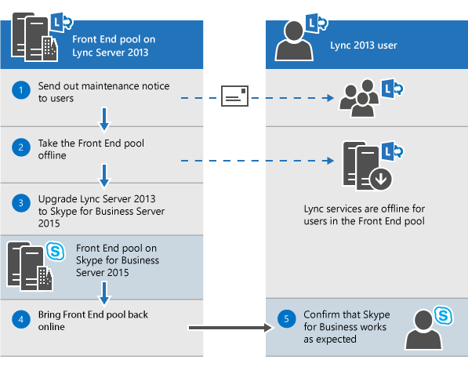

# Pianificare l'aggiornamento a Skype for Business Server 2015
 
Riepilogo: informazioni sulle considerazioni da tenere in considerazione quando si pianifica un aggiornamento a Skype for Business Server 2015. Scaricare una versione di valutazione gratuita di Skype for Business Server 2015 presso Microsoft Evaluation Center all' [https://www.microsoft.com/evalcenter/evaluate-skype-for-business-server](https://www.microsoft.com/evalcenter/evaluate-skype-for-business-server)Indirizzo:.
  
Come parte del piano per l'aggiornamento a Skype for Business Server 2015, usare questo argomento per comprendere i percorsi di aggiornamento consigliati per Skype for Business Server 2015, come funziona l'aggiornamento sul posto, quali sono gli scenari di coesistenza supportati e il processo di aggiornamento aspetto.

> [!NOTE]
> Gli aggiornamenti sul posto sono disponibili in Skype for Business Server 2015, ma non sono più supportati in Skype for Business Server 2019. La coesistenza affiancata è supportata, vedere [migrazione a Skype for Business Server 2019](../../SfBServer2019/migration/migration-to-skype-for-business-server-2019.md) per altre informazioni.
  
## Percorsi di aggiornamento consigliati per Skype for Business Server 2015

 Per eseguire l'aggiornamento da Lync Server 2013, Lync Server 2010 o Office Communications Server 2007 R2 a Skype for Business Server 2015, usare i percorsi di aggiornamento seguenti:
  
> [!CAUTION]
> L'aggiornamento sul posto sposta automaticamente le directory delle conferenze da Lync Server 2013 a Skype for Business Server 2015. Tuttavia, se si prevede di trasferire manualmente le directory conferenza, è molto importante usare Skype for Business Server 2015 Management Shell. Se si prova a usare Lync Server 2013 Management Shell per trasferire le directory di conferenza da Lync Server 2013 a Skype for Business Server 2015, è possibile che si verifichi una perdita di dati. In generale, ogni volta che si usa Skype for Business Server 2015 in qualsiasi capacità, è necessario usare lo strumento Skype for Business Server 2015 set.  
  
|**Versione**|**Raccomandazioni**|
|:-----|:-----|
|Lync Server 2013    | Per eseguire l'aggiornamento, usare il generatore di topologia di Skype for Business Server e la nuova funzionalità di aggiornamento sul posto in ognuno dei server associati al pool. vedere [pianificare l'aggiornamento da Lync server 2013 a Skype for Business server 2015](upgrade.md#BKMK_PlanUpgradeFromLync2013) e [eseguire l'aggiornamento a Skype for Business Server 2015](../deploy/upgrade-to-skype-for-business-server.md) per la procedura dettagliata.   |
|Lync Server 2010 + Lync Server 2013 (modalità duale)    |Prima di tutto, eseguire l'aggiornamento a Lync Server 2013 e quindi eseguire l'aggiornamento a Skype for Business Server 2015 usando la nuova funzionalità di aggiornamento sul posto. Tuttavia, se la topologia è primaria Lync Server 2010, è anche possibile eseguire il rollback dei componenti di Lync Server 2013 in Lync Server 2010 e quindi eseguire l'aggiornamento direttamente a Skype for Business Server 2015. In questo caso non è possibile sfruttare l'aggiornamento sul posto e usare una coesistenza diritta tra Lync Server 2010 e Skype for Business Server 2015. La triplice esistenza non è supportata, ma è supportata la coesistenza.    |
|Lync Server 2010    |Aprire un nuovo pool di Skype for Business Server 2015 e quindi eseguire la migrazione degli utenti a questo nuovo pool. È quindi possibile rimuovere la Commissione dal vecchio pool di Lync Server 2010. L'aggiornamento da Lync Server 2010 a Skype for Business Server 2015 è simile all'aggiornamento da Lync Server 2010 a Lync Server 2013. Vedere [migrazione da Lync server 2010 a Lync server 2013](https://go.microsoft.com/fwlink/p/?LinkId=526615).    |
|Office Communications Server 2007 R2    | Selezionare una delle due opzioni seguenti:    Configurare un nuovo ambiente di 2015 per Skype for Business Server.    Oppure, se l'hardware e il software soddisfano i requisiti per Skype for Business Server 2015, eseguire l'aggiornamento a Lync Server 2013 e quindi eseguire l'aggiornamento a Skype for Business Server 2015 usando la nuova funzionalità di aggiornamento sul posto. Per altre informazioni, vedere [requisiti del server per Skype for Business server 2015](requirements-for-your-environment/server-requirements.md) e [migrazione da Office Communications Server 2007 R2 a Lync Server 2013](https://go.microsoft.com/fwlink/p/?LinkId=526616).    |
   
> [!NOTE]
> SQL Server 2014 è supportato in Skype for Business Server 2015, ma non è supportato in Lync Server 2013. Se si vuole eseguire l'aggiornamento da SQL Server 2012 a SQL Server 2014, il pool deve prima essere aggiornato a Skype for Business Server 2015 usando il metodo di aggiornamento sul posto, come descritto in questo documento. È quindi possibile eseguire l'aggiornamento da SQL Server 2012 a SQL Server 2014, vedere [eseguire l'aggiornamento a SQL server 2014](https://msdn.microsoft.com/en-us/library/bb677622%28v=sql.120%29.aspx). Per altre informazioni sui requisiti di database, vedere [requisiti del server per Skype for Business server 2015](requirements-for-your-environment/server-requirements.md). 
  
## Pianificare l'aggiornamento da Lync Server 2013 a Skype for Business Server 2015

È possibile aggiornare i sistemi Lync Server 2013 a Skype for Business Server 2015 usando la nuova funzionalità di aggiornamento sul posto. L'aggiornamento sul posto offre una soluzione con un solo clic che consente di eseguire il backup dei certificati, di disinstallare i componenti del server, di aggiornare i database locali e di installare i ruoli di Skype for Business Server 2015. L'aggiornamento sul posto cerca di preservare gli investimenti hardware e server esistenti, riducendo il costo complessivo per la distribuzione di Skype for Business Server 2015.
  
> [!NOTE]
> L'aggiornamento sul posto consente di usare lo stesso hardware quando si esegue l'aggiornamento a Skype for Business Server. Tuttavia, il riutilizzo dello stesso hardware non si traduce nella stessa capacità di prestazioni. Non è necessario prevedere che i carichi di prestazioni per Lync Server 2013 e Skype for Business Server 2015 siano identici. 
  
> [!NOTE]
> L'aggiornamento sul posto non supporta la disponibilità elevata o il ripristino di emergenza per Skype for Business Server. 
  
L'aggiornamento sul posto implica l'uso del pool di Lync Server 2013 offline e l'aggiornamento a un pool di Skype for Business Server 2015. 
  
### Creare un piano di aggiornamento sul posto

Creare un piano che includa:
  
1. Informazioni sulla topologia corrente.
    
    > [!NOTE]
    > Assicurarsi di disinstallare lo strumento di amministrazione di LRS per Lync Server 2013 prima di eseguire l'aggiornamento sul posto. Lo strumento di amministrazione di LRS per Lync Server 2013 non può coesistere con Skype for Business Server 2015. Dopo aver eseguito l'aggiornamento sul posto, installare il nuovo strumento di amministrazione di LRS. Per altre informazioni, vedere [Microsoft Lync room System Administrative Web Portal per Skype for Business Server 2015](https://go.microsoft.com/fwlink/?LinkID=544807) .
  
2. Il pool principale per l'aggiornamento.
    
3. Se è possibile aggiornare i database di archiviazione e monitoraggio o crearne di nuovi.
    
4. Metodo di aggiornamento sul posto che verrà usato: offline o Sposta utenti. Come parte degli utenti di spostare è anche necessario eseguire la migrazione delle directory conferenza globale associate al pool principale. 
    
5. Un piano di comunicazione per gli utenti interessati.
    
6. Piano di backup in caso di esito negativo degli aggiornamenti.
    
Tutti gli utenti che si trovano nel pool principale durante l'aggiornamento non saranno in grado di usare i servizi fino al completamento dell'aggiornamento. Se si ha un pool secondario funzionante, è possibile evitare di impattare gli utenti spostandoli nel pool secondario prima dell'aggiornamento. Dopo l'aggiornamento, riportare gli utenti nel pool principale.
  
### Metodi di aggiornamento sul posto

Esistono due scenari per l'aggiornamento sul posto: 
  
- Il metodo Move User, che non richiede downtime per gli utenti. 
    
- Il metodo offline, che richiede tempi di inattività.
    
È consigliabile pianificare un aggiornamento del metodo offline durante una finestra di manutenzione e gli utenti ricevono una notifica del tempo di inattività.
  
> [!NOTE]
> Quando si aggiorna un pool associato in Lync Server 2013 e si vogliono aggiornare entrambi i pool a Skype for Business Server 2015. Assicurarsi di aggiornare il secondo pool subito dopo l'aggiornamento del primo pool. Quando un pool esegue Lync Server 2013 e il secondo pool esegue Skype for Business Server 2015, le opzioni di ripristino di emergenza sono ridotte a icona. Ad esempio, se un pool esegue 2013 e il secondo è 2015 ed è presente un disastro, è possibile che si verifichino perdite di dati perché il failover del pool non è supportato in modalità di emergenza quando i pool associati non sono della stessa versione. 
  
#### Metodo offline di aggiornamento sul posto

Usa questo metodo se non vuoi trasferire gli utenti tra i pool di utenti. Durante l'aggiornamento gli utenti non potranno usare i servizi Lync o Skype for business. 
  
Il diagramma seguente mostra una panoramica di questo processo.
  

  
> [!NOTE]
> Se si hanno pool associati, non disassociarli prima dell'aggiornamento. 
  
Quando si avvia l'aggiornamento di un pool di server, è necessario completare l'aggiornamento dell'intero pool. Skype for Business Server non supporta l'aggiornamento di una parte del pool. 
  
#### Metodo Move users (nessun tempo di inattività dell'utente)

Per usare questo metodo, è possibile trasferire gli utenti in un altro pool prima di avviare l'aggiornamento. Durante l'aggiornamento, gli utenti possono usare i servizi Lync. Dopo essere stati spostati nel pool aggiornato, possono usare Skype for business. Il diagramma seguente mostra una panoramica di questo processo.
  
> [!IMPORTANT]
> Come parte degli utenti di spostare è anche necessario eseguire la migrazione delle directory conferenza globale associate al pool principale. I servizi di conferenza telefonica con accesso esterno PSTN verranno comunque risolti ConferenceID al pool da aggiornare, invece del pool associato. È quindi necessario trasferire le directory conferenza, se si vuole che le conferenze PSTN programmate nel pool siano accessibili durante l'aggiornamento. 
  

  
#### Trasferire gli utenti per l'aggiornamento hardware

 Se l'hardware non soddisfa i [requisiti del server per Skype for Business server 2015](requirements-for-your-environment/server-requirements.md), configurare un nuovo ambiente di Skype for business server 2015 e trasferire gli utenti. Il diagramma seguente mostra una panoramica di questo processo per l'aggiornamento da Lync Server 2010. 
  

  
### Processo di aggiornamento sul posto

 Eseguire l'aggiornamento da Lync Server 2013 a Skype for Business Server 2015 usando la procedura seguente:
  
1. Eseguire il backup di tutti i database prima dell'aggiornamento.
    
2. Verificare che tutti i servizi da aggiornare siano in uno stato in corso.
    
3. Aggiornare e pubblicare il file della topologia usando il generatore di topologie.
    
4. Arrestare tutti i servizi in tutti i server front-end.
    
5. Installare nuovi prerequisiti necessari per Skype for Business Server.
    
6. In ogni server front-end avviare l'aggiornamento sul posto.
    
7. Al termine dell'aggiornamento, riavviare tutti i servizi.
    
   - Per il pool Front-End, riavviare i servizi usando il comando Start-CsPool.
    
   - Per i server non front-end, usare Start-CSWindowsService.
    
> [!NOTE]
>  Se non si vuole aggiornare i database di archiviazione e monitoraggio esistenti, rimuovere la dipendenza prima di eseguire l'aggiornamento della topologia. Se si vogliono creare nuovi database di archiviazione e monitoraggio durante l'aggiornamento, è possibile creare un nuovo archivio SQL e associarlo al pool. Per informazioni su come eseguire questa procedura, eseguire l'[aggiornamento a Skype for Business Server 2015](../deploy/upgrade-to-skype-for-business-server.md). > aggiornamento sul posto non supporta la disponibilità elevata o il ripristino di emergenza per Skype for Business Server. Per evitare di interrompere i servizi degli utenti, usare il [Metodo Move users (nessun tempo di inattività dell'utente)](upgrade.md#bkmk_MoveUsersMethod) per l'aggiornamento. > durante il processo di aggiornamento la xds-replica viene inserita nella cartella condivisa locale nell'unità disco con lo spazio più libero. Se il disco viene rimosso in seguito, è possibile eseguire problemi come i servizi non avviati.
  
### Ordine di aggiornamento

Aggiornare la topologia dall'interno all'esterno. Aggiornare innanzitutto tutti i pool, quindi gli Edge Server e infine il pool di Central Management store (CMS). 
  
### Considerazioni sull'autenticazione Kerberos

Se si usa l'autenticazione Kerberos per i servizi Web, è necessario riassegnare gli account Kerberos e reimpostare la password dopo il completamento dell'aggiornamento sul posto. Per informazioni su come eseguire questa operazione, vedere [configurazione dell'autenticazione Kerberos](https://go.microsoft.com/fwlink/p/?LinkId=530342).
  
## Supporto per la coesistenza con Lync Server 2013 e Lync Server 2010

È possibile eseguire Skype for Business Server 2015 nella stessa topologia di Lync Server 2013 o Lync Server 2010, ma non è possibile avere tutti e tre nella stessa topologia.
  
Se si ha una coesistenza tra Lync Server 2010 e Lync Server 2013, è consigliabile aggiornare l'intera topologia a Lync Server 2013 e quindi eseguire l'aggiornamento a Skype for Business Server 2015 con l'aggiornamento sul posto. Per altre informazioni, vedere [migrazione da Lync server 2010 a Lync server 2013](https://go.microsoft.com/fwlink/p/?LinkId=526615).
  
Se la topologia è principalmente Lync Server 2010, eseguire il rollback dei componenti di Lync Server 2013 a Lync Server 2010 prima di aggiornare la topologia a Skype for Business Server 2015. In questo caso si perdono i vantaggi dell'aggiornamento sul posto e si ha una topologia di coesistenza tra Lync Server 2010 e Skype for Business Server 2015.
  
Il diagramma seguente mostra il supporto della coesistenza di Skype for Business Server 2015 con Lync Server 2013 e Lync Server 2010.
  

  
## Processo di aggiornamento con l'appliance e il server Survivable Branch esistenti

Skype for Business Server 2015 non supporta un aggiornamento sul posto di un Survivable Branch Appliance (SBA) o di un Survivable Branch Server (SBS).
  
Tuttavia, sosteniamo la coesistenza dei datacenter di Skype for Business Server con Lync Server 2010 o Lync Server 2013 SBA/SBS. 
  
Quando si pianifica un aggiornamento sul posto di un pool FE (front end) di Lync Server 2013 con un ramo associato, è possibile lasciare gli utenti esistenti su Lync Server 2013 SBA/SBS. Durante l'aggiornamento, gli utenti di SBA/SBS andranno in modalità resilienza e torneranno alle normali funzionalità dopo il completamento dell'aggiornamento. Per altre informazioni sull'esperienza degli utenti durante la modalità di resilienza, vedere [funzionalità di resilienza dei siti secondari in Lync Server 2013](https://technet.microsoft.com/library/gg398715.aspx).
  
Quando si esegue la migrazione di una topologia di Lync Server 2010 a Skype for Business Server 2015, l'SBA/SBS deve essere aggiunto di nuovo alla topologia, in modo analogo alla migrazione a Lync Server 2013. Per i passaggi necessari, leggere [connessione di Survivable Branch Appliance a Lync Server 2013 front-end pool](https://technet.microsoft.com/library/jj688026.aspx).
  
Per le topologie di coesistenza di Lync Server 2010 e Lync Server 2013, allineare prima di tutto le raccomandazioni fornite nella sezione "supporto per la coesistenza con Lync Server 2013 e Lync Server 2010".
  
## Vedere anche

[Aggiornamento a Skype for Business Server 2015](../deploy/upgrade-to-skype-for-business-server.md)
  
[Requisiti ambientali di Skype for Business Server 2015](requirements-for-your-environment/environmental-requirements.md)
  
[Requisiti server di Skype for Business Server 2015](requirements-for-your-environment/server-requirements.md)
