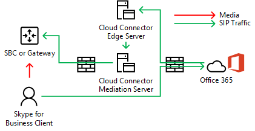

# Pianificare il bypass multimediale in Cloud Connector Edition
 
Leggere questo argomento per esaminare le considerazioni sulla pianificazione per l'implementazione di bypass multimediale con Cloud Connector Edition versione 2,0 e versioni successive. Per informazioni sulla distribuzione di bypass multimediale, vedere [deploy media bypass in Cloud Connector Edition](deploy-media-bypass-in-cloud-connector.md).
  
Il bypass multimediale consente a un client di inviare contenuti multimediali direttamente alla rete PSTN (Public Switched Telephone Network), ovvero a un gateway o a un session border controller (SBC), ed eliminare il componente cloud Connector Edition dal percorso multimediale.
  
Il bypass multimediale può migliorare la qualità vocale riducendo la latenza, la possibilità di perdita di pacchetti e il numero di punti di potenziale errore. L'eliminazione dell'elaborazione multimediale per le chiamate bypassate riduce il carico sul connettore Cloud, che consente un numero maggiore di chiamate simultanee e può migliorare la scalabilità. 
  
 La liberazione del connettore cloud dalle attività di elaborazione dei contenuti multimediali può ridurre il numero di dispositivi cloud Connector necessari per un'infrastruttura, pertanto è necessario abilitare il bypass multimediale quando possibile.
  
## Come il bypass multimediale influisce sui percorsi di segnalazione e media

Mentre la segnalazione prende lo stesso percorso con o senza bypass multimediale, il flusso multimediale differisce. Nei diagrammi seguenti vengono illustrati i percorsi multimediali e di segnalazione nelle topologie con e senza bypass multimediale. 
  
Ad esempio, nella topologia seguente, che non utilizza il bypass multimediale, un client Skype for business inserisce una chiamata PSTN su un numero esterno, la segnalazione SIP passa a Office 365 e Office 365 quindi indirizza il traffico di segnalazione in base alla voce dell'utente finale. politica. Per gli utenti dei connettori cloud, i criteri vocali indirizzano il traffico di segnalazione al server perimetrale del connettore Cloud, che instrada il traffico di segnalazione a un SBC (Session Border Controller) PSTN o a un gateway tramite il Cloud Connector Mediation Server. I flussi multimediali dal client Skype for business al Cloud Connector Mediation Server e quindi a SBC o gateway, come illustrato nel diagramma seguente:
  
**Percorsi multimediali e di segnalazione senza bypass multimediale**

  
Una chiamata in ingresso dalla rete PSTN utilizza lo stesso percorso di segnalazione nella direzione inversa. Per gli utenti interni, il contenuto multimediale continuerà a essere eseguito tra il client Skype for business e il Cloud Connector Mediation Server e quindi l'SBC o il gateway.
  
Nella topologia successiva, che utilizza il bypass multimediale, la segnalazione ha lo stesso percorso, ma i flussi multimediali passano direttamente tra il client Skype for business e il server SBC o il gateway, come illustrato nel diagramma seguente:
  
**Percorsi multimediali e di segnalazione con bypass multimediale**

  
## Scenario multi-sito e bypass multimediale

Il bypass multimediale è utile anche quando si desidera fornire servizi di telefonia a più siti utilizzando un singolo accessorio Cloud Connector. Poiché il connettore Cloud non è in grado di eseguire il routing delle chiamate in base ai numeri di origine o di destinazione, la maggior parte delle aziende distribuisce un SBC o Gateway Cloud Connector per prendere decisioni Il bypass multimediale in questo scenario consente di eliminare l'hop tra il client e il SBC centrale o il gateway, come illustrato nel diagramma seguente:
  
**Applicazione multisito**

  
1. Il traffico SIP scorre dall'utente di Zurigo a Office 365.
    
2. Il traffico viene quindi indirizzato all'appliance del connettore Cloud di Amsterdam come specificato nel criterio di routing vocale dell'utente.
    
3. L'appliance Cloud Connector di Amsterdam invia il traffico SIP al gateway centrale di Amsterdam.
    
4. Il gateway centrale di Amsterdam prende le decisioni di routing appropriate e quindi invia il traffico a un SBC o a un gateway di Zurigo, mentre i flussi multimediali passano direttamente tra il client Skype for business e il SBC o il gateway di Amsterdam.
    
   Questo approccio consente di servire più utenti per una distribuzione del connettore Cloud in cui il connettore Cloud è centralizzato. Anche se il connettore Cloud viene eliminato dal percorso multimediale, in un supporto di scenari multisito centralizzato potrebbe continuare a attraversare la WAN due volte per passare attraverso il server SBC o il gateway centralizzato.
  
Se un client si trova all'esterno della rete aziendale che effettua una chiamata in uscita, il traffico multimediale scorre tramite i server Edge e Mediation del connettore Cloud e del collegamento WAN tra Zurigo e Amsterdam, come illustrato nel diagramma seguente:
  

  
## Client supportati per il bypass multimediale

Con la prima versione di bypass multimediale, l'unico client supportato è il client Skype for business 2016 Windows che fa parte di Office 365 ProPlus, Version 16.0.7870.2020 o versione successiva. I clienti possono utilizzare qualsiasi canale: deferred Current, posticipated o First release. 
  
> [!NOTE]
> Se si usa una soluzione VPN client in combinazione con il client Skype for business, il bypass multimediale è supportato solo con una configurazione di Split-tunnel VPN. 
  
Per ulteriori informazioni sui canali di rilascio, vedere [Overview of Update channels for Office 365 ProPlus](https://support.office.com/article/Overview-of-update-channels-for-Office-365-ProPlus-9ccf0f13-28ff-4975-9bd2-7e4ea2fefef4?ui=en-US&amp;rs=en-US&amp;ad=US).
  
Per la versione finale corrente dei client in canali diversi, vedere [release information for Updates to Office 365 ProPlus](https://docs.microsoft.com/officeupdates/release-notes-office365-proplus). 
  
## Considerazioni sulla capacità dei connettori cloud con bypass multimediale

Senza bypass multimediale e, a seconda dell'hardware, un dispositivo Cloud Connector può gestire da 50 a 500 chiamate simultanee che richiedono il supporto per l'attraversamento di un Mediation Server. Per ulteriori informazioni, vedere [Piano per Skype for Business Cloud Connector Edition](https://technet.microsoft.com/library/mt605227.aspx). 
  
Con il bypass multimediale abilitato, i client interni sulla versione supportata non utilizzano Mediation Server, quindi il numero di client interni può aumentare significativamente. 
  
Come indicato in questo esempio, i client esterni o i client non supportati utilizzeranno il server perimetrale dei connettori cloud e i Mediation per i file multimediali. Quando si calcola il numero di dispositivi di connettori cloud che devono essere inseriti in un sito, è necessario tenere in considerazione il traffico proveniente da utenti esterni e utenti su client non supportati.
  
## Il connettore Cloud supporta sempre la modalità bypass

Il connettore Cloud supporta sempre solo la modalità bypass. Negli ambienti locali sono disponibili due opzioni: Ignora sempre e utilizza le informazioni relative a siti e aree geografiche.
  
Ignora sempre significa che il bypass multimediale verrà tentato per tutte le chiamate PSTN con client interni come punto di origine o di destinazione. Per determinare se il client è interno o esterno, viene utilizzato un sito Web nella macchina virtuale Mediation Server. Se il client è in grado di raggiungere il sito, viene considerato interno e viene utilizzato il bypass multimediale. Se il client non è in grado di raggiungere il sito, ad esempio il client è in una rete domestica, non viene utilizzato il bypass multimediale. 
  
Sempre il bypass richiede la connettività non ostruita tra gli utenti e i gateway PSTN all'interno di un sito PSTN. 
  
Per ulteriori informazioni, vedere [Piano per Skype for Business Cloud Connector Edition](https://technet.microsoft.com/library/mt605227.aspx). 
  
Ad esempio, nel diagramma seguente, gli utenti di Europe devono essere ben connessi ai tre session border controller (SBCs) di Amsterdam, mentre gli utenti degli Stati Uniti occidentali devono essere ben connessi alle due SBCs di Seattle. Ben connesso significa che si trovano nello stesso sito di rete di SBCs o gateway o su collegamenti WAN con larghezza di banda adeguata.
  

  
> [!NOTE]
> Se un utente di Zurigo si reca all'ufficio di Seattle e si desidera utilizzare la rete interna per distribuire il traffico multimediale tra l'utente e i gateway di viaggio in Europa (anziché passare su Internet), è necessario assicurarsi che l'ufficio di Seattle e Amsterdam Office in cui si trovano i SBCs o i gateway europei qualificati come ben connessi. 
  
## Codec utilizzati nel bypass multimediale

Con il bypass multimediale abilitato, il traffico multimediale tra un client e un SBC o un gateway utilizza il codec G. 711. 
  
## Vedere anche

[Distribuire il bypass multimediale in Cloud Connector Edition](deploy-media-bypass-in-cloud-connector.md)
